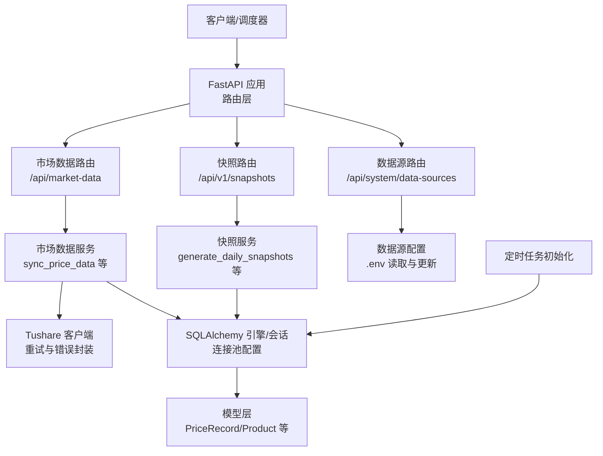
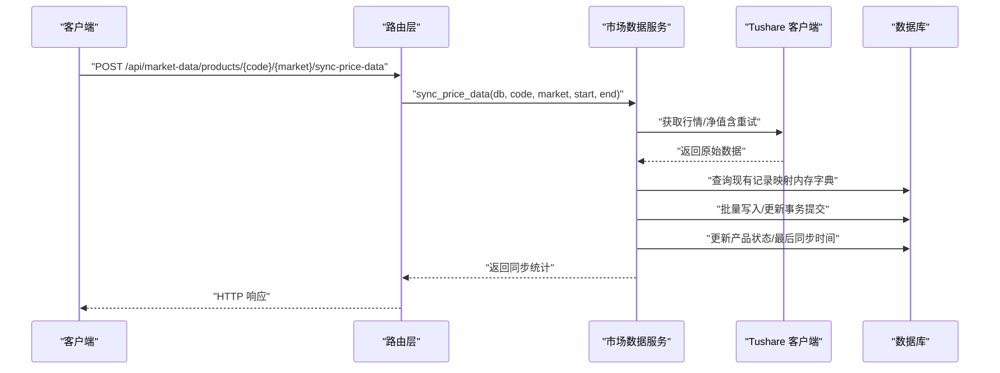
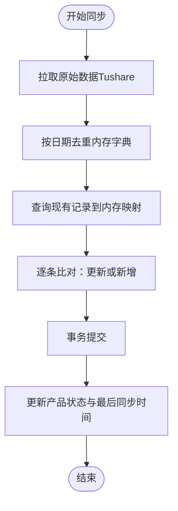
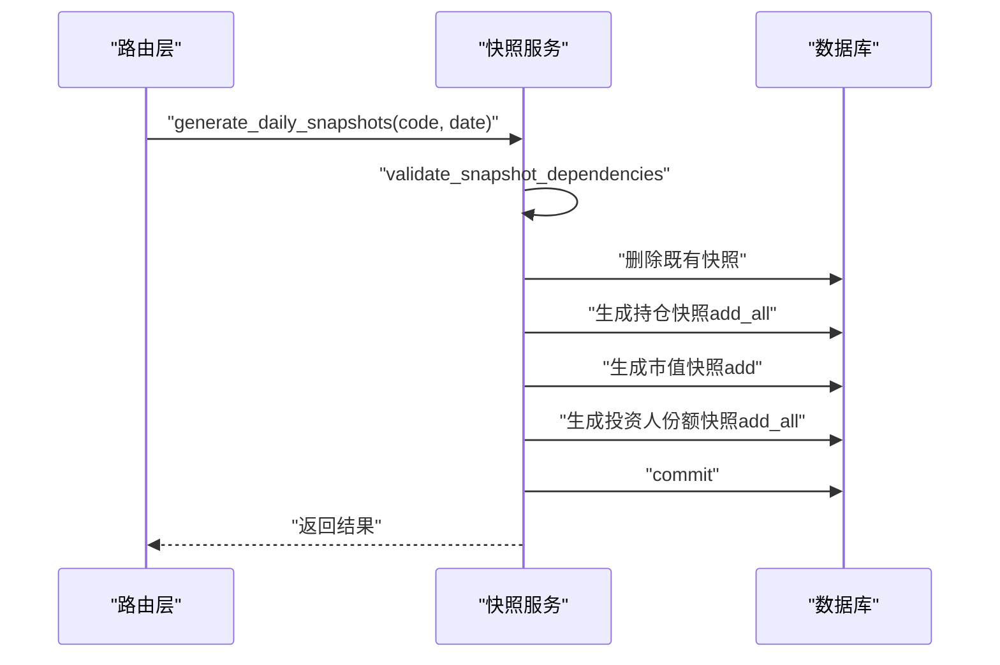
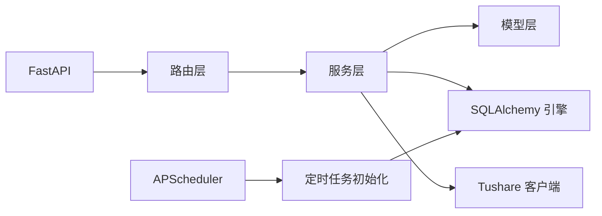

# 性能优化与并发控制

<cite>
**本文引用的文件**
- [backend/app/config.py](file://backend/app/config.py)
- [backend/app/database.py](file://backend/app/database.py)
- [backend/app/services/tushare_client.py](file://backend/app/services/tushare_client.py)
- [backend/app/services/market_data_service.py](file://backend/app/services/market_data_service.py)
- [backend/app/services/snapshot_service.py](file://backend/app/services/snapshot_service.py)
- [backend/app/routers/market_data.py](file://backend/app/routers/market_data.py)
- [backend/app/routers/snapshots.py](file://backend/app/routers/snapshots.py)
- [backend/app/routers/data_sources.py](file://backend/app/routers/data_sources.py)
- [backend/app/main.py](file://backend/app/main.py)
- [backend/app/init_tasks.py](file://backend/app/init_tasks.py)
- [backend/requirements.txt](file://backend/requirements.txt)
- [backend/app/models/price_record.py](file://backend/app/models/price_record.py)
- [backend/app/models/product.py](file://backend/app/models/product.py)
</cite>

## 目录
1. [简介](#简介)
2. [项目结构](#项目结构)
3. [核心组件](#核心组件)
4. [架构总览](#架构总览)
5. [详细组件分析](#详细组件分析)
6. [依赖分析](#依赖分析)
7. [性能考虑](#性能考虑)
8. [故障排查指南](#故障排查指南)
9. [结论](#结论)
10. [附录](#附录)

## 简介
本文件聚焦 InvestRing 的数据同步性能优化，围绕并发控制策略（线程池、连接池、资源限制）、批量处理与缓存、内存管理、API 频率限制与限流、性能监控与瓶颈识别、数据库连接与索引优化、查询调优、性能测试与容量规划以及高并发稳定性保障等方面进行系统化梳理与落地建议。内容以仓库现有实现为基础，结合可扩展性与工程实践给出优化路径。

## 项目结构
后端采用 FastAPI + SQLAlchemy 架构，路由层负责请求接入，服务层承载业务逻辑，模型层定义数据结构，数据库层提供连接池与会话管理。定时任务通过 APScheduler 初始化并持久化到数据库，确保关键任务（净值同步、交易日历同步、日志清理）的稳定执行。

**图表来源**
- [backend/app/main.py:1-53](file://backend/app/main.py#L1-L53)
- [backend/app/routers/market_data.py:1-112](file://backend/app/routers/market_data.py#L1-L112)
- [backend/app/routers/snapshots.py:1-188](file://backend/app/routers/snapshots.py#L1-L188)
- [backend/app/routers/data_sources.py:1-150](file://backend/app/routers/data_sources.py#L1-L150)
- [backend/app/services/market_data_service.py:1-323](file://backend/app/services/market_data_service.py#L1-L323)
- [backend/app/services/snapshot_service.py:1-789](file://backend/app/services/snapshot_service.py#L1-L789)
- [backend/app/services/tushare_client.py:1-222](file://backend/app/services/tushare_client.py#L1-L222)
- [backend/app/database.py:1-39](file://backend/app/database.py#L1-L39)
- [backend/app/models/price_record.py:1-28](file://backend/app/models/price_record.py#L1-L28)
- [backend/app/models/product.py:1-22](file://backend/app/models/product.py#L1-L22)
- [backend/app/init_tasks.py:1-45](file://backend/app/init_tasks.py#L1-L45)

**章节来源**
- [backend/app/main.py:1-53](file://backend/app/main.py#L1-L53)
- [backend/app/routers/market_data.py:1-112](file://backend/app/routers/market_data.py#L1-L112)
- [backend/app/routers/snapshots.py:1-188](file://backend/app/routers/snapshots.py#L1-L188)
- [backend/app/routers/data_sources.py:1-150](file://backend/app/routers/data_sources.py#L1-L150)
- [backend/app/services/market_data_service.py:1-323](file://backend/app/services/market_data_service.py#L1-L323)
- [backend/app/services/snapshot_service.py:1-789](file://backend/app/services/snapshot_service.py#L1-L789)
- [backend/app/services/tushare_client.py:1-222](file://backend/app/services/tushare_client.py#L1-L222)
- [backend/app/database.py:1-39](file://backend/app/database.py#L1-L39)
- [backend/app/models/price_record.py:1-28](file://backend/app/models/price_record.py#L1-L28)
- [backend/app/models/product.py:1-22](file://backend/app/models/product.py#L1-L22)
- [backend/app/init_tasks.py:1-45](file://backend/app/init_tasks.py#L1-L45)

## 核心组件
- 配置与环境
  - 通过设置类集中管理数据库连接串、Tushare Token、应用调试开关等，支持 LRU 缓存以降低重复解析开销。
- 数据库连接池
  - 使用 SQLAlchemy 引擎配置连接池大小、溢出、预检查、回收周期，并针对 SQLite 进行 WAL、busy_timeout、synchronous 参数优化。
- 市场数据服务
  - 提供价格数据查询、增量同步、组合净值同步；对 Tushare 接口调用进行重试与去重，内存中构建现有记录映射以提升写入效率。
- 快照服务
  - 生成/重算组合三表快照（持仓、市值、投资人份额），内置依赖校验、冻结份额计算与交易日判断。
- Tushare 客户端
  - 封装交易日历、场内/场外基金行情与净值接口，统一错误类型与指数退避重试。
- 路由层
  - 对外暴露市场数据同步、历史同步、组合净值同步、快照生成/重算/校验等接口。
- 定时任务
  - 初始化三个核心任务（净值同步、交易日历同步、日志清理），确保关键流程自动化。

**章节来源**
- [backend/app/config.py:1-37](file://backend/app/config.py#L1-L37)
- [backend/app/database.py:1-39](file://backend/app/database.py#L1-L39)
- [backend/app/services/market_data_service.py:88-225](file://backend/app/services/market_data_service.py#L88-L225)
- [backend/app/services/snapshot_service.py:24-94](file://backend/app/services/snapshot_service.py#L24-L94)
- [backend/app/services/tushare_client.py:48-121](file://backend/app/services/tushare_client.py#L48-L121)
- [backend/app/routers/market_data.py:43-112](file://backend/app/routers/market_data.py#L43-L112)
- [backend/app/routers/snapshots.py:28-188](file://backend/app/routers/snapshots.py#L28-L188)
- [backend/app/init_tasks.py:5-45](file://backend/app/init_tasks.py#L5-L45)

## 架构总览
下图展示数据同步主流程：客户端/调度器发起请求，路由层进入服务层，服务层调用外部数据源（Tushare）并写入数据库，同时维护产品状态与最后同步时间。

**图表来源**
- [backend/app/routers/market_data.py:43-93](file://backend/app/routers/market_data.py#L43-L93)
- [backend/app/services/market_data_service.py:88-225](file://backend/app/services/market_data_service.py#L88-L225)
- [backend/app/services/tushare_client.py:123-171](file://backend/app/services/tushare_client.py#L123-L171)
- [backend/app/models/product.py:1-22](file://backend/app/models/product.py#L1-L22)

## 详细组件分析

### 并发控制与资源限制
- 线程池与异步
  - 当前路由与服务层未显式引入线程池或异步并发执行；FastAPI 默认基于同步阻塞模型运行。若需高并发，可在服务层引入线程池/进程池或协程并发（如 aiohttp + asyncio），并对外部 API 调用进行并发限制与超时控制。
- 连接池配置
  - 数据库连接池参数：pool_size、max_overflow、pool_pre_ping、pool_recycle 已在引擎层配置，有助于复用连接、避免连接泄漏与长连接失效问题。
- 资源限制
  - 建议在网关/反向代理层设置请求速率限制（如 Nginx/Traefik），在应用层对关键接口（如批量同步）增加限流与排队队列，防止瞬时洪峰压垮数据库或外部 API。

**章节来源**
- [backend/app/database.py:8-16](file://backend/app/database.py#L8-L16)
- [backend/app/main.py:1-53](file://backend/app/main.py#L1-L53)

### 批量处理优化
- 内存去重与映射
  - 在同步过程中，对原始数据按日期去重，并在内存中构建“日期→记录”的映射，避免重复写入，显著降低数据库往返次数。
- 一次性加载与批量写入
  - 先查询目标区间内已有记录到内存字典，再逐条比对更新或新增，最后一次性提交事务，减少多次提交带来的锁竞争与日志开销。
- 外部 API 批量拉取
  - 交易日历与行情/净值接口支持批量年份与日期范围查询，尽量合并请求以减少网络往返。

**图表来源**
- [backend/app/services/market_data_service.py:126-225](file://backend/app/services/market_data_service.py#L126-L225)

**章节来源**
- [backend/app/services/market_data_service.py:126-225](file://backend/app/services/market_data_service.py#L126-L225)

### 数据缓存策略与内存管理
- 内存缓存
  - 在同步流程中将“已有记录”加载到内存字典，避免多次数据库查询；注意大区间同步时内存占用与 GC 压力，建议分批处理或使用惰性迭代。
- 会话生命周期
  - 每个请求使用独立会话，结束后关闭，避免会话泄漏导致连接池枯竭。
- 模型字段与精度
  - 价格/净值字段使用高精度数值类型，避免浮点误差累积；在快照计算中使用高精度十进制运算。

**章节来源**
- [backend/app/database.py:33-39](file://backend/app/database.py#L33-L39)
- [backend/app/models/price_record.py:1-28](file://backend/app/models/price_record.py#L1-L28)
- [backend/app/models/product.py:1-22](file://backend/app/models/product.py#L1-L22)

### API 调用频率限制与限流
- Tushare 重试与退避
  - 对 Tushare 接口调用采用最大重试次数与指数退避延迟，降低瞬时失败概率。
- 应用层限流
  - 建议在路由层或中间件增加基于令牌桶/漏桶的限流策略，限制同一 IP/用户在单位时间内的请求数；对外部 API 调用增加队列与并发上限。
- 路由级保护
  - 对批量同步接口设置请求体大小与时间窗口限制，防止恶意/误用导致资源耗尽。

**章节来源**
- [backend/app/services/tushare_client.py:69-86](file://backend/app/services/tushare_client.py#L69-L86)
- [backend/app/routers/market_data.py:43-93](file://backend/app/routers/market_data.py#L43-L93)

### 快照生成与重算的性能要点
- 依赖校验前置
  - 生成前校验交易日、待确认交易、净值完整性与份额变动事件状态，避免无效重算。
- 分步生成与事务
  - 按“持仓→市值→投资人份额”顺序生成，任一步失败回滚，保证一致性。
- 冻结份额计算
  - 基于待确认交易/申赎计算冻结份额，确保报表准确性。

**图表来源**
- [backend/app/routers/snapshots.py:28-56](file://backend/app/routers/snapshots.py#L28-L56)
- [backend/app/services/snapshot_service.py:24-94](file://backend/app/services/snapshot_service.py#L24-L94)

**章节来源**
- [backend/app/routers/snapshots.py:28-188](file://backend/app/routers/snapshots.py#L28-L188)
- [backend/app/services/snapshot_service.py:187-218](file://backend/app/services/snapshot_service.py#L187-L218)

### 数据库连接优化、索引与查询调优
- 连接池参数
  - pool_size、max_overflow、pool_pre_ping、pool_recycle 已配置，建议根据并发与数据库承载能力调整；生产环境建议开启连接池健康检查与回收。
- SQLite 特殊优化
  - WAL 模式、busy_timeout、synchronous 参数优化，减少锁等待与写放大。
- 查询优化
  - 价格查询按产品码+市场+日期过滤并排序，建议在相关字段建立复合索引；对高频查询（如最新价格、历史价格）考虑物化视图或缓存。
- 写入优化
  - 批量写入使用 add_all + 单次 commit，减少事务开销；避免在循环中频繁提交。

**章节来源**
- [backend/app/database.py:8-26](file://backend/app/database.py#L8-L26)
- [backend/app/models/price_record.py:21-27](file://backend/app/models/price_record.py#L21-L27)

## 依赖分析
- 外部依赖
  - FastAPI、SQLAlchemy、Pydantic、APScheduler、TuShare、PyMySQL 等；版本明确，便于锁定与升级。
- 内部耦合
  - 路由层依赖服务层；服务层依赖模型层与数据库；Tushare 客户端与外部 API 解耦良好，便于替换与测试。

**图表来源**
- [backend/requirements.txt:1-19](file://backend/requirements.txt#L1-L19)
- [backend/app/main.py:1-53](file://backend/app/main.py#L1-L53)
- [backend/app/init_tasks.py:1-45](file://backend/app/init_tasks.py#L1-L45)

**章节来源**
- [backend/requirements.txt:1-19](file://backend/requirements.txt#L1-L19)
- [backend/app/main.py:1-53](file://backend/app/main.py#L1-L53)
- [backend/app/init_tasks.py:1-45](file://backend/app/init_tasks.py#L1-L45)

## 性能考虑
- 并发与吞吐
  - 在服务层引入线程池/进程池或异步并发，限制并发度与超时，避免数据库与外部 API 抖动。
- 批量化与分页
  - 对批量同步与查询接口增加分页/分段策略，避免单次请求过大。
- 缓存与热点
  - 对高频查询（如最新价格、交易日历）增加本地缓存（如 LRU），缩短热路径。
- 监控与告警
  - 埋点关键路径耗时（外部 API、数据库写入、事务提交），结合日志与指标系统（如 Prometheus + Grafana）进行可视化与告警。
- 资源配额
  - 为不同接口设置 CPU/内存/连接数配额，防止雪崩效应。

[本节为通用性能建议，无需特定文件引用]

## 故障排查指南
- 外部 API 错误
  - Tushare 客户端抛出未配置与调用错误，服务层捕获并返回结构化错误；建议在路由层统一转换为 HTTP 4xx/5xx。
- 数据库异常
  - 写入失败时回滚并更新产品状态；检查连接池是否耗尽、事务是否过长、索引是否缺失。
- 快照校验失败
  - 依赖校验返回失败原因（交易日、待确认交易、净值缺失、份额变动事件），定位上游数据问题。
- 配置问题
  - 数据源配置通过 .env 读取，更新后需重启或热加载；路由层提供更新接口并落盘。

**章节来源**
- [backend/app/services/tushare_client.py:38-46](file://backend/app/services/tushare_client.py#L38-L46)
- [backend/app/services/market_data_service.py:135-138](file://backend/app/services/market_data_service.py#L135-L138)
- [backend/app/services/snapshot_service.py:580-620](file://backend/app/services/snapshot_service.py#L580-L620)
- [backend/app/routers/data_sources.py:91-150](file://backend/app/routers/data_sources.py#L91-L150)

## 结论
当前实现已具备良好的基础：连接池配置、内存去重与批量写入、外部 API 重试与错误封装、快照依赖校验与事务保障。为进一步提升性能与稳定性，建议引入线程池/异步并发、应用层限流、热点缓存、监控埋点与容量规划，并持续优化数据库索引与查询路径，确保在高并发场景下的系统稳定性与可扩展性。

[本节为总结，无需特定文件引用]

## 附录

### 性能测试与基准测试建议
- 压力测试
  - 使用工具对关键接口（批量同步、快照生成）施加阶梯式负载，观察响应时间、错误率与资源占用。
- 基准对比
  - 对比启用/禁用缓存、不同连接池参数、批量大小对吞吐与延迟的影响。
- 场景模拟
  - 模拟交易日批量同步、历史回补、快照重算等典型场景，评估峰值与稳态表现。

[本节为通用方法建议，无需特定文件引用]

### 容量规划与稳定性保障
- 连接池容量
  - 基于并发峰值与数据库最大连接数，合理设置 pool_size 与 max_overflow。
- 限流与熔断
  - 在网关与应用层设置限流与熔断，防止流量突增导致级联故障。
- 健康检查与自愈
  - 增加数据库与外部 API 健康检查，异常自动降级与重试。

[本节为通用方法建议，无需特定文件引用]