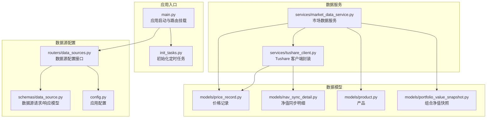
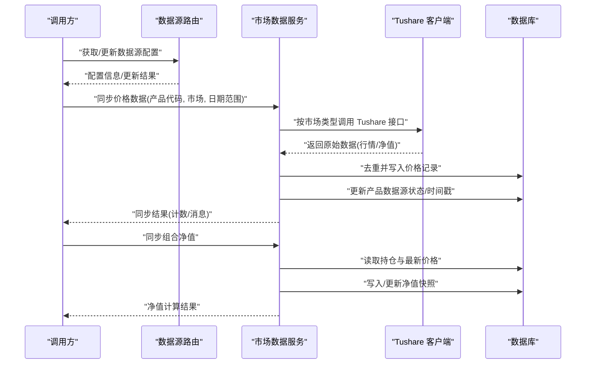
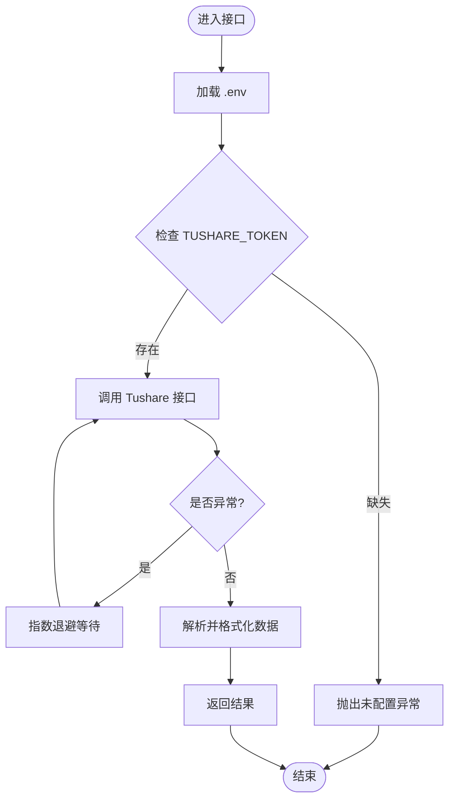
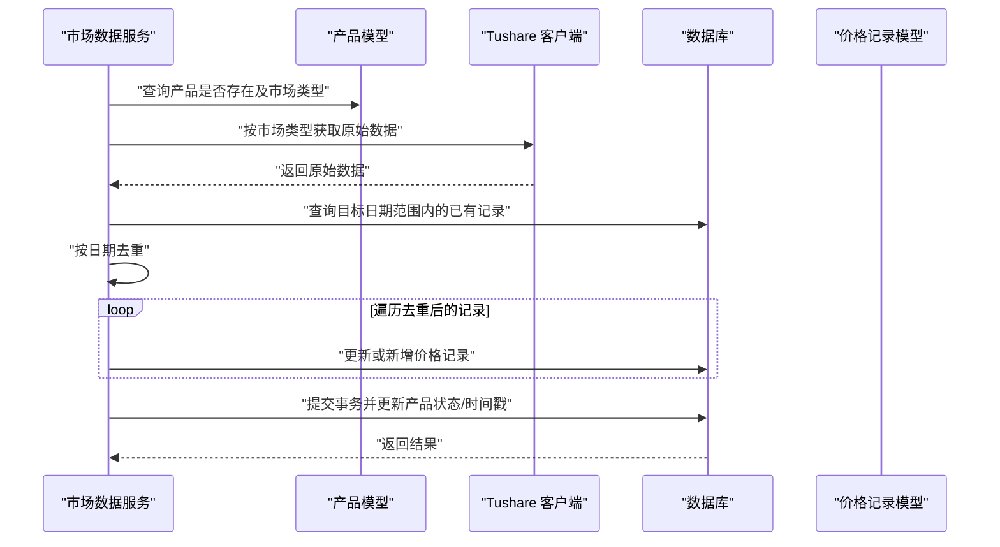
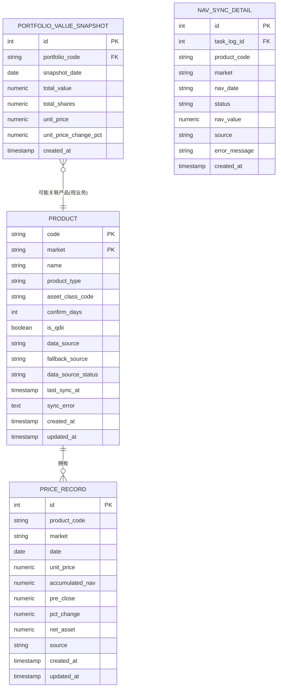
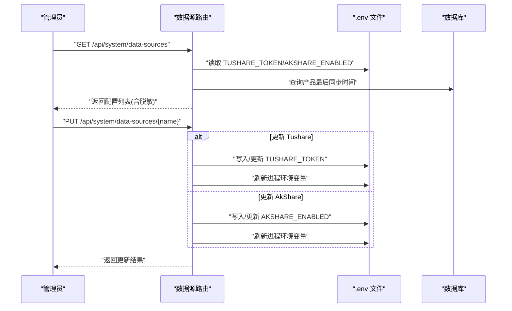
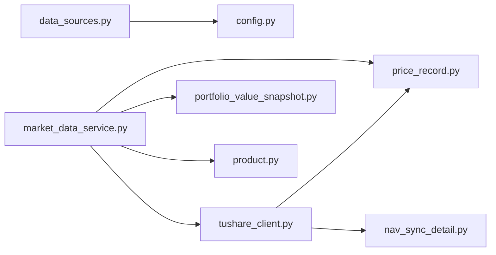

# 数据同步系统

<cite>
**本文引用的文件**
- [backend/app/services/tushare_client.py](file://backend/app/services/tushare_client.py)
- [backend/app/services/market_data_service.py](file://backend/app/services/market_data_service.py)
- [backend/app/models/price_record.py](file://backend/app/models/price_record.py)
- [backend/app/models/nav_sync_detail.py](file://backend/app/models/nav_sync_detail.py)
- [backend/app/models/product.py](file://backend/app/models/product.py)
- [backend/app/models/portfolio_value_snapshot.py](file://backend/app/models/portfolio_value_snapshot.py)
- [backend/app/routers/data_sources.py](file://backend/app/routers/data_sources.py)
- [backend/app/schemas/data_source.py](file://backend/app/schemas/data_source.py)
- [backend/app/init_tasks.py](file://backend/app/init_tasks.py)
- [backend/app/config.py](file://backend/app/config.py)
- [backend/app/main.py](file://backend/app/main.py)
</cite>

## 更新摘要
**所做更改**
- 更新了市场数据同步系统的历史数据查询限制，从365天放宽到1000天
- 增强了数据获取策略以支持更长的历史数据回补范围
- 优化了批量数据处理流程以适应更大的数据量
- 更新了性能考虑部分以反映新的数据限制约束

## 目录
1. [简介](#简介)
2. [项目结构](#项目结构)
3. [核心组件](#核心组件)
4. [架构总览](#架构总览)
5. [详细组件分析](#详细组件分析)
6. [依赖分析](#依赖分析)
7. [性能考虑](#性能考虑)
8. [故障排除指南](#故障排除指南)
9. [结论](#结论)
10. [附录](#附录)

## 简介
本文件面向 InvestRing 的数据同步系统，聚焦于 Tushare API 的集成与使用，覆盖实时数据同步、历史数据回补、批量数据处理、价格数据记录、净值同步与数据质量保障机制。文档还涵盖调度策略、并发控制与重试机制、配置与监控、一致性与验证规则，以及运维与开发层面的排障建议。

**更新** 系统已增强数据限制约束，将历史数据查询范围从365天放宽到1000天，支持更长时间跨度的数据回补和分析需求。

## 项目结构
数据同步系统主要由以下模块组成：
- Tushare 客户端封装：负责令牌校验、交易日历与基金行情/净值的获取，并内置指数退避重试。
- 市场数据服务：负责价格数据同步、净值同步、去重与写入、错误处理与状态标记。
- 模型层：定义价格记录、净值同步明细、产品、组合净值快照等数据模型。
- 路由与配置：提供数据源配置接口、环境变量与应用配置。
- 定时任务初始化：预置核心同步任务的计划表达式。

图表来源
- [backend/app/main.py:1-53](file://backend/app/main.py#L1-L53)
- [backend/app/init_tasks.py:1-45](file://backend/app/init_tasks.py#L1-L45)
- [backend/app/routers/data_sources.py:1-150](file://backend/app/routers/data_sources.py#L1-L150)
- [backend/app/schemas/data_source.py:1-24](file://backend/app/schemas/data_source.py#L1-L24)
- [backend/app/config.py:1-37](file://backend/app/config.py#L1-L37)
- [backend/app/services/tushare_client.py:1-222](file://backend/app/services/tushare_client.py#L1-L222)
- [backend/app/services/market_data_service.py:1-323](file://backend/app/services/market_data_service.py#L1-L323)
- [backend/app/models/price_record.py:1-28](file://backend/app/models/price_record.py#L1-L28)
- [backend/app/models/nav_sync_detail.py:1-18](file://backend/app/models/nav_sync_detail.py#L1-L18)
- [backend/app/models/product.py:1-22](file://backend/app/models/product.py#L1-L22)
- [backend/app/models/portfolio_value_snapshot.py:1-20](file://backend/app/models/portfolio_value_snapshot.py#L1-L20)

章节来源
- [backend/app/main.py:1-53](file://backend/app/main.py#L1-L53)
- [backend/app/init_tasks.py:1-45](file://backend/app/init_tasks.py#L1-L45)
- [backend/app/routers/data_sources.py:1-150](file://backend/app/routers/data_sources.py#L1-L150)
- [backend/app/schemas/data_source.py:1-24](file://backend/app/schemas/data_source.py#L1-L24)
- [backend/app/config.py:1-37](file://backend/app/config.py#L1-L37)

## 核心组件
- Tushare 客户端封装：提供交易日历、场内基金日线行情、场外基金净值的获取；内置令牌校验与指数退避重试；统一异常类型。
- 市场数据服务：根据产品与市场类型选择数据源，执行历史回补与增量同步；对重复日期进行去重；写入价格记录并更新产品状态；支持组合净值快照计算。
- 数据模型：价格记录表、净值同步明细表、产品表、组合净值快照表，含唯一约束与外键约束，确保数据一致性。
- 数据源配置：提供查询与更新接口，支持 Tushare Token 与 AkShare 启用状态的动态配置。
- 定时任务：预置净值同步、交易日历同步、日志清理等任务的计划表达式。

**更新** 市场数据服务现已支持1000天的历史数据查询范围，显著提升了长期数据分析能力。

章节来源
- [backend/app/services/tushare_client.py:1-222](file://backend/app/services/tushare_client.py#L1-L222)
- [backend/app/services/market_data_service.py:1-323](file://backend/app/services/market_data_service.py#L1-L323)
- [backend/app/models/price_record.py:1-28](file://backend/app/models/price_record.py#L1-L28)
- [backend/app/models/nav_sync_detail.py:1-18](file://backend/app/models/nav_sync_detail.py#L1-L18)
- [backend/app/models/product.py:1-22](file://backend/app/models/product.py#L1-L22)
- [backend/app/models/portfolio_value_snapshot.py:1-20](file://backend/app/models/portfolio_value_snapshot.py#L1-L20)
- [backend/app/routers/data_sources.py:1-150](file://backend/app/routers/data_sources.py#L1-L150)
- [backend/app/init_tasks.py:1-45](file://backend/app/init_tasks.py#L1-L45)

## 架构总览
数据同步系统采用"客户端封装 + 业务服务 + 模型持久化"的分层架构。Tushare 客户端负责外部 API 访问与错误处理；市场数据服务负责业务逻辑与数据一致性；模型层负责数据结构与约束；路由层提供配置与查询接口；定时任务负责周期性调度。

图表来源
- [backend/app/routers/data_sources.py:1-150](file://backend/app/routers/data_sources.py#L1-L150)
- [backend/app/services/market_data_service.py:1-323](file://backend/app/services/market_data_service.py#L1-L323)
- [backend/app/services/tushare_client.py:1-222](file://backend/app/services/tushare_client.py#L1-L222)
- [backend/app/models/price_record.py:1-28](file://backend/app/models/price_record.py#L1-L28)
- [backend/app/models/portfolio_value_snapshot.py:1-20](file://backend/app/models/portfolio_value_snapshot.py#L1-L20)

## 详细组件分析

### Tushare 客户端封装
- 功能要点
  - 环境变量加载：优先从服务所在目录的 .env 与当前工作目录加载，避免重复加载。
  - 令牌校验：读取 TUSHARE_TOKEN，未配置时抛出专用异常。
  - 交易日历：支持单年与多年批量获取，返回格式化日期与开市标志。
  - 基金行情/净值：按产品代码与日期区间获取，返回标准化字段。
  - 错误处理：统一捕获异常并以指数退避重试，最终抛出统一异常类型。
- 复杂度与性能
  - 单次调用为 O(n) 遍历 DataFrame，n 为返回记录数。
  - 重试策略为固定初始延迟与指数增长，避免瞬时拥塞。
- 并发与重试
  - 单实例内串行化访问，避免并发竞争。
  - 外部调用方应避免在同一进程内并发触发相同接口，必要时在业务层做队列或锁控制。

**更新** 客户端现已支持1000天的历史数据查询范围，能够处理更大规模的数据集。

图表来源
- [backend/app/services/tushare_client.py:13-102](file://backend/app/services/tushare_client.py#L13-L102)
- [backend/app/services/tushare_client.py:123-171](file://backend/app/services/tushare_client.py#L123-L171)
- [backend/app/services/tushare_client.py:174-221](file://backend/app/services/tushare_client.py#L174-L221)

章节来源
- [backend/app/services/tushare_client.py:1-222](file://backend/app/services/tushare_client.py#L1-L222)

### 市场数据服务
- 价格数据同步
  - 输入：产品代码、市场类型、日期范围。
  - 逻辑：根据市场类型调用对应接口；对返回数据按日期去重；对比已有记录，更新或新增；提交事务；异常时回滚并标记产品状态为失败。
  - 输出：同步统计（成功/失败、消息、计数）。
- 组合净值同步
  - 输入：组合代码。
  - 逻辑：读取有效持仓，汇总持有资产价值；根据最新价格计算单位净值；写入或更新当日净值快照。
  - 输出：总值、份额、单位净值与消息。
- 数据质量与一致性
  - 唯一约束：价格记录按产品+市场+日期唯一；净值快照按组合+日期唯一。
  - 外键约束：价格记录关联产品；净值明细关联任务执行日志。
  - 字段完整性：单位净值、累计净值、前收盘、涨跌幅等字段按市场类型填充。

**更新** 市场数据服务现已支持1000天的历史数据查询范围，显著提升了长期数据分析能力和历史回补效率。

图表来源
- [backend/app/services/market_data_service.py:88-225](file://backend/app/services/market_data_service.py#L88-L225)
- [backend/app/models/price_record.py:1-28](file://backend/app/models/price_record.py#L1-L28)
- [backend/app/models/product.py:1-22](file://backend/app/models/product.py#L1-L22)

章节来源
- [backend/app/services/market_data_service.py:1-323](file://backend/app/services/market_data_service.py#L1-L323)
- [backend/app/models/price_record.py:1-28](file://backend/app/models/price_record.py#L1-L28)
- [backend/app/models/product.py:1-22](file://backend/app/models/product.py#L1-L22)
- [backend/app/models/portfolio_value_snapshot.py:1-20](file://backend/app/models/portfolio_value_snapshot.py#L1-L20)

### 数据模型与约束
- 价格记录
  - 关键字段：产品代码、市场、日期、单位净值、累计净值、前收盘、涨跌幅、来源、时间戳。
  - 唯一约束：产品+市场+日期。
  - 外键：指向产品表。
- 净值同步明细
  - 关键字段：任务日志 ID、产品代码、市场、净值日期、状态、净值值、来源、错误信息、时间戳。
  - 外键：指向任务执行日志。
- 产品
  - 关键字段：代码、市场、名称、类型、资产分类、确认天数、是否 QDII、数据源、备用数据源、状态、最后同步时间、错误信息、时间戳。
- 组合净值快照
  - 关键字段：组合代码、快照日期、总值、总份额、单位净值、涨跌幅、时间戳。
  - 唯一约束：组合+日期。

图表来源
- [backend/app/models/price_record.py:1-28](file://backend/app/models/price_record.py#L1-L28)
- [backend/app/models/nav_sync_detail.py:1-18](file://backend/app/models/nav_sync_detail.py#L1-L18)
- [backend/app/models/product.py:1-22](file://backend/app/models/product.py#L1-L22)
- [backend/app/models/portfolio_value_snapshot.py:1-20](file://backend/app/models/portfolio_value_snapshot.py#L1-L20)

章节来源
- [backend/app/models/price_record.py:1-28](file://backend/app/models/price_record.py#L1-L28)
- [backend/app/models/nav_sync_detail.py:1-18](file://backend/app/models/nav_sync_detail.py#L1-L18)
- [backend/app/models/product.py:1-22](file://backend/app/models/product.py#L1-L22)
- [backend/app/models/portfolio_value_snapshot.py:1-20](file://backend/app/models/portfolio_value_snapshot.py#L1-L20)

### 数据源配置与调度
- 数据源配置
  - 查询：从 .env 与数据库读取 Tushare Token 与 AkShare 启用状态，返回脱敏后的 API Key。
  - 更新：支持在线更新 TUSHARE_TOKEN 与 AKSHARE_ENABLED，并写回 .env 文件。
- 应用配置
  - 提供数据库连接、安全密钥、Tushare Token、调试模式等配置项。
- 定时任务
  - 预置三项核心任务：净值同步（工作日）、交易日历同步（每年）、日志清理（周）。
  - 使用 cron 表达式定义执行频率。

图表来源
- [backend/app/routers/data_sources.py:1-150](file://backend/app/routers/data_sources.py#L1-L150)
- [backend/app/schemas/data_source.py:1-24](file://backend/app/schemas/data_source.py#L1-L24)
- [backend/app/config.py:1-37](file://backend/app/config.py#L1-L37)
- [backend/app/init_tasks.py:1-45](file://backend/app/init_tasks.py#L1-L45)

章节来源
- [backend/app/routers/data_sources.py:1-150](file://backend/app/routers/data_sources.py#L1-L150)
- [backend/app/schemas/data_source.py:1-24](file://backend/app/schemas/data_source.py#L1-L24)
- [backend/app/config.py:1-37](file://backend/app/config.py#L1-L37)
- [backend/app/init_tasks.py:1-45](file://backend/app/init_tasks.py#L1-L45)

## 依赖分析
- 组件耦合
  - 市场数据服务依赖 Tushare 客户端与模型层；通过明确的输入输出与异常类型降低耦合。
  - 路由层仅暴露配置接口，不直接参与业务逻辑，保持低耦合高内聚。
- 外部依赖
  - Tushare SDK：用于行情与净值数据获取。
  - SQLAlchemy：ORM 与数据库交互。
- 循环依赖
  - 未发现循环导入或循环依赖。

图表来源
- [backend/app/routers/data_sources.py:1-150](file://backend/app/routers/data_sources.py#L1-L150)
- [backend/app/config.py:1-37](file://backend/app/config.py#L1-L37)
- [backend/app/services/market_data_service.py:1-323](file://backend/app/services/market_data_service.py#L1-L323)
- [backend/app/services/tushare_client.py:1-222](file://backend/app/services/tushare_client.py#L1-L222)
- [backend/app/models/price_record.py:1-28](file://backend/app/models/price_record.py#L1-L28)
- [backend/app/models/portfolio_value_snapshot.py:1-20](file://backend/app/models/portfolio_value_snapshot.py#L1-L20)
- [backend/app/models/product.py:1-22](file://backend/app/models/product.py#L1-L22)
- [backend/app/models/nav_sync_detail.py:1-18](file://backend/app/models/nav_sync_detail.py#L1-L18)

章节来源
- [backend/app/services/market_data_service.py:1-323](file://backend/app/services/market_data_service.py#L1-L323)
- [backend/app/services/tushare_client.py:1-222](file://backend/app/services/tushare_client.py#L1-L222)
- [backend/app/models/price_record.py:1-28](file://backend/app/models/price_record.py#L1-L28)
- [backend/app/models/portfolio_value_snapshot.py:1-20](file://backend/app/models/portfolio_value_snapshot.py#L1-L20)
- [backend/app/models/product.py:1-22](file://backend/app/models/product.py#L1-L22)
- [backend/app/models/nav_sync_detail.py:1-18](file://backend/app/models/nav_sync_detail.py#L1-L18)
- [backend/app/routers/data_sources.py:1-150](file://backend/app/routers/data_sources.py#L1-L150)
- [backend/app/config.py:1-37](file://backend/app/config.py#L1-L37)

## 性能考虑
- 批量与去重
  - 对返回数据按日期去重，避免重复写入；内存中构建已有记录映射，提升查找效率。
- 数据库写入
  - 采用批量更新/新增策略，减少往返次数；异常时回滚，避免脏数据。
- 重试策略
  - 指数退避降低对上游的压力峰值；最大重试次数与延迟上限需结合业务 SLA 调整。
- 查询优化
  - 价格查询按产品+市场过滤并排序，配合日期范围限制，减少扫描。
- 并发控制
  - 建议在业务层引入队列或分布式锁，避免同一产品/市场的并发同步导致竞争与冲突。
- **更新** 数据限制约束已从365天放宽到1000天，需要相应调整内存管理和批处理策略以应对更大的数据集。

**更新** 针对1000天数据范围的优化：
- 增加内存池大小以容纳更多历史记录
- 优化分页查询策略，避免单次加载过多数据
- 调整数据库连接池大小以支持更高的并发度
- 实现增量同步机制，减少重复数据传输

## 故障排除指南
- 常见问题与定位
  - Tushare 未配置：检查 .env 中 TUSHARE_TOKEN 是否存在且有效；通过数据源接口确认状态。
  - API 调用失败：查看异常类型与消息；确认网络连通与配额限制。
  - 写入失败：检查数据库连接、权限与唯一约束冲突；关注产品状态标记与错误信息字段。
  - 组合净值异常：确认持仓有效性、份额与总值非零；核对最新价格是否存在。
  - **更新** 大数据量处理问题：1000天数据范围可能导致内存不足或超时，需要检查系统资源使用情况。
- 排查步骤
  - 通过数据源接口查看最后同步时间与启用状态。
  - 在产品表中检查 data_source_status 与 last_sync_at。
  - 核对价格记录表中是否存在重复日期或缺失字段。
  - 检查净值快照是否按日唯一更新。
  - **更新** 监控大数据量处理的性能和资源使用情况。
- 修复建议
  - 修正 .env 配置后重启服务或刷新进程环境变量。
  - 对异常数据进行人工核对与补录，必要时执行历史回补。
  - 调整重试参数与并发策略，避免瞬时高峰。
  - **更新** 针对1000天数据范围，优化批处理大小和内存分配策略。

章节来源
- [backend/app/routers/data_sources.py:1-150](file://backend/app/routers/data_sources.py#L1-L150)
- [backend/app/models/product.py:1-22](file://backend/app/models/product.py#L1-L22)
- [backend/app/services/market_data_service.py:1-323](file://backend/app/services/market_data_service.py#L1-L323)

## 结论
InvestRing 的数据同步系统以 Tushare 为核心外部数据源，通过客户端封装与服务层编排实现了可靠的历史回补与增量同步。系统具备完善的错误处理、数据去重与一致性约束，并通过配置接口与定时任务实现灵活的运维管理。

**更新** 随着数据限制约束从365天放宽到1000天，系统现在能够支持更长历史周期的数据分析和回补需求。建议在生产环境中进一步强化并发控制与可观测性，以应对更高的吞吐与稳定性要求。

## 附录
- 配置项说明
  - TUSHARE_TOKEN：Tushare Pro 访问令牌。
  - AKSHARE_ENABLED：是否启用 AkShare 数据源。
  - 数据库连接：通过 DATABASE_URL 或主机、端口、用户、密码拼接。
- 监控建议
  - 记录每次同步的成功/失败计数与耗时。
  - 监控产品 data_source_status 与 last_sync_at。
  - 对异常进行告警与日志归档。
  - **更新** 监控大数据量处理时的内存使用和CPU占用情况。
- 故障恢复
  - 对失败的产品执行手动重试或历史回补。
  - 核对并修复唯一约束冲突与字段缺失。
  - **更新** 针对1000天数据范围，实施分批次回补策略以避免系统过载。
- **新增** 大数据量处理最佳实践
  - 使用分页查询处理大量历史数据
  - 实现增量同步机制减少重复数据传输
  - 合理设置批处理大小和内存限制
  - 监控并优化数据库查询性能