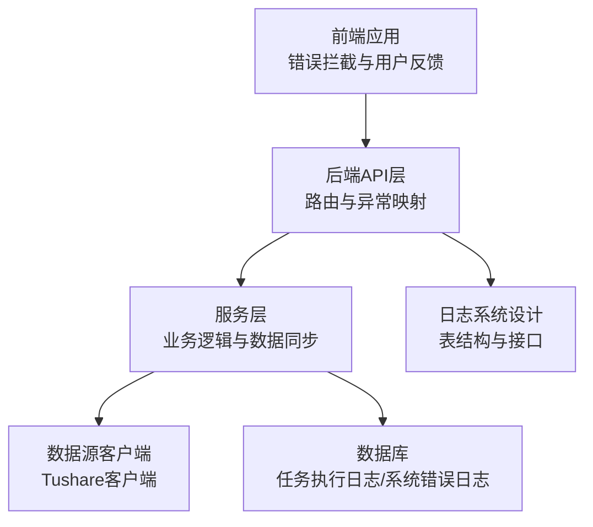
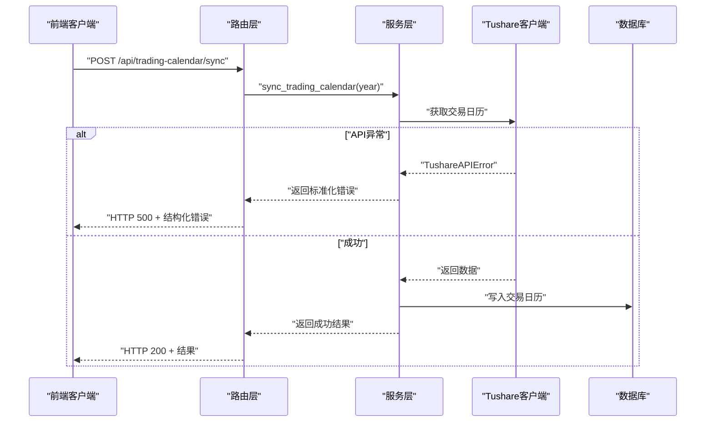
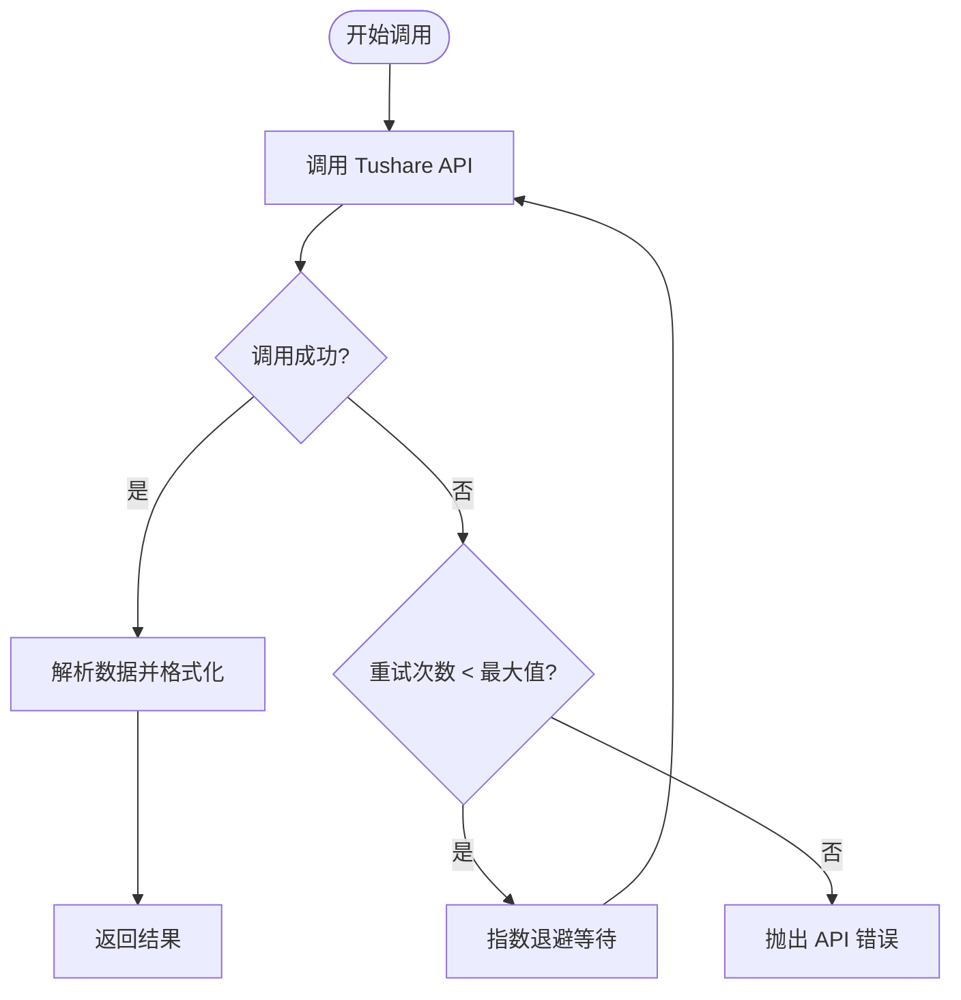
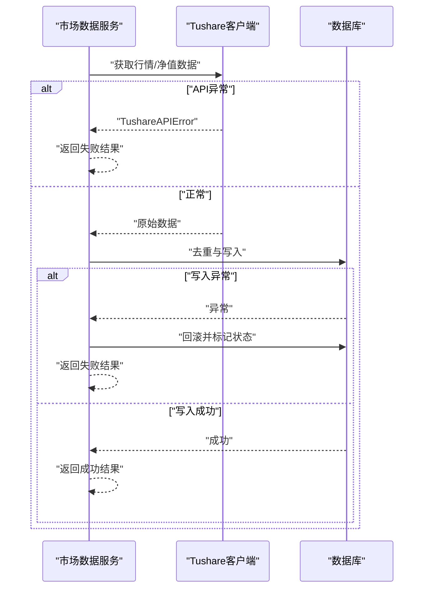
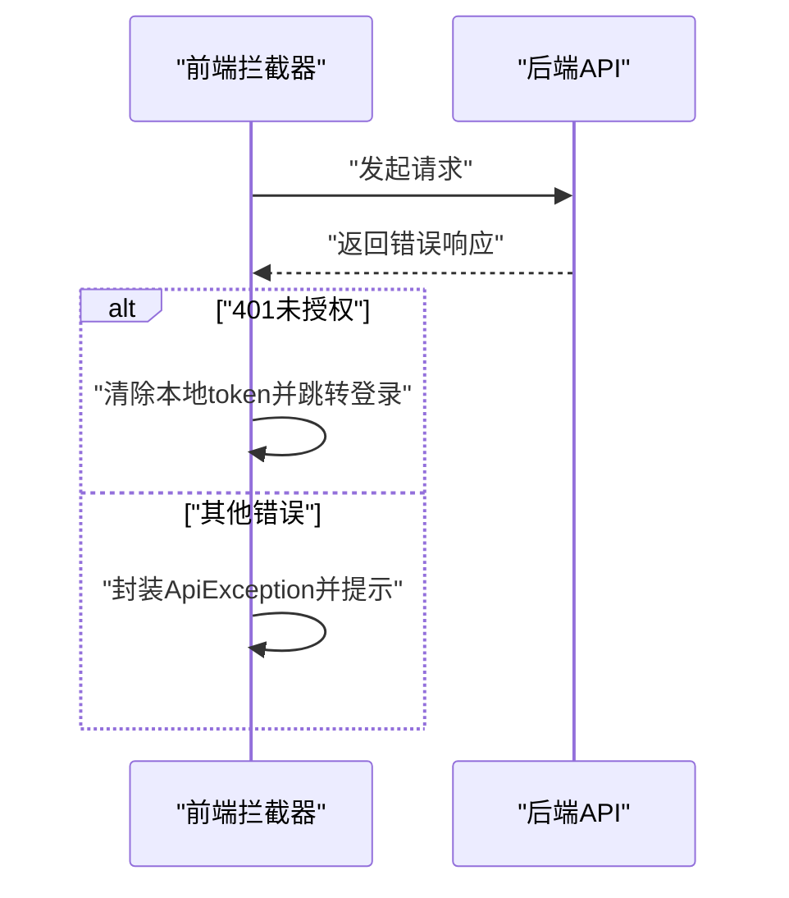
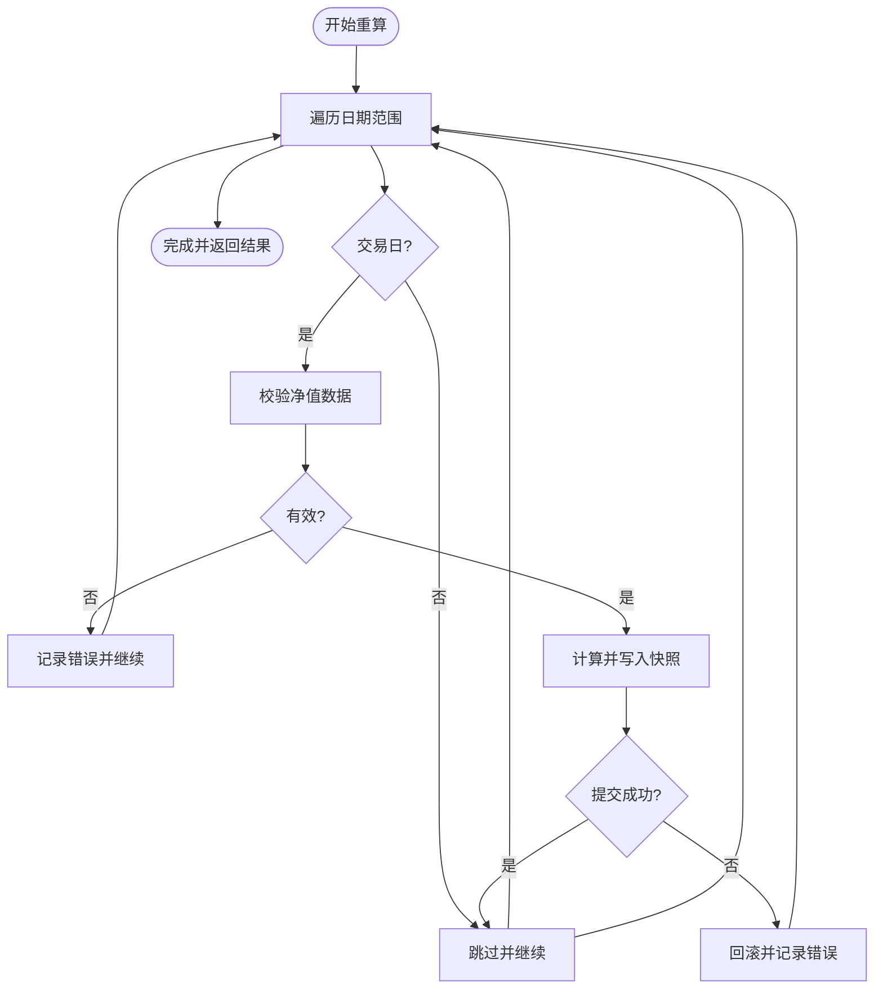
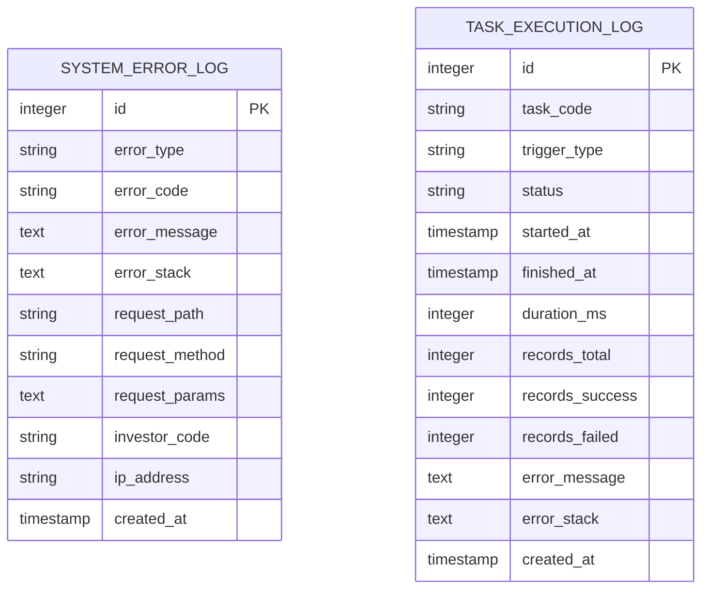
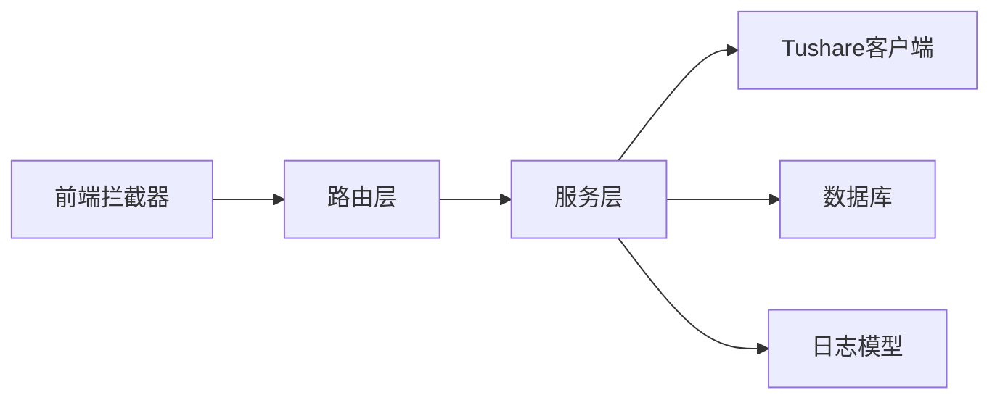

# 错误处理与重试机制

<cite>
**本文档引用的文件**
- [backend/app/services/tushare_client.py](file://backend/app/services/tushare_client.py)
- [backend/app/services/market_data_service.py](file://backend/app/services/market_data_service.py)
- [backend/app/routers/trading_calendar.py](file://backend/app/routers/trading_calendar.py)
- [backend/app/routers/snapshots.py](file://backend/app/routers/snapshots.py)
- [backend/app/models/system_error_log.py](file://backend/app/models/system_error_log.py)
- [backend/app/models/task_execution_log.py](file://backend/app/models/task_execution_log.py)
- [backend/app/config.py](file://backend/app/config.py)
- [frontend/src/lib/api.ts](file://frontend/src/lib/api.ts)
- [frontend/src/hooks/useSnapshot.ts](file://frontend/src/hooks/useSnapshot.ts)
- [frontend/src/app/settings/tasks/page.tsx](file://frontend/src/app/settings/tasks/page.tsx)
- [Docs/07-日志系统设计.md](file://Docs/07-日志系统设计.md)
- [Docs/02-数据库设计.md](file://Docs/02-数据库设计.md)
- [backend/check_and_sync_2024_calendar.py](file://backend/check_and_sync_2024_calendar.py)
</cite>

## 目录
1. [简介](#简介)
2. [项目结构](#项目结构)
3. [核心组件](#核心组件)
4. [架构概览](#架构概览)
5. [详细组件分析](#详细组件分析)
6. [依赖分析](#依赖分析)
7. [性能考虑](#性能考虑)
8. [故障排除指南](#故障排除指南)
9. [结论](#结论)
10. [附录](#附录)

## 简介
本文件聚焦 InvestRing 的数据同步错误处理系统，系统性梳理了错误类型分类、重试机制实现、日志记录与告警、故障恢复流程、数据一致性保障与补偿策略，并提供最佳实践、监控指标与调试工具。

## 项目结构
InvestRing 的错误处理与重试涉及前后端协作：
- 后端负责数据源访问、业务逻辑、错误捕获与持久化、任务执行日志与系统错误日志。
- 前端负责统一错误拦截、用户反馈与任务状态展示。
- 文档化的日志系统设计明确了各类日志表结构与职责边界。

**图表来源**
- [frontend/src/lib/api.ts:67-107](file://frontend/src/lib/api.ts#L67-L107)
- [backend/app/routers/trading_calendar.py:48-81](file://backend/app/routers/trading_calendar.py#L48-L81)
- [backend/app/services/tushare_client.py:48-102](file://backend/app/services/tushare_client.py#L48-L102)
- [backend/app/models/task_execution_log.py:1-21](file://backend/app/models/task_execution_log.py#L1-L21)
- [backend/app/models/system_error_log.py:1-19](file://backend/app/models/system_error_log.py#L1-L19)
- [Docs/07-日志系统设计.md:1-511](file://Docs/07-日志系统设计.md#L1-L511)

**章节来源**
- [Docs/07-日志系统设计.md:1-511](file://Docs/07-日志系统设计.md#L1-L511)
- [Docs/02-数据库设计.md:769-806](file://Docs/02-数据库设计.md#L769-L806)

## 核心组件
- Tushare 客户端：封装 API 调用与指数退避重试，统一抛出配置错误与 API 错误两类异常。
- 市场数据服务：根据市场类型调用对应接口，捕获 API 异常并返回标准化结果；写入失败时回滚并标记数据源状态。
- 路由层：对特定异常进行 HTTP 状态码映射，向前端返回结构化错误信息。
- 日志模型：系统错误日志与任务执行日志模型，支撑错误记录与任务可观测性。
- 前端拦截器：统一处理 401 重定向与通用错误对象封装，提升用户体验。

**章节来源**
- [backend/app/services/tushare_client.py:48-102](file://backend/app/services/tushare_client.py#L48-L102)
- [backend/app/services/market_data_service.py:128-145](file://backend/app/services/market_data_service.py#L128-L145)
- [backend/app/routers/trading_calendar.py:48-81](file://backend/app/routers/trading_calendar.py#L48-L81)
- [backend/app/models/system_error_log.py:1-19](file://backend/app/models/system_error_log.py#L1-L19)
- [backend/app/models/task_execution_log.py:1-21](file://backend/app/models/task_execution_log.py#L1-L21)
- [frontend/src/lib/api.ts:67-107](file://frontend/src/lib/api.ts#L67-L107)

## 架构概览
系统采用“服务层统一错误捕获 + 路由层状态码映射 + 前端统一拦截”的三层协同模式，配合日志系统实现可观测与可追溯。

**图表来源**
- [backend/app/routers/trading_calendar.py:48-81](file://backend/app/routers/trading_calendar.py#L48-L81)
- [backend/app/services/tushare_client.py:48-102](file://backend/app/services/tushare_client.py#L48-L102)
- [backend/app/services/market_data_service.py:128-145](file://backend/app/services/market_data_service.py#L128-L145)

## 详细组件分析

### Tushare 客户端重试机制
- 指数退避：最大重试次数固定，初始延迟固定，每次失败翻倍。
- 异常分类：未配置与 API 调用失败两类异常，便于上层区分处理策略。
- 数据格式校验：对空数据返回空列表，避免上游崩溃。

**图表来源**
- [backend/app/services/tushare_client.py:69-86](file://backend/app/services/tushare_client.py#L69-L86)

**章节来源**
- [backend/app/services/tushare_client.py:48-102](file://backend/app/services/tushare_client.py#L48-L102)

### 市场数据同步错误处理
- 市场类型校验：不支持的市场类型直接抛出业务异常。
- API 异常捕获：捕获 API 错误并返回标准化结果，避免中断流程。
- 写入异常回滚：数据库写入失败时回滚并标记数据源状态，确保一致性。
- 去重与字段映射：对重复日期去重，按市场类型映射字段。

**图表来源**
- [backend/app/services/market_data_service.py:128-145](file://backend/app/services/market_data_service.py#L128-L145)
- [backend/app/services/market_data_service.py:209-214](file://backend/app/services/market_data_service.py#L209-L214)

**章节来源**
- [backend/app/services/market_data_service.py:88-225](file://backend/app/services/market_data_service.py#L88-L225)

### 路由层错误映射与前端拦截
- 路由层：将特定异常映射为 HTTP 状态码与结构化错误，便于前端统一处理。
- 前端拦截器：统一处理 401 重定向与通用错误对象封装，提升用户体验。

**图表来源**
- [frontend/src/lib/api.ts:67-107](file://frontend/src/lib/api.ts#L67-L107)
- [backend/app/routers/trading_calendar.py:66-80](file://backend/app/routers/trading_calendar.py#L66-L80)

**章节来源**
- [frontend/src/lib/api.ts:67-107](file://frontend/src/lib/api.ts#L67-L107)
- [backend/app/routers/trading_calendar.py:48-81](file://backend/app/routers/trading_calendar.py#L48-L81)

### 快照重算与错误补偿
- 逐日重算：遍历日期范围，逐日处理，遇到异常记录错误并继续。
- 错误聚合：将各组合的错误按日期聚合，便于前端展示与人工干预。
- 依赖校验：重算前校验净值数据完整性，避免脏数据导致的错误扩散。

**图表来源**
- [backend/app/routers/snapshots.py:58-111](file://backend/app/routers/snapshots.py#L58-L111)
- [backend/app/services/snapshot_service.py:96-184](file://backend/app/services/snapshot_service.py#L96-L184)

**章节来源**
- [backend/app/routers/snapshots.py:58-111](file://backend/app/routers/snapshots.py#L58-L111)
- [backend/app/services/snapshot_service.py:96-184](file://backend/app/services/snapshot_service.py#L96-L184)

### 日志系统与可观测性
- 系统错误日志：记录异常类型、错误码、错误信息、请求上下文，支持按类型与时间检索。
- 任务执行日志：记录任务执行状态、耗时、成功/失败计数与错误堆栈，支撑故障定位与补偿。
- 前端任务管理：展示任务状态与执行历史，便于运维与管理员快速定位问题。

**图表来源**
- [backend/app/models/system_error_log.py:1-19](file://backend/app/models/system_error_log.py#L1-L19)
- [backend/app/models/task_execution_log.py:1-21](file://backend/app/models/task_execution_log.py#L1-L21)
- [Docs/07-日志系统设计.md:183-225](file://Docs/07-日志系统设计.md#L183-L225)

**章节来源**
- [backend/app/models/system_error_log.py:1-19](file://backend/app/models/system_error_log.py#L1-L19)
- [backend/app/models/task_execution_log.py:1-21](file://backend/app/models/task_execution_log.py#L1-L21)
- [Docs/07-日志系统设计.md:183-225](file://Docs/07-日志系统设计.md#L183-L225)

## 依赖分析
- 组件耦合：服务层依赖数据源客户端与数据库；路由层依赖服务层；前端依赖路由层与拦截器。
- 外部依赖：Tushare API 的可用性直接影响数据同步成功率。
- 潜在风险：SQLite 并发写入限制与任务串行执行策略需结合 WAL 模式与错峰调度规避。

**图表来源**
- [frontend/src/lib/api.ts:67-107](file://frontend/src/lib/api.ts#L67-L107)
- [backend/app/routers/trading_calendar.py:48-81](file://backend/app/routers/trading_calendar.py#L48-L81)
- [backend/app/services/tushare_client.py:48-102](file://backend/app/services/tushare_client.py#L48-L102)
- [backend/app/models/system_error_log.py:1-19](file://backend/app/models/system_error_log.py#L1-L19)
- [backend/app/models/task_execution_log.py:1-21](file://backend/app/models/task_execution_log.py#L1-L21)

**章节来源**
- [Docs/07-日志系统设计.md:353-426](file://Docs/07-日志系统设计.md#L353-L426)

## 性能考虑
- 指数退避：降低对上游 API 的冲击，提高整体成功率。
- 去重与批量写入：减少数据库写入次数与冲突概率。
- 任务串行执行：避免 SQLite 并发写入冲突，但可能增加总耗时。
- 前端缓存与防抖：减少重复请求，提升交互体验。

## 故障排除指南
- Tushare 未配置：检查环境变量与数据源配置接口，确保 Token 正确。
- API 调用失败：查看系统错误日志与任务执行日志，定位具体失败时间与错误堆栈。
- 数据写入异常：检查数据库连接、权限与并发控制策略，必要时启用 WAL 模式。
- 前端 401：拦截器会自动清除本地 token 并跳转登录，检查会话有效期与安全配置。
- 快照重算失败：查看重算结果中的错误列表，按日期逐一排查数据源与依赖完整性。

**章节来源**
- [frontend/src/lib/api.ts:67-107](file://frontend/src/lib/api.ts#L67-L107)
- [backend/app/routers/trading_calendar.py:66-80](file://backend/app/routers/trading_calendar.py#L66-L80)
- [backend/app/services/market_data_service.py:209-214](file://backend/app/services/market_data_service.py#L209-L214)
- [Docs/07-日志系统设计.md:430-449](file://Docs/07-日志系统设计.md#L430-L449)

## 结论
InvestRing 的错误处理体系以“服务层统一捕获 + 路由层状态码映射 + 前端统一拦截”为核心，辅以完善的日志系统与任务可观测性，形成闭环的错误发现、记录、告警与恢复能力。通过指数退避重试、去重与回滚、依赖校验与补偿策略，系统在复杂外部依赖环境下保持稳定与可维护性。

## 附录

### 错误类型与处理策略
- 网络错误：指数退避重试，超过最大次数后抛出 API 错误，路由层映射为 500。
- API 限制：通过指数退避降低请求频率，必要时引入限流与熔断。
- 数据格式错误：对空数据与字段缺失进行容错处理，记录错误并继续流程。
- 业务异常：参数校验失败与业务规则不满足时，返回 422 或 400 等语义化状态码。

**章节来源**
- [backend/app/services/tushare_client.py:69-86](file://backend/app/services/tushare_client.py#L69-L86)
- [backend/app/services/market_data_service.py:135-138](file://backend/app/services/market_data_service.py#L135-L138)
- [backend/app/routers/trading_calendar.py:66-80](file://backend/app/routers/trading_calendar.py#L66-L80)

### 重试机制配置
- 最大重试次数：固定值，避免无限重试导致资源浪费。
- 初始延迟：固定值，配合指数退避逐步降低峰值压力。
- 超时配置：建议在调用方设置合理超时，避免阻塞线程池。

**章节来源**
- [backend/app/services/tushare_client.py:69-86](file://backend/app/services/tushare_client.py#L69-L86)

### 错误日志与告警
- 系统错误日志：记录异常类型、错误码、请求上下文，支持检索与导出。
- 任务执行日志：记录任务状态、耗时、失败计数与错误堆栈，便于自动化告警。
- 前端通知：统一错误提示与 401 自动跳转，提升用户体验。

**章节来源**
- [backend/app/models/system_error_log.py:1-19](file://backend/app/models/system_error_log.py#L1-L19)
- [backend/app/models/task_execution_log.py:1-21](file://backend/app/models/task_execution_log.py#L1-L21)
- [frontend/src/lib/api.ts:67-107](file://frontend/src/lib/api.ts#L67-L107)

### 数据一致性与补偿
- 回滚策略：写入失败时回滚，确保数据库一致性。
- 依赖校验：重算前校验净值数据完整性，避免脏数据传播。
- 补偿措施：通过重算接口与历史同步接口进行局部修复与补数据。

**章节来源**
- [backend/app/services/market_data_service.py:209-214](file://backend/app/services/market_data_service.py#L209-L214)
- [backend/app/routers/snapshots.py:58-111](file://backend/app/routers/snapshots.py#L58-L111)

### 监控指标与最佳实践
- 指标建议：API 调用成功率、平均/95 分位延迟、重试次数分布、任务失败率、错误类型分布。
- 最佳实践：开启指数退避、设置合理超时、记录关键上下文、分环境配置重试策略、定期清理日志。

**章节来源**
- [Docs/07-日志系统设计.md:430-449](file://Docs/07-日志系统设计.md#L430-L449)

### 配置选项与调试工具
- 配置项：数据库连接、Tushare Token、调试开关、任务超时等。
- 调试工具：前端拦截器统一错误封装、后端日志模型与查询接口、任务执行详情查看。

**章节来源**
- [backend/app/config.py:1-37](file://backend/app/config.py#L1-L37)
- [frontend/src/lib/api.ts:82-107](file://frontend/src/lib/api.ts#L82-L107)
- [Docs/07-日志系统设计.md:229-307](file://Docs/07-日志系统设计.md#L229-L307)