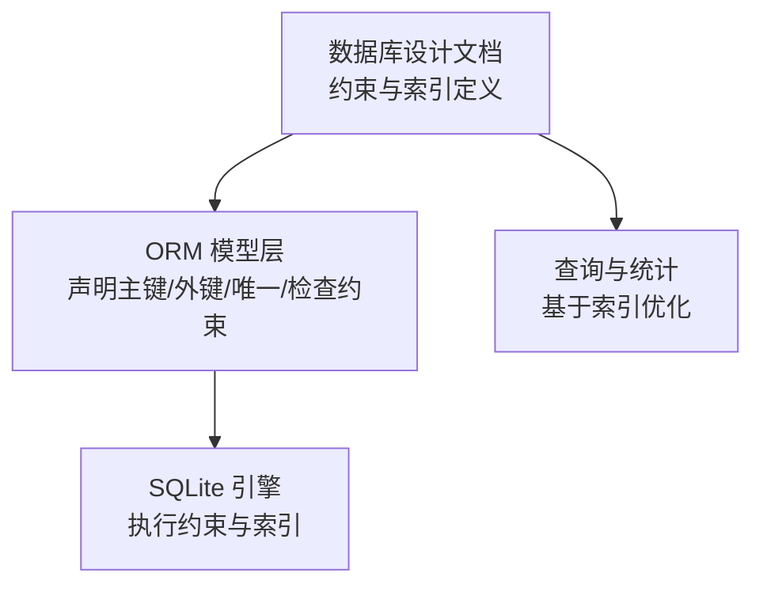
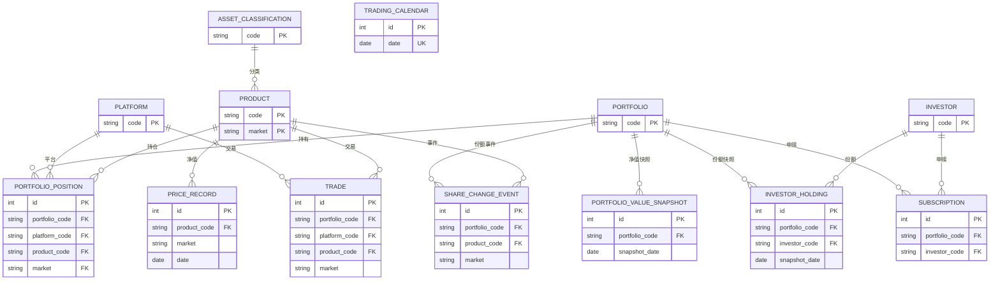
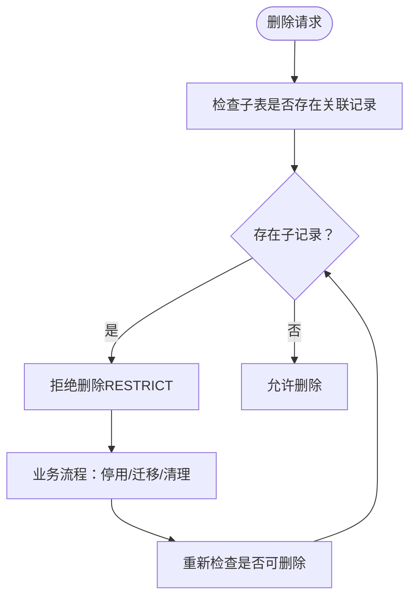

# 数据库约束与索引

<cite>
**本文引用的文件**
- [02-数据库设计.md](file://Docs/02-数据库设计.md)
- [__init__.py](file://backend/app/models/__init__.py)
- [portfolio.py](file://backend/app/models/portfolio.py)
- [product.py](file://backend/app/models/product.py)
- [investor_holding.py](file://backend/app/models/investor_holding.py)
- [portfolio_position.py](file://backend/app/models/portfolio_position.py)
- [subscription.py](file://backend/app/models/subscription.py)
- [trade.py](file://backend/app/models/trade.py)
- [price_record.py](file://backend/app/models/price_record.py)
- [share_change_event.py](file://backend/app/models/share_change_event.py)
- [portfolio_value_snapshot.py](file://backend/app/models/portfolio_value_snapshot.py)
- [trading_calendar.py](file://backend/app/models/trading_calendar.py)
- [platform.py](file://backend/app/models/platform.py)
- [investor.py](file://backend/app/models/investor.py)
</cite>

## 更新摘要
**变更内容**
- 更新了交易模型（trade.py）中唯一约束注释，使其与NOT NULL实现保持一致
- 移除了与当前列定义相矛盾的过时NULL相关解释
- 保持了文档整体结构和一致性

## 目录
1. [简介](#简介)
2. [项目结构](#项目结构)
3. [核心组件](#核心组件)
4. [架构总览](#架构总览)
5. [详细组件分析](#详细组件分析)
6. [依赖分析](#依赖分析)
7. [性能考虑](#性能考虑)
8. [故障排查指南](#故障排查指南)
9. [结论](#结论)
10. [附录](#附录)

## 简介
本文件聚焦于 InvestRing 项目的数据库约束与索引设计，系统梳理 21 张核心表的约束原则与实现方式（主键、外键、唯一、检查约束），并结合 RESTRICT 删除策略说明其业务影响。随后总结 79 个索引的设计目标、查询性能优化效果与维护成本，并给出索引选择最佳实践与性能调优指南。最后覆盖约束冲突常见原因与解决方案、数据库一致性保障机制以及数据完整性验证方法。

## 项目结构
- 文档与设计：数据库设计文档集中定义了表结构、约束、索引与外键删除策略。
- ORM 模型：Python SQLAlchemy 模型文件映射数据库表结构，包含主键、外键、唯一与检查约束的声明。
- 索引与约束：索引定义与外键约束在设计文档中集中呈现，ORM 层通过装饰器与元组形式声明约束。

**章节来源**
- [02-数据库设计.md:1-882](file://Docs/02-数据库设计.md#L1-L882)
- [__init__.py:1-46](file://backend/app/models/__init__.py#L1-L46)

## 核心组件
本节概述 21 张表的约束设计原则与实现要点，涵盖主键、外键、唯一、检查约束及 RESTRICT 删除策略。

- 投资人表（investor）
  - 主键：code
  - 约束：name、password_hash 非空；默认角色 viewer
  - 索引：code（主键自带）

- 投资组合表（portfolio）
  - 主键：code
  - 约束：name 非空；状态 draft/active/closed；生命周期字段 started_at/closed_at
  - 索引：code（主键自带）

- 组合份额持有快照（investor_holding）
  - 主键：id；联合唯一：(portfolio_code, investor_code, snapshot_date)
  - 外键：portfolio.code、investor.code
  - 索引：(portfolio_code, investor_code, snapshot_date DESC)

- 平台表（platform）
  - 主键：code
  - 索引：code

- 产品信息（product）
  - 主键：(code, market)
  - 外键：asset_classification.code（SET NULL）
  - 索引：code（主键自带）

- 资产分类（asset_classification）
  - 主键：code

- 持仓快照（portfolio_position）
  - 主键：id；联合唯一：(portfolio_code, product_code, market, snapshot_date)
  - 外键：portfolio.code、platform.code、product(code, market)
  - 检查约束：净值型资产 shares 非空且 amount 为空；非净值型资产 shares 为空且 amount 非空
  - 索引：(portfolio_code, product_code, market, snapshot_date DESC)

- 申购赎回（subscription）
  - 主键：id
  - 外键：portfolio.code、investor.code
  - 索引：(portfolio_code, apply_date DESC)、(status, confirm_date)

- 交易（trade）
  - 主键：id
  - 外键：portfolio.code、platform.code、product(code, market)
  - **已更新** 唯一约束注释与NOT NULL实现同步，移除了过时的NULL相关解释
  - 索引：(portfolio_code, trade_date DESC)、(product_code, trade_date DESC)、(status, confirm_date)

- 净值/价格记录（price_record）
  - 主键：id；联合唯一：(product_code, market, date)
  - 外键：product(code, market)
  - 索引：(product_code, market, date DESC)

- 份额变动事件（share_change_event）
  - 主键：id
  - 外键：portfolio.code、product(code, market)
  - 索引：(portfolio_code, event_date DESC)、status

- 组合市值快照（portfolio_value_snapshot）
  - 主键：id；联合唯一：(portfolio_code, snapshot_date)
  - 外键：portfolio.code
  - 索引：(portfolio_code, snapshot_date DESC)

- 交易日历（trading_calendar）
  - 主键：id；唯一：date
  - 索引：date

- 日志与系统表（共 7 张）
  - 登录日志、审计日志、定时任务、任务执行日志、净值同步明细、系统错误日志、通知
  - 索引：按查询场景建立（如任务执行日志的 task_code、status 等）

**章节来源**
- [02-数据库设计.md:11-496](file://Docs/02-数据库设计.md#L11-L496)
- [portfolio.py:1-16](file://backend/app/models/portfolio.py#L1-L16)
- [product.py:1-22](file://backend/app/models/product.py#L1-L22)
- [investor_holding.py:1-20](file://backend/app/models/investor_holding.py#L1-L20)
- [portfolio_position.py:1-34](file://backend/app/models/portfolio_position.py#L1-L34)
- [subscription.py:1-21](file://backend/app/models/subscription.py#L1-L21)
- [trade.py:1-32](file://backend/app/models/trade.py#L1-L32)
- [price_record.py:1-28](file://backend/app/models/price_record.py#L1-L28)
- [share_change_event.py:1-37](file://backend/app/models/share_change_event.py#L1-L37)
- [portfolio_value_snapshot.py:1-20](file://backend/app/models/portfolio_value_snapshot.py#L1-L20)
- [trading_calendar.py:1-13](file://backend/app/models/trading_calendar.py#L1-L13)
- [platform.py:1-12](file://backend/app/models/platform.py#L1-L12)
- [investor.py:1-17](file://backend/app/models/investor.py#L1-L17)

## 架构总览
下图展示核心业务表之间的外键关系与 RESTRICT 删除策略的约束交互。

**图表来源**
- [02-数据库设计.md:599-621](file://Docs/02-数据库设计.md#L599-L621)
- [portfolio_position.py:23-33](file://backend/app/models/portfolio_position.py#L23-L33)
- [trade.py:26-31](file://backend/app/models/trade.py#L26-L31)
- [subscription.py:1-21](file://backend/app/models/subscription.py#L1-L21)
- [share_change_event.py:31-36](file://backend/app/models/share_change_event.py#L31-L36)
- [price_record.py:21-27](file://backend/app/models/price_record.py#L21-L27)
- [investor_holding.py:17-19](file://backend/app/models/investor_holding.py#L17-L19)
- [portfolio_value_snapshot.py:17-19](file://backend/app/models/portfolio_value_snapshot.py#L17-L19)
- [trading_calendar.py:9](file://backend/app/models/trading_calendar.py#L9)

## 详细组件分析

### 投资人表（investor）
- 约束设计
  - 主键：code
  - 非空：name、password_hash
  - 默认：role = viewer
- 索引
  - code（主键自带）
- 业务要点
  - 密码使用哈希存储，登录成功更新 last_login_at

**章节来源**
- [02-数据库设计.md:11-31](file://Docs/02-数据库设计.md#L11-L31)
- [investor.py:8](file://backend/app/models/investor.py#L8)

### 投资组合表（portfolio）
- 约束设计
  - 主键：code
  - 非空：name
  - 状态：draft/active/closed
  - 生命周期：started_at、closed_at
- 索引
  - code（主键自带）

**章节来源**
- [02-数据库设计.md:32-60](file://Docs/02-数据库设计.md#L32-L60)
- [portfolio.py:8](file://backend/app/models/portfolio.py#L8)

### 组合份额持有快照（investor_holding）
- 约束设计
  - 主键：id
  - 外键：portfolio.code、investor.code
  - 唯一：(portfolio_code, investor_code, snapshot_date)
- 索引
  - (portfolio_code, investor_code, snapshot_date DESC)

**章节来源**
- [02-数据库设计.md:61-133](file://Docs/02-数据库设计.md#L61-L133)
- [investor_holding.py:17-19](file://backend/app/models/investor_holding.py#L17-L19)

### 平台表（platform）
- 约束设计
  - 主键：code
- 索引
  - code

**章节来源**
- [02-数据库设计.md:134-146](file://Docs/02-数据库设计.md#L134-L146)
- [platform.py:8](file://backend/app/models/platform.py#L8)

### 产品信息（product）
- 约束设计
  - 主键：(code, market)
  - 外键：asset_classification.code（删除时置空）
- 索引
  - code（主键自带）

**章节来源**
- [02-数据库设计.md:148-211](file://Docs/02-数据库设计.md#L148-L211)
- [product.py:8-12](file://backend/app/models/product.py#L8-L12)

### 资产分类（asset_classification）
- 约束设计
  - 主键：code

**章节来源**
- [02-数据库设计.md:212-222](file://Docs/02-数据库设计.md#L212-L222)

### 持仓快照（portfolio_position）
- 约束设计
  - 主键：id
  - 外键：portfolio.code、platform.code、product(code, market)
  - 唯一：(portfolio_code, product_code, market, snapshot_date)
  - 检查约束：净值型资产 shares 非空且 amount 为空；非净值型资产 shares 为空且 amount 非空
- 索引
  - (portfolio_code, product_code, market, snapshot_date DESC)

**章节来源**
- [02-数据库设计.md:247-322](file://Docs/02-数据库设计.md#L247-L322)
- [portfolio_position.py:23-33](file://backend/app/models/portfolio_position.py#L23-L33)

### 申购赎回（subscription）
- 约束设计
  - 主键：id
  - 外键：portfolio.code、investor.code
- 索引
  - (portfolio_code, apply_date DESC)
  - (status, confirm_date)

**章节来源**
- [02-数据库设计.md:323-343](file://Docs/02-数据库设计.md#L323-L343)
- [subscription.py:1-21](file://backend/app/models/subscription.py#L1-L21)

### 交易（trade）
- 约束设计
  - 主键：id
  - 外键：portfolio.code、platform.code、product(code, market)
  - **已更新** 唯一约束注释与NOT NULL实现同步，移除了过时的NULL相关解释
- 索引
  - (portfolio_code, trade_date DESC)
  - (product_code, trade_date DESC)
  - (status, confirm_date)

**章节来源**
- [02-数据库设计.md:347-388](file://Docs/02-数据库设计.md#L347-L388)
- [trade.py:26-31](file://backend/app/models/trade.py#L26-L31)

### 净值/价格记录（price_record）
- 约束设计
  - 主键：id
  - 外键：product(code, market)
  - 唯一：(product_code, market, date)
- 索引
  - (product_code, market, date DESC)

**章节来源**
- [02-数据库设计.md:389-408](file://Docs/02-数据库设计.md#L389-L408)
- [price_record.py:21-27](file://backend/app/models/price_record.py#L21-L27)

### 份额变动事件（share_change_event）
- 约束设计
  - 主键：id
  - 外键：portfolio.code、product(code, market)
- 索引
  - (portfolio_code, event_date DESC)
  - status

**章节来源**
- [02-数据库设计.md:410-468](file://Docs/02-数据库设计.md#L410-L468)
- [share_change_event.py:31-36](file://backend/app/models/share_change_event.py#L31-L36)

### 组合市值快照（portfolio_value_snapshot）
- 约束设计
  - 主键：id
  - 外键：portfolio.code
  - 唯一：(portfolio_code, snapshot_date)
- 索引
  - (portfolio_code, snapshot_date DESC)

**章节来源**
- [02-数据库设计.md:469-484](file://Docs/02-数据库设计.md#L469-L484)
- [portfolio_value_snapshot.py:17-19](file://backend/app/models/portfolio_value_snapshot.py#L17-L19)

### 交易日历（trading_calendar）
- 约束设计
  - 主键：id
  - 唯一：date
- 索引
  - date

**章节来源**
- [02-数据库设计.md:486-496](file://Docs/02-数据库设计.md#L486-L496)
- [trading_calendar.py:9](file://backend/app/models/trading_calendar.py#L9)

### 日志与系统表（7 张）
- 登录日志、审计日志、定时任务、任务执行日志、净值同步明细、系统错误日志、通知
- 设计文档中定义了表结构与字段，索引按查询场景建立（例如任务执行日志的 task_code、status 等）

**章节来源**
- [02-数据库设计.md:658-800](file://Docs/02-数据库设计.md#L658-800)

## 依赖分析
- 外键与删除策略
  - portfolio → portfolio_position、portfolio_value_snapshot、investor_holding、subscription、share_change_event：RESTRICT
  - product → portfolio_position、price_record、trade、share_change_event：RESTRICT
  - investor → investor_holding、subscription：RESTRICT
  - platform → portfolio_position、trade：RESTRICT
  - asset_classification → product：SET NULL
- 影响与建议
  - 物理删除前必须清理子表关联记录，或通过业务流程"停用"替代删除，以保留历史数据与审计轨迹
  - 对于 product 与 platform，若需删除，应先迁移或停用相关记录，避免 RESTRICT 阻断

**图表来源**
- [02-数据库设计.md:599-621](file://Docs/02-数据库设计.md#L599-L621)

**章节来源**
- [02-数据库设计.md:599-621](file://Docs/02-数据库设计.md#L599-L621)

## 性能考虑
- 索引设计目标与收益
  - 快速定位组合维度：portfolio_code + 时间维度（apply_date/trade_date/snapshot_date/event_date）
  - 快速过滤状态与确认日期：status + confirm_date
  - 快速定位产品维度：product_code + market + date
  - 唯一键加速去重与聚合：(portfolio_code, investor_code, snapshot_date)、(portfolio_code, product_code, market, snapshot_date)、(portfolio_code, snapshot_date)、(product_code, market, date)
- 维护成本
  - 写入放大：INSERT/UPDATE/DELETE 会触发索引维护，高写入场景需平衡索引数量
  - 存储开销：复合索引占用更多空间
- 调优建议
  - 仅在高频查询列上建立索引
  - 使用 EXPLAIN QUERY PLAN 分析慢查询
  - 对热点组合/产品定期重建索引（SQLite 环境下）
  - 控制单表索引总数，避免过度索引导致写入性能下降

**章节来源**
- [02-数据库设计.md:563-595](file://Docs/02-数据库设计.md#L563-L595)

## 故障排查指南
- 常见约束冲突
  - 唯一约束冲突：重复的联合唯一键（如 investor_holding、portfolio_position、portfolio_value_snapshot、price_record）
  - 外键约束冲突：删除父表记录时仍有子表关联（RESTRICT）
  - 检查约束冲突：portfolio_position 中净值型与非净值型资产字段组合不符合规则
- 定位与解决
  - 查看具体冲突键值与表结构，确认业务逻辑是否正确
  - 对于 RESTRICT：先清理子表记录或执行停用流程
  - 对于检查约束：修正字段组合（净值型资产 shares 非空且 amount 为空；非净值型资产 shares 为空且 amount 非空）
- 一致性与完整性验证
  - 使用唯一索引/约束作为完整性基线，定期扫描重复键
  - 对关键业务表执行一致性校验（如可用份额/可用现金的实时计算与快照一致性）
  - 通过审计日志与任务执行日志追踪异常与回滚点

**章节来源**
- [02-数据库设计.md:563-595](file://Docs/02-数据库设计.md#L563-L595)
- [portfolio_position.py:28-31](file://backend/app/models/portfolio_position.py#L28-L31)

## 结论
本设计通过严格的主键、外键、唯一与检查约束，配合 RESTRICT 删除策略，确保业务数据的完整性与可追溯性。索引体系围绕组合、产品与时间维度构建，兼顾查询效率与维护成本。实践中应遵循"少而精"的索引策略，结合 EXPLAIN 与监控持续优化。

## 附录
- 索引清单（按表分组）
  - 投资人：idx_investor_code
  - 组合份额持有：idx_investor_holding_snapshot
  - 申购赎回：idx_subscription_portfolio_date、idx_subscription_status
  - 交易：idx_trade_portfolio_date、idx_trade_product、idx_trade_status
  - 持仓快照：idx_portfolio_position_snapshot
  - 净值记录：idx_price_record_product_date
  - 份额变动事件：idx_share_change_portfolio_date、idx_share_change_status
  - 组合快照：idx_snapshot_portfolio_date
  - 平台：idx_platform_code
  - 交易日历：idx_trading_calendar_date
  - 其他日志与系统表：按查询场景建立（详见设计文档）

**章节来源**
- [02-数据库设计.md:563-595](file://Docs/02-数据库设计.md#L563-L595)