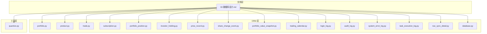
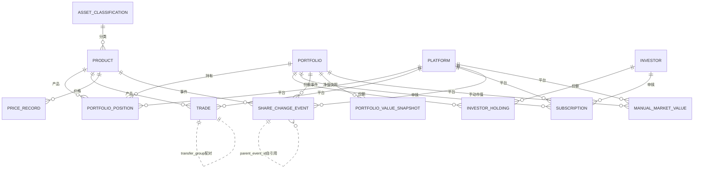
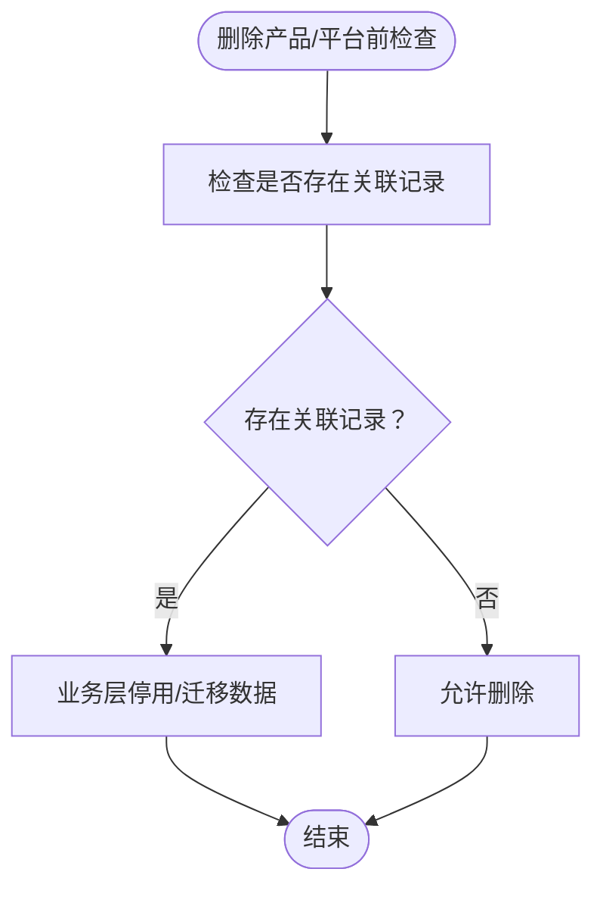

# 数据库设计

<cite>
**本文引用的文件**
- [02-数据库设计.md](file://Docs/02-数据库设计.md)
- [portfolio.py](file://backend/app/models/portfolio.py)
- [product.py](file://backend/app/models/product.py)
- [trade.py](file://backend/app/models/trade.py)
- [subscription.py](file://backend/app/models/subscription.py)
- [portfolio_position.py](file://backend/app/models/portfolio_position.py)
- [investor_holding.py](file://backend/app/models/investor_holding.py)
- [price_record.py](file://backend/app/models/price_record.py)
- [share_change_event.py](file://backend/app/models/share_change_event.py)
- [portfolio_value_snapshot.py](file://backend/app/models/portfolio_value_snapshot.py)
- [trading_calendar.py](file://backend/app/models/trading_calendar.py)
- [login_log.py](file://backend/app/models/login_log.py)
- [audit_log.py](file://backend/app/models/audit_log.py)
- [system_error_log.py](file://backend/app/models/system_error_log.py)
- [task_execution_log.py](file://backend/app/models/task_execution_log.py)
- [nav_sync_detail.py](file://backend/app/models/nav_sync_detail.py)
- [database.py](file://backend/app/database.py)
- [snapshot_service.py](file://backend/app/services/snapshot_service.py)
- [quantize.py](file://backend/app/utils/quantize.py)
- [0004_shares_precision_2_digits.py](file://backend/alembic/versions/0004_shares_precision_2_digits.py)
- [0002_investor_holding_derived_fields.py](file://backend/alembic/versions/0002_investor_holding_derived_fields.py)
</cite>

## 更新摘要
**变更内容**
- 标准化所有模型文件中的份额数量为精确的2位小数，涉及 investor_holding.py、portfolio_position.py、portfolio_value_snapshot.py、share_change_event.py、subscription.py、trade.py
- 新增专用量化工具 quantize.py，提供统一的数值精度控制
- 添加 Alembic 迁移脚本 0004_shares_precision_2_digits.py，实现数据库字段的精度调整
- 更新了相关的数据验证规则和业务逻辑，确保份额计算的准确性

## 目录
1. [简介](#简介)
2. [项目结构](#项目结构)
3. [核心组件](#核心组件)
4. [架构总览](#架构总览)
5. [详细组件分析](#详细组件分析)
6. [依赖分析](#依赖分析)
7. [性能考虑](#性能考虑)
8. [故障排查指南](#故障排查指南)
9. [结论](#结论)
10. [附录](#附录)

## 简介
本文件面向数据库管理员与开发者，系统化梳理 InvestRing 的数据库设计，覆盖 21 张核心表（14 张核心业务表 + 7 张日志系统表 + 1 张幂等性缓存表），并结合文档与 ORM 映射文件，给出表结构、主外键、索引与约束设计原则，以及数据验证、业务规则、完整性保障、访问模式、缓存策略、性能优化、数据生命周期与归档、迁移路径与版本管理策略。

**最新更新**：支持平台间现金转移功能，通过 `transfer_group` 字段关联配对交易；申购赎回记录按平台拆分追踪；持仓快照按平台维度生成；份额变动事件表字段规范化，`event_date` 重命名为更具语义的 `ex_date`；**新增 investor_holding 表派生字段支持，提供市值、成本和利润的直接查询能力**；**标准化份额数量为精确的2位小数，确保财务计算的准确性和一致性**。

## 项目结构
- 文档层：数据库设计文档集中于 Docs/02-数据库设计.md，定义了 22 张表的结构、字段、约束、索引与计算逻辑。
- ORM 层：backend/app/models 下的 Python 文件映射至各表，统一由 backend/app/database.py 创建引擎与会话，使用 MySQL + QueuePool 连接池（兼容 SQLite 回退模式）。
- 工具层：backend/app/utils/quantize.py 提供统一的数值量化和精度控制功能。
- 日志与任务：日志系统表与定时任务表在文档与 ORM 中均有体现，支撑审计、错误追踪与任务治理。



图表来源
- [02-数据库设计.md](file://Docs/02-数据库设计.md)
- [database.py](file://backend/app/database.py)
- [quantize.py](file://backend/app/utils/quantize.py)

章节来源
- [02-数据库设计.md](file://Docs/02-数据库设计.md)
- [database.py](file://backend/app/database.py)

## 核心组件
本节概述 21 张表的职责与关系，重点聚焦核心业务表与日志系统表。

- 投资人与组合
  - investor：投资人信息与认证字段
  - portfolio：投资组合基本信息与状态生命周期
  - investor_holding：投资人份额快照（每日生成，**新增派生字段支持，份额精度标准化为2位小数**）
- 产品与市场
  - product：产品信息、确认天数、数据源与分类
  - asset_classification：资产分类字典
  - trading_calendar：交易日历
- 组合持仓与交易
  - portfolio_position：组合持仓快照（净值/非净值资产二选一，**按平台拆分，份额精度标准化**）
  - trade：调仓交易记录（买入/卖出、确认日期、费用，**支持平台间现金转移，份额精度标准化**）
  - subscription：申购赎回记录（申请/确认日期、份额/金额，**关联交易平台，份额精度标准化**）
  - price_record：净值/价格记录（唯一性约束）
  - share_change_event：份额变动事件（分红、拆并、送股等，**字段已规范化，支持事件分级，份额精度标准化**）
  - manual_market_value：手动市值覆盖（非净值资产重估，**绝对替换**）
  - portfolio_value_snapshot：组合单位净值与总值快照（**份额精度标准化**）
- 日志系统
  - login_log：登录/登出/失败日志
  - audit_log：操作审计日志
  - system_error_log：系统错误日志
  - task_execution_log：任务执行日志
  - nav_sync_detail：净值同步明细
  - scheduled_task：定时任务定义（见文档）
  - notification：通知（见文档）
- 幂等性缓存
  - idempotency_cache：幂等性缓存（见文档）

**新增功能**：
- **平台间现金转移**：通过 `transfer_group` 字段关联配对交易，支持当天完成和跨天到账两种模式
- **按平台拆分追踪**：申购赎回、持仓快照均按平台维度记录和计算
- **手动市值覆盖**：新增 `manual_market_value` 表，隔离非净值资产重估对流水语义的污染，按日期绝对替换
- **事件分级模型**：份额变动事件支持基金级（自动拆分为各平台子记录）与平台级（必填 platform_code）两级管理
- **现金显式流水**：所有现金变动通过 CASH trade 或 event cash_change 显式记录，`compute_cash_balance` 统一计算
- **字段规范化**：份额变动事件表中的 `event_date` 字段重命名为 `ex_date`，提升语义清晰度
- **派生字段增强**：**investor_holding 表新增 market_value、total_cost、profit 三个派生字段，简化投资收益查询**
- **份额精度标准化**：**所有份额相关字段统一标准化为精确的2位小数，确保财务计算的准确性和一致性**

章节来源
- [02-数据库设计.md](file://Docs/02-数据库设计.md)

## 架构总览
下图展示核心业务表之间的实体关系与外键约束，体现"组合-产品-平台"维度与"投资人-组合"维度的连接。



图表来源
- [02-数据库设计.md](file://Docs/02-数据库设计.md)
- [portfolio_position.py](file://backend/app/models/portfolio_position.py)
- [trade.py](file://backend/app/models/trade.py)
- [subscription.py](file://backend/app/models/subscription.py)
- [investor_holding.py](file://backend/app/models/investor_holding.py)
- [price_record.py](file://backend/app/models/price_record.py)
- [share_change_event.py](file://backend/app/models/share_change_event.py)
- [portfolio_value_snapshot.py](file://backend/app/models/portfolio_value_snapshot.py)
- [product.py](file://backend/app/models/product.py)
- [portfolio.py](file://backend/app/models/portfolio.py)
- [trading_calendar.py](file://backend/app/models/trading_calendar.py)

## 详细组件分析

### 投资人表 investor
- 主键：code（VARCHAR(20)）
- 关键字段：name、role、phone、email、password_hash、last_login_at、created_at、updated_at
- 约束与规则：密码使用哈希存储；登录成功更新 last_login_at
- 索引：文档定义了 code 索引

章节来源
- [02-数据库设计.md](file://Docs/02-数据库设计.md)

### 投资组合表 portfolio
- 主键：code（VARCHAR(20)）
- 关键字段：name、description、status（draft/active/closed）、started_at、closed_at、created_at、updated_at
- 生命周期：started_at 在首次确认申购后设置；closed_at 在关闭流程后设置
- 索引：文档定义了 code 索引

章节来源
- [02-数据库设计.md](file://Docs/02-数据库设计.md)

### 投资人份额快照 investor_holding
- 主键：id（自增）
- 复合主键：(portfolio_code, investor_code, snapshot_date)
- 关键字段：shares、frozen_shares、cost_per_share、snapshot_date
- **新增派生字段**：market_value、total_cost、profit（Numeric(15,4)，nullable）
- 业务要点：每日快照；frozen 字段为历史快照值，实时可用份额需额外计算
- 约束：UNIQUE 复合键；外键关联 portfolio 与 investor

**更新**：新增三个派生字段以支持直接投资收益查询：
- `market_value`：当前市值 = shares × 组合净值
- `total_cost`：总成本 = shares × cost_per_share  
- `profit`：盈亏 = market_value - total_cost

这些字段在快照生成时自动计算并回填，历史快照可为 NULL（仅新快照包含完整数据）。

**份额精度标准化**：shares 字段现在强制为精确的2位小数，确保份额计算的准确性和一致性。

章节来源
- [02-数据库设计.md](file://Docs/02-数据库设计.md)
- [investor_holding.py:14-17](file://backend/app/models/investor_holding.py#L14-L17)

### 平台表 platform
- 主键：code（VARCHAR(20)）
- 关键字段：name、platform_type、created_at
- 索引：idx_platform_code

章节来源
- [02-数据库设计.md](file://Docs/02-数据库设计.md)

### 产品信息表 product
- 主键：(code, market)（复合主键）
- 关键字段：name、product_type（ETF/OEF/LOF/CASH）、asset_class_code、confirm_days、is_qdii、data_source、fallback_source、data_source_status、last_sync_at、sync_error、created_at、updated_at
- 业务要点：LOF 拆分为两条记录（CN_EXCHANGE 与 CN_OTC）；确认天数按市场与是否 QDII 自动计算
- 约束：外键指向 asset_classification；UNIQUE 复合键

章节来源
- [02-数据库设计.md](file://Docs/02-数据库设计.md)

### 资产分类字典 asset_classification
- 主键：code（VARCHAR(30)）
- 关键字段：asset_type、asset_category、asset_subcat、description
- 用途：为产品提供标准化分类

章节来源
- [02-数据库设计.md](file://Docs/02-数据库设计.md)

### 组合持仓快照 portfolio_position
- 主键：id（自增）
- 复合主键：(portfolio_code, product_code, market, **platform_code**, snapshot_date)
- 关键字段：shares/frozen_shares、cost_price、unit_price、market_value、amount/frozen_amount、snapshot_date
- 核心约束：CHECK 确保净值型资产与非净值型资产二选一（份额/金额互斥）
- 约束：外键关联 portfolio、platform、product；UNIQUE 复合键

**更新**：唯一约束已加入 `platform_code` 字段，实现按平台拆分持仓快照。同一产品在同一个平台的每个交易日只有一条持仓记录。

**份额精度标准化**：shares 和 frozen_shares 字段现在强制为精确的2位小数，确保持仓计算的准确性和一致性。

章节来源
- [02-数据库设计.md](file://Docs/02-数据库设计.md)
- [portfolio_position.py:33](file://backend/app/models/portfolio_position.py#L33)

### 申购赎回 subscription
- 主键：id（自增）
- 关键字段：portfolio_code、investor_code、**platform_code**、sub_type（subscribe/redeem）、amount、shares、unit_price、apply_date、confirm_date、status（pending/confirmed/cancelled）、notes
- 约束：外键关联 portfolio、investor、platform

**更新**：新增 `platform_code` 字段，必填且关联到 platform 表。每条申购赎回记录都明确关联到具体的交易平台，便于资金流向追踪和对账。

**份额精度标准化**：shares 字段现在强制为精确的2位小数，确保申购赎回份额计算的准确性和一致性。

章节来源
- [02-数据库设计.md](file://Docs/02-数据库设计.md)
- [subscription.py:11](file://backend/app/models/subscription.py#L11)

### 调仓交易 trade
- 主键：id（自增）
- 关键字段：portfolio_code、platform_code、product_code、market、trade_type（buy/sell）、**transfer_group**、shares、amount、price、fee、actual_amount、trade_date、confirm_date、status、notes
- 金额计算：买入 amount = actual_amount - fee，卖出 amount = actual_amount + fee；shares = amount / price
- 现金中转约束：调仓必须通过现金中转，不能直接基金对基金转换
- 约束：外键关联 portfolio、platform、product；外键复合约束 product(code, market)

**更新**：新增 `transfer_group` 字段（VARCHAR(36)），用于平台间现金转移配对标识及调仓配对 CASH trade 关联。同一次现金转移的两条 Trade 记录（卖出 CASH + 买入 CASH）共享同一个 transfer_group 值。基金买入/卖出自动生成配对 CASH trade（`transfer_group = "rebal_{uuid}"`）。普通调仓交易此字段为 NULL。

**唯一约束**：`(transfer_group, product_code, trade_type)`，防止重复确认生成重复 CASH trade。MySQL 中 NULL 值不参与唯一性检查，故 transfer_group 为空的普通 trade 不受影响。

**transfer_group 原子翻转**：confirm/unconfirm/cancel 基金腿时，配对 CASH 腿自动同步状态和 confirm_date。

**平台间现金转移机制**：
- 一次转移生成两条 CASH 交易记录，通过 transfer_group 关联
- 支持当天完成（cross_day=false）：两条 Trade 立即 confirm
- 支持跨天到账（cross_day=true）：两腿均 pending，confirm_date = next_trading_day，次日同时 confirm（对称状态保证 D 日 NAV 不因在途转移虚跌）

**份额精度标准化**：shares 字段现在强制为精确的2位小数，确保交易份额计算的准确性和一致性。

章节来源
- [02-数据库设计.md](file://Docs/02-数据库设计.md)
- [trade.py:14](file://backend/app/models/trade.py#L14)

### 净值/价格记录 price_record
- 主键：id（自增）
- 复合主键：(product_code, market, date)
- 关键字段：unit_price、accumulated_nav、pre_close、pct_change、net_asset、source、created_at、updated_at
- 约束：外键复合约束 product(code, market)；UNIQUE 复合键

章节来源
- [02-数据库设计.md](file://Docs/02-数据库设计.md)

### 份额变动事件 share_change_event
- 主键：id（自增）
- 关键字段：portfolio_code、product_code、market、event_type（cash_dividend/reinvest_dividend/share_split/share_merge/bonus_share/forced_adjustment）、**ex_date**、entitlement_date、**platform_code**（nullable）、**parent_event_id**（nullable）、event_source、entitlement_shares、shares_before/change/after、ratio、div_cash、reinvest_nav、cash_change、cash_product_code、status、tushare_event_id、notes、confirmed_at
- 业务要点：权益登记日必须为交易日；确认事件时需校验对应持仓快照存在；除息日须严格大于权益登记日（`ex_date > entitlement_date`）；除息日须为交易日

**更新**：
- 字段 `event_date` 已重命名为 `ex_date`，注释从"事件执行日（除息日）"更新为"除息/除权日（应用日）"
- 新增 `platform_code` 字段（nullable）：平台级事件（`cash_dividend`/`reinvest_dividend`/`forced_adjustment`）必填，基金级事件（`share_split`/`share_merge`/`bonus_share`）为空
- 新增 `parent_event_id` 自引用外键（nullable）：基金级事件确认时自动拆分为各平台子记录，子记录的 `parent_event_id` 指向父记录
- 事件分级：基金级事件录入时 `platform_code` 为空，确认时自动拆分；平台级事件必须指定 `platform_code`

**份额精度标准化**：shares_before、change、after、entitlement_shares 等份额相关字段现在强制为精确的2位小数，确保份额变动计算的准确性和一致性。

章节来源
- [02-数据库设计.md](file://Docs/02-数据库设计.md)
- [share_change_event.py:15-16](file://backend/app/models/share_change_event.py#L15-L16)

### 手动市值覆盖 manual_market_value
- 主键：id（自增）
- 关键字段：portfolio_code、platform_code、product_code、date、market_value、computed_value（隐式计算值，审计用）、created_by、created_at、updated_at
- 唯一约束：`(portfolio_code, platform_code, product_code, date)`
- 业务要点：用于非净值资产（如现金）的手动重估，按日期绝对替换，不进 trade 表。写入后提示用户重新生成快照。快照生成时 `get_cash_value` 优先读取 `manual_market_value` 覆盖 `compute_cash_balance` 的计算结果
- 约束：外键关联 portfolio、platform

章节来源
- [02-数据库设计.md](file://Docs/02-数据库设计.md)
- [manual_market_value.py:1-27](file://backend/app/models/manual_market_value.py#L1-L27)

### 组合市值快照 portfolio_value_snapshot
- 主键：id（自增）
- 复合主键：(portfolio_code, snapshot_date)
- 关键字段：total_value、total_shares、unit_price、unit_price_change_pct、created_at
- 约束：外键关联 portfolio；UNIQUE 复合键

**份额精度标准化**：total_shares 字段现在强制为精确的2位小数，确保组合份额汇总计算的准确性和一致性。

章节来源
- [02-数据库设计.md](file://Docs/02-数据库设计.md)

### 交易日历 trading_calendar
- 主键：id（自增）
- 唯一键：date（UNIQUE）
- 关键字段：date、is_open、exchange、created_at
- 索引：date（UNIQUE 且带索引）

章节来源
- [02-数据库设计.md](file://Docs/02-数据库设计.md)

### 登录日志 login_log
- 主键：id（自增）
- 关键字段：investor_code、action（login/logout/login_failed）、status、ip_address、user_agent、failure_reason、created_at

章节来源
- [02-数据库设计.md](file://Docs/02-数据库设计.md)

### 审计日志 audit_log
- 主键：id（自增）
- 关键字段：investor_code、action（create/update/delete）、resource_type、resource_id、resource_name、old_value、new_value、ip_address、created_at
- 资源类型枚举：investor、portfolio、subscription、trade、share_change_event、product、platform、system_config

章节来源
- [02-数据库设计.md](file://Docs/02-数据库设计.md)

### 系统错误日志 system_error_log
- 主键：id（自增）
- 关键字段：error_type、error_code、error_message、error_stack、request_path、request_method、request_params、investor_code、ip_address、created_at

章节来源
- [02-数据库设计.md](file://Docs/02-数据库设计.md)

### 任务执行日志 task_execution_log
- 主键：id（自增）
- 关键字段：task_code、trigger_type（schedule/manual）、status（running/success/failed/timeout）、started_at、finished_at、duration_ms、records_total、records_success、records_failed、error_message、error_stack、created_at

章节来源
- [02-数据库设计.md](file://Docs/02-数据库设计.md)

### 净值同步明细 nav_sync_detail
- 主键：id（自增）
- 关键字段：task_log_id（外键）、product_code、market、nav_date、status（success/failed/skipped）、nav_value、source、error_message、created_at

章节来源
- [02-数据库设计.md](file://Docs/02-数据库设计.md)

### 幂等性缓存 idempotency_cache
- 用途：避免重复处理相同请求
- 字段：key、value、expires_at、created_at（依据文档定义）

章节来源
- [02-数据库设计.md](file://Docs/02-数据库设计.md)

## 依赖分析
- 外键约束与删除策略
  - 多处采用 RESTRICT 删除策略，禁止删除仍有相关记录的父实体，通过业务流程（关闭/停用）管理生命周期，保留历史数据
  - 产品与平台删除前需确保无关联记录，或通过业务层"停用"替代物理删除
- ORM 映射一致性
  - portfolio_position、trade、price_record、share_change_event 等表通过复合外键约束 product(code, market)，确保产品维度一致性
  - portfolio_value_snapshot 与 trading_calendar 提供组合净值与交易日校验基础
  - **新增**：subscription 表新增 platform_code 外键约束，确保申赎记录关联有效的交易平台



图表来源
- [02-数据库设计.md](file://Docs/02-数据库设计.md)

章节来源
- [02-数据库设计.md](file://Docs/02-数据库设计.md)

## 性能考虑
- MySQL 连接池配置
  - QueuePool 连接池：pool_size=10，max_overflow=20，pool_pre_ping 与 pool_recycle=3600 保障连接健康
  - MySQL InnoDB 引擎提供行级锁与 MVCC 并发控制
  - 兼容 SQLite 回退模式：WAL 模式 + busy_timeout=30s + synchronous=NORMAL（仅 SQLite 生效）
- 索引策略
  - 针对高频查询建立复合索引：如 investor_holding、subscription、trade、portfolio_position、price_record、share_change_event、portfolio_value_snapshot 等
  - 交易日历单独唯一索引 date，便于快速判断交易日
  - **新增**：subscription 表需要针对 platform_code 字段的查询索引

**更新后的索引需求**：
- subscription 表：`CREATE INDEX idx_subscription_platform ON subscription(platform_code);`
- trade 表：`CREATE INDEX idx_trade_transfer_group ON trade(transfer_group);`
- portfolio_position 表：现有复合索引已包含 platform_code 字段
- share_change_event 表：索引已更新为使用新的 `ex_date` 字段
- **investor_holding 表**：新增派生字段无需额外索引，但可考虑为常用查询条件建立索引

**字段重命名影响**：
- share_change_event 表的索引已从 `event_date` 更新为 `ex_date`
- 所有相关的查询语句和 API 接口需要同步更新字段名称
- 向后兼容性需要考虑旧数据的迁移策略

**派生字段性能优化**：
- investor_holding 表的派生字段在快照生成时计算，避免运行时重复计算
- 历史快照可能为 NULL，查询时需要处理空值情况
- 建议为新快照建立定期维护任务，确保派生字段完整性

**份额精度标准化性能影响**：
- 使用 Decimal 类型进行精确的2位小数计算，避免了浮点数精度问题
- 量化工具 quantize.py 提供统一的精度控制，减少重复代码
- 数据库迁移脚本 0004_shares_precision_2_digits.py 确保存量数据的正确转换

章节来源
- [02-数据库设计.md](file://Docs/02-数据库设计.md)
- [database.py](file://backend/app/database.py)
- [quantize.py](file://backend/app/utils/quantize.py)

## 故障排查指南
- 常见问题定位
  - 交易日历缺失导致确认日期异常：检查 trading_calendar 中对应日期 is_open 状态
  - 产品/平台删除失败：确认无关联 portfolio_position、trade、price_record、share_change_event 等记录
  - 快照缺失导致份额事件确认失败：确认对应 entitlement_date 的 portfolio_position 快照已生成
  - **新增**：平台间现金转移失败：检查 transfer_group 配对的买卖交易状态是否一致
  - **新增**：份额事件字段不一致：检查 ex_date 字段是否正确设置和使用
  - **新增**：派生字段为空：检查 investor_holding 快照是否为新快照，历史快照可能缺少派生字段
  - **新增**：份额精度问题：检查所有份额相关字段是否为精确的2位小数
- 日志与审计
  - 使用 login_log、audit_log、system_error_log、task_execution_log、nav_sync_detail 进行问题回溯与根因分析
- 实时计算校验
  - 可用份额与可用现金需实时计算，避免仅读取快照导致偏差
  - **新增**：平台间现金转移需校验转出平台可用现金充足

**新增排查要点**：
- 现金转移配对：通过 transfer_group 查询配对的交易记录，检查状态一致性
- 平台现金拆分：确认各平台的 CASH 持仓快照是否正确生成
- 申赎平台关联：验证 subscription.platform_code 是否与实际操作平台一致
- 份额事件字段：确认 ex_date 字段的使用是否符合新的命名规范
- **派生字段完整性**：检查 investor_holding 表中 market_value、total_cost、profit 字段是否为 NULL，必要时重新生成快照
- **份额精度验证**：使用量化工具验证所有份额字段是否为精确的2位小数

**字段重命名排查**：
- 检查所有引用 share_change_event.event_date 的代码是否已更新为 ex_date
- 验证 API 接口的请求和响应字段是否保持一致
- 确认数据库迁移脚本是否正确执行了字段重命名操作

**派生字段迁移排查**：
- 检查 Alembic 迁移 0002 是否正确执行
- 验证新快照生成时是否包含派生字段值
- 对于历史数据，确认是否需要回填脚本或接受 NULL 值

**份额精度标准化排查**：
- 检查 Alembic 迁移 0004 是否正确执行
- 验证所有份额相关字段是否已转换为精确的2位小数
- 确认量化工具 quantize.py 在所有相关业务逻辑中正确使用
- 检查存量数据的精度转换是否正确

章节来源
- [02-数据库设计.md](file://Docs/02-数据库设计.md)

## 结论
本设计以"快照+实时计算"为核心，既保证历史可追溯，又满足实时业务需求。通过严格的外键约束与 RESTRICT 删除策略，确保数据完整性；通过 WAL 模式与索引策略提升并发与查询性能；日志体系完善支撑审计与运维。

**最新增强**：
- **平台间现金转移**：通过 transfer_group 字段实现配对交易管理，支持灵活的转账场景
- **按平台拆分追踪**：申购赎回、持仓快照均按平台维度记录，便于多平台资金管理
- **手动市值覆盖**：新增 manual_market_value 表，隔离非净值资产重估对流水语义的污染
- **事件分级模型**：基金级事件自动拆分为各平台子记录，平台级事件必填 platform_code
- **现金显式流水**：所有现金变动通过 CASH trade 或 event cash_change 显式记录
- **字段规范化**：份额变动事件表中的 event_date 字段重命名为 ex_date，提升语义清晰度和业务准确性
- **数据完整性保障**：新增外键约束确保所有平台相关数据的引用完整性
- **派生字段增强**：**investor_holding 表新增 market_value、total_cost、profit 三个派生字段，显著提升投资收益查询性能和用户体验**
- **份额精度标准化**：**所有份额相关字段统一标准化为精确的2位小数，确保财务计算的准确性和一致性**

建议在生产环境持续监控任务执行与错误日志，定期评估索引与快照生成策略，确保系统稳定高效运行。对于字段重命名变更，需要特别注意向后兼容性和数据迁移的一致性。**对于派生字段，建议建立数据完整性监控，确保新快照始终包含完整的派生字段值**。**对于份额精度标准化，建议建立数据质量监控，确保所有份额字段始终保持精确的2位小数**。

## 附录

### 表结构与字段对照（摘要）
- investor：投资人编码、角色、联系方式、密码哈希、最近登录时间、创建/更新时间
- portfolio：组合编码、名称、描述、状态、开始/关闭时间、创建/更新时间
- investor_holding：投资人份额快照（含冻结份额、成本价，**新增派生字段：市值、总成本、利润，份额精度标准化为2位小数**）
- platform：平台编码、名称、类型、创建时间
- product：产品代码、市场、名称、类型、确认天数、是否 QDII、数据源、最后同步时间、错误信息、创建/更新时间
- asset_classification：资产分类代码、类型、类别、子类、描述
- portfolio_position：组合持仓快照（净值/非净值二选一、冻结份额/金额，**按平台拆分，份额精度标准化**）
- subscription：申购赎回申请与确认记录，**关联交易平台，份额精度标准化**
- trade：调仓交易记录（买入/卖出、成交价、费用、确认日期，**支持平台间现金转移，份额精度标准化**）
- price_record：净值/价格记录（唯一性约束）
- share_change_event：份额变动事件（分红、拆并、送股等，**字段已规范化为 ex_date，支持事件分级与 parent_event_id 自引用，份额精度标准化**）
- manual_market_value：手动市值覆盖（非净值资产重估，**按日期绝对替换**）
- portfolio_value_snapshot：组合单位净值与总值快照（**份额精度标准化**）
- trading_calendar：交易日历（唯一日期、是否开放）
- login_log：登录/登出/失败日志
- audit_log：操作审计日志
- system_error_log：系统错误日志
- task_execution_log：任务执行日志
- nav_sync_detail：净值同步明细
- idempotency_cache：幂等性缓存

### 派生字段详细说明

**investor_holding 表新增字段**：
- `market_value DECIMAL(15,4)`：当前市值 = shares × 组合净值
- `total_cost DECIMAL(15,4)`：总成本 = shares × cost_per_share
- `profit DECIMAL(15,4)`：盈亏 = market_value - total_cost

**字段特性**：
- 均为 nullable 类型，历史快照可能为 NULL
- 在快照生成时自动计算并回填
- 无需额外索引，但可提升投资收益查询性能
- 支持增量更新，不影响现有业务逻辑

**计算逻辑**：
```python
# 在 _generate_investor_holding 函数中
market_value = prev_shares * Decimal(str(value_snapshot.unit_price))
total_cost = prev_shares * prev_cost
profit = market_value - total_cost
```

**迁移脚本**：
- Alembic 迁移 0002 实现了幂等性字段添加
- 兼容 create_all 全新部署与老库迁移
- downgrade 支持字段删除

### 份额精度标准化详细说明

**标准化的份额字段**：
- investor_holding.shares、investor_holding.frozen_shares
- portfolio_position.shares、portfolio_position.frozen_shares
- subscription.shares
- trade.shares
- share_change_event.shares_before、share_change_event.change、share_change_event.after、share_change_event.entitlement_shares
- portfolio_value_snapshot.total_shares

**量化工具 quantize.py**：
- 提供统一的数值量化函数，确保所有份额计算使用精确的2位小数
- 支持 Decimal 类型的精确计算，避免浮点数精度问题
- 在数据输入、计算和输出环节统一应用精度控制

**数据库迁移 0004_shares_precision_2_digits.py**：
- 修改相关字段的精度为精确的2位小数
- 转换存量数据，确保历史数据的正确性
- 支持回滚操作，保证数据安全性

**业务影响**：
- 所有份额相关的计算现在都使用精确的2位小数
- 避免了传统浮点数计算中的精度丢失问题
- 提高了财务计算的准确性和可靠性
- 符合金融行业的标准实践要求

章节来源
- [02-数据库设计.md](file://Docs/02-数据库设计.md)
- [investor_holding.py:14-17](file://backend/app/models/investor_holding.py#L14-L17)
- [0002_investor_holding_derived_fields.py:21-31](file://backend/alembic/versions/0002_investor_holding_derived_fields.py#L21-L31)
- [snapshot_service.py:868-883](file://backend/app/services/snapshot_service.py#L868-L883)
- [quantize.py](file://backend/app/utils/quantize.py)
- [0004_shares_precision_2_digits.py](file://backend/alembic/versions/0004_shares_precision_2_digits.py)