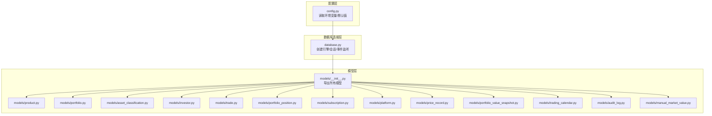
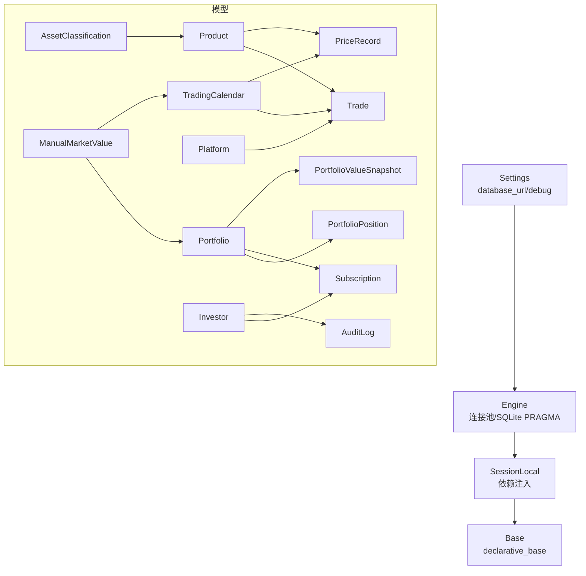
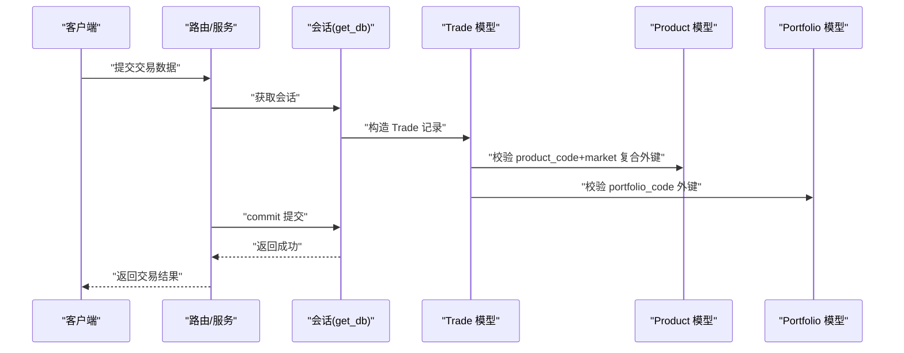
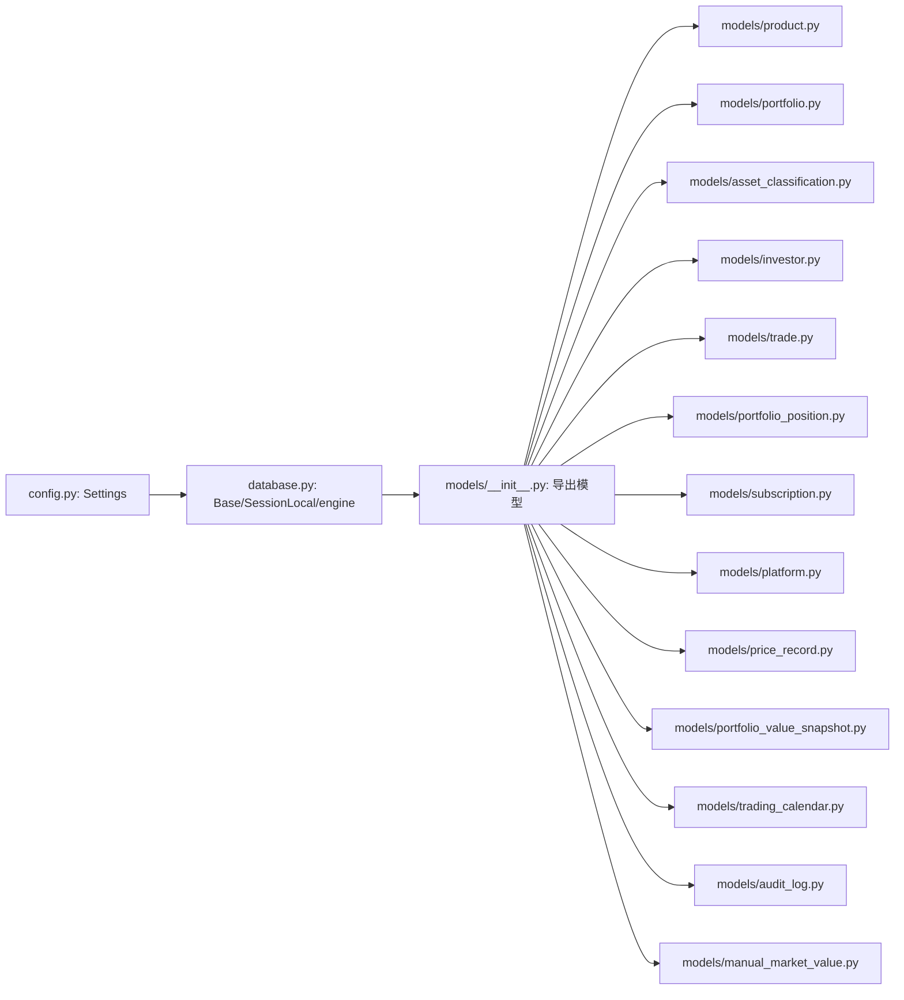

# 数据模型设计

<cite>
**本文引用的文件**
- [backend/app/database.py](file://backend/app/database.py)
- [backend/app/config.py](file://backend/app/config.py)
- [backend/app/models/__init__.py](file://backend/app/models/__init__.py)
- [backend/app/models/product.py](file://backend/app/models/product.py)
- [backend/app/models/portfolio.py](file://backend/app/models/portfolio.py)
- [backend/app/models/asset_classification.py](file://backend/app/models/asset_classification.py)
- [backend/app/models/investor.py](file://backend/app/models/investor.py)
- [backend/app/models/trade.py](file://backend/app/models/trade.py)
- [backend/app/models/portfolio_position.py](file://backend/app/models/portfolio_position.py)
- [backend/app/models/subscription.py](file://backend/app/models/subscription.py)
- [backend/app/models/platform.py](file://backend/app/models/platform.py)
- [backend/app/models/price_record.py](file://backend/app/models/price_record.py)
- [backend/app/models/portfolio_value_snapshot.py](file://backend/app/models/portfolio_value_snapshot.py)
- [backend/app/models/trading_calendar.py](file://backend/app/models/trading_calendar.py)
- [backend/app/models/audit_log.py](file://backend/app/models/audit_log.py)
- [backend/app/models/manual_market_value.py](file://backend/app/models/manual_market_value.py)
- [backend/alembic/versions/0005_rename_cash_amount_and_date_fields.py](file://backend/alembic/versions/0005_rename_cash_amount_and_date_fields.py)
</cite>

## 目录
1. [引言](#引言)
2. [项目结构](#项目结构)
3. [核心组件](#核心组件)
4. [架构总览](#架构总览)
5. [详细组件分析](#详细组件分析)
6. [依赖分析](#依赖分析)
7. [性能考虑](#性能考虑)
8. [故障排查指南](#故障排查指南)
9. [结论](#结论)
10. [附录](#附录)

## 引言
本文件系统性梳理 InvestRing 项目的 SQLAlchemy ORM 数据模型设计，覆盖模型基类与元数据配置、会话管理机制、表映射与字段约束、继承与混合模式、查询优化策略、最佳实践与常见陷阱、扩展与自定义字段规范，以及不同环境下的配置差异与部署注意事项。目标是帮助开发者快速理解并正确使用模型层，确保数据一致性与可维护性。

**更新摘要**
- 更新了字段命名约定，包括 portfolio_position.cash_amount、manual_market_value.value_date、trading_calendar.calendar_date、price_record.price_date
- 新增了 manual_market_value 模型的详细说明
- 更新了相关的数据迁移和字段约束说明

## 项目结构
模型层位于 backend/app/models，采用"按领域分模块"的组织方式：每个业务实体对应一个独立模型文件；通过统一的 Base 声明式基类进行声明；会话工厂与引擎在 backend/app/database.py 中集中配置；全局设置由 backend/app/config.py 提供。



**章节来源**
- [backend/app/models/__init__.py:1-46](file://backend/app/models/__init__.py#L1-L46)
- [backend/app/database.py:1-39](file://backend/app/database.py#L1-L39)
- [backend/app/config.py:1-37](file://backend/app/config.py#L1-L37)

## 核心组件
- 模型基类与元数据
  - 所有模型均继承自统一的 Base（declarative_base 实例），保证 ORM 元数据集中管理与反射一致。
- 会话与引擎
  - 使用 sessionmaker 创建 SessionLocal，支持自动提交关闭；通过 get_db 依赖注入提供请求级会话。
  - 引擎配置连接池参数、pool_pre_ping、pool_recycle，并对 SQLite 进行 WAL 模式与 PRAGMA 配置以提升兼容性与并发稳定性。
- 设置与环境
  - Settings 统一读取 .env 环境变量，若未显式提供 database_url，则根据 db_host/db_port/db_user/db_password/db_name 自动拼接默认 MySQL 连接串。
  - debug 开启时，SQL 输出到控制台，便于开发调试。

**章节来源**
- [backend/app/database.py:1-39](file://backend/app/database.py#L1-L39)
- [backend/app/config.py:1-37](file://backend/app/config.py#L1-L37)

## 架构总览
下图展示模型层与配置/会话层的关系，以及典型业务模型之间的外键关联。



**图表来源**
- [backend/app/config.py:1-37](file://backend/app/config.py#L1-L37)
- [backend/app/database.py:1-39](file://backend/app/database.py#L1-L39)
- [backend/app/models/asset_classification.py:1-13](file://backend/app/models/asset_classification.py#L1-L13)
- [backend/app/models/portfolio.py:1-16](file://backend/app/models/portfolio.py#L1-L16)
- [backend/app/models/platform.py:1-12](file://backend/app/models/platform.py#L1-L12)
- [backend/app/models/product.py:1-22](file://backend/app/models/product.py#L1-L22)
- [backend/app/models/investor.py:1-17](file://backend/app/models/investor.py#L1-L17)
- [backend/app/models/trade.py:1-32](file://backend/app/models/trade.py#L1-L32)
- [backend/app/models/portfolio_position.py:1-34](file://backend/app/models/portfolio_position.py#L1-L34)
- [backend/app/models/subscription.py:1-21](file://backend/app/models/subscription.py#L1-L21)
- [backend/app/models/price_record.py:1-28](file://backend/app/models/price_record.py#L1-L28)
- [backend/app/models/portfolio_value_snapshot.py:1-20](file://backend/app/models/portfolio_value_snapshot.py#L1-L20)
- [backend/app/models/trading_calendar.py:1-13](file://backend/app/models/trading_calendar.py#L1-L13)
- [backend/app/models/audit_log.py:1-18](file://backend/app/models/audit_log.py#L1-L18)
- [backend/app/models/manual_market_value.py:1-25](file://backend/app/models/manual_market_value.py#L1-L25)

## 详细组件分析

### 模型基类与元数据
- 设计要点
  - 统一继承 Base，确保所有模型共享同一 MetaData，便于批量注册与反射。
  - 表名通过 __tablename__ 显式声明，字段通过 Column 定义，配合主键、索引、默认值与触发器等。
- 复杂度与性能
  - 字段数量与索引数量直接影响 DDL 与查询计划；建议仅在必要处建立索引，避免冗余索引导致写入放大。
- 错误处理
  - 缺少 __tablename__ 将导致反射失败或表名推断异常；缺失主键会导致 ORM 查询不稳定。

**章节来源**
- [backend/app/database.py:30](file://backend/app/database.py#L30)
- [backend/app/models/product.py:5-22](file://backend/app/models/product.py#L5-L22)

### 会话管理机制
- 依赖注入
  - get_db 生成请求级会话，try/finally 确保异常时也能关闭连接，避免连接泄漏。
- 连接池与 SQLite 特性
  - pool_pre_ping 与 pool_recycle 提升连接可用性；SQLite 通过事件监听设置 WAL、busy_timeout、synchronous，改善并发与崩溃恢复。
- 并发与事务
  - autocommit=False、autoflush=False 的 SessionLocal 适合长事务与批量写入场景；需显式 commit/rollback 控制一致性。

**章节来源**
- [backend/app/database.py:28-39](file://backend/app/database.py#L28-L39)

### 字段类型与约束
- 数值精度
  - 使用 Numeric(precision, scale) 存储金额与份额，避免浮点误差；如 Trade.amount、PortfolioPosition.shares 等。
- 时间与日期
  - DateTime 用于审计时间戳，Date 用于快照与交易日；部分列使用 server_default 与 onupdate 触发器自动维护。
- 唯一与检查约束
  - 通过 UniqueConstraint 与 CheckConstraint 确保业务规则，例如 PortfolioPosition 的份额与金额互斥校验。
- 外键与复合外键
  - 多数模型通过 ForeignKey 引用其他表主键；复杂关联使用 ForeignKeyConstraint 定义复合外键，如 Trade 与 PriceRecord 对 product_code+market 的联合引用。

**更新** 字段命名约定已更新以保持一致性：
- portfolio_position.cash_amount：现金金额字段，替代原有的 cash_balance
- manual_market_value.value_date：估值日期字段，明确其业务含义
- trading_calendar.calendar_date：交易日字段，统一为 calendar_date 命名
- price_record.price_date：价格日期字段，明确为价格记录日期

**章节来源**
- [backend/app/models/trade.py:26-32](file://backend/app/models/trade.py#L26-L32)
- [backend/app/models/portfolio_position.py:23-33](file://backend/app/models/portfolio_position.py#L23-L33)
- [backend/app/models/price_record.py:21-27](file://backend/app/models/price_record.py#L21-L27)
- [backend/app/models/manual_market_value.py:15-25](file://backend/app/models/manual_market_value.py#L15-L25)
- [backend/app/models/trading_calendar.py:8-13](file://backend/app/models/trading_calendar.py#L8-L13)

### 模型继承与混合类
- 当前现状
  - 模型直接继承 Base，未见显式的混合类（mixin）或抽象基类；各模型独立声明字段与约束。
- 可扩展建议
  - 若多模型需要通用审计字段（created_at、updated_at），可抽取为 Mixin 并在多个模型中混入，减少重复与不一致风险。
  - 若存在跨模型的通用查询逻辑，可考虑在 Base 上扩展公共方法或使用命名约定统一查询接口。

**章节来源**
- [backend/app/database.py:30](file://backend/app/database.py#L30)
- [backend/app/models/portfolio_position.py:1-34](file://backend/app/models/portfolio_position.py#L1-L34)

### 查询优化策略
- 索引与唯一约束
  - 在高频过滤字段（如 Portfolio.code、Investor.code、TradingCalendar.date）上建立索引；对组合唯一键（如 PortfolioPosition、PriceRecord、PortfolioValueSnapshot）减少重复与冲突。
- 复合外键
  - 使用复合外键确保引用完整性，同时结合唯一约束避免重复记录。
- 分页与选择列
  - 查询时尽量只选择必要列，避免 SELECT *；对大结果集使用分页与 limit/offset。
- 事务批处理
  - 写入密集场景使用批量插入/更新，减少往返与锁竞争。

**章节来源**
- [backend/app/models/portfolio.py:8](file://backend/app/models/portfolio.py#L8)
- [backend/app/models/investor.py:8](file://backend/app/models/investor.py#L8)
- [backend/app/models/trading_calendar.py:9](file://backend/app/models/trading_calendar.py#L9)
- [backend/app/models/portfolio_position.py:32](file://backend/app/models/portfolio_position.py#L32)
- [backend/app/models/price_record.py:26](file://backend/app/models/price_record.py#L26)
- [backend/app/models/portfolio_value_snapshot.py:17](file://backend/app/models/portfolio_value_snapshot.py#L17)

### 典型模型序列与调用流程
以下序列图展示"交易记录创建"涉及的关键模型交互与约束校验。



**图表来源**
- [backend/app/models/trade.py:26-32](file://backend/app/models/trade.py#L26-L32)
- [backend/app/models/product.py:8-12](file://backend/app/models/product.py#L8-L12)
- [backend/app/models/portfolio.py:8](file://backend/app/models/portfolio.py#L8)
- [backend/app/database.py:33-39](file://backend/app/database.py#L33-L39)

### 数据模型类图
```mermaid
classDiagram
class Base
class AssetClassification {
+code
+asset_type
+asset_category
+asset_subcat
+description
}
class Product {
+code
+market
+name
+product_type
+asset_class_code
+confirm_days
+is_qdii
+data_source
+fallback_source
+data_source_status
+last_sync_at
+sync_error
+created_at
+updated_at
}
class Platform {
+code
+name
+platform_type
+created_at
}
class Portfolio {
+code
+name
+description
+status
+started_at
+closed_at
+created_at
+updated_at
}
class Investor {
+code
+name
+role
+phone
+email
+password_hash
+last_login_at
+created_at
+updated_at
}
class Trade {
+id
+portfolio_code
+platform_code
+product_code
+market
+trade_type
+shares
+amount
+price
+fee
+actual_amount
+trade_date
+confirm_date
+status
+notes
+created_at
+updated_at
}
class PortfolioPosition {
+id
+portfolio_code
+platform_code
+product_code
+market
+shares
+frozen_shares
+cost_price
+unit_price
+market_value
+cash_amount
+frozen_amount
+snapshot_date
+created_at
}
class Subscription {
+id
+portfolio_code
+investor_code
+sub_type
+amount
+shares
+unit_price
+apply_date
+confirm_date
+status
+notes
+created_at
+updated_at
}
class PriceRecord {
+id
+product_code
+market
+price_date
+unit_price
+accumulated_nav
+pre_close
+pct_change
+net_asset
+source
+created_at
+updated_at
}
class PortfolioValueSnapshot {
+id
+portfolio_code
+snapshot_date
+total_value
+total_shares
+unit_price
+unit_price_change_pct
+created_at
}
class TradingCalendar {
+id
+calendar_date
+is_open
+exchange
+created_at
}
class AuditLog {
+id
+investor_code
+action
+resource_type
+resource_id
+resource_name
+old_value
+new_value
+ip_address
+created_at
}
class ManualMarketValue {
+id
+portfolio_code
+value_date
+total_value
+currency
+notes
+created_at
+updated_at
}
Base <|-- AssetClassification
Base <|-- Product
Base <|-- Platform
Base <|-- Portfolio
Base <|-- Investor
Base <|-- Trade
Base <|-- PortfolioPosition
Base <|-- Subscription
Base <|-- PriceRecord
Base <|-- PortfolioValueSnapshot
Base <|-- TradingCalendar
Base <|-- AuditLog
Base <|-- ManualMarketValue
AssetClassification --> Product : "外键 : asset_class_code -> code"
Product --> Trade : "外键 : product.code/market"
Portfolio --> Trade : "外键 : portfolio.code"
Platform --> Trade : "外键 : platform.code"
Portfolio --> PortfolioPosition : "外键 : portfolio.code"
Portfolio --> Subscription : "外键 : portfolio.code"
Investor --> Subscription : "外键 : investor.code"
Product --> PriceRecord : "外键 : product.code/market"
Portfolio --> PortfolioValueSnapshot : "外键 : portfolio.code"
Portfolio --> ManualMarketValue : "外键 : portfolio.code"
TradingCalendar --> Trade : "校验交易日"
TradingCalendar --> PriceRecord : "校验交易日"
TradingCalendar --> ManualMarketValue : "校验日期"
```

**图表来源**
- [backend/app/models/asset_classification.py:1-13](file://backend/app/models/asset_classification.py#L1-L13)
- [backend/app/models/product.py:1-22](file://backend/app/models/product.py#L1-L22)
- [backend/app/models/platform.py:1-12](file://backend/app/models/platform.py#L1-L12)
- [backend/app/models/portfolio.py:1-16](file://backend/app/models/portfolio.py#L1-L16)
- [backend/app/models/investor.py:1-17](file://backend/app/models/investor.py#L1-L17)
- [backend/app/models/trade.py:1-32](file://backend/app/models/trade.py#L1-L32)
- [backend/app/models/portfolio_position.py:1-34](file://backend/app/models/portfolio_position.py#L1-L34)
- [backend/app/models/subscription.py:1-21](file://backend/app/models/subscription.py#L1-L21)
- [backend/app/models/price_record.py:1-28](file://backend/app/models/price_record.py#L1-L28)
- [backend/app/models/portfolio_value_snapshot.py:1-20](file://backend/app/models/portfolio_value_snapshot.py#L1-L20)
- [backend/app/models/trading_calendar.py:1-13](file://backend/app/models/trading_calendar.py#L1-L13)
- [backend/app/models/audit_log.py:1-18](file://backend/app/models/audit_log.py#L1-L18)
- [backend/app/models/manual_market_value.py:1-25](file://backend/app/models/manual_market_value.py#L1-L25)

## 依赖分析
- 模块耦合
  - 模型层仅依赖 database.Base，耦合度低；外键关系在模型内通过 ForeignKey/ForeignKeyConstraint 声明，清晰表达业务关系。
- 外部依赖
  - SQLAlchemy ORM 与 SQL 方言（MySQL/SQLite）；SQLite 通过事件监听增强 WAL 与 PRAGMA。
- 潜在循环依赖
  - 当前模型间为单向外键引用，未发现循环依赖；若后续引入双向关系，需谨慎设计以避免循环导入。



**图表来源**
- [backend/app/config.py:1-37](file://backend/app/config.py#L1-L37)
- [backend/app/database.py:1-39](file://backend/app/database.py#L1-L39)
- [backend/app/models/__init__.py:1-46](file://backend/app/models/__init__.py#L1-L46)
- [backend/app/models/product.py:1-22](file://backend/app/models/product.py#L1-L22)
- [backend/app/models/portfolio.py:1-16](file://backend/app/models/portfolio.py#L1-L16)
- [backend/app/models/asset_classification.py:1-13](file://backend/app/models/asset_classification.py#L1-L13)
- [backend/app/models/investor.py:1-17](file://backend/app/models/investor.py#L1-L17)
- [backend/app/models/trade.py:1-32](file://backend/app/models/trade.py#L1-L32)
- [backend/app/models/portfolio_position.py:1-34](file://backend/app/models/portfolio_position.py#L1-L34)
- [backend/app/models/subscription.py:1-21](file://backend/app/models/subscription.py#L1-L21)
- [backend/app/models/platform.py:1-12](file://backend/app/models/platform.py#L1-L12)
- [backend/app/models/price_record.py:1-28](file://backend/app/models/price_record.py#L1-L28)
- [backend/app/models/portfolio_value_snapshot.py:1-20](file://backend/app/models/portfolio_value_snapshot.py#L1-L20)
- [backend/app/models/trading_calendar.py:1-13](file://backend/app/models/trading_calendar.py#L1-L13)
- [backend/app/models/audit_log.py:1-18](file://backend/app/models/audit_log.py#L1-L18)
- [backend/app/models/manual_market_value.py:1-25](file://backend/app/models/manual_market_value.py#L1-L25)

## 性能考虑
- 连接池与回收
  - pool_size、max_overflow、pool_pre_ping、pool_recycle 参数平衡吞吐与资源占用；生产环境建议根据 QPS 调优。
- SQLite 专项优化
  - WAL 模式、busy_timeout、synchronous 调整提升并发与可靠性；注意磁盘 IO 与崩溃恢复权衡。
- 查询与索引
  - 为高频过滤字段建立索引；避免 SELECT *；合理使用分页与投影列。
- 写入优化
  - 批量插入/更新；减少事务粒度；必要时使用只读会话与延迟提交。

**章节来源**
- [backend/app/database.py:8-26](file://backend/app/database.py#L8-L26)

## 故障排查指南
- 连接问题
  - 检查 database_url 是否正确；SQLite 仅支持 WAL 模式；确认 .env 文件与 Settings 默认拼接逻辑。
- 会话泄漏
  - 确认每次请求都通过 get_db 获取会话并在 finally 中关闭；避免跨请求复用会话对象。
- 约束冲突
  - 唯一约束冲突（如 PortfolioPosition、PriceRecord、PortfolioValueSnapshot）需先去重再写入。
  - 复合外键错误（如 Trade、PriceRecord）需核对 product_code 与 market 的组合是否匹配 Product 定义。
- 事务回滚
  - 写入失败时检查异常栈并执行 rollback；必要时拆分事务或降级策略。
- 字段命名变更
  - 注意新的字段命名约定：cash_amount、value_date、calendar_date、price_date
  - 迁移脚本会自动处理字段重命名，确保向后兼容性

**章节来源**
- [backend/app/config.py:30-31](file://backend/app/config.py#L30-L31)
- [backend/app/database.py:33-39](file://backend/app/database.py#L33-L39)
- [backend/app/models/portfolio_position.py:32](file://backend/app/models/portfolio_position.py#L32)
- [backend/app/models/price_record.py:26](file://backend/app/models/price_record.py#L26)
- [backend/app/models/trade.py:26-32](file://backend/app/models/trade.py#L26-L32)
- [backend/alembic/versions/0005_rename_cash_amount_and_date_fields.py:1-50](file://backend/alembic/versions/0005_rename_cash_amount_and_date_fields.py#L1-L50)

## 结论
InvestRing 的模型层以统一的 Base 为核心，结合集中式配置与会话管理，形成清晰、可维护的 ORM 架构。通过明确的外键与约束设计，保障了数据一致性；通过连接池与 SQLite 特性优化，提升了运行效率。最新的字段命名约定更新进一步提高了代码的一致性和可读性。建议在保持现有结构的基础上，逐步引入混合类与公共审计字段，完善查询与事务策略，持续优化索引与批处理能力。

## 附录

### 最佳实践清单
- 字段设计
  - 金额与份额使用 Numeric；时间使用 DateTime/Date；必要时启用 server_default/onupdate。
  - 遵循统一的字段命名约定：cash_amount、value_date、calendar_date、price_date。
- 约束与索引
  - 为高频过滤字段建立索引；对重复数据使用 UniqueConstraint；对互斥字段使用 CheckConstraint。
- 会话与事务
  - 使用 get_db 注入会话；长事务分段提交；异常时显式回滚。
- 扩展与自定义
  - 新增模型遵循统一命名与注释规范；如需通用字段，优先考虑 mixin；对外键关系保持清晰注释。

### 常见陷阱与规避
- 忽视复合外键：确保 product_code 与 market 同时匹配。
- 索引滥用：避免对写入频繁且基数低的列建索引。
- 会话生命周期：不要跨请求复用会话；确保 finally 关闭。
- SQLite 限制：仅在 SQLite 场景启用 WAL 与相关 PRAGMA。
- 字段命名不一致：使用统一的命名约定，避免混淆。

### 模型扩展与自定义字段指导
- 新增字段
  - 在模型类中新增 Column；如需唯一性，加入 UniqueConstraint；如需业务校验，加入 CheckConstraint。
  - 遵循新的字段命名约定，确保语义清晰。
- 新增模型
  - 在 models 下新建文件并继承 Base；在 models/__init__.py 中导出；在路由/服务中集成。
- 外键关系
  - 明确一对多/多对多关系；必要时使用复合外键与唯一约束保证引用完整性。

### 不同环境下的配置差异与部署注意事项
- 开发环境
  - debug=True 输出 SQL；可使用 SQLite 本地库；连接池较小即可。
- 生产环境
  - 关闭 debug；使用 MySQL；调整连接池参数；监控慢查询与锁等待。
- SQLite 部署
  - 确保 WAL 模式开启；合理设置 busy_timeout；备份策略与权限控制。
- 迁移部署
  - 执行 alembic 迁移脚本以应用字段重命名变更；确保数据库版本同步。

**章节来源**
- [backend/app/config.py:23](file://backend/app/config.py#L23)
- [backend/app/database.py:8-26](file://backend/app/database.py#L8-L26)
- [backend/alembic/versions/0005_rename_cash_amount_and_date_fields.py:1-50](file://backend/alembic/versions/0005_rename_cash_amount_and_date_fields.py#L1-L50)