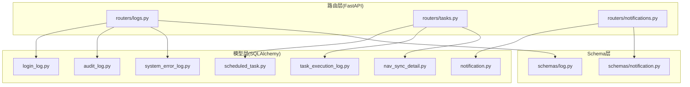
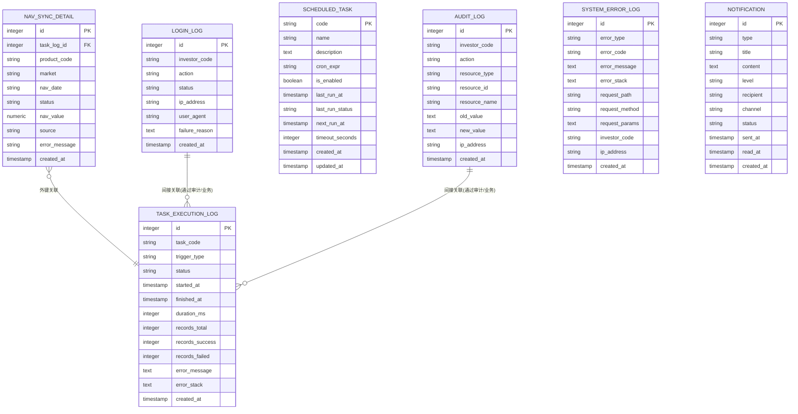
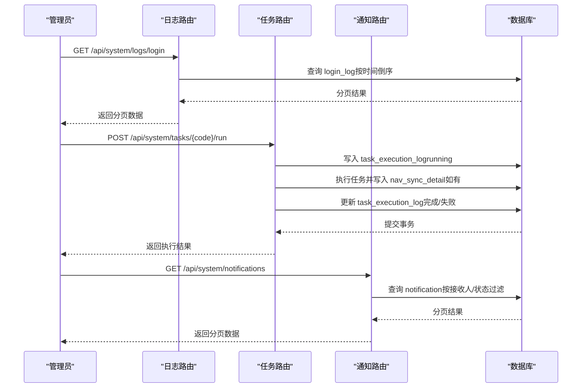

# 日志系统表结构

<cite>
**本文引用的文件**
- [日志系统设计.md](file://Docs/07-日志系统设计.md)
- [数据库设计.md](file://Docs/02-数据库设计.md)
- [login_log.py](file://backend/app/models/login_log.py)
- [audit_log.py](file://backend/app/models/audit_log.py)
- [scheduled_task.py](file://backend/app/models/scheduled_task.py)
- [task_execution_log.py](file://backend/app/models/task_execution_log.py)
- [nav_sync_detail.py](file://backend/app/models/nav_sync_detail.py)
- [system_error_log.py](file://backend/app/models/system_error_log.py)
- [notification.py](file://backend/app/models/notification.py)
- [logs.py](file://backend/app/routers/logs.py)
- [tasks.py](file://backend/app/routers/tasks.py)
- [notifications.py](file://backend/app/routers/notifications.py)
- [log.py](file://backend/app/schemas/log.py)
- [notification.py](file://backend/app/schemas/notification.py)
</cite>

## 目录
1. [简介](#简介)
2. [项目结构](#项目结构)
3. [核心组件](#核心组件)
4. [架构总览](#架构总览)
5. [详细组件分析](#详细组件分析)
6. [依赖关系分析](#依赖关系分析)
7. [性能考量](#性能考量)
8. [故障排查指南](#故障排查指南)
9. [结论](#结论)
10. [附录](#附录)

## 简介
本文件面向数据库与后端工程师，系统化梳理 InvestRing 项目中日志相关的核心表结构与实现，覆盖登录日志、操作审计、定时任务、任务执行日志、净值同步明细、系统错误日志、通知等七张表。内容包括字段语义、数据类型、索引设计、查询优化策略、存储与保留策略、清理机制、最佳实践与监控指标，并辅以可视化图示帮助快速理解。

## 项目结构
日志系统由“模型层（SQLAlchemy）+ 路由层（FastAPI）+ Schema 层（Pydantic）”构成，围绕 seven 日志表展开，配合定时任务与清理策略形成闭环。

图表来源
- [login_log.py:1-16](file://backend/app/models/login_log.py#L1-L16)
- [audit_log.py:1-18](file://backend/app/models/audit_log.py#L1-L18)
- [scheduled_task.py:1-19](file://backend/app/models/scheduled_task.py#L1-L19)
- [task_execution_log.py:1-21](file://backend/app/models/task_execution_log.py#L1-L21)
- [nav_sync_detail.py:1-18](file://backend/app/models/nav_sync_detail.py#L1-L18)
- [system_error_log.py:1-19](file://backend/app/models/system_error_log.py#L1-L19)
- [notification.py:1-19](file://backend/app/models/notification.py#L1-L19)
- [logs.py:1-56](file://backend/app/routers/logs.py#L1-L56)
- [tasks.py:1-323](file://backend/app/routers/tasks.py#L1-L323)
- [notifications.py:1-74](file://backend/app/routers/notifications.py#L1-L74)
- [log.py:1-51](file://backend/app/schemas/log.py#L1-L51)
- [notification.py:1-32](file://backend/app/schemas/notification.py#L1-L32)

章节来源
- [日志系统设计.md:33-310](file://Docs/07-日志系统设计.md#L33-L310)

## 核心组件
本节概览七张日志表的职责边界与关联关系，便于整体把握。

- 登录日志（login_log）：记录用户登录/登出与失败原因，支撑安全审计与风控。
- 操作审计（audit_log）：记录关键业务对象的增删改操作及前后值，满足合规审计。
- 定时任务（scheduled_task）：任务元数据与调度状态，驱动后台自动化。
- 任务执行日志（task_execution_log）：每次任务执行的生命周期记录，含统计与错误信息。
- 净值同步明细（nav_sync_detail）：按产品维度记录净值同步结果，与任务执行日志关联。
- 系统错误日志（system_error_log）：统一捕获异常、API错误与业务错误，便于问题定位。
- 通知（notification）：站内/邮件通知的生命周期与投递状态。

章节来源
- [日志系统设计.md:35-225](file://Docs/07-日志系统设计.md#L35-L225)

## 架构总览
下图展示日志表之间的外键与关联关系，以及典型查询路径。

图表来源
- [login_log.py:1-16](file://backend/app/models/login_log.py#L1-L16)
- [audit_log.py:1-18](file://backend/app/models/audit_log.py#L1-L18)
- [scheduled_task.py:1-19](file://backend/app/models/scheduled_task.py#L1-L19)
- [task_execution_log.py:1-21](file://backend/app/models/task_execution_log.py#L1-L21)
- [nav_sync_detail.py:1-18](file://backend/app/models/nav_sync_detail.py#L1-L18)
- [system_error_log.py:1-19](file://backend/app/models/system_error_log.py#L1-L19)
- [notification.py:1-19](file://backend/app/models/notification.py#L1-L19)

## 详细组件分析

### 登录日志表（login_log）
- 字段与类型
  - id：自增主键
  - investor_code：登录用户标识
  - action：登录/登出/登录失败
  - status：成功/失败
  - ip_address、user_agent：来源信息
  - failure_reason：失败原因
  - created_at：记录时间
- 索引
  - idx_login_log_investor：按用户+时间倒序，支持按用户检索最新登录
  - idx_login_log_status：按状态+时间倒序，支持按状态聚合
- 查询优化
  - 常用过滤：investor_code、status、created_at 范围
  - 建议：在高频筛选列上保持上述复合索引，避免回表
- 存储与保留
  - 文档建议保留周期与清理策略见“日志清理策略”
- 典型查询路径
  - 管理端分页查询登录日志

章节来源
- [日志系统设计.md:35-51](file://Docs/07-日志系统设计.md#L35-L51)
- [login_log.py:1-16](file://backend/app/models/login_log.py#L1-L16)
- [logs.py:25-33](file://backend/app/routers/logs.py#L25-L33)

### 操作审计日志表（audit_log）
- 字段与类型
  - id：自增主键
  - investor_code：操作人
  - action：create/update/delete
  - resource_type/resource_id/resource_name：资源三元组
  - old_value/new_value：变更前/后值（JSON）
  - ip_address：来源IP
  - created_at：记录时间
- 索引
  - idx_audit_log_investor：用户+时间倒序，支持按人检索
  - idx_audit_log_resource：资源类型+ID，支持按资源检索
  - idx_audit_log_time：时间倒序，支持全局时间序列
- 查询优化
  - 常用过滤：investor_code、resource_type、resource_id、action、created_at
  - 建议：对多条件组合查询使用覆盖索引，必要时拆分查询或引入物化视图
- 存储与保留
  - 文档建议保留周期与清理策略见“日志清理策略”

章节来源
- [日志系统设计.md:63-82](file://Docs/07-日志系统设计.md#L63-L82)
- [audit_log.py:1-18](file://backend/app/models/audit_log.py#L1-L18)

### 定时任务表（scheduled_task）
- 字段与类型
  - code：任务编码（主键），唯一标识
  - name/description：任务名称与描述
  - cron_expr：Cron 表达式
  - is_enabled：启用状态
  - last_run_at/last_run_status：上次执行时间与状态
  - next_run_at：下次执行时间
  - timeout_seconds：超时阈值
  - created_at/updated_at：创建与更新时间
- 索引
  - 主键 code；查询通常按 code 或状态筛选
- 查询优化
  - 常用过滤：is_enabled、next_run_at、code
  - 建议：结合调度器维护 next_run_at，减少扫描
- 存储与保留
  - 任务配置表，记录量小且稳定

章节来源
- [日志系统设计.md:99-121](file://Docs/07-日志系统设计.md#L99-L121)
- [scheduled_task.py:1-19](file://backend/app/models/scheduled_task.py#L1-L19)

### 任务执行日志表（task_execution_log）
- 字段与类型
  - id：自增主键
  - task_code：所属任务
  - trigger_type：触发方式（schedule/manual）
  - status：running/success/failed/timeout
  - started_at/finished_at/duration_ms：执行时间线与耗时
  - records_total/success/failed：处理统计
  - error_message/error_stack：错误信息与堆栈
  - created_at：记录时间
- 索引
  - idx_task_log_task：task_code + started_at 倒序，支持按任务检索执行历史
  - idx_task_log_status：status + started_at 倒序，支持按状态聚合
- 查询优化
  - 常用过滤：task_code、status、started_at 范围
  - 建议：对报表类查询使用时间窗口+状态聚合，避免全表扫描
- 存储与保留
  - 文档建议保留周期与清理策略见“日志清理策略”

章节来源
- [日志系统设计.md:125-146](file://Docs/07-日志系统设计.md#L125-L146)
- [task_execution_log.py:1-21](file://backend/app/models/task_execution_log.py#L1-L21)

### 净值同步明细表（nav_sync_detail）
- 字段与类型
  - id：自增主键
  - task_log_id：关联的任务执行日志
  - product_code/market/nav_date：产品+市场+净值日期
  - status：success/failed/skipped
  - nav_value：净值数值
  - source/error_message：来源与错误信息
  - created_at：记录时间
- 索引
  - idx_nav_sync_task：task_log_id，支持按任务查看明细
  - idx_nav_sync_product：product_code/market/nav_date，支持按产品维度检索
  - idx_nav_sync_status：status + created_at 倒序，支持按状态聚合
- 查询优化
  - 常用过滤：task_log_id、product_code、market、nav_date、status
  - 建议：明细查询多为按任务或产品维度，优先使用相应索引
- 存储与保留
  - 文档建议保留周期与清理策略见“日志清理策略”

章节来源
- [日志系统设计.md:159-179](file://Docs/07-日志系统设计.md#L159-L179)
- [nav_sync_detail.py:1-18](file://backend/app/models/nav_sync_detail.py#L1-L18)

### 系统错误日志表（system_error_log）
- 字段与类型
  - id：自增主键
  - error_type：异常/API/业务错误
  - error_code：错误码
  - error_message/error_stack：错误信息与堆栈
  - request_path/request_method/request_params：请求上下文
  - investor_code/ip_address：操作人与来源
  - created_at：记录时间
- 索引
  - idx_error_log_type：error_type + created_at 倒序，支持按类型聚合
  - idx_error_log_time：created_at 倒序，支持全局时间序列
- 查询优化
  - 常用过滤：error_type、created_at 范围
  - 建议：错误分类统计与时间序列分析需注意大文本字段的 IO 影响
- 存储与保留
  - 文档建议保留周期与清理策略见“日志清理策略”

章节来源
- [日志系统设计.md:183-202](file://Docs/07-日志系统设计.md#L183-L202)
- [system_error_log.py:1-19](file://backend/app/models/system_error_log.py#L1-L19)

### 通知表（notification）
- 字段与类型
  - id：自增主键
  - type：系统/错误/业务
  - title/content：标题与内容
  - level：info/warning/error
  - recipient：接收者（admin/all/{investor_code}）
  - channel：投递渠道（in_app/email）
  - status：pending/sent/read
  - sent_at/read_at：发送与阅读时间
  - created_at：创建时间
- 索引
  - idx_notification_recipient：recipient + status + created_at 倒序，支持按接收人筛选
  - idx_notification_status：status + created_at 倒序，支持按状态聚合
- 查询优化
  - 常用过滤：recipient、status、channel、type
  - 建议：对非管理员用户进行权限过滤，避免全表扫描
- 存储与保留
  - 文档建议保留周期与清理策略见“日志清理策略”

章节来源
- [日志系统设计.md:206-225](file://Docs/07-日志系统设计.md#L206-L225)
- [notification.py:1-19](file://backend/app/models/notification.py#L1-L19)

## 依赖关系分析
- 路由层依赖模型层进行 ORM 查询与写入
- 日志路由返回对应 Schema 的 Pydantic 模型
- 任务路由负责调度与清理逻辑，涉及多表写入与事务控制
- 通知路由根据用户角色进行权限控制与数据隔离

图表来源
- [logs.py:25-55](file://backend/app/routers/logs.py#L25-L55)
- [tasks.py:88-267](file://backend/app/routers/tasks.py#L88-L267)
- [notifications.py:12-73](file://backend/app/routers/notifications.py#L12-L73)

章节来源
- [logs.py:1-56](file://backend/app/routers/logs.py#L1-L56)
- [tasks.py:1-323](file://backend/app/routers/tasks.py#L1-L323)
- [notifications.py:1-74](file://backend/app/routers/notifications.py#L1-L74)

## 性能考量
- 索引策略
  - 时间倒序索引：login_log、audit_log、system_error_log、task_execution_log、notification 均有按 created_at 倒序索引，适合时间序列查询
  - 复合索引：login_log、audit_log、nav_sync_detail、notification 均有复合过滤列，降低回表成本
- 查询模式
  - 分页查询：统一使用 offset/limit，建议结合“基于游标”的分页以提升大偏移性能（概念性建议）
  - 聚合统计：按状态/类型/用户维度的聚合应尽量利用现有索引，避免全表扫描
- 写入与事务
  - 任务执行日志与净值同步明细写入需在单事务中提交，保证一致性
- 存储与清理
  - 按保留周期定期清理，避免冷数据膨胀影响查询性能

章节来源
- [日志系统设计.md:430-451](file://Docs/07-日志系统设计.md#L430-L451)
- [tasks.py:19-68](file://backend/app/routers/tasks.py#L19-L68)

## 故障排查指南
- 登录/登出异常
  - 检查 login_log 中的 status 与 failure_reason，结合 IP 与 UA 定位风险
- 审计缺失或不一致
  - 核对 audit_log 的 resource_type/resource_id 与业务对象是否匹配，确认 JSON 变更内容是否正确脱敏
- 任务执行失败
  - 查看 task_execution_log 的 status、error_message、error_stack，核对 nav_sync_detail 的失败明细
- 错误日志定位
  - 使用 system_error_log 的 error_type、request_path、request_method 进行过滤，结合 error_stack 定位根因
- 通知未送达
  - 检查 notification 的 recipient、channel、status，确认投递渠道与接收人权限

章节来源
- [日志系统设计.md:183-225](file://Docs/07-日志系统设计.md#L183-L225)
- [tasks.py:111-267](file://backend/app/routers/tasks.py#L111-L267)

## 结论
该日志体系以“可审计、可追溯、可治理”为目标，通过七张核心表覆盖登录、审计、任务、同步、错误与通知等关键场景。配合完善的索引、保留与清理策略，能够满足金融系统的合规与运维需求。建议持续关注查询热点与写入峰值，适时引入游标分页与异步归档，进一步提升系统稳定性与性能。

## 附录

### 表字段与索引速览
- login_log：investor_code+created_at、status+created_at
- audit_log：investor_code+created_at、resource_type+resource_id、created_at
- task_execution_log：task_code+started_at、status+started_at
- nav_sync_detail：task_log_id、product_code+market+nav_date、status+created_at
- system_error_log：error_type+created_at、created_at
- notification：recipient+status+created_at、status+created_at

章节来源
- [日志系统设计.md:35-225](file://Docs/07-日志系统设计.md#L35-L225)

### API 一览（与日志相关）
- 登录日志：GET /api/system/logs/login
- 审计日志：GET /api/system/logs/audit
- 错误日志：GET /api/system/logs/error
- 任务管理：GET/POST /api/system/tasks、POST /api/system/tasks/{code}/run、enable/disable
- 通知：GET /api/system/notifications、POST /api/system/notifications/{id}/read、POST /api/system/notifications/read-all

章节来源
- [日志系统设计.md:229-308](file://Docs/07-日志系统设计.md#L229-L308)
- [logs.py:25-55](file://backend/app/routers/logs.py#L25-L55)
- [tasks.py:70-322](file://backend/app/routers/tasks.py#L70-L322)
- [notifications.py:12-73](file://backend/app/routers/notifications.py#L12-L73)