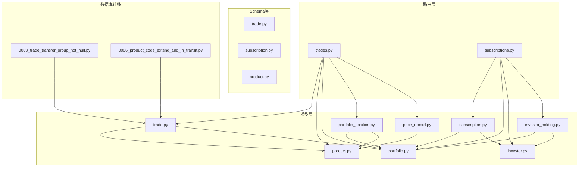
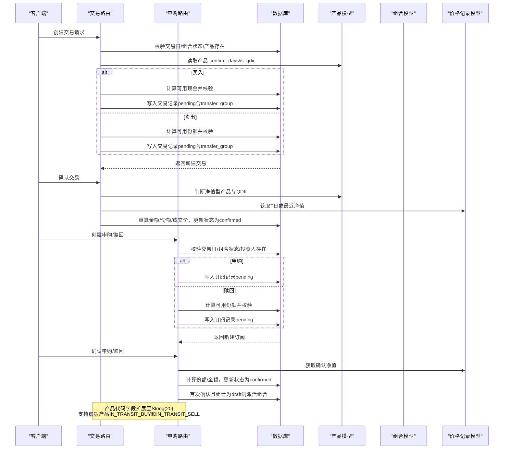
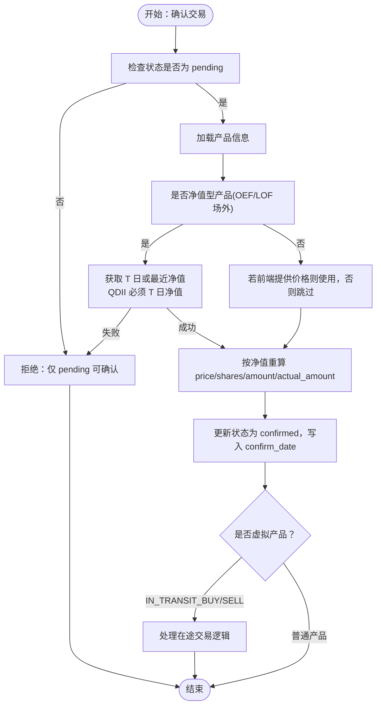
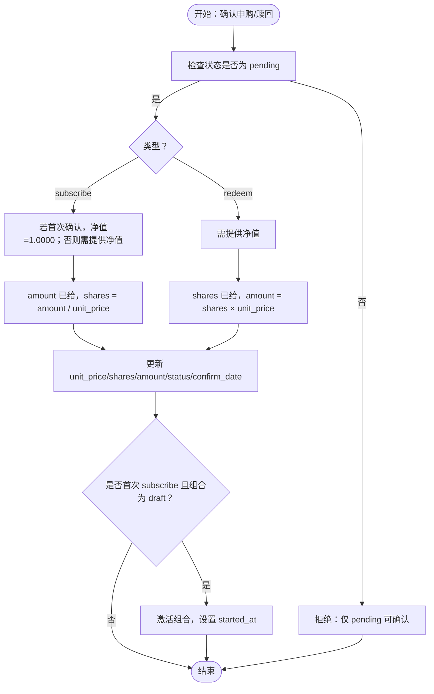
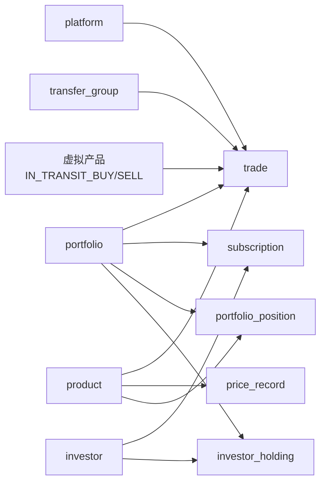

# 交易与订单管理表

<cite>
**本文引用的文件**
- [trade.py](file://backend/app/models/trade.py)
- [subscription.py](file://backend/app/models/subscription.py)
- [price_record.py](file://backend/app/models/price_record.py)
- [product.py](file://backend/app/models/product.py)
- [trade 路由](file://backend/app/routers/trades.py)
- [subscription 路由](file://backend/app/routers/subscriptions.py)
- [portfolio.py](file://backend/app/models/portfolio.py)
- [portfolio_position.py](file://backend/app/models/portfolio_position.py)
- [investor.py](file://backend/app/models/investor.py)
- [investor_holding.py](file://backend/app/models/investor_holding.py)
- [产品模型 Schema](file://backend/app/schemas/product.py)
- [交易模型 Schema](file://backend/app/schemas/trade.py)
- [申购赎回模型 Schema](file://backend/app/schemas/subscription.py)
- [数据库设计文档](file://Docs/02-数据库设计.md)
- [初始化数据 SQL](file://Docs/init_data.sql)
- [Alembic迁移0003_trade_transfer_group_not_null.py](file://backend/alembic/versions/0003_trade_transfer_group_not_null.py)
- [Alembic迁移0006_product_code_extend_and_in_transit.py](file://backend/alembic/versions/0006_product_code_extend_and_in_transit.py)
</cite>

## 更新摘要
**所做更改**
- 产品代码字段从String(10)扩展到String(20)，支持更长的产品编码
- 新增虚拟产品IN_TRANSIT_BUY和IN_TRANSIT_SELL用于跟踪待确认交易
- 通过数据库迁移0006_product_code_extend_and_in_transit.py实现架构变更
- 增强交易确认流程的灵活性和数据完整性

## 目录
1. [简介](#简介)
2. [项目结构](#项目结构)
3. [核心组件](#核心组件)
4. [架构总览](#架构总览)
5. [详细组件分析](#详细组件分析)
6. [依赖分析](#依赖分析)
7. [性能考虑](#性能考虑)
8. [故障排查指南](#故障排查指南)
9. [结论](#结论)
10. [附录](#附录)

## 简介
本文件聚焦于交易与订单管理相关的三张核心表：交易（trade）、申购赎回（subscription）、价格记录（price_record）。围绕这些表，文档系统性阐述：
- 设计理念与业务边界
- 字段定义、数据类型、约束与业务规则
- 交易指令处理流程、申购赎回操作规则
- 价格记录的获取与存储机制
- 交易与产品、价格记录的关联关系
- 申购赎回与份额变动的业务逻辑
- 交易执行、订单处理、价格数据管理与交易成本计算的完整业务逻辑
- 提供建表语句与数据示例（以路径引用替代具体代码）

**最新更新**：系统已升级支持产品代码字段扩展至String(20)，并新增虚拟产品IN_TRANSIT_BUY和IN_TRANSIT_SELL用于跟踪待确认交易，通过增强的数据完整性约束确保交易处理的准确性和可靠性。

## 项目结构
与交易与订单管理直接相关的后端模块组织如下：
- 模型层：trade.py、subscription.py、price_record.py、product.py、portfolio.py、portfolio_position.py、investor.py、investor_holding.py
- 路由层：trades.py、subscriptions.py
- Schema 层：trade.py、subscription.py、product.py
- 数据库迁移：alembic版本控制
- 文档与初始化：02-数据库设计.md、init_data.sql



**图表来源**
- [trade.py:1-32](file://backend/app/models/trade.py#L1-L32)
- [subscription.py:1-21](file://backend/app/models/subscription.py#L1-L21)
- [price_record.py:1-28](file://backend/app/models/price_record.py#L1-L28)
- [product.py:1-22](file://backend/app/models/product.py#L1-L22)
- [portfolio.py:1-16](file://backend/app/models/portfolio.py#L1-L16)
- [portfolio_position.py:1-34](file://backend/app/models/portfolio_position.py#L1-L34)
- [investor.py:1-17](file://backend/app/models/investor.py#L1-L17)
- [investor_holding.py:1-20](file://backend/app/models/investor_holding.py#L1-L20)
- [trade 路由:1-567](file://backend/app/routers/trades.py#L1-L567)
- [subscription 路由:1-375](file://backend/app/routers/subscriptions.py#L1-L375)
- [Alembic迁移0003_trade_transfer_group_not_null.py:1-100](file://backend/alembic/versions/0003_trade_transfer_group_not_null.py#L1-L100)
- [Alembic迁移0006_product_code_extend_and_in_transit.py:1-100](file://backend/alembic/versions/0006_product_code_extend_and_in_transit.py#L1-L100)

## 核心组件
本节从"表结构、字段、约束、业务规则"四个维度，逐表解析。

- 交易（trade）
  - 主要字段与含义：自增主键、组合编码、平台编码、产品代码、市场、交易类型（买/卖）、份额、金额、成交价、费用、实际金额、交易日期、确认日期、状态、备注、创建/更新时间、转账组标识。
  - 关键约束：
    - 外键：portfolio.code、platform.code
    - 复合外键：product.code+market
    - transfer_group非空约束：确保每笔交易都属于某个转账组，消除孤立交易
    - 状态默认值为"pending"，支持"confirmed""cancelled"
  - 业务规则：
    - 买入：amount = actual_amount - fee；shares = amount / price
    - 卖出：amount = actual_amount + fee；shares = amount / price
    - 场内（CN_EXCHANGE）当日确认；场外（CN_OTC）按产品 confirm_days 确认（T+1 或 T+2）
    - QDII 产品必须使用 T 日净值，且 T 日净值必须存在
    - 可用现金与可用份额的实时计算，防止超额下单/撤单限制
    - **产品代码字段扩展：支持String(20)长度，适应更长的产品编码**
    - **虚拟产品支持：IN_TRANSIT_BUY和IN_TRANSIT_SELL用于跟踪待确认交易**

- 申购赎回（subscription）
  - 主要字段与含义：自增主键、组合编码、投资人编码、类型（subscribe/redeem）、申请金额、确认份额、确认净值、申请日期、确认日期、状态、备注、创建/更新时间。
  - 关键约束：
    - 外键：portfolio.code、investor.code
    - 状态默认值为"pending"，支持"confirmed""cancelled"
  - 业务规则：
    - 申购：输入金额，确认时按净值计算份额
    - 赎回：输入份额，确认时按净值计算金额
    - 首次确认时若组合状态为 draft，则切换为 active，并记录 started_at
    - 可用份额实时计算，冻结 pending 赎回与未生成快照的 confirmed 赎回
    - **产品代码字段扩展：支持String(20)长度，适应更长的产品编码**

- 价格记录（price_record）
  - 主要字段与含义：自增主键、产品代码、市场、日期、单位净值、累计净值、前一日收盘价、涨跌幅、净资产、数据源、创建/更新时间。
  - 关键约束：
    - 复合外键：product.code+market
    - 唯一索引：(product_code, market, date)
  - 业务规则：
    - 作为净值/价格数据源，支撑交易确认与净值计算
    - QDII 产品 T 日净值缺失时，交易确认流程会报错
    - **产品代码字段扩展：支持String(20)长度，适应更长的产品编码**

**章节来源**
- [trade.py:1-32](file://backend/app/models/trade.py#L1-L32)
- [subscription.py:1-21](file://backend/app/models/subscription.py#L1-L21)
- [price_record.py:1-28](file://backend/app/models/price_record.py#L1-L28)
- [交易模型 Schema:1-45](file://backend/app/schemas/trade.py#L1-L45)
- [申购赎回模型 Schema:1-39](file://backend/app/schemas/subscription.py#L1-L39)
- [产品模型 Schema:1-36](file://backend/app/schemas/product.py#L1-L36)
- [数据库设计文档:347-372](file://Docs/02-数据库设计.md#L347-L372)
- [数据库设计文档:323-343](file://Docs/02-数据库设计.md#L323-L343)
- [数据库设计文档:389-408](file://Docs/02-数据库设计.md#L389-L408)
- [Alembic迁移0003_trade_transfer_group_not_null.py:1-100](file://backend/alembic/versions/0003_trade_transfer_group_not_null.py#L1-L100)
- [Alembic迁移0006_product_code_extend_and_in_transit.py:1-100](file://backend/alembic/versions/0006_product_code_extend_and_in_transit.py#L1-L100)

## 架构总览
交易与订单管理涉及的模块交互如下：



**图表来源**
- [trade 路由:292-402](file://backend/app/routers/trades.py#L292-L402)
- [trade 路由:417-504](file://backend/app/routers/trades.py#L417-L504)
- [subscription 路由:115-199](file://backend/app/routers/subscriptions.py#L115-L199)
- [subscription 路由:237-320](file://backend/app/routers/subscriptions.py#L237-L320)

## 详细组件分析

### 交易（trade）表
- 字段与类型
  - id: 整型，自增主键
  - portfolio_code: 字符串，外键 portfolio.code
  - platform_code: 字符串，外键 platform.code
  - product_code: 字符串（扩展至String(20)），配合 market 作为复合外键 product.code+market
  - market: 字符串，枚举 CN_EXCHANGE/CN_OTC/HK_MUTUAL/NULL
  - trade_type: 字符串，枚举 buy/sell
  - shares: 数值（15,4），卖出份额
  - amount: 数值（15,4），买入金额或卖出金额
  - price: 数值（10,4），成交价
  - fee: 数值（15,4），费用
  - actual_amount: 数值（15,4），实际金额（含/扣除手续费）
  - trade_date: 日期，T 日
  - confirm_date: 日期，确认日期
  - status: 字符串，默认 pending
  - notes: 文本
  - created_at/updated_at: 时间戳
  - transfer_group: 字符串，转账组标识，非空约束
- 业务规则
  - 买入：amount = actual_amount - fee；shares = amount / price
  - 卖出：amount = actual_amount + fee；shares = amount / price
  - 场内（CN_EXCHANGE）当日确认；场外（CN_OTC）按产品 confirm_days 确认（T+1 或 T+2）
  - QDII 产品必须使用 T 日净值，且 T 日净值必须存在
  - 可用现金与可用份额的实时计算，防止超额下单/撤单限制
  - transfer_group必填：每笔交易必须属于某个转账组，确保数据完整性
  - **产品代码字段扩展：支持String(20)长度，适应更复杂的产品编码体系**
  - **虚拟产品支持：IN_TRANSIT_BUY和IN_TRANSIT_SELL用于跟踪待确认交易的中间状态**
- 关键流程图（确认交易）



**图表来源**
- [trade 路由:417-504](file://backend/app/routers/trades.py#L417-L504)
- [trade 路由:53-106](file://backend/app/routers/trades.py#L53-L106)

**章节来源**
- [trade.py:1-32](file://backend/app/models/trade.py#L1-L32)
- [交易模型 Schema:1-45](file://backend/app/schemas/trade.py#L1-L45)
- [trade 路由:292-402](file://backend/app/routers/trades.py#L292-L402)
- [trade 路由:417-504](file://backend/app/routers/trades.py#L417-L504)
- [Alembic迁移0003_trade_transfer_group_not_null.py:1-100](file://backend/alembic/versions/0003_trade_transfer_group_not_null.py#L1-L100)
- [Alembic迁移0006_product_code_extend_and_in_transit.py:1-100](file://backend/alembic/versions/0006_product_code_extend_and_in_transit.py#L1-L100)

### 申购赎回（subscription）表
- 字段与类型
  - id: 整型，自增主键
  - portfolio_code: 字符串，外键 portfolio.code
  - investor_code: 字符串，外键 investor.code
  - sub_type: 字符串，枚举 subscribe/redeem
  - amount: 数值（15,4），申请金额（申购）
  - shares: 数值（15,4），申请份额（赎回）
  - unit_price: 数值（10,4），确认净值
  - apply_date: 日期，T 日
  - confirm_date: 日期，确认日期
  - status: 字符串，默认 pending
  - notes: 文本
  - created_at/updated_at: 时间戳
- 业务规则
  - 申购：输入金额，确认时按净值计算份额
  - 赎回：输入份额，确认时按净值计算金额
  - 首次确认且 sub_type=subscribe 且组合状态为 draft，则激活组合并设置 started_at
  - 可用份额实时计算，冻结 pending 赎回与未生成快照的 confirmed 赎回
  - **产品代码字段扩展：支持String(20)长度，适应更复杂的产品编码体系**
- 关键流程图（确认申购/赎回）



**图表来源**
- [subscription 路由:237-320](file://backend/app/routers/subscriptions.py#L237-L320)

**章节来源**
- [subscription.py:1-21](file://backend/app/models/subscription.py#L1-L21)
- [申购赎回模型 Schema:1-39](file://backend/app/schemas/subscription.py#L1-L39)
- [subscription 路由:115-199](file://backend/app/routers/subscriptions.py#L115-L199)
- [subscription 路由:237-320](file://backend/app/routers/subscriptions.py#L237-L320)

### 价格记录（price_record）表
- 字段与类型
  - id: 整型，自增主键
  - product_code: 字符串（扩展至String(20)）
  - market: 字符串
  - date: 日期
  - unit_price: 数值（10,4），统一价格字段
  - accumulated_nav: 数值（10,4），累计净值（场外）
  - pre_close: 数值（10,4），前一日收盘价
  - pct_change: 数值（8,4），涨跌幅
  - net_asset: 数值（15,4），净资产
  - source: 字符串，数据源
  - created_at/updated_at: 时间戳
- 关键约束
  - 复合外键：product.code+market
  - 唯一索引：(product_code, market, date)
- 业务规则
  - 作为净值/价格数据源，支撑交易确认与净值计算
  - QDII 产品 T 日净值缺失时，交易确认流程会报错
  - **产品代码字段扩展：支持String(20)长度，适应更复杂的产品编码体系**

**章节来源**
- [price_record.py:1-28](file://backend/app/models/price_record.py#L1-L28)
- [数据库设计文档:389-408](file://Docs/02-数据库设计.md#L389-L408)

### 交易与产品、价格记录的关联关系
- 交易（trade）通过 product_code+market 关联产品（product），并通过价格记录（price_record）获取净值进行确认
- 产品（product）定义了 confirm_days 与 is_qdii，决定交易确认的时间与净值获取策略
- 价格记录（price_record）提供 unit_price、accumulated_nav 等字段，支撑交易金额与份额的重算
- transfer_group字段确保每笔交易都有明确的归属分组，便于批量处理和追踪
- **产品代码字段扩展：支持String(20)长度，适应更复杂的产品编码体系**
- **虚拟产品支持：IN_TRANSIT_BUY和IN_TRANSIT_SELL用于跟踪待确认交易的中间状态**

```mermaid
erDiagram
PRODUCT {
string code PK (String(20))
string market PK
string name
string product_type
string asset_class_code
int confirm_days
boolean is_qdii
}
TRADE {
int id PK
string portfolio_code FK
string platform_code FK
string product_code FK (String(20))
string market FK
string trade_type
decimal shares
decimal amount
decimal price
decimal fee
decimal actual_amount
date trade_date
date confirm_date
string status
string transfer_group NOT NULL
}
PRICE_RECORD {
int id PK
string product_code FK (String(20))
string market FK
date date
decimal unit_price
decimal accumulated_nav
decimal pre_close
decimal pct_change
decimal net_asset
string source
}
VIRTUAL_PRODUCTS {
string code PK (String(20))
string description
string type
}
TRADE }o--|| PRODUCT : "product_code+market"
PRICE_RECORD }o--|| PRODUCT : "product_code+market"
TRADE }o--|| VIRTUAL_PRODUCTS : "virtual product codes"
```

**图表来源**
- [trade.py:1-32](file://backend/app/models/trade.py#L1-L32)
- [price_record.py:1-28](file://backend/app/models/price_record.py#L1-L28)
- [product.py:1-22](file://backend/app/models/product.py#L1-L22)

### 申购赎回与份额变动的业务逻辑
- 申购：输入金额，确认时按净值计算份额；首次确认且组合为 draft 时激活组合
- 赎回：输入份额，确认时按净值计算金额；可用份额实时计算，冻结 pending 赎回与未生成快照的 confirmed 赎回
- 份额变动事件（share_change_event）与组合/投资人份额快照（portfolio_position、investor_holding）共同维护份额历史与可用性
- **产品代码字段扩展：支持String(20)长度，适应更复杂的产品编码体系**

**章节来源**
- [subscription 路由:237-320](file://backend/app/routers/subscriptions.py#L237-L320)
- [investor_holding.py:1-20](file://backend/app/models/investor_holding.py#L1-L20)
- [portfolio_position.py:1-34](file://backend/app/models/portfolio_position.py#L1-L34)

### 交易执行、订单处理、价格数据管理与交易成本计算
- 交易执行
  - 创建：校验交易日、组合状态、产品存在；买入/卖出分别按金额/份额与手续费计算
  - 确认：根据产品类型与 QDII 规则获取净值，重算金额/份额/成交价，更新状态
  - 取消：仅场外 pending 可取消，场内通常不允许取消
  - 数据完整性：所有交易必须包含transfer_group，确保无孤立交易记录
  - **产品代码字段扩展：支持String(20)长度，适应更复杂的产品编码体系**
  - **虚拟产品支持：IN_TRANSIT_BUY和IN_TRANSIT_SELL用于跟踪待确认交易的中间状态**
- 订单处理
  - 申购/赎回：输入金额/份额，实时校验可用现金/可用份额，确认时按净值计算
  - 首次确认激活组合
  - **产品代码字段扩展：支持String(20)长度，适应更复杂的产品编码体系**
- 价格数据管理
  - 价格记录唯一索引保证每日每产品的唯一性
  - QDII 产品 T 日净值缺失时报错，避免使用不完整数据
  - **产品代码字段扩展：支持String(20)长度，适应更复杂的产品编码体系**
- 交易成本计算
  - 买入：amount = actual_amount - fee；shares = amount / price
  - 卖出：amount = actual_amount + fee；shares = amount / price

**章节来源**
- [trade 路由:292-402](file://backend/app/routers/trades.py#L292-L402)
- [trade 路由:417-504](file://backend/app/routers/trades.py#L417-L504)
- [subscription 路由:115-199](file://backend/app/routers/subscriptions.py#L115-L199)
- [subscription 路由:237-320](file://backend/app/routers/subscriptions.py#L237-L320)
- [price_record.py:1-28](file://backend/app/models/price_record.py#L1-L28)

### Alembic迁移与数据完整性保障
- **迁移文件**：0003_trade_transfer_group_not_null.py、0006_product_code_extend_and_in_transit.py
- **主要功能**：
  - 为trade表的transfer_group字段添加非空约束
  - 幂等回填现有数据的transfer_group值
  - 健壮的异常处理和数据验证
  - **产品代码字段扩展：将product_code字段从String(10)扩展到String(20)**
  - **虚拟产品支持：新增IN_TRANSIT_BUY和IN_TRANSIT_SELL虚拟产品代码**
- **数据完整性提升**：
  - 消除孤立交易记录的可能性
  - 确保每笔交易都有明确的分组归属
  - 支持批量交易处理和追踪
  - **产品代码兼容性：向后兼容原有短产品编码**
  - **虚拟产品一致性：确保虚拟产品在系统中的正确识别和处理**

**章节来源**
- [Alembic迁移0003_trade_transfer_group_not_null.py:1-100](file://backend/alembic/versions/0003_trade_transfer_group_not_null.py#L1-L100)
- [Alembic迁移0006_product_code_extend_and_in_transit.py:1-100](file://backend/alembic/versions/0006_product_code_extend_and_in_transit.py#L1-L100)

## 依赖分析
- 外键与级联
  - trade 外键 portfolio.code、platform.code、product.code+market
  - subscription 外键 portfolio.code、investor.code
  - price_record 外键 product.code+market
  - transfer_group非空约束：确保交易数据完整性
  - **产品代码字段扩展：String(20)长度的外键约束**
  - **虚拟产品支持：IN_TRANSIT_BUY和IN_TRANSIT_SELL的特殊处理**
- 约束与索引
  - trade、subscription、price_record、portfolio_position、investor_holding 等均有唯一索引或检查约束，保障数据一致性
  - 初始化脚本包含关键索引，提升查询性能
  - **产品代码字段扩展：保持索引性能优化**



**图表来源**
- [trade.py:1-32](file://backend/app/models/trade.py#L1-L32)
- [subscription.py:1-21](file://backend/app/models/subscription.py#L1-L21)
- [price_record.py:1-28](file://backend/app/models/price_record.py#L1-L28)
- [portfolio_position.py:1-34](file://backend/app/models/portfolio_position.py#L1-L34)
- [investor_holding.py:1-20](file://backend/app/models/investor_holding.py#L1-L20)
- [portfolio.py:1-16](file://backend/app/models/portfolio.py#L1-L16)
- [investor.py:1-17](file://backend/app/models/investor.py#L1-L17)
- [product.py:1-22](file://backend/app/models/product.py#L1-L22)

**章节来源**
- [数据库设计文档:599-621](file://Docs/02-数据库设计.md#L599-L621)
- [初始化数据 SQL:243-276](file://Docs/init_data.sql#L243-L276)

## 性能考虑
- 索引策略
  - 交易：按 portfolio_code、trade_date、status、confirm_date 建立索引，加速查询与确认流程
  - 申购赎回：按 portfolio_code、apply_date、status、confirm_date 建立索引
  - 价格记录：按 product_code、market、date 建立索引
  - **产品代码字段扩展：保持索引性能，适应更长产品编码**
- 实时计算
  - 可用现金与可用份额需实时计算，避免仅依赖快照导致的不一致
- 并发与 WAL
  - SQLite 建议使用 WAL 模式提升并发性能（已在设计文档中说明）
- 数据完整性优化
  - transfer_group非空约束减少数据验证开销
  - 幂等迁移确保升级过程的性能稳定
  - **产品代码字段扩展：向后兼容的索引优化**

## 故障排查指南
- 交易确认失败
  - QDII 产品 T 日净值缺失：检查 price_record 是否存在对应日期净值
  - 非净值型产品未提供价格：确认前端是否传入 price
  - transfer_group为空：检查交易创建时是否正确设置转账组标识
  - **产品代码字段问题：检查产品编码长度是否超过String(20)限制**
  - **虚拟产品问题：检查IN_TRANSIT_BUY和IN_TRANSIT_SELL的正确使用**
- 申购/赎回失败
  - 可用份额不足：检查 pending/redeem 与未生成快照的 confirmed redeem
  - 非交易日：确认 apply_date 是否为交易日
  - **产品代码字段问题：检查产品编码长度是否超过String(20)限制**
- 状态异常
  - 仅 pending 可确认/取消：检查状态流转是否正确
  - **虚拟产品状态：检查IN_TRANSIT_BUY和IN_TRANSIT_SELL的状态转换**
- 组合状态
  - 首次确认 subscribe 且组合为 draft：确认是否已激活并设置 started_at
- 数据完整性问题
  - 孤立交易记录：检查transfer_group字段是否正确填充
  - 迁移失败：查看Alembic迁移日志和错误信息
  - **产品代码字段迁移：检查String(10)到String(20)的迁移是否成功**

**章节来源**
- [trade 路由:53-106](file://backend/app/routers/trades.py#L53-L106)
- [trade 路由:417-504](file://backend/app/routers/trades.py#L417-L504)
- [subscription 路由:237-320](file://backend/app/routers/subscriptions.py#L237-L320)
- [Alembic迁移0003_trade_transfer_group_not_null.py:1-100](file://backend/alembic/versions/0003_trade_transfer_group_not_null.py#L1-L100)
- [Alembic迁移0006_product_code_extend_and_in_transit.py:1-100](file://backend/alembic/versions/0006_product_code_extend_and_in_transit.py#L1-L100)

## 结论
交易与订单管理表围绕"交易（trade）、申购赎回（subscription）、价格记录（price_record）"构建，通过产品（product）与组合（portfolio）等模型形成闭环。系统在交易确认、净值获取、可用资金/份额计算、状态流转等方面具备完善的业务规则与错误处理机制。**最新的产品代码字段扩展至String(20)和虚拟产品IN_TRANSIT_BUY、IN_TRANSIT_SELL的支持进一步增强系统的灵活性和可扩展性，能够适应更复杂的产品编码体系和更精细的交易状态管理**。配合索引与实时计算策略，能够满足日常交易与订单管理的高可靠与高性能需求。

## 附录
- 建表语句与索引
  - 交易（trade）建表语句与索引参见数据库设计文档与初始化脚本
  - 申购赎回（subscription）建表语句与索引参见数据库设计文档与初始化脚本
  - 价格记录（price_record）建表语句与索引参见数据库设计文档与初始化脚本
  - **产品代码字段扩展：相关字段变更参见Alembic迁移0006_product_code_extend_and_in_transit.py**
  - **虚拟产品支持：相关数据结构参见Alembic迁移0006_product_code_extend_and_in_transit.py**
- 数据示例
  - 产品与平台等初始化数据参见初始化脚本
  - **产品代码字段扩展：新的产品编码示例参见迁移文件**
  - **虚拟产品示例：IN_TRANSIT_BUY和IN_TRANSIT_SELL的使用示例参见迁移文件**
- 数据迁移
  - Alembic迁移0003_trade_transfer_group_not_null.py处理transfer_group字段的非空约束变更
  - **Alembic迁移0006_product_code_extend_and_in_transit.py处理产品代码字段扩展和虚拟产品支持**

**章节来源**
- [数据库设计文档:323-372](file://Docs/02-数据库设计.md#L323-L372)
- [数据库设计文档:389-408](file://Docs/02-数据库设计.md#L389-L408)
- [初始化数据 SQL:243-276](file://Docs/init_data.sql#L243-L276)
- [Alembic迁移0003_trade_transfer_group_not_null.py:1-100](file://backend/alembic/versions/0003_trade_transfer_group_not_null.py#L1-L100)
- [Alembic迁移0006_product_code_extend_and_in_transit.py:1-100](file://backend/alembic/versions/0006_product_code_extend_and_in_transit.py#L1-L100)