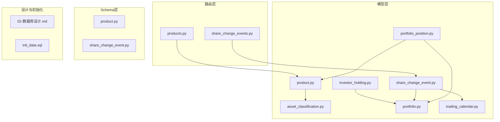
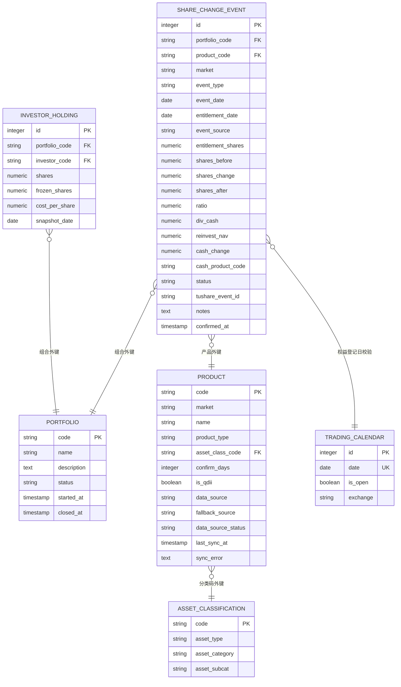
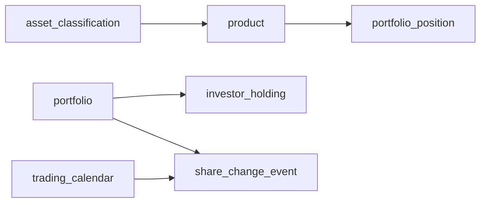

# 产品与投资管理表

<cite>
**本文引用的文件**
- [product.py](file://backend/app/models/product.py)
- [investor_holding.py](file://backend/app/models/investor_holding.py)
- [share_change_event.py](file://backend/app/models/share_change_event.py)
- [asset_classification.py](file://backend/app/models/asset_classification.py)
- [portfolio.py](file://backend/app/models/portfolio.py)
- [portfolio_position.py](file://backend/app/models/portfolio_position.py)
- [trading_calendar.py](file://backend/app/models/trading_calendar.py)
- [products.py](file://backend/app/routers/products.py)
- [share_change_events.py](file://backend/app/routers/share_change_events.py)
- [product.py](file://backend/app/schemas/product.py)
- [share_change_event.py](file://backend/app/schemas/share_change_event.py)
- [02-数据库设计.md](file://Docs/02-数据库设计.md)
- [init_data.sql](file://Docs/init_data.sql)
</cite>

## 目录
1. [简介](#简介)
2. [项目结构](#项目结构)
3. [核心组件](#核心组件)
4. [架构总览](#架构总览)
5. [详细组件分析](#详细组件分析)
6. [依赖分析](#依赖分析)
7. [性能考量](#性能考量)
8. [故障排查指南](#故障排查指南)
9. [结论](#结论)
10. [附录](#附录)

## 简介
本文件聚焦于 InvestRing 投资管理系统中的产品与投资管理相关表：product（产品信息）、investor_holding（份额快照）、share_change_event（份额变动事件）、asset_classification（资产分类）。文档从设计理念、字段定义、约束与业务规则出发，结合数据库设计文档与初始化脚本，系统阐述金融产品分类体系、份额管理机制、份额变动事件记录规则，并给出完整的建表语句与数据示例，帮助读者快速掌握产品信息维护、份额管理、资产分类体系与份额变动追踪的完整业务逻辑。

## 项目结构
围绕产品与投资管理的关键文件组织如下：
- 模型层（ORM 映射）：product.py、investor_holding.py、share_change_event.py、asset_classification.py、portfolio.py、portfolio_position.py、trading_calendar.py
- 路由层（API 控制器）：products.py、share_change_events.py
- Schema 层（请求/响应模型）：product.py、share_change_event.py
- 设计与初始化：02-数据库设计.md、init_data.sql

图表来源
- [product.py:1-22](file://backend/app/models/product.py#L1-L22)
- [investor_holding.py:1-20](file://backend/app/models/investor_holding.py#L1-L20)
- [share_change_event.py:1-37](file://backend/app/models/share_change_event.py#L1-L37)
- [asset_classification.py:1-13](file://backend/app/models/asset_classification.py#L1-L13)
- [portfolio.py:1-16](file://backend/app/models/portfolio.py#L1-L16)
- [portfolio_position.py:1-34](file://backend/app/models/portfolio_position.py#L1-L34)
- [trading_calendar.py:1-13](file://backend/app/models/trading_calendar.py#L1-L13)
- [products.py:1-142](file://backend/app/routers/products.py#L1-L142)
- [share_change_events.py:1-183](file://backend/app/routers/share_change_events.py#L1-L183)
- [02-数据库设计.md:148-246](file://Docs/02-数据库设计.md#L148-L246)
- [init_data.sql:87-230](file://Docs/init_data.sql#L87-L230)

章节来源
- [product.py:1-22](file://backend/app/models/product.py#L1-L22)
- [investor_holding.py:1-20](file://backend/app/models/investor_holding.py#L1-L20)
- [share_change_event.py:1-37](file://backend/app/models/share_change_event.py#L1-L37)
- [asset_classification.py:1-13](file://backend/app/models/asset_classification.py#L1-L13)
- [portfolio.py:1-16](file://backend/app/models/portfolio.py#L1-L16)
- [portfolio_position.py:1-34](file://backend/app/models/portfolio_position.py#L1-L34)
- [trading_calendar.py:1-13](file://backend/app/models/trading_calendar.py#L1-L13)
- [products.py:1-142](file://backend/app/routers/products.py#L1-L142)
- [share_change_events.py:1-183](file://backend/app/routers/share_change_events.py#L1-L183)
- [02-数据库设计.md:148-246](file://Docs/02-数据库设计.md#L148-L246)
- [init_data.sql:87-230](file://Docs/init_data.sql#L87-L230)

## 核心组件
本节概述四张表的设计目标与职责边界：
- product：产品信息与分类主表，承载产品类型、市场、确认天数、数据源等关键属性
- asset_classification：资产分类字典，提供标准化的资产大类/类别/子类定义
- investor_holding：投资者份额快照表，记录每日投资者在组合中的份额与冻结情况
- share_change_event：份额变动事件表，记录分红、拆并、送股等导致份额变化的事件

章节来源
- [product.py:5-22](file://backend/app/models/product.py#L5-L22)
- [asset_classification.py:5-13](file://backend/app/models/asset_classification.py#L5-L13)
- [investor_holding.py:5-20](file://backend/app/models/investor_holding.py#L5-L20)
- [share_change_event.py:5-37](file://backend/app/models/share_change_event.py#L5-L37)

## 架构总览
四张表之间的关系与交互如下：
- product 与 asset_classification：一对多（分类码外键），用于限定产品所属资产类别
- investor_holding 与 portfolio：一对多（组合外键），记录投资者在组合中的份额快照
- share_change_event 与 portfolio、product：多对一（组合与产品外键），记录特定组合、特定产品在某日发生的份额变动事件
- trading_calendar：share_change_event 在确认时需要校验权益登记日是否为交易日

图表来源
- [product.py:5-22](file://backend/app/models/product.py#L5-L22)
- [asset_classification.py:5-13](file://backend/app/models/asset_classification.py#L5-L13)
- [investor_holding.py:5-20](file://backend/app/models/investor_holding.py#L5-L20)
- [share_change_event.py:5-37](file://backend/app/models/share_change_event.py#L5-L37)
- [portfolio.py:5-16](file://backend/app/models/portfolio.py#L5-L16)
- [trading_calendar.py:5-13](file://backend/app/models/trading_calendar.py#L5-L13)

## 详细组件分析

### 产品信息表（product）
- 设计理念
  - 将产品视为“产品代码 + 市场”的复合主键，支持 LOF 拆分为场内/场外两条记录
  - 通过 asset_class_code 引用资产分类字典，统一资产归类
  - 通过 confirm_days 自动推导不同市场的确认周期，简化业务配置
  - 通过 data_source/data_source_status 管理净值数据源与同步状态
- 字段定义与约束
  - 主键：code、market（联合主键）
  - 外键：asset_class_code → asset_classification.code
  - 业务字段：product_type（ETF/OEF/LOF/CASH）、is_qdii、confirm_days、data_source、data_source_status、last_sync_at、sync_error
- 业务规则
  - LOF 拆分：同一产品在 CN_EXCHANGE 与 CN_OTC 各自一条记录，分别对应收盘价与净值
  - 确认天数自动计算：CN_EXCHANGE=0、CN_OTC 且 is_qdii=False=1、CN_OTC 且 is_qdii=True=2
  - 数据源映射：CN_EXCHANGE 使用 fund_daily（收盘价），CN_OTC 使用 fund_nav（净值），HK_MUTUAL 使用 akshare
- 建表语句与示例
  - 建表语句参见数据库设计文档中的 CREATE TABLE product
  - 示例数据参见初始化脚本中产品部分（现金、ETF、LOF、OEF）

章节来源
- [product.py:5-22](file://backend/app/models/product.py#L5-L22)
- [02-数据库设计.md:148-211](file://Docs/02-数据库设计.md#L148-L211)
- [init_data.sql:87-230](file://Docs/init_data.sql#L87-L230)

### 投资者份额快照表（investor_holding）
- 设计理念
  - 快照模式：每日生成一次，记录投资者在组合中的份额与冻结情况
  - 冻结份额（frozen_shares）仅记录快照时刻的冻结值，实时可用份额需动态计算
  - 唯一约束：portfolio_code + investor_code + snapshot_date，避免重复快照
- 字段定义与约束
  - 主键：id（自增）
  - 外键：portfolio_code → portfolio.code、investor_code → investor.code
  - 唯一约束：(portfolio_code, investor_code, snapshot_date)
  - 业务字段：shares、frozen_shares、cost_per_share、snapshot_date
- 业务规则
  - 快照每天汇总生成，前提是净值与分红事件更新完成、当日应确认交易处理完毕
  - 快照表只增不改，保留完整历史
  - 特殊情况：移除投资人时创建 shares=0 的快照，标记退出
  - 可用份额实时计算：快照份额 - pending 赎回 - confirmed 赎回（快照未生成）
- 建表语句与示例
  - 建表语句参见数据库设计文档中的 CREATE TABLE investor_holding
  - 查询当前份额与可用份额的 SQL 参见数据库设计文档

章节来源
- [investor_holding.py:5-20](file://backend/app/models/investor_holding.py#L5-L20)
- [02-数据库设计.md:61-133](file://Docs/02-数据库设计.md#L61-L133)

### 份额变动事件表（share_change_event）
- 设计理念
  - 记录导致份额变化的事件，如现金分红、红利再投、拆并、送股、强制调整等
  - 通过权益登记日（entitlement_date）与事件执行日（event_date）区分会计时点
  - 事件状态：pending → confirmed/cancelled，确认前需校验权益登记日的持仓快照存在
- 字段定义与约束
  - 主键：id（自增）
  - 外键：portfolio_code → portfolio.code、(product_code, market) → product(code, market)
  - 业务字段：event_type、event_date、entitlement_date、event_source、entitlement_shares、shares_before/after/change、ratio、div_cash、reinvest_nav、cash_change、cash_product_code、status、notes、confirmed_at
- 业务规则
  - 权益登记日必须为交易日（通过 trading_calendar 校验）
  - 创建事件时 status=pending，不校验快照；确认时必须校验权益登记日的 portfolio_position 快照存在
  - 不同事件类型的份额/现金变化计算规则见数据库设计文档
- 建表语句与示例
  - 建表语句参见数据库设计文档中的 CREATE TABLE share_change_event
  - 事件类型与计算规则参见数据库设计文档

章节来源
- [share_change_event.py:5-37](file://backend/app/models/share_change_event.py#L5-L37)
- [share_change_events.py:21-128](file://backend/app/routers/share_change_events.py#L21-L128)
- [trading_calendar.py:5-13](file://backend/app/models/trading_calendar.py#L5-L13)
- [02-数据库设计.md:410-468](file://Docs/02-数据库设计.md#L410-L468)

### 资产分类字典表（asset_classification）
- 设计理念
  - 提供标准化的资产分类体系，覆盖股票、债券、黄金、现金等大类及细分子类
  - 产品通过 asset_class_code 关联该表，形成统一的资产归类
- 字段定义与约束
  - 主键：code（唯一索引）
  - 业务字段：asset_type、asset_category、asset_subcat、description
- 分类体系
  - 标准分类共 18 条，涵盖国内/港股/美股/欧洲/日本/全球股票，短债/中长债/综合债/美债/全球债券，黄金，现金等

章节来源
- [asset_classification.py:5-13](file://backend/app/models/asset_classification.py#L5-L13)
- [02-数据库设计.md:212-246](file://Docs/02-数据库设计.md#L212-L246)
- [init_data.sql:19-42](file://Docs/init_data.sql#L19-L42)

## 依赖分析
- 外键约束与删除策略
  - product 与 asset_classification：分类删除后产品分类置空（SET NULL）
  - portfolio 与多个子表：RESTRICT 删除，需先清理相关记录或通过业务层“停用”
  - product 与多个子表：RESTRICT 删除，需先清理相关记录
- 约束与索引
  - investor_holding：唯一约束 (portfolio_code, investor_code, snapshot_date)
  - portfolio_position：唯一约束 (portfolio_code, product_code, market, snapshot_date)，检查约束确保净值型/非净值型资产互斥
  - share_change_event：唯一约束 (portfolio_code, product_code, market, event_date)（由外键约束间接保证）
  - 关键索引：组合快照、份额快照、份额变动事件、交易日历等

图表来源
- [02-数据库设计.md:599-621](file://Docs/02-数据库设计.md#L599-L621)

章节来源
- [02-数据库设计.md:599-621](file://Docs/02-数据库设计.md#L599-L621)

## 性能考量
- 快照模式与实时计算
  - 份额快照只增不改，保留完整历史，查询可用份额需实时计算，避免快照滞后带来的不一致
- 并发与 WAL 模式
  - SQLite 默认写操作会锁库，建议开启 WAL 模式以提升读写并发能力
- 索引策略
  - 为高频查询字段建立索引，如组合快照、份额快照、份额变动事件、交易日历等

章节来源
- [02-数据库设计.md:563-596](file://Docs/02-数据库设计.md#L563-L596)
- [02-数据库设计.md:624-656](file://Docs/02-数据库设计.md#L624-L656)

## 故障排查指南
- 产品确认天数异常
  - 检查 market 与 is_qdii 的组合是否符合自动计算规则（CN_EXCHANGE=0、CN_OTC 且 is_qdii=False=1、CN_OTC 且 is_qdii=True=2）
- 份额变动事件确认失败
  - 确认权益登记日是否为交易日（trading_calendar.is_open=true）
  - 确认权益登记日是否存在 portfolio_position 快照
- 份额可用性不一致
  - 检查 investor_holding.frozen_shares 是否正确反映快照时刻冻结值
  - 实时计算可用份额：快照份额 - pending 赎回 - confirmed 赎回（快照未生成）

章节来源
- [products.py:12-24](file://backend/app/routers/products.py#L12-L24)
- [share_change_events.py:21-128](file://backend/app/routers/share_change_events.py#L21-L128)
- [02-数据库设计.md:86-133](file://Docs/02-数据库设计.md#L86-L133)

## 结论
本文件系统梳理了 InvestRing 中产品与投资管理相关表的设计与实现要点，明确了产品分类体系、份额快照机制与份额变动事件的记录规则。通过标准化的资产分类、严格的外键约束与索引策略，以及快照+实时计算的可用份额模型，系统实现了对金融产品与投资组合的精细化管理。配合数据库设计文档与初始化脚本，读者可据此完成产品信息维护、份额管理与份额变动追踪的完整业务闭环。

## 附录

### 建表语句与字段对照
- 产品信息表（product）
  - 参考：[02-数据库设计.md:150-168](file://Docs/02-数据库设计.md#L150-L168)
- 投资者份额快照表（investor_holding）
  - 参考：[02-数据库设计.md:63-76](file://Docs/02-数据库设计.md#L63-L76)
- 份额变动事件表（share_change_event）
  - 参考：[02-数据库设计.md:412-445](file://Docs/02-数据库设计.md#L412-L445)
- 资产分类字典表（asset_classification）
  - 参考：[02-数据库设计.md:214-222](file://Docs/02-数据库设计.md#L214-L222)

### 数据示例
- 产品数据示例（现金、ETF、LOF、OEF）
  - 参考：[init_data.sql:93-230](file://Docs/init_data.sql#L93-L230)
- 资产分类示例（18条标准分类）
  - 参考：[init_data.sql:19-42](file://Docs/init_data.sql#L19-L42)