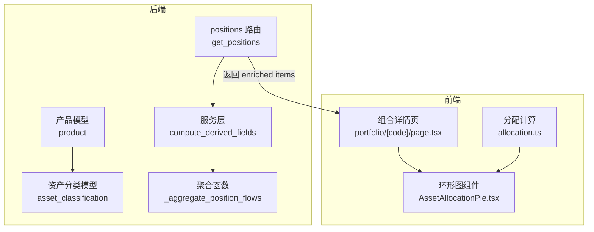
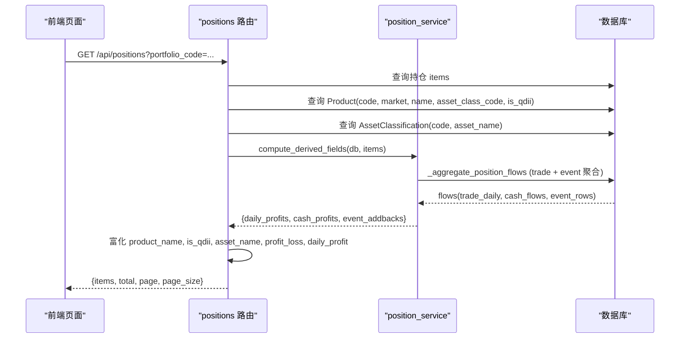
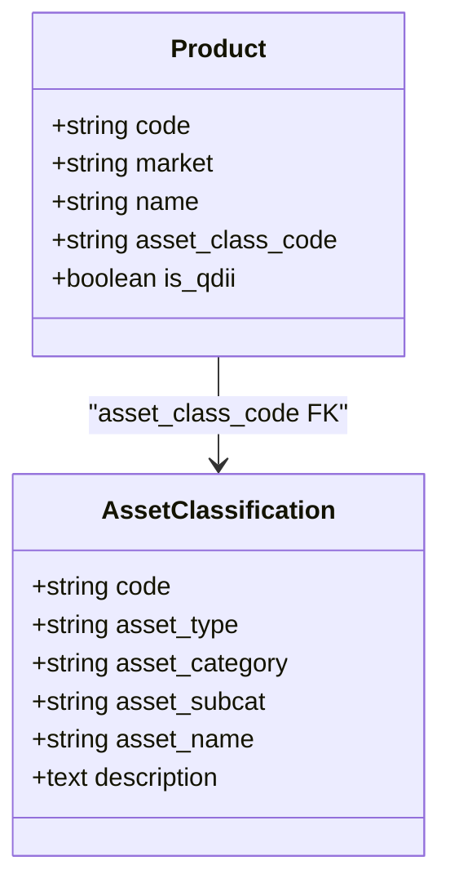
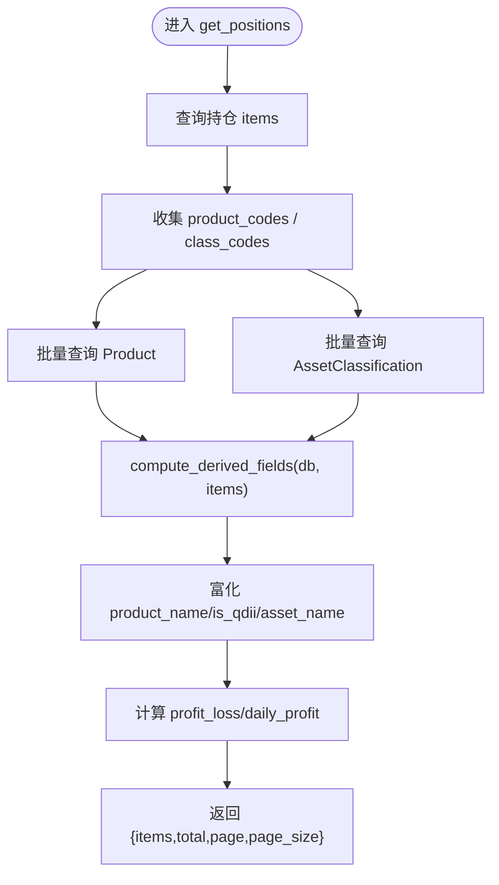
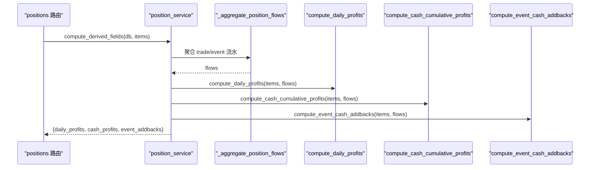
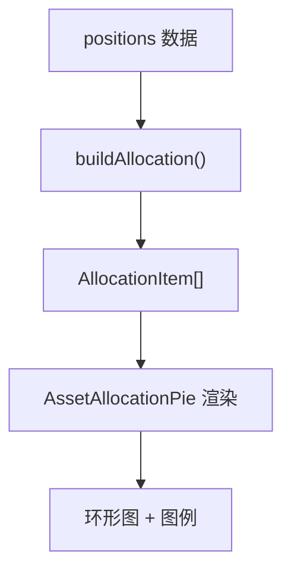
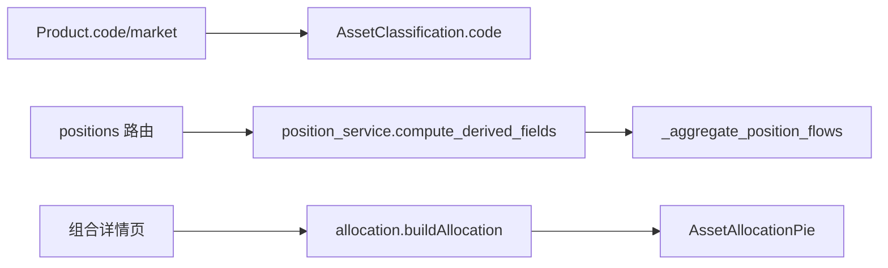

# 资产分类显示名称系统

<cite>
**本文引用的文件**
- [backend/app/models/asset_classification.py](file://backend/app/models/asset_classification.py)
- [backend/app/constants/asset_names.py](file://backend/app/constants/asset_names.py)
- [backend/app/models/product.py](file://backend/app/models/product.py)
- [backend/app/routers/positions.py](file://backend/app/routers/positions.py)
- [backend/app/services/position_service.py](file://backend/app/services/position_service.py)
- [backend/alembic/versions/0007_asset_classification_asset_name.py](file://backend/alembic/versions/0007_asset_classification_asset_name.py)
- [frontend/src/lib/allocation.ts](file://frontend/src/lib/allocation.ts)
- [frontend/src/components/charts/AssetAllocationPie.tsx](file://frontend/src/components/charts/AssetAllocationPie.tsx)
- [frontend/src/app/portfolio/[code]/page.tsx](file://frontend/src/app/portfolio/[code]/page.tsx)
</cite>

## 目录
1. [简介](#简介)
2. [项目结构](#项目结构)
3. [核心组件](#核心组件)
4. [架构总览](#架构总览)
5. [详细组件分析](#详细组件分析)
6. [依赖关系分析](#依赖关系分析)
7. [性能与正确性](#性能与正确性)
8. [故障排查指南](#故障排查指南)
9. [结论](#结论)
10. [附录](#附录)

## 简介
本系统围绕“资产分类显示名称”的端到端链路展开：后端通过资产分类表与产品关联，提供聚合展示用的短名目（asset_name）；前端基于持仓数据按大类（股票/债券/黄金/现金/在途/其他）进行聚合与可视化。同时，针对 positions 接口中派生字段计算存在的重复聚合问题，服务层新增统一入口 compute_derived_fields，将三次独立聚合收敛为一次，保证响应一致性与契约一致性。

## 项目结构
- 后端模型与常量
  - 资产分类模型定义资产类别、子类别与用于 UI 展示的短名目字段。
  - 产品名称映射表集中维护 asset_name 的单一事实来源，供迁移与种子脚本复用。
  - 产品模型通过外键关联资产分类，承载 is_qdii、market 等维度。
- 后端路由与服务
  - positions 列表接口批量加载持仓并填充 product_name、is_qdii、asset_name 以及派生收益字段。
  - 服务层提供统一的派生字段计算入口，内部复用一次流水聚合结果。
- 数据库迁移
  - 为资产分类表新增 asset_name 列，并按映射表回填存量数据，具备幂等特性。
- 前端展示
  - 资产分布环形图组件接收按大类聚合的数据，使用统一色板与顺序渲染。
  - 组合详情页调用该组件，呈现资产分布与分区持仓。

**图表来源**
- [backend/app/models/asset_classification.py:5-15](file://backend/app/models/asset_classification.py#L5-L15)
- [backend/app/models/product.py:5-22](file://backend/app/models/product.py#L5-L22)
- [backend/app/routers/positions.py:24-112](file://backend/app/routers/positions.py#L24-L112)
- [backend/app/services/position_service.py:113-198](file://backend/app/services/position_service.py#L113-L198)
- [backend/app/services/position_service.py:405-426](file://backend/app/services/position_service.py#L405-L426)
- [frontend/src/lib/allocation.ts:1-79](file://frontend/src/lib/allocation.ts#L1-L79)
- [frontend/src/components/charts/AssetAllocationPie.tsx:1-72](file://frontend/src/components/charts/AssetAllocationPie.tsx#L1-L72)
- [frontend/src/app/portfolio/[code]/page.tsx:196-219](file://frontend/src/app/portfolio/[code]/page.tsx#L196-L219)

**章节来源**
- [backend/app/models/asset_classification.py:5-15](file://backend/app/models/asset_classification.py#L5-L15)
- [backend/app/constants/asset_names.py:1-33](file://backend/app/constants/asset_names.py#L1-L33)
- [backend/app/models/product.py:5-22](file://backend/app/models/product.py#L5-L22)
- [backend/app/routers/positions.py:24-112](file://backend/app/routers/positions.py#L24-L112)
- [backend/app/services/position_service.py:113-198](file://backend/app/services/position_service.py#L113-L198)
- [backend/app/services/position_service.py:405-426](file://backend/app/services/position_service.py#L405-L426)
- [backend/alembic/versions/0007_asset_classification_asset_name.py:1-61](file://backend/alembic/versions/0007_asset_classification_asset_name.py#L1-L61)
- [frontend/src/lib/allocation.ts:1-79](file://frontend/src/lib/allocation.ts#L1-L79)
- [frontend/src/components/charts/AssetAllocationPie.tsx:1-72](file://frontend/src/components/charts/AssetAllocationPie.tsx#L1-L72)
- [frontend/src/app/portfolio/[code]/page.tsx:196-219](file://frontend/src/app/portfolio/[code]/page.tsx#L196-L219)

## 核心组件
- 资产分类模型：定义资产类别、子类别与用于 UI 的短名目字段，作为展示名目的载体。
- 资产名称映射表：集中维护 code → 中文短名目的映射，供迁移与种子脚本共用，避免手写漂移。
- 产品模型：关联资产分类编码，携带市场、是否 QDII 等维度信息，参与后端富化逻辑。
- positions 路由：批量查询持仓，富化产品名称、QDII 标识、资产分类短名目，并计算派生收益字段。
- 服务层 compute_derived_fields：一次性聚合 trade/event 流水，产出 daily_profits、cash_profits、event_addbacks 三个字典，供路由消费。
- 前端 allocation.ts：按大类（股票/债券/黄金/现金/在途/其他）聚合持仓金额与占比，输出饼图所需数据结构。
- 前端 AssetAllocationPie.tsx：渲染资产分布环形图与图例，使用统一色板与排序。

**章节来源**
- [backend/app/models/asset_classification.py:5-15](file://backend/app/models/asset_classification.py#L5-L15)
- [backend/app/constants/asset_names.py:1-33](file://backend/app/constants/asset_names.py#L1-L33)
- [backend/app/models/product.py:5-22](file://backend/app/models/product.py#L5-L22)
- [backend/app/routers/positions.py:24-112](file://backend/app/routers/positions.py#L24-L112)
- [backend/app/services/position_service.py:405-426](file://backend/app/services/position_service.py#L405-L426)
- [frontend/src/lib/allocation.ts:1-79](file://frontend/src/lib/allocation.ts#L1-L79)
- [frontend/src/components/charts/AssetAllocationPie.tsx:1-72](file://frontend/src/components/charts/AssetAllocationPie.tsx#L1-L72)

## 架构总览
后端通过资产分类与产品关联，为前端提供资产分类短名目；前端基于持仓数据按大类聚合后渲染资产分布图。positions 接口在返回前完成多项富化与派生字段计算，并通过统一入口减少冗余聚合。

**图表来源**
- [backend/app/routers/positions.py:24-112](file://backend/app/routers/positions.py#L24-L112)
- [backend/app/services/position_service.py:113-198](file://backend/app/services/position_service.py#L113-L198)
- [backend/app/services/position_service.py:405-426](file://backend/app/services/position_service.py#L405-L426)

## 详细组件分析

### 资产分类与显示名称
- 资产分类模型包含 code、asset_type、asset_category、asset_subcat、asset_name、description。其中 asset_name 专用于 UI 分区/图例的短名目展示，与 description 的说明性语义分离。
- 资产名称映射表集中维护 code → 中文短名目映射，迁移与种子脚本均引用该映射，确保前后端与数据初始化的一致性。
- 产品模型通过 asset_class_code 关联资产分类，参与后端富化流程。

**图表来源**
- [backend/app/models/asset_classification.py:5-15](file://backend/app/models/asset_classification.py#L5-L15)
- [backend/app/models/product.py:5-22](file://backend/app/models/product.py#L5-L22)

**章节来源**
- [backend/app/models/asset_classification.py:5-15](file://backend/app/models/asset_classification.py#L5-L15)
- [backend/app/constants/asset_names.py:1-33](file://backend/app/constants/asset_names.py#L1-L33)
- [backend/app/models/product.py:5-22](file://backend/app/models/product.py#L5-L22)

### positions 接口富化与派生字段
- 路由批量查询持仓 items，并收集 product codes 与 asset class codes。
- 批量查询 Product 获取 name、asset_class_code、is_qdii；批量查询 AssetClassification 获取 asset_name。
- 调用 compute_derived_fields 一次性聚合 trade/event 流水，得到 daily_profits、cash_profits、event_addbacks。
- 对每个持仓行富化 product_name、is_qdii、asset_name，并计算 profit_loss、profit_loss_percent、daily_profit。

**图表来源**
- [backend/app/routers/positions.py:24-112](file://backend/app/routers/positions.py#L24-L112)
- [backend/app/services/position_service.py:405-426](file://backend/app/services/position_service.py#L405-L426)

**章节来源**
- [backend/app/routers/positions.py:24-112](file://backend/app/routers/positions.py#L24-L112)
- [backend/app/services/position_service.py:405-426](file://backend/app/services/position_service.py#L405-L426)

### 派生字段计算：一次聚合，三处复用
- _aggregate_position_flows：按 portfolio_codes 与 max_date 过滤，聚合 trade 与 event 流水，产出 trade_daily、cash_flows、event_rows。
- compute_daily_profits：利用 flows 计算每日收益（非现金行市值差 − 当日净买入 + 当日事件分红加回；现金行现金差 − 当日净流入）。
- compute_cash_cumulative_profits：计算 CASH 行累计收益（当前现金 − 基数），基数包含净存入、买卖、转移净额与事件净额。
- compute_event_cash_addbacks：计算非现金行累计分红加回（confirmed 事件 cash_change 按快照日累计）。
- compute_derived_fields：统一入口，仅执行一次聚合，向三个 helper 注入 flows，避免重复查询。

**图表来源**
- [backend/app/services/position_service.py:113-198](file://backend/app/services/position_service.py#L113-L198)
- [backend/app/services/position_service.py:201-311](file://backend/app/services/position_service.py#L201-L311)
- [backend/app/services/position_service.py:314-367](file://backend/app/services/position_service.py#L314-L367)
- [backend/app/services/position_service.py:370-402](file://backend/app/services/position_service.py#L370-L402)
- [backend/app/services/position_service.py:405-426](file://backend/app/services/position_service.py#L405-L426)

**章节来源**
- [backend/app/services/position_service.py:113-198](file://backend/app/services/position_service.py#L113-L198)
- [backend/app/services/position_service.py:201-311](file://backend/app/services/position_service.py#L201-L311)
- [backend/app/services/position_service.py:314-367](file://backend/app/services/position_service.py#L314-L367)
- [backend/app/services/position_service.py:370-402](file://backend/app/services/position_service.py#L370-L402)
- [backend/app/services/position_service.py:405-426](file://backend/app/services/position_service.py#L405-L426)

### 前端资产分布与展示
- allocation.ts：将持仓按大类（股票/债券/黄金/现金/在途/其他）聚合，使用最大余数法保证占比总和为 100%。
- AssetAllocationPie.tsx：渲染环形图与图例，采用统一色板与顺序，支持 tooltip 显示金额与名称。
- 组合详情页：调用环形图组件展示资产分布，并与分区持仓并列呈现。

**图表来源**
- [frontend/src/lib/allocation.ts:1-79](file://frontend/src/lib/allocation.ts#L1-L79)
- [frontend/src/components/charts/AssetAllocationPie.tsx:1-72](file://frontend/src/components/charts/AssetAllocationPie.tsx#L1-L72)
- [frontend/src/app/portfolio/[code]/page.tsx:196-219](file://frontend/src/app/portfolio/[code]/page.tsx#L196-L219)

**章节来源**
- [frontend/src/lib/allocation.ts:1-79](file://frontend/src/lib/allocation.ts#L1-L79)
- [frontend/src/components/charts/AssetAllocationPie.tsx:1-72](file://frontend/src/components/charts/AssetAllocationPie.tsx#L1-L72)
- [frontend/src/app/portfolio/[code]/page.tsx:196-219](file://frontend/src/app/portfolio/[code]/page.tsx#L196-L219)

## 依赖关系分析
- 后端模型依赖
  - 产品模型通过 asset_class_code 外键关联资产分类模型。
  - 资产分类模型提供 asset_name 用于 UI 展示。
- 路由与服务依赖
  - positions 路由依赖 Product 与 AssetClassification 进行富化。
  - 路由调用服务层 compute_derived_fields，服务层内部依赖 _aggregate_position_flows。
- 前端依赖
  - 组合详情页依赖 allocation.ts 进行大类聚合。
  - 环形图组件依赖统一色板与顺序配置。

**图表来源**
- [backend/app/models/product.py:5-22](file://backend/app/models/product.py#L5-L22)
- [backend/app/models/asset_classification.py:5-15](file://backend/app/models/asset_classification.py#L5-L15)
- [backend/app/routers/positions.py:24-112](file://backend/app/routers/positions.py#L24-L112)
- [backend/app/services/position_service.py:405-426](file://backend/app/services/position_service.py#L405-L426)
- [frontend/src/lib/allocation.ts:1-79](file://frontend/src/lib/allocation.ts#L1-L79)
- [frontend/src/components/charts/AssetAllocationPie.tsx:1-72](file://frontend/src/components/charts/AssetAllocationPie.tsx#L1-L72)

**章节来源**
- [backend/app/models/product.py:5-22](file://backend/app/models/product.py#L5-L22)
- [backend/app/models/asset_classification.py:5-15](file://backend/app/models/asset_classification.py#L5-L15)
- [backend/app/routers/positions.py:24-112](file://backend/app/routers/positions.py#L24-L112)
- [backend/app/services/position_service.py:405-426](file://backend/app/services/position_service.py#L405-L426)
- [frontend/src/lib/allocation.ts:1-79](file://frontend/src/lib/allocation.ts#L1-L79)
- [frontend/src/components/charts/AssetAllocationPie.tsx:1-72](file://frontend/src/components/charts/AssetAllocationPie.tsx#L1-L72)

## 性能与正确性
- 性能优化
  - positions 接口通过 compute_derived_fields 将三次独立聚合收敛为一次，减少 trade/event 聚合查询次数，降低 N+1 风险。
  - 路由侧批量查询 Product 与 AssetClassification，避免逐行查询。
- 正确性保障
  - 超集聚合 + 行级过滤等价性：全量聚合所得 trade/event 行为各子集查询的超集，各 compute 函数在消费时按行级条件过滤，结果保持一致。
  - 资产分类短名目由映射表统一维护，迁移与种子脚本引用同一来源，避免前后端不一致。
- 前端一致性
  - 大类占比使用最大余数法，保证占比总和恒为 100%，与分区头/卡片严格自洽。
  - 统一色板与顺序，确保不同视图间视觉一致。

[本节为通用指导，不直接分析具体文件]

## 故障排查指南
- 资产分类短名目为空
  - 检查资产分类表是否存在对应 code 的行，且 asset_name 已回填。
  - 确认迁移 0007 已执行，或本地启动时 create_all 已创建 asset_name 列。
- positions 接口收益异常
  - 核查 compute_derived_fields 是否被调用，以及 _aggregate_position_flows 是否仅执行一次。
  - 检查 trade/event 状态是否为 confirmed，日期范围是否符合快照日上限。
- 前端资产分布占比异常
  - 检查 allocation.ts 的 buildAllocation 是否正确聚合，并确保传入的 positions 数据完整。
  - 确认色板与顺序配置未改动，避免视觉不一致。

**章节来源**
- [backend/alembic/versions/0007_asset_classification_asset_name.py:1-61](file://backend/alembic/versions/0007_asset_classification_asset_name.py#L1-L61)
- [backend/app/services/position_service.py:113-198](file://backend/app/services/position_service.py#L113-L198)
- [backend/app/services/position_service.py:405-426](file://backend/app/services/position_service.py#L405-L426)
- [frontend/src/lib/allocation.ts:1-79](file://frontend/src/lib/allocation.ts#L1-L79)

## 结论
本系统通过资产分类模型与映射表统一管理 UI 展示短名目，结合产品模型实现后端富化；前端基于大类聚合与统一色板呈现资产分布。针对 positions 接口的派生字段计算，服务层引入统一入口消除冗余聚合，提升契约一致性与可维护性。整体设计清晰、可扩展，便于后续扩展更多资产类别与展示维度。

[本节为总结，不直接分析具体文件]

## 附录
- 关键路径参考
  - 资产分类短名目映射：[backend/app/constants/asset_names.py:1-33](file://backend/app/constants/asset_names.py#L1-L33)
  - 资产分类模型：[backend/app/models/asset_classification.py:5-15](file://backend/app/models/asset_classification.py#L5-L15)
  - 产品模型：[backend/app/models/product.py:5-22](file://backend/app/models/product.py#L5-L22)
  - positions 路由富化与派生字段：[backend/app/routers/positions.py:24-112](file://backend/app/routers/positions.py#L24-L112)
  - 服务层统一入口与聚合：[backend/app/services/position_service.py:405-426](file://backend/app/services/position_service.py#L405-L426), [backend/app/services/position_service.py:113-198](file://backend/app/services/position_service.py#L113-L198)
  - 前端资产分布与渲染：[frontend/src/lib/allocation.ts:1-79](file://frontend/src/lib/allocation.ts#L1-L79), [frontend/src/components/charts/AssetAllocationPie.tsx:1-72](file://frontend/src/components/charts/AssetAllocationPie.tsx#L1-L72), [frontend/src/app/portfolio/[code]/page.tsx:196-219](file://frontend/src/app/portfolio/[code]/page.tsx#L196-L219)