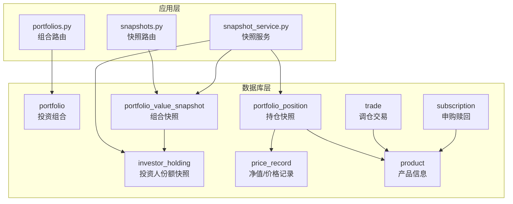
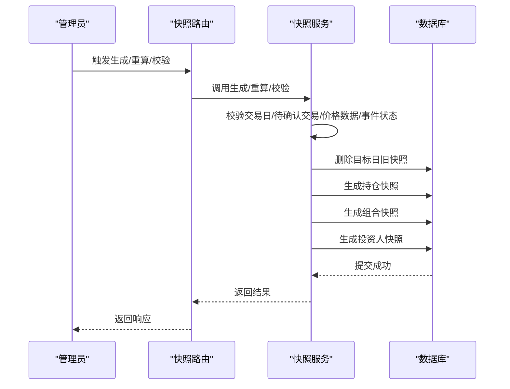
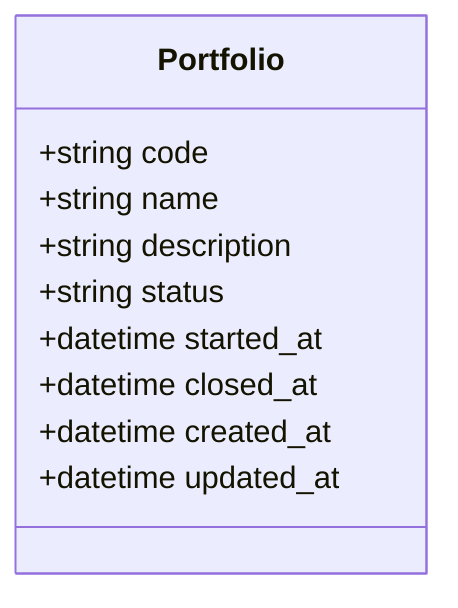
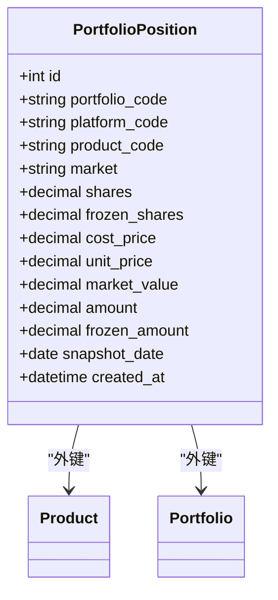
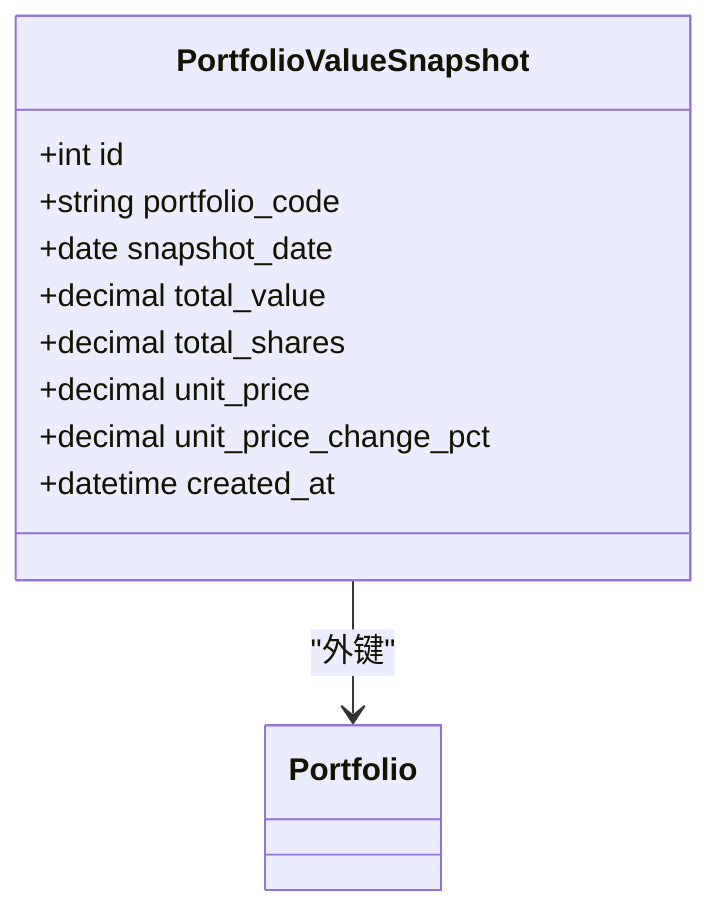
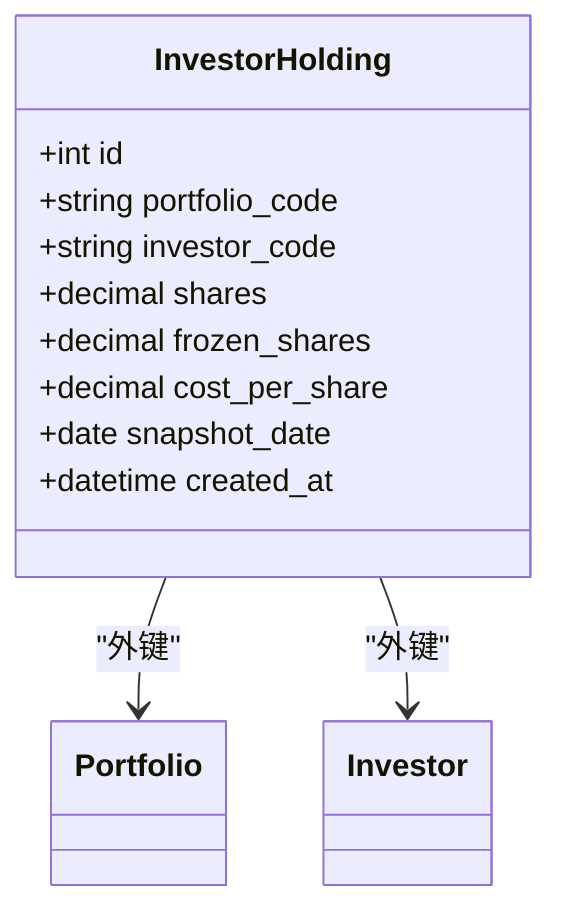
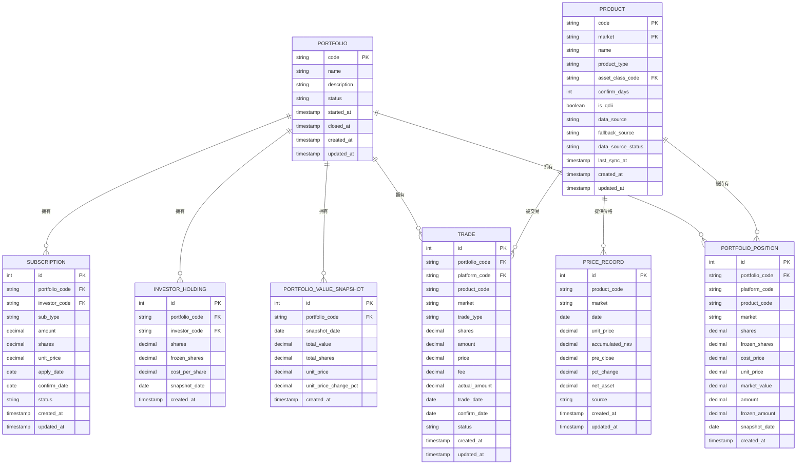

# 投资组合管理表

<cite>
**本文档引用的文件**
- [数据库设计.md](file://Docs/02-数据库设计.md)
- [portfolio.py](file://backend/app/models/portfolio.py)
- [portfolio_position.py](file://backend/app/models/portfolio_position.py)
- [portfolio_value_snapshot.py](file://backend/app/models/portfolio_value_snapshot.py)
- [investor_holding.py](file://backend/app/models/investor_holding.py)
- [price_record.py](file://backend/app/models/price_record.py)
- [trade.py](file://backend/app/models/trade.py)
- [subscription.py](file://backend/app/models/subscription.py)
- [product.py](file://backend/app/models/product.py)
- [portfolios.py](file://backend/app/routers/portfolios.py)
- [snapshots.py](file://backend/app/routers/snapshots.py)
- [snapshot_service.py](file://backend/app/services/snapshot_service.py)
- [init_data.sql](file://Docs/init_data.sql)
</cite>

## 目录
1. [简介](#简介)
2. [项目结构](#项目结构)
3. [核心组件](#核心组件)
4. [架构总览](#架构总览)
5. [详细组件分析](#详细组件分析)
6. [依赖关系分析](#依赖关系分析)
7. [性能考量](#性能考量)
8. [故障排查指南](#故障排查指南)
9. [结论](#结论)
10. [附录](#附录)

## 简介
本文件聚焦于投资组合管理的核心三张表：portfolio（投资组合）、portfolio_position（持仓快照）、portfolio_value_snapshot（组合快照）。文档将从设计理念、实现细节、字段定义、约束条件、业务规则、表间关系、生命周期管理、快照生成机制、价值计算逻辑等方面进行全面阐述，并提供建表语句与数据示例，帮助读者快速理解并正确使用。

## 项目结构
围绕投资组合管理的关键文件组织如下：
- 数据库设计文档：定义三张核心表的结构、字段、约束、索引与计算逻辑
- ORM 模型：对应三张表的 SQLAlchemy 映射类
- 路由与服务：提供快照生成、重算、校验、状态查询等接口
- 初始化数据：包含组合、产品、平台等基础数据示例

图表来源
- [portfolio.py:1-16](file://backend/app/models/portfolio.py#L1-L16)
- [portfolio_position.py:1-34](file://backend/app/models/portfolio_position.py#L1-L34)
- [portfolio_value_snapshot.py:1-20](file://backend/app/models/portfolio_value_snapshot.py#L1-L20)
- [investor_holding.py:1-20](file://backend/app/models/investor_holding.py#L1-L20)
- [price_record.py:1-28](file://backend/app/models/price_record.py#L1-L28)
- [trade.py:1-32](file://backend/app/models/trade.py#L1-L32)
- [subscription.py:1-21](file://backend/app/models/subscription.py#L1-L21)
- [product.py:1-22](file://backend/app/models/product.py#L1-L22)
- [portfolios.py:1-276](file://backend/app/routers/portfolios.py#L1-L276)
- [snapshots.py:1-188](file://backend/app/routers/snapshots.py#L1-L188)
- [snapshot_service.py:1-789](file://backend/app/services/snapshot_service.py#L1-L789)

章节来源
- [数据库设计.md:32-484](file://Docs/02-数据库设计.md#L32-L484)
- [portfolio.py:1-16](file://backend/app/models/portfolio.py#L1-L16)
- [portfolio_position.py:1-34](file://backend/app/models/portfolio_position.py#L1-L34)
- [portfolio_value_snapshot.py:1-20](file://backend/app/models/portfolio_value_snapshot.py#L1-L20)
- [investor_holding.py:1-20](file://backend/app/models/investor_holding.py#L1-L20)
- [price_record.py:1-28](file://backend/app/models/price_record.py#L1-L28)
- [trade.py:1-32](file://backend/app/models/trade.py#L1-L32)
- [subscription.py:1-21](file://backend/app/models/subscription.py#L1-L21)
- [product.py:1-22](file://backend/app/models/product.py#L1-L22)
- [portfolios.py:1-276](file://backend/app/routers/portfolios.py#L1-L276)
- [snapshots.py:1-188](file://backend/app/routers/snapshots.py#L1-L188)
- [snapshot_service.py:1-789](file://backend/app/services/snapshot_service.py#L1-L789)

## 核心组件
本节概述三张核心表的设计理念与职责边界：
- portfolio：记录组合基本信息、状态与生命周期字段，支撑组合的启用/关闭生命周期管理
- portfolio_position：每日生成的持仓快照，记录各产品的份额、成本价、单位价格、市值、冻结字段等
- portfolio_value_snapshot：每日生成的组合快照，记录总市值、总份额、单位净值及变化率

章节来源
- [数据库设计.md:32-484](file://Docs/02-数据库设计.md#L32-L484)
- [portfolio.py:1-16](file://backend/app/models/portfolio.py#L1-L16)
- [portfolio_position.py:1-34](file://backend/app/models/portfolio_position.py#L1-L34)
- [portfolio_value_snapshot.py:1-20](file://backend/app/models/portfolio_value_snapshot.py#L1-L20)

## 架构总览
快照生成遵循“先持仓、后组合、再投资人”的顺序，确保数据一致性与可追溯性。服务层负责依赖校验、删除旧快照、生成新快照并落库。

图表来源
- [snapshots.py:28-188](file://backend/app/routers/snapshots.py#L28-L188)
- [snapshot_service.py:24-184](file://backend/app/services/snapshot_service.py#L24-L184)

章节来源
- [snapshots.py:1-188](file://backend/app/routers/snapshots.py#L1-L188)
- [snapshot_service.py:1-789](file://backend/app/services/snapshot_service.py#L1-L789)

## 详细组件分析

### 投资组合表（portfolio）
- 设计理念：以“草稿→启用→关闭”为主线，记录组合的生命周期节点
- 字段与约束
  - code：主键，组合编码
  - name/description：名称与描述
  - status：状态，枚举 draft/active/closed
  - started_at/closed_at：生命周期时间戳
  - created_at/updated_at：审计字段
- 业务规则
  - 创建默认状态为 draft
  - 关闭前需校验无待确认交易
  - 重新激活时将状态置为 active 并清空关闭时间

图表来源
- [portfolio.py:5-16](file://backend/app/models/portfolio.py#L5-L16)

章节来源
- [数据库设计.md:32-60](file://Docs/02-数据库设计.md#L32-L60)
- [portfolio.py:1-16](file://backend/app/models/portfolio.py#L1-L16)
- [portfolios.py:92-156](file://backend/app/routers/portfolios.py#L92-L156)

### 持仓快照表（portfolio_position）
- 设计理念：每日生成，记录组合在某一日的持仓状态，支持冻结字段追踪
- 字段与约束
  - portfolio_code：外键至 portfolio
  - product_code/market：联合主键的一部分，指向 product
  - shares/frozen_shares：份额与冻结份额
  - cost_price/unit_price/market_value：成本价、单位价格与市值
  - amount/frozen_amount：金额与冻结金额（现金类）
  - snapshot_date：快照日期
  - 唯一约束：portfolio_code + product_code + market + snapshot_date
  - 检查约束：份额与金额互斥（净值型/非净值型）
- 业务规则
  - 仅记录有份额的状态，不用于占位
  - 冻结字段记录快照时刻的 pending 状态，查询可用份额需实时计算
  - 成本价采用加权平均法

图表来源
- [portfolio_position.py:5-34](file://backend/app/models/portfolio_position.py#L5-L34)
- [product.py:5-22](file://backend/app/models/product.py#L5-L22)

章节来源
- [数据库设计.md:247-276](file://Docs/02-数据库设计.md#L247-L276)
- [portfolio_position.py:1-34](file://backend/app/models/portfolio_position.py#L1-L34)
- [snapshot_service.py:265-418](file://backend/app/services/snapshot_service.py#L265-L418)

### 组合快照表（portfolio_value_snapshot）
- 设计理念：每日生成，记录组合总市值、总份额与单位净值
- 字段与约束
  - portfolio_code：外键至 portfolio
  - snapshot_date：唯一约束
  - total_value/total_shares/unit_price：总市值、总份额、单位净值
  - unit_price_change_pct：单位净值涨跌幅
- 业务规则
  - 总市值 = Σ(场内份额×收盘价) + Σ(场外份额×净值) + Σ(非净值型资产金额)
  - 单位净值 = 总市值 / 总份额
  - 冻结份额来自 pending 赎回

图表来源
- [portfolio_value_snapshot.py:5-20](file://backend/app/models/portfolio_value_snapshot.py#L5-L20)

章节来源
- [数据库设计.md:469-484](file://Docs/02-数据库设计.md#L469-L484)
- [portfolio_value_snapshot.py:1-20](file://backend/app/models/portfolio_value_snapshot.py#L1-L20)
- [snapshot_service.py:421-473](file://backend/app/services/snapshot_service.py#L421-L473)

### 投资人份额快照表（investor_holding）
- 设计理念：记录每个投资人在某一日的份额与冻结份额
- 字段与约束
  - portfolio_code/investor_code/snapshot_date：唯一约束
  - shares/frozen_shares/cost_per_share：份额、冻结份额、成本价
- 业务规则
  - 仅记录有份额的投资人
  - 冻结份额来自 pending 赎回

图表来源
- [investor_holding.py:5-20](file://backend/app/models/investor_holding.py#L5-L20)

章节来源
- [数据库设计.md:61-133](file://Docs/02-数据库设计.md#L61-L133)
- [investor_holding.py:1-20](file://backend/app/models/investor_holding.py#L1-L20)
- [snapshot_service.py:476-575](file://backend/app/services/snapshot_service.py#L476-L575)

### 价格记录表（price_record）
- 作用：为持仓快照提供单位价格与净值数据，支持 QDII 特殊处理
- 字段与约束
  - product_code/market/date：唯一约束
  - unit_price/accumulated_nav/pre_close/pct_change/net_asset/source：价格相关字段

章节来源
- [database_design.md:389-408](file://Docs/02-数据库设计.md#L389-L408)
- [price_record.py:1-28](file://backend/app/models/price_record.py#L1-L28)
- [snapshot_service.py:378-398](file://backend/app/services/snapshot_service.py#L378-L398)

### 交易与申购赎回（trade/subscription）
- 作用：为持仓快照与投资人快照提供交易与申赎数据来源
- 字段要点
  - trade：买入/卖出、成交价、手续费、确认日期、状态
  - subscription：申购/赎回、确认份额与净值、确认日期、状态

章节来源
- [database_design.md:347-382](file://Docs/02-数据库设计.md#L347-L382)
- [trade.py:1-32](file://backend/app/models/trade.py#L1-L32)
- [subscription.py:1-21](file://backend/app/models/subscription.py#L1-L21)
- [snapshot_service.py:302-358](file://backend/app/services/snapshot_service.py#L302-L358)

## 依赖关系分析
- 组合与持仓快照：一对多关系，组合关闭/删除受外键约束保护
- 持仓快照与产品：通过 product_code/market 联合外键关联
- 组合快照与投资人快照：组合快照为投资人份额汇总提供基准
- 快照与价格记录：持仓快照依赖价格记录计算单位价格与市值

图表来源
- [portfolio.py:1-16](file://backend/app/models/portfolio.py#L1-L16)
- [portfolio_position.py:1-34](file://backend/app/models/portfolio_position.py#L1-L34)
- [portfolio_value_snapshot.py:1-20](file://backend/app/models/portfolio_value_snapshot.py#L1-L20)
- [investor_holding.py:1-20](file://backend/app/models/investor_holding.py#L1-L20)
- [product.py:1-22](file://backend/app/models/product.py#L1-L22)
- [trade.py:1-32](file://backend/app/models/trade.py#L1-L32)
- [subscription.py:1-21](file://backend/app/models/subscription.py#L1-L21)
- [price_record.py:1-28](file://backend/app/models/price_record.py#L1-L28)

章节来源
- [database_design.md:599-621](file://Docs/02-数据库设计.md#L599-L621)

## 性能考量
- 并发与锁：SQLite 默认写锁会影响并发，建议使用 WAL 模式与合理的超时设置
- 索引策略：针对高频查询建立复合索引，如组合快照按日期倒序、持仓快照按产品与日期等
- 快照生成顺序：先持仓、后组合、再投资人，避免重复计算与数据不一致

章节来源
- [database_design.md:624-656](file://Docs/02-数据库设计.md#L624-L656)
- [database_design.md:563-595](file://Docs/02-数据库设计.md#L563-L595)

## 故障排查指南
- 快照生成失败
  - 检查交易日与待确认交易：若存在 pending 交易或非交易日，校验会失败
  - 检查价格数据完整性：普通基金需当日净值，QDII 需 T-1 日净值
  - 检查份额变动事件状态：存在 pending 事件可能影响准确性
- 组合关闭失败
  - 关闭前必须无待确认交易，否则返回错误提示
- 可用份额/可用现金查询
  - 快照冻结字段为历史记录，查询可用份额/可用现金需实时计算

章节来源
- [snapshot_service.py:187-217](file://backend/app/services/snapshot_service.py#L187-L217)
- [snapshot_service.py:595-714](file://backend/app/services/snapshot_service.py#L595-L714)
- [portfolios.py:92-131](file://backend/app/routers/portfolios.py#L92-L131)
- [database_design.md:506-516](file://Docs/02-数据库设计.md#L506-L516)

## 结论
三张核心表通过严格的约束与清晰的业务规则，实现了投资组合的生命周期管理、持仓变动追踪与价值计算。快照生成服务保证了数据一致性与可追溯性，配合完善的校验与错误处理机制，能够满足日常运营与风控需求。

## 附录

### SQL 建表语句与数据示例
- 投资组合表
  - 参考：[数据库设计.md:34-44](file://Docs/02-数据库设计.md#L34-L44)
- 持仓快照表
  - 参考：[数据库设计.md:249-276](file://Docs/02-数据库设计.md#L249-L276)
- 组合快照表
  - 参考：[数据库设计.md:471-483](file://Docs/02-数据库设计.md#L471-L483)
- 投资人份额快照表
  - 参考：[数据库设计.md:63-77](file://Docs/02-数据库设计.md#L63-L77)
- 价格记录表
  - 参考：[数据库设计.md:391-407](file://Docs/02-数据库设计.md#L391-L407)
- 交易与申购赎回表
  - 参考：[数据库设计.md:349-382](file://Docs/02-数据库设计.md#L349-L382)
- 产品表
  - 参考：[database_design.md:149-169](file://Docs/02-数据库设计.md#L149-L169)
- 示例数据
  - 组合初始化：[init_data.sql:236-240](file://Docs/init_data.sql#L236-L240)
  - 产品初始化：[init_data.sql:94-230](file://Docs/init_data.sql#L94-L230)

### 快照生成与重算流程
- 生成单日快照
  - 路由入口：[snapshots.py:28-56](file://backend/app/routers/snapshots.py#L28-L56)
  - 服务实现：[snapshot_service.py:24-94](file://backend/app/services/snapshot_service.py#L24-L94)
- 重算区间快照
  - 路由入口：[snapshots.py:58-87](file://backend/app/routers/snapshots.py#L58-L87)
  - 服务实现：[snapshot_service.py:96-184](file://backend/app/services/snapshot_service.py#L96-L184)
- 依赖校验
  - 路由入口：[snapshots.py:90-111](file://backend/app/routers/snapshots.py#L90-L111)
  - 服务实现：[snapshot_service.py:187-217](file://backend/app/services/snapshot_service.py#L187-L217)

### 投资组合生命周期管理
- 创建与更新
  - 路由入口：[portfolios.py:39-89](file://backend/app/routers/portfolios.py#L39-L89)
- 关闭与重新激活
  - 路由入口：[portfolios.py:92-156](file://backend/app/routers/portfolios.py#L92-L156)
- 净值历史与收益计算
  - 路由入口：[portfolios.py:159-241](file://backend/app/routers/portfolios.py#L159-L241)