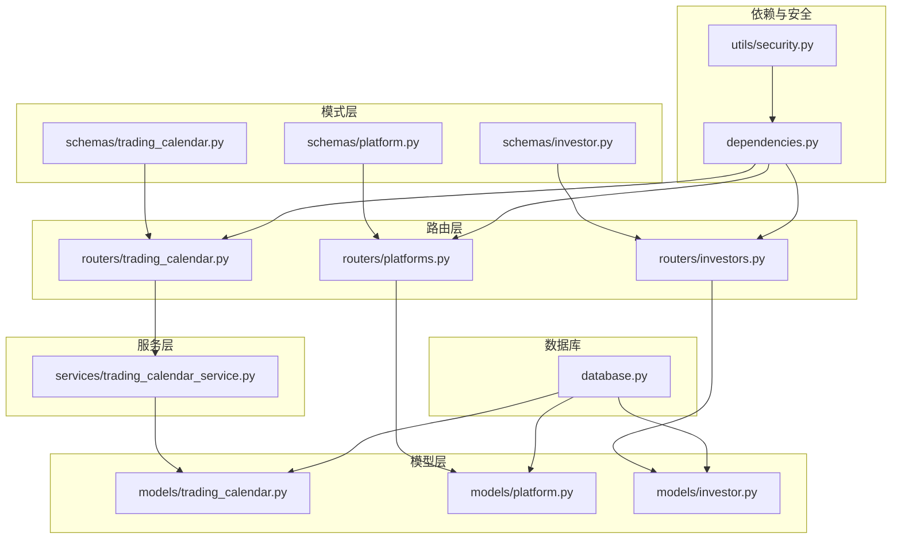
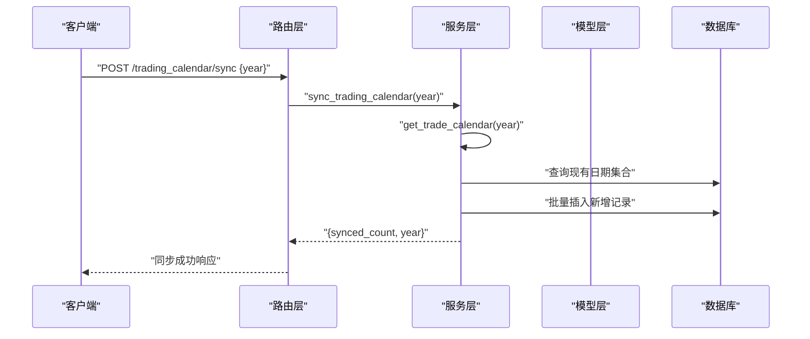
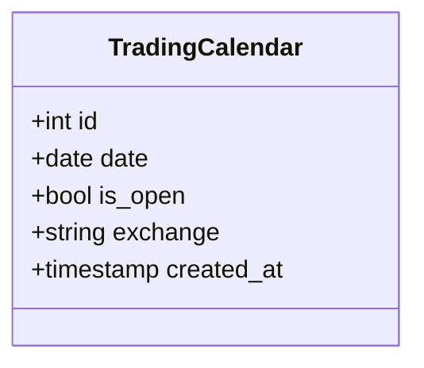
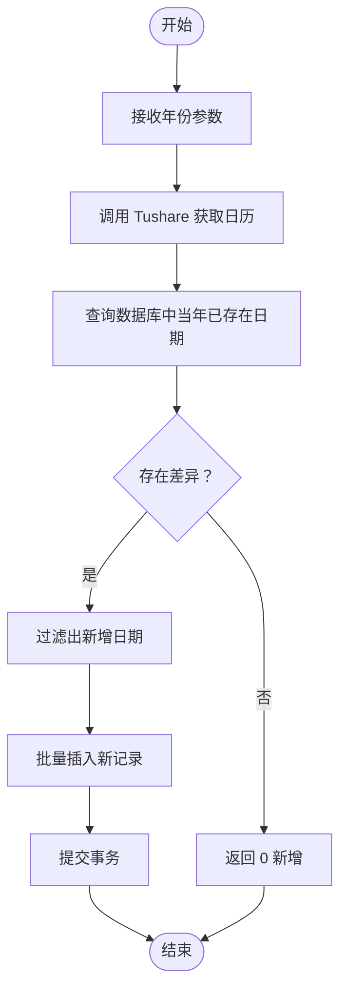
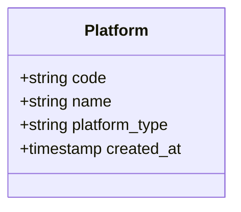
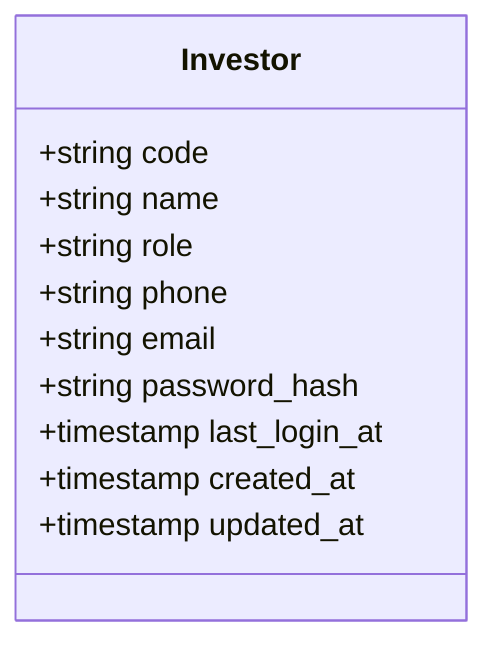
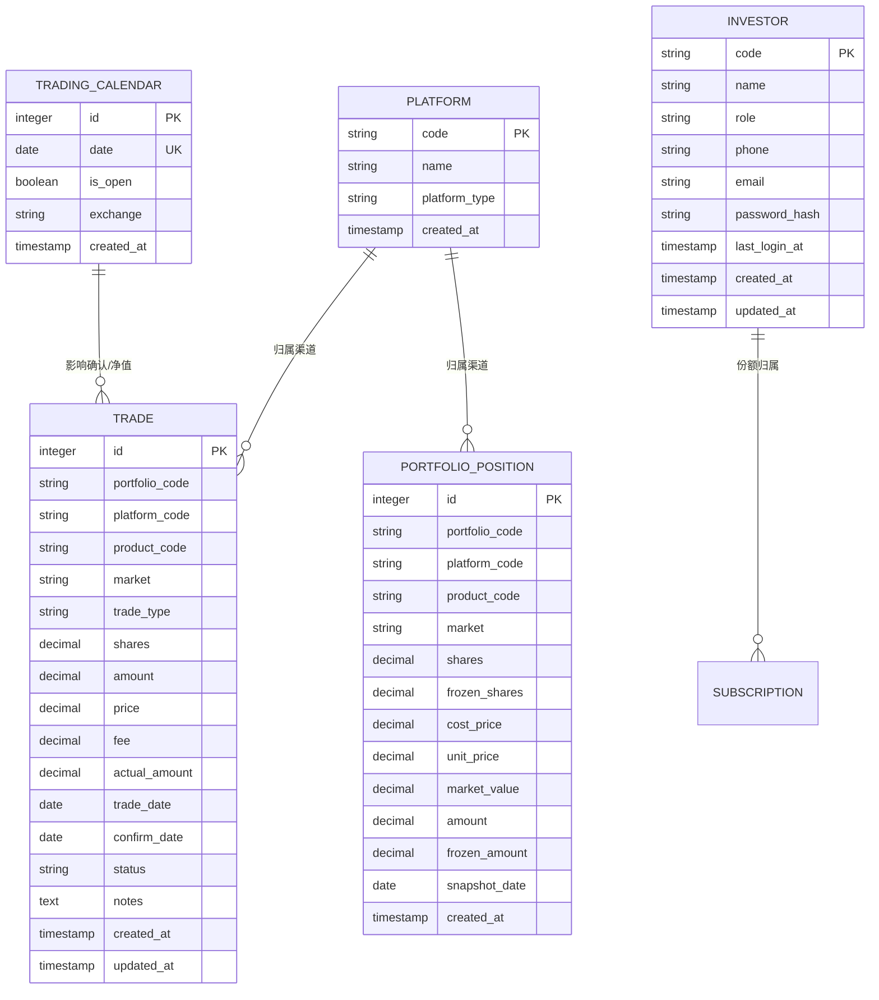

# 日历与平台系统表

<cite>
**本文引用的文件**
- [backend/app/models/trading_calendar.py](file://backend/app/models/trading_calendar.py)
- [backend/app/models/platform.py](file://backend/app/models/platform.py)
- [backend/app/models/investor.py](file://backend/app/models/investor.py)
- [backend/app/schemas/trading_calendar.py](file://backend/app/schemas/trading_calendar.py)
- [backend/app/schemas/platform.py](file://backend/app/schemas/platform.py)
- [backend/app/schemas/investor.py](file://backend/app/schemas/investor.py)
- [backend/app/routers/trading_calendar.py](file://backend/app/routers/trading_calendar.py)
- [backend/app/routers/platforms.py](file://backend/app/routers/platforms.py)
- [backend/app/routers/investors.py](file://backend/app/routers/investors.py)
- [backend/app/services/trading_calendar_service.py](file://backend/app/services/trading_calendar_service.py)
- [backend/app/dependencies.py](file://backend/app/dependencies.py)
- [backend/app/database.py](file://backend/app/database.py)
- [backend/app/utils/security.py](file://backend/app/utils/security.py)
- [Docs/02-数据库设计.md](file://Docs/02-数据库设计.md)
- [Docs/init_data.sql](file://Docs/init_data.sql)
</cite>

## 目录
1. [简介](#简介)
2. [项目结构](#项目结构)
3. [核心组件](#核心组件)
4. [架构总览](#架构总览)
5. [详细组件分析](#详细组件分析)
6. [依赖分析](#依赖分析)
7. [性能考量](#性能考量)
8. [故障排查指南](#故障排查指南)
9. [结论](#结论)
10. [附录](#附录)

## 简介
本文件聚焦于 InvestRing 投资平台中的三张关键表：trading_calendar（交易日历）、platform（平台）、investor（投资人）。围绕这三张表，系统提供了交易日历的维护机制、平台信息的管理策略、投资人账户的管理体系，并阐明了交易日历与业务日期的关系、平台与用户权限的关联、投资人与投资组合的归属关系。文档覆盖字段定义、数据类型、约束条件、业务规则、SQL 建表语句与数据示例，并给出交易日历维护、平台配置管理和用户管理的完整系统逻辑说明。

## 项目结构
与三张表直接相关的后端模块组织如下：
- 模型层：定义 ORM 映射，位于 backend/app/models
- 路由层：对外暴露 REST API，位于 backend/app/routers
- 服务层：封装业务逻辑（如交易日历同步），位于 backend/app/services
- 模式层：Pydantic 序列化/反序列化，位于 backend/app/schemas
- 依赖与安全：认证、鉴权、令牌黑名单、登录追踪，位于 backend/app/dependencies 与 backend/app/utils/security
- 数据库引擎与会话：位于 backend/app/database
- 文档与初始化数据：Docs/02-数据库设计.md 与 Docs/init_data.sql

图表来源
- [backend/app/models/trading_calendar.py:1-13](file://backend/app/models/trading_calendar.py#L1-L13)
- [backend/app/models/platform.py:1-12](file://backend/app/models/platform.py#L1-L12)
- [backend/app/models/investor.py:1-17](file://backend/app/models/investor.py#L1-L17)
- [backend/app/routers/trading_calendar.py:1-81](file://backend/app/routers/trading_calendar.py#L1-L81)
- [backend/app/routers/platforms.py:1-91](file://backend/app/routers/platforms.py#L1-L91)
- [backend/app/routers/investors.py:1-120](file://backend/app/routers/investors.py#L1-L120)
- [backend/app/services/trading_calendar_service.py:1-125](file://backend/app/services/trading_calendar_service.py#L1-L125)
- [backend/app/schemas/trading_calendar.py:1-38](file://backend/app/schemas/trading_calendar.py#L1-L38)
- [backend/app/schemas/platform.py:1-26](file://backend/app/schemas/platform.py#L1-L26)
- [backend/app/schemas/investor.py:1-32](file://backend/app/schemas/investor.py#L1-L32)
- [backend/app/dependencies.py:1-146](file://backend/app/dependencies.py#L1-L146)
- [backend/app/utils/security.py:1-103](file://backend/app/utils/security.py#L1-L103)
- [backend/app/database.py:1-39](file://backend/app/database.py#L1-L39)

章节来源
- [backend/app/models/trading_calendar.py:1-13](file://backend/app/models/trading_calendar.py#L1-L13)
- [backend/app/models/platform.py:1-12](file://backend/app/models/platform.py#L1-L12)
- [backend/app/models/investor.py:1-17](file://backend/app/models/investor.py#L1-L17)
- [backend/app/routers/trading_calendar.py:1-81](file://backend/app/routers/trading_calendar.py#L1-L81)
- [backend/app/routers/platforms.py:1-91](file://backend/app/routers/platforms.py#L1-L91)
- [backend/app/routers/investors.py:1-120](file://backend/app/routers/investors.py#L1-L120)
- [backend/app/services/trading_calendar_service.py:1-125](file://backend/app/services/trading_calendar_service.py#L1-L125)
- [backend/app/schemas/trading_calendar.py:1-38](file://backend/app/schemas/trading_calendar.py#L1-L38)
- [backend/app/schemas/platform.py:1-26](file://backend/app/schemas/platform.py#L1-L26)
- [backend/app/schemas/investor.py:1-32](file://backend/app/schemas/investor.py#L1-L32)
- [backend/app/dependencies.py:1-146](file://backend/app/dependencies.py#L1-L146)
- [backend/app/utils/security.py:1-103](file://backend/app/utils/security.py#L1-L103)
- [backend/app/database.py:1-39](file://backend/app/database.py#L1-L39)

## 核心组件
本节概述三张表的职责边界与相互关系：
- trading_calendar：维护业务日期维度的“是否交易日”事实表，支撑所有基于自然日的业务流程（确认、净值、风控、报表等）。
- platform：平台字典表，标识外部渠道（券商、银行、第三方平台、基金公司等），作为交易与持仓的归属方。
- investor：投资人账户表，承载登录凭据、角色与生命周期字段，是投资组合份额与交易的直接主体。

章节来源
- [backend/app/models/trading_calendar.py:5-13](file://backend/app/models/trading_calendar.py#L5-L13)
- [backend/app/models/platform.py:5-12](file://backend/app/models/platform.py#L5-L12)
- [backend/app/models/investor.py:5-17](file://backend/app/models/investor.py#L5-L17)
- [Docs/02-数据库设计.md:486-496](file://Docs/02-数据库设计.md#L486-L496)
- [Docs/02-数据库设计.md:134-146](file://Docs/02-数据库设计.md#L134-L146)
- [Docs/02-数据库设计.md:11-25](file://Docs/02-数据库设计.md#L11-L25)

## 架构总览
交易日历、平台与投资人三者在系统中的交互路径如下：
- 交易日历：由路由层触发同步，服务层调用 Tushare 客户端获取数据，持久化至 trading_calendar；业务层通过 is_trading_day 判断。
- 平台：路由层提供 CRUD；平台作为 trade 与 portfolio_position 的外键，决定交易归属渠道。
- 投资人：路由层提供 CRUD；投资人作为 subscription 与 investor_holding 的外键，决定份额归属与权限控制。

图表来源
- [backend/app/routers/trading_calendar.py:48-81](file://backend/app/routers/trading_calendar.py#L48-L81)
- [backend/app/services/trading_calendar_service.py:15-67](file://backend/app/services/trading_calendar_service.py#L15-L67)

## 详细组件分析

### 交易日历表 trading_calendar
- 设计理念
  - 以“日期”为主键，唯一约束保证同一天不会重复记录。
  - is_open 标识该日是否为交易日，exchange 字段预留扩展（如不同交易所）。
  - created_at 记录入库时间，便于审计与问题追溯。
- 字段定义与约束
  - id：自增主键
  - date：日期，唯一、索引
  - is_open：布尔，是否交易日
  - exchange：字符串，默认“SSE”
  - created_at：时间戳，默认服务器默认值
- 业务规则
  - 交易日历由管理员通过同步接口维护，按年同步。
  - 业务流程中通过 is_trading_day 判断，确保确认、净值、风控等按交易日推进。
- SQL 建表语句与示例
  - 建表语句参见数据库设计文档对应章节。
  - 示例数据参见初始化脚本中的索引部分，展示 date 索引的存在。
- 维护机制
  - 路由层提供同步接口，服务层负责去重与批量插入。
  - 查询支持按年、日期范围、是否开盘过滤。

图表来源
- [backend/app/models/trading_calendar.py:5-13](file://backend/app/models/trading_calendar.py#L5-L13)
- [Docs/02-数据库设计.md:486-496](file://Docs/02-数据库设计.md#L486-L496)

章节来源
- [backend/app/models/trading_calendar.py:5-13](file://backend/app/models/trading_calendar.py#L5-L13)
- [backend/app/schemas/trading_calendar.py:6-25](file://backend/app/schemas/trading_calendar.py#L6-L25)
- [backend/app/routers/trading_calendar.py:24-45](file://backend/app/routers/trading_calendar.py#L24-L45)
- [backend/app/services/trading_calendar_service.py:69-107](file://backend/app/services/trading_calendar_service.py#L69-L107)
- [Docs/02-数据库设计.md:486-496](file://Docs/02-数据库设计.md#L486-L496)
- [Docs/init_data.sql:274-276](file://Docs/init_data.sql#L274-L276)

#### 交易日历同步流程

图表来源
- [backend/app/services/trading_calendar_service.py:15-67](file://backend/app/services/trading_calendar_service.py#L15-L67)

### 平台表 platform
- 设计理念
  - 以 code 为主键，作为外部渠道的统一标识，贯穿交易与持仓记录。
  - name 与 platform_type 提供分类与展示信息。
- 字段定义与约束
  - code：主键、索引
  - name：非空
  - platform_type：可选
  - created_at：时间戳
- 业务规则
  - 平台由管理员维护，作为 trade 与 portfolio_position 的外键，决定交易归属渠道。
  - 删除前需确保无关联记录（RESTRICT 策略）。
- SQL 建表语句与示例
  - 建表语句参见数据库设计文档对应章节。
  - 示例数据参见初始化脚本中的平台插入片段。
- 管理策略
  - 路由层提供分页查询、创建、查询、更新、删除接口。
  - 创建/更新受管理员权限保护。

图表来源
- [backend/app/models/platform.py:5-12](file://backend/app/models/platform.py#L5-L12)
- [Docs/02-数据库设计.md:134-146](file://Docs/02-数据库设计.md#L134-L146)

章节来源
- [backend/app/models/platform.py:5-12](file://backend/app/models/platform.py#L5-L12)
- [backend/app/schemas/platform.py:6-25](file://backend/app/schemas/platform.py#L6-L25)
- [backend/app/routers/platforms.py:12-91](file://backend/app/routers/platforms.py#L12-L91)
- [Docs/02-数据库设计.md:134-146](file://Docs/02-数据库设计.md#L134-L146)
- [Docs/init_data.sql:49-84](file://Docs/init_data.sql#L49-L84)

### 投资人表 investor
- 设计理念
  - 以 code 为主键，作为投资人账户的唯一标识。
  - role 控制权限（admin/viewer），password_hash 存储哈希密码。
- 字段定义与约束
  - code：主键、索引
  - name：非空
  - role：默认 viewer
  - phone/email：可选
  - password_hash：非空
  - last_login_at：登录时间
  - created_at/updated_at：时间戳（更新时自动刷新）
- 业务规则
  - 登录成功后更新 last_login_at。
  - 删除投资人前需检查其份额是否清零（通过 investor_holding 最新快照）。
  - 管理员权限用于创建/更新/删除。
- SQL 建表语句与示例
  - 建表语句参见数据库设计文档对应章节。
  - 示例数据参见初始化脚本中的投资人插入片段。
- 权限与安全
  - 依赖依赖层的 get_current_user/get_current_admin 进行鉴权。
  - 密码使用 bcrypt 哈希存储，支持登录失败追踪与账户锁定。

图表来源
- [backend/app/models/investor.py:5-17](file://backend/app/models/investor.py#L5-L17)
- [Docs/02-数据库设计.md:11-25](file://Docs/02-数据库设计.md#L11-L25)

章节来源
- [backend/app/models/investor.py:5-17](file://backend/app/models/investor.py#L5-L17)
- [backend/app/schemas/investor.py:6-31](file://backend/app/schemas/investor.py#L6-L31)
- [backend/app/routers/investors.py:14-120](file://backend/app/routers/investors.py#L14-L120)
- [backend/app/dependencies.py:49-129](file://backend/app/dependencies.py#L49-L129)
- [backend/app/utils/security.py:15-27](file://backend/app/utils/security.py#L15-L27)
- [Docs/02-数据库设计.md:11-25](file://Docs/02-数据库设计.md#L11-L25)
- [Docs/init_data.sql:11-13](file://Docs/init_data.sql#L11-L13)

## 依赖分析
- 外键与约束
  - platform 与 trade、portfolio_position 存在外键约束，删除受 RESTRICT 限制。
  - investor 与 subscription、investor_holding 存在外键约束，删除受 RESTRICT 限制。
- 业务日期依赖
  - trading_calendar 为多处业务流程提供“是否交易日”的判断依据（如份额变动事件的权益登记日校验）。
- 认证与授权
  - 依赖层提供 get_current_user 与 get_current_admin，结合 JWT 与黑名单机制保障安全。

图表来源
- [Docs/02-数据库设计.md:599-621](file://Docs/02-数据库设计.md#L599-L621)
- [Docs/02-数据库设计.md:486-496](file://Docs/02-数据库设计.md#L486-L496)
- [Docs/02-数据库设计.md:134-146](file://Docs/02-数据库设计.md#L134-L146)
- [Docs/02-数据库设计.md:11-25](file://Docs/02-数据库设计.md#L11-L25)

章节来源
- [Docs/02-数据库设计.md:599-621](file://Docs/02-数据库设计.md#L599-L621)

## 性能考量
- SQLite 并发
  - 通过 WAL 模式、busy_timeout、synchronous 配置提升并发读写性能，适合“读多写少”的场景。
- 索引策略
  - trading_calendar(date)、platform(code)、investor(code) 等关键索引提升查询效率。
- 批量写入
  - 交易日历同步采用批量插入，降低事务次数与锁竞争。

章节来源
- [backend/app/database.py:18-26](file://backend/app/database.py#L18-L26)
- [Docs/02-数据库设计.md:563-595](file://Docs/02-数据库设计.md#L563-L595)
- [Docs/init_data.sql:274-276](file://Docs/init_data.sql#L274-L276)

## 故障排查指南
- 交易日历同步失败
  - 现象：同步接口返回数据源未配置或同步失败。
  - 排查：检查 Tushare 配置、网络连通性；查看服务层异常类型。
- 交易日历判断异常
  - 现象：is_trading_day 返回 False。
  - 排查：确认目标日期是否存在于 trading_calendar；确认 is_open 是否为 True。
- 平台删除失败
  - 现象：提示存在关联记录。
  - 排查：确认平台是否仍有 trade 或 portfolio_position 关联；按 RESTRICT 策略需先清理。
- 投资人删除失败
  - 现象：提示仍持有份额。
  - 排查：确认投资人最新 investor_holding 快照份额是否为 0。
- 登录失败与账户锁定
  - 现象：登录失败或账户被锁定。
  - 排查：查看登录失败追踪与锁定时间；确认 JWT 解析与黑名单状态。

章节来源
- [backend/app/routers/trading_calendar.py:66-80](file://backend/app/routers/trading_calendar.py#L66-L80)
- [backend/app/services/trading_calendar_service.py:110-125](file://backend/app/services/trading_calendar_service.py#L110-L125)
- [backend/app/routers/platforms.py:78-90](file://backend/app/routers/platforms.py#L78-L90)
- [backend/app/routers/investors.py:91-120](file://backend/app/routers/investors.py#L91-L120)
- [backend/app/dependencies.py:57-101](file://backend/app/dependencies.py#L57-L101)
- [backend/app/utils/security.py:57-102](file://backend/app/utils/security.py#L57-L102)

## 结论
trading_calendar、platform、investor 三张表分别承担“业务日期事实”、“渠道归属”与“账户与权限”的核心职责。通过清晰的建模、严格的外键约束与完善的权限体系，系统实现了交易日历的可维护性、平台信息的可管理性与投资人账户的可治理性。配合批量写入、索引与 SQLite 并发优化，系统在中小型规模下具备良好的性能与可运维性。

## 附录
- SQL 建表语句与字段说明
  - trading_calendar：参见数据库设计文档对应章节。
  - platform：参见数据库设计文档对应章节。
  - investor：参见数据库设计文档对应章节。
- 数据示例
  - 平台示例：参见初始化脚本中的平台插入片段。
  - 投资人示例：参见初始化脚本中的投资人插入片段。
  - 交易日历索引：参见初始化脚本中的索引创建片段。

章节来源
- [Docs/02-数据库设计.md:486-496](file://Docs/02-数据库设计.md#L486-L496)
- [Docs/02-数据库设计.md:134-146](file://Docs/02-数据库设计.md#L134-L146)
- [Docs/02-数据库设计.md:11-25](file://Docs/02-数据库设计.md#L11-L25)
- [Docs/init_data.sql:49-84](file://Docs/init_data.sql#L49-L84)
- [Docs/init_data.sql:11-13](file://Docs/init_data.sql#L11-L13)
- [Docs/init_data.sql:274-276](file://Docs/init_data.sql#L274-L276)