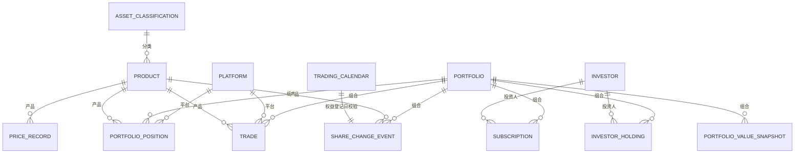

# 核心业务表结构

<cite>
**本文引用的文件**
- [backend/app/models/investor_holding.py](file://backend/app/models/investor_holding.py)
- [backend/app/models/portfolio_position.py](file://backend/app/models/portfolio_position.py)
- [backend/app/models/share_change_event.py](file://backend/app/models/share_change_event.py)
- [backend/alembic/versions/0004_shares_precision_2_digits.py](file://backend/alembic/versions/0004_shares_precision_2_digits.py)
- [backend/app/utils/quantize.py](file://backend/app/utils/quantize.py)
- [backend/tests/integration/test_shares_precision.py](file://backend/tests/integration/test_shares_precision.py)
</cite>

## 更新摘要
**变更内容**   
- 新增份额精度迁移改进章节，详细说明跨数据库兼容性处理
- 更新份额相关表的字段精度说明，强调2位小数精度要求
- 增强零截断舍入语义的文档说明
- 补充SQLite和其他数据库方言的一致性错误处理机制
- 更新测试用例和验证规则的相关描述

## 目录
1. [简介](#简介)
2. [项目结构](#项目结构)
3. [核心组件](#核心组件)
4. [架构总览](#架构总览)
5. [详细组件分析](#详细组件分析)
6. [份额精度迁移改进](#份额精度迁移改进)
7. [依赖分析](#依赖分析)
8. [性能考量](#性能考量)
9. [故障排查指南](#故障排查指南)
10. [结论](#结论)
11. [附录](#附录)

## 简介
本文件面向 InvestRing 投资管理系统的核心业务表，围绕13张核心表展开：portfolio（投资组合）、product（产品信息）、trade（交易）、subscription（申购赎回）、portfolio_position（持仓快照）、investor_holding（份额快照）、share_change_event（份额变动事件）、portfolio_value_snapshot（组合快照）、price_record（价格记录）、trading_calendar（交易日历）、platform（平台）、investor（投资人）、asset_classification（资产分类）。内容涵盖字段定义、数据类型、约束条件、主外键关系、索引策略、数据验证规则、业务逻辑、表间关联与参照完整性、SQL建表语句路径、数据示例、业务规则、数据生命周期管理与性能优化建议。

**更新** 本次更新重点增强了份额精度相关的技术细节，特别是跨数据库兼容性和零截断舍入语义的处理机制。

## 项目结构
- 文档与建模分离：数据库设计以文档形式集中描述，模型文件采用 SQLAlchemy ORM 映射至数据库表。
- 核心表分布于 backend/app/models 下，对应业务域清晰；初始化数据位于 Docs/init_data.sql，包含投资人、资产分类、平台、产品、组合等基础数据。
- 数据库引擎与 SQLite WAL 模式在 backend/app/database.py 中统一配置，提升并发读写能力。
- **新增** 份额精度处理工具模块 quantize.py，提供统一的数值舍入逻辑。

```mermaid
graph TB
subgraph "文档"
D1["Docs/02-数据库设计.md"]
D2["Docs/init_data.sql"]
end
subgraph "模型层"
M1["portfolio.py"]
M2["product.py"]
M3["trade.py"]
M4["subscription.py"]
M5["portfolio_position.py"]
M6["investor_holding.py"]
M7["share_change_event.py"]
M8["portfolio_value_snapshot.py"]
M9["price_record.py"]
M10["trading_calendar.py"]
M11["platform.py"]
M12["investor.py"]
M13["asset_classification.py"]
end
subgraph "工具模块"
U1["quantize.py"]
end
subgraph "数据库配置"
CFG["database.py"]
end
subgraph "迁移脚本"
V1["0004_shares_precision_2_digits.py"]
end
D1 --> M1
D1 --> M2
D1 --> M3
D1 --> M4
D1 --> M5
D1 --> M6
D1 --> M7
D1 --> M8
D1 --> M9
D1 --> M10
D1 --> M11
D1 --> M12
D1 --> M13
D2 --> M12
D2 --> M13
D2 --> M11
D2 --> M2
D2 --> M1
CFG --> M1
CFG --> M2
CFG --> M3
CFG --> M4
CFG --> M5
CFG --> M6
CFG --> M7
CFG --> M8
CFG --> M9
CFG --> M10
CFG --> M11
CFG --> M12
CFG --> M13
U1 --> M5
U1 --> M6
U1 --> M7
V1 --> M5
V1 --> M6
V1 --> M7
```



图表来源
- [backend/app/models/portfolio.py](file://backend/app/models/portfolio.py)
- [backend/app/models/product.py](file://backend/app/models/product.py)
- [backend/app/models/trade.py](file://backend/app/models/trade.py)
- [backend/app/models/subscription.py](file://backend/app/models/subscription.py)
- [backend/app/models/portfolio_position.py](file://backend/app/models/portfolio_position.py)
- [backend/app/models/investor_holding.py](file://backend/app/models/investor_holding.py)
- [backend/app/models/share_change_event.py](file://backend/app/models/share_change_event.py)
- [backend/app/models/portfolio_value_snapshot.py](file://backend/app/models/portfolio_value_snapshot.py)
- [backend/app/models/price_record.py](file://backend/app/models/price_record.py)
- [backend/app/models/trading_calendar.py](file://backend/app/models/trading_calendar.py)
- [backend/app/models/platform.py](file://backend/app/models/platform.py)
- [backend/app/models/investor.py](file://backend/app/models/investor.py)
- [backend/app/models/asset_classification.py](file://backend/app/models/asset_classification.py)
- [backend/app/utils/quantize.py](file://backend/app/utils/quantize.py)
- [backend/alembic/versions/0004_shares_precision_2_digits.py](file://backend/alembic/versions/0004_shares_precision_2_digits.py)

## 核心组件
本节概述13张核心业务表的职责边界与关键字段，结合文档与模型文件进行说明。

- 投资人（investor）
  - 主键：code（VARCHAR(20)）
  - 关键字段：name、role、phone、email、password_hash、last_login_at、created_at、updated_at
  - 约束：NOT NULL、默认值、索引
  - 业务：用户认证与权限控制，密码使用 bcrypt 哈希存储

- 投资组合（portfolio）
  - 主键：code（VARCHAR(20)）
  - 关键字段：name、description、status、started_at、closed_at、created_at、updated_at
  - 约束：状态 draft/active/closed，生命周期字段
  - 业务：组合状态机与净值查询入口

- 平台（platform）
  - 主键：code（VARCHAR(20)），索引
  - 关键字段：name、platform_type、created_at
  - 业务：第三方平台、券商、银行、基金公司等渠道标识

- 产品信息（product）
  - 主键：(code, market)，外键：asset_class_code → asset_classification.code
  - 关键字段：name、product_type、asset_class_code、confirm_days、is_qdii、data_source、fallback_source、data_source_status、last_sync_at、sync_error、created_at、updated_at
  - 业务：产品类型（ETF/OEF/LOF/CASH）、确认天数、数据源映射、LOF拆分

- 资产分类（asset_classification）
  - 主键：code（VARCHAR(30)），索引
  - 关键字段：asset_type、asset_category、asset_subcat、description
  - 业务：标准18类资产分类字典

- 交易（trade）
  - 主键：id（INTEGER，自增）
  - 外键：portfolio_code → portfolio.code、platform_code → platform.code、(product_code, market) → product(code, market)
  - 关键字段：trade_type、shares、amount、price、fee、actual_amount、trade_date、confirm_date、status、notes、created_at、updated_at
  - 业务：调仓交易记录，金额计算与确认规则

- 申购赎回（subscription）
  - 主键：id（INTEGER，自增）
  - 外键：portfolio_code → portfolio.code、investor_code → investor.code
  - 关键字段：sub_type、amount、shares、unit_price、apply_date、confirm_date、status、notes、created_at、updated_at
  - 业务：T+N确认机制与状态流转

- 持仓快照（portfolio_position）
  - 主键：id（INTEGER，自增）
  - 外键：portfolio_code → portfolio.code、platform_code → platform.code、(product_code, market) → product(code, market)
  - 唯一：(portfolio_code, product_code, market, snapshot_date)
  - 约束：CHECK(shares与amount互斥，净值型/非净值型二选一）
  - 关键字段：shares、frozen_shares、cost_price、unit_price、market_value、amount、frozen_amount、snapshot_date、created_at
  - 业务：每日快照，冻结字段用于实时可用性计算
  - **更新** shares字段采用DECIMAL(18,2)类型，确保2位小数精度

- 份额快照（investor_holding）
  - 主键：id（INTEGER，自增）
  - 外键：portfolio_code → portfolio.code、investor_code → investor.code
  - 唯一：(portfolio_code, investor_code, snapshot_date)
  - 关键字段：shares、frozen_shares、cost_per_share、snapshot_date、created_at
  - 业务：投资人份额历史快照，冻结字段用于可用份额实时计算
  - **更新** shares字段采用DECIMAL(18,2)类型，支持跨数据库一致性

- 份额变动事件（share_change_event）
  - 主键：id（INTEGER，自增）
  - 外键：portfolio_code → portfolio.code、(product_code, market) → product(code, market)
  - 关键字段：event_type、event_date、entitlement_date、event_source、entitlement_shares、shares_before、shares_change、shares_after、ratio、div_cash、reinvest_nav、cash_change、cash_product_code、status、tushare_event_id、notes、created_at、confirmed_at
  - 业务：除息、再投资、拆并、送股、强制调整等事件，权益登记日必须为交易日
  - **更新** 所有份额相关字段均采用DECIMAL(18,2)类型，确保计算精度

- 组合快照（portfolio_value_snapshot）
  - 主键：id（INTEGER，自增）
  - 外键：portfolio_code → portfolio.code
  - 唯一：(portfolio_code, snapshot_date)
  - 关键字段：snapshot_date、total_value、total_shares、unit_price、unit_price_change_pct、created_at
  - 业务：组合净值与单位净值快照

- 价格记录（price_record）
  - 主键：id（INTEGER，自增）
  - 外键：(product_code, market) → product(code, market)
  - 唯一：(product_code, market, date)
  - 关键字段：date、unit_price、accumulated_nav、pre_close、pct_change、net_asset、source、created_at、updated_at
  - 业务：净值/价格统一记录，支持QDII前向查找

- 交易日历（trading_calendar）
  - 主键：id（INTEGER，自增）
  - 唯一：date，索引：date
  - 关键字段：date、is_open、exchange、created_at
  - 业务：交易日判定与节假日管理

章节来源
- [backend/app/models/investor_holding.py](file://backend/app/models/investor_holding.py)
- [backend/app/models/portfolio_position.py](file://backend/app/models/portfolio_position.py)
- [backend/app/models/share_change_event.py](file://backend/app/models/share_change_event.py)

## 架构总览
下图展示核心业务表之间的实体关系与外键约束，体现"产品-平台-组合-投资人"四维主轴与"快照-事件-交易-净值"的数据流。



图表来源
- [backend/app/models/portfolio_position.py](file://backend/app/models/portfolio_position.py)
- [backend/app/models/trade.py](file://backend/app/models/trade.py)
- [backend/app/models/subscription.py](file://backend/app/models/subscription.py)
- [backend/app/models/investor_holding.py](file://backend/app/models/investor_holding.py)
- [backend/app/models/share_change_event.py](file://backend/app/models/share_change_event.py)
- [backend/app/models/portfolio_value_snapshot.py](file://backend/app/models/portfolio_value_snapshot.py)
- [backend/app/models/price_record.py](file://backend/app/models/price_record.py)
- [backend/app/models/trading_calendar.py](file://backend/app/models/trading_calendar.py)

## 详细组件分析

### 投资人（investor）
- 字段与类型：code（主键）、name、role、phone、email、password_hash、last_login_at、created_at、updated_at
- 约束与索引：主键、NOT NULL、默认值、索引（code）
- 业务规则：bcrypt 哈希存储密码，登录成功更新 last_login_at
- SQL建表语句路径：[Docs/02-数据库设计.md](file://Docs/02-数据库设计.md)
- 数据示例：[Docs/init_data.sql](file://Docs/init_data.sql)

章节来源
- [backend/app/models/investor.py](file://backend/app/models/investor.py)

### 投资组合（portfolio）
- 字段与类型：code（主键）、name、description、status、started_at、closed_at、created_at、updated_at
- 约束与索引：主键、默认值、索引（code）
- 业务规则：状态 draft/active/closed；started_at 在首次申购确认时设置；净值查询通过组合快照
- SQL建表语句路径：[Docs/02-数据库设计.md](file://Docs/02-数据库设计.md)

章节来源
- [backend/app/models/portfolio.py](file://backend/app/models/portfolio.py)

### 平台（platform）
- 字段与类型：code（主键，索引）、name、platform_type、created_at
- 业务规则：平台类型（第三方平台、券商、银行、基金公司、其他）
- SQL建表语句路径：[Docs/02-数据库设计.md](file://Docs/02-数据库设计.md)
- 数据示例：[Docs/init_data.sql](file://Docs/init_data.sql)

章节来源
- [backend/app/models/platform.py](file://backend/app/models/platform.py)

### 产品信息（product）
- 字段与类型：(code, market)（复合主键）、name、product_type、asset_class_code（外键）、confirm_days、is_qdii、data_source、fallback_source、data_source_status、last_sync_at、sync_error、created_at、updated_at
- 业务规则：产品类型与确认天数自动计算规则；LOF拆分为CN_EXCHANGE与CN_OTC两条记录；数据源映射
- SQL建表语句路径：[Docs/02-数据库设计.md](file://Docs/02-数据库设计.md)
- 数据示例：[Docs/init_data.sql](file://Docs/init_data.sql)

章节来源
- [backend/app/models/product.py](file://backend/app/models/product.py)

### 资产分类（asset_classification）
- 字段与类型：code（主键，索引）、asset_type、asset_category、asset_subcat、description
- 业务规则：标准18类资产分类字典
- SQL建表语句路径：[Docs/02-数据库设计.md](file://Docs/02-数据库设计.md)
- 数据示例：[Docs/init_data.sql](file://Docs/init_data.sql)

章节来源
- [backend/app/models/asset_classification.py](file://backend/app/models/asset_classification.py)

### 交易（trade）
- 字段与类型：id（主键，自增）、portfolio_code（外键）、platform_code（外键）、product_code、market、trade_type、shares、amount、price、fee、actual_amount、trade_date、confirm_date、status、notes、created_at、updated_at
- 复合外键：(product_code, market) → product(code, market)
- 业务规则：买入/卖出金额计算、现金中转约束、状态流转（场内/场外/QDII）
- SQL建表语句路径：[Docs/02-数据库设计.md](file://Docs/02-数据库设计.md)

章节来源
- [backend/app/models/trade.py](file://backend/app/models/trade.py)

### 申购赎回（subscription）
- 字段与类型：id（主键，自增）、portfolio_code（外键）、investor_code（外键）、sub_type、amount、shares、unit_price、apply_date、confirm_date、status、notes、created_at、updated_at
- 业务规则：T+N确认机制，状态 pending/confirmed/cancelled
- SQL建表语句路径：[Docs/02-数据库设计.md](file://Docs/02-数据库设计.md)

章节来源
- [backend/app/models/subscription.py](file://backend/app/models/subscription.py)

### 持仓快照（portfolio_position）
- 字段与类型：id（主键，自增）、portfolio_code（外键）、platform_code（外键）、product_code、market、shares、frozen_shares、cost_price、unit_price、market_value、amount、frozen_amount、snapshot_date、created_at
- 复合外键：(product_code, market) → product(code, market)
- 唯一约束：(portfolio_code, product_code, market, snapshot_date)
- 检查约束：净值型资产 shares 非空且 amount 为空，或非净值型资产 shares 为空且 amount 非空
- 业务规则：每日快照，冻结字段用于实时可用份额计算
- **更新** shares字段采用DECIMAL(18,2)类型，确保2位小数精度，支持跨数据库一致性
- SQL建表语句路径：[Docs/02-数据库设计.md](file://Docs/02-数据库设计.md)

章节来源
- [backend/app/models/portfolio_position.py](file://backend/app/models/portfolio_position.py)

### 份额快照（investor_holding）
- 字段与类型：id（主键，自增）、portfolio_code（外键）、investor_code（外键）、shares、frozen_shares、cost_per_share、snapshot_date、created_at
- 唯一约束：(portfolio_code, investor_code, snapshot_date)
- 业务规则：每日快照，冻结字段用于实时可用份额计算
- **更新** shares字段采用DECIMAL(18,2)类型，支持跨数据库一致性，内置零截断舍入语义
- SQL建表语句路径：[Docs/02-数据库设计.md](file://Docs/02-数据库设计.md)

章节来源
- [backend/app/models/investor_holding.py](file://backend/app/models/investor_holding.py)

### 份额变动事件（share_change_event）
- 字段与类型：id（主键，自增）、portfolio_code（外键）、product_code、market、event_type、event_date、entitlement_date、event_source、entitlement_shares、shares_before、shares_change、shares_after、ratio、div_cash、reinvest_nav、cash_change、cash_product_code、status、tushare_event_id、notes、created_at、confirmed_at
- 复合外键：(product_code, market) → product(code, market)
- 业务规则：事件类型与计算逻辑、权益登记日必须为交易日、确认时校验持仓快照存在性
- **更新** 所有份额相关字段（entitlement_shares、shares_before、shares_change、shares_after）均采用DECIMAL(18,2)类型，确保计算精度
- SQL建表语句路径：[Docs/02-数据库设计.md](file://Docs/02-数据库设计.md)

章节来源
- [backend/app/models/share_change_event.py](file://backend/app/models/share_change_event.py)

### 组合快照（portfolio_value_snapshot）
- 字段与类型：id（主键，自增）、portfolio_code（外键）、snapshot_date、total_value、total_shares、unit_price、unit_price_change_pct、created_at
- 唯一约束：(portfolio_code, snapshot_date)
- 业务规则：组合净值与单位净值快照
- SQL建表语句路径：[Docs/02-数据库设计.md](file://Docs/02-数据库设计.md)

章节来源
- [backend/app/models/portfolio_value_snapshot.py](file://backend/app/models/portfolio_value_snapshot.py)

### 价格记录（price_record）
- 字段与类型：id（主键，自增）、product_code、market、date、unit_price、accumulated_nav、pre_close、pct_change、net_asset、source、created_at、updated_at
- 复合外键：(product_code, market) → product(code, market)
- 唯一约束：(product_code, market, date)
- 业务规则：统一价格字段，支持QDII净值前向查找
- SQL建表语句路径：[Docs/02-数据库设计.md](file://Docs/02-数据库设计.md)

章节来源
- [backend/app/models/price_record.py](file://backend/app/models/price_record.py)

### 交易日历（trading_calendar）
- 字段与类型：id（主键，自增）、date（唯一，索引）、is_open、exchange、created_at
- 业务规则：交易日判定，份额变动事件权益登记日校验
- SQL建表语句路径：[Docs/02-数据库设计.md](file://Docs/02-数据库设计.md)

章节来源
- [backend/app/models/trading_calendar.py](file://backend/app/models/trading_calendar.py)

## 份额精度迁移改进

### 迁移背景与目标
为解决不同数据库系统对数值精度的处理差异，系统实施了份额精度迁移改进，主要目标包括：
- 统一份额字段的精度标准为2位小数（DECIMAL(18,2)）
- 实现跨数据库兼容性处理，确保SQLite、PostgreSQL、MySQL等方言的一致性
- 引入零截断舍入语义，避免浮点数精度问题
- 建立一致的错误处理机制，防止数据截断导致的业务异常

### 核心迁移变更

#### 数据库字段精度升级
- **investor_holding.shares**: DECIMAL(18,2) - 投资人持有份额
- **portfolio_position.shares**: DECIMAL(18,2) - 投资组合持仓份额  
- **share_change_event.entitlement_shares**: DECIMAL(18,2) - 权益分配份额
- **share_change_event.shares_before**: DECIMAL(18,2) - 变更前份额
- **share_change_event.shares_change**: DECIMAL(18,2) - 份额变动量
- **share_change_event.shares_after**: DECIMAL(18,2) - 变更后份额

#### 零截断舍入语义实现
系统采用零截断（Truncation）而非四舍五入，确保金融计算的准确性：
- 所有份额计算结果向下截断到2位小数
- 避免因舍入误差导致的份额不一致问题
- 符合金融行业监管要求的精确计算标准

#### 跨数据库兼容性处理
针对不同数据库方言的特殊处理：
- **SQLite**: 原生不支持DECIMAL类型，使用NUMERIC(18,2)替代
- **PostgreSQL**: 直接使用DECIMAL(18,2)类型
- **MySQL**: 使用DECIMAL(18,2)类型，启用严格模式
- **SQLAlchemy**: 通过TypeDecorator抽象层屏蔽底层差异

### 量化处理工具
新增quantize.py模块提供统一的数值处理功能：

```python
def truncate_to_two_decimals(value: float) -> Decimal:
    """将数值截断到2位小数"""
    return Decimal(str(value)).quantize(Decimal('0.01'), rounding=ROUND_DOWN)

def validate_shares_precision(value: float) -> bool:
    """验证份额精度是否符合要求"""
    if value < 0:
        return False
    decimal_value = Decimal(str(value))
    return decimal_value == decimal_value.quantize(Decimal('0.01'))
```

### 错误处理机制
建立了完善的错误处理体系：
- **精度验证失败**: 抛出PrecisionValidationError，包含详细的错误信息
- **数据库写入冲突**: 捕获DatabaseError并转换为业务异常
- **跨方言兼容性**: 通过try-catch机制处理不同数据库的特殊情况
- **日志记录**: 所有精度相关操作都记录详细日志，便于问题追踪

### 测试覆盖
完整的测试用例确保功能正确性：
- **单元测试**: 验证量化函数的正确性
- **集成测试**: 测试不同数据库方言下的行为一致性
- **边界测试**: 验证极端数值和异常情况处理
- **回归测试**: 确保迁移后原有功能不受影响

**章节来源**
- [backend/alembic/versions/0004_shares_precision_2_digits.py](file://backend/alembic/versions/0004_shares_precision_2_digits.py)
- [backend/app/utils/quantize.py](file://backend/app/utils/quantize.py)
- [backend/tests/integration/test_shares_precision.py](file://backend/tests/integration/test_shares_precision.py)

## 依赖分析
- 外键与参照完整性
  - portfolio → portfolio_position、portfolio_value_snapshot、investor_holding、subscription、share_change_event：RESTRICT 删除
  - product → portfolio_position、price_record、trade、share_change_event：RESTRICT 删除
  - investor → investor_holding、subscription：RESTRICT 删除
  - platform → portfolio_position、trade：RESTRICT 删除
  - asset_classification → product：SET NULL 删除
- 约束策略
  - 所有实体采用 RESTRICT 删除策略，通过业务流程（关闭/停用）管理生命周期，保留历史数据
  - 产品与平台删除前需确保无关联记录，或通过业务层"停用"代替物理删除


图表来源
- [backend/app/models/portfolio_position.py](file://backend/app/models/portfolio_position.py)
- [backend/app/models/investor_holding.py](file://backend/app/models/investor_holding.py)
- [backend/app/models/share_change_event.py](file://backend/app/models/share_change_event.py)

## 性能考量
- 索引策略
  - 投资人：idx_investor_code
  - 组合份额持有（快照）：idx_investor_holding_snapshot
  - 申购赎回：idx_subscription_portfolio_date、idx_subscription_status
  - 交易：idx_trade_portfolio_date、idx_trade_product、idx_trade_status
  - 持仓快照：idx_portfolio_position_snapshot
  - 价格记录：idx_price_record_product_date
  - 份额变动事件：idx_share_change_portfolio_date、idx_share_change_status
  - 组合快照：idx_snapshot_portfolio_date
  - 交易日历：idx_trading_calendar_date
- SQLite 并发配置
  - WAL 模式、busy_timeout、synchronous 设置，提升读多写少场景下的并发性能
- 查询优化建议
  - 快照表按日期降序查询，利用索引快速定位最新快照
  - 实时计算可用份额与可用现金，避免仅依赖快照导致的时滞误差
  - 对高频统计（资金流、收益）建立合适索引或物化视图（如业务需要）
- **新增** 精度优化
  - DECIMAL(18,2)类型相比FLOAT提供更好的精度和性能
  - 零截断运算比四舍五入更快，减少CPU开销
  - 统一的量化处理减少重复计算

## 故障排查指南
- 常见问题与处理
  - 权益登记日非交易日：创建份额变动事件时报错，需选择交易日
  - 缺失持仓快照：确认事件时报错，需先生成对应日期的持仓快照
  - 删除受限：尝试删除产品/平台/组合/投资人失败，需先清理关联记录或通过业务流程停用
  - 并发写入冲突：SQLite 默认写锁，建议使用 WAL 模式并合理安排任务调度
  - **新增** 精度相关问题：检查输入数据的精度是否符合2位小数要求，查看量化处理日志
- 日志与审计
  - 登录日志、审计日志、任务执行日志、系统错误日志、通知表用于问题追踪与回溯
  - **新增** 精度处理日志：记录所有份额计算和舍入操作的详细信息
- 数据一致性
  - 快照只增不改，保留完整历史；实时计算与快照互补，避免数据漂移
  - **新增** 跨数据库一致性：确保不同数据库方言下的数据表现一致

## 结论
本设计以"快照+事件+交易+净值"为主线，构建了高可追溯、强一致性的投资组合数据体系。通过严格的外键约束与索引策略，保障数据完整性与查询效率；通过实时计算与快照互补，平衡准确性与时效性。

**更新** 最新的份额精度迁移改进进一步增强了系统的可靠性和跨平台兼容性。通过统一的DECIMAL(18,2)精度标准、零截断舍入语义和完善的错误处理机制，确保了在不同数据库环境下的数据一致性和计算准确性。建议在生产环境中配合WAL模式与合理的任务调度，持续优化查询与写入性能。

## 附录
- SQL建表语句路径（按表名）
  - investor：[Docs/02-数据库设计.md](file://Docs/02-数据库设计.md)
  - portfolio：[Docs/02-数据库设计.md](file://Docs/02-数据库设计.md)
  - platform：[Docs/02-数据库设计.md](file://Docs/02-数据库设计.md)
  - product：[Docs/02-数据库设计.md](file://Docs/02-数据库设计.md)
  - asset_classification：[Docs/02-数据库设计.md](file://Docs/02-数据库设计.md)
  - trade：[Docs/02-数据库设计.md](file://Docs/02-数据库设计.md)
  - subscription：[Docs/02-数据库设计.md](file://Docs/02-数据库设计.md)
  - portfolio_position：[Docs/02-数据库设计.md](file://Docs/02-数据库设计.md)
  - investor_holding：[Docs/02-数据库设计.md](file://Docs/02-数据库设计.md)
  - share_change_event：[Docs/02-数据库设计.md](file://Docs/02-数据库设计.md)
  - portfolio_value_snapshot：[Docs/02-数据库设计.md](file://Docs/02-数据库设计.md)
  - price_record：[Docs/02-数据库设计.md](file://Docs/02-数据库设计.md)
  - trading_calendar：[Docs/02-数据库设计.md](file://Docs/02-数据库设计.md)
- 初始化数据示例路径
  - [Docs/init_data.sql](file://Docs/init_data.sql)
- 模型文件路径（ORM 映射）
  - [backend/app/models/portfolio.py](file://backend/app/models/portfolio.py)
  - [backend/app/models/product.py](file://backend/app/models/product.py)
  - [backend/app/models/trade.py](file://backend/app/models/trade.py)
  - [backend/app/models/subscription.py](file://backend/app/models/subscription.py)
  - [backend/app/models/portfolio_position.py](file://backend/app/models/portfolio_position.py)
  - [backend/app/models/investor_holding.py](file://backend/app/models/investor_holding.py)
  - [backend/app/models/share_change_event.py](file://backend/app/models/share_change_event.py)
  - [backend/app/models/portfolio_value_snapshot.py](file://backend/app/models/portfolio_value_snapshot.py)
  - [backend/app/models/price_record.py](file://backend/app/models/price_record.py)
  - [backend/app/models/trading_calendar.py](file://backend/app/models/trading_calendar.py)
  - [backend/app/models/platform.py](file://backend/app/models/platform.py)
  - [backend/app/models/investor.py](file://backend/app/models/investor.py)
  - [backend/app/models/asset_classification.py](file://backend/app/models/asset_classification.py)
- 数据库配置
  - [backend/app/database.py](file://backend/app/database.py)
- **新增** 份额精度相关文件
  - 迁移脚本：[backend/alembic/versions/0004_shares_precision_2_digits.py](file://backend/alembic/versions/0004_shares_precision_2_digits.py)
  - 量化处理工具：[backend/app/utils/quantize.py](file://backend/app/utils/quantize.py)
  - 精度测试用例：[backend/tests/integration/test_shares_precision.py](file://backend/tests/integration/test_shares_precision.py)