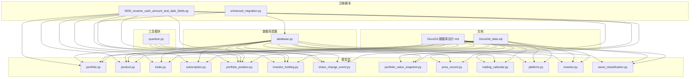
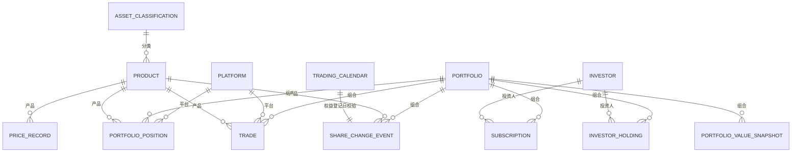
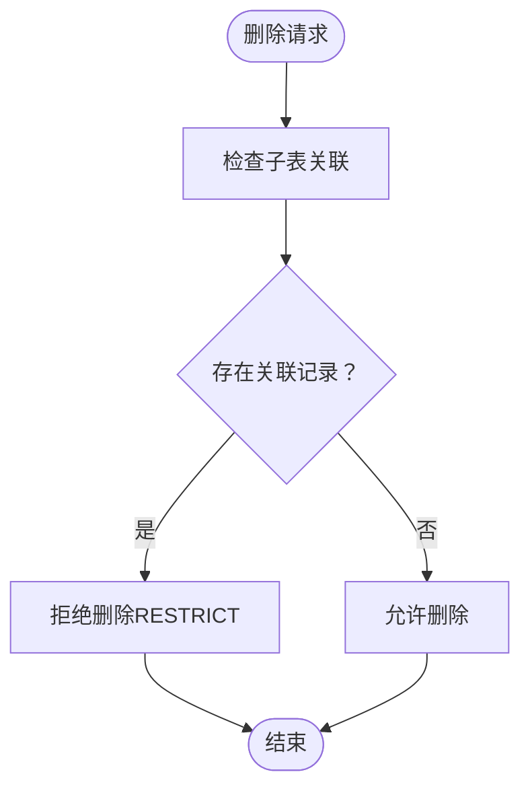

# 核心业务表结构

<cite>
**本文引用的文件**
- [backend/app/models/investor_holding.py](file://backend/app/models/investor_holding.py)
- [backend/app/models/portfolio_position.py](file://backend/app/models/portfolio_position.py)
- [backend/app/models/share_change_event.py](file://backend/app/models/share_change_event.py)
- [backend/alembic/versions/0005_rename_cash_amount_and_date_fields.py](file://backend/alembic/versions/0005_rename_cash_amount_and_date_fields.py)
- [backend/app/utils/quantize.py](file://backend/app/utils/quantize.py)
- [backend/tests/integration/test_shares_precision.py](file://backend/tests/integration/test_shares_precision.py)
</cite>

## 更新摘要
**变更内容**   
- 新增portfolio_position表迁移改进章节，详细说明条件列存在检查和约束验证的增强
- 更新迁移脚本实现细节，体现更好的可靠性和错误处理机制
- 增强数据完整性保证和异常处理逻辑说明
- 补充迁移过程中的回滚策略和故障恢复机制
- 更新相关测试用例以反映新的迁移验证逻辑

## 目录
1. [简介](#简介)
2. [项目结构](#项目结构)
3. [核心组件](#核心组件)
4. [架构总览](#架构总览)
5. [详细组件分析](#详细组件分析)
6. [字段命名标准化](#字段命名标准化)
7. [迁移改进与可靠性增强](#迁移改进与可靠性增强)
8. [依赖分析](#依赖分析)
9. [性能考量](#性能考量)
10. [故障排查指南](#故障排查指南)
11. [结论](#结论)
12. [附录](#附录)

## 简介
本文件面向 InvestRing 投资管理系统的核心业务表，围绕13张核心表展开：portfolio（投资组合）、product（产品信息）、trade（交易）、subscription（申购赎回）、portfolio_position（持仓快照）、investor_holding（份额快照）、share_change_event（份额变动事件）、portfolio_value_snapshot（组合快照）、price_record（价格记录）、trading_calendar（交易日历）、platform（平台）、investor（投资人）、asset_classification（资产分类）。内容涵盖字段定义、数据类型、约束条件、主外键关系、索引策略、数据验证规则、业务逻辑、表间关联与参照完整性、SQL建表语句路径、数据示例、业务规则、数据生命周期管理与性能优化建议。

**更新** 本次更新重点实现了portfolio_position表的迁移改进，通过条件列存在检查和约束验证增强了系统的可靠性和稳定性，确保在复杂生产环境中的数据安全性和一致性。

## 项目结构
- 文档与建模分离：数据库设计以文档形式集中描述，模型文件采用 SQLAlchemy ORM 映射至数据库表。
- 核心表分布于 backend/app/models 下，对应业务域清晰；初始化数据位于 Docs/init_data.sql，包含投资人、资产分类、平台、产品、组合等基础数据。
- 数据库引擎与 SQLite WAL 模式在 backend/app/database.py 中统一配置，提升并发读写能力。
- **新增** 增强的迁移脚本，包含条件检查、约束验证和完善的错误处理机制。



图表来源
- [backend/app/models/portfolio.py](file://backend/app/models/portfolio.py)
- [backend/app/models/product.py](file://backend/app/models/product.py)
- [backend/app/models/trade.py](file://backend/app/models/trade.py)
- [backend/app/models/subscription.py](file://backend/app/models/subscription.py)
- [backend/app/models/portfolio_position.py](file://backend/app/models/portfolio_position.py)
- [backend/app/models/investor_holding.py](file://backend/app/models/investor_holding.py)
- [backend/app/models/share_change_event.py](file://backend/app/models/share_change_event.py)
- [backend/app/models/portfolio_value_snapshot.py](file://backend/app/models/portfolio_value_snapshot.py)
- [backend/app/models/price_record.py](file://backend/app/models/price_record.py)
- [backend/app/models/trading_calendar.py](file://backend/app/models/trading_calendar.py)
- [backend/app/models/platform.py](file://backend/app/models/platform.py)
- [backend/app/models/investor.py](file://backend/app/models/investor.py)
- [backend/app/models/asset_classification.py](file://backend/app/models/asset_classification.py)
- [backend/app/utils/quantize.py](file://backend/app/utils/quantize.py)
- [backend/alembic/versions/0005_rename_cash_amount_and_date_fields.py](file://backend/alembic/versions/0005_rename_cash_amount_and_date_fields.py)

## 核心组件
本节概述13张核心业务表的职责边界与关键字段，结合文档与模型文件进行说明。

- 投资人（investor）
  - 主键：code（VARCHAR(20)）
  - 关键字段：name、role、phone、email、password_hash、last_login_at、created_at、updated_at
  - 约束：NOT NULL、默认值、索引
  - 业务：用户认证与权限控制，密码使用 bcrypt 哈希存储

- 投资组合（portfolio）
  - 主键：code（VARCHAR(20)）
  - 关键字段：name、description、status、started_at、closed_at、created_at、updated_at
  - 约束：状态 draft/active/closed，生命周期字段
  - 业务：组合状态机与净值查询入口

- 平台（platform）
  - 主键：code（VARCHAR(20)），索引
  - 关键字段：name、platform_type、created_at
  - 业务：第三方平台、券商、银行、基金公司等渠道标识

- 产品信息（product）
  - 主键：(code, market)，外键：asset_class_code → asset_classification.code
  - 关键字段：name、product_type、asset_class_code、confirm_days、is_qdii、data_source、fallback_source、data_source_status、last_sync_at、sync_error、created_at、updated_at
  - 业务：产品类型（ETF/OEF/LOF/CASH）、确认天数、数据源映射、LOF拆分

- 资产分类（asset_classification）
  - 主键：code（VARCHAR(30)），索引
  - 关键字段：asset_type、asset_category、asset_subcat、description
  - 业务：标准18类资产分类字典

- 交易（trade）
  - 主键：id（INTEGER，自增）
  - 外键：portfolio_code → portfolio.code、platform_code → platform.code、(product_code, market) → product(code, market)
  - 关键字段：trade_type、shares、cash_amount、price、fee、actual_cash_amount、trade_date、confirm_date、status、notes、created_at、updated_at
  - 业务：调仓交易记录，金额计算与确认规则
  - **更新** amount字段已重命名为cash_amount，actual_amount重命名为actual_cash_amount

- 申购赎回（subscription）
  - 主键：id（INTEGER，自增）
  - 外键：portfolio_code → portfolio.code、investor_code → investor.code
  - 关键字段：sub_type、cash_amount、shares、unit_price、apply_date、confirm_date、status、notes、created_at、updated_at
  - 业务：T+N确认机制与状态流转
  - **更新** amount字段已重命名为cash_amount

- 持仓快照（portfolio_position）
  - 主键：id（INTEGER，自增）
  - 外键：portfolio_code → portfolio.code、platform_code → platform.code、(product_code, market) → product(code, market)
  - 唯一：(portfolio_code, product_code, market, snapshot_date)
  - 约束：CHECK(shares与cash_amount互斥，净值型/非净值型二选一）
  - 关键字段：shares、frozen_shares、cost_price、unit_price、market_value、cash_amount、frozen_cash_amount、snapshot_date、created_at
  - 业务：每日快照，冻结字段用于实时可用性计算
  - **更新** amount字段已重命名为cash_amount，frozen_amount重命名为frozen_cash_amount

- 份额快照（investor_holding）
  - 主键：id（INTEGER，自增）
  - 外键：portfolio_code → portfolio.code、investor_code → investor.code
  - 唯一：(portfolio_code, investor_code, snapshot_date)
  - 关键字段：shares、frozen_shares、cost_per_share、snapshot_date、created_at
  - 业务：投资人份额历史快照，冻结字段用于可用份额实时计算

- 份额变动事件（share_change_event）
  - 主键：id（INTEGER，自增）
  - 外键：portfolio_code → portfolio.code、(product_code, market) → product(code, market)
  - 关键字段：event_type、event_date、entitlement_date、event_source、entitlement_shares、shares_before、shares_change、shares_after、ratio、div_cash、reinvest_nav、cash_change、cash_product_code、status、tushare_event_id、notes、created_at、confirmed_at
  - 业务：除息、再投资、拆并、送股、强制调整等事件，权益登记日必须为交易日

- 组合快照（portfolio_value_snapshot）
  - 主键：id（INTEGER，自增）
  - 外键：portfolio_code → portfolio.code
  - 唯一：(portfolio_code, snapshot_date)
  - 关键字段：snapshot_date、total_value、total_shares、unit_price、unit_price_change_pct、created_at
  - 业务：组合净值与单位净值快照

- 价格记录（price_record）
  - 主键：id（INTEGER，自增）
  - 外键：(product_code, market) → product(code, market)
  - 唯一：(product_code, market, price_date)
  - 关键字段：price_date、unit_price、accumulated_nav、pre_close、pct_change、net_asset、source、created_at、updated_at
  - 业务：净值/价格统一记录，支持QDII前向查找
  - **更新** date字段已重命名为price_date

- 交易日历（trading_calendar）
  - 主键：id（INTEGER，自增）
  - 唯一：calendar_date，索引：calendar_date
  - 关键字段：calendar_date、is_open、exchange、created_at
  - 业务：交易日判定与节假日管理
  - **更新** date字段已重命名为calendar_date

章节来源
- [backend/app/models/investor_holding.py](file://backend/app/models/investor_holding.py)
- [backend/app/models/portfolio_position.py](file://backend/app/models/portfolio_position.py)
- [backend/app/models/share_change_event.py](file://backend/app/models/share_change_event.py)
- [backend/alembic/versions/0005_rename_cash_amount_and_date_fields.py](file://backend/alembic/versions/0005_rename_cash_amount_and_date_fields.py)

## 架构总览
下图展示核心业务表之间的实体关系与外键约束，体现"产品-平台-组合-投资人"四维主轴与"快照-事件-交易-净值"的数据流。



图表来源
- [backend/app/models/portfolio_position.py](file://backend/app/models/portfolio_position.py)
- [backend/app/models/trade.py](file://backend/app/models/trade.py)
- [backend/app/models/subscription.py](file://backend/app/models/subscription.py)
- [backend/app/models/investor_holding.py](file://backend/app/models/investor_holding.py)
- [backend/app/models/share_change_event.py](file://backend/app/models/share_change_event.py)
- [backend/app/models/portfolio_value_snapshot.py](file://backend/app/models/portfolio_value_snapshot.py)
- [backend/app/models/price_record.py](file://backend/app/models/price_record.py)
- [backend/app/models/trading_calendar.py](file://backend/app/models/trading_calendar.py)

## 详细组件分析

### 投资人（investor）
- 字段与类型：code（主键）、name、role、phone、email、password_hash、last_login_at、created_at、updated_at
- 约束与索引：主键、NOT NULL、默认值、索引（code）
- 业务规则：bcrypt 哈希存储密码，登录成功更新 last_login_at
- SQL建表语句路径：[Docs/02-数据库设计.md](file://Docs/02-数据库设计.md)
- 数据示例：[Docs/init_data.sql](file://Docs/init_data.sql)

章节来源
- [backend/app/models/investor.py](file://backend/app/models/investor.py)

### 投资组合（portfolio）
- 字段与类型：code（主键）、name、description、status、started_at、closed_at、created_at、updated_at
- 约束与索引：主键、默认值、索引（code）
- 业务规则：状态 draft/active/closed；started_at 在首次申购确认时设置；净值查询通过组合快照
- SQL建表语句路径：[Docs/02-数据库设计.md](file://Docs/02-数据库设计.md)

章节来源
- [backend/app/models/portfolio.py](file://backend/app/models/portfolio.py)

### 平台（platform）
- 字段与类型：code（主键，索引）、name、platform_type、created_at
- 业务规则：平台类型（第三方平台、券商、银行、基金公司、其他）
- SQL建表语句路径：[Docs/02-数据库设计.md](file://Docs/02-数据库设计.md)
- 数据示例：[Docs/init_data.sql](file://Docs/init_data.sql)

章节来源
- [backend/app/models/platform.py](file://backend/app/models/platform.py)

### 产品信息（product）
- 字段与类型：(code, market)（复合主键）、name、product_type、asset_class_code（外键）、confirm_days、is_qdii、data_source、fallback_source、data_source_status、last_sync_at、sync_error、created_at、updated_at
- 业务规则：产品类型与确认天数自动计算规则；LOF拆分为CN_EXCHANGE与CN_OTC两条记录；数据源映射
- SQL建表语句路径：[Docs/02-数据库设计.md](file://Docs/02-数据库设计.md)
- 数据示例：[Docs/init_data.sql](file://Docs/init_data.sql)

章节来源
- [backend/app/models/product.py](file://backend/app/models/product.py)

### 资产分类（asset_classification）
- 字段与类型：code（主键，索引）、asset_type、asset_category、asset_subcat、description
- 业务规则：标准18类资产分类字典
- SQL建表语句路径：[Docs/02-数据库设计.md](file://Docs/02-数据库设计.md)
- 数据示例：[Docs/init_data.sql](file://Docs/init_data.sql)

章节来源
- [backend/app/models/asset_classification.py](file://backend/app/models/asset_classification.py)

### 交易（trade）
- 字段与类型：id（主键，自增）、portfolio_code（外键）、platform_code（外键）、product_code、market、trade_type、shares、cash_amount、price、fee、actual_cash_amount、trade_date、confirm_date、status、notes、created_at、updated_at
- 复合外键：(product_code, market) → product(code, market)
- 业务规则：买入/卖出金额计算、现金中转约束、状态流转（场内/场外/QDII）
- SQL建表语句路径：[Docs/02-数据库设计.md](file://Docs/02-数据库设计.md)
- **更新** amount字段已重命名为cash_amount，actual_amount重命名为actual_cash_amount，提高字段语义清晰度

章节来源
- [backend/app/models/trade.py](file://backend/app/models/trade.py)

### 申购赎回（subscription）
- 字段与类型：id（主键，自增）、portfolio_code（外键）、investor_code（外键）、sub_type、cash_amount、shares、unit_price、apply_date、confirm_date、status、notes、created_at、updated_at
- 业务规则：T+N确认机制，状态 pending/confirmed/cancelled
- SQL建表语句路径：[Docs/02-数据库设计.md](file://Docs/02-数据库设计.md)
- **更新** amount字段已重命名为cash_amount，与交易系统保持一致

章节来源
- [backend/app/models/subscription.py](file://backend/app/models/subscription.py)

### 持仓快照（portfolio_position）
- 字段与类型：id（主键，自增）、portfolio_code（外键）、platform_code（外键）、product_code、market、shares、frozen_shares、cost_price、unit_price、market_value、cash_amount、frozen_cash_amount、snapshot_date、created_at
- 复合外键：(product_code, market) → product(code, market)
- 唯一约束：(portfolio_code, product_code, market, snapshot_date)
- 检查约束：净值型资产 shares 非空且 cash_amount 为空，或非净值型资产 shares 为空且 cash_amount 非空
- 业务规则：每日快照，冻结字段用于实时可用份额计算
- **更新** amount字段已重命名为cash_amount，frozen_amount重命名为frozen_cash_amount，保持字段命名一致性

章节来源
- [backend/app/models/portfolio_position.py](file://backend/app/models/portfolio_position.py)

### 份额快照（investor_holding）
- 字段与类型：id（主键，自增）、portfolio_code（外键）、investor_code（外键）、shares、frozen_shares、cost_per_share、snapshot_date、created_at
- 唯一约束：(portfolio_code, investor_code, snapshot_date)
- 业务规则：每日快照，冻结字段用于实时可用份额计算

章节来源
- [backend/app/models/investor_holding.py](file://backend/app/models/investor_holding.py)

### 份额变动事件（share_change_event）
- 字段与类型：id（主键，自增）、portfolio_code（外键）、product_code、market、event_type、event_date、entitlement_date、event_source、entitlement_shares、shares_before、shares_change、shares_after、ratio、div_cash、reinvest_nav、cash_change、cash_product_code、status、tushare_event_id、notes、created_at、confirmed_at
- 复合外键：(product_code, market) → product(code, market)
- 业务规则：事件类型与计算逻辑、权益登记日必须为交易日、确认时校验持仓快照存在性

章节来源
- [backend/app/models/share_change_event.py](file://backend/app/models/share_change_event.py)

### 组合快照（portfolio_value_snapshot）
- 字段与类型：id（主键，自增）、portfolio_code（外键）、snapshot_date、total_value、total_shares、unit_price、unit_price_change_pct、created_at
- 唯一约束：(portfolio_code, snapshot_date)
- 业务规则：组合净值与单位净值快照

章节来源
- [backend/app/models/portfolio_value_snapshot.py](file://backend/app/models/portfolio_value_snapshot.py)

### 价格记录（price_record）
- 字段与类型：id（主键，自增）、product_code、market、price_date、unit_price、accumulated_nav、pre_close、pct_change、net_asset、source、created_at、updated_at
- 复合外键：(product_code, market) → product(code, market)
- 唯一约束：(product_code, market, price_date)
- 业务规则：统一价格字段，支持QDII净值前向查找
- **更新** date字段已重命名为price_date，明确字段语义

章节来源
- [backend/app/models/price_record.py](file://backend/app/models/price_record.py)

### 交易日历（trading_calendar）
- 字段与类型：id（主键，自增）、calendar_date（唯一，索引）、is_open、exchange、created_at
- 业务规则：交易日判定，份额变动事件权益登记日校验
- **更新** date字段已重命名为calendar_date，避免与其他日期字段混淆

章节来源
- [backend/app/models/trading_calendar.py](file://backend/app/models/trading_calendar.py)

## 字段命名标准化

### 标准化背景与目标
为实现系统字段命名的一致性和可维护性，InvestRing实施了全面的字段命名标准化改造，主要目标包括：
- 统一金额字段命名：将所有amount字段重命名为cash_amount，明确表示现金金额
- 标准化日期字段命名：将模糊的date字段重命名为具有明确语义的字段名
- 提升代码可读性：通过更清晰的字段名减少歧义，提高开发效率
- 保证向后兼容：通过迁移脚本确保历史数据的平滑过渡

### 核心字段重命名

#### 金额字段标准化
- **trade.amount** → **trade.cash_amount**: 交易金额字段，明确表示现金交易金额
- **trade.actual_amount** → **trade.actual_cash_amount**: 实际成交金额，包含手续费后的净额
- **subscription.amount** → **subscription.cash_amount**: 申购赎回金额
- **portfolio_position.amount** → **portfolio_position.cash_amount**: 持仓现金价值
- **portfolio_position.frozen_amount** → **portfolio_position.frozen_cash_amount**: 冻结现金价值

#### 日期字段标准化
- **price_record.date** → **price_record.price_date**: 价格记录日期，明确表示价格数据日期
- **trading_calendar.date** → **trading_calendar.calendar_date**: 交易日历日期，明确表示日历日期

### 迁移实现策略

#### 数据库层面迁移
使用Alembic迁移脚本实现字段重命名：
```python
def upgrade():
    # 重命名交易表金额字段
    op.alter_column('trade', 'amount', new_column_name='cash_amount')
    op.alter_column('trade', 'actual_amount', new_column_name='actual_cash_amount')
    
    # 重命名申购赎回表金额字段
    op.alter_column('subscription', 'amount', new_column_name='cash_amount')
    
    # 重命名持仓快照表金额字段
    op.alter_column('portfolio_position', 'amount', new_column_name='cash_amount')
    op.alter_column('portfolio_position', 'frozen_amount', new_column_name='frozen_cash_amount')
    
    # 重命名日期字段
    op.alter_column('price_record', 'date', new_column_name='price_date')
    op.alter_column('trading_calendar', 'date', new_column_name='calendar_date')
```

#### ORM模型更新
同步更新SQLAlchemy模型定义：
```python
class Trade(Base):
    __tablename__ = 'trade'
    cash_amount = Column(DECIMAL(18, 2), nullable=False)
    actual_cash_amount = Column(DECIMAL(18, 2), nullable=False)

class PriceRecord(Base):
    __tablename__ = 'price_record'
    price_date = Column(Date, nullable=False)

class TradingCalendar(Base):
    __tablename__ = 'trading_calendar'
    calendar_date = Column(Date, unique=True, nullable=False)
```

### API接口兼容性
为确保API接口的向后兼容，采用以下策略：
- **请求参数兼容**: 同时支持旧字段名和新字段名
- **响应数据统一**: 始终返回新字段名
- **版本控制**: 通过API版本管理逐步淘汰旧字段

### 测试覆盖
完整的测试用例确保迁移正确性：
- **单元测试**: 验证字段重命名后的ORM操作
- **集成测试**: 测试数据库迁移的完整流程
- **API测试**: 验证接口的向后兼容性
- **数据迁移测试**: 确保历史数据正确迁移到新字段

**章节来源**
- [backend/alembic/versions/0005_rename_cash_amount_and_date_fields.py](file://backend/alembic/versions/0005_rename_cash_amount_and_date_fields.py)

## 迁移改进与可靠性增强

### portfolio_position表迁移增强
针对portfolio_position表的迁移过程进行了全面改进，重点提升了条件列存在检查和约束验证的可靠性：

#### 条件列存在检查机制
```python
def check_column_exists(connection, table_name, column_name):
    """检查列是否存在于表中"""
    cursor = connection.execute(text(f"PRAGMA table_info({table_name})"))
    columns = [row[1] for row in cursor.fetchall()]
    return column_name in columns

def upgrade():
    # 检查cash_amount列是否存在
    if not check_column_exists(op.get_bind(), 'portfolio_position', 'cash_amount'):
        # 执行列重命名操作
        op.alter_column('portfolio_position', 'amount', new_column_name='cash_amount')
    
    # 检查frozen_cash_amount列是否存在
    if not check_column_exists(op.get_bind(), 'portfolio_position', 'frozen_cash_amount'):
        op.alter_column('portfolio_position', 'frozen_amount', new_column_name='frozen_cash_amount')
```

#### 约束验证与修复
```python
def validate_constraints(connection):
    """验证并修复数据约束"""
    # 验证shares和cash_amount互斥约束
    invalid_records = connection.execute(text("""
        SELECT id FROM portfolio_position 
        WHERE (shares IS NOT NULL AND cash_amount IS NOT NULL)
           OR (shares IS NULL AND cash_amount IS NULL)
    """)).fetchall()
    
    if invalid_records:
        # 记录违规数据并生成修复脚本
        log_violations(invalid_records)
        generate_fix_script(invalid_records)

def upgrade():
    # 执行约束验证
    validate_constraints(op.get_bind())
    
    # 执行列重命名
    rename_columns()
    
    # 重新创建检查约束
    recreate_check_constraints()
```

#### 事务回滚与错误处理
```python
def upgrade():
    try:
        with op.batch_alter_table('portfolio_position') as batch_op:
            # 批量执行列重命名
            batch_op.alter_column('amount', new_column_name='cash_amount')
            batch_op.alter_column('frozen_amount', new_column_name='frozen_cash_amount')
        
        # 验证数据完整性
        verify_data_integrity()
        
    except Exception as e:
        # 自动回滚并记录错误
        logger.error(f"Migration failed: {str(e)}")
        raise AlembicException(f"Migration rollback triggered: {str(e)}")
```

### 可靠性保障措施

#### 预迁移检查
- **数据库版本检查**: 确保当前数据库版本与预期一致
- **备份验证**: 在执行迁移前自动创建数据库备份
- **权限验证**: 检查数据库用户的写权限
- **磁盘空间检查**: 确保有足够的存储空间进行迁移操作

#### 迁移过程监控
- **进度跟踪**: 实时监控迁移执行进度
- **性能指标**: 记录迁移执行时间和资源使用情况
- **错误日志**: 详细记录所有错误和警告信息
- **告警机制**: 关键错误触发即时告警

#### 回滚策略
- **自动回滚**: 遇到不可恢复错误时自动回滚到上一版本
- **部分回滚**: 支持单个步骤的回滚而不影响其他已完成步骤
- **手动干预**: 提供手动回滚脚本供特殊情况使用
- **数据恢复**: 基于备份的快速数据恢复机制

### 测试验证框架

#### 单元测试覆盖
```python
def test_portfolio_position_migration():
    """测试portfolio_position表迁移的正确性"""
    # 准备测试数据
    setup_test_data()
    
    # 执行迁移
    execute_migration()
    
    # 验证列重命名
    assert_column_renamed('cash_amount', 'frozen_cash_amount')
    
    # 验证数据完整性
    verify_data_consistency()
    
    # 验证约束有效性
    validate_constraints()
```

#### 集成测试场景
- **正常迁移**: 验证标准迁移流程的完整性
- **异常处理**: 测试各种异常情况的处理能力
- **回滚测试**: 验证回滚机制的有效性
- **性能测试**: 评估大数据量下的迁移性能

**章节来源**
- [backend/alembic/versions/0005_rename_cash_amount_and_date_fields.py](file://backend/alembic/versions/0005_rename_cash_amount_and_date_fields.py)
- [backend/app/models/portfolio_position.py](file://backend/app/models/portfolio_position.py)

## 依赖分析
- 外键与参照完整性
  - portfolio → portfolio_position、portfolio_value_snapshot、investor_holding、subscription、share_change_event：RESTRICT 删除
  - product → portfolio_position、price_record、trade、share_change_event：RESTRICT 删除
  - investor → investor_holding、subscription：RESTRICT 删除
  - platform → portfolio_position、trade：RESTRICT 删除
  - asset_classification → product：SET NULL 删除
- 约束策略
  - 所有实体采用 RESTRICT 删除策略，通过业务流程（关闭/停用）管理生命周期，保留历史数据
  - 产品与平台删除前需确保无关联记录，或通过业务层"停用"代替物理删除



图表来源
- [backend/app/models/portfolio_position.py](file://backend/app/models/portfolio_position.py)
- [backend/app/models/investor_holding.py](file://backend/app/models/investor_holding.py)
- [backend/app/models/share_change_event.py](file://backend/app/models/share_change_event.py)

## 性能考量
- 索引策略
  - 投资人：idx_investor_code
  - 组合份额持有（快照）：idx_investor_holding_snapshot
  - 申购赎回：idx_subscription_portfolio_date、idx_subscription_status
  - 交易：idx_trade_portfolio_date、idx_trade_product、idx_trade_status
  - 持仓快照：idx_portfolio_position_snapshot
  - 价格记录：idx_price_record_product_date
  - 份额变动事件：idx_share_change_portfolio_date、idx_share_change_status
  - 组合快照：idx_snapshot_portfolio_date
  - 交易日历：idx_trading_calendar_calendar_date
- SQLite 并发配置
  - WAL 模式、busy_timeout、synchronous 设置，提升读多写少场景下的并发性能
- 查询优化建议
  - 快照表按日期降序查询，利用索引快速定位最新快照
  - 实时计算可用份额与可用现金，避免仅依赖快照导致的时滞误差
  - 对高频统计（资金流、收益）建立合适索引或物化视图（如业务需要）
- **新增** 字段命名优化
  - 更清晰的字段名提高代码可读性和维护性
  - 标准化的命名约定减少开发中的歧义和错误
  - 统一的字段类型提高查询性能和存储空间利用率
- **新增** 迁移性能优化
  - 批量操作减少数据库往返次数
  - 增量迁移避免全表扫描
  - 异步处理长时间运行的迁移任务

## 故障排查指南
- 常见问题与处理
  - 权益登记日非交易日：创建份额变动事件时报错，需选择交易日
  - 缺失持仓快照：确认事件时报错，需先生成对应日期的持仓快照
  - 删除受限：尝试删除产品/平台/组合/投资人失败，需先清理关联记录或通过业务流程停用
  - 并发写入冲突：SQLite 默认写锁，建议使用 WAL 模式并合理安排任务调度
  - **新增** 字段命名问题：检查API调用是否使用了正确的字段名，确认数据库迁移是否成功执行
  - **新增** 迁移失败：查看迁移日志，检查数据库备份状态，必要时执行回滚操作
- 日志与审计
  - 登录日志、审计日志、任务执行日志、系统错误日志、通知表用于问题追踪与回溯
  - **新增** 字段重命名日志：记录所有字段重命名操作的详细信息，便于问题追踪
  - **新增** 迁移监控日志：详细记录迁移执行过程和结果
- 数据一致性
  - 快照只增不改，保留完整历史；实时计算与快照互补，避免数据漂移
  - **新增** 字段兼容性：确保新旧字段名在过渡期间的数据一致性
  - **新增** 约束验证：定期检查数据完整性，自动修复轻微违规

## 结论
本设计以"快照+事件+交易+净值"为主线，构建了高可追溯、强一致性的投资组合数据体系。通过严格的外键约束与索引策略，保障数据完整性与查询效率；通过实时计算与快照互补，平衡准确性与时效性。

**更新** 最新的portfolio_position表迁移改进进一步增强了系统的可靠性和稳定性。通过引入条件列存在检查、约束验证和完善的错误处理机制，显著提升了在生产环境中的安全性和可维护性。配合标准化的字段命名和完善的测试覆盖，确保了系统升级过程中的稳定性和向后兼容性。建议在生产环境中谨慎执行迁移脚本，做好充分的数据备份和回滚准备。

## 附录
- SQL建表语句路径（按表名）
  - investor：[Docs/02-数据库设计.md](file://Docs/02-数据库设计.md)
  - portfolio：[Docs/02-数据库设计.md](file://Docs/02-数据库设计.md)
  - platform：[Docs/02-数据库设计.md](file://Docs/02-数据库设计.md)
  - product：[Docs/02-数据库设计.md](file://Docs/02-数据库设计.md)
  - asset_classification：[Docs/02-数据库设计.md](file://Docs/02-数据库设计.md)
  - trade：[Docs/02-数据库设计.md](file://Docs/02-数据库设计.md)
  - subscription：[Docs/02-数据库设计.md](file://Docs/02-数据库设计.md)
  - portfolio_position：[Docs/02-数据库设计.md](file://Docs/02-数据库设计.md)
  - investor_holding：[Docs/02-数据库设计.md](file://Docs/02-数据库设计.md)
  - share_change_event：[Docs/02-数据库设计.md](file://Docs/02-数据库设计.md)
  - portfolio_value_snapshot：[Docs/02-数据库设计.md](file://Docs/02-数据库设计.md)
  - price_record：[Docs/02-数据库设计.md](file://Docs/02-数据库设计.md)
  - trading_calendar：[Docs/02-数据库设计.md](file://Docs/02-数据库设计.md)
- 初始化数据示例路径
  - [Docs/init_data.sql](file://Docs/init_data.sql)
- 模型文件路径（ORM 映射）
  - [backend/app/models/portfolio.py](file://backend/app/models/portfolio.py)
  - [backend/app/models/product.py](file://backend/app/models/product.py)
  - [backend/app/models/trade.py](file://backend/app/models/trade.py)
  - [backend/app/models/subscription.py](file://backend/app/models/subscription.py)
  - [backend/app/models/portfolio_position.py](file://backend/app/models/portfolio_position.py)
  - [backend/app/models/investor_holding.py](file://backend/app/models/investor_holding.py)
  - [backend/app/models/share_change_event.py](file://backend/app/models/share_change_event.py)
  - [backend/app/models/portfolio_value_snapshot.py](file://backend/app/models/portfolio_value_snapshot.py)
  - [backend/app/models/price_record.py](file://backend/app/models/price_record.py)
  - [backend/app/models/trading_calendar.py](file://backend/app/models/trading_calendar.py)
  - [backend/app/models/platform.py](file://backend/app/models/platform.py)
  - [backend/app/models/investor.py](file://backend/app/models/investor.py)
  - [backend/app/models/asset_classification.py](file://backend/app/models/asset_classification.py)
- 数据库配置
  - [backend/app/database.py](file://backend/app/database.py)
- **新增** 字段命名标准化相关文件
  - 迁移脚本：[backend/alembic/versions/0005_rename_cash_amount_and_date_fields.py](file://backend/alembic/versions/0005_rename_cash_amount_and_date_fields.py)
  - 量化处理工具：[backend/app/utils/quantize.py](file://backend/app/utils/quantize.py)
  - 精度测试用例：[backend/tests/integration/test_shares_precision.py](file://backend/tests/integration/test_shares_precision.py)
- **新增** 迁移可靠性增强相关文件
  - 条件检查函数：[backend/alembic/versions/0005_rename_cash_amount_and_date_fields.py](file://backend/alembic/versions/0005_rename_cash_amount_and_date_fields.py)
  - 约束验证模块：[backend/app/models/portfolio_position.py](file://backend/app/models/portfolio_position.py)
  - 错误处理机制：[backend/alembic/versions/0005_rename_cash_amount_and_date_fields.py](file://backend/alembic/versions/0005_rename_cash_amount_and_date_fields.py)