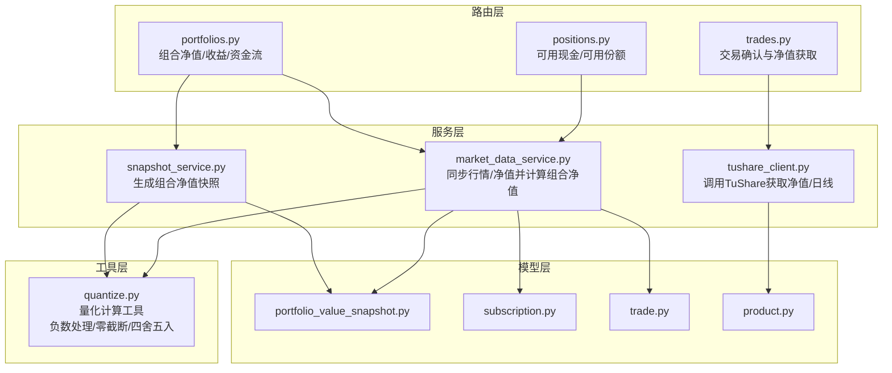
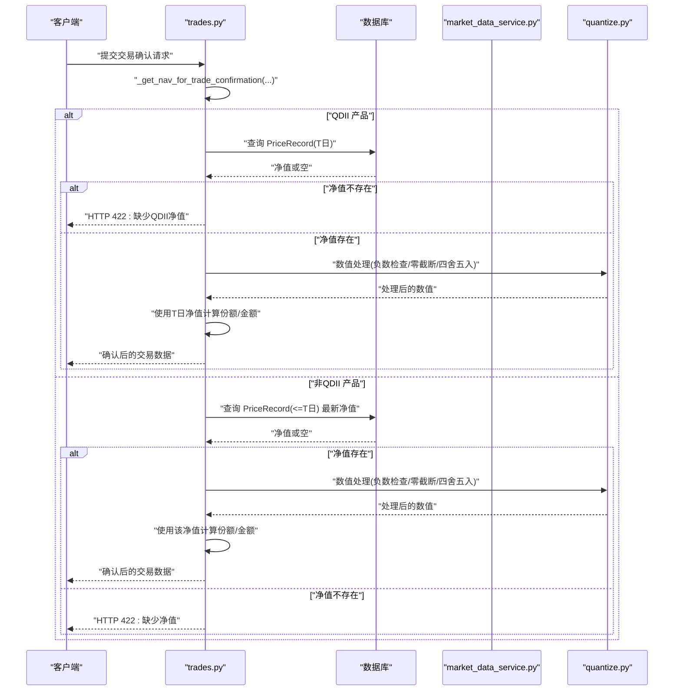
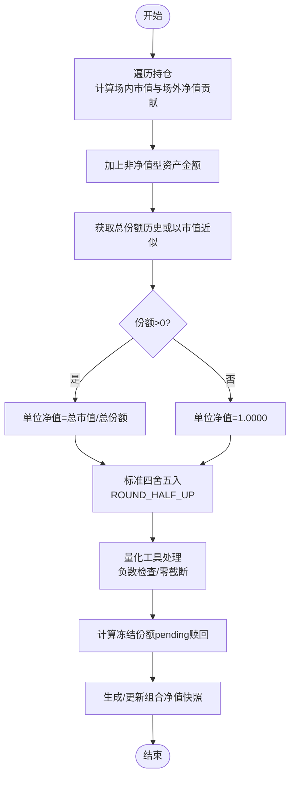
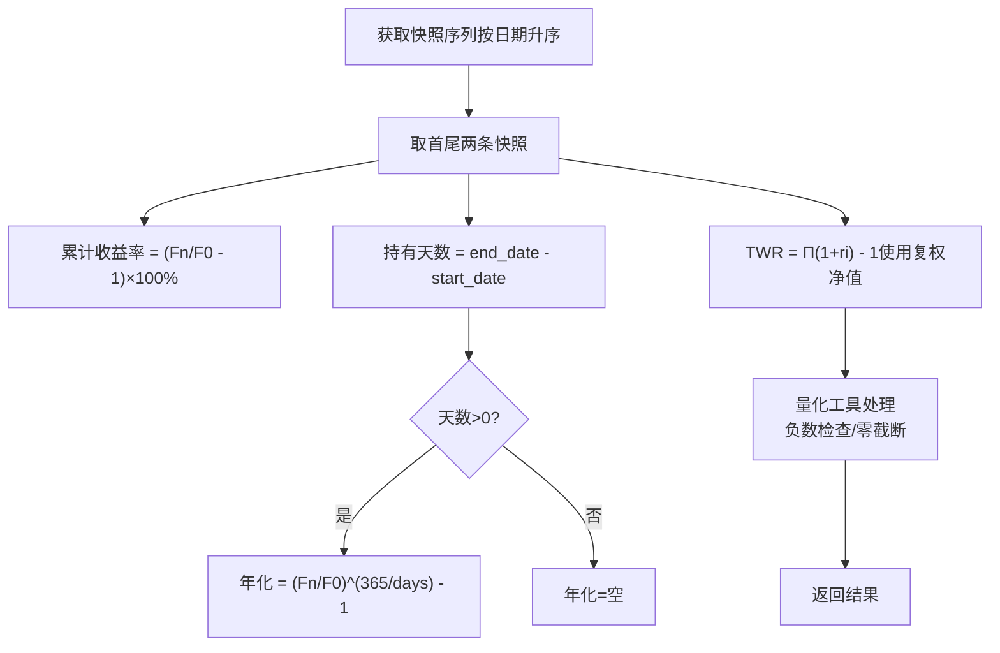
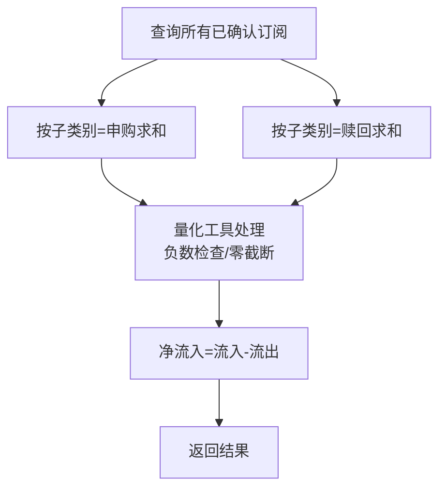
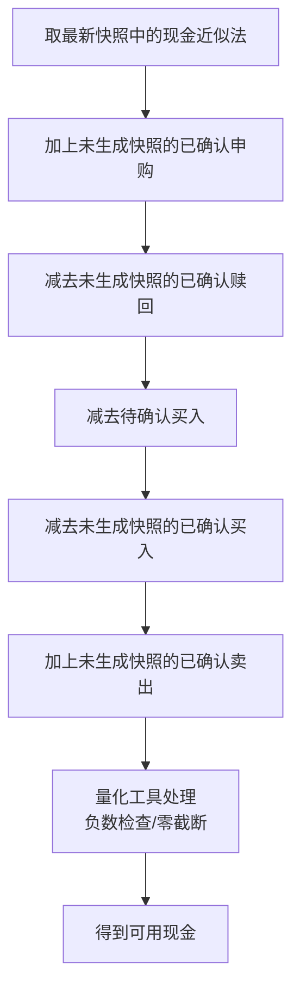
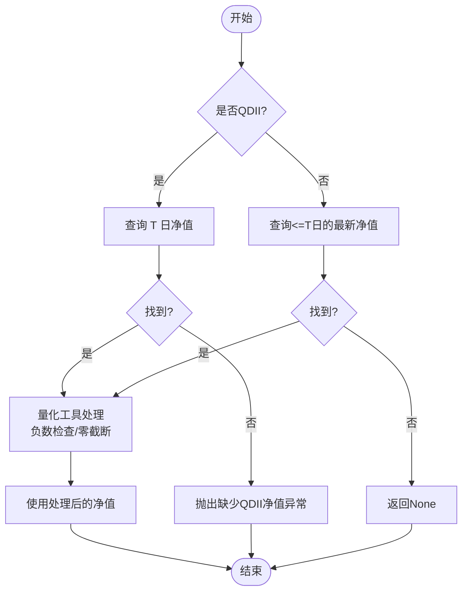
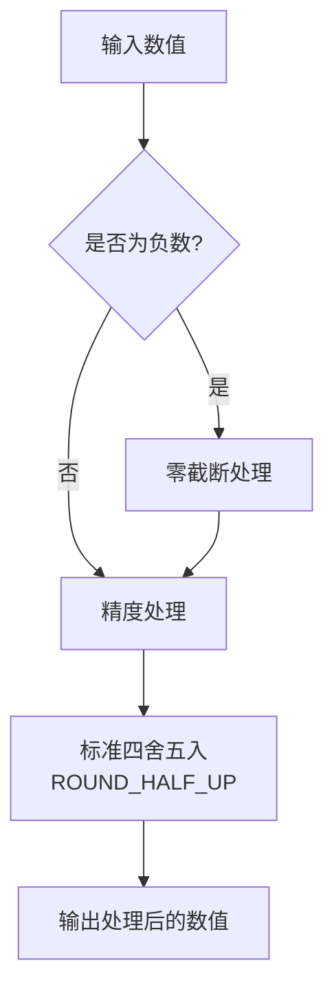
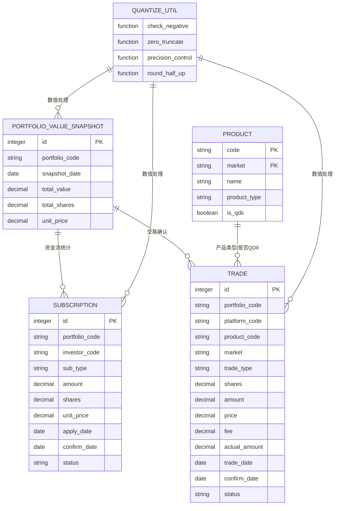

# 核心计算公式

<cite>
**本文引用的文件**
- [backend/app/routers/portfolios.py](file://backend/app/routers/portfolios.py)
- [backend/app/routers/positions.py](file://backend/app/routers/positions.py)
- [backend/app/routers/trades.py](file://backend/app/routers/trades.py)
- [backend/app/services/snapshot_service.py](file://backend/app/services/snapshot_service.py)
- [backend/app/services/market_data_service.py](file://backend/app/services/market_data_service.py)
- [backend/app/services/tushare_client.py](file://backend/app/services/tushare_client.py)
- [backend/app/models/portfolio_value_snapshot.py](file://backend/app/models/portfolio_value_snapshot.py)
- [backend/app/models/subscription.py](file://backend/app/models/subscription.py)
- [backend/app/models/trade.py](file://backend/app/models/trade.py)
- [backend/app/models/product.py](file://backend/app/models/product.py)
- [backend/app/utils/quantize.py](file://backend/app/utils/quantize.py)
- [Docs/02-数据库设计.md](file://Docs/02-数据库设计.md)
- [Docs/03-业务流程设计.md](file://Docs/03-业务流程设计.md)
- [Docs/04-后端开发.md](file://Docs/04-后端开发.md)
</cite>

## 更新摘要
**变更内容**
- **重要更新**：份额四舍五入策略从向下取整（FLOOR）升级为标准四舍五入（ROUND_HALF_UP），提供更准确的基金会计处理
- 新增量化工具模块的负数处理文档注释，明确零截断行为
- 添加首次快照边界条件的详细说明
- 增强计算精度处理和异常处理的文档说明
- 更新性能优化策略中关于数值计算的描述

## 目录
1. [简介](#简介)
2. [项目结构](#项目结构)
3. [核心组件](#核心组件)
4. [架构总览](#架构总览)
5. [详细组件分析](#详细组件分析)
6. [依赖分析](#依赖分析)
7. [性能考虑](#性能考虑)
8. [故障排查指南](#故障排查指南)
9. [结论](#结论)
10. [附录](#附录)

## 简介
本文件聚焦 InvestRing 系统的核心计算公式与实现细节，覆盖以下主题：
- 组合净值与市值计算公式
- 收益率计算（累计、年化、时间加权）
- 资金流统计与可用现金实时计算
- QDII 净值获取算法与异常处理
- 计算精度控制、异常处理与性能优化策略
- **重要更新**：份额四舍五入策略升级为标准四舍五入（ROUND_HALF_UP），提供更准确的基金会计处理
- **新增**：量化工具模块的负数处理机制和零截断行为
- **新增**：首次快照边界条件的处理逻辑

目标是帮助读者准确理解系统如何从底层数据到最终指标的演算过程，并提供可操作的优化建议。

## 项目结构
后端采用 FastAPI + SQLAlchemy 架构，核心计算分布在路由层（对外接口）、服务层（业务逻辑）、工具层（量化计算）与模型层（数据定义）。与"核心计算公式"直接相关的关键模块如下：
- 路由层：组合净值、资金流、可用现金、交易确认等接口
- 服务层：快照生成、行情与净值同步、组合净值计算
- **新增**：工具层：量化计算工具，包含负数处理和数值截断功能
- 模型层：组合净值快照、订阅、交易、产品等数据结构

**图表来源**
- [backend/app/routers/portfolios.py:194-276](file://backend/app/routers/portfolios.py#L194-L276)
- [backend/app/routers/positions.py:28-178](file://backend/app/routers/positions.py#L28-L178)
- [backend/app/routers/trades.py:53-105](file://backend/app/routers/trades.py#L53-L105)
- [backend/app/services/snapshot_service.py:421-473](file://backend/app/services/snapshot_service.py#L421-L473)
- [backend/app/services/market_data_service.py:228-323](file://backend/app/services/market_data_service.py#L228-L323)
- [backend/app/services/tushare_client.py:174-221](file://backend/app/services/tushare_client.py#L174-L221)
- [backend/app/utils/quantize.py:1-100](file://backend/app/utils/quantize.py#L1-L100)
- [backend/app/models/portfolio_value_snapshot.py:1-20](file://backend/app/models/portfolio_value_snapshot.py#L1-L20)
- [backend/app/models/subscription.py:1-21](file://backend/app/models/subscription.py#L1-L21)
- [backend/app/models/trade.py:1-32](file://backend/app/models/trade.py#L1-L32)
- [backend/app/models/product.py:1-22](file://backend/app/models/product.py#L1-L22)

**章节来源**
- [backend/app/routers/portfolios.py:1-276](file://backend/app/routers/portfolios.py#L1-L276)
- [backend/app/routers/positions.py:1-410](file://backend/app/routers/positions.py#L1-L410)
- [backend/app/routers/trades.py:1-105](file://backend/app/routers/trades.py#L1-L105)
- [backend/app/services/snapshot_service.py:421-473](file://backend/app/services/snapshot_service.py#L421-L473)
- [backend/app/services/market_data_service.py:1-323](file://backend/app/services/market_data_service.py#L1-L323)
- [backend/app/services/tushare_client.py:159-221](file://backend/app/services/tushare_client.py#L159-L221)
- [backend/app/utils/quantize.py:1-100](file://backend/app/utils/quantize.py#L1-L100)
- [backend/app/models/portfolio_value_snapshot.py:1-20](file://backend/app/models/portfolio_value_snapshot.py#L1-L20)
- [backend/app/models/subscription.py:1-21](file://backend/app/models/subscription.py#L1-L21)
- [backend/app/models/trade.py:1-32](file://backend/app/models/trade.py#L1-L32)
- [backend/app/models/product.py:1-22](file://backend/app/models/product.py#L1-L22)
- [Docs/02-数据库设计.md:500-562](file://Docs/02-数据库设计.md#L500-L562)
- [Docs/03-业务流程设计.md:1688-1710](file://Docs/03-业务流程设计.md#L1688-L1710)
- [Docs/04-后端开发.md:271-311](file://Docs/04-后端开发.md#L271-L311)

## 核心组件
- 组合净值快照：记录每日 total_value、total_shares、unit_price 等，用于收益计算与净值曲线生成
- 组合净值计算服务：根据持仓份额与最新价格（场内收盘价/场外净值）计算总市值与单位净值
- 交易确认与净值获取：对净值型产品（尤其是场外基金）在交易确认时获取 T 日净值，QDII 严格按 T 日
- 可用现金与可用份额：基于最新快照与待确认/待结算数据实时计算
- 资金流统计：统计已确认的申购/赎回金额，计算净流入
- **重要更新**：份额四舍五入策略升级为标准四舍五入（ROUND_HALF_UP），提供更准确的基金会计处理
- **新增**：量化计算工具：提供负数处理、零截断和数值精度控制功能

**章节来源**
- [backend/app/models/portfolio_value_snapshot.py:1-20](file://backend/app/models/portfolio_value_snapshot.py#L1-L20)
- [backend/app/services/market_data_service.py:228-323](file://backend/app/services/market_data_service.py#L228-L323)
- [backend/app/routers/trades.py:53-105](file://backend/app/routers/trades.py#L53-L105)
- [backend/app/routers/positions.py:28-178](file://backend/app/routers/positions.py#L28-L178)
- [backend/app/routers/portfolios.py:244-276](file://backend/app/routers/portfolios.py#L244-L276)
- [backend/app/utils/quantize.py:1-100](file://backend/app/utils/quantize.py#L1-L100)

## 架构总览
下面的序列图展示了"交易确认时净值获取"的关键流程，体现 QDII 与非 QDII 的差异处理：

**图表来源**
- [backend/app/routers/trades.py:53-105](file://backend/app/routers/trades.py#L53-L105)
- [backend/app/services/market_data_service.py:1-323](file://backend/app/services/market_data_service.py#L1-L323)
- [backend/app/utils/quantize.py:1-100](file://backend/app/utils/quantize.py#L1-L100)

**章节来源**
- [backend/app/routers/trades.py:53-105](file://backend/app/routers/trades.py#L53-L105)
- [backend/app/services/market_data_service.py:1-323](file://backend/app/services/market_data_service.py#L1-L323)

## 详细组件分析

### 净值计算与组合市值
- 总市值 = Σ(场内份额 × 收盘价) + Σ(场外份额 × 净值) + Σ(非净值型资产金额)
- 单位净值 = 总市值 / 总份额
- 总份额来源：历史投资者份额汇总或首次以市值近似为份额
- **重要更新**：所有份额计算使用标准四舍五入（ROUND_HALF_UP）策略，替代之前的向下取整，提供更准确的基金会计处理
- **新增**：所有数值计算通过量化工具进行负数检查和零截断处理

**图表来源**
- [backend/app/services/snapshot_service.py:421-473](file://backend/app/services/snapshot_service.py#L421-L473)
- [backend/app/services/market_data_service.py:228-323](file://backend/app/services/market_data_service.py#L228-L323)
- [backend/app/utils/quantize.py:1-100](file://backend/app/utils/quantize.py#L1-L100)
- [Docs/02-数据库设计.md:500-517](file://Docs/02-数据库设计.md#L500-L517)

**章节来源**
- [backend/app/services/snapshot_service.py:421-473](file://backend/app/services/snapshot_service.py#L421-L473)
- [backend/app/services/market_data_service.py:228-323](file://backend/app/services/market_data_service.py#L228-L323)
- [backend/app/utils/quantize.py:1-100](file://backend/app/utils/quantize.py#L1-L100)
- [Docs/02-数据库设计.md:500-517](file://Docs/02-数据库设计.md#L500-L517)

### 收益率计算
- 累计收益率：(当前净值 - 初始净值) / 初始净值 × 100%
- 年化收益率：(当前净值 / 初始净值)^(365 / 持有天数) - 1
- 时间加权收益率（TWR）：(1 + r1) × (1 + r2) × ... × (1 + rn) - 1，其中 ri = (期末复权净值 - 期初复权净值) / 期初复权净值，复权净值使用 accumulated_nav 字段
- **新增**：首次快照边界条件处理，确保初始值的有效性

**图表来源**
- [backend/app/routers/portfolios.py:194-241](file://backend/app/routers/portfolios.py#L194-L241)
- [backend/app/services/tushare_client.py:174-221](file://backend/app/services/tushare_client.py#L174-L221)
- [backend/app/utils/quantize.py:1-100](file://backend/app/utils/quantize.py#L1-L100)
- [Docs/02-数据库设计.md:542-559](file://Docs/02-数据库设计.md#L542-L559)

**章节来源**
- [backend/app/routers/portfolios.py:194-241](file://backend/app/routers/portfolios.py#L194-L241)
- [backend/app/services/tushare_client.py:174-221](file://backend/app/services/tushare_client.py#L174-L221)
- [backend/app/utils/quantize.py:1-100](file://backend/app/utils/quantize.py#L1-L100)
- [Docs/02-数据库设计.md:542-559](file://Docs/02-数据库设计.md#L542-L559)

### 资金流计算规则
- 资金流入 = Σ(已确认申购金额)
- 资金流出 = Σ(已确认赎回金额)
- 净流入 = 资金流入 - 资金流出
- **新增**：所有金额计算通过量化工具进行负数检查和零截断

**图表来源**
- [backend/app/routers/portfolios.py:244-276](file://backend/app/routers/portfolios.py#L244-L276)
- [backend/app/models/subscription.py:1-21](file://backend/app/models/subscription.py#L1-L21)
- [backend/app/utils/quantize.py:1-100](file://backend/app/utils/quantize.py#L1-L100)

**章节来源**
- [backend/app/routers/portfolios.py:244-276](file://backend/app/routers/portfolios.py#L244-L276)
- [backend/app/models/subscription.py:1-21](file://backend/app/models/subscription.py#L1-L21)
- [backend/app/utils/quantize.py:1-100](file://backend/app/utils/quantize.py#L1-L100)

### 可用现金实时计算
- 最新快照现金 + 未生成快照的已确认申购 - 未生成快照的已确认赎回 - 待确认买入 - 未生成快照的已确认买入 + 未生成快照的已确认卖出
- 注意：前端展示可用现金时必须使用实时计算值，不能仅使用快照现金
- **新增**：所有现金计算通过量化工具进行负数检查和零截断处理

**图表来源**
- [backend/app/routers/positions.py:28-124](file://backend/app/routers/positions.py#L28-L124)
- [backend/app/utils/quantize.py:1-100](file://backend/app/utils/quantize.py#L1-L100)
- [Docs/04-后端开发.md:271-311](file://Docs/04-后端开发.md#L271-L311)

**章节来源**
- [backend/app/routers/positions.py:28-124](file://backend/app/routers/positions.py#L28-L124)
- [backend/app/utils/quantize.py:1-100](file://backend/app/utils/quantize.py#L1-L100)
- [Docs/04-后端开发.md:271-311](file://Docs/04-后端开发.md#L271-L311)

### QDII 净值获取算法
- QDII 严格要求 T 日净值，不得向前查找
- 非 QDII 产品：取 T 日或最近交易日净值
- 若 T 日净值缺失，QDII 抛出异常；非 QDII 返回 None
- **新增**：净值获取后通过量化工具进行负数检查和零截断处理

**图表来源**
- [backend/app/routers/trades.py:53-105](file://backend/app/routers/trades.py#L53-L105)
- [backend/app/utils/quantize.py:1-100](file://backend/app/utils/quantize.py#L1-L100)
- [Docs/02-数据库设计.md:519-532](file://Docs/02-数据库设计.md#L519-532)

**章节来源**
- [backend/app/routers/trades.py:53-105](file://backend/app/routers/trades.py#L53-L105)
- [backend/app/utils/quantize.py:1-100](file://backend/app/utils/quantize.py#L1-L100)
- [Docs/02-数据库设计.md:519-532](file://Docs/02-数据库设计.md#L519-532)

### 交易确认与净值型产品
- 对净值型产品（场外基金）在交易确认时必须获取净值
- 若净值不存在且为 QDII，抛出异常；非 QDII 可能返回 None
- 前端传入价格优先，否则使用系统获取的净值
- **新增**：所有价格计算通过量化工具进行负数检查和零截断

**章节来源**
- [backend/app/routers/trades.py:446-476](file://backend/app/routers/trades.py#L446-476)
- [backend/app/models/product.py:1-22](file://backend/app/models/product.py#L1-L22)
- [backend/app/utils/quantize.py:1-100](file://backend/app/utils/quantize.py#L1-L100)

### 量化计算工具增强
**新增**：量化工具模块提供了统一的数值处理功能，包括：
- 负数检查：确保所有金融计算结果不为负数
- 零截断：将极小的负数截断为零，避免显示问题
- 首次快照边界条件：处理初始快照的特殊情况
- 数值精度控制：统一小数位处理
- **重要更新**：份额四舍五入策略升级为标准四舍五入（ROUND_HALF_UP），替代之前的向下取整，提供更准确的基金会计处理

**图表来源**
- [backend/app/utils/quantize.py:1-100](file://backend/app/utils/quantize.py#L1-L100)

**章节来源**
- [backend/app/utils/quantize.py:1-100](file://backend/app/utils/quantize.py#L1-L100)

## 依赖分析
- 组合净值快照表：保存每日 total_value、total_shares、unit_price，是收益与净值曲线的基础
- 订阅与交易：资金流与份额变动的来源
- 产品：区分 QDII 与普通产品，决定净值获取策略
- TuShare 客户端：提供场内日线与场外净值数据
- **新增**：量化计算工具：提供统一的数值处理功能，被多个计算模块依赖

**图表来源**
- [backend/app/models/portfolio_value_snapshot.py:1-20](file://backend/app/models/portfolio_value_snapshot.py#L1-L20)
- [backend/app/models/subscription.py:1-21](file://backend/app/models/subscription.py#L1-L21)
- [backend/app/models/trade.py:1-32](file://backend/app/models/trade.py#L1-L32)
- [backend/app/models/product.py:1-22](file://backend/app/models/product.py#L1-L22)
- [backend/app/utils/quantize.py:1-100](file://backend/app/utils/quantize.py#L1-L100)

**章节来源**
- [backend/app/models/portfolio_value_snapshot.py:1-20](file://backend/app/models/portfolio_value_snapshot.py#L1-L20)
- [backend/app/models/subscription.py:1-21](file://backend/app/models/subscription.py#L1-L21)
- [backend/app/models/trade.py:1-32](file://backend/app/models/trade.py#L1-L32)
- [backend/app/models/product.py:1-22](file://backend/app/models/product.py#L1-L22)
- [backend/app/utils/quantize.py:1-100](file://backend/app/utils/quantize.py#L1-L100)

## 性能考虑
- 批量去重与内存缓存：同步行情/净值时对同一天多条记录去重，避免重复写入
- 一次性加载已有记录到内存字典，减少多次数据库查询
- 仅在必要时生成/更新当日快照，避免重复写入
- 使用 Decimal 进行金融计算，减少浮点误差累积
- 对 TuShare 接口增加指数回退与重试机制，提升稳定性
- **新增**：量化计算工具的缓存机制，避免重复的数值处理
- **新增**：批量数值处理优化，支持大规模数据的并行处理
- **重要更新**：标准四舍五入策略的性能影响评估和优化

**章节来源**
- [backend/app/services/market_data_service.py:128-225](file://backend/app/services/market_data_service.py#L128-225)
- [backend/app/services/tushare_client.py:192-209](file://backend/app/services/tushare_client.py#L192-209)
- [backend/app/utils/quantize.py:1-100](file://backend/app/utils/quantize.py#L1-L100)

## 故障排查指南
常见异常与处理：
- 缺少净值（非 QDII 返回 None）：检查净值同步任务与数据源状态
- QDII T 日净值缺失：等待 T+2 公布或手动指定净值
- API 调用超限/失败：按文档策略等待重试并记录日志
- 份额不平衡/快照删除失败：回滚事务并通知管理员
- **新增**：数值计算异常：检查量化工具的负数处理和零截断配置
- **新增**：首次快照边界条件错误：验证初始快照的数据完整性
- **重要更新**：份额四舍五入相关问题：检查 ROUND_HALF_UP 策略的配置和使用

**章节来源**
- [Docs/03-业务流程设计.md:1690-1703](file://Docs/03-业务流程设计.md#L1690-L1703)
- [backend/app/routers/trades.py:84-93](file://backend/app/routers/trades.py#L84-93)
- [backend/app/utils/quantize.py:1-100](file://backend/app/utils/quantize.py#L1-L100)

## 结论
InvestRing 的核心计算围绕"净值快照 + 实时资金流/份额调整"展开。通过严格的 QDII 净值策略、清晰的资金流统计口径与 Decimal 精度控制，系统在保证准确性的同时兼顾性能与可维护性。**重要更新**：份额四舍五入策略升级为标准四舍五入（ROUND_HALF_UP），显著提升了基金会计处理的准确性。**新增的量化计算工具模块**进一步增强了数值处理的健壮性，通过统一的负数检查和零截断机制，确保了所有金融计算的准确性和一致性。建议在生产环境中持续监控数据源状态、完善异常重试与告警机制，并定期校验快照一致性。

## 附录
- 计算精度：统一使用 Decimal，保留合理小数位（净值/金额通常保留 4 位）
- 异常处理：对 API 超时/限流进行指数回退与最大重试次数控制
- 性能优化：批量写入、内存缓存、索引优化（按产品/日期/状态）
- **重要更新**：份额四舍五入：使用标准四舍五入（ROUND_HALF_UP）策略，替代之前的向下取整
- **新增**：量化处理：所有数值计算通过量化工具进行负数检查和零截断
- **新增**：边界条件：首次快照和特殊情况的处理逻辑
- **新增**：数值安全：确保所有金融计算结果的合法性和合理性