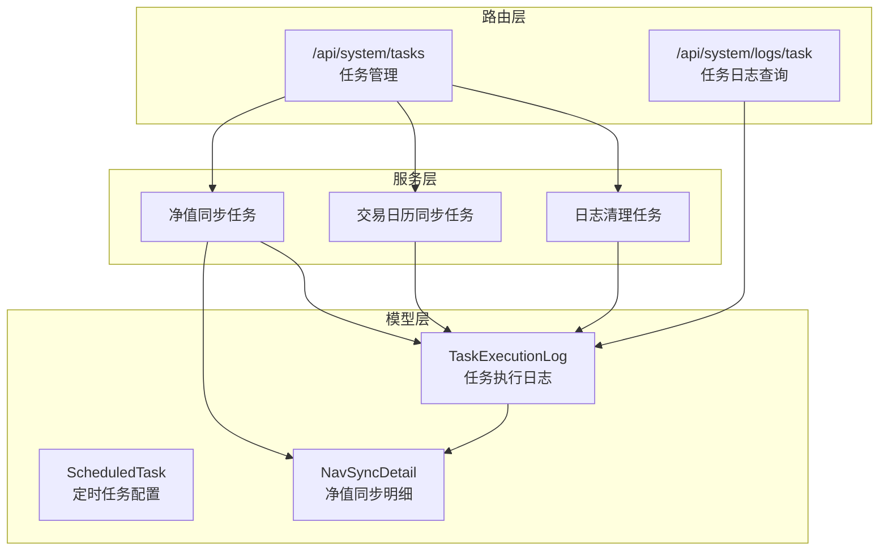
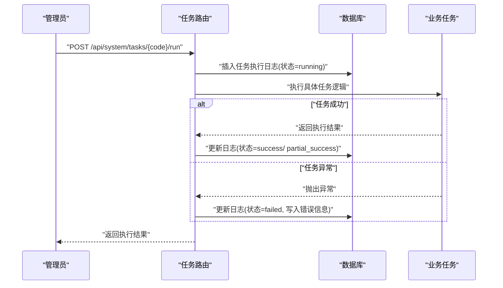
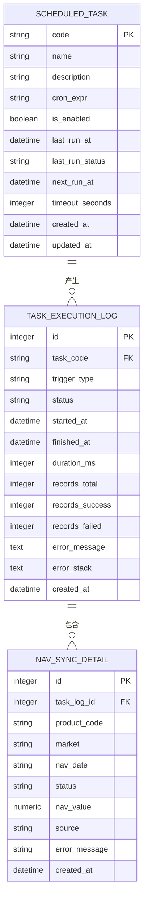
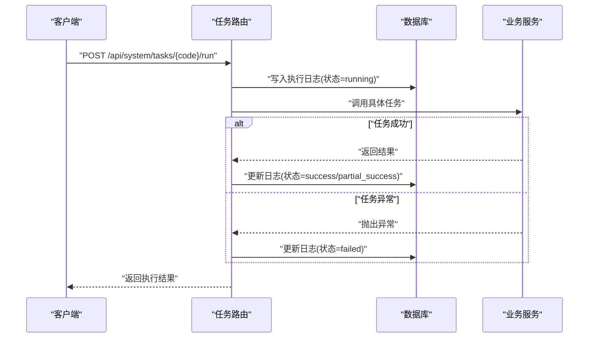
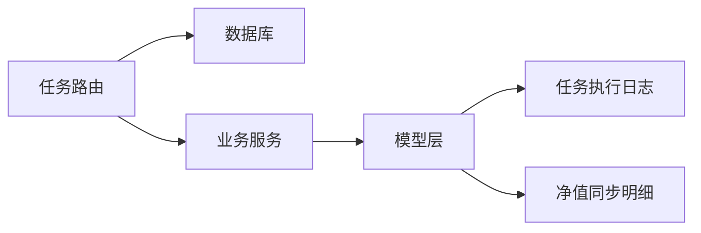

# 任务执行日志

<cite>
**本文引用的文件**
- [backend/app/models/task_execution_log.py](file://backend/app/models/task_execution_log.py)
- [backend/app/models/scheduled_task.py](file://backend/app/models/scheduled_task.py)
- [backend/app/models/nav_sync_detail.py](file://backend/app/models/nav_sync_detail.py)
- [backend/app/routers/tasks.py](file://backend/app/routers/tasks.py)
- [backend/app/schemas/task.py](file://backend/app/schemas/task.py)
- [backend/app/init_tasks.py](file://backend/app/init_tasks.py)
- [backend/app/routers/logs.py](file://backend/app/routers/logs.py)
- [Docs/07-日志系统设计.md](file://Docs/07-日志系统设计.md)
</cite>

## 目录
1. [简介](#简介)
2. [项目结构](#项目结构)
3. [核心组件](#核心组件)
4. [架构总览](#架构总览)
5. [详细组件分析](#详细组件分析)
6. [依赖分析](#依赖分析)
7. [性能考量](#性能考量)
8. [故障排查指南](#故障排查指南)
9. [结论](#结论)
10. [附录](#附录)

## 简介
本文件面向 InvestRing 的“任务执行日志”子系统，系统性阐述任务执行日志表的字段设计、执行状态记录与性能指标采集；文档化定时任务的执行监控、失败重试与超时处理策略；解释任务日志的查询接口、执行时间分析与资源使用统计；并提供任务健康检查、执行效率优化与异常任务处理流程，以及调度监控、性能瓶颈分析与系统负载评估建议。

## 项目结构
任务执行日志相关能力由以下模块协同实现：
- 数据模型层：任务执行日志表、定时任务配置表、净值同步明细表
- 路由层：任务管理与日志查询接口
- 服务层：具体业务任务（净值同步、交易日历同步、日志清理）的执行逻辑
- 文档与设计：日志系统设计文档，明确表结构、状态定义、API 规范与清理策略

图表来源
- [backend/app/models/scheduled_task.py:1-19](file://backend/app/models/scheduled_task.py#L1-L19)
- [backend/app/models/task_execution_log.py:1-21](file://backend/app/models/task_execution_log.py#L1-L21)
- [backend/app/models/nav_sync_detail.py:1-18](file://backend/app/models/nav_sync_detail.py#L1-L18)
- [backend/app/routers/tasks.py:1-323](file://backend/app/routers/tasks.py#L1-L323)
- [backend/app/routers/logs.py:1-56](file://backend/app/routers/logs.py#L1-L56)

章节来源
- [backend/app/models/scheduled_task.py:1-19](file://backend/app/models/scheduled_task.py#L1-L19)
- [backend/app/models/task_execution_log.py:1-21](file://backend/app/models/task_execution_log.py#L1-L21)
- [backend/app/models/nav_sync_detail.py:1-18](file://backend/app/models/nav_sync_detail.py#L1-L18)
- [backend/app/routers/tasks.py:1-323](file://backend/app/routers/tasks.py#L1-L323)
- [backend/app/routers/logs.py:1-56](file://backend/app/routers/logs.py#L1-L56)
- [Docs/07-日志系统设计.md:125-146](file://Docs/07-日志系统设计.md#L125-L146)

## 核心组件
- 任务执行日志表（task_execution_log）
  - 字段：任务标识、触发方式、状态、开始/结束时间、执行时长（毫秒）、总/成功/失败记录数、错误信息与堆栈、创建时间
  - 索引：按任务与开始时间排序，按状态与开始时间排序
  - 状态：running、success、failed、timeout
- 定时任务配置表（scheduled_task）
  - 字段：任务编码、名称、描述、Cron 表达式、启用状态、上次/下次执行时间、超时秒数、创建/更新时间
- 净值同步明细表（nav_sync_detail）
  - 字段：关联任务日志、产品代码、市场、净值日期、状态、净值、来源、错误信息、创建时间
- 任务路由与服务
  - 提供任务列表、手动触发、启用/禁用、日志查询等接口
  - 具体任务包括：净值同步、交易日历同步、日志清理
- 日志清理策略
  - 任务执行日志保留 90 天，按周清理

章节来源
- [backend/app/models/task_execution_log.py:1-21](file://backend/app/models/task_execution_log.py#L1-L21)
- [backend/app/models/scheduled_task.py:1-19](file://backend/app/models/scheduled_task.py#L1-L19)
- [backend/app/models/nav_sync_detail.py:1-18](file://backend/app/models/nav_sync_detail.py#L1-L18)
- [backend/app/routers/tasks.py:19-68](file://backend/app/routers/tasks.py#L19-L68)
- [Docs/07-日志系统设计.md:125-146](file://Docs/07-日志系统设计.md#L125-L146)

## 架构总览
任务执行日志系统围绕“模型-路由-服务”的分层设计展开，结合数据库索引与清理策略，形成可观测、可追溯、可维护的任务执行闭环。

图表来源
- [backend/app/routers/tasks.py:88-268](file://backend/app/routers/tasks.py#L88-L268)
- [backend/app/models/task_execution_log.py:1-21](file://backend/app/models/task_execution_log.py#L1-L21)

章节来源
- [backend/app/routers/tasks.py:88-268](file://backend/app/routers/tasks.py#L88-L268)
- [backend/app/models/task_execution_log.py:1-21](file://backend/app/models/task_execution_log.py#L1-L21)

## 详细组件分析

### 任务执行日志表（task_execution_log）
- 字段设计与用途
  - 任务标识：task_code，用于区分不同任务
  - 触发方式：trigger_type，manual/schedule
  - 执行状态：status，running/success/failed/timeout
  - 时间维度：started_at、finished_at、duration_ms
  - 记录统计：records_total、records_success、records_failed
  - 错误信息：error_message、error_stack
  - 时间戳：created_at
- 索引与查询
  - 按任务与开始时间倒序，便于查看最新执行
  - 按状态与开始时间倒序，便于筛选失败/进行中任务
- 性能指标采集
  - 通过 started_at/finished_at 计算 duration_ms
  - 通过 records_* 字段统计处理吞吐与成功率

图表来源
- [backend/app/models/scheduled_task.py:1-19](file://backend/app/models/scheduled_task.py#L1-L19)
- [backend/app/models/task_execution_log.py:1-21](file://backend/app/models/task_execution_log.py#L1-L21)
- [backend/app/models/nav_sync_detail.py:1-18](file://backend/app/models/nav_sync_detail.py#L1-L18)

章节来源
- [backend/app/models/task_execution_log.py:1-21](file://backend/app/models/task_execution_log.py#L1-L21)
- [Docs/07-日志系统设计.md:125-146](file://Docs/07-日志系统设计.md#L125-L146)

### 定时任务配置表（scheduled_task）
- 字段设计
  - 任务编码、名称、描述、Cron 表达式、启用状态
  - 上次/下次执行时间、超时秒数、创建/更新时间
- 初始化
  - 启动时初始化三个核心任务：净值同步、交易日历同步、日志清理

章节来源
- [backend/app/models/scheduled_task.py:1-19](file://backend/app/models/scheduled_task.py#L1-L19)
- [backend/app/init_tasks.py:1-45](file://backend/app/init_tasks.py#L1-L45)

### 净值同步明细表（nav_sync_detail）
- 字段设计
  - 关联任务日志、产品代码、市场、净值日期、状态、净值、来源、错误信息、创建时间
- 作用
  - 记录每只产品的同步结果，支持按产品维度的失败追踪与重试

章节来源
- [backend/app/models/nav_sync_detail.py:1-18](file://backend/app/models/nav_sync_detail.py#L1-L18)

### 任务路由与服务
- 任务管理接口
  - 列表、手动触发、启用/禁用
- 日志查询接口
  - 支持按任务编码、状态、时间范围分页查询
- 具体任务实现
  - 净值同步：遍历产品，逐个同步价格数据，记录明细，聚合统计
  - 交易日历同步：按年同步交易日历
  - 日志清理：清理过期日志（含任务执行日志）

图表来源
- [backend/app/routers/tasks.py:88-268](file://backend/app/routers/tasks.py#L88-L268)

章节来源
- [backend/app/routers/tasks.py:70-323](file://backend/app/routers/tasks.py#L70-L323)
- [backend/app/routers/logs.py:1-56](file://backend/app/routers/logs.py#L1-L56)

### 查询接口与执行时间分析
- 任务日志查询
  - 支持按任务编码过滤，按创建时间倒序分页
- 执行时间分析
  - 使用 duration_ms 字段进行平均时长、P95/P99 分析
  - 结合 started_at/finished_at 进行跨日/跨周趋势分析
- 资源使用统计
  - records_total/records_success/records_failed 反映吞吐与成功率
  - 失败率与错误堆栈辅助定位瓶颈

章节来源
- [backend/app/routers/tasks.py:300-323](file://backend/app/routers/tasks.py#L300-L323)
- [backend/app/schemas/task.py:23-40](file://backend/app/schemas/task.py#L23-L40)

### 失败重试与超时处理
- 失败重试
  - 净值同步明细记录失败产品，支持后续重试
- 超时处理
  - 定时任务配置包含 timeout_seconds 字段
  - 当前实现未在路由层显式使用该字段，可在调度层扩展超时检测与状态更新

章节来源
- [backend/app/models/scheduled_task.py](file://backend/app/models/scheduled_task.py#L16)
- [backend/app/routers/tasks.py:127-237](file://backend/app/routers/tasks.py#L127-L237)

### 日志清理与保留策略
- 保留周期
  - 任务执行日志：90 天
- 清理策略
  - 按周执行清理任务，删除超过保留期的日志

章节来源
- [backend/app/routers/tasks.py:19-68](file://backend/app/routers/tasks.py#L19-L68)
- [Docs/07-日志系统设计.md:430-449](file://Docs/07-日志系统设计.md#L430-L449)

## 依赖分析
- 组件耦合
  - 任务路由依赖数据库会话与业务服务
  - 任务执行日志与净值同步明细存在外键关联
- 外部依赖
  - APScheduler（调度器）用于定时任务执行（设计文档中定义）
- 潜在风险
  - SQLite 并发写入限制导致串行执行，需避免长时间阻塞

图表来源
- [backend/app/routers/tasks.py:1-323](file://backend/app/routers/tasks.py#L1-L323)
- [backend/app/models/task_execution_log.py:1-21](file://backend/app/models/task_execution_log.py#L1-L21)
- [backend/app/models/nav_sync_detail.py:1-18](file://backend/app/models/nav_sync_detail.py#L1-L18)

章节来源
- [backend/app/routers/tasks.py:1-323](file://backend/app/routers/tasks.py#L1-L323)
- [Docs/07-日志系统设计.md:353-396](file://Docs/07-日志系统设计.md#L353-L396)

## 性能考量
- 执行时长与吞吐
  - 使用 duration_ms 与 records_* 字段进行性能基线建立与回归分析
- 查询性能
  - 为 task_execution_log 建立按任务与状态的复合索引，提升筛选效率
- 调度并发
  - 采用单线程执行器避免 SQLite 并发写入冲突
- 清理策略
  - 定期清理过期日志，控制表规模，维持查询与写入性能

章节来源
- [Docs/07-日志系统设计.md:380-396](file://Docs/07-日志系统设计.md#L380-L396)
- [backend/app/routers/tasks.py:19-68](file://backend/app/routers/tasks.py#L19-L68)

## 故障排查指南
- 常见问题定位
  - 通过 status=failed 的任务日志定位失败任务
  - 查看 error_message 与 error_stack 获取异常上下文
- 重试流程
  - 对于部分成功（partial_success）的任务，基于 nav_sync_detail 中失败的产品进行重试
- 超时处理
  - 在调度层增加超时检测，将日志状态标记为 timeout 并记录错误信息
- 健康检查
  - 定期检查最近一次执行时间与状态，对异常任务进行告警与人工干预

章节来源
- [backend/app/routers/tasks.py:127-268](file://backend/app/routers/tasks.py#L127-L268)
- [backend/app/models/task_execution_log.py:1-21](file://backend/app/models/task_execution_log.py#L1-L21)

## 结论
任务执行日志系统以清晰的表结构、完善的字段设计与严格的清理策略为基础，配合路由层的查询与管理接口，实现了对定时任务的可观测与可追溯。建议在调度层引入超时检测与自动重试机制，并持续优化索引与清理策略，以进一步提升系统稳定性与性能表现。

## 附录
- API 摘要
  - 任务管理：获取任务列表、手动触发、启用/禁用
  - 日志查询：按任务编码、状态、时间范围分页查询
- 设计参考
  - 日志系统设计文档明确了表结构、状态定义、API 规范与清理策略

章节来源
- [backend/app/routers/tasks.py:70-323](file://backend/app/routers/tasks.py#L70-L323)
- [backend/app/routers/logs.py:1-56](file://backend/app/routers/logs.py#L1-L56)
- [Docs/07-日志系统设计.md:229-308](file://Docs/07-日志系统设计.md#L229-L308)