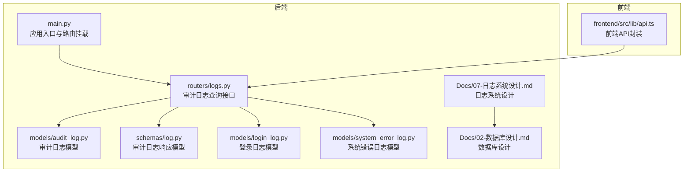
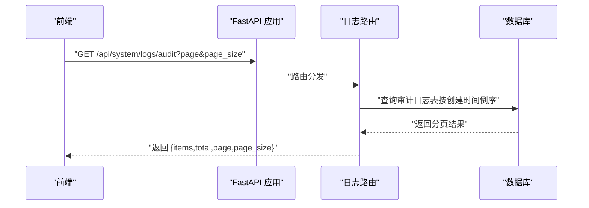
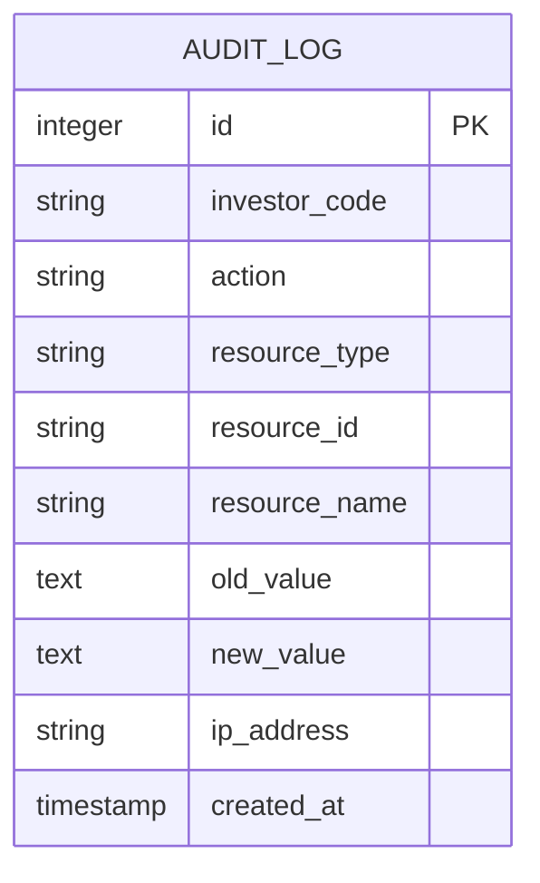
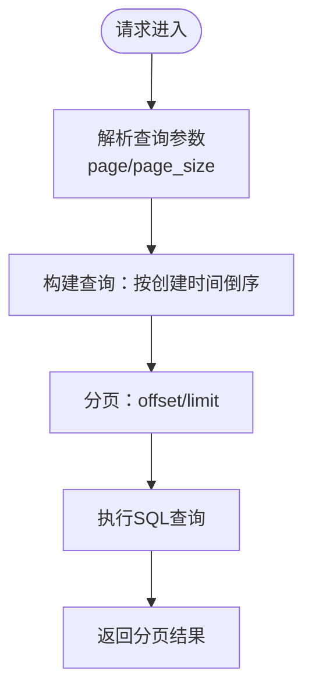
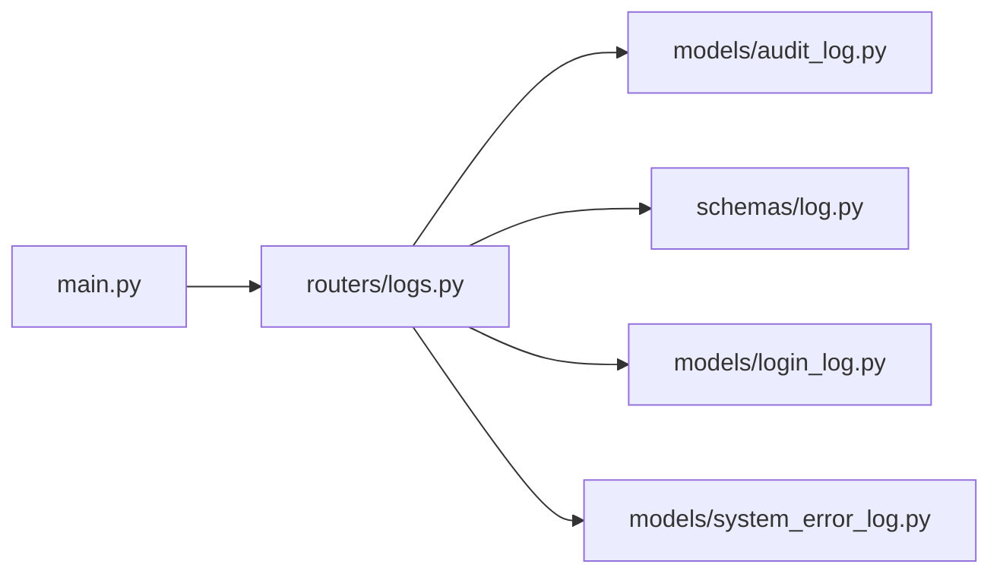

# 审计日志

<cite>
**本文引用的文件**
- [audit_log.py](file://backend/app/models/audit_log.py)
- [log.py](file://backend/app/schemas/log.py)
- [logs.py](file://backend/app/routers/logs.py)
- [login_log.py](file://backend/app/models/login_log.py)
- [system_error_log.py](file://backend/app/models/system_error_log.py)
- [07-日志系统设计.md](file://Docs/07-日志系统设计.md)
- [02-数据库设计.md](file://Docs/02-数据库设计.md)
- [api.ts](file://frontend/src/lib/api.ts)
- [main.py](file://backend/app/main.py)
</cite>

## 目录
1. [简介](#简介)
2. [项目结构](#项目结构)
3. [核心组件](#核心组件)
4. [架构总览](#架构总览)
5. [详细组件分析](#详细组件分析)
6. [依赖分析](#依赖分析)
7. [性能考虑](#性能考虑)
8. [故障排查指南](#故障排查指南)
9. [结论](#结论)
10. [附录](#附录)

## 简介
本文件系统化阐述 InvestRing 的审计日志体系，覆盖审计日志表的字段设计、数据结构与存储策略，明确触发条件、记录规则与查询接口，并给出审计范围（操作类型与资源类型）、查询示例、过滤条件与排序方式，以及分析方法、合规性检查与安全审计流程，最后说明与其他系统的集成与数据同步机制。

## 项目结构
审计日志相关的核心位置如下：
- 后端模型层：审计日志模型定义与数据库表结构
- 后端路由层：审计日志查询接口
- 后端序列化层：审计日志响应模型
- 文档：数据库与日志系统设计文档
- 前端：审计日志查询接口封装

**图表来源**
- [logs.py:1-56](file://backend/app/routers/logs.py#L1-L56)
- [audit_log.py:1-18](file://backend/app/models/audit_log.py#L1-L18)
- [log.py:20-34](file://backend/app/schemas/log.py#L20-L34)
- [login_log.py:1-16](file://backend/app/models/login_log.py#L1-L16)
- [system_error_log.py:1-19](file://backend/app/models/system_error_log.py#L1-L19)
- [07-日志系统设计.md:63-82](file://Docs/07-日志系统设计.md#L63-L82)
- [02-数据库设计.md:677-692](file://Docs/02-数据库设计.md#L677-L692)
- [main.py:45](file://backend/app/main.py#L45)
- [api.ts:403-404](file://frontend/src/lib/api.ts#L403-L404)

**章节来源**
- [logs.py:1-56](file://backend/app/routers/logs.py#L1-L56)
- [audit_log.py:1-18](file://backend/app/models/audit_log.py#L1-L18)
- [log.py:20-34](file://backend/app/schemas/log.py#L20-L34)
- [login_log.py:1-16](file://backend/app/models/login_log.py#L1-L16)
- [system_error_log.py:1-19](file://backend/app/models/system_error_log.py#L1-L19)
- [07-日志系统设计.md:63-82](file://Docs/07-日志系统设计.md#L63-L82)
- [02-数据库设计.md:677-692](file://Docs/02-数据库设计.md#L677-L692)
- [main.py:45](file://backend/app/main.py#L45)
- [api.ts:403-404](file://frontend/src/lib/api.ts#L403-L404)

## 核心组件
- 审计日志模型：定义审计日志表的字段与默认值
- 审计日志响应模型：统一输出格式
- 审计日志查询接口：提供分页查询能力
- 登录日志模型与系统错误日志模型：作为日志体系的配套
- 文档：明确资源类型、操作类型、索引与清理策略

关键要点：
- 审计日志表字段包含：主键、投资人编码、动作类型、资源类型、资源标识、资源名称、旧值、新值、IP地址、创建时间
- 查询接口支持分页与按创建时间倒序
- 响应模型与数据库模型一一对应，便于前后端交互

**章节来源**
- [audit_log.py:5-17](file://backend/app/models/audit_log.py#L5-L17)
- [log.py:20-34](file://backend/app/schemas/log.py#L20-L34)
- [logs.py:36-44](file://backend/app/routers/logs.py#L36-L44)
- [login_log.py:5-15](file://backend/app/models/login_log.py#L5-L15)
- [system_error_log.py:5-18](file://backend/app/models/system_error_log.py#L5-L18)

## 架构总览
审计日志在系统中的位置与交互如下：

**图表来源**
- [main.py:45](file://backend/app/main.py#L45)
- [logs.py:36-44](file://backend/app/routers/logs.py#L36-L44)
- [api.ts:403-404](file://frontend/src/lib/api.ts#L403-L404)

## 详细组件分析

### 审计日志表与模型
- 表结构与字段
  - 主键自增整数
  - 投资人编码、动作类型、资源类型为必填
  - 资源标识与名称用于定位具体资源
  - 旧值与新值以文本形式保存，便于追溯变更
  - IP地址与创建时间用于定位操作上下文
- 索引与约束
  - 文档定义了针对投资人与资源类型的索引，有助于高效查询
  - 资源类型枚举明确了审计范围

**图表来源**
- [07-日志系统设计.md:63-82](file://Docs/07-日志系统设计.md#L63-L82)
- [02-数据库设计.md:677-692](file://Docs/02-数据库设计.md#L677-L692)
- [audit_log.py:5-17](file://backend/app/models/audit_log.py#L5-L17)

**章节来源**
- [audit_log.py:5-17](file://backend/app/models/audit_log.py#L5-L17)
- [07-日志系统设计.md:63-82](file://Docs/07-日志系统设计.md#L63-L82)
- [02-数据库设计.md:677-692](file://Docs/02-数据库设计.md#L677-L692)

### 审计日志响应模型
- 字段与类型与数据库模型保持一致
- 支持可选字段，便于兼容不同场景

**章节来源**
- [log.py:20-34](file://backend/app/schemas/log.py#L20-L34)

### 审计日志查询接口
- 路由：GET /api/system/logs/audit
- 参数：page、page_size（默认第1页，每页20条）
- 返回：分页对象，包含 items、total、page、page_size
- 排序：按创建时间倒序

**图表来源**
- [logs.py:14-22](file://backend/app/routers/logs.py#L14-L22)
- [logs.py:36-44](file://backend/app/routers/logs.py#L36-L44)

**章节来源**
- [logs.py:14-22](file://backend/app/routers/logs.py#L14-L22)
- [logs.py:36-44](file://backend/app/routers/logs.py#L36-L44)

### 审计范围与触发条件
- 审计范围（资源类型与操作类型）
  - 资源类型：投资人、投资组合、申购赎回、调仓交易、份额变动事件、产品、平台、系统配置
  - 操作类型：创建、更新、删除
- 触发条件
  - 在涉及上述资源的创建、修改、删除等关键业务操作时，应记录审计日志
  - 记录内容应包含旧值与新值（JSON），以便回溯变更

**章节来源**
- [07-日志系统设计.md:84-96](file://Docs/07-日志系统设计.md#L84-L96)
- [07-日志系统设计.md:322-343](file://Docs/07-日志系统设计.md#L322-L343)

### 查询接口与过滤条件
- 接口：GET /api/system/logs/audit
- 当前实现支持的过滤条件
  - 分页：page、page_size
  - 排序：created_at 倒序
- 建议扩展（基于文档与表结构）
  - 投资人编码：investor_code
  - 动作类型：action
  - 资源类型：resource_type
  - 时间范围：created_at 起止
  - 资源标识：resource_id
  - 资源名称：resource_name
- 前端调用
  - 前端通过 api.ts 封装的 auditLogs 方法调用 /api/system/logs/audit

**章节来源**
- [logs.py:36-44](file://backend/app/routers/logs.py#L36-L44)
- [07-日志系统设计.md:240-245](file://Docs/07-日志系统设计.md#L240-L245)
- [api.ts:403-404](file://frontend/src/lib/api.ts#L403-L404)

### 数据结构与存储策略
- JSON 存储
  - 旧值与新值以文本形式存储，便于灵活记录任意结构的变更
- 索引策略
  - 针对投资人与资源类型建立索引，提升查询效率
- 清理策略
  - 审计日志保留周期为一年，定期清理过期数据

**章节来源**
- [07-日志系统设计.md:79-81](file://Docs/07-日志系统设计.md#L79-L81)
- [07-日志系统设计.md:430-441](file://Docs/07-日志系统设计.md#L430-L441)

### 安全与合规
- 敏感字段脱敏
  - 记录审计日志时，应对敏感字段进行脱敏处理（如密码哈希、手机号、身份证）
- 合规要求
  - 满足金融系统审计需求，提供完整的操作轨迹与证据链

**章节来源**
- [07-日志系统设计.md:344-350](file://Docs/07-日志系统设计.md#L344-L350)

### 分析方法与安全审计流程
- 分析方法
  - 基于资源类型与动作类型聚合统计
  - 结合时间范围与投资人维度进行交叉分析
  - 对异常操作（如批量删除、高频更新）进行预警
- 安全审计流程
  - 定期导出审计日志，进行离线分析
  - 建立审计报告模板，覆盖合规与风控要求
  - 对违规操作进行溯源与处置

**章节来源**
- [07-日志系统设计.md:9-18](file://Docs/07-日志系统设计.md#L9-L18)

### 与其他系统的集成与数据同步
- 前后端集成
  - 前端通过 api.ts 的 auditLogs 方法调用后端接口
  - 后端路由挂载在 /api/system/logs 下
- 数据同步
  - 审计日志属于本地数据库表，无需外部系统同步
  - 定时任务可配合日志清理策略，保障数据健康

**章节来源**
- [api.ts:403-404](file://frontend/src/lib/api.ts#L403-L404)
- [main.py:45](file://backend/app/main.py#L45)
- [07-日志系统设计.md:443-449](file://Docs/07-日志系统设计.md#L443-L449)

## 依赖分析
- 组件耦合
  - 路由依赖模型与响应模型
  - 响应模型依赖数据库模型
  - 应用入口挂载路由
- 外部依赖
  - SQLAlchemy ORM
  - FastAPI 路由与依赖注入

**图表来源**
- [logs.py:1-9](file://backend/app/routers/logs.py#L1-L9)
- [audit_log.py:1-3](file://backend/app/models/audit_log.py#L1-L3)
- [log.py:1-3](file://backend/app/schemas/log.py#L1-L3)
- [login_log.py:1-3](file://backend/app/models/login_log.py#L1-L3)
- [system_error_log.py:1-3](file://backend/app/models/system_error_log.py#L1-L3)
- [main.py:45](file://backend/app/main.py#L45)

**章节来源**
- [logs.py:1-9](file://backend/app/routers/logs.py#L1-L9)
- [audit_log.py:1-3](file://backend/app/models/audit_log.py#L1-L3)
- [log.py:1-3](file://backend/app/schemas/log.py#L1-L3)
- [login_log.py:1-3](file://backend/app/models/login_log.py#L1-L3)
- [system_error_log.py:1-3](file://backend/app/models/system_error_log.py#L1-L3)
- [main.py:45](file://backend/app/main.py#L45)

## 性能考虑
- 查询性能
  - 建议在投资人与资源类型上建立索引，以支持高频过滤
  - 分页查询避免一次性加载大量数据
- 存储与清理
  - 审计日志保留一年，建议结合定时任务定期清理
- 并发与一致性
  - SQLite 在 WAL 模式下支持读写并发，但审计日志写入量相对较小，影响有限

**章节来源**
- [07-日志系统设计.md:79-81](file://Docs/07-日志系统设计.md#L79-L81)
- [07-日志系统设计.md:430-441](file://Docs/07-日志系统设计.md#L430-L441)
- [02-数据库设计.md:624-656](file://Docs/02-数据库设计.md#L624-L656)

## 故障排查指南
- 常见问题
  - 无法查询审计日志：确认路由挂载与权限校验
  - 查询结果为空：检查过滤条件与时间范围
  - 响应字段不匹配：核对响应模型与数据库模型
- 排查步骤
  - 检查后端日志与数据库连接
  - 核对索引是否存在，必要时重建
  - 验证前端调用路径与参数

**章节来源**
- [logs.py:36-44](file://backend/app/routers/logs.py#L36-L44)
- [log.py:20-34](file://backend/app/schemas/log.py#L20-L34)

## 结论
InvestRing 的审计日志体系以清晰的表结构、简洁的查询接口与完善的日志设计文档为基础，能够有效支撑安全审计、问题排查与合规要求。建议在现有基础上扩展查询过滤条件，并持续完善清理与分析流程，以满足长期运营与监管需求。

## 附录
- 资源类型与操作类型对照
  - 资源类型：投资人、投资组合、申购赎回、调仓交易、份额变动事件、产品、平台、系统配置
  - 操作类型：创建、更新、删除
- 建议的查询参数（扩展）
  - 投资人编码、动作类型、资源类型、起止时间、资源标识、资源名称

**章节来源**
- [07-日志系统设计.md:84-96](file://Docs/07-日志系统设计.md#L84-L96)
- [07-日志系统设计.md:322-343](file://Docs/07-日志系统设计.md#L322-L343)