# 日志与监控

<cite>
**本文引用的文件**
- [日志系统设计.md](file://Docs/07-日志系统设计.md)
- [audit_log.py](file://backend/app/models/audit_log.py)
- [login_log.py](file://backend/app/models/login_log.py)
- [system_error_log.py](file://backend/app/models/system_error_log.py)
- [task_execution_log.py](file://backend/app/models/task_execution_log.py)
- [nav_sync_detail.py](file://backend/app/models/nav_sync_detail.py)
- [scheduled_task.py](file://backend/app/models/scheduled_task.py)
- [logs.py](file://backend/app/routers/logs.py)
- [tasks.py](file://backend/app/routers/tasks.py)
- [notifications.py](file://backend/app/routers/notifications.py)
- [log.py](file://backend/app/schemas/log.py)
- [main.py](file://backend/app/main.py)
- [config.py](file://backend/app/config.py)
- [init_tasks.py](file://backend/app/init_tasks.py)
- [notification.py](file://backend/app/models/notification.py)
</cite>

## 目录
1. [简介](#简介)
2. [项目结构](#项目结构)
3. [核心组件](#核心组件)
4. [架构总览](#架构总览)
5. [详细组件分析](#详细组件分析)
6. [依赖关系分析](#依赖关系分析)
7. [性能考量](#性能考量)
8. [故障排查指南](#故障排查指南)
9. [结论](#结论)
10. [附录](#附录)

## 简介
本文件面向 InvestRing 的日志与监控体系，系统性阐述7张日志/监控相关表的设计目的、字段语义与典型使用场景；文档化审计日志、登录日志、系统错误日志与任务执行日志的记录策略；明确日志级别、日志格式与日志轮转机制；给出日志查询、分析与监控告警的实现思路；并提供日志系统架构图、数据流向与存储策略，以及日志管理工具、查询接口与分析报告建议。同时覆盖日志安全、隐私保护与合规要求，为运维与开发者提供完整参考。

## 项目结构
- 文档层：通过设计文档集中描述日志类型、数据库表结构、API 接口与清理策略。
- 后端模型层：以 SQLAlchemy 模型映射数据库表，定义字段与约束。
- 后端路由层：提供日志查询、任务管理与通知管理的 REST 接口。
- 应用入口：注册路由、初始化数据库与定时任务。

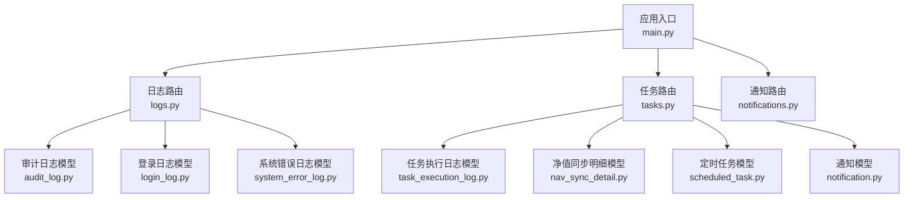

图表来源
- [main.py:32-48](file://backend/app/main.py#L32-L48)
- [logs.py:1-56](file://backend/app/routers/logs.py#L1-L56)
- [tasks.py:1-323](file://backend/app/routers/tasks.py#L1-L323)
- [notifications.py:1-74](file://backend/app/routers/notifications.py#L1-L74)
- [audit_log.py:1-18](file://backend/app/models/audit_log.py#L1-L18)
- [login_log.py:1-16](file://backend/app/models/login_log.py#L1-L16)
- [system_error_log.py:1-19](file://backend/app/models/system_error_log.py#L1-L19)
- [task_execution_log.py:1-21](file://backend/app/models/task_execution_log.py#L1-L21)
- [nav_sync_detail.py:1-18](file://backend/app/models/nav_sync_detail.py#L1-L18)
- [scheduled_task.py:1-19](file://backend/app/models/scheduled_task.py#L1-L19)
- [notification.py:1-19](file://backend/app/models/notification.py#L1-L19)

章节来源
- [main.py:32-48](file://backend/app/main.py#L32-L48)

## 核心组件
- 登录日志表：记录用户登录/登出与登录失败事件，支持按用户与状态筛选。
- 操作审计日志表：记录关键业务对象的增删改事件，支持按资源类型与时间排序。
- 系统错误日志表：记录异常、API 错误与业务错误，便于问题定位与统计。
- 任务执行日志表：记录定时任务的执行状态、耗时与结果统计。
- 净值同步明细表：记录每日净值同步的逐产品明细，支持成功/失败/跳过的细粒度追踪。
- 定时任务配置表：维护任务代码、Cron 表达式、启用状态与下次执行时间。
- 通知表：记录系统通知的发送、阅读状态与渠道。

章节来源
- [日志系统设计.md:35-202](file://Docs/07-日志系统设计.md#L35-L202)
- [audit_log.py:5-18](file://backend/app/models/audit_log.py#L5-L18)
- [login_log.py:5-16](file://backend/app/models/login_log.py#L5-L16)
- [system_error_log.py:5-19](file://backend/app/models/system_error_log.py#L5-L19)
- [task_execution_log.py:5-21](file://backend/app/models/task_execution_log.py#L5-L21)
- [nav_sync_detail.py:5-18](file://backend/app/models/nav_sync_detail.py#L5-L18)
- [scheduled_task.py:5-19](file://backend/app/models/scheduled_task.py#L5-L19)
- [notification.py:5-19](file://backend/app/models/notification.py#L5-L19)

## 架构总览
日志与监控系统由“数据采集—持久化—查询—清理—告警”构成闭环。后端通过路由暴露查询接口，模型层映射数据库表，定时任务负责执行与清理，前端通过管理页面进行可视化与操作。

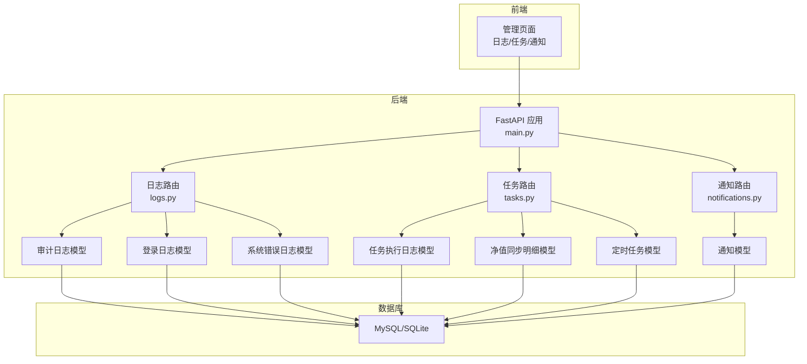

图表来源
- [main.py:32-48](file://backend/app/main.py#L32-L48)
- [logs.py:1-56](file://backend/app/routers/logs.py#L1-L56)
- [tasks.py:1-323](file://backend/app/routers/tasks.py#L1-L323)
- [notifications.py:1-74](file://backend/app/routers/notifications.py#L1-L74)
- [audit_log.py:5-18](file://backend/app/models/audit_log.py#L5-L18)
- [login_log.py:5-16](file://backend/app/models/login_log.py#L5-L16)
- [system_error_log.py:5-19](file://backend/app/models/system_error_log.py#L5-L19)
- [task_execution_log.py:5-21](file://backend/app/models/task_execution_log.py#L5-L21)
- [nav_sync_detail.py:5-18](file://backend/app/models/nav_sync_detail.py#L5-L18)
- [scheduled_task.py:5-19](file://backend/app/models/scheduled_task.py#L5-L19)
- [notification.py:5-19](file://backend/app/models/notification.py#L5-L19)

## 详细组件分析

### 登录日志表（login_log）
- 设计目的：记录用户登录/登出与登录失败事件，支撑安全审计与风控。
- 关键字段与含义：用户标识、动作类型（登录/登出/失败）、状态（成功/失败）、失败原因、IP、UA 等。
- 使用场景：登录异常检测、账户安全分析、合规审计。
- 查询策略：按用户与状态过滤，按时间倒序分页展示。

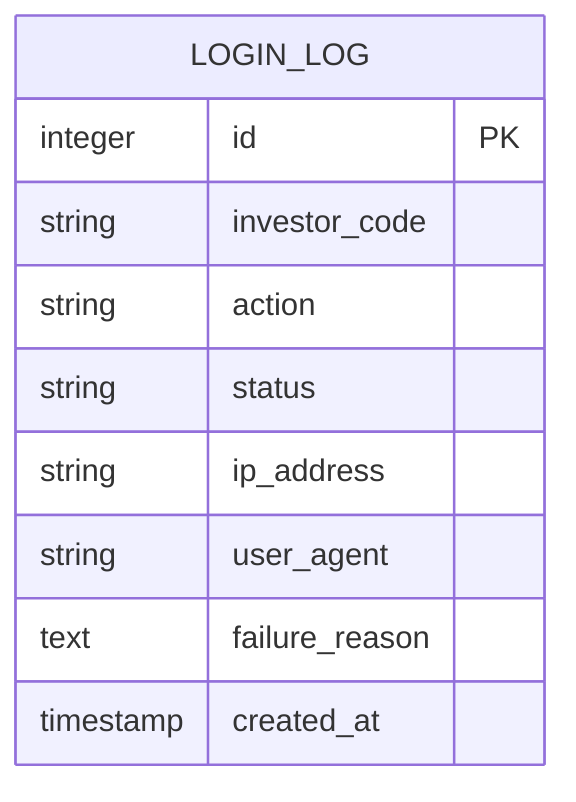

图表来源
- [login_log.py:5-16](file://backend/app/models/login_log.py#L5-L16)
- [日志系统设计.md:35-51](file://Docs/07-日志系统设计.md#L35-L51)

章节来源
- [login_log.py:5-16](file://backend/app/models/login_log.py#L5-L16)
- [日志系统设计.md:35-51](file://Docs/07-日志系统设计.md#L35-L51)

### 操作审计日志表（audit_log）
- 设计目的：对关键业务对象的增删改进行审计，支持变更追踪与回溯。
- 关键字段与含义：操作人、动作（create/update/delete）、资源类型/ID/名称、旧值/新值（JSON）、IP 等。
- 资源类型定义：投资人、投资组合、申购赎回、调仓交易、份额变动事件、产品、平台、系统配置等。
- 使用场景：合规审计、数据治理、问题定位。
- 查询策略：按资源类型/ID、时间倒序分页。

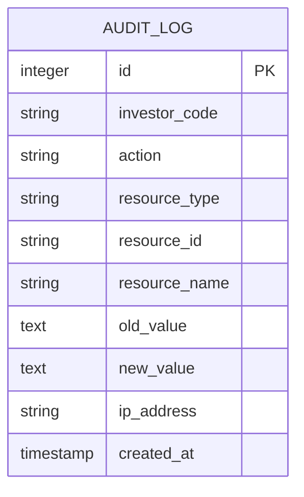

图表来源
- [audit_log.py:5-18](file://backend/app/models/audit_log.py#L5-L18)
- [日志系统设计.md:63-82](file://Docs/07-日志系统设计.md#L63-L82)

章节来源
- [audit_log.py:5-18](file://backend/app/models/audit_log.py#L5-L18)
- [日志系统设计.md:63-82](file://Docs/07-日志系统设计.md#L63-L82)

### 系统错误日志表（system_error_log）
- 设计目的：统一记录异常、API 错误与业务错误，便于问题定位与统计。
- 关键字段与含义：错误类型（异常/API/业务）、错误码、错误信息、堆栈、请求路径/方法/参数、用户/IP 等。
- 使用场景：故障排查、错误趋势分析、SLA 监控。
- 查询策略：按类型与时间倒序分页。

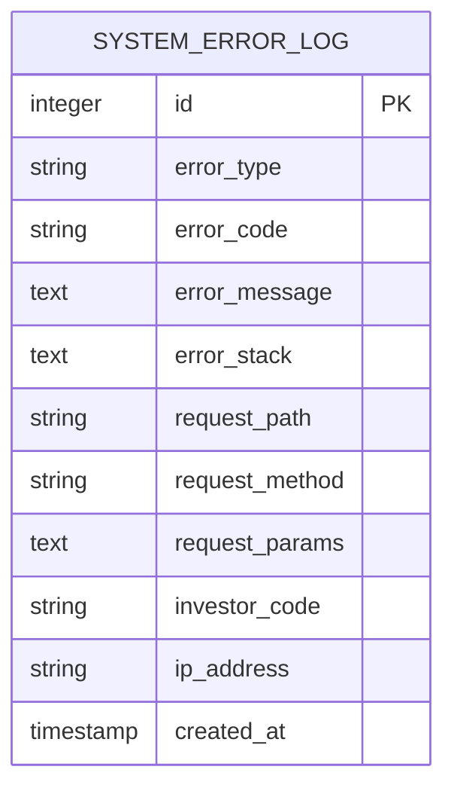

图表来源
- [system_error_log.py:5-19](file://backend/app/models/system_error_log.py#L5-L19)
- [日志系统设计.md:183-202](file://Docs/07-日志系统设计.md#L183-L202)

章节来源
- [system_error_log.py:5-19](file://backend/app/models/system_error_log.py#L5-L19)
- [日志系统设计.md:183-202](file://Docs/07-日志系统设计.md#L183-L202)

### 任务执行日志表（task_execution_log）
- 设计目的：记录定时任务的执行生命周期与结果，支撑任务可观测性。
- 关键字段与含义：任务代码、触发方式（计划/手动）、状态（运行中/成功/失败/超时）、开始/结束时间、耗时、记录总数/成功/失败、错误信息/堆栈。
- 使用场景：任务健康监控、性能分析、失败重试策略制定。
- 查询策略：按任务与状态过滤，按时间倒序分页。

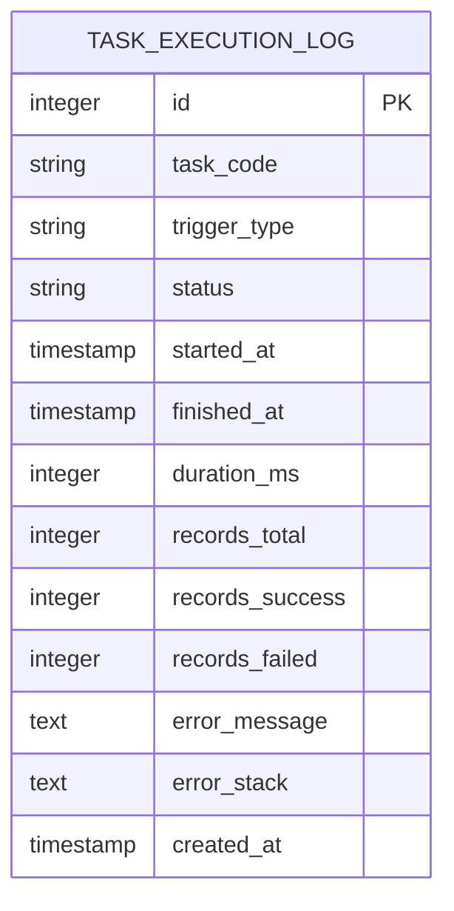

图表来源
- [task_execution_log.py:5-21](file://backend/app/models/task_execution_log.py#L5-L21)
- [日志系统设计.md:125-146](file://Docs/07-日志系统设计.md#L125-L146)

章节来源
- [task_execution_log.py:5-21](file://backend/app/models/task_execution_log.py#L5-L21)
- [日志系统设计.md:125-146](file://Docs/07-日志系统设计.md#L125-L146)

### 净值同步明细表（nav_sync_detail）
- 设计目的：对每日净值同步过程进行细粒度记录，支持逐产品问题定位。
- 关键字段与含义：关联任务日志、产品代码/市场/净值日期、状态（成功/失败/跳过）、净值、来源、错误信息。
- 使用场景：数据质量监控、同步异常诊断、报表核对。
- 查询策略：按产品/日期/状态过滤，按时间倒序分页。

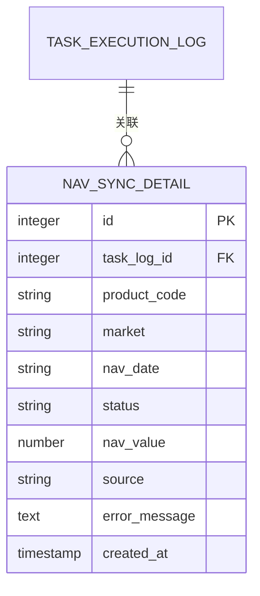

图表来源
- [nav_sync_detail.py:5-18](file://backend/app/models/nav_sync_detail.py#L5-L18)
- [日志系统设计.md:159-179](file://Docs/07-日志系统设计.md#L159-L179)

章节来源
- [nav_sync_detail.py:5-18](file://backend/app/models/nav_sync_detail.py#L5-L18)
- [日志系统设计.md:159-179](file://Docs/07-日志系统设计.md#L159-L179)

### 定时任务配置表（scheduled_task）
- 设计目的：集中管理任务元数据与调度信息，支撑任务启停与可视化管理。
- 关键字段与含义：任务代码、名称、描述、Cron 表达式、启用状态、上次/下次执行时间、超时阈值。
- 使用场景：任务编排、调度可视化、运维干预。
- 查询策略：分页列出任务，支持启用/禁用与手动触发。

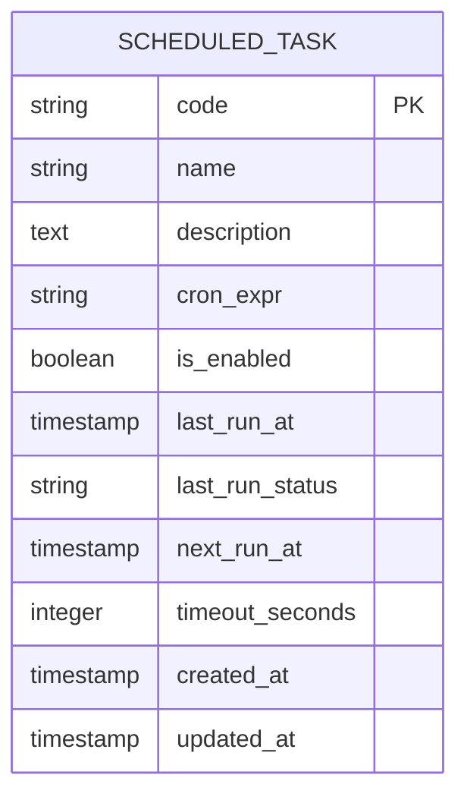

图表来源
- [scheduled_task.py:5-19](file://backend/app/models/scheduled_task.py#L5-L19)
- [日志系统设计.md:99-121](file://Docs/07-日志系统设计.md#L99-L121)

章节来源
- [scheduled_task.py:5-19](file://backend/app/models/scheduled_task.py#L5-L19)
- [日志系统设计.md:99-121](file://Docs/07-日志系统设计.md#L99-L121)

### 通知表（notification）
- 设计目的：记录系统通知的生命周期，支持站内/邮件等渠道与阅读状态管理。
- 关键字段与含义：类型/级别/渠道、接收人、状态、发送/阅读时间。
- 使用场景：运营公告、告警通知、合规提醒。
- 查询策略：按接收人与状态过滤，按时间倒序分页。

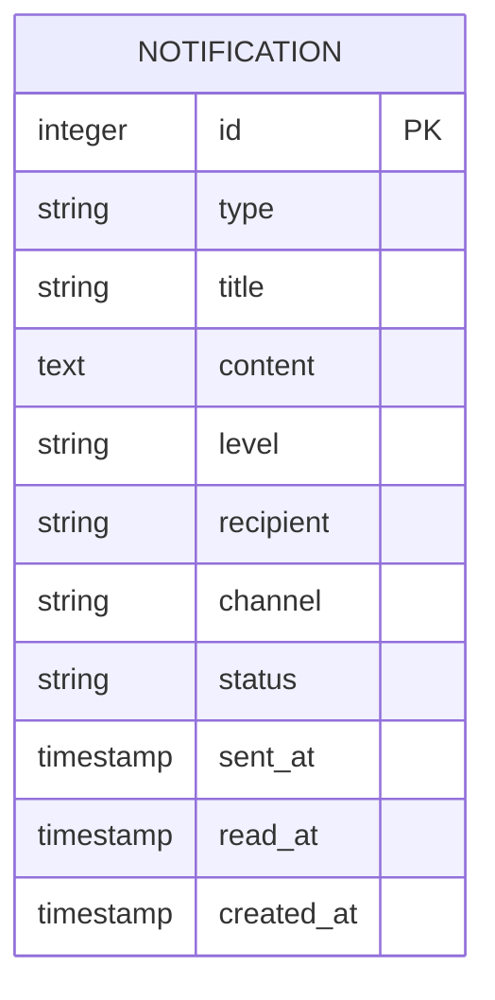

图表来源
- [notification.py:5-19](file://backend/app/models/notification.py#L5-L19)
- [日志系统设计.md:206-225](file://Docs/07-日志系统设计.md#L206-L225)

章节来源
- [notification.py:5-19](file://backend/app/models/notification.py#L5-L19)
- [日志系统设计.md:206-225](file://Docs/07-日志系统设计.md#L206-L225)

### 日志记录策略
- 审计日志：对关键业务对象的增删改均需记录，资源类型与动作需与设计一致。
- 登录日志：记录登录/登出与失败事件，失败原因需准确归类。
- 系统错误日志：捕获异常、API 错误与业务错误，保留请求上下文与堆栈。
- 任务执行日志：任务开始即创建“运行中”记录，结束后更新状态与统计。

章节来源
- [日志系统设计.md:311-351](file://Docs/07-日志系统设计.md#L311-L351)
- [tasks.py:101-109](file://backend/app/routers/tasks.py#L101-L109)
- [tasks.py:199-230](file://backend/app/routers/tasks.py#L199-L230)

### 日志级别、格式与轮转
- 日志级别：DEBUG/INFO/WARN/ERROR，用于区分事件严重程度。
- 日志格式：统一 JSON 或结构化文本，包含时间戳、级别、模块、消息、上下文字段（如用户、IP、请求路径）。
- 日志轮转：按大小/时间轮转，保留周期见清理策略。

章节来源
- [日志系统设计.md:313-321](file://Docs/07-日志系统设计.md#L313-L321)
- [日志系统设计.md:430-451](file://Docs/07-日志系统设计.md#L430-L451)

### 日志查询、分析与监控告警
- 查询接口：登录/审计/错误日志提供分页查询；任务管理提供任务列表与执行历史查询；通知提供分页与标记已读。
- 分析维度：按用户、资源、状态、时间聚合；计算成功率、失败率、耗时分布。
- 告警策略：错误率阈值、任务失败/超时阈值、登录失败异常波动、同步失败积压。

章节来源
- [logs.py:25-55](file://backend/app/routers/logs.py#L25-L55)
- [tasks.py:300-322](file://backend/app/routers/tasks.py#L300-L322)
- [notifications.py:12-73](file://backend/app/routers/notifications.py#L12-L73)
- [日志系统设计.md:229-308](file://Docs/07-日志系统设计.md#L229-L308)

### 日志系统架构与数据流
- 入口：应用启动时创建表与初始化任务。
- 数据采集：路由层在相应业务点位写入日志/错误/任务执行记录。
- 存储：SQLAlchemy 模型映射至 MySQL/SQLite。
- 查询：路由返回分页结果，前端可视化展示。
- 清理：定时任务按保留周期清理过期日志。

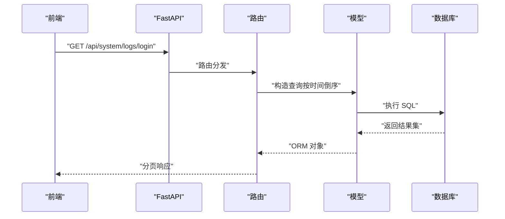

图表来源
- [main.py:45](file://backend/app/main.py#L45)
- [logs.py:25-33](file://backend/app/routers/logs.py#L25-L33)
- [login_log.py:5-16](file://backend/app/models/login_log.py#L5-L16)

章节来源
- [main.py:7-15](file://backend/app/main.py#L7-L15)
- [init_tasks.py:5-44](file://backend/app/init_tasks.py#L5-L44)

## 依赖关系分析
- 路由依赖：日志路由依赖审计/登录/错误模型；任务路由依赖任务执行日志、净值同步明细与定时任务模型；通知路由依赖通知模型。
- 数据依赖：净值同步明细外键关联任务执行日志。
- 应用依赖：应用入口注册所有路由，并在启动时初始化任务。

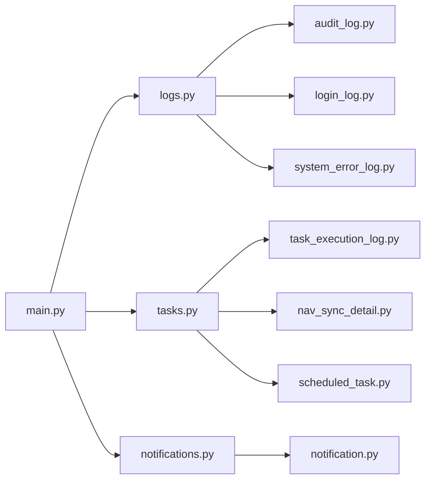

图表来源
- [logs.py:1-11](file://backend/app/routers/logs.py#L1-L11)
- [tasks.py:1-11](file://backend/app/routers/tasks.py#L1-L11)
- [notifications.py:1-7](file://backend/app/routers/notifications.py#L1-L7)
- [main.py:45-47](file://backend/app/main.py#L45-L47)

章节来源
- [logs.py:1-11](file://backend/app/routers/logs.py#L1-L11)
- [tasks.py:1-11](file://backend/app/routers/tasks.py#L1-L11)
- [notifications.py:1-7](file://backend/app/routers/notifications.py#L1-L7)
- [main.py:45-47](file://backend/app/main.py#L45-L47)

## 性能考量
- 查询性能：各表均建立常用过滤索引（如按用户、状态、时间），分页查询避免一次性加载大量数据。
- 写入并发：定时任务采用单线程执行器，避免 SQLite 并发写入冲突；必要时使用 WAL 模式提升读写并发。
- 清理策略：定期清理过期日志，控制表规模，降低查询与存储成本。

章节来源
- [日志系统设计.md:49-51](file://Docs/07-日志系统设计.md#L49-L51)
- [日志系统设计.md:79-81](file://Docs/07-日志系统设计.md#L79-L81)
- [日志系统设计.md:144-146](file://Docs/07-日志系统设计.md#L144-L146)
- [日志系统设计.md:176-178](file://Docs/07-日志系统设计.md#L176-L178)
- [日志系统设计.md:200-202](file://Docs/07-日志系统设计.md#L200-L202)
- [日志系统设计.md:380-395](file://Docs/07-日志系统设计.md#L380-L395)

## 故障排查指南
- 登录日志异常：检查 UA/IP 是否为空，确认登录失败原因分类是否正确。
- 审计日志缺失：确认业务点位是否调用审计记录函数，核对资源类型与动作枚举。
- 错误日志堆积：查看错误类型分布，定位高频异常模块，结合堆栈与请求上下文定位根因。
- 任务执行失败：查看任务执行日志状态与错误信息，检查产品清单与外部数据源可用性。
- 清理任务未生效：确认任务是否启用、下次执行时间是否到达，检查清理逻辑与保留周期。

章节来源
- [tasks.py:19-68](file://backend/app/routers/tasks.py#L19-L68)
- [日志系统设计.md:430-451](file://Docs/07-日志系统设计.md#L430-L451)

## 结论
InvestRing 的日志与监控体系以7张核心表为核心，覆盖登录、审计、错误、任务执行、同步明细、任务配置与通知等关键领域。通过标准化的日志记录策略、清晰的查询接口与定期清理机制，系统实现了可观测性与合规性的平衡。建议在生产环境中进一步完善日志轮转、集中化存储与告警集成，持续优化查询与分析能力。

## 附录

### 日志与监控接口一览
- 系统日志模块（5个接口）
  - GET /api/system/logs/login
  - GET /api/system/logs/audit
  - GET /api/system/logs/error
- 任务管理模块（4个接口）
  - GET /api/system/tasks
  - POST /api/system/tasks/{code}/run
  - POST /api/system/tasks/{code}/enable
  - POST /api/system/tasks/{code}/disable
- 通知模块（3个接口）
  - GET /api/system/notifications
  - POST /api/system/notifications/{id}/read
  - POST /api/system/notifications/read-all

章节来源
- [日志系统设计.md:229-308](file://Docs/07-日志系统设计.md#L229-L308)

### 日志与监控数据模型类图
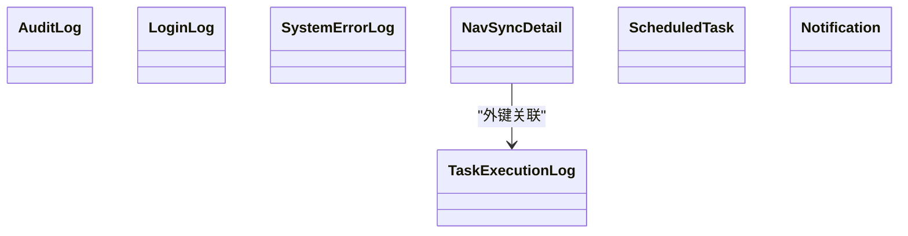

图表来源
- [audit_log.py:5-18](file://backend/app/models/audit_log.py#L5-L18)
- [login_log.py:5-16](file://backend/app/models/login_log.py#L5-L16)
- [system_error_log.py:5-19](file://backend/app/models/system_error_log.py#L5-L19)
- [task_execution_log.py:5-21](file://backend/app/models/task_execution_log.py#L5-L21)
- [nav_sync_detail.py:5-18](file://backend/app/models/nav_sync_detail.py#L5-L18)
- [scheduled_task.py:5-19](file://backend/app/models/scheduled_task.py#L5-L19)
- [notification.py:5-19](file://backend/app/models/notification.py#L5-L19)