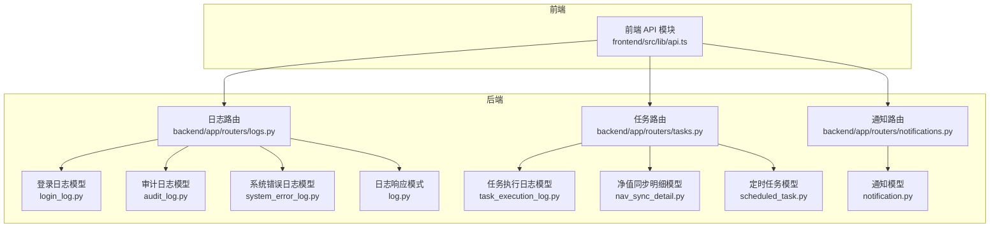
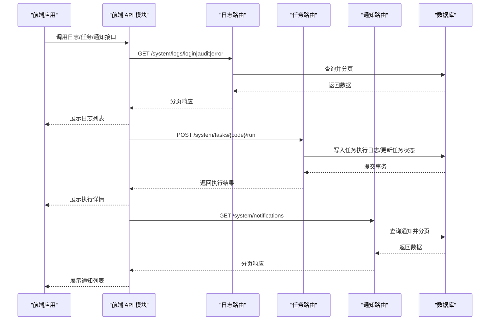
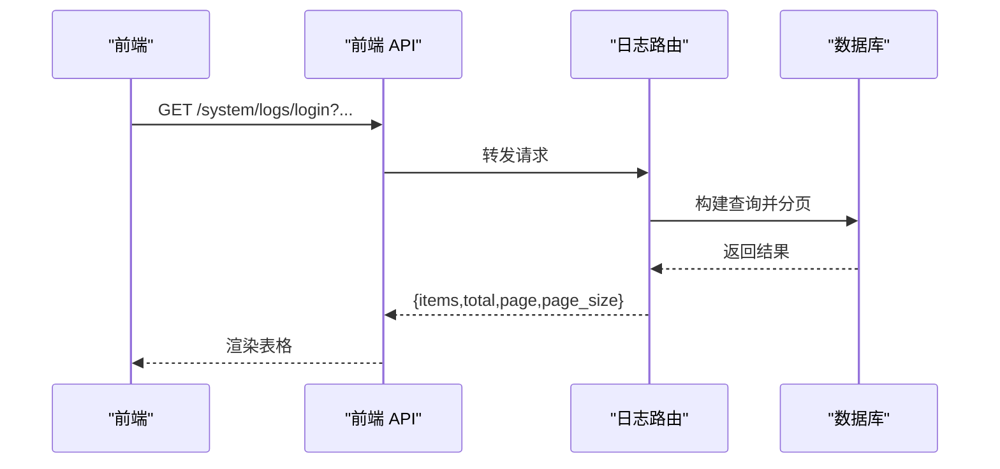
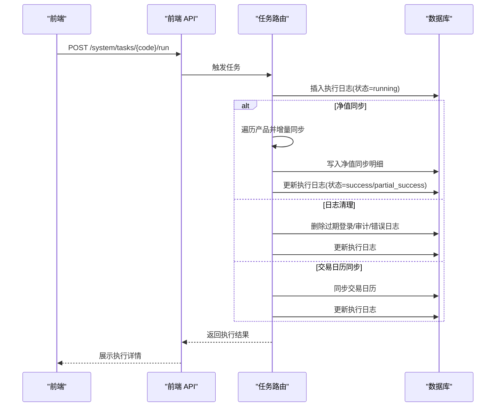
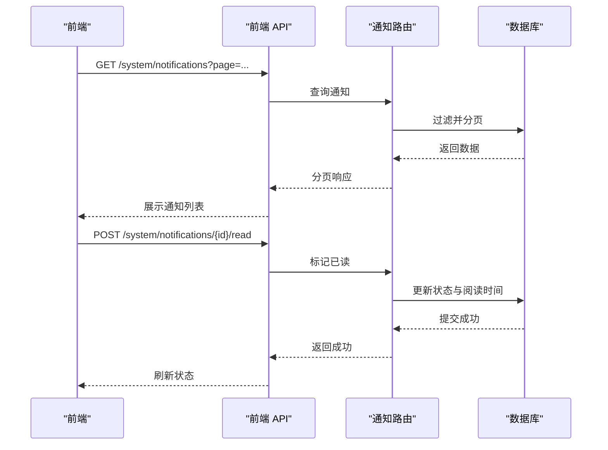
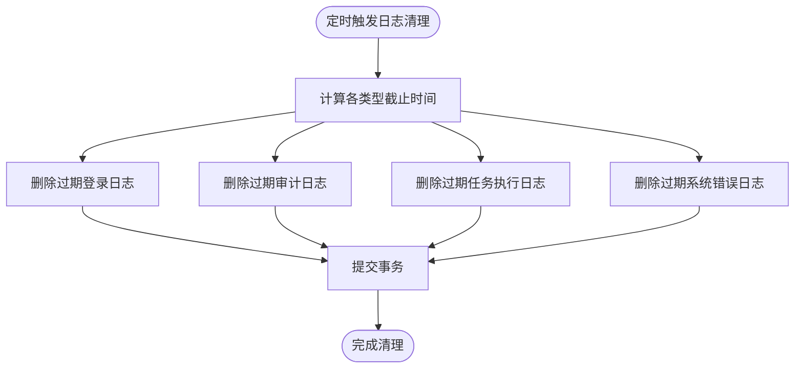
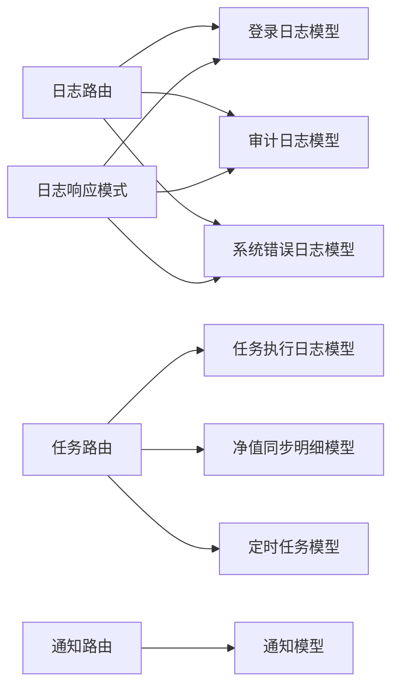

# 日志管理工具

<cite>
**本文引用的文件**
- [日志系统设计.md](file://Docs/07-日志系统设计.md)
- [logs.py](file://backend/app/routers/logs.py)
- [tasks.py](file://backend/app/routers/tasks.py)
- [notifications.py](file://backend/app/routers/notifications.py)
- [log.py](file://backend/app/schemas/log.py)
- [login_log.py](file://backend/app/models/login_log.py)
- [audit_log.py](file://backend/app/models/audit_log.py)
- [system_error_log.py](file://backend/app/models/system_error_log.py)
- [task_execution_log.py](file://backend/app/models/task_execution_log.py)
- [nav_sync_detail.py](file://backend/app/models/nav_sync_detail.py)
- [scheduled_task.py](file://backend/app/models/scheduled_task.py)
- [notification.py](file://backend/app/models/notification.py)
- [api.ts](file://frontend/src/lib/api.ts)
</cite>

## 目录
1. [简介](#简介)
2. [项目结构](#项目结构)
3. [核心组件](#核心组件)
4. [架构总览](#架构总览)
5. [详细组件分析](#详细组件分析)
6. [依赖分析](#依赖分析)
7. [性能考虑](#性能考虑)
8. [故障排查指南](#故障排查指南)
9. [结论](#结论)
10. [附录](#附录)

## 简介
本文件面向 InvestRing 的日志管理工具，系统性梳理后端日志查询接口、任务与通知模块、日志清理策略、自动归档与存储优化、分析统计与可视化、监控告警与通知机制，以及备份恢复、迁移与性能调优建议，并给出运维管理、容量规划与成本控制策略。文档同时结合前端 API 使用方式，帮助前后端协同完成日志管理与运营工作。

## 项目结构
日志管理相关能力由后端 FastAPI 路由与 SQLAlchemy 模型构成，前端通过统一 API 模块对接后端接口。整体组织按“路由-模型-模式”分层，配合定时任务与清理策略形成闭环。

**图表来源**
- [logs.py:1-56](file://backend/app/routers/logs.py#L1-L56)
- [tasks.py:1-323](file://backend/app/routers/tasks.py#L1-L323)
- [notifications.py:1-74](file://backend/app/routers/notifications.py#L1-L74)
- [login_log.py:1-16](file://backend/app/models/login_log.py#L1-L16)
- [audit_log.py:1-18](file://backend/app/models/audit_log.py#L1-L18)
- [system_error_log.py:1-19](file://backend/app/models/system_error_log.py#L1-L19)
- [task_execution_log.py:1-21](file://backend/app/models/task_execution_log.py#L1-L21)
- [nav_sync_detail.py:1-18](file://backend/app/models/nav_sync_detail.py#L1-L18)
- [scheduled_task.py:1-19](file://backend/app/models/scheduled_task.py#L1-L19)
- [notification.py:1-19](file://backend/app/models/notification.py#L1-L19)
- [log.py:1-51](file://backend/app/schemas/log.py#L1-L51)
- [api.ts:372-435](file://frontend/src/lib/api.ts#L372-L435)

**章节来源**
- [logs.py:1-56](file://backend/app/routers/logs.py#L1-L56)
- [tasks.py:1-323](file://backend/app/routers/tasks.py#L1-L323)
- [notifications.py:1-74](file://backend/app/routers/notifications.py#L1-L74)
- [log.py:1-51](file://backend/app/schemas/log.py#L1-L51)
- [login_log.py:1-16](file://backend/app/models/login_log.py#L1-L16)
- [audit_log.py:1-18](file://backend/app/models/audit_log.py#L1-L18)
- [system_error_log.py:1-19](file://backend/app/models/system_error_log.py#L1-L19)
- [task_execution_log.py:1-21](file://backend/app/models/task_execution_log.py#L1-L21)
- [nav_sync_detail.py:1-18](file://backend/app/models/nav_sync_detail.py#L1-L18)
- [scheduled_task.py:1-19](file://backend/app/models/scheduled_task.py#L1-L19)
- [notification.py:1-19](file://backend/app/models/notification.py#L1-L19)
- [api.ts:372-435](file://frontend/src/lib/api.ts#L372-L435)

## 核心组件
- 日志查询接口：提供登录日志、操作审计日志、系统错误日志的分页查询，支持基础筛选与排序。
- 任务管理接口：提供任务列表、手动触发、启停控制，以及任务执行历史查询；内置日志清理任务。
- 通知接口：提供通知列表、标记已读、批量已读。
- 数据模型：围绕登录、审计、错误、任务执行、净值同步明细、通知、定时任务等建立持久化结构。
- 前端对接：统一的系统 API 模块封装了日志、任务、通知的调用入口。

**章节来源**
- [日志系统设计.md:229-308](file://Docs/07-日志系统设计.md#L229-L308)
- [logs.py:25-55](file://backend/app/routers/logs.py#L25-L55)
- [tasks.py:70-322](file://backend/app/routers/tasks.py#L70-L322)
- [notifications.py:12-73](file://backend/app/routers/notifications.py#L12-L73)
- [log.py:6-50](file://backend/app/schemas/log.py#L6-L50)

## 架构总览
日志管理工具采用“前端请求—后端路由—数据库模型”的清晰分层。前端通过统一 API 模块发起请求，后端路由根据权限与参数构建查询，返回分页数据；任务模块负责执行与记录，清理策略定期回收过期数据。

**图表来源**
- [api.ts:399-435](file://frontend/src/lib/api.ts#L399-L435)
- [logs.py:25-55](file://backend/app/routers/logs.py#L25-L55)
- [tasks.py:88-267](file://backend/app/routers/tasks.py#L88-L267)
- [notifications.py:12-73](file://backend/app/routers/notifications.py#L12-L73)

## 详细组件分析

### 日志查询接口
- 登录日志查询：支持分页，默认按创建时间倒序。
- 审计日志查询：支持分页，默认按创建时间倒序。
- 系统错误日志查询：支持分页，默认按创建时间倒序。
- 权限控制：均需管理员身份访问。
- 响应格式：统一返回 items、total、page、page_size。

**图表来源**
- [logs.py:25-55](file://backend/app/routers/logs.py#L25-L55)
- [log.py:6-50](file://backend/app/schemas/log.py#L6-L50)
- [api.ts:399-408](file://frontend/src/lib/api.ts#L399-L408)

**章节来源**
- [日志系统设计.md:233-265](file://Docs/07-日志系统设计.md#L233-L265)
- [logs.py:25-55](file://backend/app/routers/logs.py#L25-L55)
- [log.py:6-50](file://backend/app/schemas/log.py#L6-L50)
- [api.ts:399-408](file://frontend/src/lib/api.ts#L399-L408)

### 任务管理与执行日志
- 任务列表：分页获取定时任务配置。
- 手动触发：校验任务存在与启用状态，创建执行日志并串行执行具体任务逻辑。
- 任务类型与执行：
  - 交易日历同步：同步指定年份交易日历。
  - 净值同步：对产品进行增量同步，记录明细并生成日终快照（若为交易日且成功）。
  - 日志清理：按保留周期删除过期日志。
- 执行日志：记录任务状态、起止时间、耗时、处理记录数、错误信息等。
- 净值同步明细：记录每只产品的同步状态与错误信息。

**图表来源**
- [tasks.py:88-267](file://backend/app/routers/tasks.py#L88-L267)
- [task_execution_log.py:1-21](file://backend/app/models/task_execution_log.py#L1-L21)
- [nav_sync_detail.py:1-18](file://backend/app/models/nav_sync_detail.py#L1-L18)
- [api.ts:413-428](file://frontend/src/lib/api.ts#L413-L428)

**章节来源**
- [日志系统设计.md:267-287](file://Docs/07-日志系统设计.md#L267-L287)
- [tasks.py:70-322](file://backend/app/routers/tasks.py#L70-L322)
- [task_execution_log.py:1-21](file://backend/app/models/task_execution_log.py#L1-L21)
- [nav_sync_detail.py:1-18](file://backend/app/models/nav_sync_detail.py#L1-L18)
- [api.ts:413-428](file://frontend/src/lib/api.ts#L413-L428)

### 通知模块
- 列表查询：支持按状态过滤，非管理员仅可见本人或公开通知。
- 标记已读：按通知 ID 标记为已读。
- 全部已读：批量将未读通知标记为已读。
- 通知模型：包含类型、标题、内容、级别、接收人、渠道、状态、发送与阅读时间等。

**图表来源**
- [notifications.py:12-73](file://backend/app/routers/notifications.py#L12-L73)
- [notification.py:1-19](file://backend/app/models/notification.py#L1-L19)
- [api.ts:430-435](file://frontend/src/lib/api.ts#L430-L435)

**章节来源**
- [日志系统设计.md:288-307](file://Docs/07-日志系统设计.md#L288-L307)
- [notifications.py:12-73](file://backend/app/routers/notifications.py#L12-L73)
- [notification.py:1-19](file://backend/app/models/notification.py#L1-L19)
- [api.ts:430-435](file://frontend/src/lib/api.ts#L430-L435)

### 日志清理策略与自动归档
- 保留周期（当前实现）：登录日志 30 天、审计日志 90 天、任务执行日志 90 天、系统错误日志 30 天。
- 清理任务：通过“日志清理”任务按周执行，删除过期记录并提交事务。
- 自动归档：当前设计未提供自动归档机制，建议结合保留周期与外部存储策略实现冷热分离。

**图表来源**
- [tasks.py:19-67](file://backend/app/routers/tasks.py#L19-L67)

**章节来源**
- [日志系统设计.md:430-449](file://Docs/07-日志系统设计.md#L430-L449)
- [tasks.py:19-67](file://backend/app/routers/tasks.py#L19-L67)

### 存储优化与索引策略
- 登录日志：按用户与时间复合索引，便于按用户检索与时间倒序。
- 审计日志：按用户、资源类型/ID、时间索引，支持多维检索。
- 任务执行日志：按任务代码与开始时间索引，便于任务维度查询。
- 系统错误日志：按类型与时间索引，便于错误类型聚合与趋势分析。
- 净值同步明细：按任务日志、产品+市场+日期、状态+时间索引，支撑明细与聚合查询。

**章节来源**
- [日志系统设计.md:35-225](file://Docs/07-日志系统设计.md#L35-L225)
- [login_log.py:1-16](file://backend/app/models/login_log.py#L1-L16)
- [audit_log.py:1-18](file://backend/app/models/audit_log.py#L1-L18)
- [task_execution_log.py:1-21](file://backend/app/models/task_execution_log.py#L1-L21)
- [system_error_log.py:1-19](file://backend/app/models/system_error_log.py#L1-L19)
- [nav_sync_detail.py:1-18](file://backend/app/models/nav_sync_detail.py#L1-L18)

### 日志分析、统计与可视化
- 建议基于现有日志表进行统计分析：
  - 登录失败率、失败原因分布。
  - 审计操作频次与热点资源类型。
  - 任务执行成功率、耗时分布、失败明细。
  - 错误类型分布与趋势。
- 可视化展示：前端可基于分页接口渲染折线图、饼图、柱状图等，展示日均/周均趋势与占比。

**章节来源**
- [日志系统设计.md:229-308](file://Docs/07-日志系统设计.md#L229-L308)
- [api.ts:399-435](file://frontend/src/lib/api.ts#L399-L435)

### 监控面板、告警与通知
- 监控面板：基于任务执行日志与系统错误日志构建仪表盘，展示任务状态、错误数量、错误类型占比等。
- 告警配置：可基于错误日志阈值（如错误数峰值、错误类型占比异常）触发告警。
- 通知机制：通过通知模块向管理员或相关人员推送告警示警。

**章节来源**
- [日志系统设计.md:288-307](file://Docs/07-日志系统设计.md#L288-L307)
- [notification.py:1-19](file://backend/app/models/notification.py#L1-L19)

### 备份、恢复与迁移
- 备份：建议定期导出日志表（CSV/JSON），并结合数据库备份策略。
- 恢复：在新环境导入备份数据，注意时间戳与索引重建。
- 迁移：跨数据库迁移时，需保持字段映射一致与索引同步。

**章节来源**
- [日志系统设计.md:430-449](file://Docs/07-日志系统设计.md#L430-L449)

## 依赖分析
- 路由到模型：日志路由依赖登录、审计、错误日志模型；任务路由依赖任务执行、净值同步明细、定时任务模型；通知路由依赖通知模型。
- 模式到模型：日志响应模式与各日志模型字段一一对应，保证序列化一致性。
- 前端到后端：前端 API 模块封装了日志、任务、通知的调用，路由层负责鉴权与数据查询。

**图表来源**
- [logs.py:1-56](file://backend/app/routers/logs.py#L1-L56)
- [tasks.py:1-323](file://backend/app/routers/tasks.py#L1-L323)
- [notifications.py:1-74](file://backend/app/routers/notifications.py#L1-L74)
- [log.py:1-51](file://backend/app/schemas/log.py#L1-L51)
- [login_log.py:1-16](file://backend/app/models/login_log.py#L1-L16)
- [audit_log.py:1-18](file://backend/app/models/audit_log.py#L1-L18)
- [system_error_log.py:1-19](file://backend/app/models/system_error_log.py#L1-L19)
- [task_execution_log.py:1-21](file://backend/app/models/task_execution_log.py#L1-L21)
- [nav_sync_detail.py:1-18](file://backend/app/models/nav_sync_detail.py#L1-L18)
- [scheduled_task.py:1-19](file://backend/app/models/scheduled_task.py#L1-L19)
- [notification.py:1-19](file://backend/app/models/notification.py#L1-L19)

**章节来源**
- [logs.py:1-56](file://backend/app/routers/logs.py#L1-L56)
- [tasks.py:1-323](file://backend/app/routers/tasks.py#L1-L323)
- [notifications.py:1-74](file://backend/app/routers/notifications.py#L1-L74)
- [log.py:1-51](file://backend/app/schemas/log.py#L1-L51)

## 性能考虑
- 分页与索引：所有日志查询默认按时间倒序，配合相应索引可显著降低查询延迟。
- 任务串行执行：定时任务采用单线程执行器，避免 SQLite 并发写入冲突，但会带来串行瓶颈，建议在高峰期错峰调度或升级数据库。
- 批量写入：净值同步明细按产品逐条写入，建议评估批量插入或事务合并以减少开销。
- 前端分页：前端统一使用分页参数，避免一次性拉取大量数据导致内存压力。

**章节来源**
- [日志系统设计.md:353-396](file://Docs/07-日志系统设计.md#L353-L396)
- [tasks.py:88-267](file://backend/app/routers/tasks.py#L88-L267)

## 故障排查指南
- 登录/审计/错误日志无法查询：确认是否以管理员身份访问；检查分页参数与时间范围。
- 任务执行失败：查看任务执行日志中的错误信息与堆栈；核对任务是否启用；检查外部服务可用性。
- 通知未显示：确认通知状态与接收人；非管理员仅能看到本人或公开通知。
- 日志清理无效：确认“日志清理”任务是否启用与执行时间；检查数据库权限与事务提交。

**章节来源**
- [logs.py:25-55](file://backend/app/routers/logs.py#L25-L55)
- [tasks.py:88-267](file://backend/app/routers/tasks.py#L88-L267)
- [notifications.py:12-73](file://backend/app/routers/notifications.py#L12-L73)

## 结论
日志管理工具以清晰的路由与模型分层实现了日志查询、任务执行与通知管理，并通过保留周期与清理任务保障存储健康。建议后续完善自动归档、统计报表与可视化面板，引入告警与通知机制，并结合容量规划与成本控制策略，持续优化性能与运维效率。

## 附录

### API 定义概览
- 日志查询
  - GET /system/logs/login
  - GET /system/logs/audit
  - GET /system/logs/error
- 任务管理
  - GET /system/tasks
  - POST /system/tasks/{code}/run
  - POST /system/tasks/{code}/enable
  - POST /system/tasks/{code}/disable
  - GET /system/tasks/{code}/logs
- 通知管理
  - GET /system/notifications
  - POST /system/notifications/{id}/read
  - POST /system/notifications/read-all

**章节来源**
- [日志系统设计.md:229-308](file://Docs/07-日志系统设计.md#L229-L308)
- [api.ts:399-435](file://frontend/src/lib/api.ts#L399-L435)