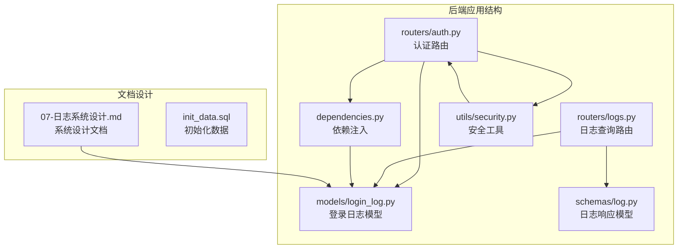
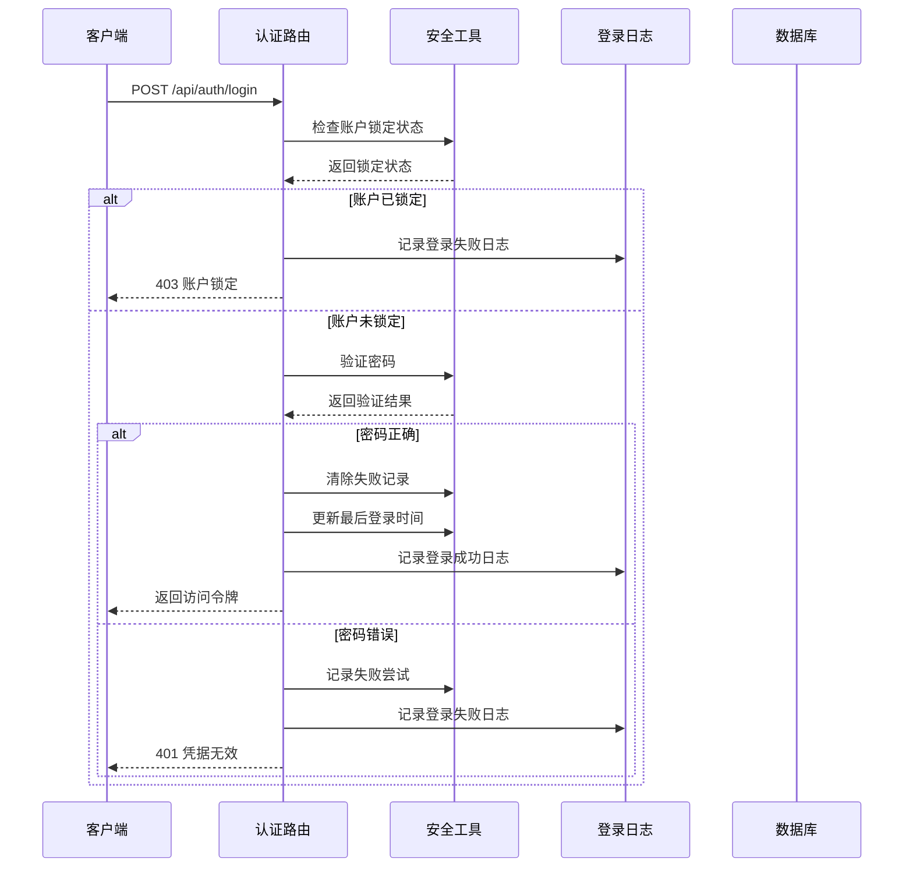
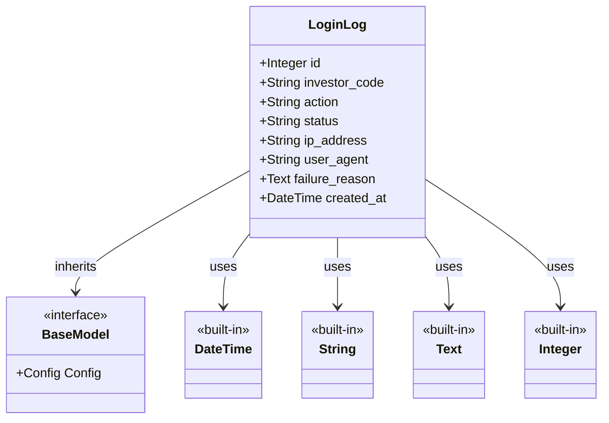
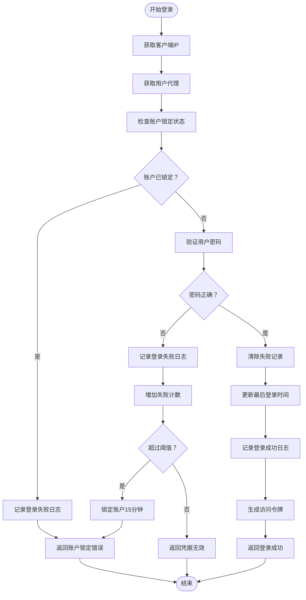
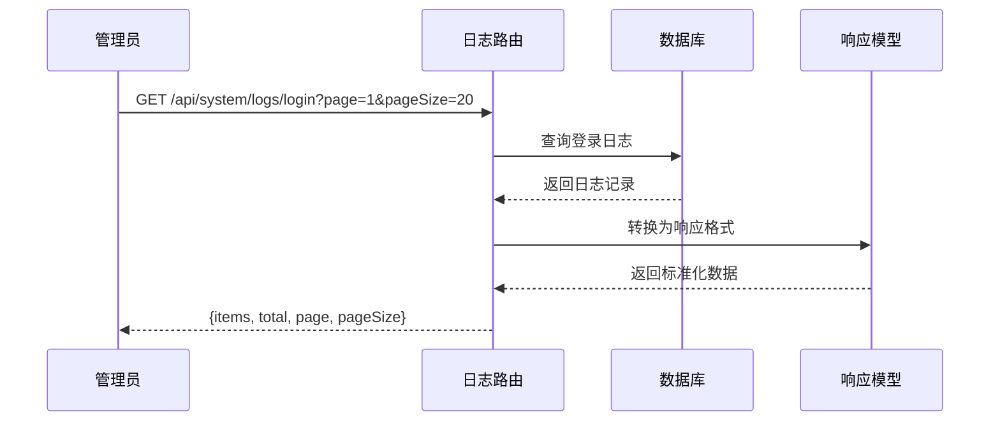
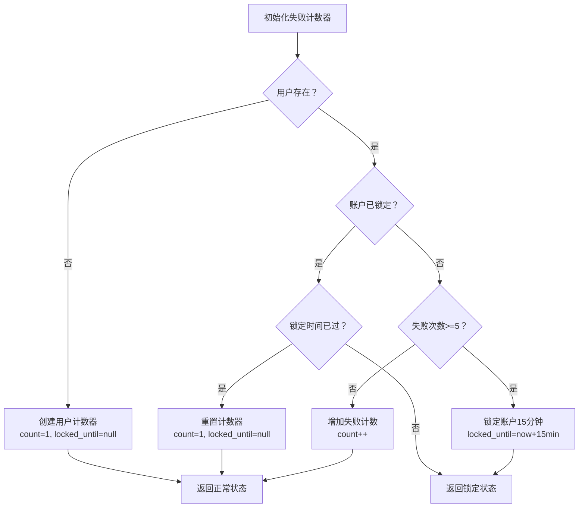
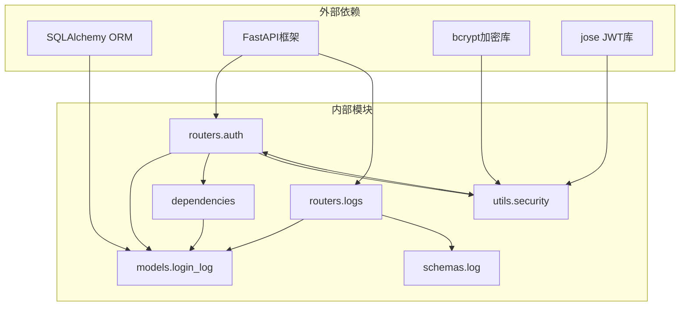

# 登录日志

<cite>
**本文档引用的文件**
- [login_log.py](file://backend/app/models/login_log.py)
- [log.py](file://backend/app/schemas/log.py)
- [logs.py](file://backend/app/routers/logs.py)
- [auth.py](file://backend/app/routers/auth.py)
- [dependencies.py](file://backend/app/dependencies.py)
- [security.py](file://backend/app/utils/security.py)
- [07-日志系统设计.md](file://Docs/07-日志系统设计.md)
- [init_data.sql](file://Docs/init_data.sql)
</cite>

## 目录
1. [简介](#简介)
2. [项目结构](#项目结构)
3. [核心组件](#核心组件)
4. [架构概览](#架构概览)
5. [详细组件分析](#详细组件分析)
6. [依赖关系分析](#依赖关系分析)
7. [性能考虑](#性能考虑)
8. [故障排除指南](#故障排除指南)
9. [结论](#结论)

## 简介

InvestRing 的登录日志系统是一个完整的安全审计和行为追踪解决方案。该系统不仅记录用户的登录和登出行为，还实现了智能的失败尝试检测、账户锁定机制和异常登录检测功能。通过详细的日志记录，系统能够为安全审计、合规要求和问题排查提供全面的数据支持。

## 项目结构

登录日志系统在项目中的组织结构如下：

**图表来源**
- [login_log.py:1-16](file://backend/app/models/login_log.py#L1-L16)
- [auth.py:1-186](file://backend/app/routers/auth.py#L1-L186)
- [logs.py:1-56](file://backend/app/routers/logs.py#L1-L56)

**章节来源**
- [login_log.py:1-16](file://backend/app/models/login_log.py#L1-L16)
- [auth.py:1-186](file://backend/app/routers/auth.py#L1-L186)
- [logs.py:1-56](file://backend/app/routers/logs.py#L1-L56)

## 核心组件

### 登录日志数据模型

登录日志系统的核心是 LoginLog 数据模型，它定义了完整的登录行为记录结构：

| 字段名 | 类型 | 长度限制 | 是否必填 | 描述 |
|--------|------|----------|----------|------|
| id | Integer | - | 是 | 主键，自增ID |
| investor_code | String | 20 | 是 | 登录用户代码 |
| action | String | 20 | 是 | 操作类型：login/logout/login_failed |
| status | String | 20 | 是 | 状态：success/failed |
| ip_address | String | 50 | 否 | 登录IP地址 |
| user_agent | String | 500 | 否 | 用户代理字符串 |
| failure_reason | Text | - | 否 | 失败原因描述 |
| created_at | DateTime | - | 否 | 创建时间，默认当前时间 |

### 安全机制组件

系统实现了多层次的安全保护机制：

1. **失败尝试跟踪**：内存中的登录失败计数器
2. **账户锁定机制**：基于时间的账户锁定策略
3. **IP地址追踪**：记录每次登录的来源IP
4. **用户代理识别**：记录浏览器和设备信息
5. **令牌黑名单**：防止已撤销令牌的使用

**章节来源**
- [login_log.py:5-16](file://backend/app/models/login_log.py#L5-L16)
- [security.py:57-103](file://backend/app/utils/security.py#L57-L103)
- [dependencies.py:27-47](file://backend/app/dependencies.py#L27-L47)

## 架构概览

登录日志系统的整体架构采用分层设计，确保了安全性、可维护性和扩展性：

**图表来源**
- [auth.py:29-95](file://backend/app/routers/auth.py#L29-L95)
- [security.py:57-81](file://backend/app/utils/security.py#L57-L81)
- [dependencies.py:27-47](file://backend/app/dependencies.py#L27-L47)

## 详细组件分析

### 登录日志模型分析

LoginLog 模型采用了 SQLAlchemy ORM 设计，具有以下特点：

**图表来源**
- [login_log.py:5-16](file://backend/app/models/login_log.py#L5-L16)

#### 字段设计复杂度分析

| 字段 | 存储复杂度 | 查询复杂度 | 索引策略 |
|------|------------|------------|----------|
| id | O(1) | O(1) | 主键索引 |
| investor_code | O(1) | O(log n) | 复合索引 |
| action | O(1) | O(log n) | 分类索引 |
| status | O(1) | O(log n) | 分类索引 |
| ip_address | O(1) | O(log n) | 文本索引 |
| user_agent | O(1) | O(log n) | 文本索引 |
| failure_reason | O(1) | O(log n) | 文本索引 |
| created_at | O(1) | O(log n) | 时间索引 |

**章节来源**
- [login_log.py:1-16](file://backend/app/models/login_log.py#L1-L16)

### 认证路由处理流程

认证路由实现了完整的登录处理逻辑，包括失败尝试检测和账户锁定机制：

**图表来源**
- [auth.py:29-95](file://backend/app/routers/auth.py#L29-L95)
- [security.py:57-81](file://backend/app/utils/security.py#L57-L81)

**章节来源**
- [auth.py:29-95](file://backend/app/routers/auth.py#L29-L95)
- [security.py:57-81](file://backend/app/utils/security.py#L57-L81)

### 日志查询接口设计

系统提供了完整的日志查询接口，支持分页查询和权限控制：

| 接口 | 方法 | 路径 | 功能 | 权限要求 |
|------|------|------|------|----------|
| 获取登录日志 | GET | /api/system/logs/login | 分页查询登录日志 | 管理员 |
| 获取操作审计日志 | GET | /api/system/logs/audit | 分页查询审计日志 | 管理员 |
| 获取系统错误日志 | GET | /api/system/logs/error | 分页查询错误日志 | 管理员 |

#### 分页查询实现

**图表来源**
- [logs.py:25-33](file://backend/app/routers/logs.py#L25-L33)
- [log.py:6-17](file://backend/app/schemas/log.py#L6-L17)

**章节来源**
- [logs.py:1-56](file://backend/app/routers/logs.py#L1-L56)
- [log.py:1-51](file://backend/app/schemas/log.py#L1-L51)

### 安全机制实现

#### 失败尝试检测算法

系统使用内存中的字典结构跟踪用户的登录失败尝试：

**图表来源**
- [security.py:57-81](file://backend/app/utils/security.py#L57-L81)

#### 账户锁定策略

| 策略 | 阈值 | 锁定时长 | 触发条件 |
|------|------|----------|----------|
| 失败尝试锁定 | 5次 | 15分钟 | 连续5次登录失败 |
| 账户锁定检查 | - | - | 每次登录前检查 |
| 自动解锁 | - | 15分钟后 | 锁定时间到期自动解锁 |

**章节来源**
- [security.py:57-103](file://backend/app/utils/security.py#L57-L103)

### 异常登录检测

系统具备基本的异常登录检测能力，主要通过以下方式实现：

1. **IP地址追踪**：记录每次登录的来源IP地址
2. **用户代理识别**：记录浏览器和设备信息
3. **地理位置分析**：通过IP地址推断登录位置
4. **时间模式分析**：检测异常时间段的登录行为

虽然当前实现相对简单，但为未来的高级异常检测功能预留了数据基础。

## 依赖关系分析

登录日志系统的依赖关系体现了清晰的分层架构：

**图表来源**
- [login_log.py:1](file://backend/app/models/login_log.py#L1)
- [auth.py:1](file://backend/app/routers/auth.py#L1)
- [logs.py:1](file://backend/app/routers/logs.py#L1)

### 模块耦合度分析

| 模块 | 内聚性 | 耦合度 | 依赖关系 |
|------|--------|--------|----------|
| models.login_log | 高 | 低 | 仅依赖SQLAlchemy |
| routers.auth | 中 | 中 | 依赖models, dependencies, utils |
| routers.logs | 中 | 中 | 依赖models, schemas |
| dependencies | 中 | 高 | 依赖models, utils |
| utils.security | 高 | 低 | 依赖bcrypt, jose |

**章节来源**
- [dependencies.py:1-146](file://backend/app/dependencies.py#L1-L146)
- [security.py:1-103](file://backend/app/utils/security.py#L1-L103)

## 性能考虑

### 数据库性能优化

1. **索引策略**：为常用查询字段建立适当的索引
2. **查询优化**：使用分页查询避免大量数据传输
3. **连接池管理**：合理配置数据库连接池大小
4. **缓存策略**：对频繁访问的配置信息进行缓存

### 内存使用优化

1. **失败计数器**：使用内存字典存储，避免数据库写入
2. **令牌黑名单**：使用集合数据结构，提供O(1)查找性能
3. **数据结构选择**：根据使用场景选择合适的数据结构

### 网络性能优化

1. **API响应优化**：使用分页和过滤减少响应大小
2. **压缩支持**：启用Gzip压缩减少传输数据量
3. **缓存策略**：对静态内容和重复查询结果进行缓存

## 故障排除指南

### 常见问题诊断

#### 登录失败问题

**症状**：用户报告无法登录系统
**诊断步骤**：
1. 检查登录日志表中是否有对应的失败记录
2. 验证用户账户状态是否被锁定
3. 确认密码哈希是否正确
4. 检查IP地址是否在白名单中

**解决方法**：
- 如果账户被锁定，等待锁定时间结束后重试
- 重置用户密码并重新设置
- 检查防火墙和网络配置

#### 日志查询问题

**症状**：管理员无法查看登录日志
**诊断步骤**：
1. 验证管理员权限
2. 检查数据库连接状态
3. 确认查询参数格式正确
4. 验证分页参数范围

**解决方法**：
- 确保使用正确的管理员凭据
- 检查数据库服务状态
- 验证查询参数的有效性

#### 性能问题

**症状**：日志查询响应缓慢
**诊断步骤**：
1. 检查数据库索引是否完整
2. 分析查询执行计划
3. 监控数据库连接池使用情况
4. 检查服务器资源使用情况

**解决方法**：
- 为常用查询字段添加索引
- 优化查询语句和参数
- 调整数据库连接池配置
- 考虑数据归档策略

**章节来源**
- [auth.py:37-72](file://backend/app/routers/auth.py#L37-L72)
- [logs.py:25-33](file://backend/app/routers/logs.py#L25-L33)

## 结论

InvestRing 的登录日志系统通过精心设计的数据模型、完善的认证流程和安全机制，为金融系统的安全审计和合规要求提供了坚实的基础。系统的主要优势包括：

1. **完整性**：覆盖了登录、登出、失败尝试等所有关键场景
2. **安全性**：实现了多层防护机制，包括失败尝试检测和账户锁定
3. **可扩展性**：模块化设计便于未来功能扩展
4. **性能**：合理的索引策略和查询优化保证了良好的响应性能

该系统为后续的高级安全功能（如异常登录检测、风险评估、实时告警等）奠定了良好的技术基础，能够满足金融行业对安全性和合规性的严格要求。