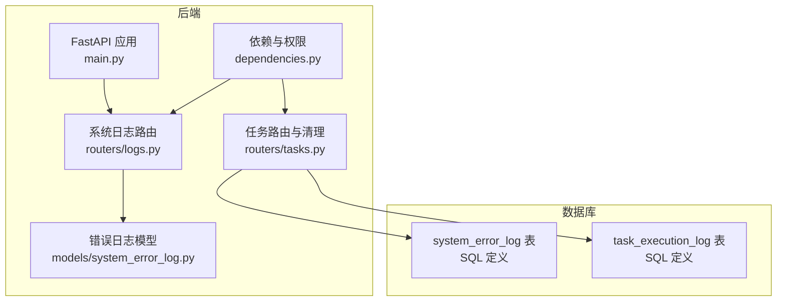
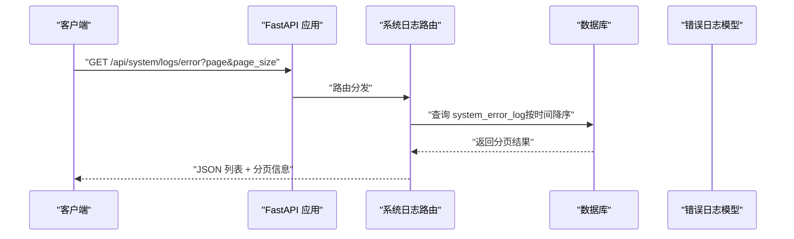
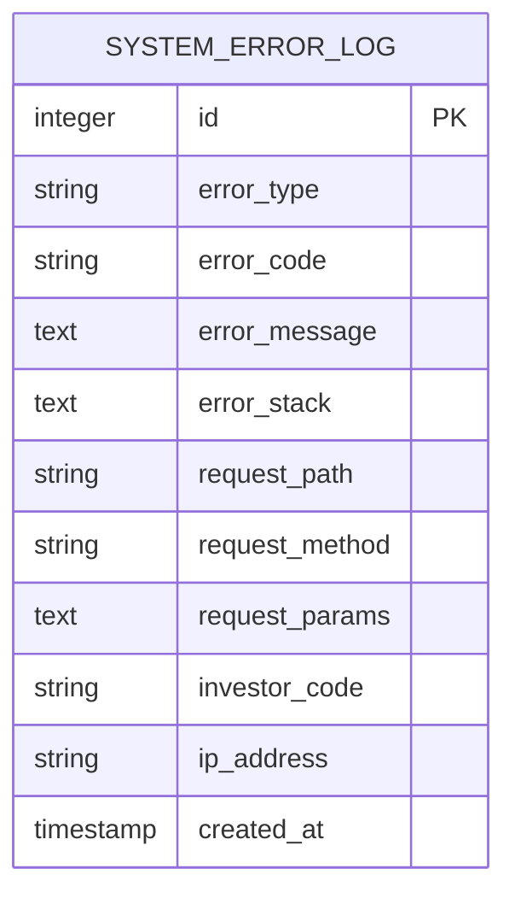
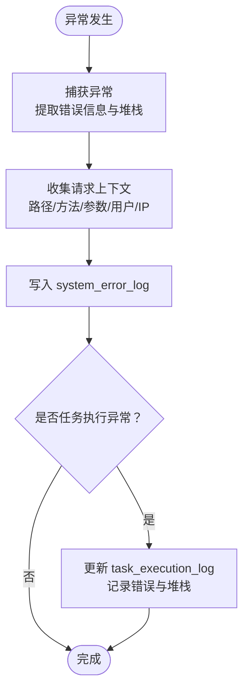
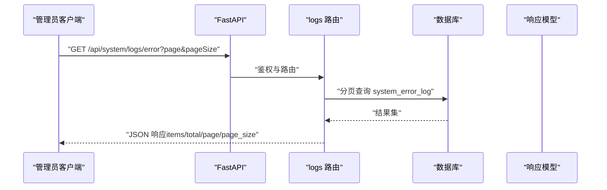
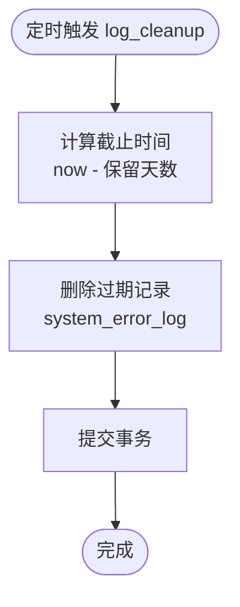
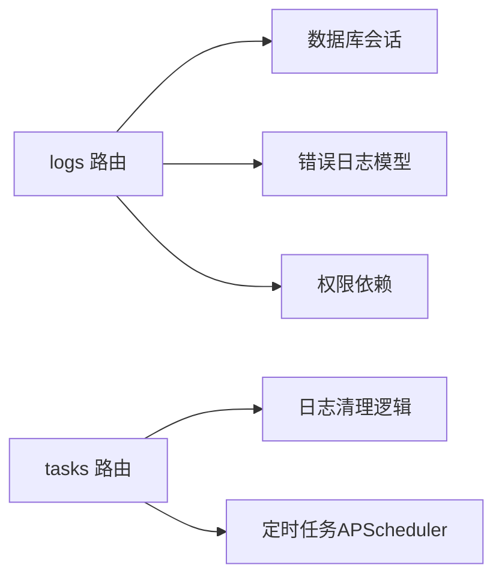

# 系统错误日志

<cite>
**本文引用的文件**
- [07-日志系统设计.md](file://Docs/07-日志系统设计.md)
- [02-数据库设计.md](file://Docs/02-数据库设计.md)
- [system_error_log.py](file://backend/app/models/system_error_log.py)
- [logs.py](file://backend/app/routers/logs.py)
- [log.py](file://backend/app/schemas/log.py)
- [main.py](file://backend/app/main.py)
- [dependencies.py](file://backend/app/dependencies.py)
- [init_tasks.py](file://backend/app/init_tasks.py)
- [tasks.py](file://backend/app/routers/tasks.py)
- [task_execution_log.py](file://backend/app/models/task_execution_log.py)
</cite>

## 目录
1. [简介](#简介)
2. [项目结构](#项目结构)
3. [核心组件](#核心组件)
4. [架构总览](#架构总览)
5. [详细组件分析](#详细组件分析)
6. [依赖分析](#依赖分析)
7. [性能考虑](#性能考虑)
8. [故障排查指南](#故障排查指南)
9. [结论](#结论)
10. [附录](#附录)

## 简介
本文件面向 InvestRing 的“系统错误日志”子系统，系统性阐述错误日志表的字段设计、错误级别与分类、堆栈跟踪记录规范；文档化错误捕获机制、自动上报流程与分类标准；解释存储策略、保留期限与归档机制；并提供错误日志的查询接口、聚合分析与趋势统计能力，以及错误预警机制、故障诊断工具与运维响应流程。

## 项目结构
- 后端通过 FastAPI 提供系统日志相关接口，错误日志查询接口位于系统日志模块。
- 数据模型与数据库表结构由 SQLAlchemy 映射与 SQL 定义共同保证。
- 日志清理策略通过定时任务统一执行，保障系统长期稳定运行。

**图表来源**
- [main.py:32-48](file://backend/app/main.py#L32-L48)
- [logs.py:11-56](file://backend/app/routers/logs.py#L11-L56)
- [system_error_log.py:5-18](file://backend/app/models/system_error_log.py#L5-L18)
- [tasks.py:19-68](file://backend/app/routers/tasks.py#L19-L68)
- [task_execution_log.py:5-20](file://backend/app/models/task_execution_log.py#L5-L20)

**章节来源**
- [main.py:32-48](file://backend/app/main.py#L32-L48)
- [07-日志系统设计.md:229-308](file://Docs/07-日志系统设计.md#L229-L308)

## 核心组件
- 错误日志表与模型
  - 表结构与索引：包含错误类型、错误码、错误信息、堆栈、请求路径、方法、参数、用户、IP、时间戳等字段，并建立按类型与时间的索引。
  - 模型映射：通过 SQLAlchemy 将表映射为 Python 类，便于 ORM 查询与持久化。
- 查询接口
  - 提供分页查询系统错误日志的接口，支持按时间排序，默认降序展示最新错误。
- 存储与清理
  - 错误日志保留期为 30 天，通过定时任务统一清理，避免数据膨胀。
- 分类与级别
  - 文档定义了错误类型的分类（异常、API 错误、业务错误），并给出日志级别（DEBUG/INFO/WARN/ERROR）的通用规范，便于扩展。

**章节来源**
- [system_error_log.py:5-18](file://backend/app/models/system_error_log.py#L5-L18)
- [logs.py:47-56](file://backend/app/routers/logs.py#L47-L56)
- [07-日志系统设计.md:183-205](file://Docs/07-日志系统设计.md#L183-L205)
- [07-日志系统设计.md:430-450](file://Docs/07-日志系统设计.md#L430-L450)
- [07-日志系统设计.md:311-321](file://Docs/07-日志系统设计.md#L311-L321)

## 架构总览
系统错误日志的采集、存储与查询链路如下：

**图表来源**
- [main.py:32-48](file://backend/app/main.py#L32-L48)
- [logs.py:47-56](file://backend/app/routers/logs.py#L47-L56)
- [system_error_log.py:5-18](file://backend/app/models/system_error_log.py#L5-L18)

## 详细组件分析

### 错误日志表与模型
- 字段设计
  - 错误类型：区分异常、API 错误、业务错误，便于分类统计与告警。
  - 错误码：标准化错误标识，利于快速定位与自动化处理。
  - 错误信息与堆栈：完整记录异常文本与调用栈，支撑快速诊断。
  - 请求上下文：记录请求路径、方法、参数（JSON）、用户与 IP，便于回溯。
  - 时间戳：默认记录创建时间，配合索引支持高效查询。
- 索引策略
  - 按错误类型与时间复合索引，支持按类型筛选与时间排序。
  - 按时间索引，支持按时间范围检索。
- 存储策略
  - 保留期：30 天；到期自动清理，降低存储压力。
  - 清理任务：通过定时任务统一执行，避免业务代码侵入。

**图表来源**
- [07-日志系统设计.md:183-205](file://Docs/07-日志系统设计.md#L183-L205)
- [system_error_log.py:5-18](file://backend/app/models/system_error_log.py#L5-L18)

**章节来源**
- [07-日志系统设计.md:183-205](file://Docs/07-日志系统设计.md#L183-L205)
- [system_error_log.py:5-18](file://backend/app/models/system_error_log.py#L5-L18)

### 错误捕获与上报机制
- 捕获范围
  - 业务异常：在服务层与任务执行过程中捕获异常，记录错误类型、错误码、错误信息与堆栈。
  - API 异常：对上游接口调用失败进行统一包装与记录，便于定位数据源问题。
  - 业务规则异常：对违反业务约束的场景进行明确标注，便于审计与风控。
- 上报流程
  - 在异常发生处构造错误对象，填充请求上下文（路径、方法、参数、用户、IP），并持久化到 system_error_log。
  - 对于任务执行失败，同时记录 task_execution_log 的错误信息与堆栈，形成“任务-错误”的关联。
- 自动上报
  - 通过统一的异常处理与日志记录机制，确保错误被自动捕获与上报，无需在各业务点重复实现。

**图表来源**
- [tasks.py:88-125](file://backend/app/routers/tasks.py#L88-L125)
- [task_execution_log.py:5-20](file://backend/app/models/task_execution_log.py#L5-L20)

**章节来源**
- [tasks.py:88-125](file://backend/app/routers/tasks.py#L88-L125)
- [task_execution_log.py:5-20](file://backend/app/models/task_execution_log.py#L5-L20)

### 查询接口与分页
- 接口定义
  - GET /api/system/logs/error：支持按时间倒序分页查询，返回 items、total、page、page_size。
- 权限控制
  - 仅管理员可访问，通过依赖注入校验当前用户角色。
- 前端集成
  - 前端通过统一错误处理拦截 401 等错误，结合后端返回的错误信息进行提示与跳转。

**图表来源**
- [logs.py:47-56](file://backend/app/routers/logs.py#L47-L56)
- [dependencies.py:114-129](file://backend/app/dependencies.py#L114-L129)
- [log.py:36-51](file://backend/app/schemas/log.py#L36-L51)

**章节来源**
- [logs.py:47-56](file://backend/app/routers/logs.py#L47-L56)
- [dependencies.py:114-129](file://backend/app/dependencies.py#L114-L129)
- [log.py:36-51](file://backend/app/schemas/log.py#L36-L51)

### 存储策略、保留期限与归档
- 保留期限
  - 系统错误日志：30 天。
  - 其他日志类型（登录、审计、任务、净值明细）亦有相应保留期，确保合规与性能平衡。
- 清理机制
  - 通过定时任务统一清理过期记录，减少数据库膨胀与查询开销。
  - 清理任务初始化时注册到系统任务表，确保稳定执行。

**图表来源**
- [tasks.py:19-68](file://backend/app/routers/tasks.py#L19-L68)
- [init_tasks.py:5-45](file://backend/app/init_tasks.py#L5-L45)

**章节来源**
- [07-日志系统设计.md:430-450](file://Docs/07-日志系统设计.md#L430-L450)
- [tasks.py:19-68](file://backend/app/routers/tasks.py#L19-L68)
- [init_tasks.py:5-45](file://backend/app/init_tasks.py#L5-L45)

### 错误分类标准与级别
- 错误类型
  - 异常：系统内部异常（如数据库连接失败、空指针等）。
  - API 错误：外部接口调用失败（网络、超时、返回格式异常等）。
  - 业务错误：违反业务规则或数据不一致导致的错误。
- 日志级别
  - 提供 DEBUG/INFO/WARN/ERROR 四级划分，便于在不同环境与场景下分级记录与告警。

**章节来源**
- [07-日志系统设计.md:183-205](file://Docs/07-日志系统设计.md#L183-L205)
- [07-日志系统设计.md:311-321](file://Docs/07-日志系统设计.md#L311-L321)

### 查询、聚合与趋势统计
- 基础查询
  - 支持按错误类型、时间范围进行筛选与分页，便于快速定位问题。
- 聚合分析
  - 可基于错误类型、错误码进行聚合统计，识别高频错误与热点问题。
- 趋势统计
  - 按日/周维度统计错误数量与占比，辅助评估系统稳定性与回归趋势。

**章节来源**
- [logs.py:47-56](file://backend/app/routers/logs.py#L47-L56)
- [07-日志系统设计.md:260-265](file://Docs/07-日志系统设计.md#L260-L265)

### 错误预警机制、诊断工具与运维响应
- 预警机制
  - 基于错误数量阈值与错误类型分布，设置告警规则（如 1 分钟内错误数超过阈值）。
  - 告警通道：站内通知、邮件等，确保及时处置。
- 诊断工具
  - 通过错误堆栈与请求上下文，快速定位异常位置与触发条件。
  - 结合任务执行日志，分析任务失败与错误之间的关联。
- 运维响应流程
  - 发现异常 → 查看错误日志 → 定位堆栈与上下文 → 分析任务日志 → 修复与回归测试 → 关闭工单与复盘。

**章节来源**
- [task_execution_log.py:5-20](file://backend/app/models/task_execution_log.py#L5-L20)
- [07-日志系统设计.md:430-450](file://Docs/07-日志系统设计.md#L430-L450)

## 依赖分析
- 组件耦合
  - 路由层依赖数据库会话与模型层，保持清晰的职责分离。
  - 权限依赖确保只有管理员可访问日志查询接口。
- 外部依赖
  - FastAPI 提供路由与中间件能力；SQLAlchemy 提供 ORM 与数据库交互。
  - APScheduler 用于定时任务调度（与日志清理相关）。

**图表来源**
- [logs.py:11-56](file://backend/app/routers/logs.py#L11-L56)
- [dependencies.py:114-129](file://backend/app/dependencies.py#L114-L129)
- [tasks.py:19-68](file://backend/app/routers/tasks.py#L19-L68)

**章节来源**
- [logs.py:11-56](file://backend/app/routers/logs.py#L11-L56)
- [dependencies.py:114-129](file://backend/app/dependencies.py#L114-L129)
- [tasks.py:19-68](file://backend/app/routers/tasks.py#L19-L68)

## 性能考虑
- 索引优化
  - 为错误类型与时间建立复合索引，提升按类型筛选与时间排序的查询效率。
- 分页与限制
  - 默认分页大小与最大页大小限制，防止大页查询造成数据库压力。
- 清理策略
  - 定期清理过期日志，维持表规模稳定，避免索引碎片与查询退化。

**章节来源**
- [07-日志系统设计.md:183-205](file://Docs/07-日志系统设计.md#L183-L205)
- [tasks.py:19-68](file://backend/app/routers/tasks.py#L19-L68)

## 故障排查指南
- 常见问题
  - 无错误日志：确认异常是否被捕获并记录；检查权限是否为管理员。
  - 查询为空：核对时间范围、错误类型筛选条件；确认数据是否已清理。
  - 堆栈缺失：检查异常捕获是否包含堆栈信息；确保日志记录包含 error_stack。
- 诊断步骤
  - 使用系统日志接口按时间倒序查询，定位最近错误。
  - 结合任务执行日志，判断是否为任务失败引发的错误。
  - 根据错误码与错误信息，快速匹配知识库或历史案例。

**章节来源**
- [logs.py:47-56](file://backend/app/routers/logs.py#L47-L56)
- [task_execution_log.py:5-20](file://backend/app/models/task_execution_log.py#L5-L20)

## 结论
InvestRing 的系统错误日志体系以清晰的表结构、完善的索引策略、严格的保留与清理机制为基础，辅以管理员权限保护与统一的查询接口，实现了对异常的可观测与可追溯。通过错误分类与级别规范、堆栈记录与请求上下文采集，为故障诊断与运维响应提供了坚实支撑。建议在后续迭代中完善错误预警与聚合分析能力，进一步提升系统的自愈与稳定性。

## 附录
- 接口清单（系统日志模块）
  - GET /api/system/logs/error：分页查询系统错误日志
- 保留期限参考
  - 系统错误日志：30 天
- 相关文档
  - 日志系统设计文档与数据库设计文档

**章节来源**
- [07-日志系统设计.md:260-265](file://Docs/07-日志系统设计.md#L260-L265)
- [07-日志系统设计.md:430-450](file://Docs/07-日志系统设计.md#L430-L450)