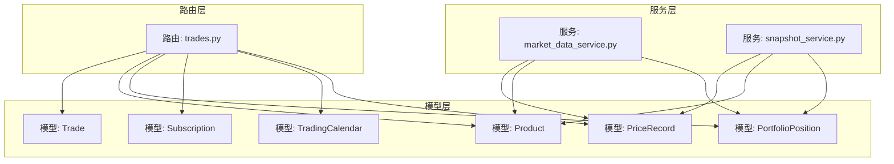
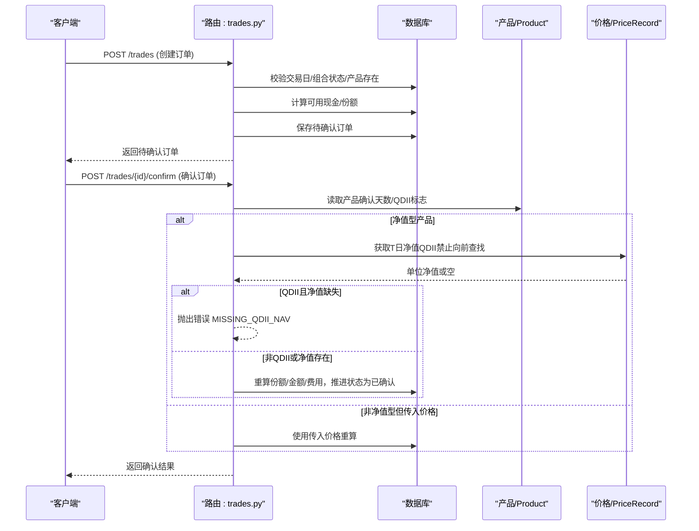
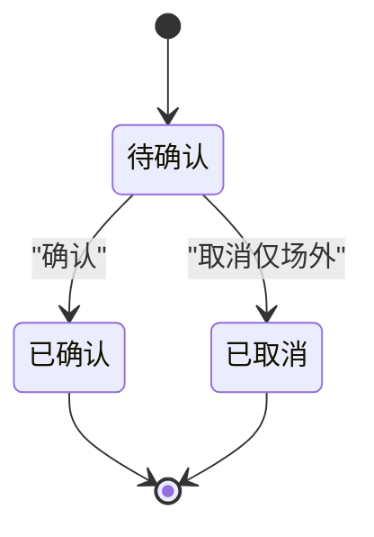
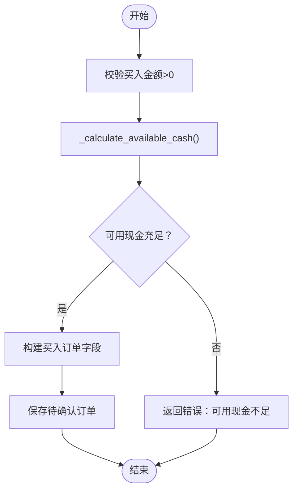
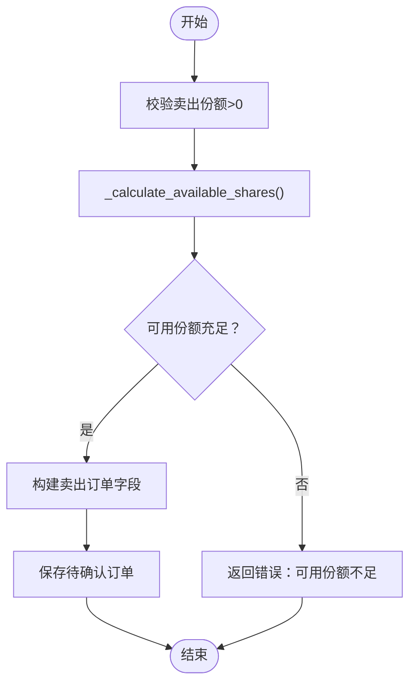
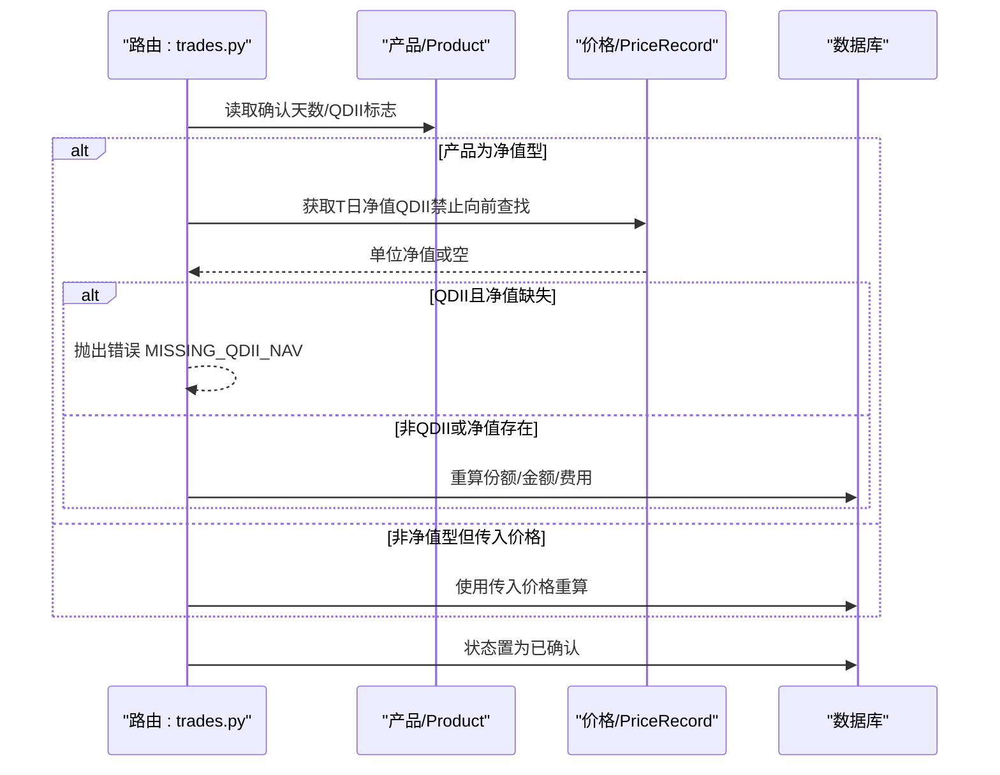
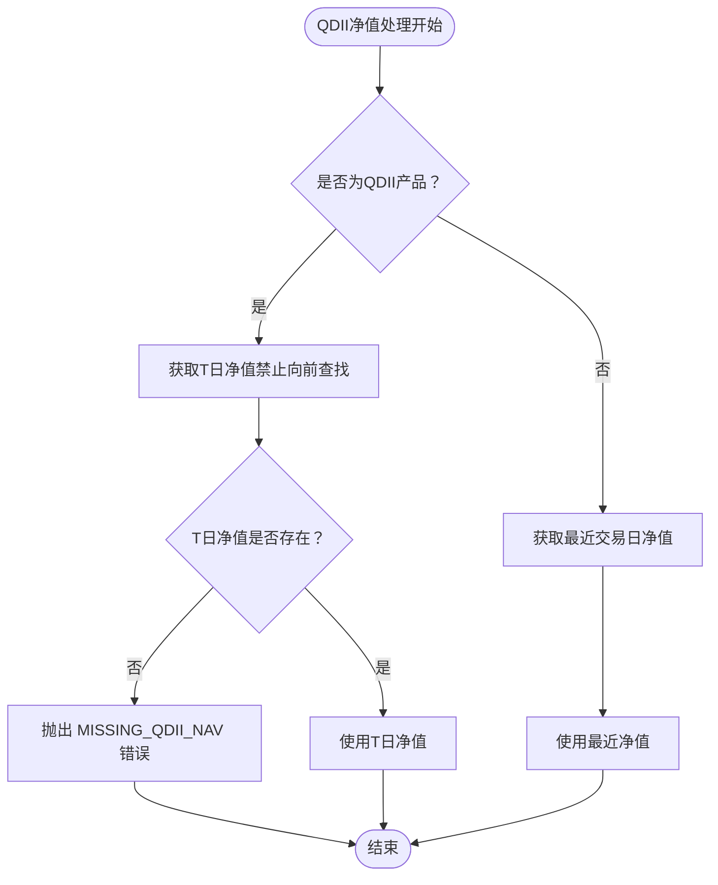
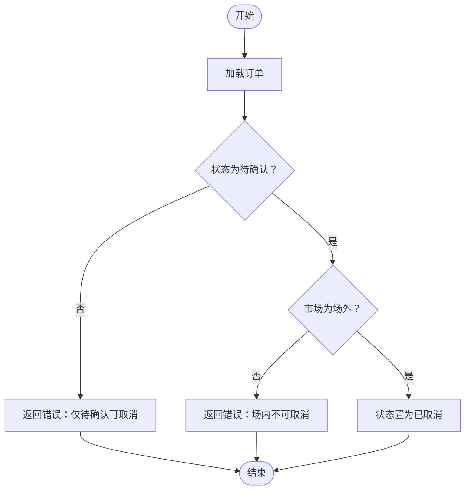
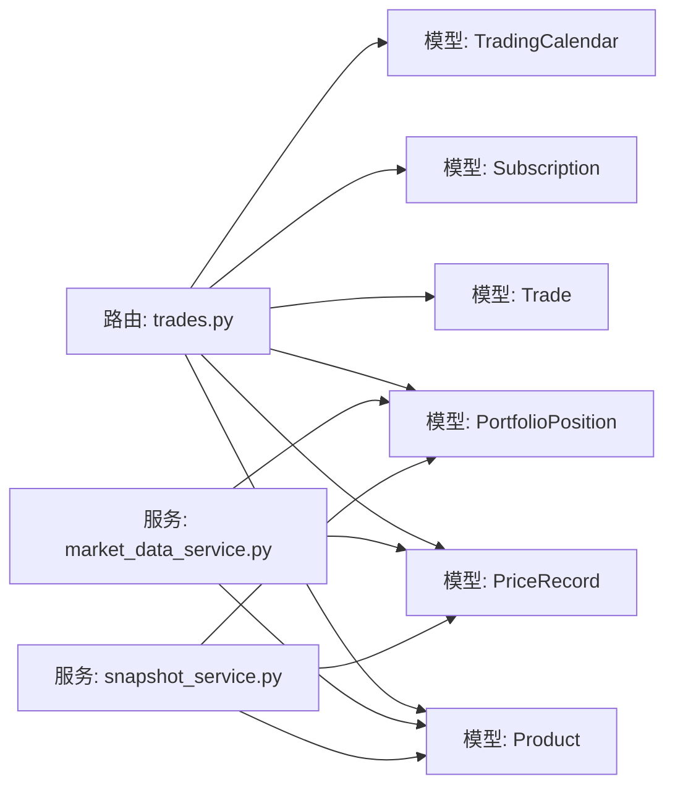

# 交易处理

<cite>
**本文引用的文件**
- [backend/app/routers/trades.py](file://backend/app/routers/trades.py)
- [backend/app/models/trade.py](file://backend/app/models/trade.py)
- [backend/app/schemas/trade.py](file://backend/app/schemas/trade.py)
- [backend/app/models/portfolio_position.py](file://backend/app/models/portfolio_position.py)
- [backend/app/models/product.py](file://backend/app/models/product.py)
- [backend/app/models/subscription.py](file://backend/app/models/subscription.py)
- [backend/app/models/trading_calendar.py](file://backend/app/models/trading_calendar.py)
- [backend/app/models/price_record.py](file://backend/app/models/price_record.py)
- [backend/app/services/market_data_service.py](file://backend/app/services/market_data_service.py)
- [backend/app/services/snapshot_service.py](file://backend/app/services/snapshot_service.py)
- [Docs/03-业务流程设计.md](file://Docs/03-业务流程设计.md)
</cite>

## 更新摘要
**变更内容**
- 新增QDII基金严格的T日NAV要求和错误处理机制
- 增强交易确认流程，区分QDII和非QDII产品的净值获取策略
- 改进净值获取算法，实现向前查找限制和异常处理
- 新增QDII基金估值逻辑，包括T日和T-1日净值的应用场景

## 目录
1. [引言](#引言)
2. [项目结构](#项目结构)
3. [核心组件](#核心组件)
4. [架构总览](#架构总览)
5. [详细组件分析](#详细组件分析)
6. [依赖分析](#依赖分析)
7. [性能考虑](#性能考虑)
8. [故障排查指南](#故障排查指南)
9. [结论](#结论)
10. [附录](#附录)

## 引言
本文件围绕交易处理功能进行全面技术文档化，覆盖买入、卖出与调仓（以"买入"和"卖出"组合体现）的业务流程与实现细节，包括订单创建、执行、取消与状态管理；交易费用与资金结算机制；交易撮合与价格优先、时间优先规则的落地方式；交易 API 的接口定义、参数校验与错误处理；风控机制（可用现金/份额计算、最大仓位与流动性检查）；以及批量交易处理、交易回测与交易记录查询能力的现状与扩展建议。文档同时给出关键流程的可视化图示，并提供性能优化与并发控制策略。

**更新重点**：本次更新特别强化了QDII基金交易处理的严格性，包括T日NAV要求、错误处理机制和跨场景的净值应用策略。

## 项目结构
交易处理功能主要由以下层次构成：
- 路由层：提供交易相关的 HTTP 接口，负责请求解析、权限校验与调用服务层。
- 模型层：定义交易、产品、持仓、订阅、交易日历与价格记录等核心实体及其约束。
- 服务层：封装数据访问与业务逻辑，包括净值计算、快照生成和QDII特殊处理。

**更新**：新增了专门的QDII净值处理逻辑和服务层的快照验证机制。

**图表来源**
- [backend/app/routers/trades.py:108-567](file://backend/app/routers/trades.py#L108-L567)
- [backend/app/models/trade.py:5-32](file://backend/app/models/trade.py#L5-L32)
- [backend/app/models/product.py:5-22](file://backend/app/models/product.py#L5-L22)
- [backend/app/models/portfolio_position.py:5-34](file://backend/app/models/portfolio_position.py#L5-L34)
- [backend/app/models/subscription.py:5-21](file://backend/app/models/subscription.py#L5-L21)
- [backend/app/models/trading_calendar.py:5-13](file://backend/app/models/trading_calendar.py#L5-L13)
- [backend/app/models/price_record.py:5-28](file://backend/app/models/price_record.py#L5-L28)
- [backend/app/services/market_data_service.py:15-323](file://backend/app/services/market_data_service.py#L15-L323)
- [backend/app/services/snapshot_service.py:370-569](file://backend/app/services/snapshot_service.py#L370-L569)

**章节来源**
- [backend/app/routers/trades.py:108-567](file://backend/app/routers/trades.py#L108-L567)
- [backend/app/models/trade.py:5-32](file://backend/app/models/trade.py#L5-L32)
- [backend/app/models/product.py:5-22](file://backend/app/models/product.py#L5-L22)
- [backend/app/models/portfolio_position.py:5-34](file://backend/app/models/portfolio_position.py#L5-L34)
- [backend/app/models/subscription.py:5-21](file://backend/app/models/subscription.py#L5-L21)
- [backend/app/models/trading_calendar.py:5-13](file://backend/app/models/trading_calendar.py#L5-L13)
- [backend/app/models/price_record.py:5-28](file://backend/app/models/price_record.py#L5-L28)
- [backend/app/services/market_data_service.py:15-323](file://backend/app/services/market_data_service.py#L15-L323)
- [backend/app/services/snapshot_service.py:370-569](file://backend/app/services/snapshot_service.py#L370-L569)

## 核心组件
- 交易模型 Trade：存储交易订单的字段（组合代码、产品代码、市场、交易类型、份额、金额、成交价、费用、实际金额、交易日期、确认日期、状态、备注等），并定义与产品表的联合外键约束。
- 产品模型 Product：记录产品类型、确认天数、是否 QDII、数据源等信息，用于确认阶段的净值取值与确认日期推算。
- 持仓模型 PortfolioPosition：记录组合在某一日的持仓明细（份额、冻结份额、成本价、单位净值、市值、金额、冻结金额、快照日期），并包含"净值型/非净值型"的互斥约束与唯一索引。
- 订阅模型 Subscription：记录申购/赎回订单（含申请日期、确认日期、状态等），用于可用现金计算。
- 交易日历模型 TradingCalendar：记录交易日开关，用于确认日期推算与交易日校验。
- 价格记录模型 PriceRecord：记录每日净值或收盘价等，用于净值型产品确认与回测/估值。

**更新**：新增了QDII产品的严格净值处理逻辑，区分T日和T-1日净值的应用场景。

**章节来源**
- [backend/app/models/trade.py:5-32](file://backend/app/models/trade.py#L5-L32)
- [backend/app/models/product.py:5-22](file://backend/app/models/product.py#L5-L22)
- [backend/app/models/portfolio_position.py:5-34](file://backend/app/models/portfolio_position.py#L5-L34)
- [backend/app/models/subscription.py:5-21](file://backend/app/models/subscription.py#L5-L21)
- [backend/app/models/trading_calendar.py:5-13](file://backend/app/models/trading_calendar.py#L5-L13)
- [backend/app/models/price_record.py:5-28](file://backend/app/models/price_record.py#L5-L28)

## 架构总览
交易处理的总体流程如下：
- 创建订单：校验交易日与组合状态，按交易类型（买入/卖出）进行参数校验与可用性检查（可用现金/可用份额），生成待确认订单。
- 确认订单：根据产品类型（净值型/非净值型）与是否 QDII 决定净值取值策略，计算成交份额/金额与费用，推进状态至已确认。
- 取消订单：仅允许场外（CN_OTC）且状态为待确认的订单取消。
- 更新与删除：管理员可更新字段或删除订单。
- 回测与查询：通过价格记录与持仓快照支持历史回测与交易记录查询。

**更新**：确认流程中新增了QDII产品的严格T日NAV检查和错误处理机制。

**图表来源**
- [backend/app/routers/trades.py:292-504](file://backend/app/routers/trades.py#L292-L504)
- [backend/app/models/product.py:11-14](file://backend/app/models/product.py#L11-L14)
- [backend/app/models/price_record.py:11-12](file://backend/app/models/price_record.py#L11-L12)

## 详细组件分析

### 交易订单生命周期与状态机
- 待确认（pending）：订单创建后初始状态。
- 已确认（confirmed）：确认流程完成后进入。
- 已取消（cancelled）：仅场外待确认订单可取消。
- 删除：管理员可删除订单（不改变其他订单状态）。

**图表来源**
- [backend/app/routers/trades.py:417-532](file://backend/app/routers/trades.py#L417-L532)
- [backend/app/models/trade.py:21-21](file://backend/app/models/trade.py#L21-L21)

**章节来源**
- [backend/app/routers/trades.py:417-532](file://backend/app/routers/trades.py#L417-L532)
- [backend/app/models/trade.py:21-21](file://backend/app/models/trade.py#L21-L21)

### 买入流程
- 参数校验：买入金额必须大于 0。
- 可用现金检查：基于最新快照与未确认/未生成快照的交易与申购赎回进行实时计算。
- 成功后生成待确认订单，字段包括份额、金额、成交价、费用、实际金额等。

**图表来源**
- [backend/app/routers/trades.py:322-357](file://backend/app/routers/trades.py#L322-L357)
- [backend/app/routers/trades.py:128-217](file://backend/app/routers/trades.py#L128-L217)

**章节来源**
- [backend/app/routers/trades.py:322-357](file://backend/app/routers/trades.py#L322-L357)
- [backend/app/routers/trades.py:128-217](file://backend/app/routers/trades.py#L128-L217)

### 卖出流程
- 参数校验：卖出份额必须大于 0。
- 可用份额检查：基于最新快照与未确认/未生成快照的卖出进行实时计算。
- 成功后生成待确认订单。

**图表来源**
- [backend/app/routers/trades.py:358-395](file://backend/app/routers/trades.py#L358-L395)
- [backend/app/routers/trades.py:220-268](file://backend/app/routers/trades.py#L220-L268)

**章节来源**
- [backend/app/routers/trades.py:358-395](file://backend/app/routers/trades.py#L358-L395)
- [backend/app/routers/trades.py:220-268](file://backend/app/routers/trades.py#L220-L268)

### 确认流程与净值取值
- 确认日期推算：依据产品确认天数与交易日历推算下一个交易日。
- 净值型产品（场外）：
  - QDII：必须取 T 日净值，禁止向前查找；若 T 日净值缺失，抛出错误。
  - 非 QDII：取 T 日或最近交易日净值；若无净值，抛出错误。
- 非净值型产品：若传入价格则使用传入价格，否则保持原样。
- 确认后重算成交份额/金额与费用，推进状态为已确认。

**更新**：新增了严格的QDII净值处理逻辑，包括T日NAV的强制要求和错误处理机制。

**图表来源**
- [backend/app/routers/trades.py:417-504](file://backend/app/routers/trades.py#L417-L504)
- [backend/app/routers/trades.py:53-105](file://backend/app/routers/trades.py#L53-L105)
- [backend/app/models/product.py:11-14](file://backend/app/models/product.py#L11-L14)
- [backend/app/models/price_record.py:11-12](file://backend/app/models/price_record.py#L11-L12)

**章节来源**
- [backend/app/routers/trades.py:417-504](file://backend/app/routers/trades.py#L417-L504)
- [backend/app/routers/trades.py:53-105](file://backend/app/routers/trades.py#L53-L105)
- [backend/app/models/product.py:11-14](file://backend/app/models/product.py#L11-L14)
- [backend/app/models/price_record.py:11-12](file://backend/app/models/price_record.py#L11-L12)

### QDII基金净值处理机制
**新增功能**：实现了严格的QDII基金净值处理逻辑，确保调仓交易确认时使用正确的净值日期。

- **T日NAV强制要求**：QDII产品必须使用申请日（T日）的净值，禁止向前查找替代。
- **错误处理机制**：当T+2日T日净值未同步时，拒绝确认并返回具体错误信息。
- **管理员手动指定**：支持管理员通过price参数手动指定净值。
- **跨场景差异化**：调仓确认使用T日净值，快照生成使用T-1日净值。

**图表来源**
- [backend/app/routers/trades.py:53-105](file://backend/app/routers/trades.py#L53-L105)
- [Docs/03-业务流程设计.md:1833-1874](file://Docs/03-业务流程设计.md#L1833-L1874)

**章节来源**
- [backend/app/routers/trades.py:53-105](file://backend/app/routers/trades.py#L53-L105)
- [Docs/03-业务流程设计.md:1833-1874](file://Docs/03-业务流程设计.md#L1833-L1874)

### 取消流程
- 仅允许场外（CN_OTC）且状态为待确认的订单取消。
- 场内（CN_EXCHANGE）订单不可取消。

**图表来源**
- [backend/app/routers/trades.py:507-532](file://backend/app/routers/trades.py#L507-L532)

**章节来源**
- [backend/app/routers/trades.py:507-532](file://backend/app/routers/trades.py#L507-L532)

### 费用与资金结算机制
- 买入：amount = actual_amount - fee；shares = amount / price。
- 卖出：amount = shares × price；actual_amount = amount + fee。
- 确认阶段若传入价格，则按传入价格重算；否则使用系统获取的净值。
- 可用现金/份额计算均考虑未确认与未生成快照的交易与申购赎回，确保实时风控。

**更新**：确认流程中新增了QDII产品的严格净值检查，确保资金结算的准确性。

**章节来源**
- [backend/app/routers/trades.py:337-341](file://backend/app/routers/trades.py#L337-L341)
- [backend/app/routers/trades.py:375-379](file://backend/app/routers/trades.py#L375-L379)
- [backend/app/routers/trades.py:471-489](file://backend/app/routers/trades.py#L471-L489)
- [backend/app/routers/trades.py:128-217](file://backend/app/routers/trades.py#L128-L217)
- [backend/app/routers/trades.py:220-268](file://backend/app/routers/trades.py#L220-L268)

### 交易API接口说明
- GET /trades
  - 功能：分页查询交易记录。
  - 参数：portfolio_code（可选）、page、page_size。
  - 返回：items、total、page、page_size。
- POST /trades
  - 功能：创建交易订单（买入/卖出）。
  - 请求体：TradeCreate（包含 portfolio_code、product_code、market、platform_code、trade_type、shares、amount、price、fee、actual_amount、trade_date、notes 等）。
  - 校验：交易日、组合状态、产品存在、金额/份额正数、可用性检查。
  - 返回：TradeResponse。
- GET /trades/{id}
  - 功能：查询单笔交易详情。
- POST /trades/{id}/confirm
  - 功能：确认交易，支持传入 confirm_date 与 price。
  - 校验：仅待确认订单、产品类型与净值取值规则、确认日期推算。
  - 返回：确认结果与 TradeResponse。
- POST /trades/{id}/cancel
  - 功能：取消交易（仅场外待确认）。
- PUT /trades/{id}
  - 功能：更新交易字段（管理员）。
- DELETE /trades/{id}
  - 功能：删除交易（管理员）。

**更新**：确认接口新增了QDII净值检查和错误处理逻辑。

**章节来源**
- [backend/app/routers/trades.py:271-567](file://backend/app/routers/trades.py#L271-L567)
- [backend/app/schemas/trade.py:23-44](file://backend/app/schemas/trade.py#L23-L44)

### 风控机制与流动性检查
- 可用现金计算：基于最新快照现金，加上未生成快照的已确认申购、减去未生成快照的已确认赎回、减去待确认买入、减去未生成快照的已确认买入、加上未生成快照的已确认卖出。
- 可用份额计算：基于最新快照份额，减去待确认卖出、减去未生成快照的已确认卖出。
- 交易日校验：仅在交易日可提交订单。
- 市场区分：场内与场外的取消规则不同。

**更新**：新增了QDII净值缺失的风险控制机制，防止使用不准确的净值进行交易确认。

**章节来源**
- [backend/app/routers/trades.py:128-217](file://backend/app/routers/trades.py#L128-L217)
- [backend/app/routers/trades.py:220-268](file://backend/app/routers/trades.py#L220-L268)
- [backend/app/routers/trades.py:111-115](file://backend/app/routers/trades.py#L111-L115)
- [backend/app/routers/trades.py:524-528](file://backend/app/routers/trades.py#L524-L528)

### 批量交易处理、回测与查询
- 批量交易：当前路由层未提供批量创建接口，可在现有单笔创建逻辑基础上扩展。
- 回测：通过价格记录与持仓快照支持历史回测与净值计算。
- 查询：交易记录分页查询，支持按组合过滤。

**更新**：快照服务中新增了QDII净值缺失的校验机制，确保快照生成的数据完整性。

**章节来源**
- [backend/app/routers/trades.py:271-289](file://backend/app/routers/trades.py#L271-L289)
- [backend/app/services/market_data_service.py:15-54](file://backend/app/services/market_data_service.py#L15-L54)
- [backend/app/services/market_data_service.py:228-319](file://backend/app/services/market_data_service.py#L228-L319)
- [backend/app/services/snapshot_service.py:650-694](file://backend/app/services/snapshot_service.py#L650-L694)

## 依赖分析
- 路由层依赖模型层与服务层：
  - 交易路由依赖 Trade、Product、PortfolioPosition、Subscription、TradingCalendar、PriceRecord。
  - 价格服务依赖 PriceRecord、Product、PortfolioPosition、PortfolioValueSnapshot。
  - **新增**：快照服务依赖PriceRecord、Product、PortfolioPosition进行QDII净值校验。
- 模型层之间通过外键与唯一约束建立强关联，确保数据一致性与业务规则落地。

**更新**：新增了快照服务对QDII净值处理的依赖关系。

**图表来源**
- [backend/app/routers/trades.py:1-16](file://backend/app/routers/trades.py#L1-L16)
- [backend/app/services/market_data_service.py:1-13](file://backend/app/services/market_data_service.py#L1-L13)
- [backend/app/services/snapshot_service.py:370-569](file://backend/app/services/snapshot_service.py#L370-L569)

**章节来源**
- [backend/app/routers/trades.py:1-16](file://backend/app/routers/trades.py#L1-L16)
- [backend/app/services/market_data_service.py:1-13](file://backend/app/services/market_data_service.py#L1-L13)
- [backend/app/services/snapshot_service.py:370-569](file://backend/app/services/snapshot_service.py#L370-L569)

## 性能考虑
- 数据访问优化
  - 在确认流程中，按产品维度一次性加载价格记录与持仓，减少多次查询开销。
  - 对交易日历与价格记录使用索引列（日期、产品代码、市场）。
  - **新增**：QDII净值查询使用精确日期匹配，避免不必要的向前查找。
- 并发控制
  - 使用数据库事务包裹订单创建与确认的关键路径，保证一致性。
  - 对可用现金/份额计算采用"读取-计算-写入"的原子性保障，必要时引入行级锁或乐观锁。
  - **新增**：QDII净值检查使用原子查询，确保数据一致性。
- 缓存策略
  - 将常用的产品配置与交易日历缓存于内存，降低重复查询成本。
  - **新增**：QDII净值检查结果可进行短期缓存，减少重复查询。
- 批处理
  - 批量创建/确认可通过队列异步处理，避免阻塞主请求线程。

**更新**：新增了QDII净值处理的性能优化策略。

## 故障排查指南
- 交易日错误：非交易日提交订单将被拒绝，需选择交易日。
- 组合状态错误：非激活组合无法提交订单。
- 产品不存在：提交订单时需确保产品与市场匹配。
- 金额/份额校验失败：买入金额必须大于 0；卖出份额必须大于 0。
- 可用性不足：买入金额超出现金可用额度；卖出份额超出可用份额。
- 确认失败：净值型产品 T 日净值缺失（特别是 QDII）导致无法确认。
- 取消失败：场内订单不可取消；仅待确认订单可取消。

**新增**：QDII相关错误排查
- **MISSING_QDII_NAV**：QDII产品T日净值尚未同步，需等待T+2日或手动指定净值。
- **QDII净值缺失**：检查净值同步任务是否正常运行，确认T日数据是否已导入。
- **快照生成失败**：检查QDII净值缺失校验，确保T-1日净值数据完整。

**章节来源**
- [backend/app/routers/trades.py:298-336](file://backend/app/routers/trades.py#L298-L336)
- [backend/app/routers/trades.py:417-504](file://backend/app/routers/trades.py#L417-L504)
- [backend/app/routers/trades.py:507-532](file://backend/app/routers/trades.py#L507-L532)
- [backend/app/services/snapshot_service.py:650-694](file://backend/app/services/snapshot_service.py#L650-L694)

## 结论
该交易系统以清晰的模型与路由分层实现了从订单创建到确认、取消与查询的完整闭环。通过交易日历、产品属性与价格记录的协同，系统在净值型产品的确认流程中严格遵循 T 日规则与 QDII 特例。可用现金/份额的实时计算提供了基础风控能力。

**更新重点**：本次更新显著增强了QDII基金交易处理的严谨性，通过严格的T日NAV要求和完善的错误处理机制，确保了交易确认的准确性和合规性。快照服务中的QDII净值校验进一步保证了数据质量。

后续可在批量处理、撮合引擎与更细粒度的风控策略上进一步增强，以满足更高吞吐与复杂交易场景的需求。

## 附录
- 术语
  - T 日：交易日当日；T+n：按产品确认天数推算的确认日。
  - 净值型产品：场外基金等以净值作为定价基准的产品。
  - 场内/场外：CN_EXCHANGE/CN_OTC，分别对应交易所与场外市场。
  - **新增**：QDII：合格境内机构投资者，跨境投资基金，存在T+2净值延迟。
- 扩展建议
  - 引入撮合引擎：实现价格优先与时间优先的自动配对与成交。
  - 风控增强：最大仓位限制、流动性阈值、滑点控制等。
  - 回测框架：基于历史价格记录与订单流水进行策略回测。
  - 并发优化：订单队列、分布式锁、幂等性保障与重试策略。
  - **新增**：QDII净值监控：建立净值缺失预警机制，确保及时发现和处理问题。
  - **新增**：快照数据校验：定期检查QDII净值数据完整性，防止数据不一致。