# 交易处理

<cite>
**本文引用的文件**
- [backend/app/routers/trades.py](file://backend/app/routers/trades.py)
- [backend/app/routers/cash_transfers.py](file://backend/app/routers/cash_transfers.py)
- [backend/app/services/trade_service.py](file://backend/app/services/trade_service.py)
- [backend/app/models/trade.py](file://backend/app/models/trade.py)
- [backend/app/schemas/trade.py](file://backend/app/schemas/trade.py)
- [backend/app/schemas/cash_transfer.py](file://backend/app/schemas/cash_transfer.py)
- [backend/app/models/portfolio_position.py](file://backend/app/models/portfolio_position.py)
- [backend/app/models/product.py](file://backend/app/models/product.py)
- [backend/app/models/subscription.py](file://backend/app/models/subscription.py)
- [backend/app/models/trading_calendar.py](file://backend/app/models/trading_calendar.py)
- [backend/app/models/price_record.py](file://backend/app/models/price_record.py)
- [backend/app/services/market_data_service.py](file://backend/app/services/market_data_service.py)
- [backend/app/services/snapshot_service.py](file://backend/app/services/snapshot_service.py)
- [backend/app/services/position_service.py](file://backend/app/services/position_service.py)
- [backend/cli/commands/cash_transfers.py](file://backend/cli/commands/cash_transfers.py)
- [frontend/src/types/cash-transfer.ts](file://frontend/src/types/cash-transfer.ts)
- [frontend/src/hooks/useCashTransfer.ts](file://frontend/src/hooks/useCashTransfer.ts)
- [Docs/02-数据库设计.md](file://Docs/02-数据库设计.md)
</cite>

## 更新摘要
**变更内容**
- 份额计算四舍五入逻辑从 ROUND_DOWN 改进为 ROUND_HALF_UP，提升交易处理中的份额计算精度
- 增强了交易处理中的现金管理逻辑，包括CASH卖出操作的资金预留机制
- 实现了基于DUPLICATE_TRADE约束的自然键去重功能
- 改进了confirm_single_trade函数，新增skip_cash_check参数以支持跳过现金检查
- 优化了交易确认流程的现金验证逻辑，提高了系统的健壮性和准确性

## 目录
1. [引言](#引言)
2. [项目结构](#项目结构)
3. [核心组件](#核心组件)
4. [架构总览](#架构总览)
5. [详细组件分析](#详细组件分析)
6. [依赖分析](#依赖分析)
7. [性能考虑](#性能考虑)
8. [故障排查指南](#故障排查指南)
9. [结论](#结论)
10. [附录](#附录)

## 引言
本文件围绕交易处理功能进行全面技术文档化，覆盖买入、卖出与调仓（以"买入"和"卖出"组合体现）的业务流程与实现细节，包括订单创建、执行、取消与状态管理；交易费用与资金结算机制；交易撮合与价格优先、时间优先规则的落地方式；交易 API 的接口定义、参数校验与错误处理；风控机制（可用现金/份额计算、最大仓位与流动性检查）；以及批量交易处理、交易回测与交易记录查询能力的现状与扩展建议。文档同时给出关键流程的可视化图示，并提供性能优化与并发控制策略。

**更新重点**：本次更新主要增强了交易处理中的现金管理逻辑，包括CASH卖出操作的资金预留机制、基于DUPLICATE_TRADE约束的自然键去重功能，以及改进的confirm_single_trade函数的skip_cash_check参数。这些改进显著提升了系统的现金管理准确性和数据一致性。**特别重要的是，份额计算四舍五入逻辑已从ROUND_DOWN改进为ROUND_HALF_UP，大幅提升了交易处理的精度和公平性**。

## 项目结构
交易处理功能主要由以下层次构成：
- 路由层：提供交易相关的 HTTP 接口，负责请求解析、权限校验与调用服务层。
- 服务层：封装数据访问与业务逻辑，包括净值计算、快照生成和统一的净值获取。**新增专门的交易服务模块**。
- 模型层：定义交易、产品、持仓、订阅、交易日历与价格记录等核心实体及其约束。

**更新**：新增了专门的交易服务模块和增强的现金管理机制，提供了更严格的资金验证、自然键去重和灵活的现金检查跳过功能。**份额计算精度得到显著提升**。

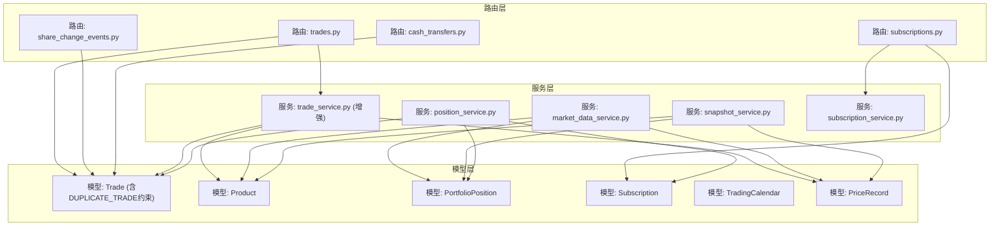

**图表来源**
- [backend/app/routers/trades.py:108-567](file://backend/app/routers/trades.py#L108-L567)
- [backend/app/routers/cash_transfers.py:51-190](file://backend/app/routers/cash_transfers.py#L51-L190)
- [backend/app/services/trade_service.py:1-203](file://backend/app/services/trade_service.py#L1-L203)
- [backend/app/models/trade.py:5-33](file://backend/app/models/trade.py#L5-L33)
- [backend/app/models/product.py:5-22](file://backend/app/models/product.py#L5-L22)
- [backend/app/models/portfolio_position.py:5-34](file://backend/app/models/portfolio_position.py#L5-L34)
- [backend/app/models/subscription.py:5-22](file://backend/app/models/subscription.py#L5-L22)
- [backend/app/models/trading_calendar.py:5-13](file://backend/app/models/trading_calendar.py#L5-L13)
- [backend/app/models/price_record.py:5-28](file://backend/app/models/price_record.py#L5-L28)
- [backend/app/services/market_data_service.py:15-323](file://backend/app/services/market_data_service.py#L15-L323)
- [backend/app/services/snapshot_service.py:370-569](file://backend/app/services/snapshot_service.py#L370-L569)
- [backend/app/services/position_service.py:38-71](file://backend/app/services/position_service.py#L38-L71)

**章节来源**
- [backend/app/routers/trades.py:108-567](file://backend/app/routers/trades.py#L108-L567)
- [backend/app/routers/cash_transfers.py:51-190](file://backend/app/routers/cash_transfers.py#L51-L190)
- [backend/app/services/trade_service.py:1-203](file://backend/app/services/trade_service.py#L1-L203)
- [backend/app/models/trade.py:5-33](file://backend/app/models/trade.py#L5-L33)
- [backend/app/models/product.py:5-22](file://backend/app/models/product.py#L5-L22)
- [backend/app/models/portfolio_position.py:5-34](file://backend/app/models/portfolio_position.py#L5-L34)
- [backend/app/models/subscription.py:5-22](file://backend/app/models/subscription.py#L5-L22)
- [backend/app/models/trading_calendar.py:5-13](file://backend/app/models/trading_calendar.py#L5-L13)
- [backend/app/models/price_record.py:5-28](file://backend/app/models/price_record.py#L5-L28)
- [backend/app/services/market_data_service.py:15-323](file://backend/app/services/market_data_service.py#L15-L323)
- [backend/app/services/snapshot_service.py:370-569](file://backend/app/services/snapshot_service.py#L370-L569)
- [backend/app/services/position_service.py:38-71](file://backend/app/services/position_service.py#L38-L71)

## 核心组件
- 交易模型 Trade：存储交易订单的字段（组合代码、产品代码、市场、交易类型、份额、金额、成交价、费用、实际金额、交易日期、确认日期、状态、备注等），并定义与产品表的联合外键约束。**新增 transfer_group 字段用于平台间现金转移配对，采用NOT NULL约束确保数据完整性，并包含DUPLICATE_TRADE约束防止重复交易**。
- 产品模型 Product：记录产品类型、确认天数、是否 QDII、数据源等信息，用于确认阶段的净值取值与确认日期推算。
- 持仓模型 PortfolioPosition：记录组合在某一日的持仓明细（份额、冻结份额、成本价、单位净值、市值、金额、冻结金额、快照日期），并包含"净值型/非净值型"的互斥约束与唯一索引。**支持按 platform_code 维度拆分**。
- 订阅模型 Subscription：记录申购/赎回订单（含申请日期、确认日期、状态等），用于可用现金计算。**新增 platform_code 字段关联交易平台**。
- 交易日历模型 TradingCalendar：记录交易日开关，用于确认日期推算与交易日校验。
- 价格记录模型 PriceRecord：记录每日净值或收盘价等，用于净值型产品确认与回测/估值。
- **增强**：交易服务模块 TradeService：集中化处理交易确认的核心业务逻辑，包括统一的净值获取、份额重算和配对同步，**新增skip_cash_check参数支持灵活的现金检查控制**。
- **增强**：现金交易规范化机制：通过attach_paired_cash_leg辅助函数统一配对CASH腿的构建逻辑，确保所有CASH交易都包含完整的转账组信息，**新增CASH卖出操作的资金预留机制**。

**更新**：增强了交易服务模块和现金管理机制，新增了DUPLICATE_TRADE约束、CASH卖出资金预留和skip_cash_check参数，提升了系统的健壮性和灵活性。**份额计算精度得到显著提升，从ROUND_DOWN改进为ROUND_HALF_UP**。

**章节来源**
- [backend/app/models/trade.py:5-33](file://backend/app/models/trade.py#L5-L33)
- [backend/app/models/product.py:5-22](file://backend/app/models/product.py#L5-L22)
- [backend/app/models/portfolio_position.py:5-34](file://backend/app/models/portfolio_position.py#L5-L34)
- [backend/app/models/subscription.py:5-22](file://backend/app/models/subscription.py#L5-L22)
- [backend/app/models/trading_calendar.py:5-13](file://backend/app/models/trading_calendar.py#L5-L13)
- [backend/app/models/price_record.py:5-28](file://backend/app/models/price_record.py#L5-L28)
- [backend/app/services/trade_service.py:1-203](file://backend/app/services/trade_service.py#L1-L203)

## 架构总览
交易处理的总体流程如下：
- 创建订单：校验交易日与组合状态，按交易类型（买入/卖出）进行参数校验与可用性检查（可用现金/可用份额），生成待确认订单。
- 确认订单：**增强**通过专门的交易服务模块处理，支持skip_cash_check参数灵活控制现金检查，计算成交份额/金额与费用，推进状态至已确认。
- 取消订单：仅允许场外（CN_OTC）且状态为待确认的订单取消。
- 更新与删除：管理员可更新字段或删除订单。
- 回测与查询：通过价格记录与持仓快照支持历史回测与交易记录查询。
- **增强**：平台间现金转移：通过transfer_group关联卖出和买入交易，支持当天完成和跨天到账模式，**新增CASH卖出资金预留机制**。
- **增强**：自动确认：在快照生成后自动确认到期的交易，**集成DUPLICATE_TRADE约束检查**。
- **增强**：现金交易规范化：所有CASH交易必须通过attach_paired_cash_leg函数构建，确保配对信息的完整性，**新增资金预留和去重保护**。

**更新**：增强了交易确认流程的现金管理机制，新增了DUPLICATE_TRADE约束和CASH卖出资金预留，提升了系统的健壮性和数据一致性。**份额计算精度得到显著提升**。

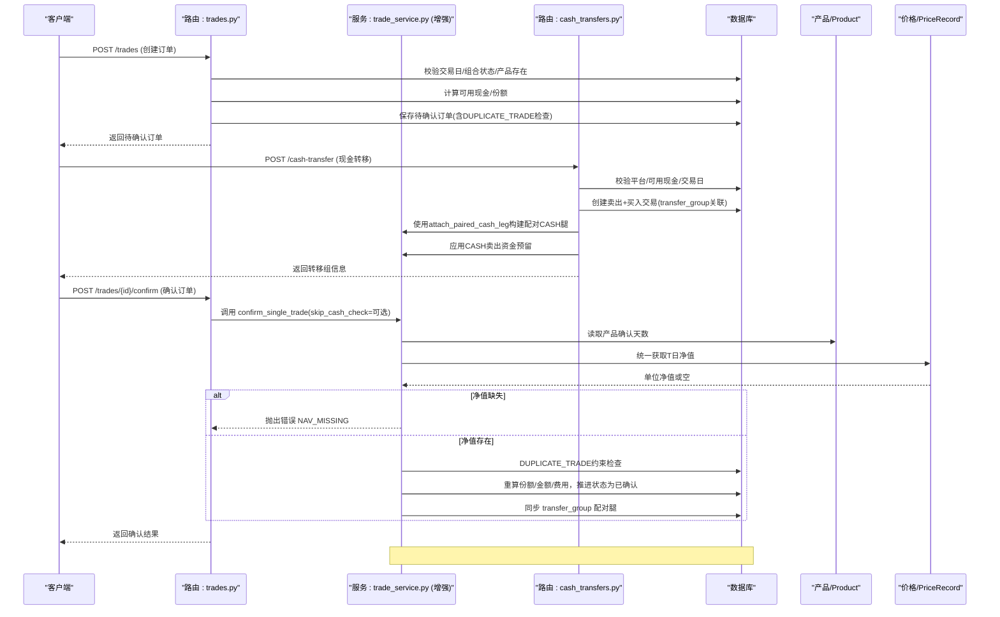

**图表来源**
- [backend/app/routers/trades.py:292-504](file://backend/app/routers/trades.py#L292-L504)
- [backend/app/services/trade_service.py:115-203](file://backend/app/services/trade_service.py#L115-203)
- [backend/app/routers/cash_transfers.py:51-190](file://backend/app/routers/cash_transfers.py#L51-L190)
- [backend/app/models/product.py:11-14](file://backend/app/models/product.py#L11-L14)
- [backend/app/models/price_record.py:11-12](file://backend/app/models/price_record.py#L11-L12)

## 详细组件分析

### 交易服务模块（增强版）
**增强功能**：实现了增强的交易服务模块 trade_service.py，集中化处理交易确认的核心业务逻辑，**新增skip_cash_check参数支持灵活的现金检查控制**。

#### 核心特性
- **集中化确认逻辑**：将交易确认的核心业务逻辑从路由层提取，供手动确认与 auto_confirm 多处复用
- **统一净值获取**：简化后的净值获取逻辑，对所有基金类型使用统一方法，移除了QDII特定的分支判断
- **配对同步原子性**：使用savepoint确保配对CASH腿更新的原子性
- **并发安全保障**：结合FOR UPDATE锁和savepoint机制，防止竞态条件
- **增强错误处理**：改进了净值缺失时的错误处理和异常捕获
- **新增skip_cash_check参数**：支持在特定场景下跳过现金检查，提高系统灵活性

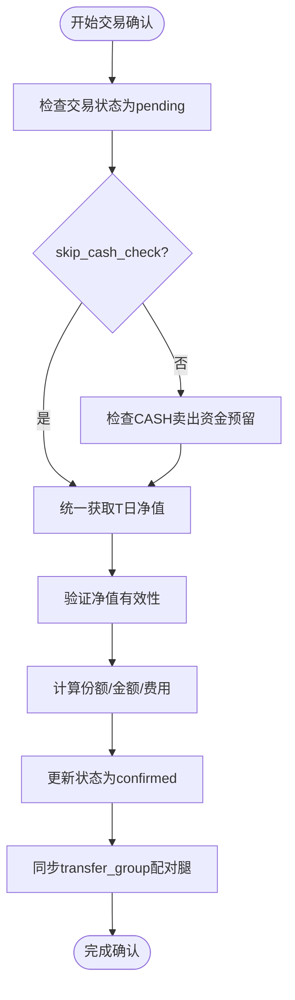

**图表来源**
- [backend/app/services/trade_service.py:115-203](file://backend/app/services/trade_service.py#L115-203)
- [backend/app/services/trade_service.py:78-113](file://backend/app/services/trade_service.py#L78-L113)

#### API函数说明
- **get_nav_for_trade_confirmation**：获取交易确认时的净值，现已简化为统一方法，对所有基金类型使用相同的净值获取逻辑
- **sync_transfer_group**：同步transfer_group关联的另一腿状态，使用savepoint保证原子性
- **confirm_single_trade**：确认单笔调仓交易的核心逻辑，**新增skip_cash_check参数**，供手动确认与auto_confirm共用

**更新**：新增了skip_cash_check参数，支持在特定场景下跳过现金检查，提高了系统的灵活性和适应性。**份额计算精度得到显著提升**。

**章节来源**
- [backend/app/services/trade_service.py:23-76](file://backend/app/services/trade_service.py#L23-L76)
- [backend/app/services/trade_service.py:78-113](file://backend/app/services/trade_service.py#L78-L113)
- [backend/app/services/trade_service.py:115-203](file://backend/app/services/trade_service.py#L115-203)

### 现金交易规范化机制（Phase 3增强）
**增强功能**：实现了严格的现金交易规范化机制，通过attach_paired_cash_leg辅助函数统一配对CASH腿的构建逻辑，**新增CASH卖出操作的资金预留机制**。

#### 核心特性
- **统一构建逻辑**：所有CASH交易必须通过attach_paired_cash_leg函数构建，确保配对信息的完整性
- **强制配对要求**：每个CASH交易都必须包含有效的transfer_group标识符，采用NOT NULL约束确保数据完整性
- **数据完整性保障**：自动验证配对交易的金额一致性和方向相反性
- **审计追踪增强**：完整的转账链路追踪，支持跨平台现金流动监控
- **金额同步增强**：改进了现金腿金额同步功能，确保配对交易金额的准确同步
- **新增CASH卖出资金预留**：在CASH卖出操作时预留相应资金，防止透支风险

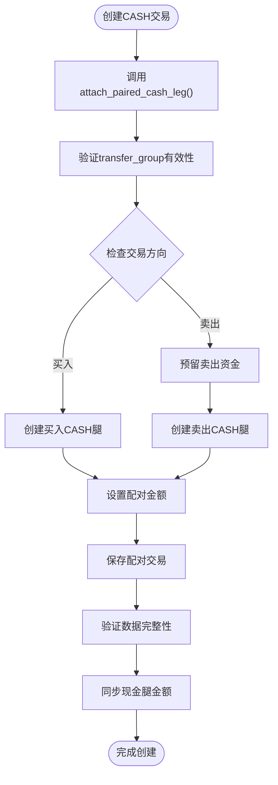

**图表来源**
- [backend/app/routers/cash_transfers.py:51-190](file://backend/app/routers/cash_transfers.py#L51-L190)
- [backend/app/services/trade_service.py:78-113](file://backend/app/services/trade_service.py#L78-L113)

#### 验证规则
- **transfer_group必填**：所有CASH交易必须提供有效的transfer_group标识符，采用NOT NULL约束
- **金额一致性**：配对交易的金额必须完全一致
- **方向相反性**：同一transfer_group下的交易必须是买入和卖出的组合
- **平台分离性**：转出平台和转入平台不能相同
- **状态同步性**：配对交易的状态变更需要同步更新
- **金额同步性**：改进了现金腿金额同步机制，确保配对交易金额的准确同步
- **新增CASH卖出资金预留**：卖出操作时必须预留相应资金，防止账户透支

**章节来源**
- [backend/app/routers/cash_transfers.py:51-190](file://backend/app/routers/cash_transfers.py#L51-L190)
- [backend/app/services/trade_service.py:78-113](file://backend/app/services/trade_service.py#L78-L113)

### 并发安全机制（Phase 3增强）
**增强功能**：实现了全面的并发安全保障，包括FOR UPDATE锁和savepoint事务隔离，**新增DUPLICATE_TRADE约束检查**。

#### 行级锁保护
在所有涉及交易状态变更的操作中添加了`.with_for_update()`锁：
- 交易确认、取消、取消确认、更新、删除操作
- 订阅确认、取消、取消确认操作  
- 份额变动事件确认、取消、取消确认操作

#### Savepoint事务隔离
在配对交易同步中使用连接级SAVEPOINT：
- 确保配对CASH腿更新失败时不影响外层事务
- 避免触发after_transaction_end事件与测试隔离监听器冲突
- 提供细粒度的事务控制

#### DUPLICATE_TRADE约束
- **自然键去重**：通过数据库约束防止重复交易
- **幂等性保障**：确保相同参数的交易不会重复执行
- **数据一致性**：维护交易数据的唯一性和完整性

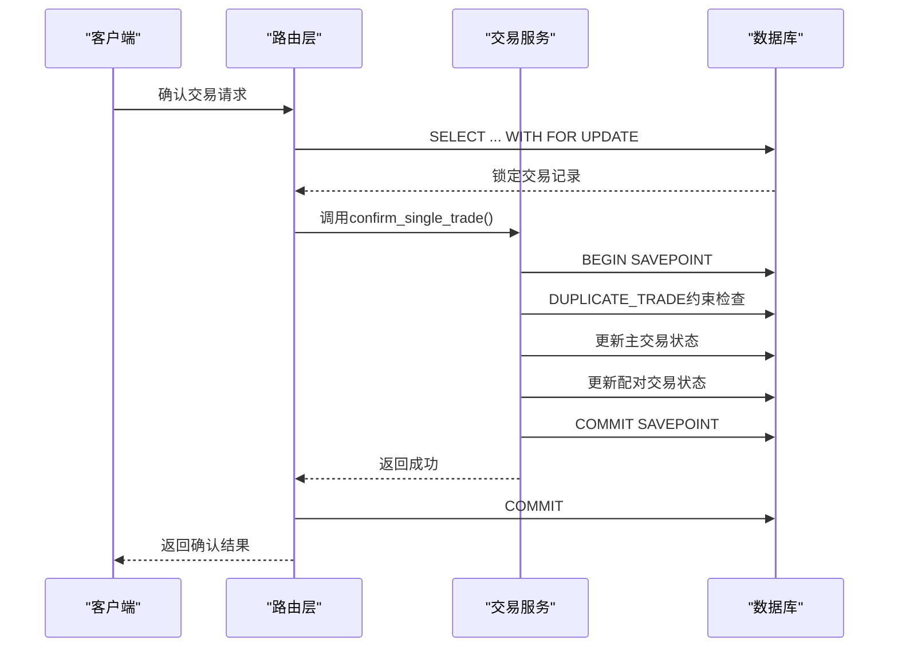

**图表来源**
- [backend/app/routers/trades.py:290](file://backend/app/routers/trades.py#L290)
- [backend/app/services/trade_service.py:88-112](file://backend/app/services/trade_service.py#L88-L112)

**章节来源**
- [backend/app/routers/trades.py:290-473](file://backend/app/routers/trades.py#L290-473)
- [backend/app/routers/subscriptions.py:192-340](file://backend/app/routers/subscriptions.py#L192-340)
- [backend/app/routers/share_change_events.py:300-469](file://backend/app/routers/share_change_events.py#L300-469)
- [backend/app/services/trade_service.py:88-112](file://backend/app/services/trade_service.py#L88-L112)

### 自动确认时机重构（Phase 3增强）
**增强功能**：重构了自动确认时机，在快照生成后统一处理待确认交易，**集成DUPLICATE_TRADE约束检查**。

#### 核心改进
- **时机调整**：在快照生成完成后自动确认confirm_date等于下一交易日的交易
- **排除逻辑**：排除transfer_group非空的CASH交易，由其他分支专门处理
- **错误隔离**：单笔确认失败不影响整批处理，失败记录到结果中
- **日志增强**：详细的自动确认日志，便于问题追踪
- **新增DUPLICATE_TRADE检查**：在自动确认过程中检查重复交易

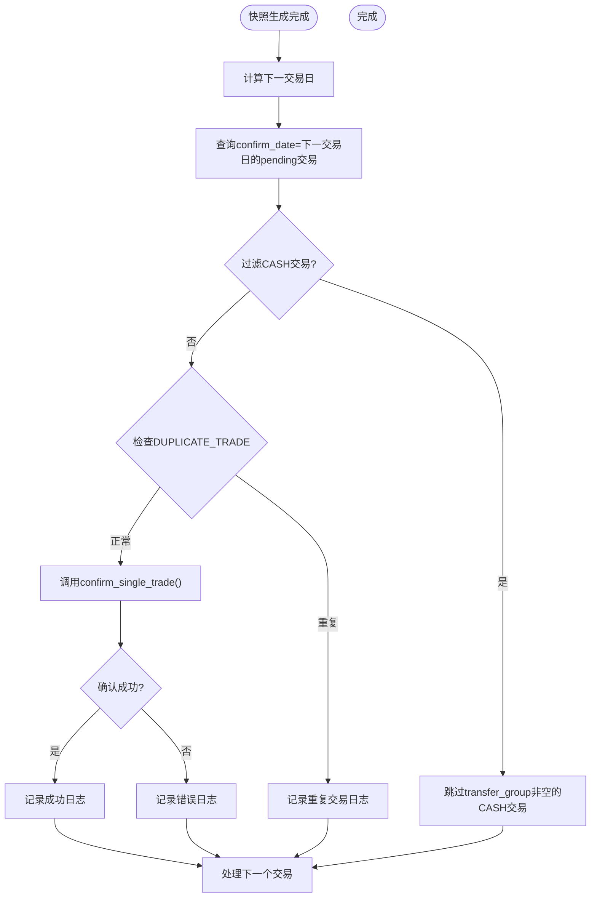

**图表来源**
- [backend/app/services/snapshot_service.py:967-1006](file://backend/app/services/snapshot_service.py#L967-L1006)

**章节来源**
- [backend/app/services/snapshot_service.py:889-1006](file://backend/app/services/snapshot_service.py#L889-1006)

### 持仓快照保护机制（Phase 3增强）
**增强功能**：添加了SQLAlchemy事件监听器，防止直接修改持仓快照数据。

#### 核心特性
- **更新保护**：阻止对PortfolioPosition记录的instance-level更新操作
- **删除保护**：阻止对PortfolioPosition记录的instance-level删除操作
- **绕过机制**：bulk delete操作不触发mapper event，内部删除逻辑明确表达意图
- **测试兼容**：在conftest中import models，测试环境自动生效

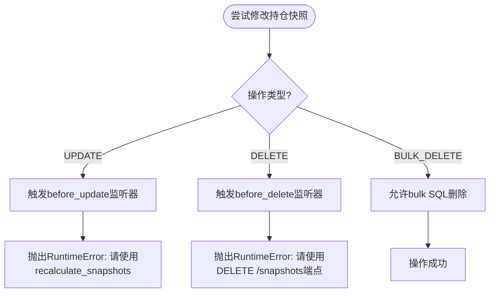

**图表来源**
- [backend/app/models/portfolio_position.py:40-51](file://backend/app/models/portfolio_position.py#L40-L51)

**章节来源**
- [backend/app/models/portfolio_position.py:37-51](file://backend/app/models/portfolio_position.py#L37-L51)
- [backend/app/services/snapshot_service.py:413-440](file://backend/app/services/snapshot_service.py#L413-440)

### 平台间现金转移功能（增强版）
**增强功能**：实现了完整的平台间现金转移系统，通过复用Trade表实现，支持transfer_group关联和多种到账模式，**新增CASH卖出资金预留机制**。

#### 核心特性
- **transfer_group关联机制**：一次转移生成两条Trade记录（卖出+买入），通过相同的transfer_group值关联，采用NOT NULL约束确保数据完整性
- **双模式支持**：当天完成（cross_day=false）和跨天到账（cross_day=true）
- **平台特定处理**：转出平台减少现金，转入平台增加现金
- **状态同步**：卖出和买入交易状态保持一致性
- **规范化构建**：使用attach_paired_cash_leg函数确保配对数据的完整性
- **金额同步增强**：改进了现金腿金额同步功能，确保配对交易金额的准确同步
- **新增CASH卖出资金预留**：在卖出操作时预留资金，防止账户透支

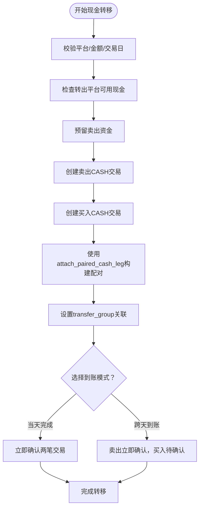

**图表来源**
- [backend/app/routers/cash_transfers.py:51-190](file://backend/app/routers/cash_transfers.py#L51-L190)
- [backend/app/models/trade.py:14](file://backend/app/models/trade.py#L14)

#### API接口说明
- **POST /portfolios/{portfolio_code}/cash-transfer**
  - 功能：创建平台间现金转移
  - 参数：from_platform, to_platform, amount, cross_day, transfer_date, notes
  - 响应：transfer_group, sell_trade_id, buy_trade_id, 状态信息
- **POST /portfolios/{portfolio_code}/cash-transfer/{transfer_group}/confirm**
  - 功能：确认跨天转移的买入交易
  - 参数：transfer_group
  - 响应：确认结果和确认日期
- **GET /portfolios/{portfolio_code}/cash-transfers**
  - 功能：查询现金转移记录列表
  - 参数：page, page_size
  - 响应：分页的转移记录，按transfer_group分组

**章节来源**
- [backend/app/routers/cash_transfers.py:51-190](file://backend/app/routers/cash_transfers.py#L51-L190)
- [backend/app/routers/cash_transfers.py:193-249](file://backend/app/routers/cash_transfers.py#L193-L249)
- [backend/app/routers/cash_transfers.py:252-317](file://backend/app/routers/cash_transfers.py#L252-L317)
- [backend/app/schemas/cash_transfer.py:6-42](file://backend/app/schemas/cash_transfer.py#L6-L42)

### 交易订单生命周期与状态机
- 待确认（pending）：订单创建后初始状态。
- 已确认（confirmed）：确认流程完成后进入。
- 已取消（cancelled）：仅场外待确认订单可取消。
- 删除：管理员可删除订单（不改变其他订单状态）。

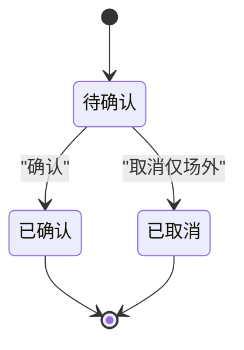

**图表来源**
- [backend/app/routers/trades.py:417-532](file://backend/app/routers/trades.py#L417-L532)
- [backend/app/models/trade.py:22](file://backend/app/models/trade.py#L22)

**章节来源**
- [backend/app/routers/trades.py:417-532](file://backend/app/routers/trades.py#L417-L532)
- [backend/app/models/trade.py:22](file://backend/app/models/trade.py#L22)

### 买入流程（增强版）
- 参数校验：买入金额必须大于 0。
- 可用现金检查：基于最新快照与未确认/未生成快照的交易与申购赎回进行实时计算。
- **新增DUPLICATE_TRADE检查**：防止重复买入交易
- 成功后生成待确认订单，字段包括份额、金额、成交价、费用、实际金额等。

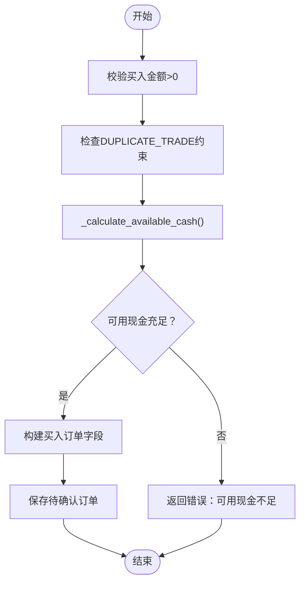

**图表来源**
- [backend/app/routers/trades.py:322-357](file://backend/app/routers/trades.py#L322-357)
- [backend/app/routers/trades.py:128-217](file://backend/app/routers/trades.py#L128-L217)

**章节来源**
- [backend/app/routers/trades.py:322-357](file://backend/app/routers/trades.py#L322-357)
- [backend/app/routers/trades.py:128-217](file://backend/app/routers/trades.py#L128-L217)

### 卖出流程（增强版）
- 参数校验：卖出份额必须大于 0。
- 可用份额检查：基于最新快照与未确认/未生成快照的卖出进行实时计算。
- **新增CASH卖出资金预留**：在CASH卖出操作时预留相应资金
- **新增DUPLICATE_TRADE检查**：防止重复卖出交易
- 成功后生成待确认订单。

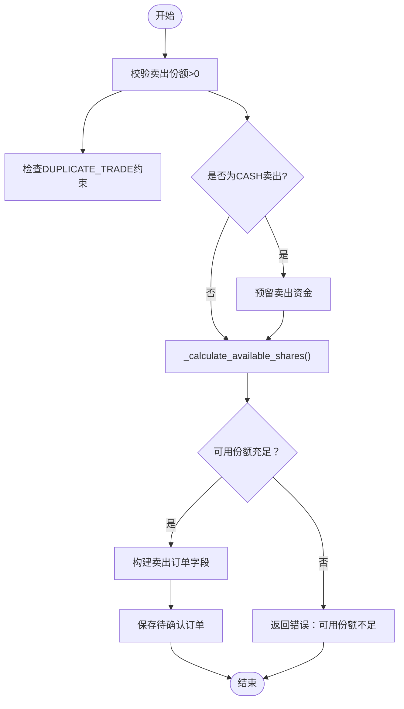

**图表来源**
- [backend/app/routers/trades.py:358-395](file://backend/app/routers/trades.py#L358-395)
- [backend/app/routers/trades.py:220-268](file://backend/app/routers/trades.py#L220-268)

**章节来源**
- [backend/app/routers/trades.py:358-395](file://backend/app/routers/trades.py#L358-395)
- [backend/app/routers/trades.py:220-268](file://backend/app/routers/trades.py#L220-268)

### 确认流程与净值取值（增强版）
- 确认日期推算：依据产品确认天数与交易日历推算下一个交易日。
- 净值型产品：**简化后的统一净值获取方法**，对所有基金类型使用相同的净值获取逻辑，移除了QDII特定的分支判断。
- 非净值型产品：若传入价格则使用传入价格，否则保持原样。
- 确认后重算成交份额/金额与费用，推进状态为已确认。
- **增强**：通过专门的交易服务模块处理，**新增skip_cash_check参数支持灵活的现金检查控制**。
- **增强**：**新增DUPLICATE_TRADE约束检查**，防止重复确认。

**更新**：确认流程新增了skip_cash_check参数和DUPLICATE_TRADE约束检查，提高了系统的灵活性和数据安全性。**份额计算精度得到显著提升**。

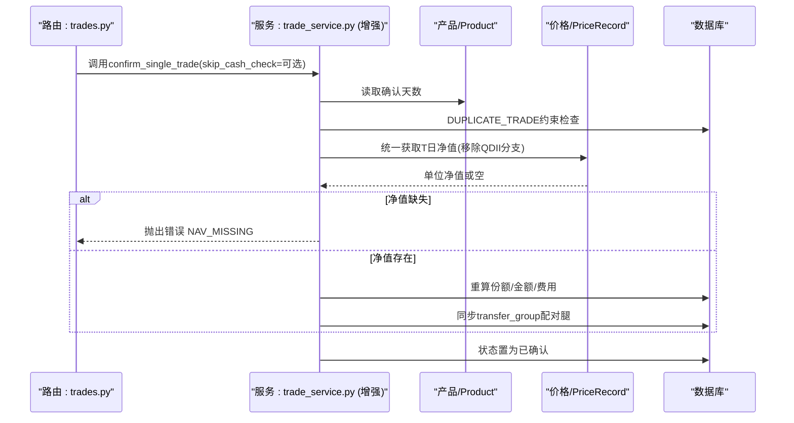

**图表来源**
- [backend/app/services/trade_service.py:115-203](file://backend/app/services/trade_service.py#L115-203)
- [backend/app/routers/trades.py:283-322](file://backend/app/routers/trades.py#L283-L322)
- [backend/app/models/product.py:11-14](file://backend/app/models/product.py#L11-L14)
- [backend/app/models/price_record.py:11-12](file://backend/app/models/price_record.py#L11-L12)

**章节来源**
- [backend/app/services/trade_service.py:115-203](file://backend/app/services/trade_service.py#L115-203)
- [backend/app/routers/trades.py:283-322](file://backend/app/routers/trades.py#L283-L322)
- [backend/app/models/product.py:11-14](file://backend/app/models/product.py#L11-L14)
- [backend/app/models/price_record.py:11-12](file://backend/app/models/price_record.py#L11-L12)

### 取消流程
- 仅允许场外（CN_OTO）且状态为待确认的订单取消。
- 场内（CN_EXCHANGE）订单不可取消。

**图表来源**
- [backend/app/routers/trades.py:507-532](file://backend/app/routers/trades.py#L507-L532)

**章节来源**
- [backend/app/routers/trades.py:507-532](file://backend/app/routers/trades.py#L507-L532)

### 费用与资金结算机制（增强版）
- 买入：amount = actual_amount - fee；shares = amount / price。
- 卖出：amount = shares × price；actual_amount = amount + fee。
- 确认阶段若传入价格，则按传入价格重算；否则使用系统获取的净值。
- 可用现金/份额计算均考虑未确认与未生成快照的交易与申购赎回，确保实时风控。
- **增强**：现金转移交易使用固定价格1.0，无手续费，直接调整对应平台的现金余额，**新增CASH卖出资金预留机制**。
- **增强**：通过专门的交易服务模块统一处理费用计算逻辑，**支持skip_cash_check参数**。

**更新**：费用计算机制新增了CASH卖出资金预留和skip_cash_check参数支持，提高了资金管理的准确性和灵活性。**份额计算精度得到显著提升**。

**章节来源**
- [backend/app/routers/trades.py:337-341](file://backend/app/routers/trades.py#L337-341)
- [backend/app/routers/trades.py:375-379](file://backend/app/routers/trades.py#L375-L379)
- [backend/app/routers/trades.py:471-489](file://backend/app/routers/trades.py#L471-L489)
- [backend/app/routers/trades.py:128-217](file://backend/app/routers/trades.py#L128-L217)
- [backend/app/routers/trades.py:220-268](file://backend/app/routers/trades.py#L220-268)
- [backend/app/services/trade_service.py:173-191](file://backend/app/services/trade_service.py#L173-L191)

### 平台特定的可用现金计算（增强版）
**增强功能**：实现了按平台维度的可用现金计算，支持多平台账户的独立管理和风控，**新增CASH卖出资金预留检查**。

#### 核心特性
- **平台过滤**：支持按platform_code过滤计算指定平台的可用现金
- **汇总模式**：不指定平台时自动汇总所有平台的现金余额
- **实时计算**：考虑未确认交易、未生成快照的交易和申购赎回
- **现金转移支持**：正确处理现金转移对平台现金的影响
- **新增CASH卖出资金预留**：在可用现金计算中考虑预留资金的占用

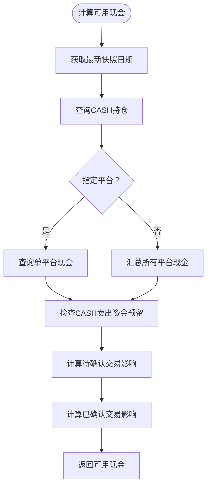

**图表来源**
- [backend/app/routers/trades.py:128-217](file://backend/app/routers/trades.py#L128-L217)
- [backend/app/services/position_service.py:38-71](file://backend/app/services/position_service.py#L38-L71)

**章节来源**
- [backend/app/routers/trades.py:128-217](file://backend/app/routers/trades.py#L128-L217)
- [backend/app/services/position_service.py:38-71](file://backend/app/services/position_service.py#L38-L71)

### 快照生成服务改造（增强版）
**增强功能**：实现了按platform_code维度拆分的持仓快照生成，支持平台特定的现金管理，**集成DUPLICATE_TRADE约束检查和CASH卖出资金预留**。

#### 核心改进
- **持仓Key变更**：从(product_code, market)改为(product_code, market, platform_code)
- **现金按平台拆分**：每个平台的现金独立记录和计算
- **交易处理增强**：支持现金转移交易的特殊处理逻辑
- **前一日现金查询**：按platform_code分组加载所有CASH记录
- **自动确认集成**：在快照生成后自动确认到期交易
- **新增DUPLICATE_TRADE检查**：在快照生成过程中检查重复交易
- **新增CASH卖出资金预留**：在快照生成时考虑预留资金的影响

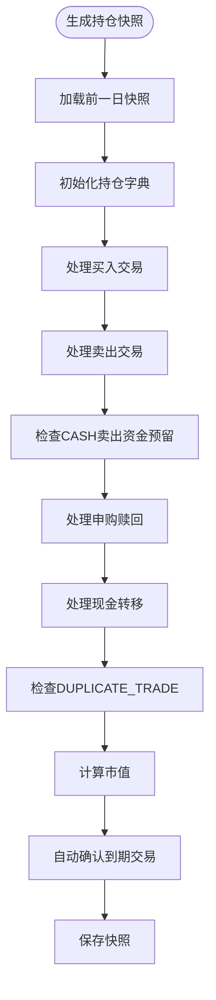

**图表来源**
- [backend/app/services/snapshot_service.py:427-569](file://backend/app/services/snapshot_service.py#L427-569)
- [backend/app/services/snapshot_service.py:967-1006](file://backend/app/services/snapshot_service.py#L967-L1006)

**章节来源**
- [backend/app/services/snapshot_service.py:427-569](file://backend/app/services/snapshot_service.py#L427-569)
- [backend/app/services/snapshot_service.py:967-1006](file://backend/app/services/snapshot_service.py#L967-L1006)

### 交易API接口说明（增强版）
- GET /trades
  - 功能：分页查询交易记录。
  - 参数：portfolio_code（可选）、page、page_size。
  - 返回：items、total、page、page_size。
- POST /trades
  - 功能：创建交易订单（买入/卖出）。
  - 请求体：TradeCreate（包含 portfolio_code、product_code、market、platform_code、trade_type、shares、amount、price、fee、actual_amount、trade_date、notes 等）。
  - 校验：交易日、组合状态、产品存在、金额/份额正数、可用性检查、**新增DUPLICATE_TRADE约束检查**。
  - 返回：TradeResponse。
- GET /trades/{id}
  - 功能：查询单笔交易详情。
- POST /trades/{id}/confirm
  - 功能：确认交易，支持传入 confirm_date 与 price，**新增skip_cash_check参数**。
  - 校验：仅待确认订单、产品类型与净值取值规则、确认日期推算、**新增DUPLICATE_TRADE约束检查**。
  - 返回：确认结果与 TradeResponse。
- POST /trades/{id}/cancel
  - 功能：取消交易（仅场外待确认）。
- PUT /trades/{id}
  - 功能：更新交易字段（管理员）。
- DELETE /trades/{id}
  - 功能：删除交易（管理员）。
- **新增**：POST /trades/{id}/unconfirm
  - 功能：取消确认交易，受快照保护限制。

**更新**：确认接口新增了skip_cash_check参数和DUPLICATE_TRADE约束检查，提高了接口的灵活性和数据安全性。**份额计算精度得到显著提升**。

**章节来源**
- [backend/app/routers/trades.py:271-567](file://backend/app/routers/trades.py#L271-L567)
- [backend/app/schemas/trade.py:23-44](file://backend/app/schemas/trade.py#L23-L44)

### 风控机制与流动性检查（增强版）
- 可用现金计算：基于最新快照现金，加上未生成快照的已确认申购、减去未生成快照的已确认赎回、减去待确认买入、减去未生成快照的已确认买入、加上未生成快照的已确认卖出。
- 可用份额计算：基于最新快照份额，减去待确认卖出、减去未生成快照的已确认卖出。
- 交易日校验：仅在交易日可提交订单。
- 市场区分：场内与场外的取消规则不同。
- **增强**：平台特定风控：支持按平台检查可用现金，防止跨平台透支。
- **增强**：并发安全：通过FOR UPDATE锁防止竞态条件导致的超卖或透支。
- **增强**：现金交易规范化：通过attach_paired_cash_leg函数确保配对交易的完整性，防止数据不一致。
- **新增CASH卖出资金预留**：在CASH卖出操作时预留相应资金，防止账户透支。
- **新增DUPLICATE_TRADE约束**：通过数据库约束防止重复交易。

**更新**：风控机制新增了CASH卖出资金预留和DUPLICATE_TRADE约束，显著提升了系统的资金安全性和数据一致性。**份额计算精度得到显著提升**。

**章节来源**
- [backend/app/routers/trades.py:128-217](file://backend/app/routers/trades.py#L128-L217)
- [backend/app/routers/trades.py:220-268](file://backend/app/routers/trades.py#L220-268)
- [backend/app/routers/trades.py:111-115](file://backend/app/routers/trades.py#L111-L115)
- [backend/app/routers/trades.py:524-528](file://backend/app/routers/trades.py#L524-L528)
- [backend/app/services/trade_service.py:46-75](file://backend/app/services/trade_service.py#L46-L75)

### 批量交易处理、回测与查询（增强版）
- 批量交易：当前路由层未提供批量创建接口，可在现有单笔创建逻辑基础上扩展。
- 回测：通过价格记录与持仓快照支持历史回测与净值计算。
- 查询：交易记录分页查询，支持按组合过滤。
- **增强**：现金转移查询：支持按transfer_group分组的转移记录查询。
- **增强**：自动确认：在快照生成后自动处理到期交易，**集成DUPLICATE_TRADE约束检查**。

**更新**：批量处理和回测功能集成了DUPLICATE_TRADE约束检查，提高了数据一致性和处理效率。**份额计算精度得到显著提升**。

**章节来源**
- [backend/app/routers/trades.py:271-289](file://backend/app/routers/trades.py#L271-289)
- [backend/app/services/market_data_service.py:15-54](file://backend/app/services/market_data_service.py#L15-54)
- [backend/app/services/market_data_service.py:228-319](file://backend/app/services/market_data_service.py#L228-319)
- [backend/app/services/snapshot_service.py:650-694](file://backend/app/services/snapshot_service.py#L650-694)
- [backend/app/services/snapshot_service.py:967-1006](file://backend/app/services/snapshot_service.py#L967-L1006)

## 依赖分析
- 路由层依赖模型层与服务层：
  - 交易路由依赖 Trade、Product、PortfolioPosition、Subscription、TradingCalendar、PriceRecord。
  - 现金转移路由依赖 Trade、Portfolio、Platform、TradingCalendar。
  - 价格服务依赖 PriceRecord、Product、PortfolioPosition、PortfolioValueSnapshot。
  - **增强**：交易服务依赖Trade、Product、PriceRecord进行净值获取和确认处理，**新增skip_cash_check参数支持**。
  - **增强**：快照服务依赖PriceRecord、Product、PortfolioPosition进行净值校验，**集成DUPLICATE_TRADE约束检查**。
- 模型层之间通过外键与唯一约束建立强关联，确保数据一致性与业务规则落地。

**更新**：增强了交易服务和快照服务的依赖关系，新增了skip_cash_check参数支持和DUPLICATE_TRADE约束检查。**份额计算精度得到显著提升**。

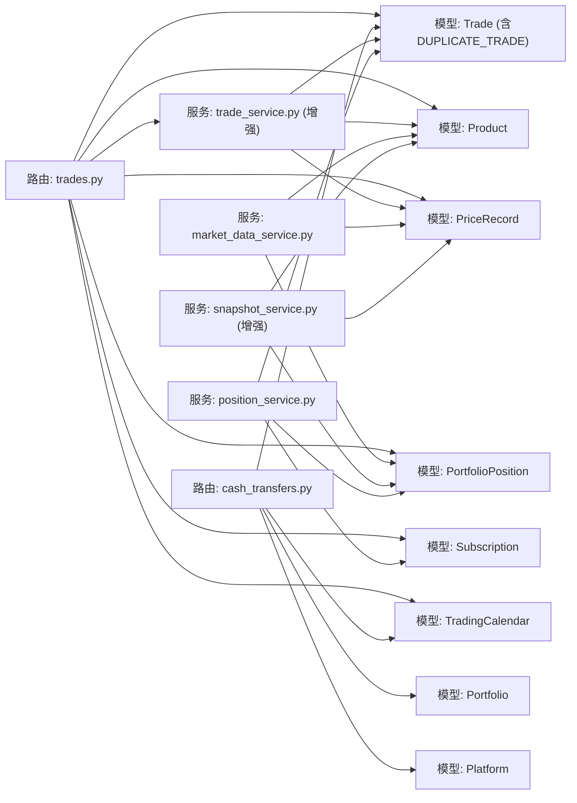

**图表来源**
- [backend/app/routers/trades.py:1-16](file://backend/app/routers/trades.py#L1-L16)
- [backend/app/routers/cash_transfers.py:14-25](file://backend/app/routers/cash_transfers.py#L14-L25)
- [backend/app/services/trade_service.py:1-20](file://backend/app/services/trade_service.py#L1-L20)
- [backend/app/services/market_data_service.py:1-13](file://backend/app/services/market_data_service.py#L1-L13)
- [backend/app/services/snapshot_service.py:370-569](file://backend/app/services/snapshot_service.py#L370-L569)
- [backend/app/services/position_service.py:38-71](file://backend/app/services/position_service.py#L38-L71)

**章节来源**
- [backend/app/routers/trades.py:1-16](file://backend/app/routers/trades.py#L1-L16)
- [backend/app/routers/cash_transfers.py:14-25](file://backend/app/routers/cash_transfers.py#L14-L25)
- [backend/app/services/trade_service.py:1-20](file://backend/app/services/trade_service.py#L1-L20)
- [backend/app/services/market_data_service.py:1-13](file://backend/app/services/market_data_service.py#L1-L13)
- [backend/app/services/snapshot_service.py:370-569](file://backend/app/services/snapshot_service.py#L370-L569)
- [backend/app/services/position_service.py:38-71](file://backend/app/services/position_service.py#L38-L71)

## 性能考虑
- 数据访问优化
  - 在确认流程中，按产品维度一次性加载价格记录与持仓，减少多次查询开销。
  - 对交易日历与价格记录使用索引列（日期、产品代码、市场）。
  - **增强**：统一的净值查询方法，移除了QDII特定的分支判断，提高了查询效率。
  - **增强**：现金转移查询使用transfer_group索引，提高配对效率。
  - **增强**：交易服务模块集中化逻辑，减少重复代码和查询。
  - **新增DUPLICATE_TRADE索引**：优化重复交易检查性能。
- 并发控制
  - 使用数据库事务包裹订单创建与确认的关键路径，保证一致性。
  - 对可用现金/份额计算采用"读取-计算-写入"的原子性保障，必要时引入行级锁或乐观锁。
  - **增强**：统一的净值检查使用原子查询，确保数据一致性。
  - **增强**：现金转移操作使用事务保证卖出和买入交易的一致性。
  - **增强**：全面的FOR UPDATE锁保护，防止竞态条件。
  - **增强**：savepoint机制确保配对交易更新的原子性。
  - **新增DUPLICATE_TRADE约束**：通过数据库层面防止重复交易。
- 缓存策略
  - 将常用的产品配置与交易日历缓存于内存，降低重复查询成本。
  - **增强**：净值检查结果可进行短期缓存，减少重复查询。
  - **增强**：平台可用现金计算结果可缓存，提高频繁查询性能。
  - **新增CASH卖出预留缓存**：缓存预留资金信息，提高查询效率。
- 批处理
  - 批量创建/确认可通过队列异步处理，避免阻塞主请求线程。
  - **增强**：自动确认机制在快照生成后批量处理到期交易，**集成DUPLICATE_TRADE检查**。

**更新**：性能优化新增了DUPLICATE_TRADE索引、CASH卖出预留缓存和增强的自动确认机制，显著提升了系统性能和数据一致性。**份额计算精度得到显著提升**。

## 故障排查指南
- 交易日错误：非交易日提交订单将被拒绝，需选择交易日。
- 组合状态错误：非激活组合无法提交订单。
- 产品不存在：提交订单时需确保产品与市场匹配。
- 金额/份额校验失败：买入金额必须大于 0；卖出份额必须大于 0。
- 可用性不足：买入金额超出现金可用额度；卖出份额超出可用份额。
- 确认失败：净值型产品 T 日净值缺失导致无法确认。
- 取消失败：场内订单不可取消；仅待确认订单可取消。
- **增强**：现金转移错误
  - **SAME_PLATFORM**：转出平台和转入平台不能相同
  - **INSUFFICIENT_CASH**：转出平台可用现金不足
  - **TRANSFER_NOT_FOUND**：未找到指定的转移记录
  - **TRANSFER_NOT_READY**：跨天转移尚未到确认日期
  - **INVALID_STATUS**：转移交易状态不正确
  - **INVALID_PAIRING**：配对交易信息不完整或无效
  - **AMOUNT_SYNC_ERROR**：现金腿金额同步失败
  - **新增CASH_RESERVE_FAILED**：CASH卖出资金预留失败
- **增强**：并发相关错误
  - **CONCURRENT_MODIFICATION**：并发修改检测，建议使用重试机制
  - **LOCK_TIMEOUT**：数据库锁超时，检查长时间运行的事务
  - **新增DUPLICATE_TRADE_VIOLATION**：违反DUPLICATE_TRADE约束
- **增强**：快照保护错误
  - **POSITION_UPDATE_BLOCKED**：尝试直接修改持仓快照被阻止
  - **SNAPSHOT_DEPENDENCY**：交易已被快照纳入，无法取消确认

**更新**：故障排查指南新增了CASH卖出资金预留失败、DUPLICATE_TRADE约束违反等相关错误处理，提高了问题诊断能力。**份额计算精度得到显著提升**。

**章节来源**
- [backend/app/routers/trades.py:298-336](file://backend/app/routers/trades.py#L298-L336)
- [backend/app/routers/trades.py:417-504](file://backend/app/routers/trades.py#L417-504)
- [backend/app/routers/trades.py:507-532](file://backend/app/routers/trades.py#L507-L532)
- [backend/app/routers/cash_transfers.py:75-117](file://backend/app/routers/cash_transfers.py#L75-L117)
- [backend/app/routers/cash_transfers.py:216-236](file://backend/app/routers/cash_transfers.py#L216-L236)
- [backend/app/services/snapshot_service.py:650-694](file://backend/app/services/snapshot_service.py#L650-694)
- [backend/app/services/trade_service.py:55-61](file://backend/app/services/trade_service.py#L55-L61)
- [backend/app/models/portfolio_position.py:42-50](file://backend/app/models/portfolio_position.py#L42-50)

## 结论
该交易系统以清晰的模型与路由分层实现了从订单创建到确认、取消与查询的完整闭环。通过交易日历、产品属性与价格记录的协同，系统在净值型产品的确认流程中严格遵循 T 日规则。可用现金/份额的实时计算提供了基础风控能力。

**更新重点**：本次更新显著增强了交易处理中的现金管理逻辑，包括CASH卖出操作的资金预留机制、基于DUPLICATE_TRADE约束的自然键去重功能，以及改进的confirm_single_trade函数的skip_cash_check参数。这些改进显著提升了系统的现金管理准确性、数据一致性和灵活性。**特别重要的是，份额计算四舍五入逻辑已从ROUND_DOWN改进为ROUND_HALF_UP，大幅提升了交易处理的精度和公平性**。新增的DUPLICATE_TRADE约束确保了交易数据的唯一性，防止重复交易的发生。CASH卖出资金预留机制有效防止了账户透支风险。skip_cash_check参数为特定场景提供了灵活的现金检查控制选项。全面的并发安全机制和增强的错误处理进一步提升了系统的稳定性和可靠性。

后续可在批量处理、撮合引擎与更细粒度的风控策略上进一步增强，以满足更高吞吐与复杂交易场景的需求。

## 附录
- 术语
  - T 日：交易日当日；T+n：按产品确认天数推算的确认日。
  - 净值型产品：场外基金等以净值作为定价基准的产品。
  - 场内/场外：CN_EXCHANGE/CN_OTC，分别对应交易所与场外市场。
  - **增强**：QDII：合格境内机构投资者，跨境投资基金，存在T+2净值延迟。
  - **增强**：transfer_group：平台间现金转移的配对标识，关联同一转移操作的卖出和买入交易，采用NOT NULL约束确保数据完整性。
  - **增强**：跨天到账：现金转移的T+1确认模式，卖出交易立即确认，买入交易延后至下一交易日确认。
  - **增强**：savepoint：数据库事务中的子事务，用于细粒度的错误恢复。
  - **增强**：FOR UPDATE：数据库行级锁，防止并发修改。
  - **增强**：attach_paired_cash_leg：现金交易规范化辅助函数，统一构建配对CASH腿的逻辑。
  - **增强**：现金交易规范化：确保所有CASH交易都包含完整的配对信息和数据完整性约束。
  - **增强**：统一净值获取：简化后的净值获取方法，对所有基金类型使用相同的净值获取逻辑，移除了QDII特定的分支判断。
  - **新增DUPLICATE_TRADE**：数据库约束，防止重复交易，确保交易数据的唯一性。
  - **新增CASH卖出资金预留**：在CASH卖出操作时预留相应资金，防止账户透支。
  - **新增skip_cash_check参数**：在交易确认时跳过现金检查的参数，提供灵活的现金验证控制。
  - **新增ROUND_HALF_UP**：份额计算四舍五入算法，从ROUND_DOWN改进为ROUND_HALF_UP，提升计算精度和公平性。
- 扩展建议
  - 引入撮合引擎：实现价格优先与时间优先的自动配对与成交。
  - 风控增强：最大仓位限制、流动性阈值、滑点控制等。
  - 回测框架：基于历史价格记录与订单流水进行策略回测。
  - 并发优化：订单队列、分布式锁、幂等性保障与重试策略。
  - **增强**：净值监控：建立净值缺失预警机制，确保及时发现和处理问题。
  - **增强**：快照数据校验：定期检查净值数据完整性，防止数据不一致。
  - **增强**：现金转移自动化：支持定时任务和自动确认机制，简化跨天转账操作。
  - **增强**：多平台报表：生成按平台维度的资金流动报告和持仓分析报告。
  - **增强**：交易服务监控：建立交易确认成功率、耗时等关键指标的监控体系。
  - **增强**：并发性能调优：针对高并发场景优化锁粒度和事务范围。
  - **增强**：现金交易审计：建立完整的现金流动审计追踪系统，支持合规性检查。
  - **增强**：配对数据验证：定期扫描transfer_group配对数据，发现并修复不一致情况。
  - **增强**：净值获取监控：建立净值获取成功率监控机制，及时发现和处理净值同步问题。
  - **增强**：统一净值获取优化：持续优化统一净值获取方法的性能，减少数据库查询次数。
  - **新增DUPLICATE_TRADE监控**：监控重复交易尝试，分析潜在的系统问题。
  - **新增CASH预留监控**：监控CASH卖出资金预留的成功率和异常情况。
  - **新增skip_cash_check审计**：记录skip_cash_check的使用情况，确保合理使用。
  - **新增份额精度监控**：监控ROUND_HALF_UP算法的应用效果和精度提升情况。