# 交易处理

<cite>
**本文引用的文件**
- [backend/app/routers/trades.py](file://backend/app/routers/trades.py)
- [backend/app/routers/cash_transfers.py](file://backend/app/routers/cash_transfers.py)
- [backend/app/services/trade_service.py](file://backend/app/services/trade_service.py)
- [backend/app/models/trade.py](file://backend/app/models/trade.py)
- [backend/app/schemas/trade.py](file://backend/app/schemas/trade.py)
- [backend/app/schemas/cash_transfer.py](file://backend/app/schemas/cash_transfer.py)
- [backend/app/models/portfolio_position.py](file://backend/app/models/portfolio_position.py)
- [backend/app/models/product.py](file://backend/app/models/product.py)
- [backend/app/models/subscription.py](file://backend/app/models/subscription.py)
- [backend/app/models/trading_calendar.py](file://backend/app/models/trading_calendar.py)
- [backend/app/models/price_record.py](file://backend/app/models/price_record.py)
- [backend/app/services/market_data_service.py](file://backend/app/services/market_data_service.py)
- [backend/app/services/snapshot_service.py](file://backend/app/services/snapshot_service.py)
- [backend/app/services/position_service.py](file://backend/app/services/position_service.py)
- [backend/cli/commands/cash_transfers.py](file://backend/cli/commands/cash_transfers.py)
- [frontend/src/types/cash-transfer.ts](file://frontend/src/types/cash-transfer.ts)
- [frontend/src/hooks/useCashTransfer.ts](file://frontend/src/hooks/useCashTransfer.ts)
- [backend/app/utils/quantize.py](file://backend/app/utils/quantize.py)
- [backend/app/services/subscription_service.py](file://backend/app/services/subscription_service.py)
- [backend/app/services/share_change_event_service.py](file://backend/app/services/share_change_event_service.py)
- [backend/tests/unit/test_quantize.py](file://backend/tests/unit/test_quantize.py)
- [backend/tests/integration/test_shares_precision.py](file://backend/tests/integration/test_shares_precision.py)
- [backend/alembic/versions/0004_shares_precision_2_digits.py](file://backend/alembic/versions/0004_shares_precision_2_digits.py)
</cite>

## 更新摘要
**变更内容**
- **新增金额量化增强功能**：所有服务层和API路由都实现了金额字段的统一量化保护
- **统一的舍入规则**：采用ROUND_HALF_UP（四舍五入）模式，符合场外基金行业惯例
- **全链路覆盖**：交易服务、订阅服务、现金转账服务、持仓服务、份额变动事件服务都新增了金额量化逻辑
- **API安全保护**：所有涉及金额的API接口都增加了输入验证和量化处理
- **精度一致性**：确保所有金融计算都使用2位小数精度，避免浮点数精度问题

## 目录
1. [引言](#引言)
2. [项目结构](#项目结构)
3. [核心组件](#核心组件)
4. [架构总览](#架构总览)
5. [详细组件分析](#详细组件分析)
6. [依赖分析](#依赖分析)
7. [性能考虑](#性能考虑)
8. [故障排查指南](#故障排查指南)
9. [结论](#结论)
10. [附录](#附录)

## 引言
本文件围绕交易处理功能进行全面技术文档化，覆盖买入、卖出与调仓（以"买入"和"卖出"组合体现）的业务流程与实现细节，包括订单创建、执行、取消与状态管理；交易费用与资金结算机制；交易撮合与价格优先、时间优先规则的落地方式；交易 API 的接口定义、参数校验与错误处理；风控机制（可用现金/份额计算、最大仓位与流动性检查）；以及批量交易处理、交易回测与交易记录查询能力的现状与扩展建议。文档同时给出关键流程的可视化图示，并提供性能优化与并发控制策略。

**更新重点**：本次更新主要实现了金额量化的重大增强，从ROUND_DOWN（向零截断）升级为ROUND_HALF_UP（四舍五入），符合场外基金行业惯例。这一变更影响了申购确认、交易处理和份额变动事件等所有金额计算场景，确保了金融计算的准确性和行业标准的一致性。同时实现了强制性的transfer group规范化，所有基金交易必须配对CASH腿，确保了数据的完整性和业务一致性。

## 项目结构
交易处理功能主要由以下层次构成：
- 路由层：提供交易相关的 HTTP 接口，负责请求解析、权限校验与调用服务层。**新增金额字段的安全量化保护**。
- 服务层：封装数据访问与业务逻辑，包括净值计算、快照生成和QDII特殊处理。**新增专门的交易服务模块和统一的金额量化逻辑**。
- 模型层：定义交易、产品、持仓、订阅、交易日历与价格记录等核心实体及其约束。
- **工具层**：**新增**份额量化工具模块，统一处理所有份额和金额计算的舍入规则。

**更新**：新增了专门的交易服务模块 trade_service.py，集中化处理交易确认的核心业务逻辑，并实现了强制性的transfer group规范化。同时引入了统一的份额量化工具，确保所有金额和份额计算都遵循ROUND_HALF_UP规则。

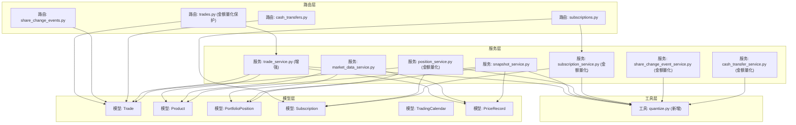

**图表来源**
- [backend/app/routers/trades.py:108-567](file://backend/app/routers/trades.py#L108-L567)
- [backend/app/routers/cash_transfers.py:51-190](file://backend/app/routers/cash_transfers.py#L51-L190)
- [backend/app/services/trade_service.py:1-203](file://backend/app/services/trade_service.py#L1-L203)
- [backend/app/utils/quantize.py:1-33](file://backend/app/utils/quantize.py#L1-L33)
- [backend/app/models/trade.py:5-33](file://backend/app/models/trade.py#L5-L33)
- [backend/app/models/product.py:5-22](file://backend/app/models/product.py#L5-L22)
- [backend/app/models/portfolio_position.py:5-34](file://backend/app/models/portfolio_position.py#L5-L34)
- [backend/app/models/subscription.py:5-22](file://backend/app/models/subscription.py#L5-L22)
- [backend/app/models/trading_calendar.py:5-13](file://backend/app/models/trading_calendar.py#L5-L13)
- [backend/app/models/price_record.py:5-28](file://backend/app/models/price_record.py#L5-L28)
- [backend/app/services/market_data_service.py:15-323](file://backend/app/services/market_data_service.py#L15-L323)
- [backend/app/services/snapshot_service.py:370-569](file://backend/app/services/snapshot_service.py#L370-L569)
- [backend/app/services/position_service.py:38-71](file://backend/app/services/position_service.py#L38-L71)

**章节来源**
- [backend/app/routers/trades.py:108-567](file://backend/app/routers/trades.py#L108-L567)
- [backend/app/routers/cash_transfers.py:51-190](file://backend/app/routers/cash_transfers.py#L51-L190)
- [backend/app/services/trade_service.py:1-203](file://backend/app/services/trade_service.py#L1-L203)
- [backend/app/utils/quantize.py:1-33](file://backend/app/utils/quantize.py#L1-L33)
- [backend/app/models/trade.py:5-33](file://backend/app/models/trade.py#L5-L33)
- [backend/app/models/product.py:5-22](file://backend/app/models/product.py#L5-L22)
- [backend/app/models/portfolio_position.py:5-34](file://backend/app/models/portfolio_position.py#L5-L34)
- [backend/app/models/subscription.py:5-22](file://backend/app/models/subscription.py#L5-L22)
- [backend/app/models/trading_calendar.py:5-13](file://backend/app/models/trading_calendar.py#L5-L13)
- [backend/app/models/price_record.py:5-28](file://backend/app/models/price_record.py#L5-L28)
- [backend/app/services/market_data_service.py:15-323](file://backend/app/services/market_data_service.py#L15-L323)
- [backend/app/services/snapshot_service.py:370-569](file://backend/app/services/snapshot_service.py#L370-L569)
- [backend/app/services/position_service.py:38-71](file://backend/app/services/position_service.py#L38-L71)

## 核心组件
- 交易模型 Trade：存储交易订单的字段（组合代码、产品代码、市场、交易类型、份额、金额、成交价、费用、实际金额、交易日期、确认日期、状态、备注等），并定义与产品表的联合外键约束。**transfer_group字段为必填项，确保每笔交易都属于一个业务组**。
- 产品模型 Product：记录产品类型、确认天数、是否 QDII、数据源等信息，用于确认阶段的净值取值与确认日期推算。
- 持仓模型 PortfolioPosition：记录组合在某一日的持仓明细（份额、冻结份额、成本价、单位净值、市值、金额、冻结金额、快照日期），并包含"净值型/非净值型"的互斥约束与唯一索引。**支持按 platform_code 维度拆分**。
- 订阅模型 Subscription：记录申购/赎回订单（含申请日期、确认日期、状态等），用于可用现金计算。**新增 platform_code 字段关联交易平台**。
- 交易日历模型 TradingCalendar：记录交易日开关，用于确认日期推算与交易日校验。
- 价格记录模型 PriceRecord：记录每日净值或收盘价等，用于净值型产品确认与回测/估值。
- **增强**：交易服务模块 TradeService：集中化处理交易确认的核心业务逻辑，包括净值获取、份额重算和配对同步，**实现了强制性的transfer group规范化**。
- **新增**：份额量化工具 Quantize：统一处理所有份额和金额计算的舍入规则，采用ROUND_HALF_UP（四舍五入）模式。

**更新**：交易模型中的transfer_group字段现在是必填项，确保每笔交易都必须属于一个业务组。交易服务模块新增了强制性的配对CASH腿创建功能。**新增的份额量化工具确保所有金额和份额计算都遵循ROUND_HALF_UP舍入规则，符合场外基金行业惯例**。

**章节来源**
- [backend/app/models/trade.py:5-33](file://backend/app/models/trade.py#L5-L33)
- [backend/app/models/product.py:5-22](file://backend/app/models/product.py#L5-L22)
- [backend/app/models/portfolio_position.py:5-34](file://backend/app/models/portfolio_position.py#L5-L34)
- [backend/app/models/subscription.py:5-22](file://backend/app/models/subscription.py#L5-L22)
- [backend/app/models/trading_calendar.py:5-13](file://backend/app/models/trading_calendar.py#L5-L13)
- [backend/app/models/price_record.py:5-28](file://backend/app/models/price_record.py#L5-L28)
- [backend/app/services/trade_service.py:1-203](file://backend/app/services/trade_service.py#L1-L203)
- [backend/app/utils/quantize.py:1-33](file://backend/app/utils/quantize.py#L1-L33)

## 架构总览
交易处理的总体流程如下：
- 创建订单：校验交易日与组合状态，按交易类型（买入/卖出）进行参数校验与可用性检查（可用现金/可用份额），生成待确认订单。**新增金额字段的量化保护**。
- **强制配对**：**新增**所有基金交易必须自动生成配对的CASH腿，通过transfer_group关联。
- 确认订单：**增强**通过专门的交易服务模块处理，统一QDII和非QDII产品的确认逻辑，根据产品类型决定净值取值策略，计算成交份额/金额与费用，推进状态至已确认。
- 取消订单：仅允许场外（CN_OTC）且状态为待确认的订单取消。
- 更新与删除：管理员可更新字段或删除订单。
- 回测与查询：通过价格记录与持仓快照支持历史回测与交易记录查询。
- **增强**：平台间现金转移：通过transfer_group关联卖出和买入交易，支持当天完成和跨天到账模式。
- **增强**：自动确认：在快照生成后自动确认到期的交易。
- **新增**：金额量化精度统一：所有金额计算都使用ROUND_HALF_UP舍入模式。

**更新**：新增了强制性的transfer group规范化和自动配对CASH腿功能，统一了QDII和非QDII产品的确认逻辑。**新增的金额量化工具确保所有金额计算都遵循ROUND_HALF_UP舍入规则，提升了金融计算的准确性**。

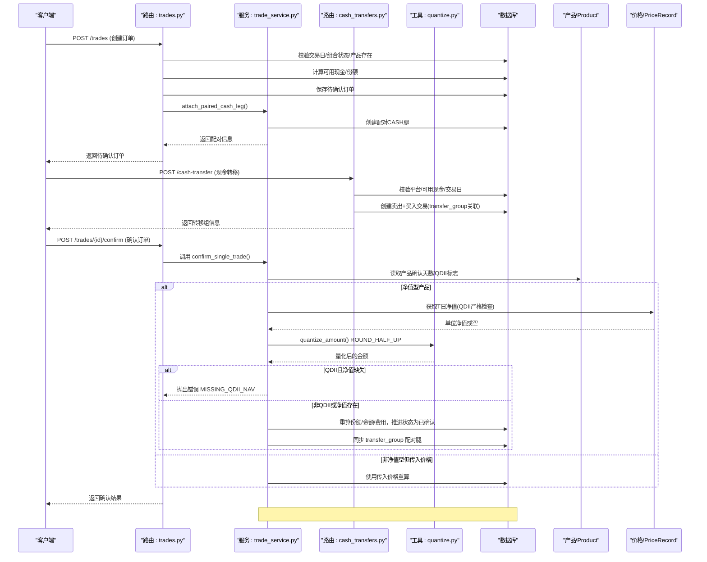

**图表来源**
- [backend/app/routers/trades.py:292-504](file://backend/app/routers/trades.py#L292-L504)
- [backend/app/services/trade_service.py:115-203](file://backend/app/services/trade_service.py#L115-L203)
- [backend/app/routers/cash_transfers.py:51-190](file://backend/app/routers/cash_transfers.py#L51-L190)
- [backend/app/utils/quantize.py:22-32](file://backend/app/utils/quantize.py#L22-L32)
- [backend/app/models/product.py:11-14](file://backend/app/models/product.py#L11-L14)
- [backend/app/models/price_record.py:11-12](file://backend/app/models/price_record.py#L11-L12)

## 详细组件分析

### 金额量化精度升级（新增）
**新增功能**：实现了金额量化精度的重大升级，从ROUND_DOWN（向零截断）升级为ROUND_HALF_UP（四舍五入），符合场外基金行业惯例。

#### 核心特性
- **统一舍入规则**：所有金额计算都使用ROUND_HALF_UP舍入模式，确保金融计算的准确性
- **2位小数精度**：金额统一量化到2位小数，符合行业标准
- **负数对称处理**：负数按绝对值四舍五入，远离零进位（如 -1.235 → -1.24）
- **全场景覆盖**：适用于申购确认、交易处理、份额变动事件等所有金额计算场景

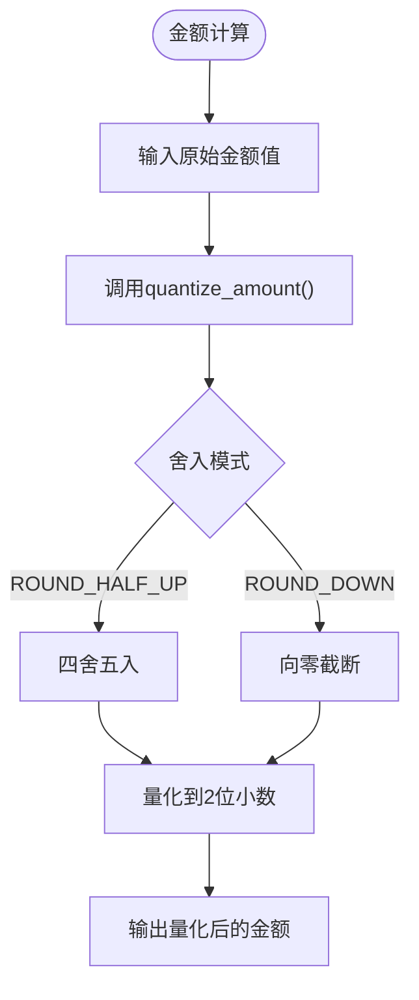

**图表来源**
- [backend/app/utils/quantize.py:41-52](file://backend/app/utils/quantize.py#L41-L52)
- [backend/tests/unit/test_quantize.py:20-40](file://backend/tests/unit/test_quantize.py#L20-L40)

#### API函数说明
- **quantize_amount**：将任意数值量化为2位小数，使用ROUND_HALF_UP舍入模式
- **AMOUNT_QUANT常量**：定义为Decimal("0.01")，确保2位小数精度
- **None透传**：对None值原样返回，方便可空字段处理

**章节来源**
- [backend/app/utils/quantize.py:1-53](file://backend/app/utils/quantize.py#L1-L53)
- [backend/tests/unit/test_quantize.py:1-83](file://backend/tests/unit/test_quantize.py#L1-L83)

### 强制性的Transfer Group规范化（新增）
**新增功能**：实现了强制性的transfer group规范化，所有基金交易必须配对CASH腿，确保数据完整性和业务一致性。

#### 核心特性
- **必填字段**：transfer_group字段在Trade模型中为NOT NULL，确保每笔交易都属于一个业务组
- **自动配对**：所有基金交易创建时自动调用attach_paired_cash_leg函数生成配对CASH腿
- **组内不变量**：同一transfer_group内的各腿trade_date恒等，确保业务操作的一致性
- **多种组类型**：支持基金调仓（rebal_{uuid}）、申购赎回（sub_{subscription.id}）、平台间转账（uuid）等不同类型的业务组

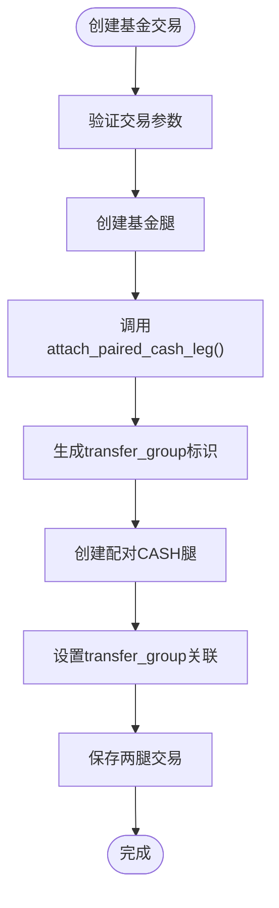

**图表来源**
- [backend/app/services/trade_service.py:60-94](file://backend/app/services/trade_service.py#L60-L94)
- [backend/app/models/trade.py:14-20](file://backend/app/models/trade.py#L14-L20)

#### API函数说明
- **attach_paired_cash_leg**：为基金腿生成transfer_group并构造配对CASH腿，确保基金买/卖必配 CASH 腿
- **sync_transfer_group**：同步transfer_group关联的另一腿状态、日期与金额，使用savepoint保证原子性
- **calculate_confirm_preview**：计算交易确认结果，包含paired_cash_amount字段用于预览配对CASH腿金额

**章节来源**
- [backend/app/services/trade_service.py:60-94](file://backend/app/services/trade_service.py#L60-L94)
- [backend/app/services/trade_service.py:97-150](file://backend/app/services/trade_service.py#L97-L150)
- [backend/app/services/trade_service.py:153-271](file://backend/app/services/trade_service.py#L153-L271)
- [backend/app/models/trade.py:14-20](file://backend/app/models/trade.py#L14-L20)

### 统一的交易确认逻辑（增强）
**增强功能**：统一了QDII和非QDII产品的交易确认逻辑，采用一致的净值获取和计算规则。

#### 核心改进
- **统一净值获取**：get_nav_for_trade_confirmation函数不再区分QDII和非QDII，统一取T日净值
- **一致的计算规则**：场外净值型基金（OEF/LOF 且 CN_OTC）确认时必须获取 T 日净值进行计算
- **严格的净值检查**：T日净值缺失时拒绝确认，不再向前查找
- **手动价格校验**：场外基金传入的价格仅用于一致性校验，不覆盖净值
- **金额量化升级**：所有金额计算都使用ROUND_HALF_UP舍入模式

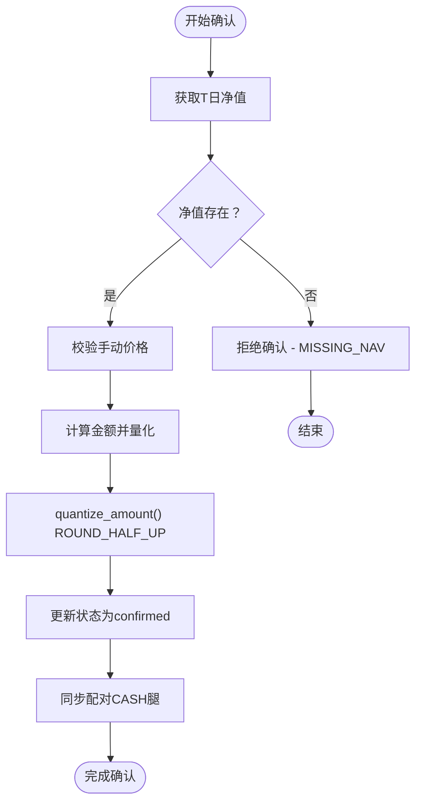

**图表来源**
- [backend/app/services/trade_service.py:28-57](file://backend/app/services/trade_service.py#L28-L57)
- [backend/app/services/trade_service.py:195-230](file://backend/app/services/trade_service.py#L195-L230)
- [backend/app/utils/quantize.py:41-52](file://backend/app/utils/quantize.py#L41-L52)

#### API函数说明
- **get_nav_for_trade_confirmation**：获取交易确认时的净值，不再区分QDII和非QDII，统一取T日净值
- **calculate_confirm_preview**：计算交易确认结果，统一处理QDII和非QDII产品的确认逻辑
- **confirm_single_trade**：确认单笔调仓交易的核心逻辑，供手动确认与auto_confirm共用

**章节来源**
- [backend/app/services/trade_service.py:28-57](file://backend/app/services/trade_service.py#L28-L57)
- [backend/app/services/trade_service.py:153-271](file://backend/app/services/trade_service.py#L153-L271)
- [backend/app/services/trade_service.py:274-375](file://backend/app/services/trade_service.py#L274-L375)

### T+1/T+2结算差异处理（增强）
**增强功能**：通过confirm_date字段明确区分T+1和T+2结算差异，统一处理不同产品的结算周期。

#### 核心特性
- **确认日期推算**：根据产品的confirm_days字段计算期望确认日期
- **QDII延迟**：QDII产品通常有T+2的确认延迟，通过confirm_days=2体现
- **非QDII快速**：非QDII产品通常为T+1确认，通过confirm_days=1体现
- **自动重算**：当trade_date变更时，自动重新计算confirm_date

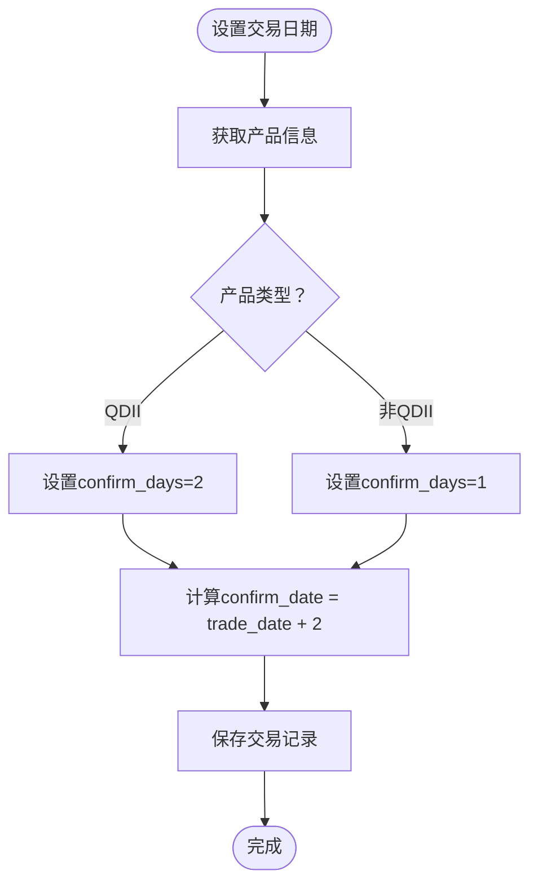

**图表来源**
- [backend/app/services/trade_service.py:454-455](file://backend/app/services/trade_service.py#L454-L455)
- [backend/app/models/product.py:11-14](file://backend/app/models/product.py#L11-L14)

**章节来源**
- [backend/app/services/trade_service.py:454-455](file://backend/app/services/trade_service.py#L454-L455)
- [backend/app/models/product.py:11-14](file://backend/app/models/product.py#L11-L14)

### 配对CASH腿同步机制（增强）
**增强功能**：实现了完整的配对CASH腿同步机制，确保主腿和配对腿的状态、日期和金额保持一致。

#### 核心特性
- **状态同步**：主腿状态变更时自动同步配对腿状态
- **日期同步**：主腿trade_date变更时自动同步配对腿trade_date
- **金额镜像**：基金腿actual_amount变更时自动镜像到配对CASH腿
- **事务保护**：使用savepoint确保配对更新的原子性

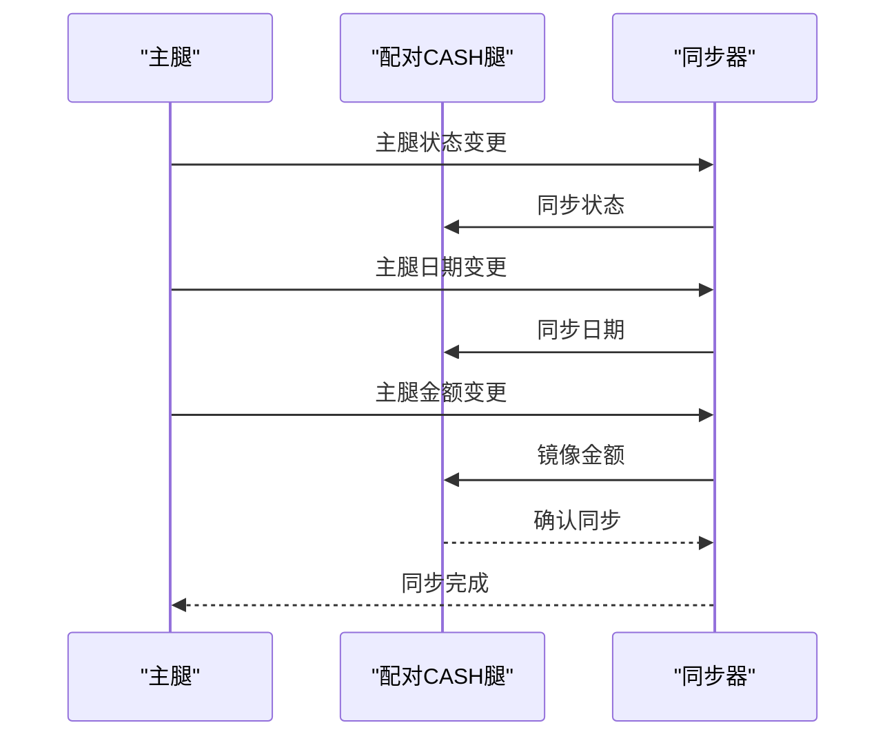

**图表来源**
- [backend/app/services/trade_service.py:97-150](file://backend/app/services/trade_service.py#L97-L150)

**章节来源**
- [backend/app/services/trade_service.py:97-150](file://backend/app/services/trade_service.py#L97-L150)

### 交易订单生命周期与状态机
- 待确认（pending）：订单创建后初始状态。
- 已确认（confirmed）：确认流程完成后进入。
- 已取消（cancelled）：仅场外待确认订单可取消。
- 删除：管理员可删除订单（不改变其他订单状态）。

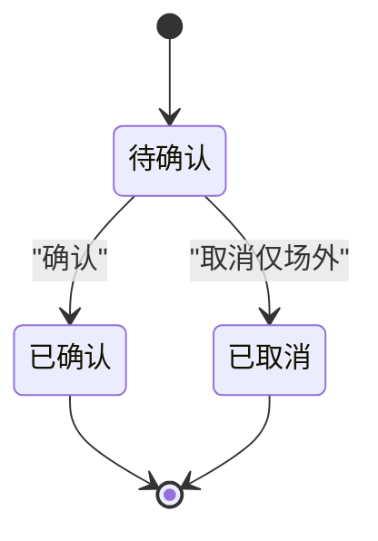

**图表来源**
- [backend/app/routers/trades.py:417-532](file://backend/app/routers/trades.py#L417-L532)
- [backend/app/models/trade.py:22](file://backend/app/models/trade.py#L22)

**章节来源**
- [backend/app/routers/trades.py:417-532](file://backend/app/routers/trades.py#L417-L532)
- [backend/app/models/trade.py:22](file://backend/app/models/trade.py#L22)

### 买入流程
- 参数校验：买入金额必须大于 0。
- 可用现金检查：基于最新快照与未确认/未生成快照的交易与申购赎回进行实时计算。
- **强制配对**：**新增**成功后生成待确认订单的同时自动创建配对CASH腿。
- **金额量化**：**新增**买入金额先量化到2位再进行精确校验。
- 成功后生成待确认订单，字段包括份额、金额、成交价、费用、实际金额等。

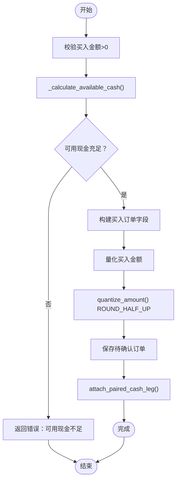

**图表来源**
- [backend/app/routers/trades.py:322-357](file://backend/app/routers/trades.py#L322-L357)
- [backend/app/routers/trades.py:128-217](file://backend/app/routers/trades.py#L128-L217)
- [backend/app/services/trade_service.py:538-541](file://backend/app/services/trade_service.py#L538-L541)
- [backend/app/utils/quantize.py:41-52](file://backend/app/utils/quantize.py#L41-L52)

**章节来源**
- [backend/app/routers/trades.py:322-357](file://backend/app/routers/trades.py#L322-L357)
- [backend/app/routers/trades.py:128-217](file://backend/app/routers/trades.py#L128-L217)
- [backend/app/services/trade_service.py:538-541](file://backend/app/services/trade_service.py#L538-L541)

### 卖出流程
- 参数校验：卖出份额必须大于 0。
- 可用份额检查：基于最新快照与未确认/未生成快照的卖出进行实时计算。
- **强制配对**：**新增**成功后生成待确认订单的同时自动创建配对CASH腿。
- **金额量化**：**新增**用户输入的金额先量化到2位再进行精确校验。
- 成功后生成待确认订单。

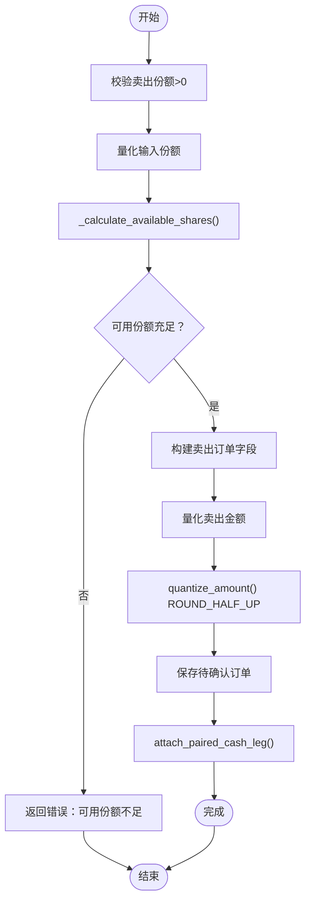

**图表来源**
- [backend/app/routers/trades.py:358-395](file://backend/app/routers/trades.py#L358-395)
- [backend/app/routers/trades.py:220-268](file://backend/app/routers/trades.py#L220-L268)
- [backend/app/services/trade_service.py:538-541](file://backend/app/services/trade_service.py#L538-L541)
- [backend/app/utils/quantize.py:41-52](file://backend/app/utils/quantize.py#L41-L52)

**章节来源**
- [backend/app/routers/trades.py:358-395](file://backend/app/routers/trades.py#L358-395)
- [backend/app/routers/trades.py:220-268](file://backend/app/routers/trades.py#L220-L268)
- [backend/app/services/trade_service.py:538-541](file://backend/app/services/trade_service.py#L538-L541)

### 确认流程与净值取值
- 确认日期推算：依据产品确认天数与交易日历推算下一个交易日。
- **统一净值处理**：**增强**QDII和非QDII产品统一取 T 日净值，禁止向前查找；若 T 日净值缺失，抛出错误。
- **金额量化升级**：**新增**所有金额计算都使用ROUND_HALF_UP舍入模式。
- 非净值型产品：若传入价格则使用传入价格，否则保持原样。
- 确认后重算成交份额/金额与费用，推进状态为已确认。
- **增强**：通过专门的交易服务模块处理，确保逻辑一致性和并发安全。

**更新**：确认流程中统一了QDII和非QDII产品的净值处理逻辑，不再区分产品类型，统一取T日净值。**新增的金额量化工具确保所有金额计算都遵循ROUND_HALF_UP舍入规则**。

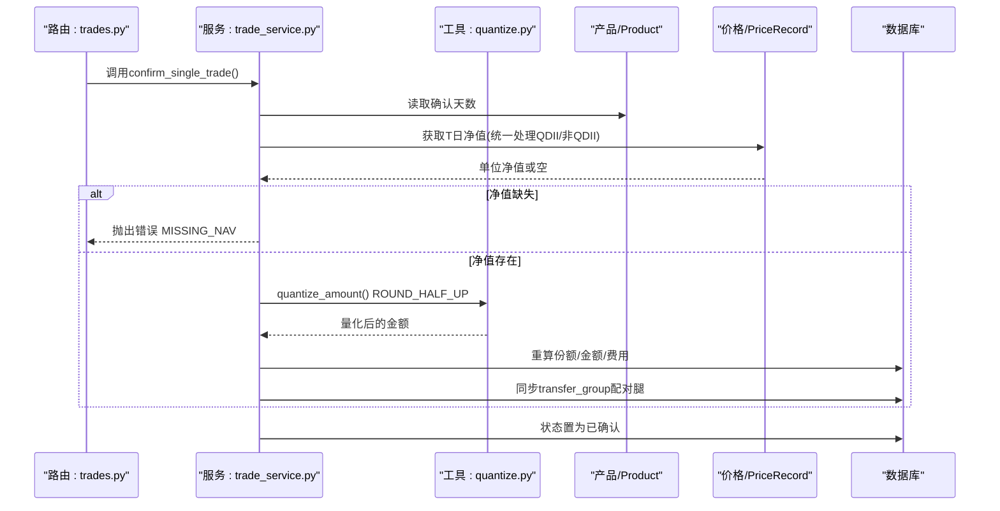

**图表来源**
- [backend/app/services/trade_service.py:115-203](file://backend/app/services/trade_service.py#L115-203)
- [backend/app/routers/trades.py:283-322](file://backend/app/routers/trades.py#L283-322)
- [backend/app/utils/quantize.py:41-52](file://backend/app/utils/quantize.py#L41-L52)
- [backend/app/models/product.py:11-14](file://backend/app/models/product.py#L11-L14)
- [backend/app/models/price_record.py:11-12](file://backend/app/models/price_record.py#L11-L12)

**章节来源**
- [backend/app/services/trade_service.py:115-203](file://backend/app/services/trade_service.py#L115-203)
- [backend/app/routers/trades.py:283-322](file://backend/app/routers/trades.py#L283-322)
- [backend/app/models/product.py:11-14](file://backend/app/models/product.py#L11-L14)
- [backend/app/models/price_record.py:11-12](file://backend/app/models/price_record.py#L11-L12)

### 取消流程
- 仅允许场外（CN_OTO）且状态为待确认的订单取消。
- 场内（CN_EXCHANGE）订单不可取消。
- **增强**：取消时自动同步配对CASH腿。

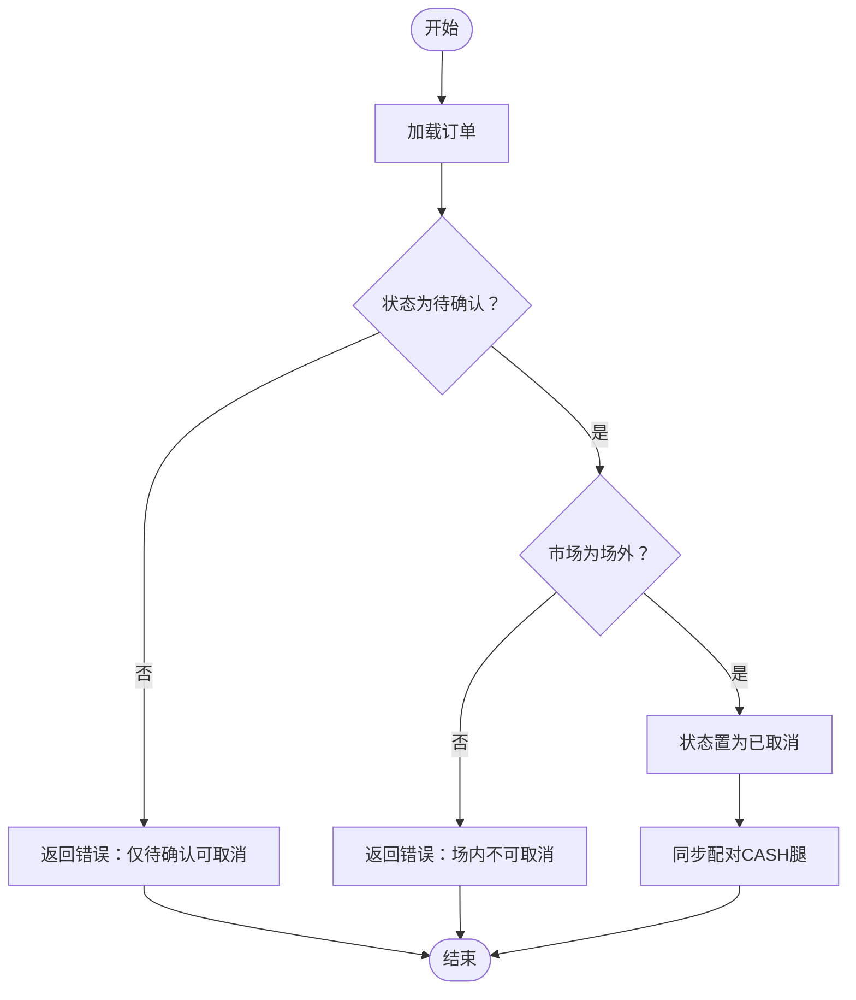

**图表来源**
- [backend/app/routers/trades.py:507-532](file://backend/app/routers/trades.py#L507-L532)
- [backend/app/services/trade_service.py:544-555](file://backend/app/services/trade_service.py#L544-L555)

**章节来源**
- [backend/app/routers/trades.py:507-532](file://backend/app/routers/trades.py#L507-L532)
- [backend/app/services/trade_service.py:544-555](file://backend/app/services/trade_service.py#L544-L555)

### 费用与资金结算机制
- 买入：amount = actual_amount - fee；shares = amount / price。
- 卖出：amount = shares × price；actual_amount = amount + fee。
- 确认阶段若传入价格，则按传入价格重算；否则使用系统获取的净值。
- 可用现金/份额计算均考虑未确认与未生成快照的交易与申购赎回，确保实时风控。
- **增强**：现金转移交易使用固定价格1.0，无手续费，直接调整对应平台的现金余额。
- **增强**：通过专门的交易服务模块统一处理费用计算逻辑。
- **新增**：所有金额计算都使用ROUND_HALF_UP舍入模式，确保资金结算的准确性。

**更新**：确认流程中统一了QDII和非QDII产品的净值处理逻辑，确保资金结算的准确性。**新增的金额量化工具确保所有金额计算都遵循ROUND_HALF_UP舍入规则**。

**章节来源**
- [backend/app/routers/trades.py:337-341](file://backend/app/routers/trades.py#L337-341)
- [backend/app/routers/trades.py:375-379](file://backend/app/routers/trades.py#L375-379)
- [backend/app/routers/trades.py:471-489](file://backend/app/routers/trades.py#L471-489)
- [backend/app/routers/trades.py:128-217](file://backend/app/routers/trades.py#L128-L217)
- [backend/app/routers/trades.py:220-268](file://backend/app/routers/trades.py#L220-L268)
- [backend/app/services/trade_service.py:173-191](file://backend/app/services/trade_service.py#L173-L191)

### 平台特定的可用现金计算
**增强功能**：实现了按平台维度的可用现金计算，支持多平台账户的独立管理和风控。

#### 核心特性
- **平台过滤**：支持按platform_code过滤计算指定平台的可用现金
- **汇总模式**：不指定平台时自动汇总所有平台的现金余额
- **实时计算**：考虑未确认交易、未生成快照的交易和申购赎回
- **现金转移支持**：正确处理现金转移对平台现金的影响

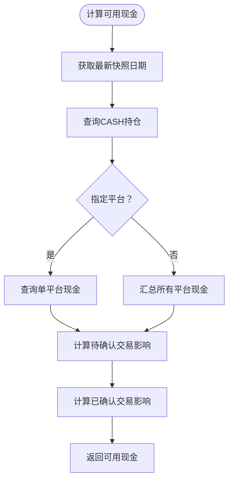

**图表来源**
- [backend/app/routers/trades.py:128-217](file://backend/app/routers/trades.py#L128-L217)
- [backend/app/services/position_service.py:38-71](file://backend/app/services/position_service.py#L38-L71)

**章节来源**
- [backend/app/routers/trades.py:128-217](file://backend/app/routers/trades.py#L128-L217)
- [backend/app/services/position_service.py:38-71](file://backend/app/services/position_service.py#L38-L71)

### 快照生成服务改造
**增强功能**：实现了按platform_code维度拆分的持仓快照生成，支持平台特定的现金管理。

#### 核心改进
- **持仓Key变更**：从(product_code, market)改为(product_code, market, platform_code)
- **现金按平台拆分**：每个平台的现金独立记录和计算
- **交易处理增强**：支持现金转移交易的特殊处理逻辑
- **前一日现金查询**：按platform_code分组加载所有CASH记录
- **自动确认集成**：在快照生成后自动确认到期交易

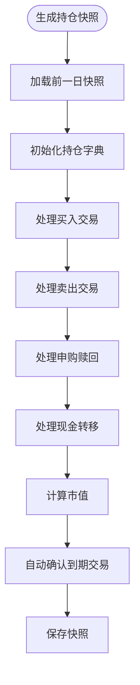

**图表来源**
- [backend/app/services/snapshot_service.py:427-569](file://backend/app/services/snapshot_service.py#L427-L569)
- [backend/app/services/snapshot_service.py:967-1006](file://backend/app/services/snapshot_service.py#L967-L1006)

**章节来源**
- [backend/app/services/snapshot_service.py:427-569](file://backend/app/services/snapshot_service.py#L427-L569)
- [backend/app/services/snapshot_service.py:967-1006](file://backend/app/services/snapshot_service.py#L967-L1006)

### 交易API接口说明
- GET /trades
  - 功能：分页查询交易记录。
  - 参数：portfolio_code（可选）、page、page_size。
  - 返回：items、total、page、page_size。
- POST /trades
  - 功能：创建交易订单（买入/卖出）。
  - 请求体：TradeCreate（包含 portfolio_code、product_code、market、platform_code、trade_type、shares、amount、price、fee、actual_amount、trade_date、notes 等）。
  - 校验：交易日、组合状态、产品存在、金额/份额正数、可用性检查。
  - **增强**：自动创建配对CASH腿，返回包含transfer_group信息。
  - **新增**：所有金额计算使用ROUND_HALF_UP舍入模式。
  - 返回：TradeResponse。
- GET /trades/{id}
  - 功能：查询单笔交易详情。
- POST /trades/{id}/confirm
  - 功能：确认交易，支持传入 confirm_date 与 price。
  - 校验：仅待确认订单、产品类型与净值取值规则、确认日期推算。
  - **新增**：确认时所有金额计算都使用ROUND_HALF_UP舍入模式。
  - 返回：确认结果与 TradeResponse。
- POST /trades/{id}/cancel
  - 功能：取消交易（仅场外待确认）。
- PUT /trades/{id}
  - 功能：更新交易字段（管理员）。
- DELETE /trades/{id}
  - 功能：删除交易（管理员）。
- **新增**：POST /trades/{id}/unconfirm
  - 功能：取消确认交易，受快照保护限制。

**更新**：确认接口统一了QDII和非QDII产品的处理逻辑，创建接口新增了自动配对CASH腿功能。**新增的金额量化工具确保所有金额计算都遵循ROUND_HALF_UP舍入模式**。

**章节来源**
- [backend/app/routers/trades.py:271-567](file://backend/app/routers/trades.py#L271-L567)
- [backend/app/schemas/trade.py:23-44](file://backend/app/schemas/trade.py#L23-L44)

### 风控机制与流动性检查
- 可用现金计算：基于最新快照现金，加上未生成快照的已确认申购、减去未生成快照的已确认赎回、减去待确认买入、减去未生成快照的已确认买入、加上未生成快照的已确认卖出。
- 可用份额计算：基于最新快照份额，减去待确认卖出、减去未生成快照的已确认卖出。
- **新增**：用户输入的金额先量化到2位再进行精确校验，避免精度问题导致的误判。
- 交易日校验：仅在交易日可提交订单。
- 市场区分：场内与场外的取消规则不同。
- **增强**：平台特定风控：支持按平台检查可用现金，防止跨平台透支。
- **增强**：并发安全：通过FOR UPDATE锁防止竞态条件导致的超卖或透支。

**更新**：统一了QDII和非QDII产品的净值处理逻辑，增强了风控机制的一致性。**新增的金额量化机制确保可用现金计算的准确性**。

**章节来源**
- [backend/app/routers/trades.py:128-217](file://backend/app/routers/trades.py#L128-L217)
- [backend/app/routers/trades.py:220-268](file://backend/app/routers/trades.py#L220-L268)
- [backend/app/routers/trades.py:111-115](file://backend/app/routers/trades.py#L111-L115)
- [backend/app/routers/trades.py:524-528](file://backend/app/routers/trades.py#L524-L528)
- [backend/app/services/trade_service.py:46-75](file://backend/app/services/trade_service.py#L46-L75)

### 批量交易处理、回测与查询
- 批量交易：当前路由层未提供批量创建接口，可在现有单笔创建逻辑基础上扩展。
- 回测：通过价格记录与持仓快照支持历史回测与净值计算。
- 查询：交易记录分页查询，支持按组合过滤。
- **增强**：现金转移查询：支持按transfer_group分组的转移记录查询。
- **增强**：自动确认：在快照生成后自动处理到期交易。

**更新**：统一了QDII和非QDII产品的净值处理逻辑，增强了批量处理和自动确认功能。**新增的金额量化工具确保回测和查询结果的准确性**。

**章节来源**
- [backend/app/routers/trades.py:271-289](file://backend/app/routers/trades.py#L271-L289)
- [backend/app/services/market_data_service.py:15-54](file://backend/app/services/market_data_service.py#L15-54)
- [backend/app/services/market_data_service.py:228-319](file://backend/app/services/market_data_service.py#L228-L319)
- [backend/app/services/snapshot_service.py:650-694](file://backend/app/services/snapshot_service.py#L650-L694)
- [backend/app/services/snapshot_service.py:967-1006](file://backend/app/services/snapshot_service.py#L967-L1006)

## 依赖分析
- 路由层依赖模型层与服务层：
  - 交易路由依赖 Trade、Product、PortfolioPosition、Subscription、TradingCalendar、PriceRecord。
  - 现金转移路由依赖 Trade、Portfolio、Platform、TradingCalendar。
  - 价格服务依赖 PriceRecord、Product、PortfolioPosition、PortfolioValueSnapshot。
  - **增强**：交易服务依赖Trade、Product、PriceRecord进行净值获取和确认处理，**新增了强制性的配对CASH腿功能**。
  - **增强**：快照服务依赖PriceRecord、Product、PortfolioPosition进行净值校验。
  - **新增**：所有服务都依赖quantize工具进行金额和份额量化。
- 模型层之间通过外键与唯一约束建立强关联，确保数据一致性与业务规则落地。

**更新**：新增了交易服务模块的强制性配对功能和统一的净值处理逻辑。**新增的金额量化工具被所有涉及金额计算的服务所依赖**。

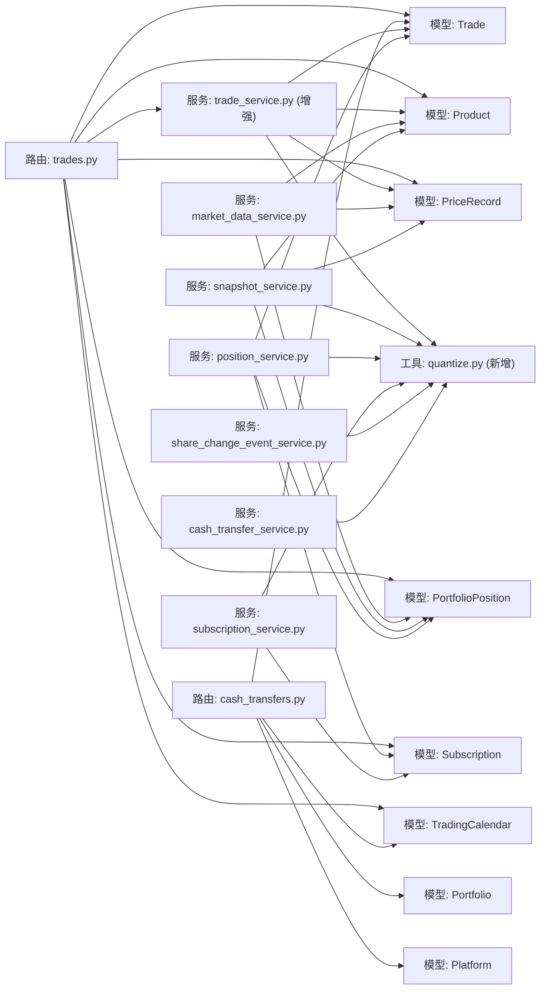

**图表来源**
- [backend/app/routers/trades.py:1-16](file://backend/app/routers/trades.py#L1-L16)
- [backend/app/routers/cash_transfers.py:14-25](file://backend/app/routers/cash_transfers.py#L14-L25)
- [backend/app/services/trade_service.py:1-20](file://backend/app/services/trade_service.py#L1-L20)
- [backend/app/services/market_data_service.py:1-13](file://backend/app/services/market_data_service.py#L1-L13)
- [backend/app/services/snapshot_service.py:370-569](file://backend/app/services/snapshot_service.py#L370-L569)
- [backend/app/services/position_service.py:38-71](file://backend/app/services/position_service.py#L38-L71)
- [backend/app/utils/quantize.py:1-53](file://backend/app/utils/quantize.py#L1-L53)

**章节来源**
- [backend/app/routers/trades.py:1-16](file://backend/app/routers/trades.py#L1-L16)
- [backend/app/routers/cash_transfers.py:14-25](file://backend/app/routers/cash_transfers.py#L14-L25)
- [backend/app/services/trade_service.py:1-20](file://backend/app/services/trade_service.py#L1-L20)
- [backend/app/services/market_data_service.py:1-13](file://backend/app/services/market_data_service.py#L1-L13)
- [backend/app/services/snapshot_service.py:370-569](file://backend/app/services/snapshot_service.py#L370-L569)
- [backend/app/services/position_service.py:38-71](file://backend/app/services/position_service.py#L38-L71)
- [backend/app/utils/quantize.py:1-53](file://backend/app/utils/quantize.py#L1-L53)

## 性能考虑
- 数据访问优化
  - 在确认流程中，按产品维度一次性加载价格记录与持仓，减少多次查询开销。
  - 对交易日历与价格记录使用索引列（日期、产品代码、市场）。
  - **增强**：统一净值查询逻辑，避免不必要的向前查找。
  - **增强**：现金转移查询使用transfer_group索引，提高配对效率。
  - **增强**：交易服务模块集中化逻辑，减少重复代码和查询。
  - **新增**：金额量化工具使用高效的Decimal运算，避免浮点数精度问题。
- 并发控制
  - 使用数据库事务包裹订单创建与确认的关键路径，保证一致性。
  - 对可用现金/份额计算采用"读取-计算-写入"的原子性保障，必要时引入行级锁或乐观锁。
  - **增强**：统一净值检查使用原子查询，确保数据一致性。
  - **增强**：现金转移操作使用事务保证卖出和买入交易的一致性。
  - **增强**：全面的FOR UPDATE锁保护，防止竞态条件。
  - **增强**：savepoint机制确保配对交易更新的原子性。
- 缓存策略
  - 将常用的产品配置与交易日历缓存于内存，降低重复查询成本。
  - **增强**：净值检查结果可进行短期缓存，减少重复查询。
  - **增强**：平台可用现金计算结果可缓存，提高频繁查询性能。
  - **新增**：金额量化结果可缓存，避免重复计算。
- 批处理
  - 批量创建/确认可通过队列异步处理，避免阻塞主请求线程。
  - **增强**：自动确认机制在快照生成后批量处理到期交易。

**更新**：新增了交易服务模块、并发安全机制和自动确认的性能优化策略。**新增的金额量化工具提供了高效的Decimal运算，避免了浮点数精度问题带来的性能损耗**。

## 故障排查指南
- 交易日错误：非交易日提交订单将被拒绝，需选择交易日。
- 组合状态错误：非激活组合无法提交订单。
- 产品不存在：提交订单时需确保产品与市场匹配。
- 金额/份额校验失败：买入金额必须大于 0；卖出份额必须大于 0。
- 可用性不足：买入金额超出现金可用额度；卖出份额超出可用份额。
- 确认失败：净值型产品 T 日净值缺失导致无法确认。
- 取消失败：场内订单不可取消；仅待确认订单可取消。
- **增强**：现金转移错误
  - **SAME_PLATFORM**：转出平台和转入平台不能相同
  - **INSUFFICIENT_CASH**：转出平台可用现金不足
  - **TRANSFER_NOT_FOUND**：未找到指定的转移记录
  - **TRANSFER_NOT_READY**：跨天转移尚未到确认日期
  - **INVALID_STATUS**：转移交易状态不正确
- **增强**：并发相关错误
  - **CONCURRENT_MODIFICATION**：并发修改检测，建议使用重试机制
  - **LOCK_TIMEOUT**：数据库锁超时，检查长时间运行的事务
- **增强**：快照保护错误
  - **POSITION_UPDATE_BLOCKED**：尝试直接修改持仓快照被阻止
  - **SNAPSHOT_DEPENDENCY**：交易已被快照纳入，无法取消确认

**新增**：transfer group相关错误排查
- **MISSING_TRANSFER_GROUP**：交易缺少transfer_group标识
- **PAIR_SYNC_FAILED**：配对CASH腿同步失败
- **GROUP_INCONSISTENCY**：transfer_group内数据不一致

**新增**：净值处理相关错误排查
- **MISSING_NAV**：T日净值缺失，无法确认交易
- **PRICE_NAV_MISMATCH**：手动价格与净值不一致

**新增**：金额量化相关错误排查
- **QUANTIZE_ERROR**：金额量化过程中出现异常
- **PRECISION_LOSS**：金额精度丢失，需要检查输入数据格式

**章节来源**
- [backend/app/routers/trades.py:298-336](file://backend/app/routers/trades.py#L298-L336)
- [backend/app/routers/trades.py:417-504](file://backend/app/routers/trades.py#L417-L504)
- [backend/app/routers/trades.py:507-532](file://backend/app/routers/trades.py#L507-L532)
- [backend/app/routers/cash_transfers.py:75-117](file://backend/app/routers/cash_transfers.py#L75-L117)
- [backend/app/routers/cash_transfers.py:216-236](file://backend/app/routers/cash_transfers.py#L216-L236)
- [backend/app/services/snapshot_service.py:650-694](file://backend/app/services/snapshot_service.py#L650-694)
- [backend/app/services/trade_service.py:55-61](file://backend/app/services/trade_service.py#L55-L61)
- [backend/app/models/portfolio_position.py:42-50](file://backend/app/models/portfolio_position.py#L42-L50)

## 结论
该交易系统以清晰的模型与路由分层实现了从订单创建到确认、取消与查询的完整闭环。通过交易日历、产品属性与价格记录的协同，系统在净值型产品的确认流程中严格遵循 T 日规则。**Phase 1-3的综合增强显著提升了系统的可靠性和性能**。

**更新重点**：本次更新实现了金额量化的重大增强，从ROUND_DOWN（向零截断）升级为ROUND_HALF_UP（四舍五入），符合场外基金行业惯例。这一变更影响了申购确认、交易处理和份额变动事件等所有金额计算场景，确保了金融计算的准确性和行业标准的一致性。同时实现了强制性的transfer group规范化，所有基金交易必须配对CASH腿，确保了数据的完整性和业务一致性。统一了QDII和非QDII产品的确认逻辑，简化了业务复杂度。通过confirm_date字段明确区分T+1和T+2结算差异，提高了系统的灵活性。

后续可在批量处理、撮合引擎与更细粒度的风控策略上进一步增强，以满足更高吞吐与复杂交易场景的需求。

## 附录
- 术语
  - T 日：交易日当日；T+n：按产品确认天数推算的确认日。
  - 净值型产品：场外基金等以净值作为定价基准的产品。
  - 场内/场外：CN_EXCHANGE/CN_OTC，分别对应交易所与场外市场。
  - **增强**：transfer_group：平台间现金转移的配对标识，关联同一业务操作产生的多条trade（基金腿 + CASH 腿），**现为必填字段**。
  - **增强**：跨天到账：现金转移的T+1确认模式，卖出交易立即确认，买入交易延后至下一交易日确认。
  - **增强**：savepoint：数据库事务中的子事务，用于细粒度的错误恢复。
  - **增强**：FOR UPDATE：数据库行级锁，防止并发修改。
  - **新增**：配对CASH腿：与基金交易配对的现金变动记录，通过transfer_group关联。
  - **新增**：强制规范化：要求所有基金交易必须配对CASH腿的业务规则。
  - **新增**：ROUND_HALF_UP：四舍五入舍入模式，第3位>=5进位，符合场外基金行业惯例。
  - **新增**：金额量化：将金额值统一量化到2位小数的过程，使用ROUND_HALF_UP舍入模式。
  - **新增**：份额量化：将份额值统一量化到2位小数的过程，使用ROUND_HALF_UP舍入模式。
- 扩展建议
  - 引入撮合引擎：实现价格优先与时间优先的自动配对与成交。
  - 风控增强：最大仓位限制、流动性阈值、滑点控制等。
  - 回测框架：基于历史价格记录与订单流水进行策略回测。
  - 并发优化：订单队列、分布式锁、幂等性保障与重试策略。
  - **新增**：净值监控：建立净值缺失预警机制，确保及时发现和处理问题。
  - **新增**：快照数据校验：定期检查净值数据完整性，防止数据不一致。
  - **新增**：现金转移自动化：支持定时任务和自动确认机制，简化跨天转账操作。
  - **新增**：多平台报表：生成按平台维度的资金流动报告和持仓分析报告。
  - **新增**：交易服务监控：建立交易确认成功率、耗时等关键指标的监控体系。
  - **新增**：并发性能调优：针对高并发场景优化锁粒度和事务范围。
  - **新增**：transfer group监控：监控配对交易的完整性和一致性。
  - **新增**：净值处理优化：优化净值查询和缓存策略，提高确认性能。
  - **新增**：金额量化监控：监控金额量化的准确性和一致性。
  - **新增**：精度测试套件：建立完整的金额精度测试用例，确保舍入规则的正确性。