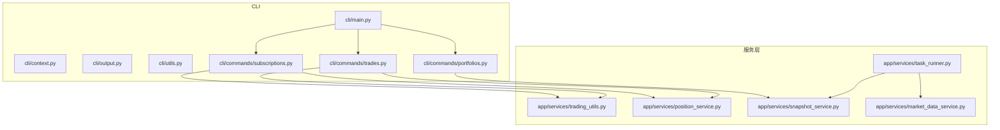
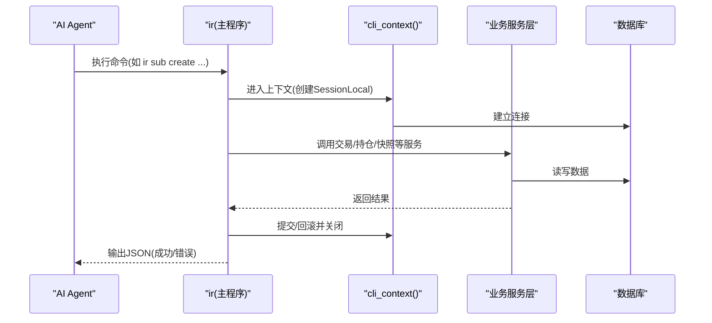
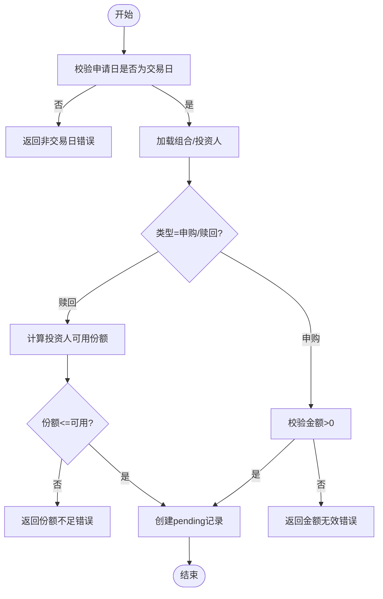
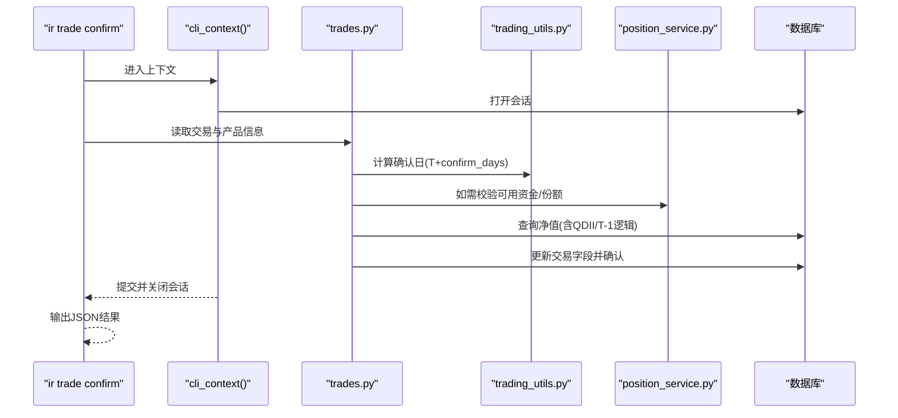
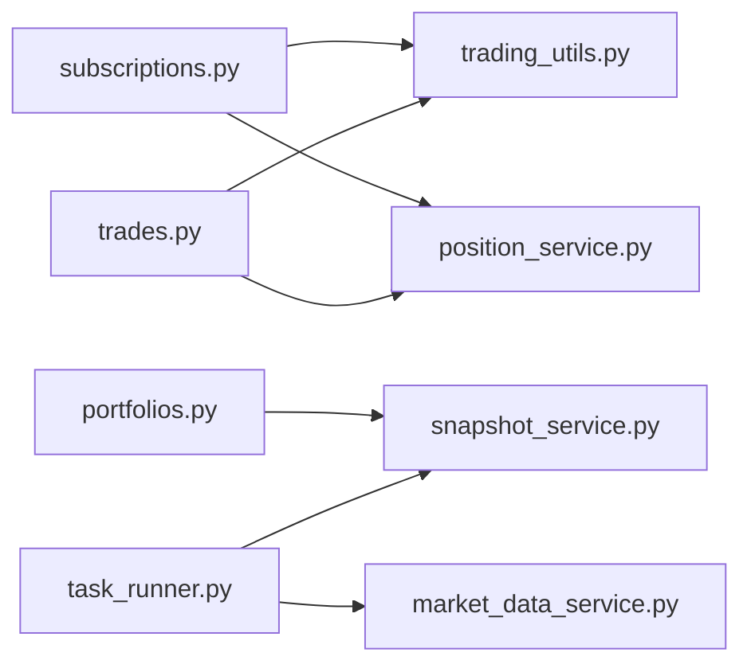

# 交易工具服务层

<cite>
**本文引用的文件**   
- [backend/cli/main.py](file://backend/cli/main.py)
- [backend/cli/context.py](file://backend/cli/context.py)
- [backend/cli/output.py](file://backend/cli/output.py)
- [backend/cli/utils.py](file://backend/cli/utils.py)
- [backend/cli/commands/subscriptions.py](file://backend/cli/commands/subscriptions.py)
- [backend/cli/commands/trades.py](file://backend/cli/commands/trades.py)
- [backend/cli/commands/portfolios.py](file://backend/cli/commands/portfolios.py)
- [backend/app/services/trading_utils.py](file://backend/app/services/trading_utils.py)
- [backend/app/services/position_service.py](file://backend/app/services/position_service.py)
- [backend/app/services/task_runner.py](file://backend/app/services/task_runner.py)
- [backend/app/services/snapshot_service.py](file://backend/app/services/snapshot_service.py)
- [backend/app/services/market_data_service.py](file://backend/app/services/market_data_service.py)
- [backend/pyproject.toml](file://backend/pyproject.toml)
- [backend/requirements.txt](file://backend/requirements.txt)
</cite>

## 目录
1. [简介](#简介)
2. [项目结构](#项目结构)
3. [核心组件](#核心组件)
4. [架构总览](#架构总览)
5. [详细组件分析](#详细组件分析)
6. [依赖关系分析](#依赖关系分析)
7. [性能考量](#性能考量)
8. [故障排查指南](#故障排查指南)
9. [结论](#结论)
10. [附录](#附录)

## 简介
本文件聚焦于 InvestRing 的“交易工具服务层”，即面向 AI Agent 的原生 CLI 与后端服务层的集成方案。该方案通过 Typer 构建命令行入口，直接复用数据库与服务层（交易日历、持仓计算、快照生成、市场数据同步等），以统一 JSON 协议输出，覆盖组合管理、申购赎回、调仓交易、份额变动事件、快照生成、市场数据同步、任务管理等核心能力。

## 项目结构
CLI 位于 backend/cli，命令组按业务域拆分；共享业务逻辑集中在 app/services 下，供 CLI 与 HTTP 路由共同复用。

图表来源
- [backend/cli/main.py:1-50](file://backend/cli/main.py#L1-L50)
- [backend/cli/commands/subscriptions.py:1-214](file://backend/cli/commands/subscriptions.py#L1-L214)
- [backend/cli/commands/trades.py:1-264](file://backend/cli/commands/trades.py#L1-L264)
- [backend/cli/commands/portfolios.py:1-241](file://backend/cli/commands/portfolios.py#L1-L241)
- [backend/app/services/trading_utils.py:1-69](file://backend/app/services/trading_utils.py#L1-L69)
- [backend/app/services/position_service.py:1-211](file://backend/app/services/position_service.py#L1-L211)
- [backend/app/services/task_runner.py:1-188](file://backend/app/services/task_runner.py#L1-L188)
- [backend/app/services/snapshot_service.py:1-800](file://backend/app/services/snapshot_service.py#L1-L800)
- [backend/app/services/market_data_service.py:1-323](file://backend/app/services/market_data_service.py#L1-L323)

章节来源
- [backend/cli/main.py:1-50](file://backend/cli/main.py#L1-L50)
- [backend/pyproject.toml:1-16](file://backend/pyproject.toml#L1-L16)
- [backend/requirements.txt:1-25](file://backend/requirements.txt#L1-L25)

## 核心组件
- CLI 入口与命令注册：Typer 应用实例集中注册 14 个命令组，提供 ir 子命令树。
- 执行上下文：统一的 DB Session 生命周期管理、异常映射与退出码控制。
- 输出协议：统一 JSON 成功/失败格式，支持 Decimal/date/datetime 序列化。
- 公共辅助：模型序列化、分页、日期解析、分页元数据生成。
- 交易工具服务：交易日判断、前后 N 个交易日计算、最新快照日期查询。
- 持仓服务：可用现金、可用份额、投资人可用份额的实时计算。
- 任务执行体：净值同步+快照生成、交易日历同步、日志清理。
- 快照服务：三表快照生成、区间重算、依赖校验。
- 市场数据服务：价格记录查询、增量同步、组合净值快速更新。

章节来源
- [backend/cli/main.py:1-50](file://backend/cli/main.py#L1-L50)
- [backend/cli/context.py:1-59](file://backend/cli/context.py#L1-L59)
- [backend/cli/output.py:1-64](file://backend/cli/output.py#L1-L64)
- [backend/cli/utils.py:1-67](file://backend/cli/utils.py#L1-L67)
- [backend/app/services/trading_utils.py:1-69](file://backend/app/services/trading_utils.py#L1-L69)
- [backend/app/services/position_service.py:1-211](file://backend/app/services/position_service.py#L1-L211)
- [backend/app/services/task_runner.py:1-188](file://backend/app/services/task_runner.py#L1-L188)
- [backend/app/services/snapshot_service.py:1-800](file://backend/app/services/snapshot_service.py#L1-L800)
- [backend/app/services/market_data_service.py:1-323](file://backend/app/services/market_data_service.py#L1-L323)

## 架构总览
CLI 作为 AI Agent 的直接操作面，通过 Typer 组织命令，每个命令在 cli_context 中获取 DB Session，调用 services 完成业务处理，最终通过 output 输出结构化 JSON。

图表来源
- [backend/cli/main.py:1-50](file://backend/cli/main.py#L1-L50)
- [backend/cli/context.py:1-59](file://backend/cli/context.py#L1-L59)
- [backend/cli/output.py:1-64](file://backend/cli/output.py#L1-L64)
- [backend/app/services/trading_utils.py:1-69](file://backend/app/services/trading_utils.py#L1-L69)
- [backend/app/services/position_service.py:1-211](file://backend/app/services/position_service.py#L1-L211)
- [backend/app/services/snapshot_service.py:1-800](file://backend/app/services/snapshot_service.py#L1-L800)
- [backend/app/services/market_data_service.py:1-323](file://backend/app/services/market_data_service.py#L1-L323)

## 详细组件分析

### 订阅/赎回命令组（ir sub）
- 列表：支持按组合/投资人过滤与分页。
- 创建：校验交易日、组合状态、投资人存在性；申购需金额>0，赎回需份额>0且不超过投资人可用份额。
- 确认：首次申购净值固定为 1.0000；可指定确认日或自动取 T+1；确认后可能激活组合。
- 取消/取消确认：仅允许 pending/cancelled 状态转换。

图表来源
- [backend/cli/commands/subscriptions.py:40-98](file://backend/cli/commands/subscriptions.py#L40-L98)
- [backend/app/services/trading_utils.py:16-22](file://backend/app/services/trading_utils.py#L16-L22)
- [backend/app/services/position_service.py:159-211](file://backend/app/services/position_service.py#L159-L211)

章节来源
- [backend/cli/commands/subscriptions.py:1-214](file://backend/cli/commands/subscriptions.py#L1-L214)
- [backend/app/services/trading_utils.py:1-69](file://backend/app/services/trading_utils.py#L1-L69)
- [backend/app/services/position_service.py:1-211](file://backend/app/services/position_service.py#L1-L211)

### 调仓交易命令组（ir trade）
- 列表：支持按组合过滤与分页。
- 创建：校验交易日、组合状态、产品存在；买入校验可用现金，卖出校验可用份额；费用参与实际金额/份额换算。
- 确认：根据产品类型与市场决定净值获取策略（QDII 特殊处理），可手动指定价格或自动取净值；更新 shares/amount/actual_amount。
- 取消/取消确认：场内不可取消；仅允许 pending/confirmed 状态转换。

图表来源
- [backend/cli/commands/trades.py:160-224](file://backend/cli/commands/trades.py#L160-L224)
- [backend/app/services/trading_utils.py:24-41](file://backend/app/services/trading_utils.py#L24-L41)
- [backend/app/services/position_service.py:18-106](file://backend/app/services/position_service.py#L18-L106)

章节来源
- [backend/cli/commands/trades.py:1-264](file://backend/cli/commands/trades.py#L1-L264)
- [backend/app/services/trading_utils.py:1-69](file://backend/app/services/trading_utils.py#L1-L69)
- [backend/app/services/position_service.py:1-211](file://backend/app/services/position_service.py#L1-L211)

### 组合管理命令组（ir portfolio）
- CRUD：创建默认 draft，关闭前检查待处理交易，重新激活仅对 closed 状态。
- 净值历史：按日期范围筛选快照序列。
- 收益率：累计收益与年化收益基于首尾快照单位净值与持有天数。
- 资金流：汇总已确认申购/赎回金额。

章节来源
- [backend/cli/commands/portfolios.py:1-241](file://backend/cli/commands/portfolios.py#L1-L241)

### 交易工具服务（trading_utils）
- is_trading_day：依据交易日历判定是否开放。
- get_next_trading_day/get_prev_trading_day：向前/向后滚动交易日。
- get_latest_snapshot_date：用于持仓与可用量计算的基准快照日期。

章节来源
- [backend/app/services/trading_utils.py:1-69](file://backend/app/services/trading_utils.py#L1-L69)

### 持仓服务（position_service）
- calculate_available_cash：从最新快照现金出发，叠加未快照化的申赎与交易影响，得到实时可用现金。
- calculate_available_shares：从最新份额快照出发，扣减 pending 与未快照化 confirmed 卖出份额。
- calculate_investor_available_shares：投资人维度可用份额，考虑 pending/confirmed 赎回。

章节来源
- [backend/app/services/position_service.py:1-211](file://backend/app/services/position_service.py#L1-L211)

### 任务执行体（task_runner）
- run_nav_sync：批量同步产品价格数据，并在成功后触发当日快照生成。
- run_calendar_sync：按年同步交易日历。
- run_log_cleanup：清理过期登录/审计/任务/错误日志。

章节来源
- [backend/app/services/task_runner.py:1-188](file://backend/app/services/task_runner.py#L1-L188)

### 快照服务（snapshot_service）
- generate_daily_snapshots：三表快照顺序生成（portfolio_position → portfolio_value_snapshot → investor_holding）。
- recalculate_snapshots：区间重算，支持强制模式跳过校验。
- validate_snapshot_dependencies：交易日、待处理交易、净值完整性、份额事件状态等前置校验。

章节来源
- [backend/app/services/snapshot_service.py:1-800](file://backend/app/services/snapshot_service.py#L1-L800)

### 市场数据服务（market_data_service）
- get_price_records/get_latest_price：价格查询接口。
- sync_price_data：按市场类型拉取数据，去重后增量写入，更新产品数据源状态。
- sync_portfolio_nav：基于最新持仓与价格快速计算组合净值。

章节来源
- [backend/app/services/market_data_service.py:1-323](file://backend/app/services/market_data_service.py#L1-L323)

## 依赖关系分析
- CLI 命令组依赖：
  - cli/context：统一 DB 会话与异常处理。
  - cli/output：统一 JSON 输出与退出码。
  - cli/utils：序列化、分页、日期解析。
  - app/services/*：交易工具、持仓计算、快照、市场数据、任务执行体。
- 服务层内部依赖：
  - trading_utils 被 subscriptions/trades/positions 等广泛使用。
  - position_service 依赖 trading_utils 的最新快照日期。
  - task_runner 依赖 market_data_service 与 snapshot_service。
  - snapshot_service 依赖交易日历、价格记录、交易/申赎/份额事件等模型。

图表来源
- [backend/cli/commands/subscriptions.py:1-214](file://backend/cli/commands/subscriptions.py#L1-L214)
- [backend/cli/commands/trades.py:1-264](file://backend/cli/commands/trades.py#L1-L264)
- [backend/cli/commands/portfolios.py:1-241](file://backend/cli/commands/portfolios.py#L1-L241)
- [backend/app/services/trading_utils.py:1-69](file://backend/app/services/trading_utils.py#L1-L69)
- [backend/app/services/position_service.py:1-211](file://backend/app/services/position_service.py#L1-L211)
- [backend/app/services/task_runner.py:1-188](file://backend/app/services/task_runner.py#L1-L188)
- [backend/app/services/snapshot_service.py:1-800](file://backend/app/services/snapshot_service.py#L1-L800)
- [backend/app/services/market_data_service.py:1-323](file://backend/app/services/market_data_service.py#L1-L323)

章节来源
- [backend/cli/main.py:1-50](file://backend/cli/main.py#L1-L50)
- [backend/cli/commands/subscriptions.py:1-214](file://backend/cli/commands/subscriptions.py#L1-L214)
- [backend/cli/commands/trades.py:1-264](file://backend/cli/commands/trades.py#L1-L264)
- [backend/cli/commands/portfolios.py:1-241](file://backend/cli/commands/portfolios.py#L1-L241)
- [backend/app/services/trading_utils.py:1-69](file://backend/app/services/trading_utils.py#L1-L69)
- [backend/app/services/position_service.py:1-211](file://backend/app/services/position_service.py#L1-L211)
- [backend/app/services/task_runner.py:1-188](file://backend/app/services/task_runner.py#L1-L188)
- [backend/app/services/snapshot_service.py:1-800](file://backend/app/services/snapshot_service.py#L1-L800)
- [backend/app/services/market_data_service.py:1-323](file://backend/app/services/market_data_service.py#L1-L323)

## 性能考量
- 可用现金/份额计算涉及多次聚合查询，建议在热点组合上增加索引（如 portfolio_code + status + trade_type/confirm_date）。
- 快照生成采用批量删除与追加写入，建议在大区间重算时分批提交，避免长事务锁竞争。
- 市场数据同步采用内存去重与一次性加载已有记录，减少重复写入与往返开销。
- CLI 每次命令独立 Session，避免跨命令共享状态，提升稳定性但会增加连接开销；在高并发场景可考虑连接池优化。

[本节为通用指导，不直接分析具体文件]

## 故障排查指南
- 非交易日错误：创建/确认类命令会先校验交易日，若失败请检查交易日历数据。
- 净值缺失：QDII 产品确认需要 T-1 净值，普通基金需要当日净值；请先执行市场数据同步。
- 可用资金/份额不足：创建交易或赎回前，使用 available-cash/available-shares 预检。
- 组合关闭限制：存在 pending 交易或申赎无法关闭；先完成确认或取消。
- 快照依赖校验失败：检查是否存在待确认交易、净值数据缺失或未确认份额事件。

章节来源
- [backend/cli/commands/subscriptions.py:114-177](file://backend/cli/commands/subscriptions.py#L114-L177)
- [backend/cli/commands/trades.py:160-224](file://backend/cli/commands/trades.py#L160-L224)
- [backend/cli/commands/portfolios.py:95-127](file://backend/cli/commands/portfolios.py#L95-L127)
- [backend/app/services/snapshot_service.py:187-217](file://backend/app/services/snapshot_service.py#L187-L217)

## 结论
交易工具服务层将 CLI 与后端服务层解耦，通过统一的 JSON 协议与健壮的执行上下文，为 AI Agent 提供了稳定、可观测、易编排的操作面。共享服务层有效消除了 router 中的重复逻辑，提升了可维护性与一致性。后续可在索引优化、批量提交、缓存策略等方面进一步演进。

[本节为总结性内容，不直接分析具体文件]

## 附录
- 安装与入口：pyproject.scripts 定义 ir 命令指向 cli.main:app；requirements.txt 包含 typer 依赖。
- 输出规范：成功返回 {"ok": true, "data": ...}，失败返回 {"ok": false, "error": {"code": ..., "message": ...}}。
- 常用命令示例路径：
  - 申购赎回：[ir sub list/create/confirm/cancel/unconfirm:16-214](file://backend/cli/commands/subscriptions.py#L16-L214)
  - 调仓交易：[ir trade list/create/confirm/cancel/unconfirm:43-264](file://backend/cli/commands/trades.py#L43-L264)
  - 组合管理：[ir portfolio list/create/update/close/reactivate/nav-history/returns/cash-flow:17-241](file://backend/cli/commands/portfolios.py#L17-L241)
  - 快照与净值：[generate/recalculate/validate/status/delete:24-184](file://backend/app/services/snapshot_service.py#L24-L184)
  - 市场数据：[price/sync/sync-nav:15-323](file://backend/app/services/market_data_service.py#L15-L323)
  - 任务执行：[run_nav_sync/run_calendar_sync/run_log_cleanup:68-188](file://backend/app/services/task_runner.py#L68-L188)

章节来源
- [backend/pyproject.toml:11-12](file://backend/pyproject.toml#L11-L12)
- [backend/requirements.txt:24-25](file://backend/requirements.txt#L24-L25)
- [backend/cli/output.py:32-64](file://backend/cli/output.py#L32-L64)
- [backend/cli/commands/subscriptions.py:16-214](file://backend/cli/commands/subscriptions.py#L16-L214)
- [backend/cli/commands/trades.py:43-264](file://backend/cli/commands/trades.py#L43-L264)
- [backend/cli/commands/portfolios.py:17-241](file://backend/cli/commands/portfolios.py#L17-L241)
- [backend/app/services/snapshot_service.py:24-184](file://backend/app/services/snapshot_service.py#L24-L184)
- [backend/app/services/market_data_service.py:15-323](file://backend/app/services/market_data_service.py#L15-L323)
- [backend/app/services/task_runner.py:68-188](file://backend/app/services/task_runner.py#L68-L188)