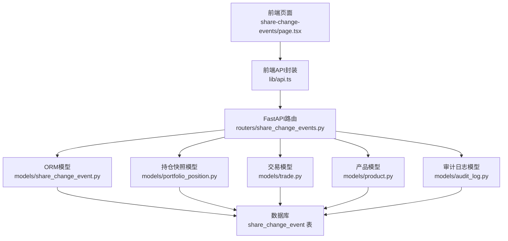
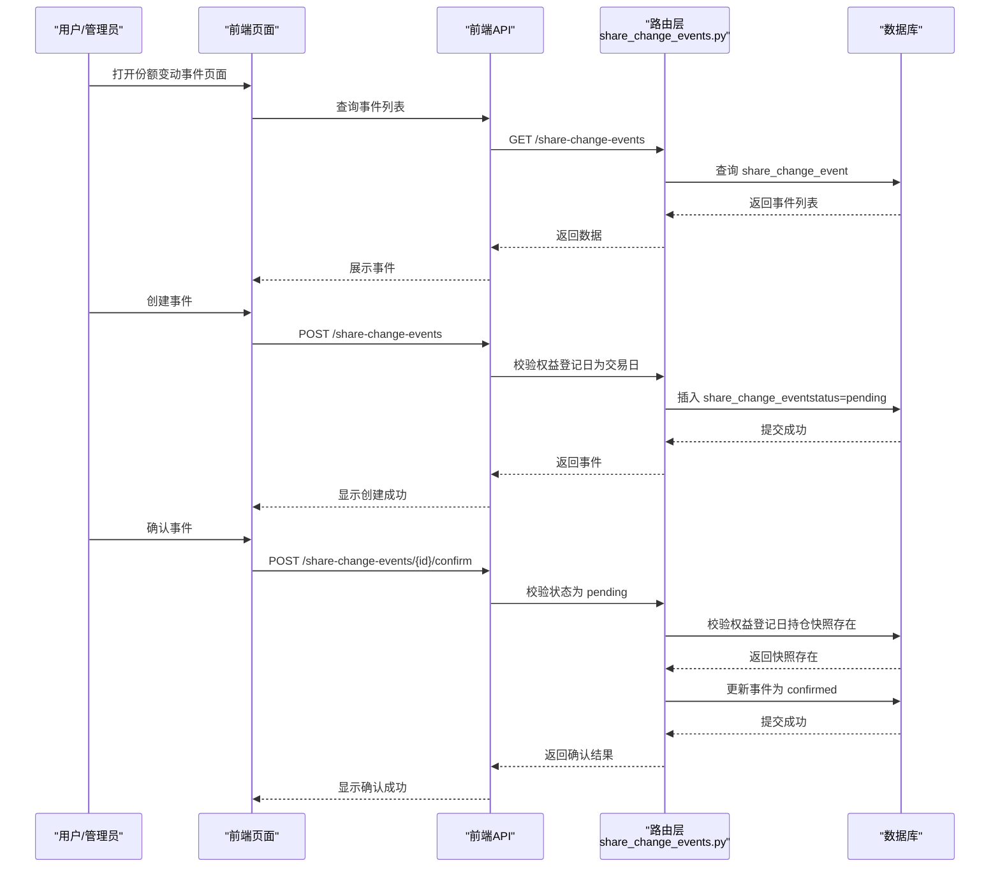
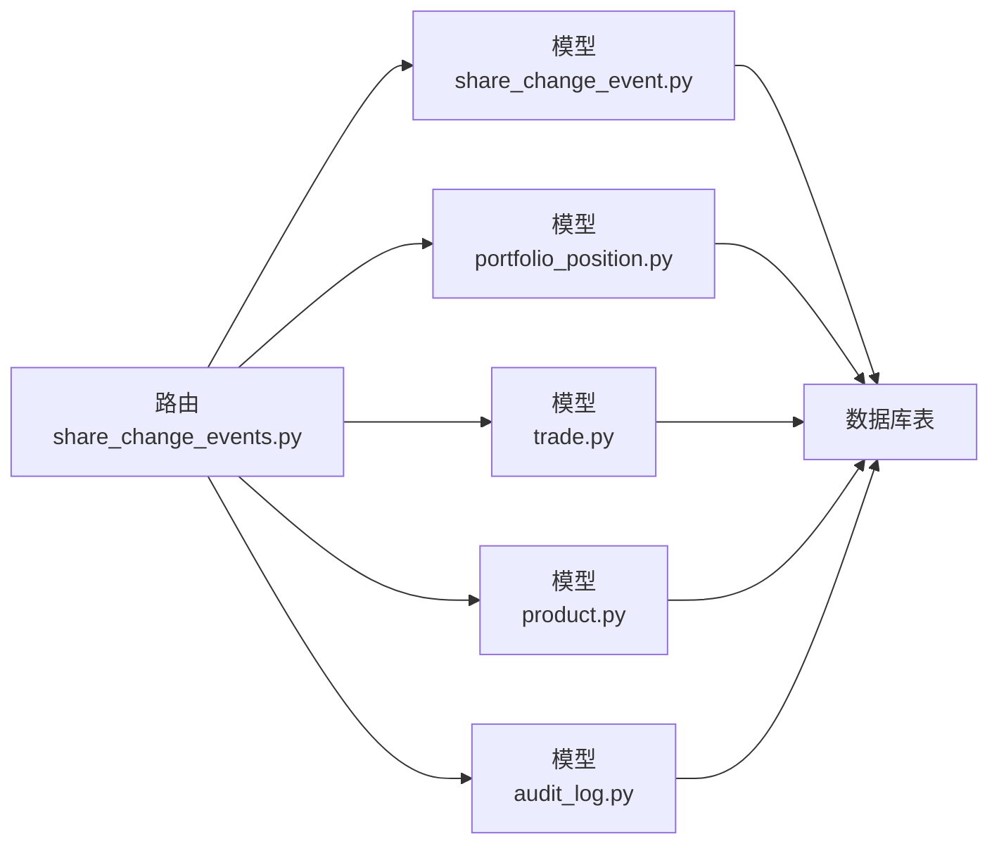

# 份额变动事件

<cite>
**本文引用的文件**
- [backend/app/models/share_change_event.py](file://backend/app/models/share_change_event.py)
- [backend/app/schemas/share_change_event.py](file://backend/app/schemas/share_change_event.py)
- [backend/app/routers/share_change_events.py](file://backend/app/routers/share_change_events.py)
- [backend/app/models/portfolio_position.py](file://backend/app/models/portfolio_position.py)
- [backend/app/models/product.py](file://backend/app/models/product.py)
- [backend/app/models/trade.py](file://backend/app/models/trade.py)
- [backend/app/models/audit_log.py](file://backend/app/models/audit_log.py)
- [Docs/02-数据库设计.md](file://Docs/02-数据库设计.md)
- [Docs/03-业务流程设计.md](file://Docs/03-业务流程设计.md)
- [Docs/04-后端开发.md](file://Docs/04-后端开发.md)
- [frontend/src/lib/api.ts](file://frontend/src/lib/api.ts)
- [frontend/src/app/portfolio/[code]/share-change-events/page.tsx](file://frontend/src/app/portfolio/[code]/share-change-events/page.tsx)
- [backend/app/services/snapshot_service.py](file://backend/app/services/snapshot_service.py)
</cite>

## 目录
1. [简介](#简介)
2. [项目结构](#项目结构)
3. [核心组件](#核心组件)
4. [架构概览](#架构概览)
5. [详细组件分析](#详细组件分析)
6. [依赖分析](#依赖分析)
7. [性能考虑](#性能考虑)
8. [故障排查指南](#故障排查指南)
9. [结论](#结论)
10. [附录](#附录)

## 简介
本文件系统化阐述“份额变动事件”功能的设计与实现，覆盖事件类型、业务规则、审批与执行流程、会计与净值影响、API 接口、与交易记录的关联与一致性保障、审计追踪与异常处理、以及最佳实践与合规要求。目标读者包括产品经理、开发者、测试工程师与运营人员。

## 项目结构
份额变动事件功能由后端模型/路由/服务与前端页面/API 客户端共同组成，数据模型与业务规则以数据库设计文档与业务流程设计文档为准，后端路由提供 REST 接口，前端页面提供可视化与交互。

图表来源
- [backend/app/routers/share_change_events.py:1-183](file://backend/app/routers/share_change_events.py#L1-L183)
- [backend/app/models/share_change_event.py:1-37](file://backend/app/models/share_change_event.py#L1-L37)
- [backend/app/models/portfolio_position.py:1-34](file://backend/app/models/portfolio_position.py#L1-L34)
- [backend/app/models/trade.py:1-32](file://backend/app/models/trade.py#L1-L32)
- [backend/app/models/product.py:1-22](file://backend/app/models/product.py#L1-L22)
- [backend/app/models/audit_log.py:1-18](file://backend/app/models/audit_log.py#L1-L18)
- [frontend/src/lib/api.ts:590-626](file://frontend/src/lib/api.ts#L590-L626)
- [frontend/src/app/portfolio/[code]/share-change-events/page.tsx](file://frontend/src/app/portfolio/[code]/share-change-events/page.tsx#L58-L128)

章节来源
- [backend/app/routers/share_change_events.py:1-183](file://backend/app/routers/share_change_events.py#L1-L183)
- [backend/app/models/share_change_event.py:1-37](file://backend/app/models/share_change_event.py#L1-L37)
- [frontend/src/lib/api.ts:590-626](file://frontend/src/lib/api.ts#L590-L626)
- [frontend/src/app/portfolio/[code]/share-change-events/page.tsx](file://frontend/src/app/portfolio/[code]/share-change-events/page.tsx#L58-L128)

## 核心组件
- 份额变动事件模型：定义事件类型、日期、份额与现金变化、状态与来源等字段，并与产品与组合建立外键关系。
- 份额变动事件路由：提供创建、查询、确认、取消、更新、删除接口，并在关键节点进行交易日校验与持仓快照校验。
- 份额变动事件模式：定义请求/响应/更新的数据结构，确保前后端契约一致。
- 持仓快照模型：用于确认事件时校验权益登记日的份额存在性，并在每日快照生成时汇总反映事件影响。
- 交易模型与产品模型：支撑净值/价格计算与事件影响的会计处理。
- 审计日志模型：记录份额变动事件的关键操作，满足合规与审计要求。
- 前端API封装与页面：提供事件列表、创建、确认、取消、删除等交互能力。

章节来源
- [backend/app/models/share_change_event.py:5-37](file://backend/app/models/share_change_event.py#L5-L37)
- [backend/app/schemas/share_change_event.py:6-49](file://backend/app/schemas/share_change_event.py#L6-L49)
- [backend/app/routers/share_change_events.py:28-183](file://backend/app/routers/share_change_events.py#L28-L183)
- [backend/app/models/portfolio_position.py:5-34](file://backend/app/models/portfolio_position.py#L5-L34)
- [backend/app/models/trade.py:5-32](file://backend/app/models/trade.py#L5-L32)
- [backend/app/models/product.py:5-22](file://backend/app/models/product.py#L5-L22)
- [backend/app/models/audit_log.py:5-18](file://backend/app/models/audit_log.py#L5-L18)
- [frontend/src/lib/api.ts:536-626](file://frontend/src/lib/api.ts#L536-L626)
- [frontend/src/app/portfolio/[code]/share-change-events/page.tsx](file://frontend/src/app/portfolio/[code]/share-change-events/page.tsx#L58-L128)

## 架构概览
份额变动事件处理遵循“公告期-权益登记日-执行日”的三阶段流程，结合交易日历与持仓快照进行严格校验，确保净值与会计平衡。

图表来源
- [backend/app/routers/share_change_events.py:28-128](file://backend/app/routers/share_change_events.py#L28-L128)
- [Docs/03-业务流程设计.md:1010-1113](file://Docs/03-业务流程设计.md#L1010-L1113)
- [Docs/04-后端开发.md:543-634](file://Docs/04-后端开发.md#L543-L634)
- [frontend/src/lib/api.ts:590-626](file://frontend/src/lib/api.ts#L590-L626)
- [frontend/src/app/portfolio/[code]/share-change-events/page.tsx](file://frontend/src/app/portfolio/[code]/share-change-events/page.tsx#L89-L128)

## 详细组件分析

### 事件类型与业务规则
- 事件类型
  - 现金分红：份额不变，现金增加
  - 分红再投资：份额增加，现金不变
  - 份额拆分：按比例扩大份额
  - 份额合并：按比例缩小份额
  - 红股（送股）：按比例增加份额
  - 强制调整：管理员手工指定份额与现金变化
- 关键规则
  - 权益登记日必须为交易日（创建时校验）
  - 确认时必须校验权益登记日的持仓快照存在
  - 事件状态：pending → confirmed/cancelled
  - 事件影响：仅影响份额与现金，不影响组合总市值与净值

章节来源
- [Docs/02-数据库设计.md:448-467](file://Docs/02-数据库设计.md#L448-L467)
- [Docs/03-业务流程设计.md:1015-1025](file://Docs/03-业务流程设计.md#L1015-L1025)
- [Docs/03-业务流程设计.md:1038-1113](file://Docs/03-业务流程设计.md#L1038-L1113)
- [Docs/03-业务流程设计.md:1115-1173](file://Docs/03-业务流程设计.md#L1115-L1173)
- [Docs/03-业务流程设计.md:1175-1228](file://Docs/03-业务流程设计.md#L1175-L1228)
- [Docs/03-业务流程设计.md:1230-1261](file://Docs/03-业务流程设计.md#L1230-L1261)
- [Docs/03-业务流程设计.md:1262-1291](file://Docs/03-业务流程设计.md#L1262-L1291)
- [Docs/04-后端开发.md:543-634](file://Docs/04-后端开发.md#L543-L634)

### 数据模型与字段说明
- share_change_event 表
  - 事件标识与定位：portfolio_code、product_code、market
  - 事件要素：event_type、event_date、entitlement_date、event_source
  - 份额变化：shares_before、shares_change、shares_after、ratio
  - 现金影响：div_cash、reinvest_nav、cash_change、cash_product_code
  - 状态与审计：status、tushare_event_id、notes、created_at、confirmed_at
- portfolio_position 表
  - 持仓快照：shares、frozen_shares、cost_price、unit_price、market_value、amount、frozen_amount、snapshot_date
- product 表
  - 产品信息：code、market、product_type、asset_class_code 等
- trade 表
  - 交易记录：shares、amount、price、fee、actual_amount、trade_date、confirm_date、status

章节来源
- [backend/app/models/share_change_event.py:5-37](file://backend/app/models/share_change_event.py#L5-L37)
- [backend/app/models/portfolio_position.py:5-34](file://backend/app/models/portfolio_position.py#L5-L34)
- [backend/app/models/product.py:5-22](file://backend/app/models/product.py#L5-L22)
- [backend/app/models/trade.py:5-32](file://backend/app/models/trade.py#L5-L32)
- [Docs/02-数据库设计.md:410-446](file://Docs/02-数据库设计.md#L410-L446)

### 审批流程与执行时间
- 创建事件：管理员创建，状态为 pending；权益登记日必须为交易日
- 确认事件：仅 pending 状态可确认；必须校验权益登记日持仓快照存在；确认后状态变为 confirmed
- 取消事件：仅 pending 状态可取消；状态变为 cancelled
- 影响范围：事件仅影响对应组合与产品的份额与现金，不影响组合总市值与净值

章节来源
- [backend/app/routers/share_change_events.py:49-148](file://backend/app/routers/share_change_events.py#L49-L148)
- [Docs/03-业务流程设计.md:1304-1355](file://Docs/03-业务流程设计.md#L1304-L1355)
- [Docs/04-后端开发.md:543-634](file://Docs/04-后端开发.md#L543-L634)

### 会计处理与净值影响
- 现金分红
  - 份额不变，单位净值除权；现金增加 = 权益登记日份额 × 每份分红金额
- 分红再投资
  - 现金不变，份额增加 = 现金分红金额 ÷ 再投资净值
- 份额拆分/合并
  - 份额按比例扩大/缩小；单位净值同步调整，保持市值不变
- 红股送股
  - 份额按比例增加
- 强制调整
  - 管理员手工指定份额与现金变化
- 一致性验证
  - 确认后验证组合总市值与净值不变

章节来源
- [Docs/02-数据库设计.md:448-467](file://Docs/02-数据库设计.md#L448-L467)
- [Docs/03-业务流程设计.md:1026-1113](file://Docs/03-业务流程设计.md#L1026-L1113)
- [Docs/03-业务流程设计.md:1115-1173](file://Docs/03-业务流程设计.md#L1115-L1173)
- [Docs/03-业务流程设计.md:1175-1228](file://Docs/03-业务流程设计.md#L1175-L1228)
- [Docs/03-业务流程设计.md:1230-1261](file://Docs/03-业务流程设计.md#L1230-L1261)
- [Docs/03-业务流程设计.md:1262-1291](file://Docs/03-业务流程设计.md#L1262-L1291)

### API 接口说明
- 查询事件列表
  - 方法：GET /api/share-change-events
  - 参数：portfolio_code、status、start_date、end_date、page、page_size
  - 返回：分页列表与总数
- 获取事件详情
  - 方法：GET /api/share-change-events/{id}
  - 返回：事件详情
- 创建事件
  - 方法：POST /api/share-change-events
  - 校验：权益登记日为交易日；组合存在；事件字段完整
  - 返回：创建后的事件（status=pending）
- 更新事件
  - 方法：PUT /api/share-change-events/{id}
  - 权限：管理员
- 确认事件
  - 方法：POST /api/share-change-events/{id}/confirm
  - 校验：状态为 pending；权益登记日持仓快照存在
  - 返回：确认后的事件
- 取消事件
  - 方法：POST /api/share-change-events/{id}/cancel
  - 校验：状态为 pending
- 删除事件
  - 方法：DELETE /api/share-change-events/{id}
  - 校验：仅 pending 状态可删除

章节来源
- [Docs/04-后端开发.md:543-634](file://Docs/04-后端开发.md#L543-L634)
- [backend/app/routers/share_change_events.py:28-183](file://backend/app/routers/share_change_events.py#L28-L183)
- [frontend/src/lib/api.ts:590-626](file://frontend/src/lib/api.ts#L590-L626)

### 与交易记录的关联与一致性
- 交易记录（trade）用于净值与价格计算，份额变动事件不改变交易记录本身，但会影响净值与份额的会计处理
- 持仓快照（portfolio_position）每日汇总，确认事件后在快照中体现份额与净值变化
- 服务层检查存在未确认事件，避免快照生成时的偏差

章节来源
- [backend/app/models/trade.py:5-32](file://backend/app/models/trade.py#L5-L32)
- [backend/app/models/portfolio_position.py:5-34](file://backend/app/models/portfolio_position.py#L5-L34)
- [backend/app/services/snapshot_service.py:696-714](file://backend/app/services/snapshot_service.py#L696-L714)

### 审计追踪与异常处理
- 审计日志
  - 记录资源类型为 share_change_event 的创建、更新、删除操作
  - 包含操作人、资源ID、旧值、新值、IP等
- 异常处理
  - 权益登记日非交易日：返回 INVALID_ENTITLEMENT_DATE
  - 未找到组合：返回 404
  - 状态不符：返回 INVALID_STATUS
  - 缺失持仓快照：返回 MISSING_POSITION_SNAPSHOT
  - 前端通过 toast 提示错误与成功

章节来源
- [backend/app/models/audit_log.py:5-18](file://backend/app/models/audit_log.py#L5-L18)
- [backend/app/routers/share_change_events.py:55-148](file://backend/app/routers/share_change_events.py#L55-L148)
- [frontend/src/app/portfolio/[code]/share-change-events/page.tsx](file://frontend/src/app/portfolio/[code]/share-change-events/page.tsx#L91-L128)

### 事件类型分类与触发条件
- 现金分红：公告日创建，除息日/派息日确认
- 分红再投资：公告日创建，执行日确认
- 份额拆分/合并：公告日创建，执行日确认
- 红股送股：公告日创建，执行日确认
- 强制调整：管理员创建，确认后执行

章节来源
- [Docs/03-业务流程设计.md:1015-1025](file://Docs/03-业务流程设计.md#L1015-L1025)
- [Docs/03-业务流程设计.md:1038-1113](file://Docs/03-业务流程设计.md#L1038-L1113)
- [Docs/03-业务流程设计.md:1115-1173](file://Docs/03-业务流程设计.md#L1115-L1173)
- [Docs/03-业务流程设计.md:1175-1228](file://Docs/03-业务流程设计.md#L1175-L1228)
- [Docs/03-业务流程设计.md:1230-1261](file://Docs/03-业务流程设计.md#L1230-L1261)
- [Docs/03-业务流程设计.md:1262-1291](file://Docs/03-业务流程设计.md#L1262-L1291)

### 事件影响计算与数据一致性
- 现金分红：cash_change = entitlement_shares × div_cash；基金份额不变，单位净值除权；现金增加
- 分红再投资：shares_change = entitlement_shares × div_cash ÷ reinvest_nav；基金份额增加，单位净值不变
- 份额拆分/合并：shares_after = entitlement_shares × ratio 或 ÷ ratio；单位净值同步调整
- 红股送股：shares_change = entitlement_shares × ratio；基金份额增加
- 强制调整：按管理员指定的 shares_change 与 cash_change 执行
- 一致性验证：确认后验证组合总市值与净值不变

章节来源
- [Docs/02-数据库设计.md:448-467](file://Docs/02-数据库设计.md#L448-L467)
- [Docs/03-业务流程设计.md:1026-1113](file://Docs/03-业务流程设计.md#L1026-L1113)
- [Docs/03-业务流程设计.md:1115-1173](file://Docs/03-业务流程设计.md#L1115-L1173)
- [Docs/03-业务流程设计.md:1175-1228](file://Docs/03-业务流程设计.md#L1175-L1228)
- [Docs/03-业务流程设计.md:1230-1261](file://Docs/03-业务流程设计.md#L1230-L1261)
- [Docs/03-业务流程设计.md:1262-1291](file://Docs/03-业务流程设计.md#L1262-L1291)

## 依赖分析
- 路由依赖
  - 交易日校验依赖交易日历表
  - 确认事件依赖持仓快照表
  - 事件与产品/组合建立外键约束
- 数据模型耦合
  - share_change_event 与 portfolio_position、product 建立外键
  - 与 trade、audit_log 无直接外键，通过业务流程保证一致性
- 前后端契约
  - 前端 API 封装与后端模式严格对应，确保字段与类型一致

图表来源
- [backend/app/routers/share_change_events.py:1-183](file://backend/app/routers/share_change_events.py#L1-L183)
- [backend/app/models/share_change_event.py:1-37](file://backend/app/models/share_change_event.py#L1-L37)
- [backend/app/models/portfolio_position.py:1-34](file://backend/app/models/portfolio_position.py#L1-L34)
- [backend/app/models/trade.py:1-32](file://backend/app/models/trade.py#L1-L32)
- [backend/app/models/product.py:1-22](file://backend/app/models/product.py#L1-L22)
- [backend/app/models/audit_log.py:1-18](file://backend/app/models/audit_log.py#L1-L18)

章节来源
- [backend/app/routers/share_change_events.py:1-183](file://backend/app/routers/share_change_events.py#L1-L183)
- [backend/app/models/share_change_event.py:1-37](file://backend/app/models/share_change_event.py#L1-L37)
- [backend/app/models/portfolio_position.py:1-34](file://backend/app/models/portfolio_position.py#L1-L34)
- [backend/app/models/trade.py:1-32](file://backend/app/models/trade.py#L1-L32)
- [backend/app/models/product.py:1-22](file://backend/app/models/product.py#L1-L22)
- [backend/app/models/audit_log.py:1-18](file://backend/app/models/audit_log.py#L1-L18)

## 性能考虑
- 数据库索引
  - share_change_event：按 portfolio_code、event_date、status 建立索引，提升查询与筛选效率
- 并发与一致性
  - 使用 WAL 模式提升 SQLite 并发读写性能
  - 服务层检查未确认事件，避免快照生成时的偏差
- 前端分页
  - 列表查询支持分页，避免一次性加载过多数据

章节来源
- [Docs/02-数据库设计.md:587-589](file://Docs/02-数据库设计.md#L587-L589)
- [Docs/02-数据库设计.md:624-647](file://Docs/02-数据库设计.md#L624-L647)
- [backend/app/services/snapshot_service.py:696-714](file://backend/app/services/snapshot_service.py#L696-L714)

## 故障排查指南
- 权益登记日非交易日
  - 现象：创建事件失败，返回 INVALID_ENTITLEMENT_DATE
  - 处理：选择交易日作为权益登记日
- 缺失持仓快照
  - 现象：确认事件失败，返回 MISSING_POSITION_SNAPSHOT
  - 处理：先生成权益登记日的持仓快照，再确认事件
- 状态不符
  - 现象：确认/取消失败，返回 INVALID_STATUS
  - 处理：仅对 pending 状态的事件进行确认/取消
- 未找到组合
  - 现象：创建事件失败，返回 404
  - 处理：确认组合编码正确
- 前端错误提示
  - 使用 toast 提示错误与成功，便于快速定位问题

章节来源
- [backend/app/routers/share_change_events.py:55-148](file://backend/app/routers/share_change_events.py#L55-L148)
- [frontend/src/app/portfolio/[code]/share-change-events/page.tsx](file://frontend/src/app/portfolio/[code]/share-change-events/page.tsx#L91-L128)

## 结论
份额变动事件功能通过严格的交易日与持仓快照校验、清晰的事件类型与会计处理规则、完善的前后端接口与审计追踪，实现了对份额变动的准确记录与净值一致性保障。配合服务层的快照检查与前端的可视化交互，能够满足运营与合规需求。

## 附录
- 事件类型与计算公式速查
  - 现金分红：份额不变，现金增加 = entitlement_shares × div_cash
  - 分红再投资：份额增加 = entitlement_shares × div_cash ÷ reinvest_nav，现金不变
  - 份额拆分：shares_after = entitlement_shares × ratio，单位净值同步调整
  - 份额合并：shares_after = entitlement_shares ÷ ratio，单位净值同步调整
  - 红股送股：shares_change = entitlement_shares × ratio
  - 强制调整：按管理员指定的 shares_change 与 cash_change 执行

章节来源
- [Docs/02-数据库设计.md:448-467](file://Docs/02-数据库设计.md#L448-L467)
- [Docs/03-业务流程设计.md:1015-1025](file://Docs/03-业务流程设计.md#L1015-L1025)