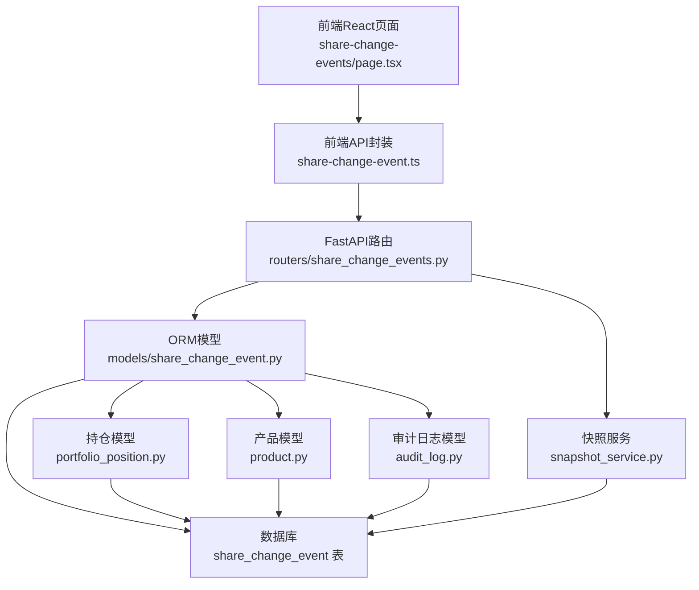
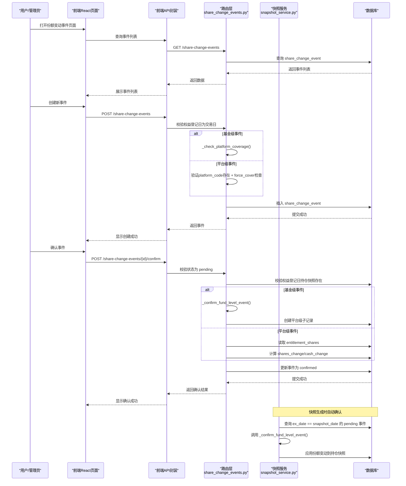
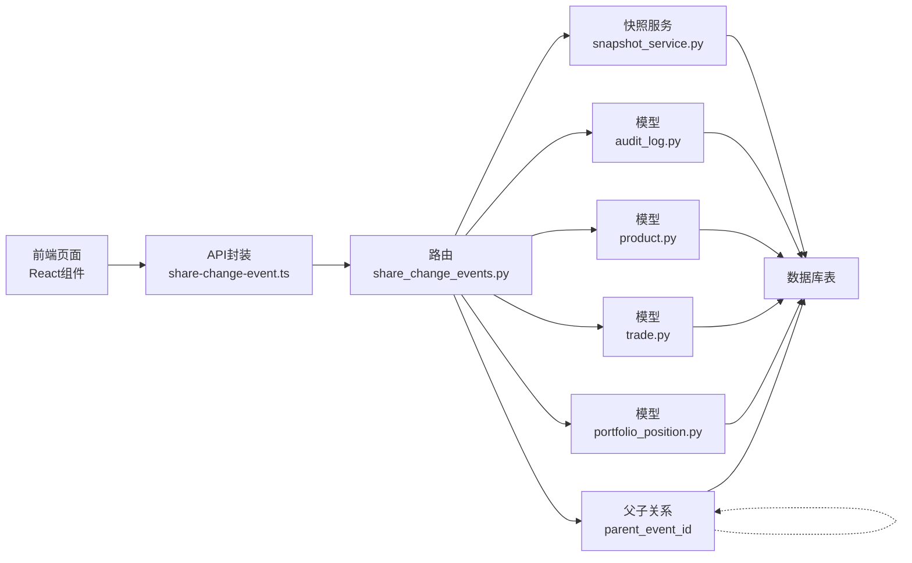

# 份额变动事件

<cite>
**本文引用的文件**
- [backend/app/models/share_change_event.py](file://backend/app/models/share_change_event.py)
- [backend/app/schemas/share_change_event.py](file://backend/app/schemas/share_change_event.py)
- [backend/app/routers/share_change_events.py](file://backend/app/routers/share_change_events.py)
- [backend/app/services/snapshot_service.py](file://backend/app/services/snapshot_service.py)
- [frontend/src/app/portfolio/[code]/share-change-events/page.tsx](file://frontend/src/app/portfolio/[code]/share-change-events/page.tsx)
- [frontend/src/lib/api/share-change-event.ts](file://frontend/src/lib/api/share-change-event.ts)
- [frontend/src/types/share-change-event.ts](file://frontend/src/types/share-change-event.ts)
- [Docs/08-补充-platform_code强制与关联约束.md](file://Docs/08-补充-platform_code强制与关联约束.md)
</cite>

## 更新摘要
**变更内容**
- **平台覆盖率检查增强**：从警告机制升级为默认阻断，新增 `force_cover` 参数用于降级处理
- **新增 unconfirm API 端点**：支持已确认事件的取消确认操作，包含快照依赖检查和级联处理
- **增强级联回退日志**：在快照删除时记录详细的回退信息，包括订阅和事件的回退数量
- **改进错误处理**：新增 `PLATFORM_NOT_COVERED` 和 `CANNOT_UNCONFIRM_CHILD` 等错误码

## 目录
1. [简介](#简介)
2. [项目结构](#项目结构)
3. [核心组件](#核心组件)
4. [架构概览](#架构概览)
5. [详细组件分析](#详细组件分析)
6. [依赖分析](#依赖分析)
7. [性能考虑](#性能考虑)
8. [故障排查指南](#故障排查指南)
9. [结论](#结论)
10. [附录](#附录)

## 简介
本文件系统化阐述"份额变动事件"功能的增强设计与实现，重点介绍新增的父子事件关系管理系统、平台级与基金级事件分类机制、严格的日期验证规则和平台覆盖率检查功能。该功能现已升级为完整的现代化系统，支持所有CRUD操作，包括创建、查询、确认、取消、更新、删除和取消确认，并提供直观的可视化操作体验。

## 项目结构
份额变动事件功能由后端模型/路由/服务与现代化的前端React页面/API客户端共同组成，数据模型与业务规则以数据库设计文档为准，后端路由提供完整的REST接口，前端页面提供丰富的可视化与交互体验。

**图表来源**
- [frontend/src/app/portfolio/[code]/share-change-events/page.tsx:1-484](file://frontend/src/app/portfolio/[code]/share-change-events/page.tsx#L1-L484)
- [backend/app/routers/share_change_events.py:1-493](file://backend/app/routers/share_change_events.py#L1-L493)
- [backend/app/models/share_change_event.py:1-39](file://backend/app/models/share_change_event.py#L1-L39)
- [frontend/src/lib/api/share-change-event.ts:1-44](file://frontend/src/lib/api/share-change-event.ts#L1-L44)

## 核心组件
- **增强的份额变动事件模型**：定义事件类型、日期、份额与现金变化、状态与来源等字段，支持与父事件的层级关系和外键约束，支持父子事件关系管理。
- **智能份额变动事件路由**：提供完整的CRUD接口（创建、查询、确认、取消、更新、删除、取消确认），并在关键节点进行交易日校验与持仓快照校验，支持基金级事件的自动拆分。
- **完善的份额变动事件模式**：定义请求/响应/更新的数据结构，确保前后端契约一致，支持可选字段和类型验证。
- **现代化前端界面**：提供事件列表展示、动态表单创建、状态管理和实时反馈的React组件，支持平台选择器和事件类型动态显示。
- **智能快照服务集成**：在快照生成时自动确认符合条件的待处理事件，并应用份额变动影响，支持父子事件的自动处理。
- **增强的API封装**：提供完整的RESTful接口支持，包括分页查询、状态管理、错误处理和平台覆盖率检查。

**章节来源**
- [backend/app/models/share_change_event.py:5-39](file://backend/app/models/share_change_event.py#L5-L39)
- [backend/app/schemas/share_change_event.py:6-55](file://backend/app/schemas/share_change_event.py#L6-L55)
- [backend/app/routers/share_change_events.py:25-493](file://backend/app/routers/share_change_events.py#L25-L493)
- [frontend/src/app/portfolio/[code]/share-change-events/page.tsx:64-484](file://frontend/src/app/portfolio/[code]/share-change-events/page.tsx#L64-L484)
- [frontend/src/lib/api/share-change-event.ts:9-44](file://frontend/src/lib/api/share-change-event.ts#L9-L44)

## 架构概览
份额变动事件处理遵循"公告期-权益登记日-执行日"的三阶段流程，结合交易日历与持仓快照进行严格校验，确保净值与会计平衡。新的前端界面提供了完整的用户交互体验，支持实时状态更新和错误处理，同时支持父子事件的自动拆分和管理。

**图表来源**
- [frontend/src/app/portfolio/[code]/share-change-events/page.tsx:125-163](file://frontend/src/app/portfolio/[code]/share-change-events/page.tsx#L125-L163)
- [backend/app/routers/share_change_events.py:294-359](file://backend/app/routers/share_change_events.py#L294-L359)
- [backend/app/services/snapshot_service.py:1024-1047](file://backend/app/services/snapshot_service.py#L1024-1047)
- [frontend/src/lib/api/share-change-event.ts:26-36](file://frontend/src/lib/api/share-change-event.ts#L26-36)

## 详细组件分析

### 事件类型与业务规则
- **事件类型**
  - 现金分红：份额不变，现金增加
  - 分红再投资：份额增加，现金不变
  - 份额拆分：按比例扩大份额
  - 份额合并：按比例缩小份额
  - 红股（送股）：按比例增加份额
  - 强制调整：管理员手工指定份额与现金变化
- **事件分级模型**
  - **基金级事件**（`share_split`/`share_merge`/`bonus_share`）：录入时 `platform_code` 为空，确认时自动拆分为各平台子记录（`parent_event_id` 指向父记录），子记录的计算值按该平台独立设置
  - **平台级事件**（`cash_dividend`/`reinvest_dividend`/`forced_adjustment`）：必须指定 `platform_code`，每个有持仓的平台各录 1 条
- **关键规则**
  - 权益登记日必须为交易日（创建时校验，返回 `INVALID_ENTITLEMENT_DATE`）
  - 除息日必须为交易日（返回 `INVALID_EX_DATE`）
  - 除息日须严格大于权益登记日：`ex_date > entitlement_date`（返回 `INVALID_DATE_ORDER`）
  - 除息日须晚于最新快照日（返回 `DATE_BEFORE_SNAPSHOT`）
  - 确认时必须校验权益登记日的持仓快照存在（返回 `MISSING_POSITION_SNAPSHOT`）
  - 平台级事件缺少 platform_code 拒绝（返回 `PLATFORM_REQUIRED`）
  - 基金级事件指定了 platform_code 拒绝（返回 `PLATFORM_NOT_ALLOWED`）
  - **平台覆盖率检查**：平台级事件未全覆盖有持仓的平台时默认阻断，可通过 `force_cover=true` 降级为warning，列出未覆盖平台
  - pending 事件拦截快照生成（`ex_date <= target_date` 的 pending 事件导致快照检查返回 failed）
  - 事件状态：pending → confirmed/cancelled
  - 事件影响：仅影响份额与现金，不影响组合总市值与净值
  - 支持事件的更新、删除和取消确认操作
  - 确认时自动回写：从 `entitlement_date` 快照读取 `entitlement_shares`，按 `event_type` 预计算 `shares_before`/`shares_change`/`shares_after`/`cash_change`（`forced_adjustment` 由用户直接填写）
  - **级联删除子记录**：删除快照/删除事件时，基金级父记录的子记录（`parent_event_id == event.id`）被物理删除，确保 regen 重确认不重复拆分

**章节来源**
- [backend/app/routers/share_change_events.py:25-26](file://backend/app/routers/share_change_events.py#L25-L26)
- [backend/app/routers/share_change_events.py:250-264](file://backend/app/routers/share_change_events.py#L250-L264)
- [backend/app/routers/share_change_events.py:475-493](file://backend/app/routers/share_change_events.py#L475-L493)

### 数据模型与字段说明
- **share_change_event 表**
  - 事件标识与定位：portfolio_code、product_code、market、**platform_code**（nullable，平台级必填）、**parent_event_id**（nullable，基金级事件拆分子记录指向父记录）
  - 事件要素：event_type、**ex_date**、entitlement_date、event_source
  - 份额变化：shares_before、shares_change、shares_after、ratio
  - 现金影响：div_cash、reinvest_nav、cash_change、cash_product_code
  - 状态与审计：status、tushare_event_id、notes、created_at、confirmed_at
- **portfolio_position 表**
  - 持仓快照：shares、frozen_shares、cost_price、unit_price、market_value、amount、frozen_amount、snapshot_date
- **product 表**
  - 产品信息：code、market、product_type、asset_class_code 等
- **trade 表**
  - 交易记录：shares、amount、price、fee、actual_amount、trade_date、confirm_date、status

**章节来源**
- [backend/app/models/share_change_event.py:8-31](file://backend/app/models/share_change_event.py#L8-L31)
- [backend/app/models/portfolio_position.py:5-34](file://backend/app/models/portfolio_position.py#L5-34)
- [backend/app/models/product.py:5-22](file://backend/app/models/product.py#L5-22)
- [backend/app/models/trade.py:5-32](file://backend/app/models/trade.py#L5-L32)

### 审批流程与执行时间
- **创建事件**：管理员创建，状态为 pending；权益登记日与除息日均须为交易日；除息日须严格大于权益登记日（`ex_date > entitlement_date`）；除息日须晚于最新快照日；**平台覆盖率检查**：平台级事件会检查是否覆盖所有有持仓的平台，默认阻断，可传 `force_cover=true` 降级为warning
- **确认事件**：仅 pending 状态可确认；必须校验权益登记日持仓快照存在；确认后状态变为 confirmed
  - **确认时自动回写**：从 `entitlement_date` 快照读取 `entitlement_shares`，按 `event_type` 自动预计算 `shares_before`/`shares_change`/`shares_after`/`cash_change`（`forced_adjustment` 由用户直接填写）
  - **基金级事件自动拆分**：确认时为每个有持仓的平台生成子记录（`parent_event_id` 指向父记录），子记录的 `platform_code` 和计算值按该平台独立设置，父记录设汇总值
- **取消事件**：仅 pending 状态可取消；状态变为 cancelled
- **取消确认事件**：仅 confirmed 状态可取消确认；需检查快照依赖（ex_date及之后无快照）；基金级父记录会级联删除所有子记录；平台级记录直接置pending并清空计算字段
- **更新事件**：支持修改事件的基本信息和状态
- **删除事件**：仅 pending 状态可删除；基金级父记录删除时，子记录（`parent_event_id == event.id`）被物理级联删除
- **影响范围**：事件仅影响对应组合与产品的份额与现金，不影响组合总市值与净值

**章节来源**
- [backend/app/routers/share_change_events.py:170-279](file://backend/app/routers/share_change_events.py#L170-L279)
- [backend/app/routers/share_change_events.py:294-359](file://backend/app/routers/share_change_events.py#L294-L359)
- [backend/app/routers/share_change_events.py:382-453](file://backend/app/routers/share_change_events.py#L382-L453)
- [backend/app/routers/share_change_events.py:456-493](file://backend/app/routers/share_change_events.py#L456-L493)

### 会计处理与净值影响
- **现金分红**
  - 份额不变，单位净值除权；现金增加 = 权益登记日份额 × 每份分红金额
- **分红再投资**
  - 现金不变，份额增加 = 现金分红金额 ÷ 再投资净值
- **份额拆分/合并**
  - 份额按比例扩大/缩小；单位净值同步调整，保持市值不变
- **红股送股**
  - 份额按比例增加
- **强制调整**
  - 管理员手工指定份额与现金变化
- **一致性验证**
  - 确认后验证组合总市值与净值不变

**章节来源**
- [backend/app/routers/share_change_events.py:36-61](file://backend/app/routers/share_change_events.py#L36-L61)

### API 接口说明
- **查询事件列表**
  - 方法：GET /api/share-change-events
  - 参数：portfolio_code、page、page_size
  - 返回：分页列表与总数
- **获取事件详情**
  - 方法：GET /api/share-change-events/{id}
  - 返回：事件详情
- **创建事件**
  - 方法：POST /api/share-change-events
  - 参数：force_cover（可选，默认false，平台覆盖不全时降为warning）
  - 校验：权益登记日为交易日；组合存在；事件字段完整；**平台覆盖率检查**
  - 返回：创建后的事件（status=pending）
- **更新事件**
  - 方法：PUT /api/share-change-events/{id}
  - 权限：管理员
  - 功能：支持修改事件的基本信息和状态
- **确认事件**
  - 方法：POST /api/share-change-events/{id}/confirm
  - 校验：状态为 pending；权益登记日持仓快照存在；**基金级事件自动拆分**
  - 返回：确认后的事件
- **取消事件**
  - 方法：POST /api/share-change-events/{id}/cancel
  - 校验：状态为 pending
- **取消确认事件**
  - 方法：POST /api/share-change-events/{id}/unconfirm
  - 校验：状态为 confirmed；快照依赖检查（ex_date及之后无快照）；子记录不允许单独取消确认
  - 功能：基金级父记录级联删除子记录后置pending；平台级记录直接置pending并清空计算字段
- **删除事件**
  - 方法：DELETE /api/share-change-events/{id}
  - 校验：仅 pending 状态可删除；**级联删除子记录**

**章节来源**
- [backend/app/routers/share_change_events.py:149-493](file://backend/app/routers/share_change_events.py#L149-L493)
- [frontend/src/lib/api/share-change-event.ts:9-44](file://frontend/src/lib/api/share-change-event.ts#L9-L44)

### 前端界面与用户体验
- **现代化React界面**：提供直观的事件管理界面，支持实时状态更新
- **动态表单**：根据事件类型动态显示相应的输入字段，**支持平台选择器**
- **状态管理**：清晰的状态显示（待确认、已确认、已取消）
- **实时反馈**：使用Toast通知提供操作成功/失败的即时反馈
- **响应式设计**：支持桌面和移动设备的良好用户体验
- **数据可视化**：表格形式展示事件列表，支持排序和筛选
- **平台级事件支持**：平台级事件显示平台选择器，基金级事件隐藏平台选择器

**章节来源**
- [frontend/src/app/portfolio/[code]/share-change-events/page.tsx:64-484](file://frontend/src/app/portfolio/[code]/share-change-events/page.tsx#L64-L484)
- [frontend/src/lib/api/share-change-event.ts:9-44](file://frontend/src/lib/api/share-change-event.ts#L9-L44)

### 与交易记录的关联与一致性
- **交易记录**（trade）用于净值与价格计算，份额变动事件不改变交易记录本身，但会影响净值与份额的会计处理
- **持仓快照**（portfolio_position）每日汇总，确认事件后在快照中体现份额与净值变化
- **事件在快照中的应用**：`_generate_portfolio_position` 只读取 `platform_code IS NOT NULL` 的 confirmed 事件（跳过基金级父记录），按 `entitlement_date` 升序应用。`fund_key = (product_code, market, platform_code)` 按平台精确匹配。使用确认时预计算的 `shares_change`，不重算
- **pending 事件拦截快照**：存在 `ex_date <= target_date` 的 pending 事件时，快照生成检查返回 failed（非仅 warning）
- **数据一致性**：通过外键约束和业务规则确保数据完整性

**章节来源**
- [backend/app/services/snapshot_service.py:569-577](file://backend/app/services/snapshot_service.py#L569-L577)
- [backend/app/services/snapshot_service.py:579-598](file://backend/app/services/snapshot_service.py#L579-L598)

### 审计追踪与异常处理
- **审计日志**
  - 记录资源类型为 share_change_event 的创建、更新、删除操作
  - 包含操作人、资源ID、旧值、新值、IP等
- **异常处理**
  - 权益登记日非交易日：返回 INVALID_ENTITLEMENT_DATE
  - 除息日非交易日：返回 INVALID_EX_DATE
  - 除息日不严格大于权益登记日：返回 INVALID_DATE_ORDER
  - 交易/事件日期不晚于最新快照日：返回 DATE_BEFORE_SNAPSHOT
  - 平台级事件缺少 platform_code：返回 PLATFORM_REQUIRED
  - 基金级事件不应指定 platform_code：返回 PLATFORM_NOT_ALLOWED
  - 未找到组合：返回 404
  - 状态不符：返回 INVALID_STATUS
  - 缺失持仓快照：返回 MISSING_POSITION_SNAPSHOT
  - **平台不存在**：返回 PLATFORM_NOT_FOUND
  - **平台覆盖不全**：返回 PLATFORM_NOT_COVERED（默认阻断，可传 force_cover=true 降级）
  - **子记录单独取消确认**：返回 CANNOT_UNCONFIRM_CHILD
  - **快照依赖冲突**：返回 SNAPSHOT_DEPENDENCY
  - **前端错误提示**：通过 Toast 提示错误与成功，提供更好的用户体验

**章节来源**
- [backend/app/routers/share_change_events.py:178-279](file://backend/app/routers/share_change_events.py#L178-L279)
- [backend/app/routers/share_change_events.py:382-453](file://backend/app/routers/share_change_events.py#L382-L453)
- [frontend/src/app/portfolio/[code]/share-change-events/page.tsx:116-163](file://frontend/src/app/portfolio/[code]/share-change-events/page.tsx#L116-L163)

### 事件类型分类与触发条件
- **现金分红**：公告日创建，除息日/派息日确认
- **分红再投资**：公告日创建，执行日确认
- **份额拆分/合并**：公告日创建，执行日确认
- **红股送股**：公告日创建，执行日确认
- **强制调整**：管理员创建，确认后执行

**章节来源**
- [backend/app/routers/share_change_events.py:25-26](file://backend/app/routers/share_change_events.py#L25-L26)

### 事件影响计算与数据一致性
- **现金分红**：cash_change = entitlement_shares × div_cash；基金份额不变，单位净值除权；现金增加
- **分红再投资**：shares_change = entitlement_shares × div_cash ÷ reinvest_nav；基金份额增加，单位净值不变
- **份额拆分/合并**：shares_after = entitlement_shares × ratio 或 ÷ ratio；单位净值同步调整
- **红股送股**：shares_change = entitlement_shares × ratio；基金份额增加
- **强制调整**：按管理员指定的 shares_change 与 cash_change 执行
- **一致性验证**：确认后验证组合总市值与净值不变

**章节来源**
- [backend/app/routers/share_change_events.py:36-61](file://backend/app/routers/share_change_events.py#L36-L61)

### 父子事件关系管理
- **基金级事件**：作为父记录，`parent_event_id` 为空，`platform_code` 为空
- **平台级子事件**：作为子记录，`parent_event_id` 指向父记录ID，`platform_code` 指定具体平台
- **自动拆分机制**：确认基金级事件时，系统自动为每个有持仓的平台创建子记录
- **级联删除**：删除父记录时，自动删除所有相关的子记录
- **数据一致性**：父记录存储汇总数据，子记录存储平台特定数据

**章节来源**
- [backend/app/routers/share_change_events.py:91-147](file://backend/app/routers/share_change_events.py#L91-L147)
- [backend/app/routers/share_change_events.py:475-493](file://backend/app/routers/share_change_events.py#L475-L493)

### 平台覆盖率检查机制
- **检查时机**：创建平台级事件时进行覆盖率检查
- **检查逻辑**：比较有持仓的平台与已覆盖的平台集合
- **默认阻断机制**：未完全覆盖时默认阻断创建，返回 `PLATFORM_NOT_COVERED` 错误
- **force_cover 降级**：传入 `force_cover=true` 时降级为warning，允许继续创建
- **覆盖集合**：包含现有事件和当前正在创建的事件
- **平台匹配**：基于 `portfolio_position` 中的持仓数据进行匹配

**章节来源**
- [backend/app/routers/share_change_events.py:64-88](file://backend/app/routers/share_change_events.py#L64-88)
- [backend/app/routers/share_change_events.py:250-264](file://backend/app/routers/share_change_events.py#L250-L264)

### 级联回退与快照保护
- **快照删除时的级联回退**：删除快照前自动回退依赖该快照的申购/赎回和份额变动事件
- **详细的回退日志**：记录回退的订阅数量和事件数量，便于问题排查
- **快照依赖检查**：取消确认事件时检查ex_date及之后是否有快照，防止数据不一致
- **原子性保证**：使用savepoint确保子记录创建的原子性，失败时自动回滚

**章节来源**
- [backend/app/services/snapshot_service.py:395-440](file://backend/app/services/snapshot_service.py#L395-L440)
- [backend/app/routers/share_change_events.py:415-434](file://backend/app/routers/share_change_events.py#L415-L434)

## 依赖分析
- **路由依赖**
  - 交易日校验依赖交易日历表
  - 确认事件依赖持仓快照表
  - 事件与产品/组合建立外键约束
  - **父子关系依赖**：`parent_event_id` 自引用外键约束
- **数据模型耦合**
  - share_change_event 与 portfolio_position、product 建立外键
  - 与 trade、audit_log 无直接外键，通过业务流程保证一致性
  - **父子关系**：同一表的自引用外键关系
- **前后端契约**
  - 前端 API 封装与后端模式严格对应，确保字段与类型一致
- **前端依赖**
  - 使用 React Query 进行数据获取和缓存
  - 使用 TanStack Table 进行数据表格渲染
  - 使用 React Hook Form 进行表单管理

**图表来源**
- [backend/app/routers/share_change_events.py:1-493](file://backend/app/routers/share_change_events.py#L1-L493)
- [backend/app/models/share_change_event.py:1-39](file://backend/app/models/share_change_event.py#L1-L39)
- [frontend/src/app/portfolio/[code]/share-change-events/page.tsx:1-484](file://frontend/src/app/portfolio/[code]/share-change-events/page.tsx#L1-L484)
- [frontend/src/lib/api/share-change-event.ts:1-44](file://frontend/src/lib/api/share-change-event.ts#L1-L44)

## 性能考虑
- **数据库索引**
  - share_change_event：按 portfolio_code、ex_date、status 建立索引，提升查询与筛选效率
  - **父子关系索引**：`parent_event_id` 字段索引，优化级联删除性能
- **并发与一致性**
  - MySQL InnoDB 引擎提供行级锁与 MVCC 并发控制，配合 QueuePool 连接池提升读写性能
  - 服务层检查未确认事件，避免快照生成时的偏差
  - **父子事件原子操作**：基金级事件确认时使用事务确保子记录创建的原子性
  - **FOR UPDATE 锁定**：关键操作使用行级锁防止并发冲突
- **前端性能优化**
  - 使用 React Query 进行数据缓存和自动刷新
  - 支持分页查询，避免一次性加载过多数据
  - 实时状态更新，减少不必要的重新渲染
  - **平台数据缓存**：平台列表数据缓存，减少重复请求
- **网络优化**
  - API 请求去重和缓存策略
  - 错误重试机制

**章节来源**
- [frontend/src/app/portfolio/[code]/share-change-events/page.tsx:87-97](file://frontend/src/app/portfolio/[code]/share-change-events/page.tsx#L87-L97)
- [backend/app/services/snapshot_service.py:569-577](file://backend/app/services/snapshot_service.py#L569-L577)

## 故障排查指南
- **权益登记日非交易日**
  - 现象：创建事件失败，返回 INVALID_ENTITLEMENT_DATE
  - 处理：选择交易日作为权益登记日
- **缺失持仓快照**
  - 现象：确认事件失败，返回 MISSING_POSITION_SNAPSHOT
  - 处理：先生成权益登记日的持仓快照，再确认事件
- **状态不符**
  - 现象：确认/取消失败，返回 INVALID_STATUS
  - 处理：仅对 pending 状态的事件进行确认/取消
- **未找到组合**
  - 现象：创建事件失败，返回 404
  - 处理：确认组合编码正确
- **平台不存在**
  - 现象：创建平台级事件失败，返回 PLATFORM_NOT_FOUND
  - 处理：确认平台编码正确且平台存在
- **平台覆盖不全**
  - 现象：创建平台级事件失败，返回 PLATFORM_NOT_COVERED
  - 处理：补全所有有持仓平台的记录，或传 force_cover=true 降级为warning
- **子记录单独取消确认**
  - 现象：尝试对子记录执行unconfirm，返回 CANNOT_UNCONFIRM_CHILD
  - 处理：对父记录执行unconfirm操作
- **快照依赖冲突**
  - 现象：取消确认事件失败，返回 SNAPSHOT_DEPENDENCY
  - 处理：先删除ex_date及之后的快照，再执行unconfirm
- **前端错误提示**
  - 使用 Toast 提示错误与成功，便于快速定位问题
- **网络请求失败**
  - 检查 API 端点是否正确
  - 验证网络连接和服务器状态
- **数据加载缓慢**
  - 检查分页参数设置
  - 清除浏览器缓存后重试
- **父子事件问题**
  - 检查 `parent_event_id` 是否正确设置
  - 确认基金级事件确认时子记录创建成功

**章节来源**
- [backend/app/routers/share_change_events.py:178-279](file://backend/app/routers/share_change_events.py#L178-L279)
- [backend/app/routers/share_change_events.py:382-453](file://backend/app/routers/share_change_events.py#L382-L453)
- [frontend/src/app/portfolio/[code]/share-change-events/page.tsx:116-163](file://frontend/src/app/portfolio/[code]/share-change-events/page.tsx#L116-L163)

## 结论
份额变动事件功能通过增强的父子事件关系管理系统、完整的CRUD操作支持、严格的交易日与持仓快照校验、清晰的事件类型与会计处理规则、完善的前后端接口与审计追踪，实现了对份额变动的准确记录与净值一致性保障。新的React界面提供了直观的用户体验，配合服务层的快照检查和现代化的可视化交互，能够满足运营与合规需求，显著提升了系统的易用性和维护性。父子事件关系和平台覆盖率检查机制进一步增强了系统的灵活性和准确性。最新的增强包括默认阻断的平台覆盖率检查、完整的unconfirm功能和详细的级联回退日志，使系统在数据一致性和可追溯性方面更加完善。

## 附录
- **事件类型与计算公式速查**
  - 现金分红：份额不变，现金增加 = entitlement_shares × div_cash
  - 分红再投资：份额增加 = entitlement_shares × div_cash ÷ reinvest_nav，现金不变
  - 份额拆分：shares_after = entitlement_shares × ratio，单位净值同步调整
  - 份额合并：shares_after = entitlement_shares ÷ ratio，单位净值同步调整
  - 红股送股：shares_change = entitlement_shares × ratio
  - 强制调整：按管理员指定的 shares_change 与 cash_change 执行
- **父子事件关系速查**
  - 基金级事件：`parent_event_id` 为空，`platform_code` 为空
  - 平台级子事件：`parent_event_id` 指向父记录，`platform_code` 指定平台
  - 自动拆分：确认基金级事件时自动生成平台级子记录
  - 级联删除：删除父记录时自动删除所有子记录
- **平台覆盖率检查参数**
  - force_cover=false（默认）：平台覆盖不全时阻断创建
  - force_cover=true：平台覆盖不全时降级为warning，允许创建
- **错误码速查**
  - PLATFORM_NOT_COVERED：平台覆盖不全
  - CANNOT_UNCONFIRM_CHILD：子记录不允许单独取消确认
  - SNAPSHOT_DEPENDENCY：快照依赖冲突

**章节来源**
- [backend/app/routers/share_change_events.py:36-61](file://backend/app/routers/share_change_events.py#L36-L61)
- [backend/app/routers/share_change_events.py:91-147](file://backend/app/routers/share_change_events.py#L91-L147)
- [backend/app/routers/share_change_events.py:250-264](file://backend/app/routers/share_change_events.py#L250-L264)
- [backend/app/routers/share_change_events.py:382-453](file://backend/app/routers/share_change_events.py#L382-L453)