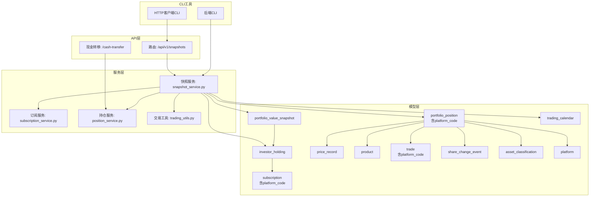
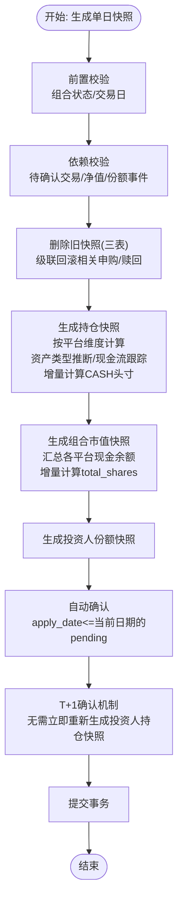
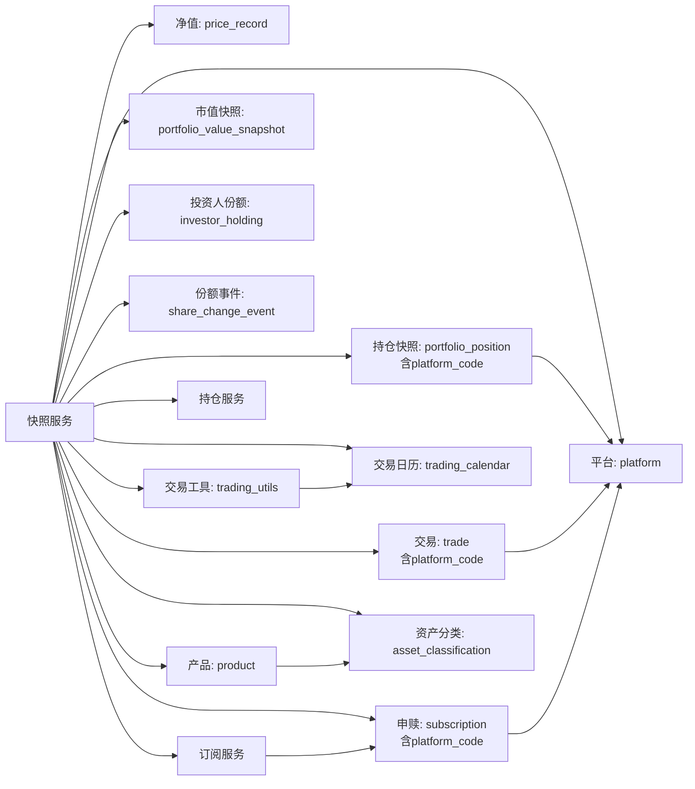

# 净值快照系统

<cite>
**本文引用的文件**
- [backend/app/models/portfolio_value_snapshot.py](file://backend/app/models/portfolio_value_snapshot.py)
- [backend/app/models/portfolio_position.py](file://backend/app/models/portfolio_position.py)
- [backend/app/models/investor_holding.py](file://backend/app/models/investor_holding.py)
- [backend/app/models/trading_calendar.py](file://backend/app/models/trading_calendar.py)
- [backend/app/models/price_record.py](file://backend/app/models/price_record.py)
- [backend/app/models/product.py](file://backend/app/models/product.py)
- [backend/app/models/trade.py](file://backend/app/models/trade.py)
- [backend/app/models/subscription.py](file://backend/app/models/subscription.py)
- [backend/app/models/share_change_event.py](file://backend/app/models/share_change_event.py)
- [backend/app/models/asset_classification.py](file://backend/app/models/asset_classification.py)
- [backend/app/schemas/snapshot.py](file://backend/app/schemas/snapshot.py)
- [backend/app/routers/snapshots.py](file://backend/app/routers/snapshots.py)
- [backend/app/services/snapshot_service.py](file://backend/app/services/snapshot_service.py)
- [backend/app/services/subscription_service.py](file://backend/app/services/subscription_service.py)
- [backend/app/services/trading_utils.py](file://backend/app/services/trading_utils.py)
- [backend/app/services/position_service.py](file://backend/app/services/position_service.py)
- [backend/cli/commands/snapshots.py](file://backend/cli/commands/snapshots.py)
- [ir-cli/ir_cli/commands/snapshots.py](file://ir-cli/ir_cli/commands/snapshots.py)
- [backend/tests/unit/test_snapshot_service.py](file://backend/tests/unit/test_snapshot_service.py)
- [Docs/02-数据库设计.md](file://Docs/02-数据库设计.md)
- [Docs/04-后端开发.md](file://Docs/04-后端开发.md)
- [backend/app/routers/positions.py](file://backend/app/routers/positions.py)
- [backend/app/routers/cash_transfers.py](file://backend/app/routers/cash_transfers.py)
- [backend/cli/commands/cash_transfers.py](file://backend/cli/commands/cash_transfers.py)
</cite>

## 更新摘要
**变更内容**
- **关键性能优化**：大幅优化了CASH头寸处理算法，从每次调用get_cash_value()改为增量计算方法，显著提升快照生成性能
- **增量计算实现**：从前一日快照开始构建CASH头寸，在目标窗口内应用交易和事件，避免冗余的全量现金值计算
- **查询优化**：份额变动事件查询增强了日期窗口约束，防止重复累积问题
- **测试覆盖增强**：为total_shares增量计算逻辑添加了全面的边界情况测试

## 目录
1. [简介](#简介)
2. [项目结构](#项目结构)
3. [核心组件](#核心组件)
4. [架构总览](#架构总览)
5. [详细组件分析](#详细组件分析)
6. [依赖分析](#依赖分析)
7. [性能考虑](#性能考虑)
8. [故障排查指南](#故障排查指南)
9. [结论](#结论)
10. [附录](#附录)

## 简介
本文件系统性阐述净值快照系统的实现与使用，覆盖以下主题：
- **平台维度的快照生成算法**：按"持仓快照 → 组合市值快照 → 投资人份额快照"的顺序，结合交易、申赎、净值与份额变动事件进行计算，支持资产类型自动推断和现金流精确跟踪。
- **优化的T+1确认机制**：采用简化的T+1确认流程，自动确认后不立即重新生成投资人持仓快照，依赖下一个完整快照周期自然包含新确认交易。
- **关键BUG修复**：修复了组合市值快照中total_shares字段的滞后问题，采用增量计算方法确保申购赎回确认日的份额准确计入。
- **重大性能优化**：**新增**：CASH头寸处理采用增量计算方法，从前一日快照构建并应用窗口内交易和事件，替代之前的全量计算方式，显著提升性能。
- **平台级现金管理**：现金按平台维度拆分追踪，支持多平台现金余额管理和平台间现金转移。
- **级联操作与数据一致性**：删除快照时自动级联回滚相关申购/赎回，重算时智能自动确认待处理申请。
- **时间维度与数据精度**：交易日校验、T+1/T+2确认规则、QDII净值取数策略、数值精度控制（Decimal/定点数）。
- **投资组合价值计算**：总市值、总份额、单位净值、冻结份额/金额的计算与来源，包含准确的现金余额管理。
- **资产配置快照与收益统计**：持仓快照中的资产类别、单位净值、市值、成本价等，配合收益统计接口。
- **存储结构、索引与查询优化**：三张快照表的主键/唯一约束、外键与复合索引。
- **定时任务触发、批量重算与增量更新**：基于交易日历与任务调度的触发机制。
- **快照API**：查询接口、时间范围过滤、数据格式与权限控制。
- **准确性验证、异常处理与数据修复**：依赖校验、错误日志、删除与重算。
- **历史回溯、快照合并与一致性**：跨表一致性、幂等性与事务保障。
- **性能监控与容量规划**：并发、WAL模式、索引与查询优化建议。

## 项目结构
后端采用FastAPI + SQLAlchemy架构，快照相关代码集中在以下模块：
- 路由层：/api/v1/snapshots 提供快照生成、重算、校验、状态查询与删除。
- 服务层：snapshot_service.py 实现快照生成、重算、依赖校验、级联操作与冻结份额计算。
- 模型层：portfolio_position、portfolio_value_snapshot、investor_holding等快照表模型。
- Schema层：快照请求、结果与状态响应的数据结构。
- CLI工具：支持命令行方式的快照管理操作。
- HTTP客户端CLI：轻量级远程访问接口。



**图表来源**
- [backend/app/routers/snapshots.py:1-198](file://backend/app/routers/snapshots.py#L1-L198)
- [backend/app/services/snapshot_service.py:1-1301](file://backend/app/services/snapshot_service.py#L1-L1301)
- [backend/app/services/subscription_service.py:1-178](file://backend/app/services/subscription_service.py#L1-L178)
- [backend/app/services/trading_utils.py:1-69](file://backend/app/services/trading_utils.py#L1-L69)
- [backend/app/routers/cash_transfers.py:1-139](file://backend/app/routers/cash_transfers.py#L1-L139)
- [backend/cli/commands/snapshots.py:1-113](file://backend/cli/commands/snapshots.py#L1-L113)
- [ir-cli/ir_cli/commands/snapshots.py:1-75](file://ir-cli/ir_cli/commands/snapshots.py#L1-L75)

章节来源
- [backend/app/main.py:1-53](file://backend/app/main.py#L1-L53)
- [backend/app/routers/snapshots.py:1-198](file://backend/app/routers/snapshots.py#L1-L198)
- [backend/app/services/snapshot_service.py:1-1301](file://backend/app/services/snapshot_service.py#L1-L1301)

## 核心组件
- **平台维度的快照表模型**
  - 持仓快照：记录组合在某日的每只产品的份额、成本价、单位净值、市值、冻结份额/金额等，新增platform_code字段支持按平台维度管理，新增资产类型字段支持资产配置分析。
  - 组合市值快照：记录组合总值、总份额、单位净值、冻结份额等。**已修复total_shares滞后问题**。
  - 投资人份额快照：记录每个投资人当日持有的份额、冻结份额、成本价等。
- **增强的快照服务**
  - 单日生成：前置校验（组合状态、交易日）、依赖校验（无待确认交易、净值数据完整、份额变动事件状态）、删除旧快照、生成三张表。
  - 区间重算：遍历交易日，逐日生成，支持强制模式跳过校验，包含智能自动确认逻辑。
  - **级联操作**：删除快照时自动回滚依赖该快照的已确认申购/赎回。
  - **优化的自动确认机制**：重算后自动确认apply_date<=当前日期的pending申购/赎回，采用T+1确认机制，无需立即重新生成投资人持仓快照。
  - **关键BUG修复**：组合市值快照的total_shares现在采用增量计算方法，从前序快照开始累加窗口内的申购赎回变动，避免了读取滞后一日投资人份额的问题。
  - **重大性能优化**：**新增**：CASH头寸处理采用增量计算方法，从前一日快照构建并应用窗口内交易和事件，替代之前的全量计算方式，显著提升性能。
  - 依赖校验：交易日、待确认交易、净值完整性、份额变动事件状态。
  - 冻结份额/金额：基于待确认交易与申赎计算。
  - 资产类型推断：从产品资产分类自动推导资产类型，支持现金、股票、债券等分类。
  - **平台级现金流跟踪**：精确跟踪买卖交易、申购赎回对各个平台现金余额的影响。
- **路由与Schema**
  - 提供生成、重算、校验、状态查询、删除等接口，返回标准化结果与状态。

章节来源
- [backend/app/models/portfolio_position.py:1-35](file://backend/app/models/portfolio_position.py#L1-L35)
- [backend/app/models/portfolio_value_snapshot.py:1-20](file://backend/app/models/portfolio_value_snapshot.py#L1-L20)
- [backend/app/models/investor_holding.py:1-20](file://backend/app/models/investor_holding.py#L1-L20)
- [backend/app/models/asset_classification.py:1-13](file://backend/app/models/asset_classification.py#L1-L13)
- [backend/app/schemas/snapshot.py:1-69](file://backend/app/schemas/snapshot.py#L1-L69)
- [backend/app/routers/snapshots.py:1-198](file://backend/app/routers/snapshots.py#L1-L198)
- [backend/app/services/snapshot_service.py:1-1301](file://backend/app/services/snapshot_service.py#L1-L1301)

## 架构总览
快照系统遵循"先交易/申赎，后净值，再汇总"的顺序，确保数据来源与计算顺序一致。**平台维度改造后，所有交易和申赎都关联到具体平台，现金按平台维度精确追踪**。交易日历驱动生成节奏，服务层负责事务与一致性，路由层提供REST接口。**最新的T+1确认机制优化简化了数据一致性保证流程，同时修复了total_shares计算的滞后问题，并实现了CASH头寸处理的重大性能优化**。

```mermaid
sequenceDiagram
participant Client as "客户端"
participant Router as "路由 : /api/v1/snapshots"
participant Service as "快照服务"
participant SubService as "订阅服务"
participant PositionService as "持仓服务"
participant DB as "数据库"
participant Models as "快照模型"
Client->>Router : POST "/recalculate"
Router->>Service : recalculate_snapshots(portfolio_code, start_date, end_date, force)
loop 遍历每个交易日
Service->>Service : validate_snapshot_dependencies()
Service->>Service : _delete_existing_snapshots()
Service->>SubService : _cascade_unconfirm_subscriptions()
SubService->>DB : 回滚confirmed到pending
Service->>Service : generate_daily_snapshots()
Service->>PositionService : 增量计算CASH头寸(前一日快照+窗口内交易事件)
Service->>Models : 生成持仓快照(含platform_code)
Service->>Models : 生成组合市值快照(增量计算total_shares)
Service->>Models : 生成投资人份额快照
Service->>SubService : auto_confirm_after_snapshot()
SubService->>DB : 确认apply_date<=current_date的pending (T+1确认)
Note over Service : 自动确认后无需立即重新生成投资人持仓快照
Service-->>Router : 重算结果
Router-->>Client : JSON响应
```

**图表来源**
- [backend/app/routers/snapshots.py:58-87](file://backend/app/routers/snapshots.py#L58-L87)
- [backend/app/services/snapshot_service.py:141-273](file://backend/app/services/snapshot_service.py#L141-L273)
- [backend/app/services/snapshot_service.py:422-458](file://backend/app/services/snapshot_service.py#L422-L458)
- [backend/app/services/snapshot_service.py:701-776](file://backend/app/services/snapshot_service.py#L701-L776)

## 详细组件分析

### 平台维度的快照生成算法
- **生成顺序**：portfolio_position → portfolio_value_snapshot → investor_holding
- **前置校验**：组合存在且激活、目标日为交易日
- **依赖校验**：无待确认交易、净值数据完整、份额变动事件状态
- **删除旧快照**：同日三表全删，避免重复
- **平台维度的生成逻辑**：
  - **持仓快照**：以前一日快照为基，叠加期间已确认交易，支持资产类型自动推断，按产品类型取净值（普通按当日净值，QDII按T-1净值），计算冻结份额，**关键变更：持仓key从(product_code, market)改为(product_code, market, platform_code)**
  - **组合市值快照**：总市值=持仓市值之和+各平台现金余额之和，**关键修复：total_shares采用增量计算方法，从前序快照开始累加窗口内申购赎回变动**，单位净值=总市值/总份额，计算冻结份额
  - **投资人份额快照**：以前一日份额为基，叠加期间已确认申赎，计算成本价（加权平均），冻结份额为pending赎回



**图表来源**
- [backend/app/services/snapshot_service.py:48-138](file://backend/app/services/snapshot_service.py#L48-L138)
- [backend/app/services/snapshot_service.py:701-776](file://backend/app/services/snapshot_service.py#L701-L776)

章节来源
- [backend/app/services/snapshot_service.py:48-138](file://backend/app/services/snapshot_service.py#L48-L138)
- [backend/app/services/snapshot_service.py:461-698](file://backend/app/services/snapshot_service.py#L461-698)
- [backend/app/services/snapshot_service.py:701-776](file://backend/app/services/snapshot_service.py#L701-L776)
- [backend/app/services/snapshot_service.py:779-878](file://backend/app/services/snapshot_service.py#L779-L878)

### 重大性能优化：CASH头寸增量计算方法
**重要优化**：大幅提升了CASH头寸处理的性能，从全量计算改为增量计算，显著减少数据库查询和计算开销。

- **优化前的问题**：
  - 每次快照生成时对每个平台调用get_cash_value()进行全量现金值计算
  - get_cash_value()内部调用compute_cash_balance()，需要扫描所有CASH交易和事件
  - 对于多平台组合，这种全量计算导致严重的性能瓶颈

- **增量计算方案**：
  - **基础方法**：从前一日快照的CASH头寸开始，在目标窗口内应用交易和事件
  - **窗口定义**：从前一日快照次日到目标日的所有已确认交易和事件
  - **计算公式**：CASH_今日 = CASH_前日 + Σ(窗口内CASH买入) - Σ(窗口内CASH卖出) + Σ(窗口内事件cash_change)
  - **首次快照处理**：无前一日快照时使用compute_cash_balance()作为初始值

- **算法实现**：
```python
# 获取前一日快照作为CASH头寸基准
prev_snapshot = db.query(func.max(PortfolioPosition.snapshot_date)).filter(
    PortfolioPosition.portfolio_code == portfolio_code,
    PortfolioPosition.snapshot_date < target_date
).scalar()

if prev_snapshot:
    # 从前一日快照加载CASH头寸
    prev_positions = db.query(PortfolioPosition).filter(
        PortfolioPosition.portfolio_code == portfolio_code,
        PortfolioPosition.snapshot_date == prev_snapshot
    ).all()
    
    for pos in prev_positions:
        if pos.product_code == "CASH":
            key = ("CASH", "", pos.platform_code)
            positions[key] = {
                "amount": Decimal(str(pos.amount or 0)),
                "shares": None,
                "cost_price": None,
                "asset_type": "cash",
            }
else:
    # 首次快照：使用全量计算作为初始值
    cash_amount = get_cash_value(db, portfolio_code, platform_code, target_date)
    positions[("CASH", "", platform_code)] = {
        "amount": cash_amount,
        "shares": None,
        "cost_price": None,
        "asset_type": "cash",
    }

# 应用窗口内的CASH交易
start_apply_date = prev_snapshot + timedelta(days=1) if prev_snapshot else target_date

# 买入交易增加现金
buy_trades = db.query(Trade).filter(
    Trade.portfolio_code == portfolio_code,
    Trade.trade_type == "buy",
    Trade.status == "confirmed",
    Trade.confirm_date >= start_apply_date,
    Trade.confirm_date <= target_date
).all()

for trade in buy_trades:
    if trade.product_code == "CASH":
        cash_key = ("CASH", "", trade.platform_code)
        positions[cash_key]["amount"] += Decimal(str(trade.amount or 0))

# 卖出交易减少现金
sell_trades = db.query(Trade).filter(
    Trade.portfolio_code == portfolio_code,
    Trade.trade_type == "sell",
    Trade.status == "confirmed",
    Trade.confirm_date >= start_apply_date,
    Trade.confirm_date <= target_date
).all()

for trade in sell_trades:
    if trade.product_code == "CASH":
        cash_key = ("CASH", "", trade.platform_code)
        positions[cash_key]["amount"] -= Decimal(str(trade.amount or 0))

# 应用窗口内事件的cash_change
confirmed_events = db.query(ShareChangeEvent).filter(
    ShareChangeEvent.portfolio_code == portfolio_code,
    ShareChangeEvent.status == "confirmed",
    ShareChangeEvent.ex_date >= start_apply_date,
    ShareChangeEvent.ex_date <= target_date,
    ShareChangeEvent.cash_change.isnot(None),
    ShareChangeEvent.cash_change != 0,
).all()

for event in confirmed_events:
    cash_key = ("CASH", "", event.platform_code)
    positions[cash_key]["amount"] += Decimal(str(event.cash_change))
```

- **性能提升效果**：
  - 减少了N次全量现金计算（N为平台数量）
  - 将O(n)复杂度的全量扫描优化为增量更新
  - 特别适用于多平台、高频交易的场景

**章节来源**
- [backend/app/services/snapshot_service.py:461-698](file://backend/app/services/snapshot_service.py#L461-698)
- [backend/app/services/position_service.py:20-97](file://backend/app/services/position_service.py#L20-97)

### 关键BUG修复：total_shares增量计算方法
**重要修复**：解决了组合市值快照中total_shares字段的滞后问题，确保申购赎回确认日的份额能够正确计入。

- **问题描述**：
  - 原实现通过读取前一日投资人份额快照来计算total_shares，导致确认日的申购赎回无法及时反映在组合净值中
  - 这种滞后效应会导致NAV计算不准确，特别是在有大量申购赎回的日期
  
- **解决方案**：
  - 采用增量计算方法：total_shares = 前序快照total_shares + 窗口内申购份额 - 窗口内赎回份额
  - 窗口定义：从前序快照次日到目标日的所有已确认申购赎回
  - 首次快照处理：无前序快照时使用total_value作为初始份额（NAV=1.0）

- **算法实现**：
```python
# 获取前序快照
prev_pvs_date = db.query(func.max(PortfolioValueSnapshot.snapshot_date)).filter(
    PortfolioValueSnapshot.portfolio_code == portfolio_code,
    PortfolioValueSnapshot.snapshot_date < target_date
).scalar()

if prev_pvs_date:
    prev_pvs = db.query(PortfolioValueSnapshot).filter(
        PortfolioValueSnapshot.portfolio_code == portfolio_code,
        PortfolioValueSnapshot.snapshot_date == prev_pvs_date
    ).first()
    total_shares = Decimal(str(prev_pvs.total_shares or 0))
    
    # 计算窗口内申购赎回变动
    confirm_start = prev_pvs_date + timedelta(days=1)
    subscribe_shares = db.query(func.sum(Subscription.shares)).filter(
        Subscription.portfolio_code == portfolio_code,
        Subscription.sub_type == "subscribe",
        Subscription.status == "confirmed",
        Subscription.confirm_date >= confirm_start,
        Subscription.confirm_date <= target_date
    ).scalar()
    
    redeem_shares = db.query(func.sum(Subscription.shares)).filter(
        Subscription.portfolio_code == portfolio_code,
        Subscription.sub_type == "redeem",
        Subscription.status == "confirmed",
        Subscription.confirm_date >= confirm_start,
        Subscription.confirm_date <= target_date
    ).scalar()
    
    total_shares += Decimal(str(subscribe_shares or 0)) - Decimal(str(redeem_shares or 0))
else:
    # 首次快照：使用前序市值作为初始份额
    total_shares = total_value if total_value > 0 else Decimal("1")
```

- **测试覆盖**：
  - 首次快照场景：无前序快照时使用total_value作为初始份额
  - 申购确认日：确认日的申购份额应计入total_shares
  - 赎回确认日：确认日的赎回份额应从total_shares扣减
  - 间隔窗口：多天未生成快照时，窗口内所有申赎都应正确累计
  - 无变动场景：无新申赎时保持前序快照的total_shares

**章节来源**
- [backend/app/services/snapshot_service.py:707-741](file://backend/app/services/snapshot_service.py#L707-L741)
- [backend/tests/unit/test_snapshot_service.py:258-378](file://backend/tests/unit/test_snapshot_service.py#L258-L378)

### 优化的T+1确认机制
**已有功能**：系统采用了简化的T+1确认机制，显著降低了数据处理的复杂性。

- **T+1确认原理**：
  - 申赎统一采用T+1确认，确认日期为申请日的下一个交易日
  - 自动确认后的申赎confirm_date = D+1 > D，不会被D日的investor_holding包含
  - 无需在自动确认后立即重新生成投资人持仓快照
- **简化数据处理流程**：
  - 移除了36行复杂的投资者持仓快照重新生成代码
  - 依赖下一个完整的快照生成周期来自然包含新确认的交易
  - 减少了数据库操作和计算复杂度
- **数据一致性保证**：
  - 通过时间维度的自然推进保证数据一致性
  - 避免了复杂的局部刷新逻辑
  - 提高了系统性能和可维护性

章节来源
- [backend/app/services/snapshot_service.py:242-250](file://backend/app/services/snapshot_service.py#L242-L250)
- [backend/app/services/subscription_service.py:68-69](file://backend/app/services/subscription_service.py#L68-L69)
- [backend/app/services/trading_utils.py:24-41](file://backend/app/services/trading_utils.py#L24-L41)

### 平台级现金管理与转账功能
**已有功能**：系统现在支持按平台维度精确管理现金余额，并支持平台间的现金转移。

- **现金显式流水模型**：
  - CASH 持仓由 `get_cash_value` → `compute_cash_balance` 统一计算，不再在 `_generate_portfolio_position` 中增量累加
  - `compute_cash_balance(T) = SUM(confirmed CASH trades WHERE confirm_date <= T) + SUM(confirmed events WHERE ex_date <= T, cash_change != 0)`
  - 事件 `cash_dividend`/`forced_adjustment` 的 `cash_change` 由 `compute_cash_balance` 直接从 event 表读取，不生成 CASH trade
  - `manual_market_value` 表按日期绝对覆盖 `compute_cash_balance` 的计算结果（`get_cash_value` 优先读取）
- **平台级现金追踪**：
  - 现金key从("CASH", "")改为("CASH", "", platform_code)
  - 申购确认增加对应平台的现金：通过 CASH trade 显式记录（`transfer_group="sub_{id}"`）
  - 赎回确认减少对应平台的现金：通过 CASH trade 显式记录
  - 买入交易减少对应平台的现金：自动生成配对 CASH trade（`transfer_group="rebal_{uuid}"`）
  - 卖出交易增加对应平台的现金：自动生成配对 CASH trade
- **平台间现金转移**：
  - 通过复用Trade表实现，一次转移生成两条CASH交易记录（卖出+买入）
  - 支持当天完成：两条Trade立即confirm，`confirm_date = transfer_date`
  - 支持跨天到账：**两腿均pending**，`confirm_date = next_trading_day`，次日同时confirm（**对称状态**保证D日NAV不因在途转移虚跌）
  - 通过transfer_group字段关联转出和转入交易
- **可用现金计算**：
  - `calculate_available_cash = compute_cash_balance(latest_snapshot_date) + SUM(confirmed CASH trades WHERE confirm_date > latest_snapshot_date) - SUM(pending CASH sells) + SUM(confirmed event cash_change WHERE ex_date > latest_snapshot_date)`
  - 实时预览调 `compute_cash_balance(today)`，快照生成调 `get_cash_value(date)`
  - 支持按平台过滤计算可用现金
  - 现金在途：跨天转移期间，两腿均pending，在途资金不计入任何平台的可用现金

章节来源
- [backend/app/services/snapshot_service.py:27-45](file://backend/app/services/snapshot_service.py#L27-L45)
- [backend/app/services/snapshot_service.py:605-633](file://backend/app/services/snapshot_service.py#L605-L633)
- [backend/app/routers/cash_transfers.py:51-139](file://backend/app/routers/cash_transfers.py#L51-139)
- [backend/app/services/position_service.py:18-143](file://backend/app/services/position_service.py#L18-L143)
- [backend/cli/commands/cash_transfers.py:17-118](file://backend/cli/commands/cash_transfers.py#L17-L118)

### 级联操作与自动确认机制
**已有功能**：系统支持级联操作和智能自动确认，确保数据的一致性和完整性。

- **级联回滚机制**：
  - 删除快照前先查找所有status='confirmed'且confirm_date==快照日期的申购/赎回
  - 将这些记录回退至pending状态，清空确认相关字段
  - **删除关联 CASH trade**：`transfer_group="sub_{id}"` 的 CASH trade 一并删除
  - **事件级联回退**：`ex_date==D` 或 `entitlement_date==D` 的 confirmed 事件回退至 pending
  - **子记录级联删除**：基金级父记录的子记录（`parent_event_id == event.id`）被物理删除，确保 regen 重确认不重复拆分
  - 记录被回滚的记录信息，便于审计和追踪
- **智能自动确认**：
  - 快照生成后自动确认 `apply_date==D` 的 pending 申购、`confirm_date==D` 的 pending Trade、`ex_date==D` 的 pending Event
  - 按 apply_date/confirm_date/ex_date 升序确认，确保顺序正确
  - 单笔失败不影响整批处理，失败记录到结果中
- **重算流程增强**：
  - 每个交易日执行：校验依赖 → 删除旧快照（含级联回退）→ 重新生成 → 自动确认
  - 支持force模式跳过校验，用于数据修复场景
  - **优化**：自动确认后无需立即重新生成投资人持仓快照

章节来源
- [backend/app/services/snapshot_service.py:331-375](file://backend/app/services/snapshot_service.py#L331-L375)
- [backend/app/services/snapshot_service.py:378-419](file://backend/app/services/snapshot_service.py#L378-L419)
- [backend/app/services/snapshot_service.py:422-458](file://backend/app/services/snapshot_service.py#L422-L458)
- [backend/app/services/subscription_service.py:137-178](file://backend/app/services/subscription_service.py#L137-L178)

### 应用日期与确认日期关系验证
**已有功能**：系统强化了应用日期与确认日期的关系验证，防止数据不一致。

- **验证规则**：
  - 检查是否存在apply_date < target_date但status仍为pending的交易或申赎
  - 对于申购/赎回，验证apply_date与确认周期的关系是否符合业务规则
  - 对于QDII基金，特别验证T+2确认规则
- **错误处理**：
  - 验证失败时返回详细的错误信息，包括具体的违规记录
  - 支持警告级别的状态，允许继续处理但提示潜在问题
- **自动修复**：
  - 在重算过程中自动处理符合条件的pending记录
  - 级联操作确保删除快照时的数据一致性

章节来源
- [backend/app/services/snapshot_service.py:1107-1136](file://backend/app/services/snapshot_service.py#L1107-L1136)
- [backend/app/services/snapshot_service.py:1139-1210](file://backend/app/services/snapshot_service.py#L1139-L1210)
- [backend/app/services/snapshot_service.py:1213-1231](file://backend/app/services/snapshot_service.py#L1213-L1231)

### 资产类型推断与继承机制
**已有功能**：系统支持从产品资产分类自动推断资产类型，确保持仓记录的资产分类准确性。

- **资产类型来源**：
  - 优先使用持仓快照中已有的asset_type字段
  - 如果为空，从产品表的asset_class_code关联到资产分类表获取asset_type
  - 对于现金资产（CASH），直接设置为"cash"类型
  - 默认回退到"stock"类型
- **资产分类继承**：
  - 新产品首次建仓时自动继承资产分类
  - 历史持仓在重新计算时也会更新资产类型
  - 支持多种资产类型：cash、stock、bond、fund等

章节来源
- [backend/app/services/snapshot_service.py:493-510](file://backend/app/services/snapshot_service.py#L493-L510)
- [backend/app/services/snapshot_service.py:1234-1242](file://backend/app/services/snapshot_service.py#L1234-L1242)
- [backend/app/models/asset_classification.py:1-13](file://backend/app/models/asset_classification.py#L1-L13)

### 时间维度与数据精度控制
- **交易日**：通过交易日历表判断，非交易日禁止生成
- **确认周期**：场内0日、场外1日、QDII 2日
- **QDII净值**：向前查找最近交易日的净值，最多回溯若干日
- **数值精度**：使用Decimal进行高精度计算，单位净值四舍五入至4位小数，份额/金额保留4位小数
- **冻结字段**：pending卖出冻结份额、pending买入冻结金额、pending赎回冻结份额

章节来源
- [backend/app/models/trading_calendar.py:1-13](file://backend/app/models/trading_calendar.py#L1-L13)
- [backend/app/models/product.py:1-22](file://backend/app/models/product.py#L1-L22)
- [backend/app/services/snapshot_service.py:1306-1317](file://backend/app/services/snapshot_service.py#L1306-L1317)
- [backend/app/services/snapshot_service.py:772-772](file://backend/app/services/snapshot_service.py#L772-L772)

### 投资组合价值计算方法
- **总市值**：场内份额×收盘价之和 + 场外份额×净值之和 + 各平台现金余额之和
- **总份额**：**关键修复**：采用增量计算方法，从前序快照total_shares开始累加窗口内申购赎回变动，而非读取滞后一日的投资人份额
- **单位净值**：总市值/总份额
- **冻结份额**：pending赎回总和

章节来源
- [backend/app/services/snapshot_service.py:701-776](file://backend/app/services/snapshot_service.py#L701-L776)
- [Docs/02-数据库设计.md:500-517](file://Docs/02-数据库设计.md#L500-L517)

### 资产配置快照与收益统计
- **资产配置快照**：持仓快照提供每只产品的市值、成本价、单位净值、资产类型等，可用于资产配置饼图和分析
- **收益统计**：净值曲线、累计/年化/时间加权收益率等，均由组合市值快照与相关接口提供

章节来源
- [backend/app/models/portfolio_position.py:1-35](file://backend/app/models/portfolio_position.py#L1-L35)
- [backend/app/models/portfolio_value_snapshot.py:1-20](file://backend/app/models/portfolio_value_snapshot.py#L1-L20)
- [Docs/04-后端开发.md:152-166](file://Docs/04-后端开发.md#L152-L166)

### 存储结构、索引策略与查询优化
- **快照表结构与约束**
  - 持仓快照：唯一约束(组合, 产品, 市场, **平台**, 日期)，检查约束(净值型/非净值型二选一)，新增asset_type字段
  - 组合市值快照：唯一约束(组合, 日期)
  - 投资人份额快照：唯一约束(组合, 投资人, 日期)
- **索引策略**
  - 快照查询常用：组合+日期降序、产品+日期降序、投资人+日期降序
  - 价格记录：产品+日期降序
  - 交易/申赎：按状态与确认日期索引
- **查询优化**
  - 优先使用复合索引，避免全表扫描
  - 对于历史查询，尽量限定组合与日期范围

章节来源
- [backend/app/models/portfolio_position.py:23-35](file://backend/app/models/portfolio_position.py#L23-35)
- [backend/app/models/portfolio_value_snapshot.py:17-19](file://backend/app/models/portfolio_value_snapshot.py#L17-L19)
- [backend/app/models/investor_holding.py:17-19](file://backend/app/models/investor_holding.py#L17-L19)
- [Docs/02-数据库设计.md:563-595](file://Docs/02-数据库设计.md#L563-595)

### 定时任务触发机制、批量快照生成与增量更新
- **定时任务**：交易日07:00同步净值数据；交易日历/日志清理等
- **手动触发**：管理员可触发单日生成与区间重算
- **增量更新**：基于交易日历推进，仅在交易日生成；支持删除后重算
- **级联操作**：删除快照时自动处理相关的申购/赎回记录

章节来源
- [Docs/02-数据库设计.md:707-729](file://Docs/02-数据库设计.md#L707-L729)
- [backend/app/routers/snapshots.py:28-87](file://backend/app/routers/snapshots.py#L28-L87)

### 快照API查询接口、时间范围过滤与数据格式
- **生成单日快照**：POST /api/v1/snapshots/generate
- **重算区间快照**：POST /api/v1/snapshots/recalculate（支持force参数）
- **依赖校验**：GET /api/v1/snapshots/validation
- **组合快照状态**：GET /api/v1/snapshots/portfolios/{code}/status
- **删除指定日期快照**：DELETE /api/v1/snapshots/{portfolio_code}/{snapshot_date}（支持级联操作）
- **平台间现金转移**：POST /api/v1/portfolios/{portfolio_code}/cash-transfer
- **数据格式**：请求/响应均为Pydantic模型，包含校验结果、生成结果、重算结果与状态响应

章节来源
- [backend/app/routers/snapshots.py:28-198](file://backend/app/routers/snapshots.py#L28-L198)
- [backend/app/schemas/snapshot.py:7-69](file://backend/app/schemas/snapshot.py#L7-L69)
- [backend/app/routers/cash_transfers.py:51-139](file://backend/app/routers/cash_transfers.py#L51-139)

### 准确性验证、异常处理与数据修复机制
- **增强的依赖校验**：交易日、待确认交易（`apply_date < target_date`）、净值完整性、份额变动事件状态（**pending 事件 `ex_date <= target_date` 拦截快照生成**）
- **级联操作验证**：删除快照前验证相关申购/赎回/Trade/Event 记录的可回滚性
- **自动确认验证**：确认前验证 apply_date/confirm_date/ex_date 与当前日期的关系是否符合业务规则
- **持仓表保护**：`create_position`/`update_position`/`delete_position` 返回 `POSITION_TABLE_PROTECTED`，快照只能由系统生成
- **现金市值覆盖**：`update_cash_position` 写入 `manual_market_value` 表（绝对替换），写入后提示重新生成快照
- **异常处理**：参数校验失败返回422，内部错误返回500，事务回滚
- **数据修复**：删除指定日期快照后重算，或使用强制模式跳过校验
- **错误追踪**：详细的错误日志和结果记录，便于问题诊断
- **BUG修复验证**：total_shares增量计算方法的单元测试覆盖各种边界情况
- **性能优化验证**：CASH头寸增量计算方法的性能测试和边界情况验证

章节来源
- [backend/app/services/snapshot_service.py:276-306](file://backend/app/services/snapshot_service.py#L276-L306)
- [backend/app/routers/snapshots.py:46-55](file://backend/app/routers/snapshots.py#L46-L55)
- [backend/app/routers/snapshots.py:172-198](file://backend/app/routers/snapshots.py#L172-L198)
- [backend/tests/unit/test_snapshot_service.py:258-378](file://backend/tests/unit/test_snapshot_service.py#L258-L378)

### 历史数据回溯、快照合并与数据一致性保证
- **历史回溯**：通过区间重算删除并重建历史快照，支持级联操作确保数据一致性
- **快照合并**：按日期顺序生成，利用前一日快照作为基线，合并交易与事件影响
- **一致性**：事务内生成三张表，删除旧快照，确保原子性与可重复性
- **自动修复**：重算过程中自动处理pending记录和级联回滚
- **优化**：采用T+1确认机制，简化数据一致性保证流程，同时确保total_shares计算的准确性

章节来源
- [backend/app/services/snapshot_service.py:141-273](file://backend/app/services/snapshot_service.py#L141-L273)
- [backend/app/services/snapshot_service.py:247-262](file://backend/app/services/snapshot_service.py#L247-L262)

## 依赖分析
快照服务依赖交易、申赎、净值、份额事件与交易日历等数据源，形成如下依赖链。**平台维度改造后，所有交易和申赎都关联到平台，增强了数据的准确性和可追溯性**。**T+1确认机制优化简化了依赖关系，减少了即时数据更新的复杂性，同时修复了total_shares计算的依赖问题，并实现了CASH头寸处理的重大性能优化**。



**图表来源**
- [backend/app/services/snapshot_service.py:15-22](file://backend/app/services/snapshot_service.py#L15-L22)
- [backend/app/services/subscription_service.py:1-178](file://backend/app/services/subscription_service.py#L1-L178)
- [backend/app/services/trading_utils.py:1-69](file://backend/app/services/trading_utils.py#L1-L69)
- [backend/app/models/trade.py:1-33](file://backend/app/models/trade.py#L1-L33)
- [backend/app/models/subscription.py:1-22](file://backend/app/models/subscription.py#L1-L22)
- [backend/app/models/price_record.py:1-28](file://backend/app/models/price_record.py#L1-L28)
- [backend/app/models/product.py:1-22](file://backend/app/models/product.py#L1-L22)
- [backend/app/models/trading_calendar.py:1-13](file://backend/app/models/trading_calendar.py#L1-L13)
- [backend/app/models/portfolio_position.py:1-35](file://backend/app/models/portfolio_position.py#L1-L35)
- [backend/app/models/portfolio_value_snapshot.py:1-20](file://backend/app/models/portfolio_value_snapshot.py#L1-L20)
- [backend/app/models/investor_holding.py:1-20](file://backend/app/models/investor_holding.py#L1-L20)
- [backend/app/models/share_change_event.py:1-37](file://backend/app/models/share_change_event.py#L1-L37)
- [backend/app/models/asset_classification.py:1-13](file://backend/app/models/asset_classification.py#L1-L13)

章节来源
- [backend/app/services/snapshot_service.py:15-22](file://backend/app/services/snapshot_service.py#L15-L22)

## 性能考虑
- **并发控制**：MySQL InnoDB 引擎提供行级锁与 MVCC，配合 QueuePool 连接池提升读写并发
- **索引优化**：为快照查询建立组合+日期、产品+日期、状态+日期等复合索引
- **事务批处理**：批量重算时逐日提交，避免长时间锁
- **数值精度**：使用Decimal避免浮点误差累积
- **查询范围**：限定组合与日期范围，避免全表扫描
- **资产类型缓存**：资产分类查询可通过缓存优化性能
- **级联操作优化**：批量处理级联回滚，减少数据库往返次数
- **平台维度优化**：按平台维度查询时充分利用platform_code索引
- **T+1确认优化**：简化了数据更新流程，减少了不必要的重新计算和数据库操作
- **total_shares计算优化**：增量计算方法避免了读取滞后数据的性能开销
- **重大性能优化**：**新增**：CASH头寸增量计算方法消除了冗余的全量现金计算，显著提升多平台组合的快照生成性能

章节来源
- [Docs/02-数据库设计.md:624-655](file://Docs/02-数据库设计.md#L624-L655)
- [Docs/02-数据库设计.md:563-595](file://Docs/02-数据库设计.md#L563-L595)

## 故障排查指南
- **依赖校验失败**：检查交易日、待确认交易、净值数据与份额事件状态
- **生成失败**：查看服务日志，确认事务回滚原因
- **查询异常**：确认索引是否存在、查询条件是否包含组合与日期
- **数据修复**：删除指定日期快照后重算，或使用强制模式跳过校验
- **资产类型问题**：检查产品资产分类配置是否正确
- **现金余额异常**：验证交易和申赎的金额计算逻辑，检查platform_code是否正确关联
- **级联操作失败**：检查申购/赎回记录的状态和确认日期
- **自动确认失败**：验证应用日期与确认日期的关系是否符合业务规则
- **重算异常**：查看重算结果中的errors字段，定位具体失败的日期和原因
- **平台间转账问题**：检查transfer_group关联、cross_day模式和确认日期
- **T+1确认问题**：确认确认日期计算逻辑，检查交易日历配置
- **total_shares计算异常**：检查前序快照是否存在、窗口内申购赎回确认日期是否正确、增量计算逻辑是否正常
- **CASH头寸计算异常**：检查前一日快照是否存在、窗口内交易和事件是否正确应用、增量计算逻辑是否正常

章节来源
- [backend/app/services/snapshot_service.py:276-306](file://backend/app/services/snapshot_service.py#L276-L306)
- [backend/app/routers/snapshots.py:172-198](file://backend/app/routers/snapshots.py#L172-L198)
- [backend/app/services/snapshot_service.py:701-776](file://backend/app/services/snapshot_service.py#L701-L776)

## 结论
净值快照系统通过严格的交易日驱动、依赖校验与事务保障，实现了高准确性的组合价值与资产配置快照。**最新的重大性能优化显著提升了系统的性能，特别是CASH头寸增量计算方法消除了冗余的全量现金计算，大幅改善了多平台组合的快照生成效率**。关键的BUG修复确保了total_shares增量计算的准确性，避免了数据滞后问题。T+1确认机制优化进一步提升了系统的性能和可维护性，简化了数据一致性保证流程，减少了不必要的数据库操作和计算复杂度。平台维度改造进一步增强了系统的精确性和可追溯性，支持多平台现金管理和平台间现金转移。依托完善的索引与查询优化，系统在读多写少的场景下具备良好性能。通过API与任务调度，支持手动与自动的快照生成与重算，满足历史回溯与数据修复需求。**全面的单元测试覆盖了各种边界情况，确保了系统的稳定性和可靠性**。

## 附录
- **接口清单与权限**
  - 生成单日快照：POST /api/v1/snapshots/generate（admin）
  - 重算区间快照：POST /api/v1/snapshots/recalculate（admin，支持force参数）
  - 依赖校验：GET /api/v1/snapshots/validation（admin）
  - 组合快照状态：GET /api/v1/snapshots/portfolios/{code}/status（登录用户）
  - 删除指定日期快照：DELETE /api/v1/snapshots/{portfolio_code}/{snapshot_date}（admin，支持级联操作）
  - 平台间现金转移：POST /api/v1/portfolios/{portfolio_code}/cash-transfer（admin）

章节来源
- [backend/app/routers/snapshots.py:28-198](file://backend/app/routers/snapshots.py#L28-L198)
- [Docs/04-后端开发.md:181-196](file://Docs/04-后端开发.md#L181-L196)
- [backend/app/routers/cash_transfers.py:51-139](file://backend/app/routers/cash_transfers.py#L51-139)