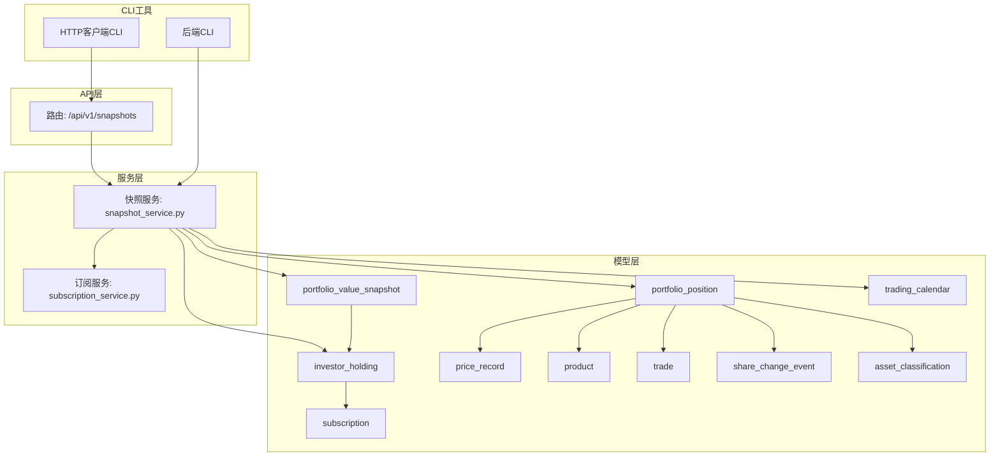
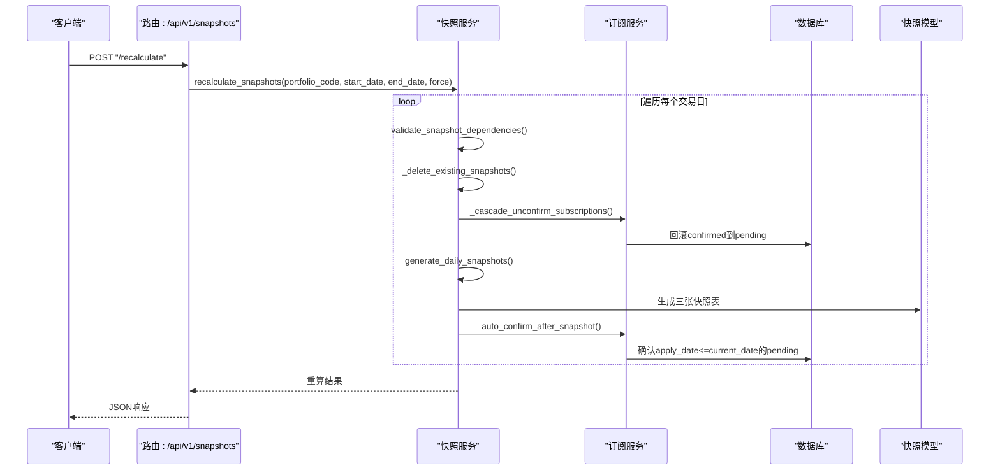
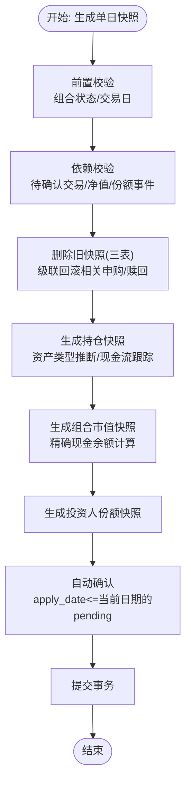
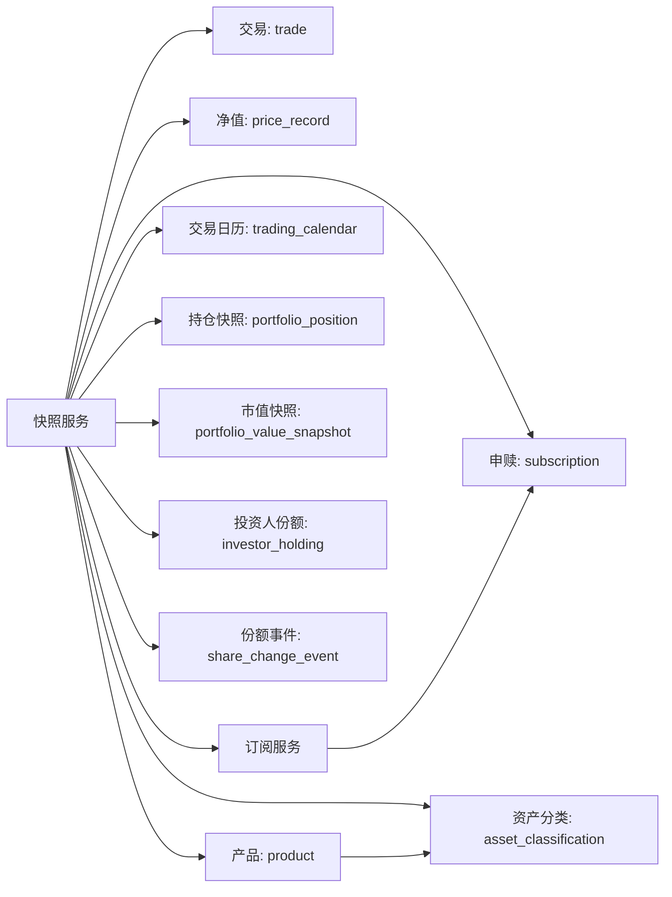

# 净值快照系统

<cite>
**本文引用的文件**
- [backend/app/models/portfolio_value_snapshot.py](file://backend/app/models/portfolio_value_snapshot.py)
- [backend/app/models/portfolio_position.py](file://backend/app/models/portfolio_position.py)
- [backend/app/models/investor_holding.py](file://backend/app/models/investor_holding.py)
- [backend/app/models/trading_calendar.py](file://backend/app/models/trading_calendar.py)
- [backend/app/models/price_record.py](file://backend/app/models/price_record.py)
- [backend/app/models/product.py](file://backend/app/models/product.py)
- [backend/app/models/trade.py](file://backend/app/models/trade.py)
- [backend/app/models/subscription.py](file://backend/app/models/subscription.py)
- [backend/app/models/share_change_event.py](file://backend/app/models/share_change_event.py)
- [backend/app/models/asset_classification.py](file://backend/app/models/asset_classification.py)
- [backend/app/schemas/snapshot.py](file://backend/app/schemas/snapshot.py)
- [backend/app/routers/snapshots.py](file://backend/app/routers/snapshots.py)
- [backend/app/services/snapshot_service.py](file://backend/app/services/snapshot_service.py)
- [backend/app/services/subscription_service.py](file://backend/app/services/subscription_service.py)
- [backend/cli/commands/snapshots.py](file://backend/cli/commands/snapshots.py)
- [ir-cli/ir_cli/commands/snapshots.py](file://ir-cli/ir_cli/commands/snapshots.py)
- [backend/tests/unit/test_snapshot_service.py](file://backend/tests/unit/test_snapshot_service.py)
- [Docs/02-数据库设计.md](file://Docs/02-数据库设计.md)
- [Docs/04-后端开发.md](file://Docs/04-后端开发.md)
</cite>

## 更新摘要
**变更内容**
- 新增级联操作功能：删除快照时自动回滚已确认的申购/赎回记录，确保数据一致性
- 增强重算机制：recalculate_snapshots()函数包含智能自动确认逻辑，支持应用日期与确认日期的关系验证
- 改进验证检查：强化应用日期与确认日期的关系验证，防止数据不一致
- 优化错误处理：在级联操作和自动确认过程中提供更详细的错误信息和日志记录

## 目录
1. [简介](#简介)
2. [项目结构](#项目结构)
3. [核心组件](#核心组件)
4. [架构总览](#架构总览)
5. [详细组件分析](#详细组件分析)
6. [依赖分析](#依赖分析)
7. [性能考虑](#性能考虑)
8. [故障排查指南](#故障排查指南)
9. [结论](#结论)
10. [附录](#附录)

## 简介
本文件系统性阐述净值快照系统的实现与使用，覆盖以下主题：
- **增强的快照生成算法**：按"持仓快照 → 组合市值快照 → 投资人份额快照"的顺序，结合交易、申赎、净值与份额变动事件进行计算，支持资产类型自动推断和现金流精确跟踪。
- **级联操作与数据一致性**：删除快照时自动级联回滚相关申购/赎回，重算时智能自动确认待处理申请。
- **时间维度与数据精度**：交易日校验、T+1/T+2确认规则、QDII净值取数策略、数值精度控制（Decimal/定点数）。
- **投资组合价值计算**：总市值、总份额、单位净值、冻结份额/金额的计算与来源，包含准确的现金余额管理。
- **资产配置快照与收益统计**：持仓快照中的资产类别、单位净值、市值、成本价等，配合收益统计接口。
- **存储结构、索引与查询优化**：三张快照表的主键/唯一约束、外键与复合索引。
- **定时任务触发、批量重算与增量更新**：基于交易日历与任务调度的触发机制。
- **快照API**：查询接口、时间范围过滤、数据格式与权限控制。
- **准确性验证、异常处理与数据修复**：依赖校验、错误日志、删除与重算。
- **历史回溯、快照合并与一致性**：跨表一致性、幂等性与事务保障。
- **性能监控与容量规划**：并发、WAL模式、索引与查询优化建议。

## 项目结构
后端采用FastAPI + SQLAlchemy架构，快照相关代码集中在以下模块：
- 路由层：/api/v1/snapshots 提供快照生成、重算、校验、状态查询与删除。
- 服务层：snapshot_service.py 实现快照生成、重算、依赖校验、级联操作与冻结份额计算。
- 模型层：portfolio_position、portfolio_value_snapshot、investor_holding等快照表模型。
- Schema层：快照请求、结果与状态响应的数据结构。
- CLI工具：支持命令行方式的快照管理操作。
- HTTP客户端CLI：轻量级远程访问接口。

**图表来源**
- [backend/app/routers/snapshots.py:1-198](file://backend/app/routers/snapshots.py#L1-L198)
- [backend/app/services/snapshot_service.py:1-1055](file://backend/app/services/snapshot_service.py#L1-L1055)
- [backend/app/services/subscription_service.py:1-177](file://backend/app/services/subscription_service.py#L1-L177)
- [backend/cli/commands/snapshots.py:1-113](file://backend/cli/commands/snapshots.py#L1-L113)
- [ir-cli/ir_cli/commands/snapshots.py:1-75](file://ir-cli/ir_cli/commands/snapshots.py#L1-L75)

章节来源
- [backend/app/main.py:1-53](file://backend/app/main.py#L1-L53)
- [backend/app/routers/snapshots.py:1-198](file://backend/app/routers/snapshots.py#L1-L198)
- [backend/app/services/snapshot_service.py:1-1055](file://backend/app/services/snapshot_service.py#L1-L1055)

## 核心组件
- **快照表模型**
  - 持仓快照：记录组合在某日的每只产品的份额、成本价、单位净值、市值、冻结份额/金额等，新增资产类型字段支持资产配置分析。
  - 组合市值快照：记录组合总值、总份额、单位净值、冻结份额等。
  - 投资人份额快照：记录每个投资人当日持有的份额、冻结份额、成本价等。
- **增强的快照服务**
  - 单日生成：前置校验（组合状态、交易日）、依赖校验（无待确认交易、净值数据完整、份额变动事件状态）、删除旧快照、生成三张表。
  - 区间重算：遍历交易日，逐日生成，支持强制模式跳过校验，包含智能自动确认逻辑。
  - **级联操作**：删除快照时自动回滚依赖该快照的已确认申购/赎回。
  - **自动确认机制**：重算后自动确认apply_date<=当前日期的pending申购/赎回。
  - 依赖校验：交易日、待确认交易、净值完整性、份额变动事件状态。
  - 冻结份额/金额：基于待确认交易与申赎计算。
  - 资产类型推断：从产品资产分类自动推导资产类型，支持现金、股票、债券等分类。
  - 现金流跟踪：精确跟踪买卖交易、申购赎回对现金余额的影响。
- **路由与Schema**
  - 提供生成、重算、校验、状态查询、删除等接口，返回标准化结果与状态。

章节来源
- [backend/app/models/portfolio_position.py:1-35](file://backend/app/models/portfolio_position.py#L1-L35)
- [backend/app/models/portfolio_value_snapshot.py:1-20](file://backend/app/models/portfolio_value_snapshot.py#L1-L20)
- [backend/app/models/investor_holding.py:1-20](file://backend/app/models/investor_holding.py#L1-L20)
- [backend/app/models/asset_classification.py:1-13](file://backend/app/models/asset_classification.py#L1-L13)
- [backend/app/schemas/snapshot.py:1-69](file://backend/app/schemas/snapshot.py#L1-L69)
- [backend/app/routers/snapshots.py:1-198](file://backend/app/routers/snapshots.py#L1-L198)
- [backend/app/services/snapshot_service.py:1-1055](file://backend/app/services/snapshot_service.py#L1-L1055)

## 架构总览
快照系统遵循"先交易/申赎，后净值，再汇总"的顺序，确保数据来源与计算顺序一致。交易日历驱动生成节奏，服务层负责事务与一致性，路由层提供REST接口。**新增的级联操作和自动确认机制进一步提升了数据的准确性和一致性**。

**图表来源**
- [backend/app/routers/snapshots.py:58-87](file://backend/app/routers/snapshots.py#L58-L87)
- [backend/app/services/snapshot_service.py:101-212](file://backend/app/services/snapshot_service.py#L101-L212)
- [backend/app/services/snapshot_service.py:270-313](file://backend/app/services/snapshot_service.py#L270-L313)
- [backend/app/services/snapshot_service.py:747-825](file://backend/app/services/snapshot_service.py#L747-L825)

## 详细组件分析

### 增强的快照生成算法
- **生成顺序**：portfolio_position → portfolio_value_snapshot → investor_holding
- **前置校验**：组合存在且激活、目标日为交易日
- **依赖校验**：无待确认交易、净值数据完整、份额变动事件状态
- **删除旧快照**：同日三表全删，避免重复
- **增强的生成逻辑**：
  - **持仓快照**：以前一日快照为基，叠加期间已确认交易，支持资产类型自动推断，按产品类型取净值（普通按当日净值，QDII按T-1净值），计算冻结份额
  - **组合市值快照**：总市值=持仓市值之和+现金金额，总份额从前一日投资人份额汇总，单位净值=总市值/总份额，计算冻结份额
  - **投资人份额快照**：以前一日份额为基，叠加期间已确认申赎，计算成本价（加权平均），冻结份额为pending赎回

**图表来源**
- [backend/app/services/snapshot_service.py:26-98](file://backend/app/services/snapshot_service.py#L26-L98)
- [backend/app/services/snapshot_service.py:747-825](file://backend/app/services/snapshot_service.py#L747-L825)

章节来源
- [backend/app/services/snapshot_service.py:26-98](file://backend/app/services/snapshot_service.py#L26-L98)
- [backend/app/services/snapshot_service.py:352-418](file://backend/app/services/snapshot_service.py#L352-L418)
- [backend/app/services/snapshot_service.py:421-473](file://backend/app/services/snapshot_service.py#L421-L473)
- [backend/app/services/snapshot_service.py:476-575](file://backend/app/services/snapshot_service.py#L476-L575)

### 级联操作与自动确认机制
**新增功能**：系统现在支持级联操作和智能自动确认，确保数据的一致性和完整性。

- **级联回滚机制**：
  - 删除快照前先查找所有status='confirmed'且confirm_date==快照日期的申购/赎回
  - 将这些记录回退至pending状态，清空确认相关字段
  - 记录被回滚的记录信息，便于审计和追踪
- **智能自动确认**：
  - 快照生成后自动确认apply_date<=当前日期的pending申购/赎回
  - 按apply_date升序确认，确保is_first判断正确
  - 单笔失败不影响整批处理，失败记录到结果中
- **重算流程增强**：
  - 每个交易日执行：校验依赖 → 删除旧快照（含级联回滚）→ 重新生成 → 自动确认
  - 支持force模式跳过校验，用于数据修复场景

章节来源
- [backend/app/services/snapshot_service.py:270-313](file://backend/app/services/snapshot_service.py#L270-L313)
- [backend/app/services/snapshot_service.py:316-349](file://backend/app/services/snapshot_service.py#L316-L349)
- [backend/app/services/snapshot_service.py:747-825](file://backend/app/services/snapshot_service.py#L747-L825)
- [backend/app/services/subscription_service.py:137-177](file://backend/app/services/subscription_service.py#L137-L177)

### 应用日期与确认日期关系验证
**增强功能**：系统现在强化了应用日期与确认日期的关系验证，防止数据不一致。

- **验证规则**：
  - 检查是否存在apply_date < target_date但status仍为pending的交易或申赎
  - 对于申购/赎回，验证apply_date与确认周期的关系是否符合业务规则
  - 对于QDII基金，特别验证T+2确认规则
- **错误处理**：
  - 验证失败时返回详细的错误信息，包括具体的违规记录
  - 支持警告级别的状态，允许继续处理但提示潜在问题
- **自动修复**：
  - 在重算过程中自动处理符合条件的pending记录
  - 级联操作确保删除快照时的数据一致性

章节来源
- [backend/app/services/snapshot_service.py:845-874](file://backend/app/services/snapshot_service.py#L845-L874)
- [backend/app/services/snapshot_service.py:877-948](file://backend/app/services/snapshot_service.py#L877-L948)
- [backend/app/services/snapshot_service.py:951-969](file://backend/app/services/snapshot_service.py#L951-L969)

### 资产类型推断与继承机制
**已有功能**：系统支持从产品资产分类自动推断资产类型，确保持仓记录的资产分类准确性。

- **资产类型来源**：
  - 优先使用持仓快照中已有的asset_type字段
  - 如果为空，从产品表的asset_class_code关联到资产分类表获取asset_type
  - 对于现金资产（CASH），直接设置为"cash"类型
  - 默认回退到"stock"类型
- **资产分类继承**：
  - 新产品首次建仓时自动继承资产分类
  - 历史持仓在重新计算时也会更新资产类型
  - 支持多种资产类型：cash、stock、bond、fund等

章节来源
- [backend/app/services/snapshot_service.py:382-386](file://backend/app/services/snapshot_service.py#L382-L386)
- [backend/app/services/snapshot_service.py:800-807](file://backend/app/services/snapshot_service.py#L800-L807)
- [backend/app/models/asset_classification.py:1-13](file://backend/app/models/asset_classification.py#L1-L13)

### 现金流跟踪与现金余额管理
**已有功能**：系统能够精确跟踪和管理组合的现金余额变化。

- **现金余额计算逻辑**：
  - 以前一日现金余额为基础
  - 申购确认增加现金：amount += subscription.amount
  - 赎回确认减少现金：amount -= subscription.amount
  - 买入交易减少现金：amount -= trade.amount
  - 卖出交易增加现金：amount += trade.amount
- **现金持仓管理**：
  - 现金资产使用特殊的"CASH"产品代码和空市场标识
  - 现金持仓的shares字段为NULL，amount字段存储实际金额
  - 即使现金余额为0也保留持仓记录，便于追踪
- **冻结金额计算**：当前简化处理，暂不计算冻结金额

章节来源
- [backend/app/services/snapshot_service.py:371-437](file://backend/app/services/snapshot_service.py#L371-L437)
- [backend/app/models/portfolio_position.py:18-20](file://backend/app/models/portfolio_position.py#L18-L20)

### 时间维度与数据精度控制
- **交易日**：通过交易日历表判断，非交易日禁止生成
- **确认周期**：场内0日、场外1日、QDII 2日
- **QDII净值**：向前查找最近交易日的净值，最多回溯若干日
- **数值精度**：使用Decimal进行高精度计算，单位净值四舍五入至4位小数，份额/金额保留4位小数
- **冻结字段**：pending卖出冻结份额、pending买入冻结金额、pending赎回冻结份额

章节来源
- [backend/app/models/trading_calendar.py:1-13](file://backend/app/models/trading_calendar.py#L1-L13)
- [backend/app/models/product.py:1-22](file://backend/app/models/product.py#L1-L22)
- [backend/app/services/snapshot_service.py:778-789](file://backend/app/services/snapshot_service.py#L778-L789)
- [backend/app/services/snapshot_service.py:469-469](file://backend/app/services/snapshot_service.py#L469-L469)

### 投资组合价值计算方法
- **总市值**：场内份额×收盘价之和 + 场外份额×净值之和 + 现金金额
- **总份额**：来自投资人份额快照的汇总（或首次为总值/单位净值）
- **单位净值**：总市值/总份额
- **冻结份额**：pending赎回总和

章节来源
- [backend/app/services/snapshot_service.py:421-473](file://backend/app/services/snapshot_service.py#L421-L473)
- [Docs/02-数据库设计.md:500-517](file://Docs/02-数据库设计.md#L500-L517)

### 资产配置快照与收益统计
- **资产配置快照**：持仓快照提供每只产品的市值、成本价、单位净值、资产类型等，可用于资产配置饼图和分析
- **收益统计**：净值曲线、累计/年化/时间加权收益率等，均由组合市值快照与相关接口提供

章节来源
- [backend/app/models/portfolio_position.py:1-35](file://backend/app/models/portfolio_position.py#L1-L35)
- [backend/app/models/portfolio_value_snapshot.py:1-20](file://backend/app/models/portfolio_value_snapshot.py#L1-L20)
- [Docs/04-后端开发.md:152-166](file://Docs/04-后端开发.md#L152-L166)

### 存储结构、索引策略与查询优化
- **快照表结构与约束**
  - 持仓快照：唯一约束(组合, 产品, 市场, 日期)，检查约束(净值型/非净值型二选一)，新增asset_type字段
  - 组合市值快照：唯一约束(组合, 日期)
  - 投资人份额快照：唯一约束(组合, 投资人, 日期)
- **索引策略**
  - 快照查询常用：组合+日期降序、产品+日期降序、投资人+日期降序
  - 价格记录：产品+日期降序
  - 交易/申赎：按状态与确认日期索引
- **查询优化**
  - 优先使用复合索引，避免全表扫描
  - 对于历史查询，尽量限定组合与日期范围

章节来源
- [backend/app/models/portfolio_position.py:23-35](file://backend/app/models/portfolio_position.py#L23-L35)
- [backend/app/models/portfolio_value_snapshot.py:17-19](file://backend/app/models/portfolio_value_snapshot.py#L17-L19)
- [backend/app/models/investor_holding.py:17-19](file://backend/app/models/investor_holding.py#L17-L19)
- [Docs/02-数据库设计.md:563-595](file://Docs/02-数据库设计.md#L563-L595)

### 定时任务触发机制、批量快照生成与增量更新
- **定时任务**：交易日07:00同步净值数据；交易日历/日志清理等
- **手动触发**：管理员可触发单日生成与区间重算
- **增量更新**：基于交易日历推进，仅在交易日生成；支持删除后重算
- **级联操作**：删除快照时自动处理相关的申购/赎回记录

章节来源
- [Docs/02-数据库设计.md:707-729](file://Docs/02-数据库设计.md#L707-L729)
- [backend/app/routers/snapshots.py:28-87](file://backend/app/routers/snapshots.py#L28-L87)

### 快照API查询接口、时间范围过滤与数据格式
- **生成单日快照**：POST /api/v1/snapshots/generate
- **重算区间快照**：POST /api/v1/snapshots/recalculate（支持force参数）
- **依赖校验**：GET /api/v1/snapshots/validation
- **组合快照状态**：GET /api/v1/snapshots/portfolios/{code}/status
- **删除指定日期快照**：DELETE /api/v1/snapshots/{portfolio_code}/{snapshot_date}（支持级联操作）
- **数据格式**：请求/响应均为Pydantic模型，包含校验结果、生成结果、重算结果与状态响应

章节来源
- [backend/app/routers/snapshots.py:28-198](file://backend/app/routers/snapshots.py#L28-L198)
- [backend/app/schemas/snapshot.py:7-69](file://backend/app/schemas/snapshot.py#L7-L69)

### 准确性验证、异常处理与数据修复机制
- **增强的依赖校验**：交易日、待确认交易、净值完整性、份额变动事件状态
- **级联操作验证**：删除快照前验证相关申购/赎回记录的可回滚性
- **自动确认验证**：确认前验证apply_date与当前日期的关系是否符合业务规则
- **异常处理**：参数校验失败返回422，内部错误返回500，事务回滚
- **数据修复**：删除指定日期快照后重算，或使用强制模式跳过校验
- **错误追踪**：详细的错误日志和结果记录，便于问题诊断

章节来源
- [backend/app/services/snapshot_service.py:215-245](file://backend/app/services/snapshot_service.py#L215-L245)
- [backend/app/routers/snapshots.py:46-55](file://backend/app/routers/snapshots.py#L46-L55)
- [backend/app/routers/snapshots.py:172-198](file://backend/app/routers/snapshots.py#L172-L198)

### 历史数据回溯、快照合并与数据一致性保证
- **历史回溯**：通过区间重算删除并重建历史快照，支持级联操作确保数据一致性
- **快照合并**：按日期顺序生成，利用前一日快照作为基线，合并交易与事件影响
- **一致性**：事务内生成三张表，删除旧快照，确保原子性与可重复性
- **自动修复**：重算过程中自动处理pending记录和级联回滚

章节来源
- [backend/app/services/snapshot_service.py:101-212](file://backend/app/services/snapshot_service.py#L101-L212)
- [backend/app/services/snapshot_service.py:247-262](file://backend/app/services/snapshot_service.py#L247-L262)

## 依赖分析
快照服务依赖交易、申赎、净值、份额事件与交易日历等数据源，形成如下依赖链。**新增的级联操作和自动确认机制进一步强化了数据的一致性保证**。

**图表来源**
- [backend/app/services/snapshot_service.py:15-19](file://backend/app/services/snapshot_service.py#L15-L19)
- [backend/app/services/subscription_service.py:1-177](file://backend/app/services/subscription_service.py#L1-L177)
- [backend/app/models/trade.py:1-32](file://backend/app/models/trade.py#L1-L32)
- [backend/app/models/subscription.py:1-22](file://backend/app/models/subscription.py#L1-L22)
- [backend/app/models/price_record.py:1-28](file://backend/app/models/price_record.py#L1-L28)
- [backend/app/models/product.py:1-22](file://backend/app/models/product.py#L1-L22)
- [backend/app/models/trading_calendar.py:1-13](file://backend/app/models/trading_calendar.py#L1-L13)
- [backend/app/models/portfolio_position.py:1-35](file://backend/app/models/portfolio_position.py#L1-L35)
- [backend/app/models/portfolio_value_snapshot.py:1-20](file://backend/app/models/portfolio_value_snapshot.py#L1-L20)
- [backend/app/models/investor_holding.py:1-20](file://backend/app/models/investor_holding.py#L1-L20)
- [backend/app/models/share_change_event.py:1-37](file://backend/app/models/share_change_event.py#L1-L37)
- [backend/app/models/asset_classification.py:1-13](file://backend/app/models/asset_classification.py#L1-L13)

章节来源
- [backend/app/services/snapshot_service.py:15-19](file://backend/app/services/snapshot_service.py#L15-L19)

## 性能考虑
- **并发与WAL**：SQLite采用WAL模式提升读写并发，合理设置busy_timeout与synchronous
- **索引优化**：为快照查询建立组合+日期、产品+日期、状态+日期等复合索引
- **事务批处理**：批量重算时逐日提交，避免长时间锁
- **数值精度**：使用Decimal避免浮点误差累积
- **查询范围**：限定组合与日期范围，避免全表扫描
- **资产类型缓存**：资产分类查询可通过缓存优化性能
- **级联操作优化**：批量处理级联回滚，减少数据库往返次数

章节来源
- [Docs/02-数据库设计.md:624-655](file://Docs/02-数据库设计.md#L624-655)
- [Docs/02-数据库设计.md:563-595](file://Docs/02-数据库设计.md#L563-L595)

## 故障排查指南
- **依赖校验失败**：检查交易日、待确认交易、净值数据与份额事件状态
- **生成失败**：查看服务日志，确认事务回滚原因
- **查询异常**：确认索引是否存在、查询条件是否包含组合与日期
- **数据修复**：删除指定日期快照后重算，或使用强制模式跳过校验
- **资产类型问题**：检查产品资产分类配置是否正确
- **现金余额异常**：验证交易和申赎的金额计算逻辑
- **级联操作失败**：检查申购/赎回记录的状态和确认日期
- **自动确认失败**：验证应用日期与确认日期的关系是否符合业务规则
- **重算异常**：查看重算结果中的errors字段，定位具体失败的日期和原因

章节来源
- [backend/app/services/snapshot_service.py:215-245](file://backend/app/services/snapshot_service.py#L215-L245)
- [backend/app/routers/snapshots.py:172-198](file://backend/app/routers/snapshots.py#L172-L198)
- [backend/app/services/snapshot_service.py:747-825](file://backend/app/services/snapshot_service.py#L747-L825)

## 结论
净值快照系统通过严格的交易日驱动、依赖校验与事务保障，实现了高准确性的组合价值与资产配置快照。**最新的增强功能包括级联操作、智能自动确认和应用日期与确认日期关系验证，进一步提升了系统的准确性和可靠性**。依托完善的索引与查询优化，系统在读多写少的场景下具备良好性能。通过API与任务调度，支持手动与自动的快照生成与重算，满足历史回溯与数据修复需求。

## 附录
- **接口清单与权限**
  - 生成单日快照：POST /api/v1/snapshots/generate（admin）
  - 重算区间快照：POST /api/v1/snapshots/recalculate（admin，支持force参数）
  - 依赖校验：GET /api/v1/snapshots/validation（admin）
  - 组合快照状态：GET /api/v1/snapshots/portfolios/{code}/status（登录用户）
  - 删除指定日期快照：DELETE /api/v1/snapshots/{portfolio_code}/{snapshot_date}（admin，支持级联操作）

章节来源
- [backend/app/routers/snapshots.py:28-198](file://backend/app/routers/snapshots.py#L28-L198)
- [Docs/04-后端开发.md:181-196](file://Docs/04-后端开发.md#L181-L196)