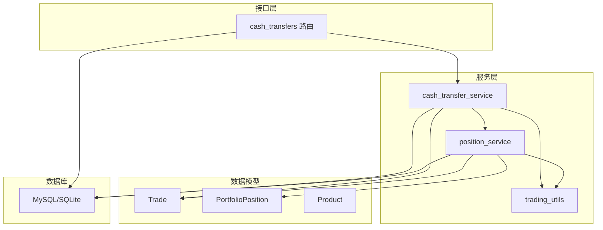
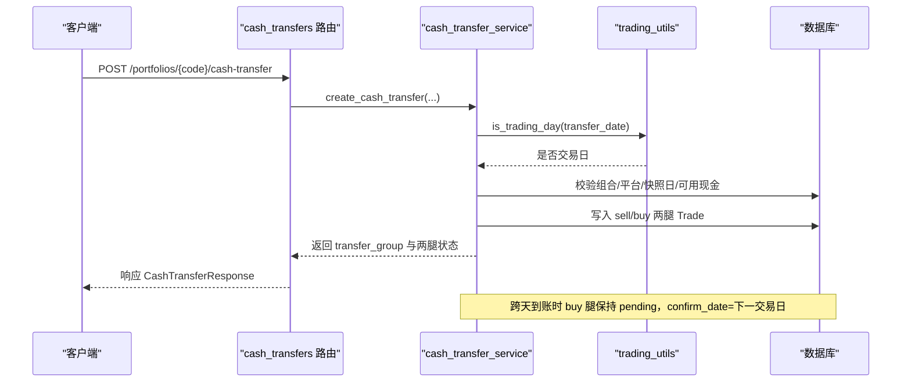
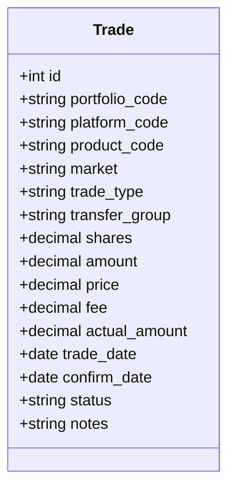
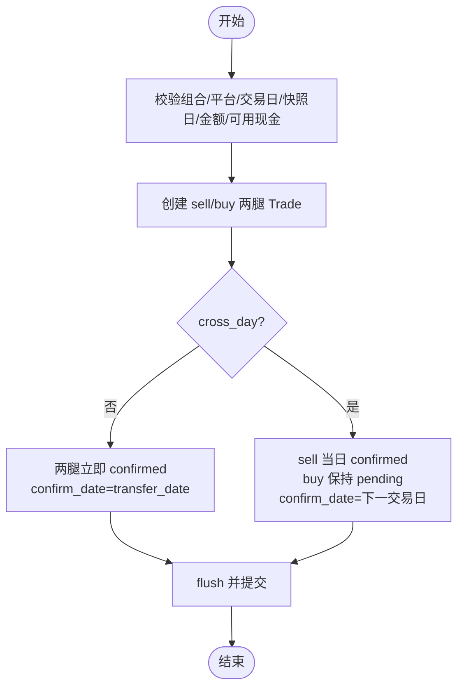
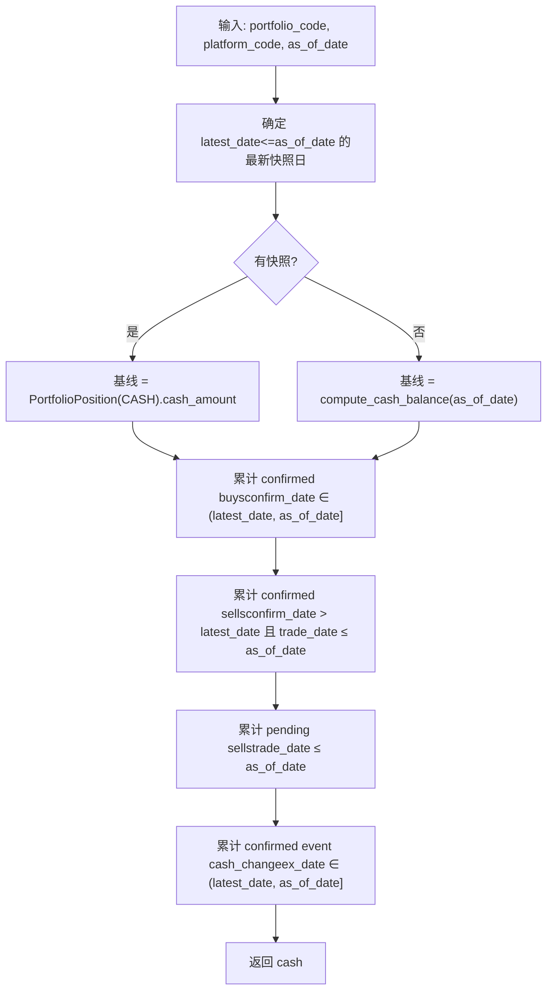
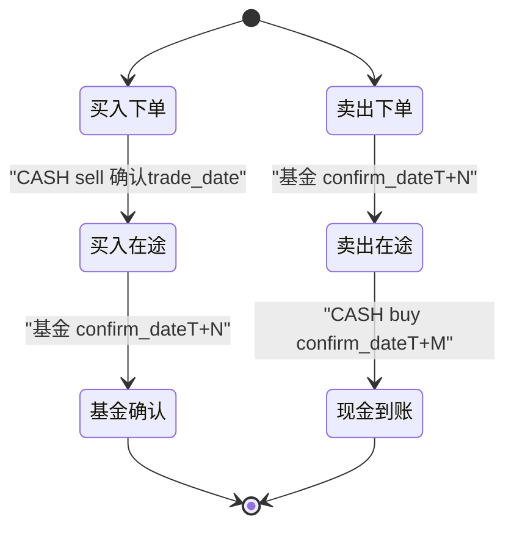
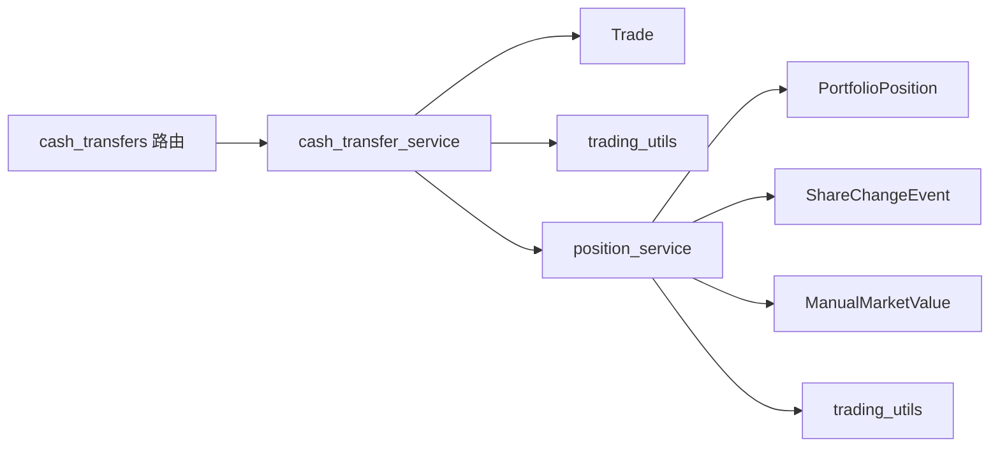

# 在途资金模型

<cite>
**本文引用的文件**
- [trade.py](file://backend/app/models/trade.py)
- [cash_transfer_service.py](file://backend/app/services/cash_transfer_service.py)
- [cash_transfers.py](file://backend/app/routers/cash_transfers.py)
- [cash_transfer.py](file://backend/app/schemas/cash_transfer.py)
- [position_service.py](file://backend/app/services/position_service.py)
- [trading_utils.py](file://backend/app/services/trading_utils.py)
- [portfolio_position.py](file://backend/app/models/portfolio_position.py)
- [product.py](file://backend/app/models/product.py)
- [0006_product_code_extend_and_in_transit.py](file://backend/alembic/versions/0006_product_code_extend_and_in_transit.py)
- [test_in_transit.py](file://backend/tests/integration/test_in_transit.py)
</cite>

## 目录
1. [引言](#引言)
2. [项目结构](#项目结构)
3. [核心组件](#核心组件)
4. [架构总览](#架构总览)
5. [详细组件分析](#详细组件分析)
6. [依赖关系分析](#依赖关系分析)
7. [性能考量](#性能考量)
8. [故障排查指南](#故障排查指南)
9. [结论](#结论)
10. [附录](#附录)

## 引言
本文件系统化阐述 InvestRing 的“在途资金模型”，围绕基金交易与平台间现金转移两类场景，解释如何在快照体系中表达“买入在途”和“卖出在途”，并保证净值连续性。核心要点：
- 通过 Trade 表记录 CASH 腿与资产腿（如基金）的配对关系，使用 transfer_group 进行原子性关联。
- 引入虚拟产品 IN_TRANSIT_BUY / IN_TRANSIT_SELL，在确认时间差期间体现为“在途资金”，确保 total_value 连续。
- 跨天现金转移采用非对称状态：转出方当日确认、转入方延后至下一交易日确认，避免 D 日 NAV 虚跌。
- 可用现金计算以最新快照为基线，叠加已确认流入、已确认流出（按 trade_date 锚定）、以及 pending 卖出的预留扣减，消除“预留隐身”。

## 项目结构
围绕在途资金模型的关键代码分布在以下模块：
- 数据模型：Trade、PortfolioPosition、Product
- 服务层：cash_transfer_service、position_service、trading_utils
- API 路由：cash_transfers
- 数据迁移：0006 扩展 product_code 并新增 in_transit_total
- 集成测试：test_in_transit 覆盖在途生命周期与连续性

图表来源
- [trade.py:1-43](file://backend/app/models/trade.py#L1-L43)
- [portfolio_position.py:1-52](file://backend/app/models/portfolio_position.py#L1-L52)
- [product.py:1-22](file://backend/app/models/product.py#L1-L22)
- [cash_transfer_service.py:1-208](file://backend/app/services/cash_transfer_service.py#L1-L208)
- [position_service.py:1-200](file://backend/app/services/position_service.py#L1-L200)
- [trading_utils.py:1-84](file://backend/app/services/trading_utils.py#L1-L84)
- [cash_transfers.py:1-90](file://backend/app/routers/cash_transfers.py#L1-L90)

章节来源
- [trade.py:1-43](file://backend/app/models/trade.py#L1-L43)
- [portfolio_position.py:1-52](file://backend/app/models/portfolio_position.py#L1-L52)
- [product.py:1-22](file://backend/app/models/product.py#L1-L22)
- [cash_transfer_service.py:1-208](file://backend/app/services/cash_transfer_service.py#L1-L208)
- [position_service.py:1-200](file://backend/app/services/position_service.py#L1-L200)
- [trading_utils.py:1-84](file://backend/app/services/trading_utils.py#L1-L84)
- [cash_transfers.py:1-90](file://backend/app/routers/cash_transfers.py#L1-L90)

## 核心组件
- Trade 模型：承载所有交易流水，包含 product_code、trade_type、transfer_group、status、confirm_date 等关键字段，用于配对资产腿与 CASH 腿，支持申购赎回、调仓、平台间现金转移等场景。
- PortfolioPosition 快照：记录组合在某日的持仓明细，含 cash_amount、shares、market_value 等；受 ORM 事件保护不可直接更新或删除。
- Product 模型：定义产品类型与确认天数，IN_TRANSIT_BUY/IN_TRANSIT_SELL 作为虚拟产品参与快照计算。
- cash_transfer_service：实现平台间现金转移的非对称状态模型，创建 sell/buy 两腿，处理 cross_day 逻辑与 confirm。
- position_service：提供可用现金与份额的计算，基于快照基线 + 增量流水，考虑 pending 卖出预留与 confirmed 流出的 trade_date 锚定。
- trading_utils：交易日判断、T+N 日期计算、最新快照日期查询等工具函数。
- cash_transfers 路由：对外暴露 REST 接口，负责鉴权、序列化与事务提交。

章节来源
- [trade.py:1-43](file://backend/app/models/trade.py#L1-L43)
- [portfolio_position.py:1-52](file://backend/app/models/portfolio_position.py#L1-L52)
- [product.py:1-22](file://backend/app/models/product.py#L1-L22)
- [cash_transfer_service.py:1-208](file://backend/app/services/cash_transfer_service.py#L1-L208)
- [position_service.py:1-200](file://backend/app/services/position_service.py#L1-L200)
- [trading_utils.py:1-84](file://backend/app/services/trading_utils.py#L1-L84)
- [cash_transfers.py:1-90](file://backend/app/routers/cash_transfers.py#L1-L90)

## 架构总览
在途资金模型贯穿“交易流水—快照生成—净值连续性”的全链路：
- 交易侧：create_cash_transfer 生成 sell/buy 两腿，设置 transfer_group 与 confirm_date；跨天时 buy 腿保持 pending 至下一交易日。
- 快照侧：根据 Trade 的 confirm_date 与 trade_date 判定是否计入 CASH 或产生 IN_TRANSIT_* 虚拟持仓，保证 total_value 连续。
- 计算侧：calculate_available_cash 以最新快照为基线，叠加 confirmed buys/sells 与 pending sells 预留，确保可用现金口径一致。

图表来源
- [cash_transfers.py:27-46](file://backend/app/routers/cash_transfers.py#L27-L46)
- [cash_transfer_service.py:29-127](file://backend/app/services/cash_transfer_service.py#L29-L127)
- [trading_utils.py:16-41](file://backend/app/services/trading_utils.py#L16-L41)

## 详细组件分析

### 交易模型与配对机制（Trade）
- transfer_group：同一业务操作产生的多条 trade 共享该组标识，确保 confirm/unconfirm/cancel 时的原子翻转。
- product_code：CASH 表示现金腿；IN_TRANSIT_BUY/IN_TRANSIT_SELL 由快照层虚拟生成，不直接写入 Trade。
- status 与 confirm_date：pending/confirmed 状态配合 confirm_date 控制资金与份额的生效时点。
- 唯一约束：uq_trade_transfer_group(product_code, trade_type) 防止重复确认导致重复 CASH 交易。

图表来源
- [trade.py:5-42](file://backend/app/models/trade.py#L5-L42)

章节来源
- [trade.py:1-43](file://backend/app/models/trade.py#L1-L43)

### 现金转移服务（cash_transfer_service）
- create_cash_transfer：
  - 校验组合激活、平台存在、交易日、快照日边界、金额有效性、可用现金。
  - 生成 sell/buy 两腿，transfer_group 为短 UUID。
  - cross_day=False：两腿立即 confirmed，confirm_date=transfer_date。
  - cross_day=True：sell 当日 confirmed，buy 保持 pending，confirm_date=下一交易日。
- confirm_cash_transfer：
  - 查找 transfer_group 下仍为 pending 的 CASH legs（通常为 buy 腿）。
  - 校验 confirm_date 是否已到，批量置为 confirmed。
- list_cash_transfers：
  - 按 transfer_group 分组，聚合 sell/buy 两腿信息，cross_day 依据 buy 腿状态与 confirm_date 判断。

图表来源
- [cash_transfer_service.py:29-127](file://backend/app/services/cash_transfer_service.py#L29-L127)

章节来源
- [cash_transfer_service.py:1-208](file://backend/app/services/cash_transfer_service.py#L1-L208)

### 可用现金计算（position_service.calculate_available_cash）
- 基线：最新快照日 PortfolioPosition 中 CASH 行的 cash_amount（manual_market_value 覆盖已 baked in 快照）。
- 增量：
  - confirmed CASH buys：confirm_date ∈ (latest_date, as_of_date] 计入流入。
  - confirmed CASH sells：confirm_date > latest_date 且 trade_date ≤ as_of_date 计入流出（按 trade_date 锚定承诺）。
  - pending CASH sells：trade_date ≤ as_of_date 全额预留扣减。
  - confirmed ShareChangeEvent cash_change：ex_date ∈ (latest_date, as_of_date] 计入。
- 时点口径：as_of_date 为 None 时取当前最新快照日为基线，confirmed buy/sell 均计入，pending sell 全额计提。

图表来源
- [position_service.py:114-230](file://backend/app/services/position_service.py#L114-L230)

章节来源
- [position_service.py:1-200](file://backend/app/services/position_service.py#L1-L200)
- [position_service.py:200-399](file://backend/backend/app/services/position_service.py#L200-L399)

### 快照与在途虚拟产品（IN_TRANSIT_BUY / IN_TRANSIT_SELL）
- 买入在途：T 日扣款（CASH sell confirmed at trade_date），基金未确认（confirm_date=T+1），快照生成 IN_TRANSIT_BUY 虚拟持仓，total_value 连续。
- 卖出在途：T+1 基金卖出确认，T+3 现金到账（CASH buy confirm_date=T+3），中间 T+1~T+2 快照显示 IN_TRANSIT_SELL，T+3 后 CASH 增加，在途消失。
- 无 cash_confirm_date 的卖出：CASH 到账日等于基金确认日，不产生在途。
- 跨天现金转移：cross_day=True 产生 IN_TRANSIT_BUY（转入方 pending），confirm 后 buy 腿确认，快照不再显示在途。

图表来源
- [test_in_transit.py:188-288](file://backend/tests/integration/test_in_transit.py#L188-L288)
- [test_in_transit.py:294-401](file://backend/tests/integration/test_in_transit.py#L294-L401)
- [test_in_transit.py:408-464](file://backend/tests/integration/test_in_transit.py#L408-L464)
- [test_in_transit.py:471-604](file://backend/tests/integration/test_in_transit.py#L471-L604)

章节来源
- [test_in_transit.py:1-605](file://backend/tests/integration/test_in_transit.py#L1-L605)

### 数据迁移与虚拟产品种子（0006）
- 扩展 product_code 字段长度（String(10)→String(20)），支持 IN_TRANSIT_BUY/IN_TRANSIT_SELL 命名。
- 新增 portfolio_value_snapshot.in_transit_total 列，记录在途资金总额。
- 插入两条种子产品记录（IN_TRANSIT_BUY/IN_TRANSIT_SELL），product_type='IN_TRANSIT'，confirm_days=0，is_qdii=0。

章节来源
- [0006_product_code_extend_and_in_transit.py:1-119](file://backend/alembic/versions/0006_product_code_extend_and_in_transit.py#L1-L119)

## 依赖关系分析
- cash_transfers 路由依赖 cash_transfer_service 与 schemas，负责鉴权与事务。
- cash_transfer_service 依赖 Trade、Platform、Portfolio、trading_utils、position_service。
- position_service 依赖 PortfolioPosition、ShareChangeEvent、ManualMarketValue、TradingCalendar、PortfolioValueSnapshot。
- 快照与净值连续性依赖 TradingCalendar 与 PortfolioValueSnapshot。

图表来源
- [cash_transfers.py:1-90](file://backend/app/routers/cash_transfers.py#L1-L90)
- [cash_transfer_service.py:1-208](file://backend/app/services/cash_transfer_service.py#L1-L208)
- [position_service.py:1-200](file://backend/app/services/position_service.py#L1-L200)
- [trading_utils.py:1-84](file://backend/app/services/trading_utils.py#L1-L84)

章节来源
- [cash_transfers.py:1-90](file://backend/app/routers/cash_transfers.py#L1-L90)
- [cash_transfer_service.py:1-208](file://backend/app/services/cash_transfer_service.py#L1-L208)
- [position_service.py:1-200](file://backend/app/services/position_service.py#L1-L200)
- [trading_utils.py:1-84](file://backend/app/services/trading_utils.py#L1-L84)

## 性能考量
- 快照基线优先：calculate_available_cash 直接读取最新快照的 CASH 行，避免全量流水扫描，提升性能。
- 增量范围限定：confirmed buys/sells 与 events 仅统计 latest_date 之后的区间，减少查询量。
- pending 卖出预留：按 trade_date 过滤 pending sells，避免不必要的历史扫描。
- 交易日与日期计算：trading_utils 使用高效的最小/最大日期查询，避免循环遍历。

[本节为通用指导，不直接分析具体文件]

## 故障排查指南
- 非交易日错误：BusinessError("NON_TRADING_DAY") 提示需等待交易日再提交。
- 组合未激活：BusinessError("PORTFOLIO_NOT_ACTIVE") 检查组合状态。
- 平台不存在：NotFoundError("PLATFORM_NOT_FOUND") 核对平台 code。
- 金额无效：BusinessError("INVALID_AMOUNT") 确保金额大于 0。
- 可用现金不足：BusinessError("INSUFFICIENT_CASH") 检查平台可用现金。
- 日期早于快照：BusinessError("DATE_BEFORE_SNAPSHOT") 转移日必须晚于最新快照日。
- 转移未就绪：BusinessError("TRANSFER_NOT_READY") 跨天转移未到确认日期。
- 转移未找到：NotFoundError("TRANSFER_NOT_FOUND") 未找到待确认的转移记录。

章节来源
- [cash_transfer_service.py:45-77](file://backend/app/services/cash_transfer_service.py#L45-L77)
- [cash_transfer_service.py:130-164](file://backend/app/services/cash_transfer_service.py#L130-L164)

## 结论
在途资金模型通过 Trade 配对、虚拟产品与快照增量计算，实现了基金交易与平台间现金转移的准确建模与净值连续性保障。关键设计包括：
- transfer_group 原子化配对，避免重复确认与数据不一致。
- 非对称状态模型处理跨天到账，防止 D 日 NAV 虚跌。
- 可用现金计算兼顾 pending 卖出预留与 confirmed 流出的 trade_date 锚定，消除“预留隐身”。
- 迁移与种子数据确保虚拟产品与 in_transit_total 字段的可用性。

[本节为总结，不直接分析具体文件]

## 附录
- API 端点参考：
  - POST /portfolios/{portfolio_code}/cash-transfer：创建平台间现金转移。
  - POST /portfolios/{portfolio_code}/cash-transfer/{transfer_group}/confirm：确认跨天转移中的 pending legs。
  - GET /portfolios/{portfolio_code}/cash-transfers：查询现金转移记录（分页）。

章节来源
- [cash_transfers.py:27-90](file://backend/app/routers/cash_transfers.py#L27-L90)
- [cash_transfer.py:1-43](file://backend/app/schemas/cash_transfer.py#L1-L43)