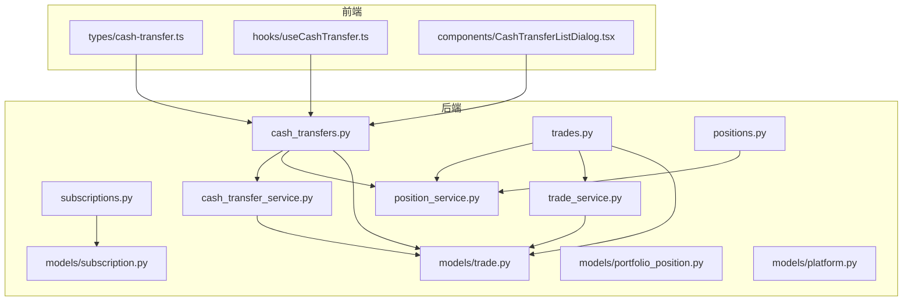
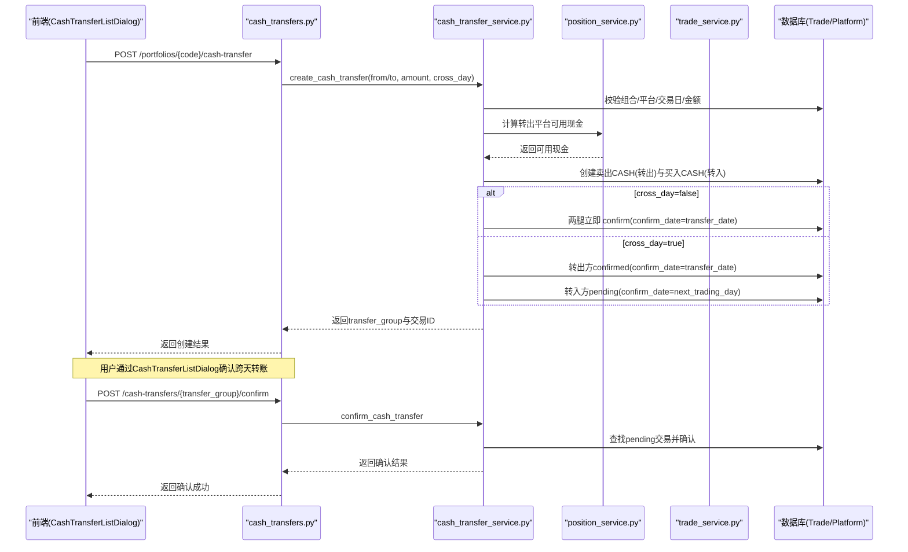
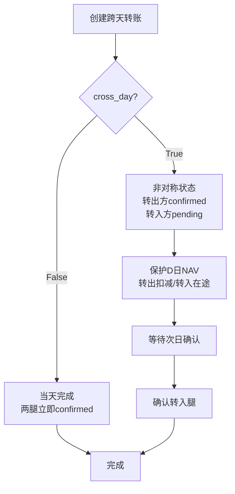
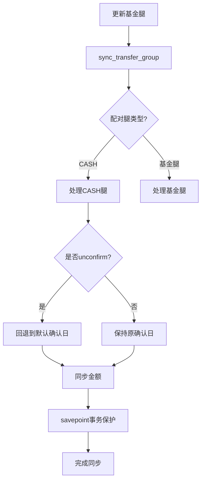
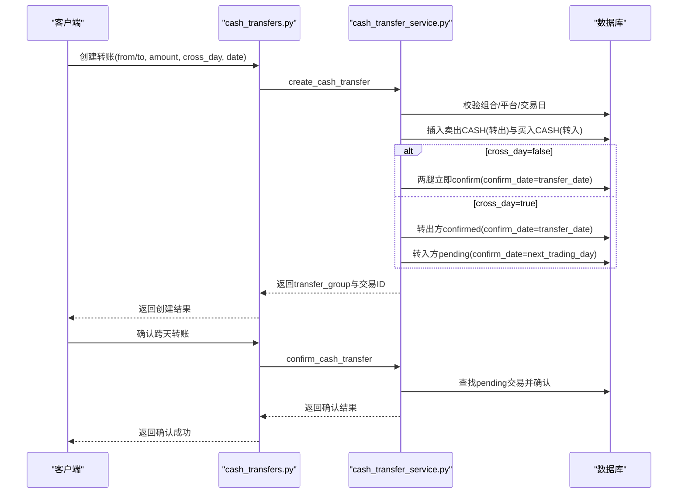
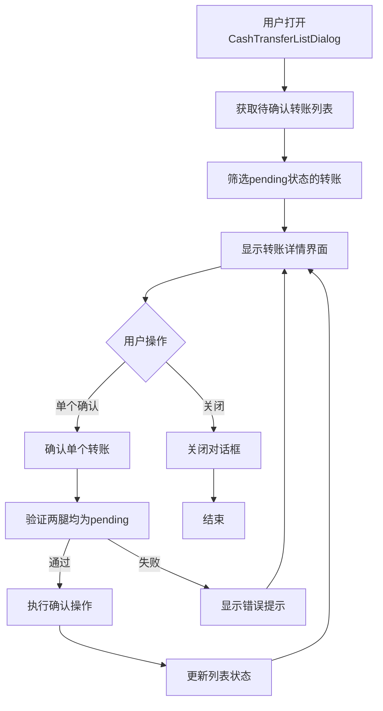
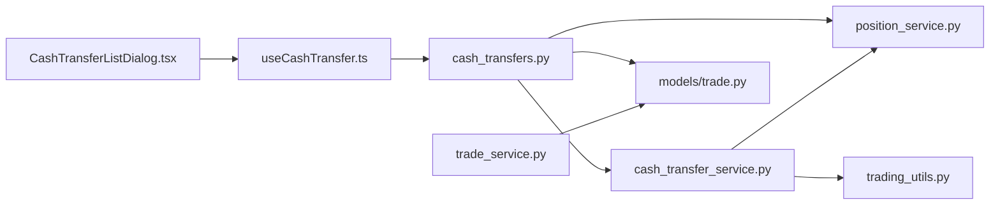

# 平台间现金转移系统

<cite>
**本文引用的文件**   
- [backend/app/services/cash_transfer_service.py](file://backend/app/services/cash_transfer_service.py)
- [backend/app/routers/cash_transfers.py](file://backend/app/routers/cash_transfers.py)
- [backend/app/schemas/cash_transfer.py](file://backend/app/schemas/cash_transfer.py)
- [backend/app/services/trade_service.py](file://backend/app/services/trade_service.py)
- [backend/app/models/trade.py](file://backend/app/models/trade.py)
- [frontend/src/components/shared/dialogs/CashTransferListDialog.tsx](file://frontend/src/components/shared/dialogs/CashTransferListDialog.tsx)
- [frontend/src/types/cash-transfer.ts](file://frontend/src/types/cash-transfer.ts)
- [frontend/src/hooks/useCashTransfer.ts](file://frontend/src/hooks/useCashTransfer.ts)
- [AGENTS.md](file://AGENTS.md)
</cite>

## 更新摘要
**已进行的更改**
- **新增转移组原子操作与不对称模型**：实现 #93 非对称状态模型，支持跨天现金转移时转出方当日确认、转入方延后确认
- **增强配对CASH腿同步逻辑**：移除confirm_date传播机制，增加每腿独立cash_confirm_date支持
- **完善跨平台现金移动说明**：详细说明D日NAV保护机制和在途资金处理逻辑
- **优化结算期处理**：改进跨天到账的确认流程和状态管理
- **增强前端确认界面**：完善CashTransferListDialog组件的用户交互和错误处理

## 目录
1. [简介](#简介)
2. [项目结构](#项目结构)
3. [核心组件](#核心组件)
4. [架构总览](#架构总览)
5. [详细组件分析](#详细组件分析)
6. [依赖关系分析](#依赖关系分析)
7. [性能考量](#性能考量)
8. [故障排查指南](#故障排查指南)
9. [结论](#结论)
10. [附录](#附录)

## 简介
本系统围绕"平台间现金转移"与"现金按平台拆分追踪"展开，目标包括：
- 申购/赎回记录关联交易平台，使现金变动可对应到具体平台账户
- 调仓交易前端支持选择平台，后端按平台维度校验可用现金
- 快照生成时现金按 platform_code 维度拆分，持仓唯一约束包含 platform_code
- 新增平台间现金转移功能：复用 Trade 表，通过 transfer_group 配对两条 CASH 交易（卖出+买入），支持当天完成和跨天到账（T+1）
- **转移组原子操作与不对称模型**：#93 引入非对称状态模型，跨天转移时转出方当日 confirmed、转入方 pending 至下一交易日，保证 D 日 NAV 不因在途转移虚跌
- **每腿独立确认日期**：buy腿使用T日扣款，sell腿使用confirm_date或显式到达日，提供更灵活的现金转移确认机制
- **增强的配对CASH腿同步**：移除confirm_date传播机制，支持unconfirm回滚和金额同步
- **完善的用户界面**：通过 CashTransferListDialog 组件提供跨天转账确认的友好界面

## 项目结构
后端采用 FastAPI + SQLAlchemy ORM，服务层封装业务逻辑，路由层暴露 REST API；前端使用 Next.js + React Query 管理状态与交互。关键模块如下：
- 数据模型：platform、trade、subscription、portfolio_position
- 服务层：cash_transfer_service（现金转移服务）、position_service（可用现金计算）、trade_service（交易确认服务）
- 路由层：cash_transfers（现金转移）、trades（调仓）、subscriptions（申赎）、positions（持仓/可用现金）
- 前端类型与 Hook：cash-transfer.ts、useCashTransfer.ts
- **新增前端组件**：CashTransferListDialog（现金转账列表对话框）

**图表来源**
- [backend/app/routers/cash_transfers.py:27-90](file://backend/app/routers/cash_transfers.py#L27-L90)
- [backend/app/services/cash_transfer_service.py:30-132](file://backend/app/services/cash_transfer_service.py#L30-L132)
- [backend/app/services/trade_service.py:114-184](file://backend/app/services/trade_service.py#L114-L184)
- [backend/app/models/trade.py:5-43](file://backend/app/models/trade.py#L5-L43)
- [frontend/src/components/shared/dialogs/CashTransferListDialog.tsx:34-120](file://frontend/src/components/shared/dialogs/CashTransferListDialog.tsx#L34-L120)

## 核心组件
- 平台模型 Platform：定义平台编码、名称、类型等基础信息
- 交易模型 Trade：支持 platform_code 与 transfer_group 字段，用于普通调仓与平台间现金转移
- 申赎模型 Subscription：新增 platform_code 必填，确保现金变动归属平台
- 持仓模型 PortfolioPosition：唯一约束包含 platform_code，支持按平台拆分现金与非净值型资产
- 现金转移服务 CashTransferService：**实现 #93 非对称状态模型**，支持跨天转移时转出方当日确认、转入方延后确认
- 可用现金服务 PositionService：支持按 platform_code 过滤的实时可用现金计算
- 交易确认服务 TradeService：**增强的配对CASH腿同步逻辑**，支持每腿独立确认日期和unconfirm回滚
- 现金转移路由 CashTransfersRouter：创建配对 CASH 交易、确认跨天到账、查询转移列表
- **现金转账列表对话框 CashTransferListDialog**：提供用户界面，展示待确认的跨天转账，支持批量确认操作
- 前端类型与 Hook：提供转账表单类型与 React Query 封装

**章节来源**
- [backend/app/models/trade.py:5-43](file://backend/app/models/trade.py#L5-L43)
- [backend/app/services/cash_transfer_service.py:30-132](file://backend/app/services/cash_transfer_service.py#L30-L132)
- [backend/app/services/trade_service.py:114-184](file://backend/app/services/trade_service.py#L114-L184)
- [backend/app/routers/cash_transfers.py:27-90](file://backend/app/routers/cash_transfers.py#L27-L90)
- [frontend/src/components/shared/dialogs/CashTransferListDialog.tsx:34-120](file://frontend/src/components/shared/dialogs/CashTransferListDialog.tsx#L34-L120)

## 架构总览
系统以"平台"为资金维度，所有现金相关事件（申购、赎回、买卖、现金转移）均携带 platform_code，并在快照中按平台拆分。现金转移通过两条 CASH 交易配对实现，transfer_group 标识一次完整转移。**#93 引入非对称状态模型，跨天转移时转出方当日 confirmed、转入方 pending 至下一交易日，保证 D 日 NAV 不因在途转移虚跌**。新增的 CashTransferListDialog 组件提供了用户友好的确认界面。**增强的配对CASH腿同步逻辑移除了confirm_date传播机制，增加了未确认回滚功能和每腿独立的cash_confirm_date支持**，其中buy腿使用T日扣款，sell腿使用confirm_date或显式到达日。

**图表来源**
- [backend/app/routers/cash_transfers.py:27-67](file://backend/app/routers/cash_transfers.py#L27-L67)
- [backend/app/services/cash_transfer_service.py:30-132](file://backend/app/services/cash_transfer_service.py#L30-L132)
- [backend/app/services/cash_transfer_service.py:135-169](file://backend/app/services/cash_transfer_service.py#L135-L169)
- [frontend/src/components/shared/dialogs/CashTransferListDialog.tsx:34-120](file://frontend/src/components/shared/dialogs/CashTransferListDialog.tsx#L34-L120)

## 详细组件分析

### 转移组原子操作与不对称模型（#93）
**新增** 实现了 #93 非对称状态模型，支持跨天现金转移时的差异化确认策略

- **非对称状态模型**：cross_day=True 时，转出方（sell）当日 confirmed，转入方（buy）pending 至下一交易日
- **D日NAV保护**：非对称状态保证 D 日 NAV 不因在途转移虚跌（转出方当日扣减，转入方在途不虚增）
- **跨天判断逻辑**：`cross_day = buy.status != "confirmed" or (buy.confirm_date > buy.trade_date)`
- **确认流程**：`confirm_cash_transfer` 确认该组内所有仍为 pending 的 CASH legs（新模型下通常仅转入腿）
- **在途资金处理**：跨天期间转入腿 pending 不计入目标平台可用现金；已确认的转出腿正常扣减源平台现金

**图表来源**
- [backend/app/services/cash_transfer_service.py:105-118](file://backend/app/services/cash_transfer_service.py#L105-L118)
- [backend/app/services/cash_transfer_service.py:203-204](file://backend/app/services/cash_transfer_service.py#L203-L204)

**章节来源**
- [backend/app/services/cash_transfer_service.py:30-132](file://backend/app/services/cash_transfer_service.py#L30-L132)
- [backend/app/services/cash_transfer_service.py:135-169](file://backend/app/services/cash_transfer_service.py#L135-L169)
- [backend/app/services/cash_transfer_service.py:172-213](file://backend/app/services/cash_transfer_service.py#L172-L213)

### 增强的配对CASH腿同步逻辑
**更新** 重构了配对CASH腿的同步机制，支持每腿独立的确认日期

- **移除confirm_date传播**：`sync_transfer_group` 不再传播 `confirm_date`，各腿保持创建时设定的独立确认日
- **每腿独立cash_confirm_date**：`attach_paired_cash_leg` 新增 `cash_confirm_date` 参数，缺省时按基金腿方向推导
- **买入扣款T日**：CASH sell 腿（买入扣款）默认 confirm_date = trade_date（T日即扣）
- **卖出到账日**：CASH buy 腿（卖出到账）默认 confirm_date = 基金确认日（无延迟）
- **unconfirm回滚逻辑**：支持对未确认的转账进行回滚操作，CASH 腿按方向回退默认确认日
- **savepoint事务保护**：使用连接级 SAVEPOINT 避免配对腿更新失败影响外层事务

**图表来源**
- [backend/app/services/trade_service.py:114-184](file://backend/app/services/trade_service.py#L114-L184)
- [backend/app/services/trade_service.py:61-112](file://backend/app/services/trade_service.py#L61-L112)

**章节来源**
- [backend/app/services/trade_service.py:114-184](file://backend/app/services/trade_service.py#L114-L184)
- [backend/app/services/trade_service.py:61-112](file://backend/app/services/trade_service.py#L61-L112)

### 现金转移服务（非对称状态模型）
**更新** 完全重构了现金转移服务，实现 #93 非对称状态模型

- **创建转账**：校验组合、平台、交易日、金额与转出平台可用现金；生成两条 CASH 交易（卖出+买入），通过 transfer_group 关联
- **非对称确认策略**：
  - cross_day=False：两条 Trade 立即 confirm，`confirm_date = transfer_date`
  - cross_day=True：转出方 confirmed（`confirm_date = transfer_date`），转入方 pending（`confirm_date = next_trading_day`）
- **跨天判断**：以 buy 腿为准——`buy.status != "confirmed"` 或 `buy.confirm_date > buy.trade_date`
- **确认接口**：根据 transfer_group 查找 pending 交易，校验是否到达确认日期后更新状态
- **列表接口**：按 transfer_group 分组返回转账记录，展示双方交易状态与确认日期
- **未确认回滚功能**：支持对未确认的转账进行回滚操作，确保交易数据的完整性

**图表来源**
- [backend/app/routers/cash_transfers.py:27-67](file://backend/app/routers/cash_transfers.py#L27-L67)
- [backend/app/services/cash_transfer_service.py:30-132](file://backend/app/services/cash_transfer_service.py#L30-L132)
- [backend/app/services/cash_transfer_service.py:135-169](file://backend/app/services/cash_transfer_service.py#L135-L169)

**章节来源**
- [backend/app/services/cash_transfer_service.py:30-132](file://backend/app/services/cash_transfer_service.py#L30-L132)
- [backend/app/services/cash_transfer_service.py:135-169](file://backend/app/services/cash_transfer_service.py#L135-L169)
- [backend/app/services/cash_transfer_service.py:172-213](file://backend/app/services/cash_transfer_service.py#L172-L213)
- [backend/app/routers/cash_transfers.py:27-90](file://backend/app/routers/cash_transfers.py#L27-L90)

### 现金转账确认对话框（完善功能）
**更新** 完善了 CashTransferListDialog 组件，提供更好的用户体验

- **待确认转账列表**：查询所有 transfer_group 中包含 pending 状态的跨天转账
- **双腿状态验证**：确保两腿均为 pending 状态才能进行确认操作
- **批量确认功能**：支持一次性确认多个待处理的转账
- **用户友好界面**：显示转账详情、金额、平台信息和预计确认日期
- **错误处理**：处理确认失败的情况，提供清晰的错误提示
- **实时更新**：确认后自动刷新列表，移除已确认的转账
- **状态指示器**：使用颜色区分不同状态（在途、已完成、已取消）

**图表来源**
- [frontend/src/components/shared/dialogs/CashTransferListDialog.tsx:34-120](file://frontend/src/components/shared/dialogs/CashTransferListDialog.tsx#L34-L120)

**章节来源**
- [frontend/src/components/shared/dialogs/CashTransferListDialog.tsx:34-120](file://frontend/src/components/shared/dialogs/CashTransferListDialog.tsx#L34-L120)
- [frontend/src/hooks/useCashTransfer.ts:46-71](file://frontend/src/hooks/useCashTransfer.ts#L46-L71)

### 前端类型与Hook
- types/cash-transfer.ts：定义转账请求/响应/列表项类型，包含 from_platform、to_platform、amount、cross_day、transfer_date 等字段
- hooks/useCashTransfer.ts：封装列表查询、创建转账、确认跨天转账的 React Query 操作，成功后刷新缓存并提示用户
- **完善的状态管理**：支持跨天转账的确认状态管理和错误处理

**章节来源**
- [frontend/src/types/cash-transfer.ts:1-36](file://frontend/src/types/cash-transfer.ts#L1-L36)
- [frontend/src/hooks/useCashTransfer.ts:1-71](file://frontend/src/hooks/useCashTransfer.ts#L1-L71)

## 依赖关系分析
- 路由层依赖服务层与模型层：cash_transfers 依赖 cash_transfer_service、position_service 与 trade/subscription/platform 模型
- 现金转移服务依赖 position_service 进行可用现金计算，依赖 trading_utils 进行交易日判断
- 交易确认服务独立化：将交易确认逻辑从路由层提取到 trade_service，供 HTTP API 手动确认与快照重算 auto_confirm 多处复用
- **前端组件依赖**：CashTransferListDialog 依赖 useCashTransfer hook 和 cash-transfer 类型定义

**图表来源**
- [backend/app/routers/cash_transfers.py:27-90](file://backend/app/routers/cash_transfers.py#L27-L90)
- [backend/app/services/cash_transfer_service.py:30-132](file://backend/app/services/cash_transfer_service.py#L30-L132)
- [backend/app/services/trade_service.py:114-184](file://backend/app/services/trade_service.py#L114-L184)
- [frontend/src/components/shared/dialogs/CashTransferListDialog.tsx:34-120](file://frontend/src/components/shared/dialogs/CashTransferListDialog.tsx#L34-L120)
- [frontend/src/hooks/useCashTransfer.ts:1-71](file://frontend/src/hooks/useCashTransfer.ts#L1-L71)

**章节来源**
- [backend/app/routers/cash_transfers.py:27-90](file://backend/app/routers/cash_transfers.py#L27-L90)
- [backend/app/services/cash_transfer_service.py:30-132](file://backend/app/services/cash_transfer_service.py#L30-L132)
- [backend/app/services/trade_service.py:114-184](file://backend/app/services/trade_service.py#L114-L184)
- [frontend/src/components/shared/dialogs/CashTransferListDialog.tsx:34-120](file://frontend/src/components/shared/dialogs/CashTransferListDialog.tsx#L34-L120)
- [frontend/src/hooks/useCashTransfer.ts:1-71](file://frontend/src/hooks/useCashTransfer.ts#L1-L71)

## 性能考量
- 现金转移配对交易通过 transfer_group 分组查询，避免全表扫描，可在 transfer_group 上建立索引以提升列表查询性能
- 跨天到账确认接口需查询下一个交易日，建议在 trading_calendar 上维护高效索引
- **配对CASH腿同步优化**：使用 savepoint 事务保护，避免配对腿更新失败影响外层事务
- **前端性能优化**：CashTransferListDialog 使用 React Query 缓存机制，减少重复请求，提升用户体验
- **未确认回滚优化**：新增的回滚功能通过高效的数据库查询和事务处理，确保操作的性能和一致性
- **每腿独立cash_confirm_date优化**：新的确认日期机制减少了不必要的状态同步操作，提升了整体性能
- **非对称状态模型优化**：避免了全量状态同步，只更新必要的腿，提升确认操作性能

## 故障排查指南
- 平台不存在：创建转账或申赎时若 platform_code 无效，将返回平台未找到错误
- 非交易日：转账与交易创建均需校验交易日，非交易日将拒绝提交
- 可用现金不足：转账与买入校验基于 platform_code 的可用现金，不足时返回明确错误码与信息
- **非对称状态问题**：如果跨天转账状态异常，检查转出方是否为 confirmed，转入方是否为 pending
- **配对CASH腿不同步**：如果修改基金腿金额后配对CASH腿未同步，检查 update_trade 的金额字段同步逻辑
- 跨天到账未就绪：确认跨天转账时，若未到预计确认日，将提示尚未到确认日期
- **as_of_date 参数问题**：补录历史交易时如出现校验错误，检查 as_of_date 参数是否正确传入
- **现金转账确认失败**：如果 CashTransferListDialog 确认操作失败，检查两腿状态是否均为 pending，以及网络请求是否正常
- **未确认回滚失败**：如果回滚操作失败，检查转账是否仍处于pending状态，以及数据库事务是否正常
- **每腿确认日期问题**：如果出现确认日期相关的错误，检查buy腿的T日扣款和sell腿的confirm_date或显式到达日设置是否正确
- **D日NAV异常**：如果跨天转账导致NAV异常，检查非对称状态是否正确应用，确保在途资金不计入可用现金

**章节来源**
- [backend/app/services/cash_transfer_service.py:30-132](file://backend/app/services/cash_transfer_service.py#L30-L132)
- [backend/app/services/cash_transfer_service.py:135-169](file://backend/app/services/cash_transfer_service.py#L135-L169)
- [backend/app/services/trade_service.py:114-184](file://backend/app/services/trade_service.py#L114-L184)
- [frontend/src/components/shared/dialogs/CashTransferListDialog.tsx:34-120](file://frontend/src/components/shared/dialogs/CashTransferListDialog.tsx#L34-L120)

## 结论
通过将 platform_code 贯穿至申赎、交易、持仓与快照，系统实现了现金按平台拆分追踪与平台间现金转移能力。**#93 引入的转移组原子操作与不对称模型，确保了跨天现金转移的正确性**，通过转出方当日确认、转入方延后确认的策略，有效保护了 D 日 NAV 不受在途转移影响。**增强的配对CASH腿同步逻辑移除了confirm_date传播机制，增加了未确认回滚功能和每腿独立的cash_confirm_date支持**，其中buy腿使用T日扣款，sell腿使用confirm_date或显式到达日，进一步提升了系统的可靠性和灵活性。**完善的 CashTransferListDialog 组件提供了用户友好的确认界面，简化了跨天转账的确认流程**。后续可进一步优化索引与批量处理，提升大规模多平台场景下的性能与稳定性。

## 附录
- 数据库设计参考：详见文档中对 portfolio_position、subscription、trade 等表的定义与约束说明

**章节来源**
- [AGENTS.md:175-185](file://AGENTS.md#L175-L185)