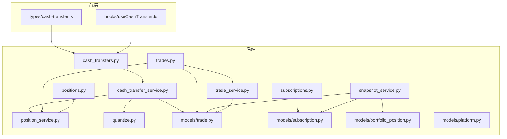
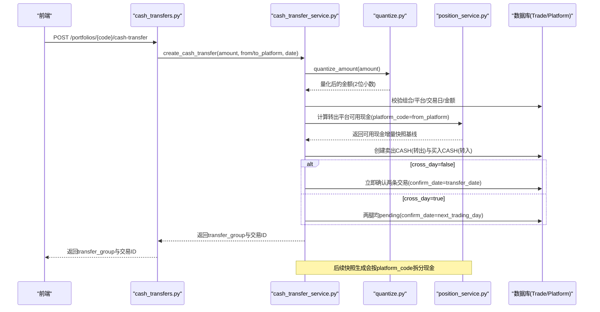
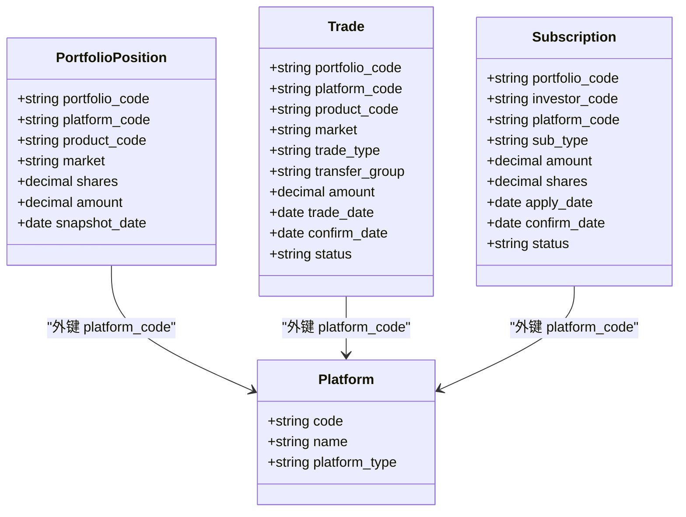
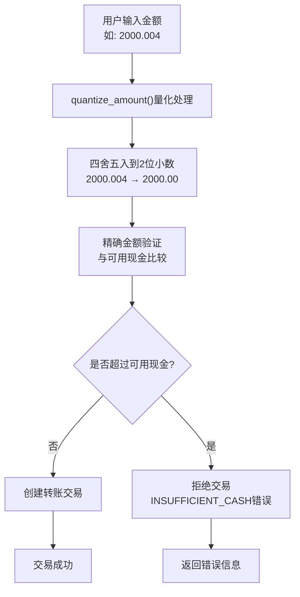
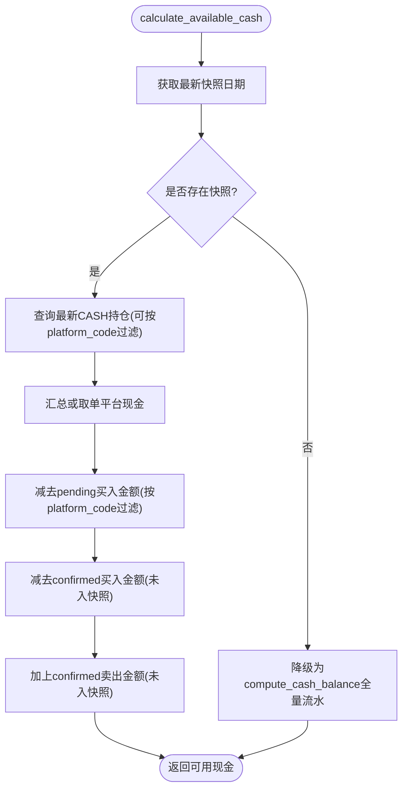
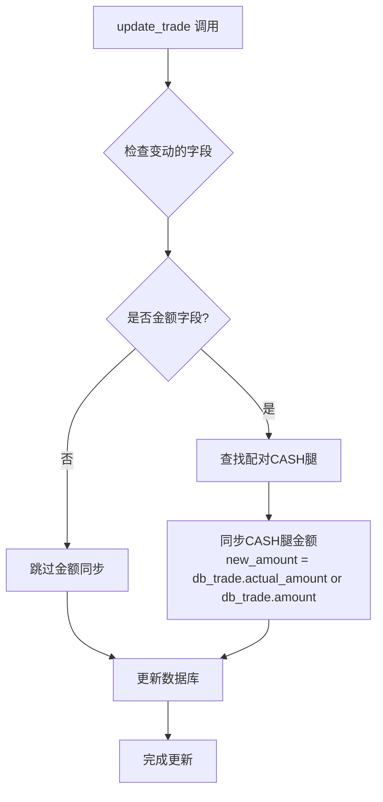
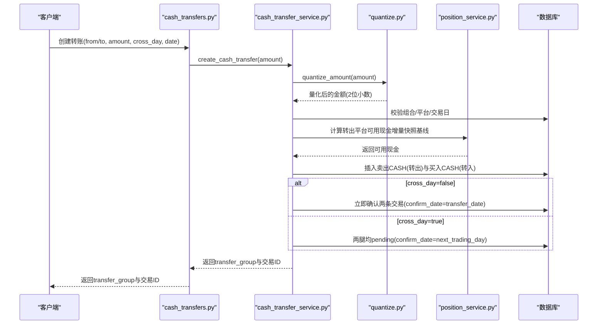
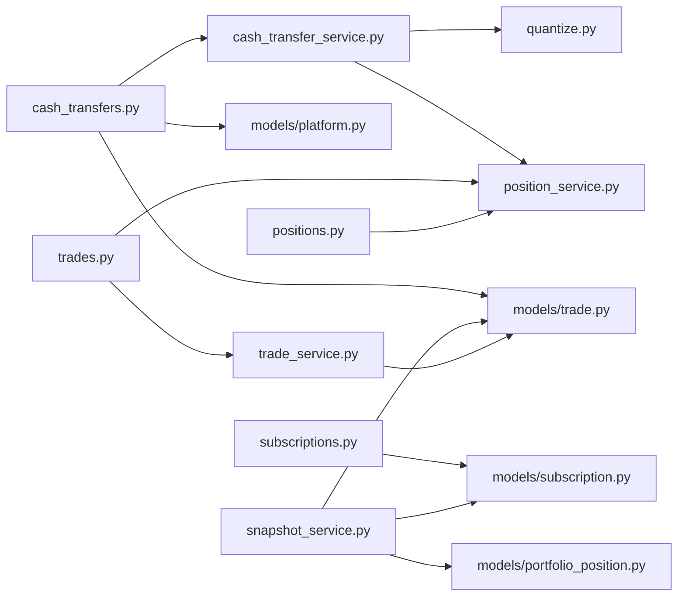

# 平台间现金转移系统

<cite>
**本文引用的文件**   
- [backend/app/models/subscription.py](file://backend/app/models/subscription.py)
- [backend/app/models/portfolio_position.py](file://backend/app/models/portfolio_position.py)
- [backend/app/models/trade.py](file://backend/app/models/trade.py)
- [backend/app/models/platform.py](file://backend/app/models/platform.py)
- [backend/app/services/snapshot_service.py](file://backend/app/services/snapshot_service.py)
- [backend/app/services/position_service.py](file://backend/app/services/position_service.py)
- [backend/app/routers/cash_transfers.py](file://backend/app/routers/cash_transfers.py)
- [backend/app/schemas/cash_transfer.py](file://backend/app/schemas/cash_transfer.py)
- [backend/app/routers/positions.py](file://backend/app/routers/positions.py)
- [backend/app/routers/trades.py](file://backend/app/routers/trades.py)
- [backend/app/routers/subscriptions.py](file://backend/app/routers/subscriptions.py)
- [backend/app/services/trade_service.py](file://backend/app/services/trade_service.py)
- [backend/app/services/cash_transfer_service.py](file://backend/app/services/cash_transfer_service.py)
- [backend/app/utils/quantize.py](file://backend/app/utils/quantize.py)
- [frontend/src/types/cash-transfer.ts](file://frontend/src/types/cash-transfer.ts)
- [frontend/src/hooks/useCashTransfer.ts](file://frontend/src/hooks/useCashTransfer.ts)
- [Docs/02-数据库设计.md](file://Docs/02-数据库设计.md)
</cite>

## 更新摘要
**已进行的更改**
- 移除了关于实验性全量重算方法的描述，系统现在完全采用增量快照基线方法
- 更新了配对CASH腿同步的实现细节，包括update_trade时的自动金额同步逻辑
- 完善了as_of_date参数在各调用点的接入情况
- 增强了可用现金计算的快照基线一致性保证
- **新增金额量化处理机制**：现金转账服务在创建转账前对金额进行量化处理，确保用户输入的金额在验证可用余额前被正确四舍五入，避免浮点数精度问题导致的虚假余额不足错误

## 目录
1. [简介](#简介)
2. [项目结构](#项目结构)
3. [核心组件](#核心组件)
4. [架构总览](#架构总览)
5. [详细组件分析](#详细组件分析)
6. [依赖关系分析](#依赖关系分析)
7. [性能考量](#性能考量)
8. [故障排查指南](#故障排查指南)
9. [结论](#结论)
10. [附录](#附录)

## 简介
本系统围绕"平台间现金转移"与"现金按平台拆分追踪"展开，目标包括：
- 申购/赎回记录关联交易平台，使现金变动可对应到具体平台账户
- 调仓交易前端支持选择平台，后端按平台维度校验可用现金
- 快照生成时现金按 platform_code 维度拆分，持仓唯一约束包含 platform_code
- 新增平台间现金转移功能：复用 Trade 表，通过 transfer_group 配对两条 CASH 交易（卖出+买入），支持当天完成和跨天到账（T+1）
- **跨天转移采用对称状态**：两腿均 pending，confirm_date = next_trading_day，保证 D 日 NAV 不因在途转移虚跌（`compute_cash_balance` 不计入 pending）
- **现金显式流水**：所有现金变动通过 CASH trade 或 event cash_change 显式记录，`compute_cash_balance` 统一计算
- **增量快照基线方法**：系统完全采用增量快照基线方法，移除了实验性的全量重算方法，确保实时计算与快照生成口径一致
- **金额量化处理**：所有金额输入在验证前进行量化处理，确保浮点数精度问题不会导致虚假的余额不足错误

## 项目结构
后端采用 FastAPI + SQLAlchemy ORM，服务层封装业务逻辑，路由层暴露 REST API；前端使用 Next.js + React Query 管理状态与交互。关键模块如下：
- 数据模型：platform、trade、subscription、portfolio_position
- 服务层：snapshot_service（快照生成）、position_service（可用现金计算）、trade_service（交易确认服务）、cash_transfer_service（现金转移服务）
- 工具层：quantize（金额量化处理工具）
- 路由层：cash_transfers（现金转移）、trades（调仓）、subscriptions（申赎）、positions（持仓/可用现金）
- 前端类型与 Hook：cash-transfer.ts、useCashTransfer.ts

**图表来源**
- [backend/app/routers/cash_transfers.py:27-46](file://backend/app/routers/cash_transfers.py#L27-L46)
- [backend/app/routers/trades.py:331-445](file://backend/app/routers/trades.py#L331-L445)
- [backend/app/routers/subscriptions.py:115-213](file://backend/app/routers/subscriptions.py#L115-L213)
- [backend/app/routers/positions.py:306-323](file://backend/app/routers/positions.py#L306-L323)
- [backend/app/services/snapshot_service.py:427-706](file://backend/app/services/snapshot_service.py#L427-L706)
- [backend/app/services/position_service.py:18-143](file://backend/app/services/position_service.py#L18-L143)
- [backend/app/services/trade_service.py:78-203](file://backend/app/services/trade_service.py#L78-L203)
- [backend/app/services/cash_transfer_service.py:30-132](file://backend/app/services/cash_transfer_service.py#L30-L132)
- [backend/app/utils/quantize.py:41-52](file://backend/app/utils/quantize.py#L41-L52)
- [backend/app/models/trade.py:1-33](file://backend/app/models/trade.py#L1-L33)
- [backend/app/models/subscription.py:1-22](file://backend/app/models/subscription.py#L1-L22)
- [backend/app/models/portfolio_position.py:1-35](file://backend/app/models/portfolio_position.py#L1-L35)
- [backend/app/models/platform.py:1-12](file://backend/app/models/platform.py#L1-L12)
- [frontend/src/types/cash-transfer.ts:1-36](file://frontend/src/types/cash-transfer.ts#L1-L36)
- [frontend/src/hooks/useCashTransfer.ts:1-71](file://frontend/src/hooks/useCashTransfer.ts#L1-L71)

## 核心组件
- 平台模型 Platform：定义平台编码、名称、类型等基础信息
- 交易模型 Trade：支持 platform_code 与 transfer_group 字段，用于普通调仓与平台间现金转移
- 申赎模型 Subscription：新增 platform_code 必填，确保现金变动归属平台
- 持仓模型 PortfolioPosition：唯一约束包含 platform_code，支持按平台拆分现金与非净值型资产
- 快照服务 SnapshotService：按 platform_code 维度处理现金与持仓变化，生成 portfolio_position、portfolio_value_snapshot、investor_holding
- 可用现金服务 PositionService：**完全采用增量快照基线方法**，支持按 platform_code 过滤的实时可用现金计算
- 交易确认服务 TradeService：提供交易确认、配对CASH腿同步等核心业务逻辑
- 现金转移服务 CashTransferService：创建配对 CASH 交易、确认跨天到账、查询转移列表，**内置金额量化处理**
- 金额量化工具 Quantize：提供统一的金额和份额量化处理，确保精度一致性
- 现金转移路由 CashTransfersRouter：创建配对 CASH 交易、确认跨天到账、查询转移列表
- 前端类型与 Hook：提供转账表单类型与 React Query 封装

**章节来源**
- [backend/app/models/platform.py:1-12](file://backend/app/models/platform.py#L1-L12)
- [backend/app/models/trade.py:1-33](file://backend/app/models/trade.py#L1-L33)
- [backend/app/models/subscription.py:1-22](file://backend/app/models/subscription.py#L1-L22)
- [backend/app/models/portfolio_position.py:1-35](file://backend/app/models/portfolio_position.py#L1-L35)
- [backend/app/services/snapshot_service.py:427-706](file://backend/app/services/snapshot_service.py#L427-L706)
- [backend/app/services/position_service.py:18-143](file://backend/app/services/position_service.py#L18-L143)
- [backend/app/services/trade_service.py:78-203](file://backend/app/services/trade_service.py#L78-L203)
- [backend/app/services/cash_transfer_service.py:30-132](file://backend/app/services/cash_transfer_service.py#L30-L132)
- [backend/app/utils/quantize.py:41-52](file://backend/app/utils/quantize.py#L41-L52)
- [backend/app/routers/cash_transfers.py:27-46](file://backend/app/routers/cash_transfers.py#L27-L46)
- [frontend/src/types/cash-transfer.ts:1-36](file://frontend/src/types/cash-transfer.ts#L1-L36)
- [frontend/src/hooks/useCashTransfer.ts:1-71](file://frontend/src/hooks/useCashTransfer.ts#L1-L71)

## 架构总览
系统以"平台"为资金维度，所有现金相关事件（申购、赎回、买卖、现金转移）均携带 platform_code，并在快照中按平台拆分。现金转移通过两条 CASH 交易配对实现，transfer_group 标识一次完整转移。**系统完全采用增量快照基线方法，确保实时计算与快照生成口径一致**。

**图表来源**
- [backend/app/routers/cash_transfers.py:27-46](file://backend/app/routers/cash_transfers.py#L27-L46)
- [backend/app/services/cash_transfer_service.py:30-132](file://backend/app/services/cash_transfer_service.py#L30-L132)
- [backend/app/utils/quantize.py:41-52](file://backend/app/utils/quantize.py#L41-L52)
- [backend/app/services/position_service.py:18-143](file://backend/app/services/position_service.py#L18-L143)

## 详细组件分析

### 数据模型与约束
- Platform：平台主键 code，作为各实体的外键引用
- Trade：新增 transfer_group 字段用于配对现金转移；platform_code 参与可用现金校验与快照计算
- Subscription：新增 platform_code 必填，确保申购/赎回影响对应平台现金
- PortfolioPosition：唯一约束 uix_position_snapshot 包含 platform_code，保证同一产品在同一平台同一快照日只有一条记录

**图表来源**
- [backend/app/models/platform.py:1-12](file://backend/app/models/platform.py#L1-L12)
- [backend/app/models/trade.py:1-33](file://backend/app/models/trade.py#L1-L33)
- [backend/app/models/subscription.py:1-22](file://backend/app/models/subscription.py#L1-L22)
- [backend/app/models/portfolio_position.py:1-35](file://backend/app/models/portfolio_position.py#L1-L35)

**章节来源**
- [backend/app/models/platform.py:1-12](file://backend/app/models/platform.py#L1-L12)
- [backend/app/models/trade.py:1-33](file://backend/app/models/trade.py#L1-L33)
- [backend/app/models/subscription.py:1-22](file://backend/app/models/subscription.py#L1-L22)
- [backend/app/models/portfolio_position.py:1-35](file://backend/app/models/portfolio_position.py#L1-L35)
- [Docs/02-数据库设计.md:247-375](file://Docs/02-数据库设计.md#L247-L375)

### 金额量化处理机制
**新增** 系统引入了统一的金额量化处理机制，确保所有金额输入都经过精确的四舍五入处理

- **量化规则**：所有金额统一量化到2位小数，使用ROUND_HALF_UP模式（四舍五入）
- **应用时机**：在金额验证和比较之前进行量化，避免浮点数精度问题
- **量化函数**：`quantize_amount()` 提供统一的金额量化处理
- **应用场景**：现金转移、交易创建、手动市场价值更新等所有涉及金额的写入路径
- **精度保证**：量化后的金额与真实交易平台保持一致（分单位），微小误差计入基金财产

**图表来源**
- [backend/app/utils/quantize.py:41-52](file://backend/app/utils/quantize.py#L41-L52)
- [backend/app/services/cash_transfer_service.py:73-83](file://backend/app/services/cash_transfer_service.py#L73-L83)

**章节来源**
- [backend/app/utils/quantize.py:1-53](file://backend/app/utils/quantize.py#L1-L53)
- [backend/app/services/cash_transfer_service.py:73-83](file://backend/app/services/cash_transfer_service.py#L73-L83)

### 快照生成服务（按平台拆分现金）
- 持仓字典 key 从 (product_code, market) 扩展为 (product_code, market, platform_code)
- 前一日现金按 platform_code 分组加载，初始化各平台现金持仓
- **CASH 持仓由 `get_cash_value` → `compute_cash_balance` 统一计算**，不再在 `_generate_portfolio_position` 中增量累加
- 申购/赎回确认对对应平台现金进行加减（通过 CASH trade 显式记录）
- 非 CASH 买入/卖出对相应平台现金进行扣减/增加（自动生成配对 CASH trade，`transfer_group = "rebal_{uuid}"`）
- 事件 `cash_dividend`/`forced_adjustment` 的 `cash_change` 由 `compute_cash_balance` 直接从 event 表读取，不生成 CASH trade
- 构建 PortfolioPosition 时设置 platform_code，并写入快照

**图表来源**
- [backend/app/services/snapshot_service.py:427-706](file://backend/app/services/snapshot_service.py#L427-L706)

**章节来源**
- [backend/app/services/snapshot_service.py:427-706](file://backend/app/services/snapshot_service.py#L427-L706)

### 可用现金计算服务（完全采用增量快照基线方法）
**更新** 系统已完全移除实验性全量重算方法，现完全采用增量快照基线方法

- calculate_available_cash **完全采用增量快照基线方法**：基线直接读最新快照日 portfolio_position 快照表中 CASH amount
- **与快照生成口径完全一致**：manual_market_value 覆盖已 baked in 快照，自然继承
- **无快照时降级**：当无可用快照时，才降级为 compute_cash_balance 全量流水计算
- 支持可选 platform_code 参数，按平台维度过滤计算
- 实时预览调 `calculate_available_cash(today)`，快照生成调 `get_cash_value(date)`（含 `manual_market_value` 绝对替换）
- 针对 CASH 交易（现金转移）区分买入/卖出的现金增减逻辑
- **现金在途**：跨天转移期间，两腿均 pending，在途资金不计入任何平台的可用现金

**图表来源**
- [backend/app/services/position_service.py:110-201](file://backend/app/services/position_service.py#L110-L201)

**章节来源**
- [backend/app/services/position_service.py:110-201](file://backend/app/services/position_service.py#L110-L201)
- [backend/app/routers/positions.py:28-150](file://backend/app/routers/positions.py#L28-L150)
- [backend/app/routers/trades.py:128-256](file://backend/app/routers/trades.py#L128-L256)

### 交易确认服务（配对CASH腿同步增强）
**更新** 增强了配对CASH腿的金额同步逻辑

- **sync_transfer_group 函数**：同步 transfer_group 关联的另一腿状态，支持 savepoint 事务保护
- **confirm_single_trade 函数**：确认单笔调仓交易的核心逻辑，原子同步配对 CASH 腿
- **update_trade 自动金额同步**：当基金腿的 actual_amount、amount、fee、shares、price 等金额字段变动时，自动同步配对 CASH 腿金额
- **TradeUpdate schema 增强**：新增 trade_date 字段支持，CLI 已支持 `--trade-date` 但之前被静默忽略

**图表来源**
- [backend/app/routers/trades.py:411-460](file://backend/app/routers/trades.py#L411-L460)
- [backend/app/services/trade_service.py:78-113](file://backend/app/services/trade_service.py#L78-L113)

**章节来源**
- [backend/app/services/trade_service.py:78-203](file://backend/app/services/trade_service.py#L78-L203)
- [backend/app/routers/trades.py:411-460](file://backend/app/routers/trades.py#L411-L460)
- [backend/app/schemas/trade.py:28-37](file://backend/app/schemas/trade.py#L28-L37)

### 现金转移服务（配对CASH交易与金额量化）
**更新** 增强了金额量化处理机制

- 创建转账：校验组合、平台、交易日、金额与转出平台可用现金；**先对用户输入金额进行量化处理**；生成两条 CASH 交易（卖出+买入），通过 transfer_group 关联
- **金额量化流程**：用户输入金额 → `quantize_amount()` 量化到2位小数 → 精确验证可用现金 → 创建交易
- 确认策略（对称状态）：
  - cross_day=false：两条 Trade 立即 confirm，`confirm_date = transfer_date`
  - cross_day=true：两腿均 pending，`confirm_date = next_trading_day(transfer_date)`，次日同时 confirm
  - 对称状态保证 D 日 NAV 不因在途转移虚跌（两腿均 pending → `compute_cash_balance` 不计入）
- 跨天判断：`cross_day = (confirm_date > trade_date)`
- 确认接口：根据 transfer_group 查找 pending 交易，校验是否到达确认日期后更新状态
- 列表接口：按 transfer_group 分组返回转账记录，展示双方交易状态与确认日期

**图表来源**
- [backend/app/routers/cash_transfers.py:27-46](file://backend/app/routers/cash_transfers.py#L27-L46)
- [backend/app/services/cash_transfer_service.py:30-132](file://backend/app/services/cash_transfer_service.py#L30-L132)
- [backend/app/utils/quantize.py:41-52](file://backend/app/utils/quantize.py#L41-L52)
- [backend/app/services/position_service.py:110-201](file://backend/app/services/position_service.py#L110-L201)

**章节来源**
- [backend/app/routers/cash_transfers.py:27-46](file://backend/app/routers/cash_transfers.py#L27-L46)
- [backend/app/services/cash_transfer_service.py:30-132](file://backend/app/services/cash_transfer_service.py#L30-L132)
- [backend/app/services/cash_transfer_service.py:135-169](file://backend/app/services/cash_transfer_service.py#L135-L169)
- [backend/app/services/cash_transfer_service.py:172-213](file://backend/app/services/cash_transfer_service.py#L172-L213)
- [backend/app/schemas/cash_transfer.py:1-43](file://backend/app/schemas/cash_transfer.py#L1-L43)

### as_of_date 参数接入完善
**更新** 完善了 as_of_date 参数在各调用点的接入

- **subscriptions.py 赎回校验**：传入 `as_of_date=subscription.apply_date`，确保补录历史交易时正确校验可用份额
- **trades.py 卖出校验**：传入 `as_of_date=trade.trade_date`，确保补录历史交易时正确校验可用份额  
- **trades.py 买入校验**：传入 `as_of_date=trade.trade_date`，确保补录历史交易时正确校验可用现金
- 三个 service 函数均已支持 as_of_date 参数，调用点现已全部正确接入

**章节来源**
- [backend/app/routers/subscriptions.py:140-143](file://backend/app/routers/subscriptions.py#L140-L143)
- [backend/app/routers/trades.py:161-164](file://backend/app/routers/trades.py#L161-L164)
- [backend/app/routers/trades.py:204-207](file://backend/app/routers/trades.py#L204-L207)

### 前端类型与Hook
- types/cash-transfer.ts：定义转账请求/响应/列表项类型，包含 from_platform、to_platform、amount、cross_day、transfer_date 等字段
- hooks/useCashTransfer.ts：封装列表查询、创建转账、确认跨天转账的 React Query 操作，成功后刷新缓存并提示用户

**章节来源**
- [frontend/src/types/cash-transfer.ts:1-36](file://frontend/src/types/cash-transfer.ts#L1-L36)
- [frontend/src/hooks/useCashTransfer.ts:1-71](file://frontend/src/hooks/useCashTransfer.ts#L1-L71)

## 依赖关系分析
- 路由层依赖服务层与模型层：cash_transfers 依赖 position_service 与 trade/subscription/platform 模型
- 快照服务依赖交易、申赎、产品与日历数据，按 platform_code 维度处理现金与持仓
- 可用现金计算在多个路由中复用，统一了平台维度的资金校验逻辑
- **交易确认服务独立化**：将交易确认逻辑从路由层提取到 trade_service，供 HTTP API 手动确认与快照重算 auto_confirm 多处复用
- **金额量化工具独立化**：quantize 工具被多个服务复用，确保金额处理的统一性和一致性

**图表来源**
- [backend/app/routers/cash_transfers.py:27-46](file://backend/app/routers/cash_transfers.py#L27-L46)
- [backend/app/services/cash_transfer_service.py:30-132](file://backend/app/services/cash_transfer_service.py#L30-L132)
- [backend/app/utils/quantize.py:41-52](file://backend/app/utils/quantize.py#L41-L52)
- [backend/app/services/position_service.py:110-201](file://backend/app/services/position_service.py#L110-L201)
- [backend/app/routers/trades.py:331-445](file://backend/app/routers/trades.py#L331-L445)
- [backend/app/routers/subscriptions.py:115-213](file://backend/app/routers/subscriptions.py#L115-L213)
- [backend/app/routers/positions.py:306-323](file://backend/app/routers/positions.py#L306-L323)
- [backend/app/services/snapshot_service.py:427-706](file://backend/app/services/snapshot_service.py#L427-L706)
- [backend/app/services/trade_service.py:78-203](file://backend/app/services/trade_service.py#L78-L203)
- [backend/app/models/trade.py:1-33](file://backend/app/models/trade.py#L1-L33)
- [backend/app/models/subscription.py:1-22](file://backend/app/models/subscription.py#L1-L22)
- [backend/app/models/portfolio_position.py:1-35](file://backend/app/models/portfolio_position.py#L1-L35)

**章节来源**
- [backend/app/routers/cash_transfers.py:27-46](file://backend/app/routers/cash_transfers.py#L27-L46)
- [backend/app/services/cash_transfer_service.py:30-132](file://backend/app/services/cash_transfer_service.py#L30-L132)
- [backend/app/utils/quantize.py:41-52](file://backend/app/utils/quantize.py#L41-L52)
- [backend/app/services/position_service.py:110-201](file://backend/app/services/position_service.py#L110-L201)
- [backend/app/routers/trades.py:331-445](file://backend/app/routers/trades.py#L331-L445)
- [backend/app/routers/subscriptions.py:115-213](file://backend/app/routers/subscriptions.py#L115-L213)
- [backend/app/routers/positions.py:306-323](file://backend/app/routers/positions.py#L306-L323)
- [backend/app/services/snapshot_service.py:427-706](file://backend/app/services/snapshot_service.py#L427-L706)
- [backend/app/services/trade_service.py:78-203](file://backend/app/services/trade_service.py#L78-L203)

## 性能考量
- 快照生成按 platform_code 维度拆分，需关注多平台下数据量增长对查询与聚合的影响
- 可用现金计算涉及多次聚合查询，建议为常用过滤条件建立索引（如 portfolio_code、platform_code、status、confirm_date）
- **增量快照基线优化**：有快照时 O(1) 查询，无快照时才降级为全量流水计算，大幅提升性能
- 现金转移配对交易通过 transfer_group 分组查询，避免全表扫描，可在 transfer_group 上建立索引以提升列表查询性能
- 跨天到账确认接口需查询下一个交易日，建议在 trading_calendar 上维护高效索引
- **配对CASH腿同步优化**：使用 savepoint 事务保护，避免配对腿更新失败影响外层事务
- **金额量化优化**：量化处理在内存中进行，开销极小，且避免了后续的浮点数比较问题

## 故障排查指南
- 平台不存在：创建转账或申赎时若 platform_code 无效，将返回平台未找到错误
- 非交易日：转账与交易创建均需校验交易日，非交易日将拒绝提交
- 可用现金不足：转账与买入校验基于 platform_code 的可用现金，不足时返回明确错误码与信息
- **金额量化问题**：如果转账金额被拒绝，检查用户输入金额是否正确量化到2位小数
- **增量快照基线问题**：如果可用现金计算结果异常，检查是否存在最新快照，以及 manual_market_value 是否正确 baked in
- **配对CASH腿不同步**：如果修改基金腿金额后配对CASH腿未同步，检查 update_trade 的金额字段同步逻辑
- 跨天到账未就绪：确认跨天转账时，若未到预计确认日，将提示尚未到确认日期
- 快照依赖保护：取消确认申赎时需检查是否存在依赖该确认日的快照，存在则需先删除快照
- **as_of_date 参数问题**：补录历史交易时如出现校验错误，检查 as_of_date 参数是否正确传入
- **浮点数精度问题**：如果出现虚假的余额不足错误，检查金额是否在验证前进行了正确的量化处理

**章节来源**
- [backend/app/routers/cash_transfers.py:27-46](file://backend/app/routers/cash_transfers.py#L27-L46)
- [backend/app/services/cash_transfer_service.py:73-83](file://backend/app/services/cash_transfer_service.py#L73-L83)
- [backend/app/services/cash_transfer_service.py:135-169](file://backend/app/services/cash_transfer_service.py#L135-L169)
- [backend/app/routers/trades.py:337-379](file://backend/app/routers/trades.py#L337-L379)
- [backend/app/routers/subscriptions.py:301-332](file://backend/app/routers/subscriptions.py#L301-L332)
- [backend/app/services/position_service.py:110-201](file://backend/app/services/position_service.py#L110-L201)
- [backend/app/routers/trades.py:443-456](file://backend/app/routers/trades.py#L443-L456)

## 结论
通过将 platform_code 贯穿至申赎、交易、持仓与快照，系统实现了现金按平台拆分追踪与平台间现金转移能力。**系统完全采用增量快照基线方法，确保了实时计算与快照生成的口径一致性**，解决了 manual_market_value 覆盖继承丢失的问题。**新增的金额量化处理机制有效避免了浮点数精度问题导致的虚假余额不足错误**，提升了系统的准确性和用户体验。TransferGroup 配对机制简化了跨平台资金流转的记录与核对，结合可用现金的平台级校验，提升了资金风控与准确性。**增强的配对CASH腿同步逻辑确保了交易修改的一致性**，完善的 as_of_date 参数接入保证了历史交易补录的正确性。后续可进一步优化索引与批量处理，提升大规模多平台场景下的性能与稳定性。

## 附录
- 数据库设计参考：详见文档中对 portfolio_position、subscription、trade 等表的定义与约束说明

**章节来源**
- [Docs/02-数据库设计.md:247-375](file://Docs/02-数据库设计.md#L247-L375)