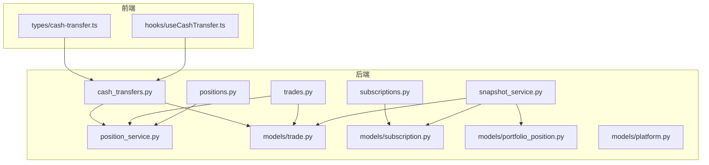
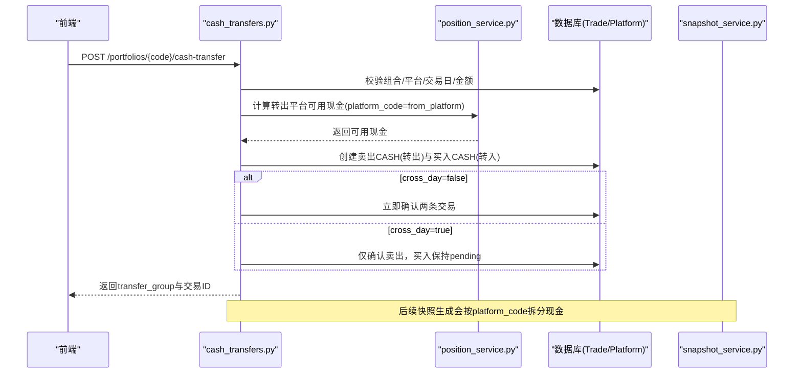
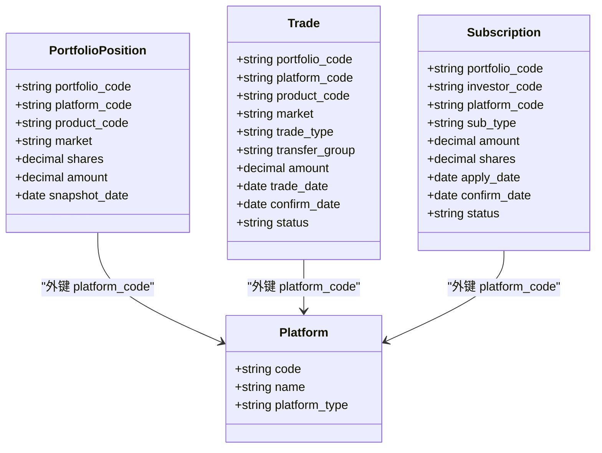
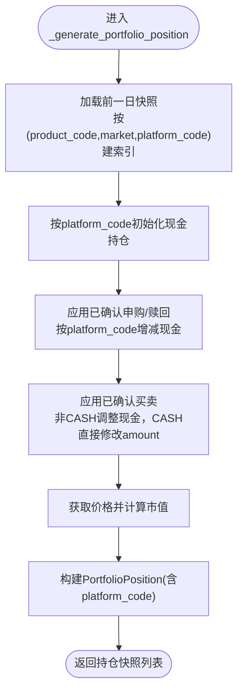
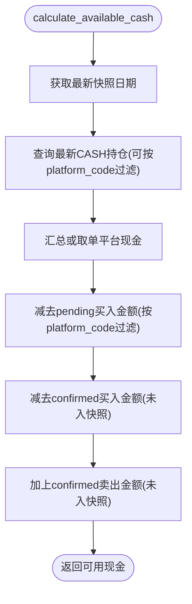
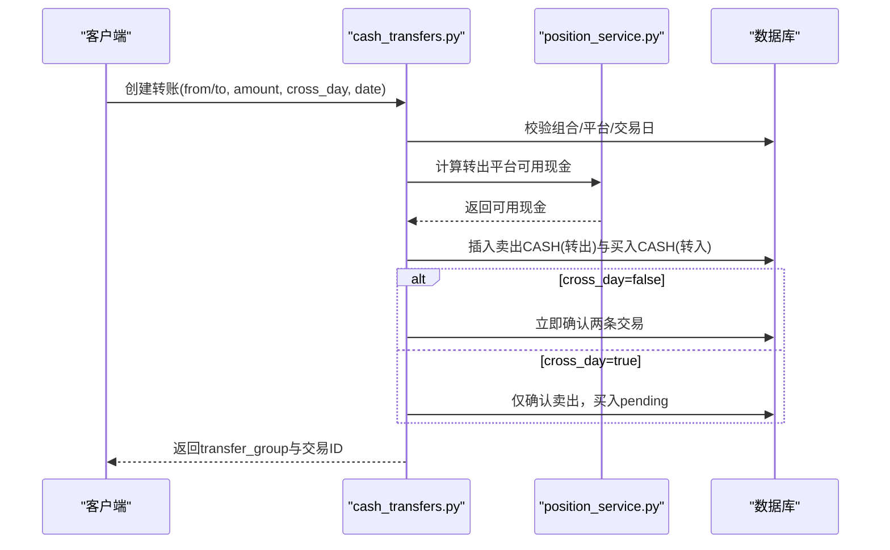
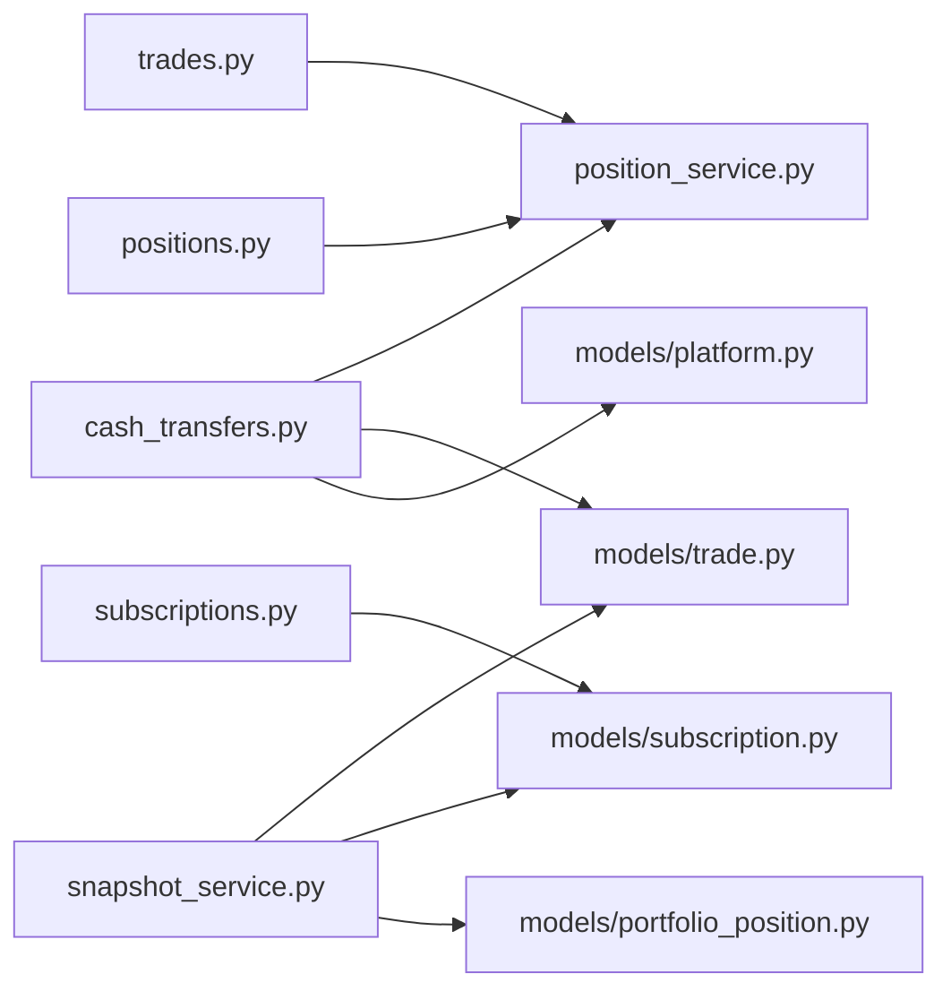

# 平台间现金转移系统

<cite>
**本文引用的文件**   
- [backend/app/models/subscription.py](file://backend/app/models/subscription.py)
- [backend/app/models/portfolio_position.py](file://backend/app/models/portfolio_position.py)
- [backend/app/models/trade.py](file://backend/app/models/trade.py)
- [backend/app/models/platform.py](file://backend/app/models/platform.py)
- [backend/app/services/snapshot_service.py](file://backend/app/services/snapshot_service.py)
- [backend/app/services/position_service.py](file://backend/app/services/position_service.py)
- [backend/app/routers/cash_transfers.py](file://backend/app/routers/cash_transfers.py)
- [backend/app/schemas/cash_transfer.py](file://backend/app/schemas/cash_transfer.py)
- [backend/app/routers/positions.py](file://backend/app/routers/positions.py)
- [backend/app/routers/trades.py](file://backend/app/routers/trades.py)
- [backend/app/routers/subscriptions.py](file://backend/app/routers/subscriptions.py)
- [frontend/src/types/cash-transfer.ts](file://frontend/src/types/cash-transfer.ts)
- [frontend/src/hooks/useCashTransfer.ts](file://frontend/src/hooks/useCashTransfer.ts)
- [Docs/02-数据库设计.md](file://Docs/02-数据库设计.md)
</cite>

## 目录
1. [简介](#简介)
2. [项目结构](#项目结构)
3. [核心组件](#核心组件)
4. [架构总览](#架构总览)
5. [详细组件分析](#详细组件分析)
6. [依赖关系分析](#依赖关系分析)
7. [性能考量](#性能考量)
8. [故障排查指南](#故障排查指南)
9. [结论](#结论)
10. [附录](#附录)

## 简介
本系统围绕“平台间现金转移”与“现金按平台拆分追踪”展开，目标包括：
- 申购/赎回记录关联交易平台，使现金变动可对应到具体平台账户
- 调仓交易前端支持选择平台，后端按平台维度校验可用现金
- 快照生成时现金按 platform_code 维度拆分，持仓唯一约束包含 platform_code
- 新增平台间现金转移功能：复用 Trade 表，通过 transfer_group 配对两条 CASH 交易（卖出+买入），支持当天完成和跨天到账（T+1）

## 项目结构
后端采用 FastAPI + SQLAlchemy ORM，服务层封装业务逻辑，路由层暴露 REST API；前端使用 Next.js + React Query 管理状态与交互。关键模块如下：
- 数据模型：platform、trade、subscription、portfolio_position
- 服务层：snapshot_service（快照生成）、position_service（可用现金计算）
- 路由层：cash_transfers（现金转移）、trades（调仓）、subscriptions（申赎）、positions（持仓/可用现金）
- 前端类型与 Hook：cash-transfer.ts、useCashTransfer.ts

图表来源
- [backend/app/routers/cash_transfers.py:51-190](file://backend/app/routers/cash_transfers.py#L51-L190)
- [backend/app/routers/trades.py:331-445](file://backend/app/routers/trades.py#L331-L445)
- [backend/app/routers/subscriptions.py:115-213](file://backend/app/routers/subscriptions.py#L115-L213)
- [backend/app/routers/positions.py:306-323](file://backend/app/routers/positions.py#L306-L323)
- [backend/app/services/snapshot_service.py:427-706](file://backend/app/services/snapshot_service.py#L427-L706)
- [backend/app/services/position_service.py:18-143](file://backend/app/services/position_service.py#L18-L143)
- [backend/app/models/trade.py:1-33](file://backend/app/models/trade.py#L1-L33)
- [backend/app/models/subscription.py:1-22](file://backend/app/models/subscription.py#L1-L22)
- [backend/app/models/portfolio_position.py:1-35](file://backend/app/models/portfolio_position.py#L1-L35)
- [backend/app/models/platform.py:1-12](file://backend/app/models/platform.py#L1-L12)
- [frontend/src/types/cash-transfer.ts:1-36](file://frontend/src/types/cash-transfer.ts#L1-L36)
- [frontend/src/hooks/useCashTransfer.ts:1-71](file://frontend/src/hooks/useCashTransfer.ts#L1-L71)

章节来源
- [backend/app/routers/cash_transfers.py:51-190](file://backend/app/routers/cash_transfers.py#L51-L190)
- [backend/app/services/snapshot_service.py:427-706](file://backend/app/services/snapshot_service.py#L427-L706)
- [backend/app/services/position_service.py:18-143](file://backend/app/services/position_service.py#L18-L143)
- [backend/app/routers/trades.py:331-445](file://backend/app/routers/trades.py#L331-L445)
- [backend/app/routers/subscriptions.py:115-213](file://backend/app/routers/subscriptions.py#L115-L213)
- [backend/app/routers/positions.py:306-323](file://backend/app/routers/positions.py#L306-L323)
- [backend/app/models/trade.py:1-33](file://backend/app/models/trade.py#L1-L33)
- [backend/app/models/subscription.py:1-22](file://backend/app/models/subscription.py#L1-L22)
- [backend/app/models/portfolio_position.py:1-35](file://backend/app/models/portfolio_position.py#L1-L35)
- [backend/app/models/platform.py:1-12](file://backend/app/models/platform.py#L1-L12)
- [frontend/src/types/cash-transfer.ts:1-36](file://frontend/src/types/cash-transfer.ts#L1-L36)
- [frontend/src/hooks/useCashTransfer.ts:1-71](file://frontend/src/hooks/useCashTransfer.ts#L1-L71)

## 核心组件
- 平台模型 Platform：定义平台编码、名称、类型等基础信息
- 交易模型 Trade：支持 platform_code 与 transfer_group 字段，用于普通调仓与平台间现金转移
- 申赎模型 Subscription：新增 platform_code 必填，确保现金变动归属平台
- 持仓模型 PortfolioPosition：唯一约束包含 platform_code，支持按平台拆分现金与非净值型资产
- 快照服务 SnapshotService：按 platform_code 维度处理现金与持仓变化，生成 portfolio_position、portfolio_value_snapshot、investor_holding
- 可用现金服务 PositionService：支持按 platform_code 过滤的实时可用现金计算
- 现金转移路由 CashTransfersRouter：创建配对 CASH 交易、确认跨天到账、查询转移列表
- 前端类型与 Hook：提供转账表单类型与 React Query 封装

章节来源
- [backend/app/models/platform.py:1-12](file://backend/app/models/platform.py#L1-L12)
- [backend/app/models/trade.py:1-33](file://backend/app/models/trade.py#L1-L33)
- [backend/app/models/subscription.py:1-22](file://backend/app/models/subscription.py#L1-L22)
- [backend/app/models/portfolio_position.py:1-35](file://backend/app/models/portfolio_position.py#L1-L35)
- [backend/app/services/snapshot_service.py:427-706](file://backend/app/services/snapshot_service.py#L427-L706)
- [backend/app/services/position_service.py:18-143](file://backend/app/services/position_service.py#L18-L143)
- [backend/app/routers/cash_transfers.py:51-190](file://backend/app/routers/cash_transfers.py#L51-L190)
- [frontend/src/types/cash-transfer.ts:1-36](file://frontend/src/types/cash-transfer.ts#L1-L36)
- [frontend/src/hooks/useCashTransfer.ts:1-71](file://frontend/src/hooks/useCashTransfer.ts#L1-L71)

## 架构总览
系统以“平台”为资金维度，所有现金相关事件（申购、赎回、买卖、现金转移）均携带 platform_code，并在快照中按平台拆分。现金转移通过两条 CASH 交易配对实现，transfer_group 标识一次完整转移。

图表来源
- [backend/app/routers/cash_transfers.py:51-190](file://backend/app/routers/cash_transfers.py#L51-L190)
- [backend/app/services/position_service.py:18-143](file://backend/app/services/position_service.py#L18-L143)
- [backend/app/services/snapshot_service.py:427-706](file://backend/app/services/snapshot_service.py#L427-L706)

## 详细组件分析

### 数据模型与约束
- Platform：平台主键 code，作为各实体的外键引用
- Trade：新增 transfer_group 字段用于配对现金转移；platform_code 参与可用现金校验与快照计算
- Subscription：新增 platform_code 必填，确保申购/赎回影响对应平台现金
- PortfolioPosition：唯一约束 uix_position_snapshot 包含 platform_code，保证同一产品在同一平台同一快照日只有一条记录

图表来源
- [backend/app/models/platform.py:1-12](file://backend/app/models/platform.py#L1-L12)
- [backend/app/models/trade.py:1-33](file://backend/app/models/trade.py#L1-L33)
- [backend/app/models/subscription.py:1-22](file://backend/app/models/subscription.py#L1-L22)
- [backend/app/models/portfolio_position.py:1-35](file://backend/app/models/portfolio_position.py#L1-L35)

章节来源
- [backend/app/models/platform.py:1-12](file://backend/app/models/platform.py#L1-L12)
- [backend/app/models/trade.py:1-33](file://backend/app/models/trade.py#L1-L33)
- [backend/app/models/subscription.py:1-22](file://backend/app/models/subscription.py#L1-L22)
- [backend/app/models/portfolio_position.py:1-35](file://backend/app/models/portfolio_position.py#L1-L35)
- [Docs/02-数据库设计.md:247-375](file://Docs/02-数据库设计.md#L247-L375)

### 快照生成服务（按平台拆分现金）
- 持仓字典 key 从 (product_code, market) 扩展为 (product_code, market, platform_code)
- 前一日现金按 platform_code 分组加载，初始化各平台现金持仓
- 申购/赎回确认对对应平台现金进行加减
- 非 CASH 买入/卖出对相应平台现金进行扣减/增加
- 构建 PortfolioPosition 时设置 platform_code，并写入快照

图表来源
- [backend/app/services/snapshot_service.py:427-706](file://backend/app/services/snapshot_service.py#L427-L706)

章节来源
- [backend/app/services/snapshot_service.py:427-706](file://backend/app/services/snapshot_service.py#L427-L706)

### 可用现金计算服务（支持平台过滤）
- calculate_available_cash 支持可选 platform_code 参数
- 当指定 platform_code 时，仅查询该平台的最新 CASH 持仓，并对申购/赎回与买卖按 platform_code 过滤
- 未指定 platform_code 时汇总所有平台最新现金
- 针对 CASH 交易（现金转移）区分买入/卖出的现金增减逻辑

图表来源
- [backend/app/services/position_service.py:18-143](file://backend/app/services/position_service.py#L18-L143)

章节来源
- [backend/app/services/position_service.py:18-143](file://backend/app/services/position_service.py#L18-L143)
- [backend/app/routers/positions.py:28-150](file://backend/app/routers/positions.py#L28-L150)
- [backend/app/routers/trades.py:128-256](file://backend/app/routers/trades.py#L128-L256)

### 现金转移路由（配对CASH交易）
- 创建转账：校验组合、平台、交易日、金额与转出平台可用现金；生成两条 CASH 交易（卖出+买入），通过 transfer_group 关联
- 确认策略：cross_day=false 则两条交易立即确认；cross_day=true 则卖出立即确认，买入保持 pending，等待下一交易日确认
- 确认接口：根据 transfer_group 查找 pending 买入交易，校验是否到达确认日期后更新状态
- 列表接口：按 transfer_group 分组返回转账记录，展示双方交易状态与确认日期

图表来源
- [backend/app/routers/cash_transfers.py:51-190](file://backend/app/routers/cash_transfers.py#L51-L190)
- [backend/app/services/position_service.py:18-143](file://backend/app/services/position_service.py#L18-L143)

章节来源
- [backend/app/routers/cash_transfers.py:51-190](file://backend/app/routers/cash_transfers.py#L51-L190)
- [backend/app/routers/cash_transfers.py:193-249](file://backend/app/routers/cash_transfers.py#L193-L249)
- [backend/app/routers/cash_transfers.py:252-318](file://backend/app/routers/cash_transfers.py#L252-L318)
- [backend/app/schemas/cash_transfer.py:1-43](file://backend/app/schemas/cash_transfer.py#L1-L43)

### 前端类型与Hook
- types/cash-transfer.ts：定义转账请求/响应/列表项类型，包含 from_platform、to_platform、amount、cross_day、transfer_date 等字段
- hooks/useCashTransfer.ts：封装列表查询、创建转账、确认跨天转账的 React Query 操作，成功后刷新缓存并提示用户

章节来源
- [frontend/src/types/cash-transfer.ts:1-36](file://frontend/src/types/cash-transfer.ts#L1-L36)
- [frontend/src/hooks/useCashTransfer.ts:1-71](file://frontend/src/hooks/useCashTransfer.ts#L1-L71)

## 依赖关系分析
- 路由层依赖服务层与模型层：cash_transfers 依赖 position_service 与 trade/subscription/platform 模型
- 快照服务依赖交易、申赎、产品与日历数据，按 platform_code 维度处理现金与持仓
- 可用现金计算在多个路由中复用，统一了平台维度的资金校验逻辑

图表来源
- [backend/app/routers/cash_transfers.py:51-190](file://backend/app/routers/cash_transfers.py#L51-L190)
- [backend/app/services/position_service.py:18-143](file://backend/app/services/position_service.py#L18-L143)
- [backend/app/routers/trades.py:331-445](file://backend/app/routers/trades.py#L331-L445)
- [backend/app/routers/subscriptions.py:115-213](file://backend/app/routers/subscriptions.py#L115-L213)
- [backend/app/routers/positions.py:306-323](file://backend/app/routers/positions.py#L306-L323)
- [backend/app/services/snapshot_service.py:427-706](file://backend/app/services/snapshot_service.py#L427-L706)
- [backend/app/models/trade.py:1-33](file://backend/app/models/trade.py#L1-L33)
- [backend/app/models/subscription.py:1-22](file://backend/app/models/subscription.py#L1-L22)
- [backend/app/models/portfolio_position.py:1-35](file://backend/app/models/portfolio_position.py#L1-L35)

章节来源
- [backend/app/routers/cash_transfers.py:51-190](file://backend/app/routers/cash_transfers.py#L51-L190)
- [backend/app/services/position_service.py:18-143](file://backend/app/services/position_service.py#L18-L143)
- [backend/app/routers/trades.py:331-445](file://backend/app/routers/trades.py#L331-L445)
- [backend/app/routers/subscriptions.py:115-213](file://backend/app/routers/subscriptions.py#L115-L213)
- [backend/app/routers/positions.py:306-323](file://backend/app/routers/positions.py#L306-L323)
- [backend/app/services/snapshot_service.py:427-706](file://backend/app/services/snapshot_service.py#L427-L706)

## 性能考量
- 快照生成按 platform_code 维度拆分，需关注多平台下数据量增长对查询与聚合的影响
- 可用现金计算涉及多次聚合查询，建议为常用过滤条件建立索引（如 portfolio_code、platform_code、status、confirm_date）
- 现金转移配对交易通过 transfer_group 分组查询，避免全表扫描，可在 transfer_group 上建立索引以提升列表查询性能
- 跨天到账确认接口需查询下一个交易日，建议在 trading_calendar 上维护高效索引

[本节为通用指导，不直接分析具体文件]

## 故障排查指南
- 平台不存在：创建转账或申赎时若 platform_code 无效，将返回平台未找到错误
- 非交易日：转账与交易创建均需校验交易日，非交易日将拒绝提交
- 可用现金不足：转账与买入校验基于 platform_code 的可用现金，不足时返回明确错误码与信息
- 跨天到账未就绪：确认跨天转账时，若未到预计确认日，将提示尚未到确认日期
- 快照依赖保护：取消确认申赎时需检查是否存在依赖该确认日的快照，存在则需先删除快照

章节来源
- [backend/app/routers/cash_transfers.py:75-117](file://backend/app/routers/cash_transfers.py#L75-L117)
- [backend/app/routers/cash_transfers.py:227-249](file://backend/app/routers/cash_transfers.py#L227-L249)
- [backend/app/routers/trades.py:337-379](file://backend/app/routers/trades.py#L337-L379)
- [backend/app/routers/subscriptions.py:301-332](file://backend/app/routers/subscriptions.py#L301-L332)

## 结论
通过将 platform_code 贯穿至申赎、交易、持仓与快照，系统实现了现金按平台拆分追踪与平台间现金转移能力。TransferGroup 配对机制简化了跨平台资金流转的记录与核对，结合可用现金的平台级校验，提升了资金风控与准确性。后续可进一步优化索引与批量处理，提升大规模多平台场景下的性能与稳定性。

[本节为总结性内容，不直接分析具体文件]

## 附录
- 数据库设计参考：详见文档中对 portfolio_position、subscription、trade 等表的定义与约束说明

章节来源
- [Docs/02-数据库设计.md:247-375](file://Docs/02-数据库设计.md#L247-L375)