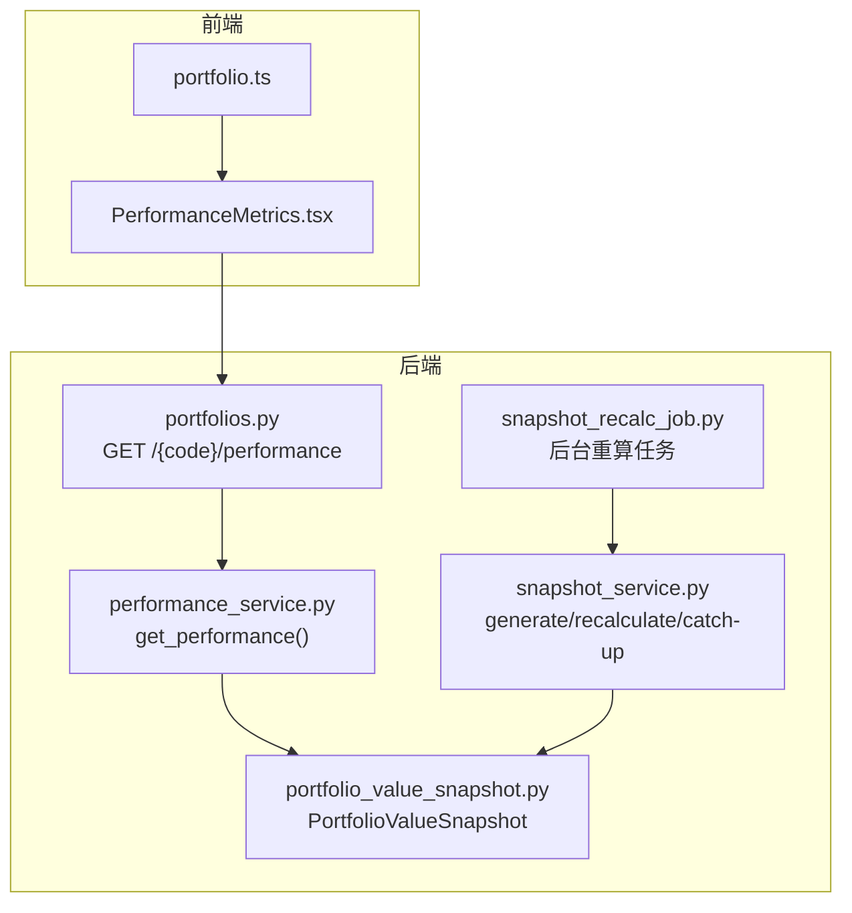
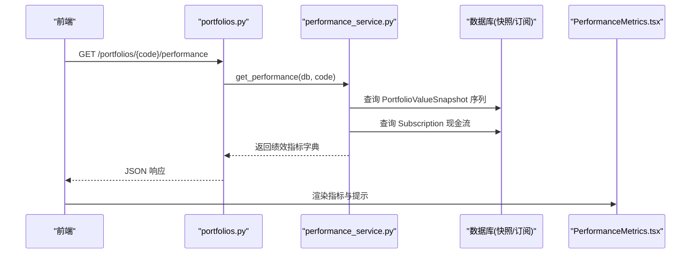
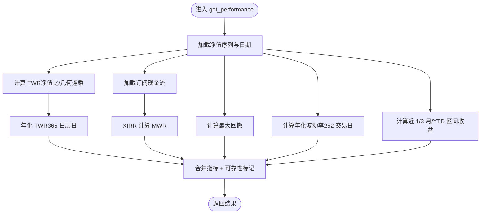
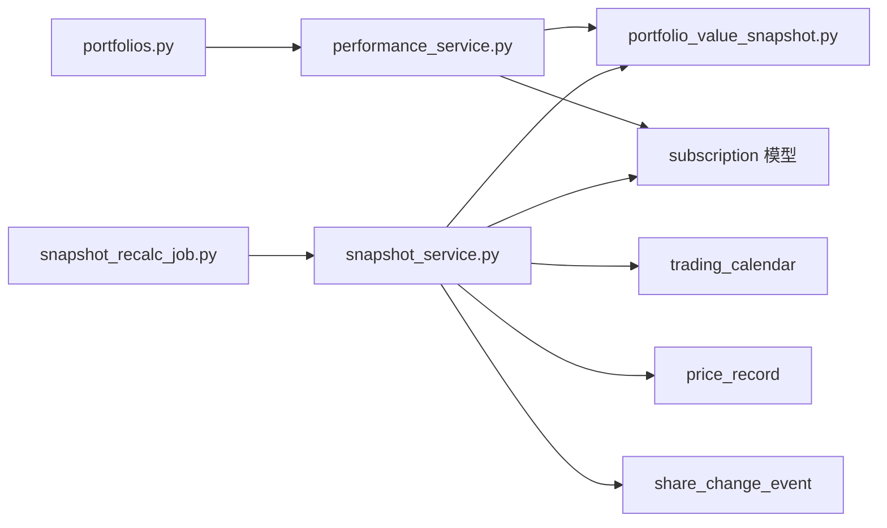

# 性能分析系统

<cite>
**本文引用的文件**   
- [performance_service.py](file://backend/app/services/performance_service.py)
- [portfolios.py](file://backend/app/routers/portfolios.py)
- [portfolio_value_snapshot.py](file://backend/app/models/portfolio_value_snapshot.py)
- [snapshot_service.py](file://backend/app/services/snapshot_service.py)
- [snapshots.py](file://backend/app/routers/snapshots.py)
- [snapshot_recalc_job.py](file://backend/app/services/snapshot_recalc_job.py)
- [PerformanceMetrics.tsx](file://frontend/src/components/shared/PerformanceMetrics.tsx)
- [portfolio.ts](file://frontend/src/types/portfolio.ts)
- [test_performance_service.py](file://backend/tests/unit/test_performance_service.py)
</cite>

## 目录
1. [引言](#引言)
2. [项目结构](#项目结构)
3. [核心组件](#核心组件)
4. [架构总览](#架构总览)
5. [详细组件分析](#详细组件分析)
6. [依赖关系分析](#依赖关系分析)
7. [性能考量](#性能考量)
8. [故障排查指南](#故障排查指南)
9. [结论](#结论)
10. [附录](#附录)

## 引言
本文件围绕“组合绩效与风险指标”能力，系统性梳理后端计算服务、数据快照体系、API 路由以及前端展示组件。重点覆盖：
- TWR（时间加权收益率）与 MWR（资金加权收益率/XIRR）口径与实现
- 最大回撤、年化波动率、区间收益等风险指标
- 净值序列一致性自检与年化可靠性提示
- 快照生成、重算与追平的保障机制对绩效数据质量的影响
- 前端指标面板的可视化与解释性提示

## 项目结构
与性能分析相关的关键路径包括：
- 后端服务层：performance_service.py 提供纯计算函数与聚合接口
- 数据模型层：portfolio_value_snapshot.py 定义净值快照表及不可变约束
- 快照服务层：snapshot_service.py 负责三张快照表的生成、重算与校验
- API 路由层：portfolios.py 暴露 /performance 端点；snapshots.py 暴露快照管理端点
- 异步任务：snapshot_recalc_job.py 提供后台重算任务提交与执行
- 前端展示：PerformanceMetrics.tsx 渲染绩效指标并给出可信度提示
- 类型定义：portfolio.ts 定义 PortfolioPerformance 字段契约

图表来源 
- [portfolios.py:136-147](file://backend/app/routers/portfolios.py#L136-L147)
- [performance_service.py:218-293](file://backend/app/services/performance_service.py#L218-L293)
- [portfolio_value_snapshot.py:1-39](file://backend/app/models/portfolio_value_snapshot.py#L1-L39)
- [snapshot_service.py:144-237](file://backend/app/services/snapshot_service.py#L144-L237)
- [snapshot_recalc_job.py:27-66](file://backend/app/services/snapshot_recalc_job.py#L27-L66)

章节来源
- [portfolios.py:136-147](file://backend/app/routers/portfolios.py#L136-L147)
- [performance_service.py:218-293](file://backend/app/services/performance_service.py#L218-L293)
- [portfolio_value_snapshot.py:1-39](file://backend/app/models/portfolio_value_snapshot.py#L1-L39)
- [snapshot_service.py:144-237](file://backend/app/services/snapshot_service.py#L144-L237)
- [snapshot_recalc_job.py:27-66](file://backend/app/services/snapshot_recalc_job.py#L27-L66)

## 核心组件
- 绩效计算服务（performance_service.py）
  - 提供 TWR/MWR 计算、最大回撤、年化波动率、区间收益、年化换算与可靠性判断
  - 关键函数：compute_twr、_xirr/_npv、_max_drawdown、_annualized_volatility、_period_return、compute_mwr、get_performance
- 净值快照模型（portfolio_value_snapshot.py）
  - 定义单位净值、总资产、总份额、冻结份额、在途金额等字段
  - ORM 事件禁止直接更新/删除，确保只增不改的数据完整性
- 快照服务（snapshot_service.py）
  - 单日生成、区间重算、逐日追平、下一交易日顺延
  - 级联回退申购/赎回与份额变动事件，保证历史一致性
- 异步重算任务（snapshot_recalc_job.py）
  - 提交后台任务、线程池执行、统一事务语义（成功则 commit，失败则 rollback）
- 前端指标面板（PerformanceMetrics.tsx）
  - 展示 TWR/MWR/回撤/波动率/区间收益，并在净值序列不一致或持有期过短时给出提示

章节来源
- [performance_service.py:1-293](file://backend/app/services/performance_service.py#L1-L293)
- [portfolio_value_snapshot.py:1-39](file://backend/app/models/portfolio_value_snapshot.py#L1-L39)
- [snapshot_service.py:144-237](file://backend/app/services/snapshot_service.py#L144-L237)
- [snapshot_recalc_job.py:27-66](file://backend/app/services/snapshot_recalc_job.py#L27-L66)
- [PerformanceMetrics.tsx:1-154](file://frontend/src/components/shared/PerformanceMetrics.tsx#L1-L154)

## 架构总览
绩效数据流从快照到指标再到前端展示的端到端流程如下：

图表来源 
- [portfolios.py:136-147](file://backend/app/routers/portfolios.py#L136-L147)
- [performance_service.py:218-293](file://backend/app/services/performance_service.py#L218-L293)
- [PerformanceMetrics.tsx:70-154](file://frontend/src/components/shared/PerformanceMetrics.tsx#L70-L154)

## 详细组件分析

### 绩效计算服务（performance_service.py）
- 设计要点
  - TWR：净值比法与几何连乘法在净值化记账下应恒等，差异用于自检
  - MWR：基于 XIRR 求解不规则现金流的年化内部收益率
  - 风险指标：最大回撤、年化波动率（按 252 交易日）、区间收益（近 1/3 月/YTD）
  - 年化可靠性：持有期不足 90 天标注仅供参考
- 复杂度与边界
  - TWR：O(n)，过滤无效净值后线性扫描
  - XIRR：二分+迭代收敛，最多固定次数迭代，NPV 计算 O(k)
  - 最大回撤：单次扫描 O(n)
  - 年化波动率：日收益率计算 O(n)，样本方差 O(n)
  - 区间收益：定位基准快照 O(n)
- 错误处理
  - 净值不足/非正净值返回 None
  - 现金流同号或无解时 XIRR 返回 None
  - 持有期过短导致年化外推，通过 annualization_reliable 标记

图表来源 
- [performance_service.py:218-293](file://backend/app/services/performance_service.py#L218-L293)

章节来源
- [performance_service.py:1-293](file://backend/app/services/performance_service.py#L1-L293)
- [test_performance_service.py:1-298](file://backend/tests/unit/test_performance_service.py#L1-L298)

### 净值快照模型（portfolio_value_snapshot.py）
- 字段与约束
  - portfolio_code、snapshot_date 唯一约束
  - unit_price、total_value、total_shares、frozen_shares、in_transit_total 等
- 不可变性保护
  - before_update/before_delete 事件抛出异常，强制走重算/删除专用接口

章节来源
- [portfolio_value_snapshot.py:1-39](file://backend/app/models/portfolio_value_snapshot.py#L1-L39)

### 快照服务（snapshot_service.py）
- 单日生成 generate_daily_snapshots
  - 前置校验（交易日、连续性、依赖数据）
  - 生成持仓快照 → 市值快照 → 投资人快照
  - 支持负现金告警不阻断生成
- 区间重算 recalculate_snapshots
  - 整区间预校验，避免删除后才发现缺失
  - 自动扩展 end_date（若之后存在快照）
  - 级联回退申购/赎回与份额事件，再重建
- 逐日追平 catch_up_snapshots
  - 每日 checkpoint commit，失败仅回滚当日
- 下一交易日顺延 generate_next_snapshot
  - 幂等与日历同步检查

章节来源
- [snapshot_service.py:144-237](file://backend/app/services/snapshot_service.py#L144-L237)
- [snapshot_service.py:240-405](file://backend/app/services/snapshot_service.py#L240-L405)
- [snapshot_service.py:408-494](file://backend/app/services/snapshot_service.py#L408-L494)
- [snapshot_service.py:497-544](file://backend/app/services/snapshot_service.py#L497-L544)

### 异步重算任务（snapshot_recalc_job.py）
- 提交任务 submit_snapshot_recalc_job
  - 单 active 锁（同类型互斥）
  - 立即返回 job_id，客户端轮询终态
- 后台执行 _run_snapshot_recalc_job_impl
  - 自持 SessionLocal
  - 保持单一事务语义：errors 非空则整体 rollback，否则 commit

章节来源
- [snapshot_recalc_job.py:27-66](file://backend/app/services/snapshot_recalc_job.py#L27-L66)
- [snapshot_recalc_job.py:69-147](file://backend/app/services/snapshot_recalc_job.py#L69-L147)

### API 路由（portfolios.py 与 snapshots.py）
- portfolios.py
  - GET /{code}/performance：调用 performance_service.get_performance
- snapshots.py
  - POST /generate：手动触发单日快照生成
  - POST /recalculate：同步区间重算
  - POST /recalculate-async：异步区间重算（返回 job_id）
  - POST /catch-up：逐日追平至目标日
  - POST /generate-next：生成下一个交易日快照
  - GET /validation：依赖数据预检
  - GET /portfolios/{code}/status：快照状态与负现金平台清单
  - DELETE 系列：删除指定/批量快照（含 dry-run 预览）

章节来源
- [portfolios.py:136-147](file://backend/app/routers/portfolios.py#L136-L147)
- [snapshots.py:35-71](file://backend/app/routers/snapshots.py#L35-L71)
- [snapshots.py:73-114](file://backend/app/routers/snapshots.py#L73-L114)
- [snapshots.py:117-171](file://backend/app/routers/snapshots.py#L117-L171)
- [snapshots.py:174-198](file://backend/app/routers/snapshots.py#L174-L198)
- [snapshots.py:201-234](file://backend/app/routers/snapshots.py#L201-L234)
- [snapshots.py:237-258](file://backend/app/routers/snapshots.py#L237-L258)
- [snapshots.py:261-317](file://backend/app/routers/snapshots.py#L261-L317)
- [snapshots.py:320-362](file://backend/app/routers/snapshots.py#L320-L362)
- [snapshots.py:365-463](file://backend/app/routers/snapshots.py#L365-L463)

### 前端指标面板（PerformanceMetrics.tsx）
- 展示项
  - TWR 累计/年化、MWR 年化、最大回撤、近 1/3 月、YTD、年化波动率
  - 期初/当前净值、计入现金流笔数
- 可信度提示
  - nav_series_consistent=false：净值序列不一致，需检查快照断层或异常净值
  - annualization_reliable=false：持有期不足 90 天，年化仅供参考

章节来源
- [PerformanceMetrics.tsx:1-154](file://frontend/src/components/shared/PerformanceMetrics.tsx#L1-L154)
- [portfolio.ts:55-84](file://frontend/src/types/portfolio.ts#L55-L84)

## 依赖关系分析
- 模块耦合
  - portfolios.py 依赖 performance_service.py
  - performance_service.py 依赖 PortfolioValueSnapshot、Subscription 模型
  - snapshot_service.py 依赖交易日历、价格数据、申购/赎回与份额事件
  - snapshot_recalc_job.py 复用 market_data_service 线程池与 SyncJob
- 外部依赖
  - 交易日历（trading_utils）
  - 价格数据（PriceRecord）
  - 申购/赎回（Subscription）
  - 份额变动事件（ShareChangeEvent）

图表来源 
- [portfolios.py:136-147](file://backend/app/routers/portfolios.py#L136-L147)
- [performance_service.py:218-293](file://backend/app/services/performance_service.py#L218-L293)
- [snapshot_service.py:144-237](file://backend/app/services/snapshot_service.py#L144-L237)
- [snapshot_recalc_job.py:27-66](file://backend/app/services/snapshot_recalc_job.py#L27-L66)

章节来源
- [portfolios.py:136-147](file://backend/app/routers/portfolios.py#L136-L147)
- [performance_service.py:218-293](file://backend/app/services/performance_service.py#L218-L293)
- [snapshot_service.py:144-237](file://backend/app/services/snapshot_service.py#L144-L237)
- [snapshot_recalc_job.py:27-66](file://backend/app/services/snapshot_recalc_job.py#L27-L66)

## 性能考量
- 计算复杂度
  - TWR/MWR/回撤/波动率均为线性或常数级迭代，适合实时计算
  - XIRR 使用二分搜索与固定迭代上限，避免无限循环
- 数据访问
  - 净值序列一次性读取并按日期排序，减少多次往返
  - 订阅记录按组合过滤，避免全表扫描
- 快照一致性
  - 快照不可变约束与级联回退保证历史一致，降低重算时的不确定性
  - 异步重算任务隔离长耗时操作，避免 HTTP 超时
- 年化可靠性
  - 持有期不足 90 天的年化指标标注仅供参考，避免误导

[本节为通用指导，无需特定文件引用]

## 故障排查指南
- 净值序列不一致
  - 现象：nav_series_consistent=false
  - 原因：净值断层或异常值导致两种 TWR 算法不等
  - 处理：检查快照生成日志与价格数据完整性
- 年化指标失真
  - 现象：annualization_reliable=false
  - 原因：持有期过短，年化属大幅外推
  - 处理：结合累计收益与回撤解读，谨慎参考年化
- 快照生成失败
  - 现象：BusinessError 或 ValueError
  - 原因：非交易日、连续性校验失败、依赖数据缺失
  - 处理：先补全交易日历与价格数据，再重试
- 区间重算冲突
  - 现象：RECALC_JOB_CONFLICT
  - 原因：已有同类型重算任务运行中
  - 处理：等待任务完成或取消后再提交

章节来源
- [snapshots.py:35-71](file://backend/app/routers/snapshots.py#L35-L71)
- [snapshots.py:73-114](file://backend/app/routers/snapshots.py#L73-L114)
- [snapshots.py:117-171](file://backend/app/routers/snapshots.py#L117-L171)
- [performance_service.py:218-293](file://backend/app/services/performance_service.py#L218-L293)

## 结论
本性能分析系统以净值快照为核心，结合 TWR/MWR 双口径与风险指标，形成完整、可解释的组合绩效视图。通过严格的快照不可变性与级联回退机制，确保历史一致性；通过异步重算与可靠性提示，提升用户体验与数据可信度。建议在持有期较短时侧重累计收益与回撤，谨慎解读年化指标。

[本节为总结，无需特定文件引用]

## 附录
- 前端类型契约（PortfolioPerformance）
  - 关键字段：twr、twr_chained、annualized_twr、mwr、initial_nav、current_nav、holding_days、return_1m、return_3m、return_ytd、max_drawdown、max_drawdown_peak_date、max_drawdown_trough_date、annualized_volatility、cash_flow_count、nav_series_consistent、annualization_reliable

章节来源
- [portfolio.ts:55-84](file://frontend/src/types/portfolio.ts#L55-L84)