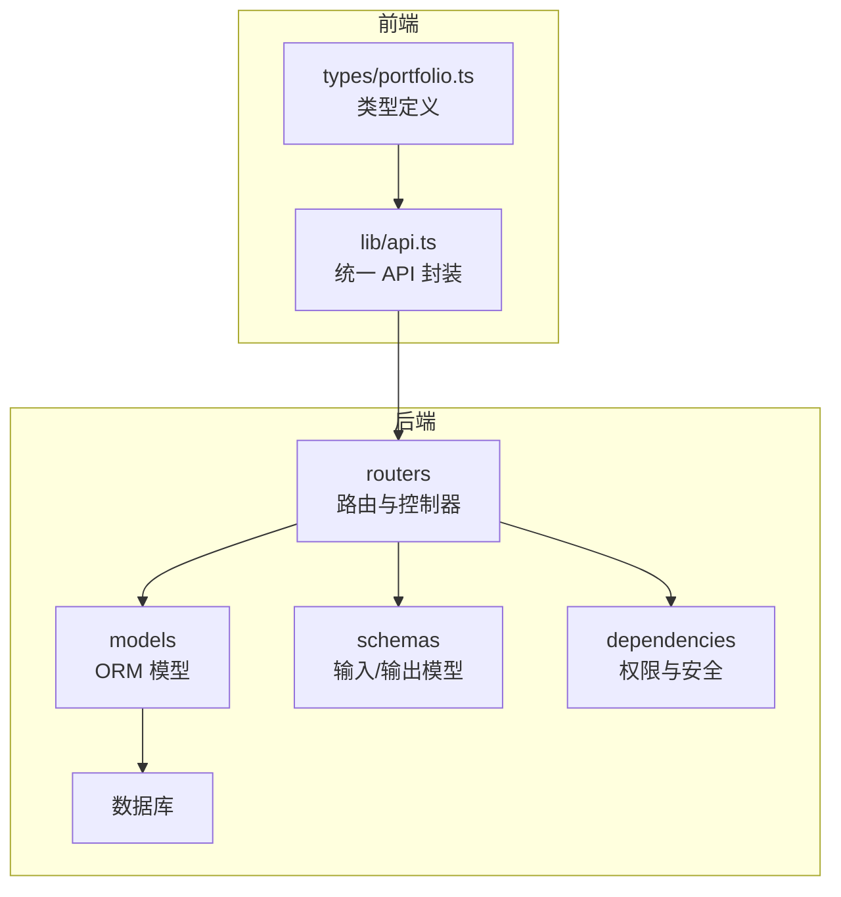
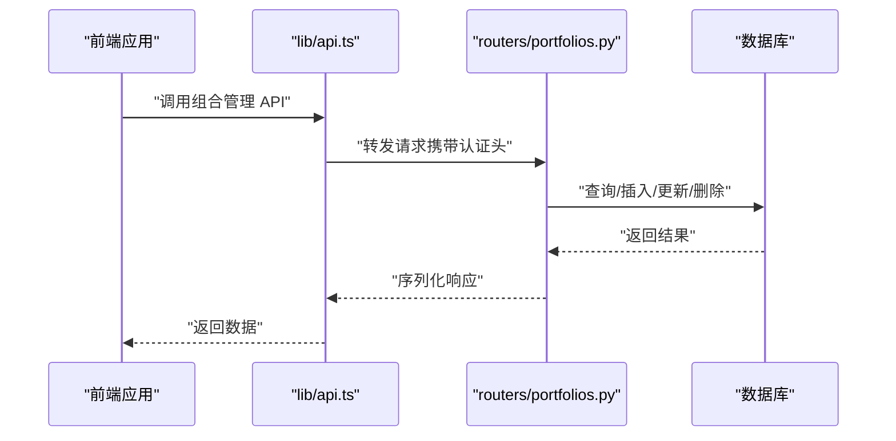
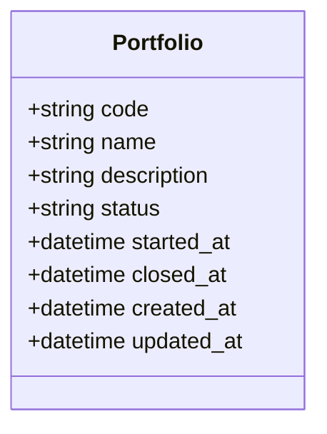
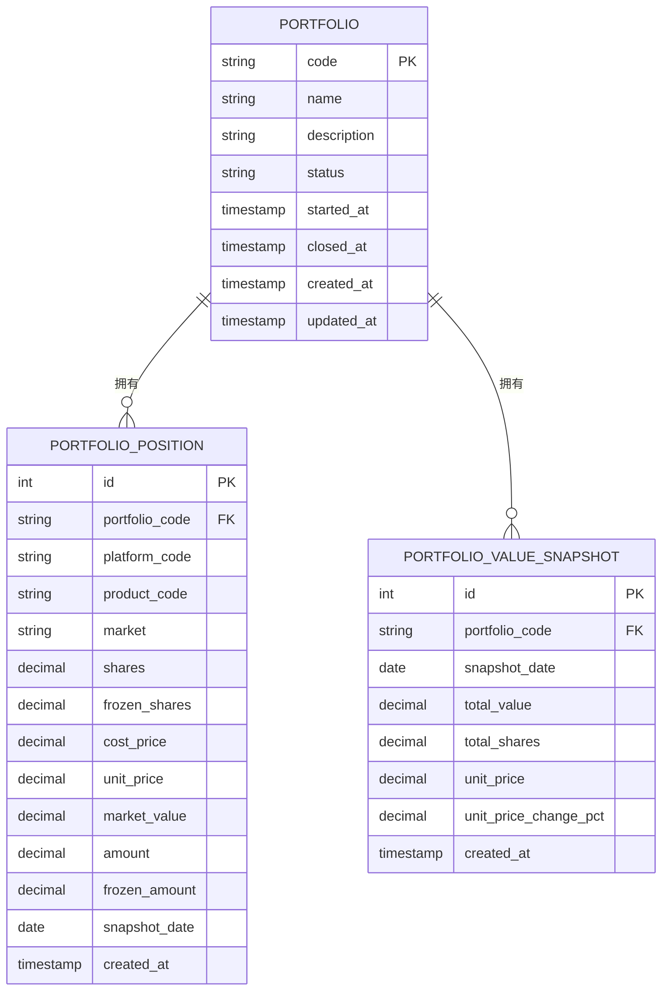
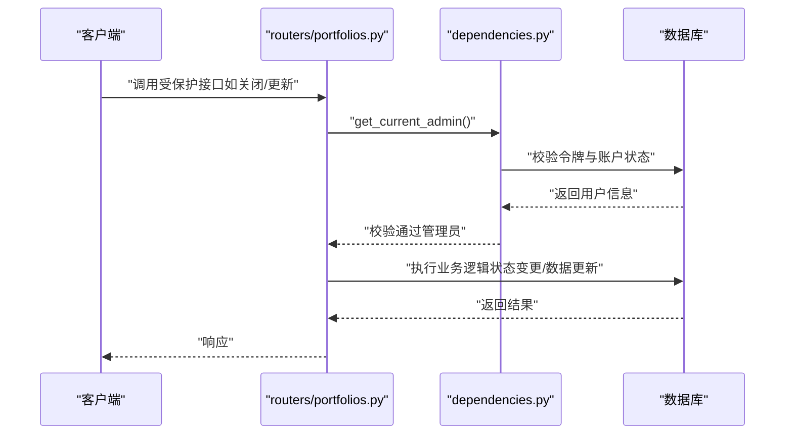
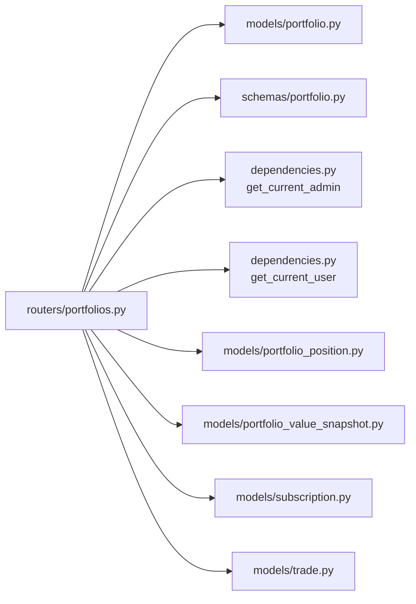

# 投资组合管理

<cite>
**本文引用的文件**
- [backend/app/models/portfolio.py](file://backend/app/models/portfolio.py)
- [backend/app/models/portfolio_position.py](file://backend/app/models/portfolio_position.py)
- [backend/app/models/portfolio_value_snapshot.py](file://backend/app/models/portfolio_value_snapshot.py)
- [backend/app/models/subscription.py](file://backend/app/models/subscription.py)
- [backend/app/models/trade.py](file://backend/app/models/trade.py)
- [backend/app/routers/portfolios.py](file://backend/app/routers/portfolios.py)
- [backend/app/schemas/portfolio.py](file://backend/app/schemas/portfolio.py)
- [backend/app/dependencies.py](file://backend/app/dependencies.py)
- [backend/app/main.py](file://backend/app/main.py)
- [Docs/02-数据库设计.md](file://Docs/02-数据库设计.md)
- [frontend/src/lib/api.ts](file://frontend/src/lib/api.ts)
- [frontend/src/types/portfolio.ts](file://frontend/src/types/portfolio.ts)
</cite>

## 目录
1. [简介](#简介)
2. [项目结构](#项目结构)
3. [核心组件](#核心组件)
4. [架构总览](#架构总览)
5. [详细组件分析](#详细组件分析)
6. [依赖分析](#依赖分析)
7. [性能考虑](#性能考虑)
8. [故障排查指南](#故障排查指南)
9. [结论](#结论)
10. [附录](#附录)

## 简介
本文件系统化阐述投资组合管理功能，覆盖创建、编辑、状态管理与生命周期控制；详述基本信息（代码、名称、描述）、状态流转（草稿、启用、关闭）、时间戳管理；文档化投资组合与持仓、净值快照、申购赎回、交易的关系；给出 CRUD 与状态变更 API 的接口说明、请求参数与响应格式；总结最佳实践与常见使用场景，并解释组合级权限控制与数据验证规则。

## 项目结构
后端基于 FastAPI，采用分层组织：models（ORM 模型）、schemas（Pydantic 输入输出）、routers（路由与控制器）、services（业务服务，本功能主要在路由层实现）、dependencies（权限与安全）。前端通过 axios 封装统一 API 调用，类型定义与后端保持一致。

图表来源
- [backend/app/main.py:32-48](file://backend/app/main.py#L32-L48)
- [backend/app/routers/portfolios.py:1-276](file://backend/app/routers/portfolios.py#L1-L276)
- [backend/app/models/portfolio.py:1-16](file://backend/app/models/portfolio.py#L1-L16)
- [backend/app/schemas/portfolio.py:1-30](file://backend/app/schemas/portfolio.py#L1-L30)
- [backend/app/dependencies.py:114-146](file://backend/app/dependencies.py#L114-L146)
- [frontend/src/lib/api.ts:149-190](file://frontend/src/lib/api.ts#L149-L190)
- [frontend/src/types/portfolio.ts:1-36](file://frontend/src/types/portfolio.ts#L1-L36)

章节来源
- [backend/app/main.py:1-53](file://backend/app/main.py#L1-L53)
- [backend/app/routers/portfolios.py:1-276](file://backend/app/routers/portfolios.py#L1-L276)
- [frontend/src/lib/api.ts:149-190](file://frontend/src/lib/api.ts#L149-L190)

## 核心组件
- 投资组合模型：定义代码、名称、描述、状态、开始/关闭时间与时间戳。
- 持仓快照模型：记录每日组合持仓、成本价、单位净值、市值等。
- 净值快照模型：记录每日组合总值、总份额、单位净值与涨跌幅。
- 申购赎回与交易模型：支撑资金流与调仓行为，影响净值与可用现金。
- 路由与控制器：提供组合 CRUD、状态变更、净值历史、收益与现金流查询。
- Pydantic 模型：定义创建、更新、响应的数据结构。
- 权限依赖：用户认证与管理员权限校验。

章节来源
- [backend/app/models/portfolio.py:5-16](file://backend/app/models/portfolio.py#L5-L16)
- [backend/app/models/portfolio_position.py:5-34](file://backend/app/models/portfolio_position.py#L5-L34)
- [backend/app/models/portfolio_value_snapshot.py:5-20](file://backend/app/models/portfolio_value_snapshot.py#L5-L20)
- [backend/app/models/subscription.py:5-21](file://backend/app/models/subscription.py#L5-L21)
- [backend/app/models/trade.py:5-32](file://backend/app/models/trade.py#L5-L32)
- [backend/app/routers/portfolios.py:18-276](file://backend/app/routers/portfolios.py#L18-L276)
- [backend/app/schemas/portfolio.py:6-30](file://backend/app/schemas/portfolio.py#L6-L30)
- [backend/app/dependencies.py:114-146](file://backend/app/dependencies.py#L114-L146)

## 架构总览
后端通过 FastAPI 路由暴露组合管理接口，权限依赖负责鉴权与管理员校验。前端通过统一 API 封装发起请求，类型定义保证前后端一致性。

图表来源
- [frontend/src/lib/api.ts:149-190](file://frontend/src/lib/api.ts#L149-L190)
- [backend/app/routers/portfolios.py:18-276](file://backend/app/routers/portfolios.py#L18-L276)

## 详细组件分析

### 投资组合模型与状态管理
- 字段与约束：代码为主键；状态默认草稿；开始/关闭时间用于生命周期标记；时间戳自动维护。
- 状态定义：草稿、启用、关闭；启用通常在首次确认申购后发生；关闭前需检查待处理交易。
- 时间戳：创建与更新时间自动维护，便于审计与排序。

图表来源
- [backend/app/models/portfolio.py:5-16](file://backend/app/models/portfolio.py#L5-L16)
- [Docs/02-数据库设计.md:32-58](file://Docs/02-数据库设计.md#L32-L58)

章节来源
- [backend/app/models/portfolio.py:5-16](file://backend/app/models/portfolio.py#L5-L16)
- [Docs/02-数据库设计.md:32-58](file://Docs/02-数据库设计.md#L32-L58)

### 持仓与净值快照
- 持仓快照：记录每日每产品的份额、冻结、成本价、单位净值、市值等，支持按产品与市场维度聚合。
- 净值快照：记录每日组合总值、总份额、单位净值与涨跌幅，唯一约束保证日频准确性。
- 两者共同构成组合价值计算基础：总值=场内份额×收盘价+场外份额×净值+非净值型金额；单位净值=总值/总份额。

图表来源
- [backend/app/models/portfolio.py:5-16](file://backend/app/models/portfolio.py#L5-L16)
- [backend/app/models/portfolio_position.py:5-34](file://backend/app/models/portfolio_position.py#L5-L34)
- [backend/app/models/portfolio_value_snapshot.py:5-20](file://backend/app/models/portfolio_value_snapshot.py#L5-L20)

章节来源
- [backend/app/models/portfolio_position.py:5-34](file://backend/app/models/portfolio_position.py#L5-L34)
- [backend/app/models/portfolio_value_snapshot.py:5-20](file://backend/app/models/portfolio_value_snapshot.py#L5-L20)
- [Docs/02-数据库设计.md:247-484](file://Docs/02-数据库设计.md#L247-L484)

### 申购赎回与交易对组合的影响
- 申购赎回：确认后计入资金流，影响组合可用现金与净值快照。
- 交易：买入/卖出改变持仓结构，影响当日持仓快照与净值快照。
- 现金中转：调仓必须通过现金中转，不能直接基金对基金转换。

图表来源
- [backend/app/models/subscription.py:5-21](file://backend/app/models/subscription.py#L5-L21)
- [backend/app/models/trade.py:5-32](file://backend/app/models/trade.py#L5-L32)
- [Docs/02-数据库设计.md:323-387](file://Docs/02-数据库设计.md#L323-L387)

章节来源
- [backend/app/models/subscription.py:5-21](file://backend/app/models/subscription.py#L5-L21)
- [backend/app/models/trade.py:5-32](file://backend/app/models/trade.py#L5-L32)
- [Docs/02-数据库设计.md:323-387](file://Docs/02-数据库设计.md#L323-L387)

### API 接口说明（组合 CRUD 与状态管理）

- 获取组合列表
  - 方法与路径：GET /api/portfolios
  - 查询参数：status（可选）、page（可选，默认1）、page_size（可选，默认20）
  - 返回：items（组合列表）、total、page、page_size
  - 权限：普通用户可访问
  - 响应模型：列表项包含 code、name、description、status、started_at、closed_at、created_at、updated_at

- 创建组合
  - 方法与路径：POST /api/portfolios
  - 请求体：code、name、description
  - 返回：PortfolioResponse（含默认状态 draft）
  - 权限：管理员
  - 校验：code 唯一性

- 获取单个组合
  - 方法与路径：GET /api/portfolios/{code}
  - 路径参数：code
  - 返回：PortfolioResponse
  - 权限：普通用户
  - 异常：未找到返回 404

- 更新组合
  - 方法与路径：PUT /api/portfolios/{code}
  - 路径参数：code
  - 请求体：name（可选）、description（可选）
  - 返回：PortfolioResponse
  - 权限：管理员
  - 异常：未找到返回 404

- 关闭组合
  - 方法与路径：POST /api/portfolios/{code}/close
  - 路径参数：code
  - 返回：成功消息
  - 权限：管理员
  - 校验：状态不可为已关闭；存在待处理交易则拒绝（需先处理完）

- 重新激活组合
  - 方法与路径：POST /api/portfolios/{code}/reactivate
  - 路径参数：code
  - 返回：成功消息
  - 权限：管理员
  - 校验：仅已关闭组合可重新激活

- 组合净值历史
  - 方法与路径：GET /api/portfolios/{code}/nav-history
  - 路径参数：code
  - 查询参数：start_date（可选）、end_date（可选）
  - 返回：portfolio_code、data[date, unit_price, total_value, total_shares]
  - 权限：普通用户

- 组合收益指标
  - 方法与路径：GET /api/portfolios/{code}/returns
  - 路径参数：code
  - 返回：portfolio_code、cumulative_return、annualized_return、initial_nav、current_nav、holding_days
  - 权限：普通用户

- 组合资金流
  - 方法与路径：GET /api/portfolios/{code}/cash-flow
  - 路径参数：code
  - 返回：portfolio_code、total_inflow、total_outflow、net_inflow
  - 权限：普通用户

章节来源
- [backend/app/routers/portfolios.py:18-276](file://backend/app/routers/portfolios.py#L18-L276)
- [backend/app/schemas/portfolio.py:6-30](file://backend/app/schemas/portfolio.py#L6-L30)
- [frontend/src/lib/api.ts:149-190](file://frontend/src/lib/api.ts#L149-L190)
- [frontend/src/types/portfolio.ts:1-36](file://frontend/src/types/portfolio.ts#L1-L36)

### 权限控制与数据验证
- 用户认证：依赖令牌，校验黑名单与账户锁定状态。
- 管理员权限：仅管理员可创建/更新/关闭/重新激活组合。
- 组合状态变更前置校验：关闭前检查待处理交易；重新激活仅允许已关闭状态。
- 数据验证：创建时校验 code 唯一；状态字段遵循草稿/启用/关闭三态。

图表来源
- [backend/app/dependencies.py:114-146](file://backend/app/dependencies.py#L114-L146)
- [backend/app/routers/portfolios.py:39-96](file://backend/app/routers/portfolios.py#L39-L96)

章节来源
- [backend/app/dependencies.py:49-146](file://backend/app/dependencies.py#L49-L146)
- [backend/app/routers/portfolios.py:39-156](file://backend/app/routers/portfolios.py#L39-L156)

### 组合价值计算与资产配置统计
- 组合总值 = Σ(场内份额×收盘价) + Σ(场外份额×净值) + Σ(非净值型资产金额)
- 单位净值 = 总值 / 总份额
- 可用现金实时计算：基于最新快照现金，加上已确认申购、已确认卖出（快照未生成）等，减去已确认赎回、待确认买入、已确认买入（快照未生成）等。
- 资产配置统计：可通过持仓快照按资产类别/产品维度聚合市值与权重。

章节来源
- [Docs/02-数据库设计.md:500-540](file://Docs/02-数据库设计.md#L500-L540)
- [backend/app/models/portfolio_position.py:5-34](file://backend/app/models/portfolio_position.py#L5-L34)
- [backend/app/models/portfolio_value_snapshot.py:5-20](file://backend/app/models/portfolio_value_snapshot.py#L5-L20)

### 最佳实践与常见场景
- 组合生命周期管理
  - 新建：创建草稿组合，完善基本信息。
  - 启用：首次确认申购后将 started_at 设置为启用时间。
  - 关闭：确保所有待处理交易完成，再执行关闭并设置 closed_at。
- 数据完整性
  - 严禁删除有持仓/快照/交易/申赎记录的组合；通过业务流程“停用”替代物理删除。
  - 严格遵循现金中转规则，避免直接基金对基金转换。
- 性能与并发
  - 使用 WAL 模式提升读写并发；定时任务与手动操作建议串行化以避免冲突。
- 前端集成
  - 使用统一 API 封装调用组合列表、详情、净值历史、收益与现金流接口；按权限显示操作按钮。

章节来源
- [Docs/02-数据库设计.md:599-621](file://Docs/02-数据库设计.md#L599-L621)
- [Docs/02-数据库设计.md:624-655](file://Docs/02-数据库设计.md#L624-L655)
- [frontend/src/lib/api.ts:149-190](file://frontend/src/lib/api.ts#L149-L190)

## 依赖分析
- 路由依赖：组合路由依赖数据库会话、权限依赖、模型与 Schema。
- 权限依赖：提供 get_current_user 与 get_current_admin，前者校验令牌与账户状态，后者进一步校验管理员角色。
- 模型耦合：组合与持仓快照、净值快照、申购赎回、交易存在外键约束，保证生命周期与数据完整性。

图表来源
- [backend/app/routers/portfolios.py:1-15](file://backend/app/routers/portfolios.py#L1-L15)
- [backend/app/dependencies.py:114-146](file://backend/app/dependencies.py#L114-L146)
- [backend/app/models/portfolio.py:1-16](file://backend/app/models/portfolio.py#L1-L16)
- [backend/app/models/portfolio_position.py:1-34](file://backend/app/models/portfolio_position.py#L1-L34)
- [backend/app/models/portfolio_value_snapshot.py:1-20](file://backend/app/models/portfolio_value_snapshot.py#L1-L20)
- [backend/app/models/subscription.py:1-21](file://backend/app/models/subscription.py#L1-L21)
- [backend/app/models/trade.py:1-32](file://backend/app/models/trade.py#L1-L32)

章节来源
- [backend/app/routers/portfolios.py:1-15](file://backend/app/routers/portfolios.py#L1-L15)
- [backend/app/dependencies.py:114-146](file://backend/app/dependencies.py#L114-L146)

## 性能考虑
- 数据库并发：采用 WAL 模式与合理的 busy_timeout，支持读多写少场景。
- 索引策略：对组合、产品、交易、快照等关键字段建立索引，提升查询效率。
- 任务调度：净值同步、交易日历同步等定时任务需串行化，避免并发写入冲突。

章节来源
- [Docs/02-数据库设计.md:624-655](file://Docs/02-数据库设计.md#L624-L655)
- [Docs/02-数据库设计.md:563-596](file://Docs/02-数据库设计.md#L563-L596)

## 故障排查指南
- 401 未授权：检查令牌是否有效、是否在黑名单、是否被锁定。
- 403 禁止访问：确认当前用户角色为管理员。
- 404 未找到：确认组合 code 是否正确。
- 422 状态异常：关闭/重新激活前检查组合状态与待处理交易。
- 业务异常：查看后端日志与审计日志，定位具体错误码与消息。

章节来源
- [backend/app/dependencies.py:49-146](file://backend/app/dependencies.py#L49-L146)
- [backend/app/routers/portfolios.py:92-156](file://backend/app/routers/portfolios.py#L92-L156)

## 结论
投资组合管理以清晰的三态状态机为核心，结合持仓与净值快照实现价值计算与收益分析。通过严格的权限控制与前置校验保障业务合规，配合 WAL 并发与索引优化满足生产可用性。前端统一 API 封装简化集成，类型定义确保一致性。

## 附录
- 前端类型定义与 API 映射：用于确认请求/响应字段与后端一致。
- 数据库设计要点：状态定义、生命周期字段、外键约束与索引策略。

章节来源
- [frontend/src/types/portfolio.ts:1-36](file://frontend/src/types/portfolio.ts#L1-L36)
- [frontend/src/lib/api.ts:149-190](file://frontend/src/lib/api.ts#L149-L190)
- [Docs/02-数据库设计.md:32-58](file://Docs/02-数据库设计.md#L32-L58)