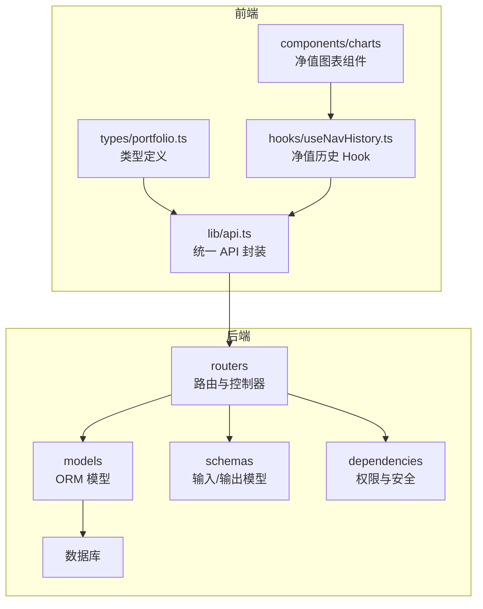
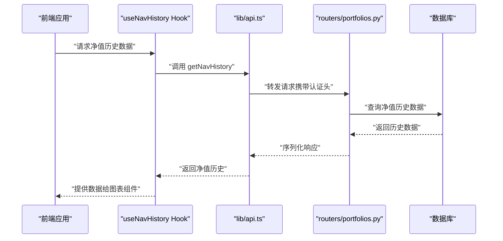
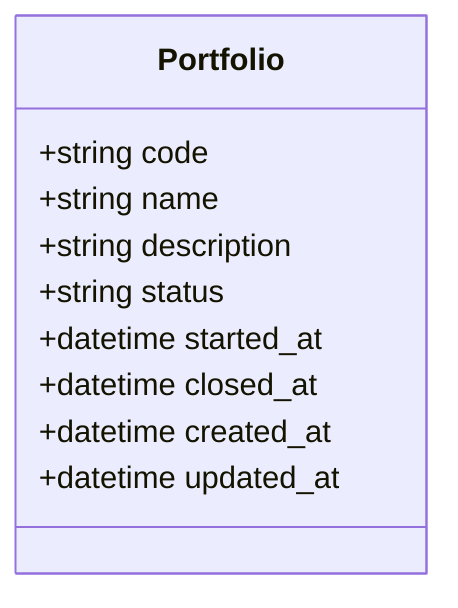
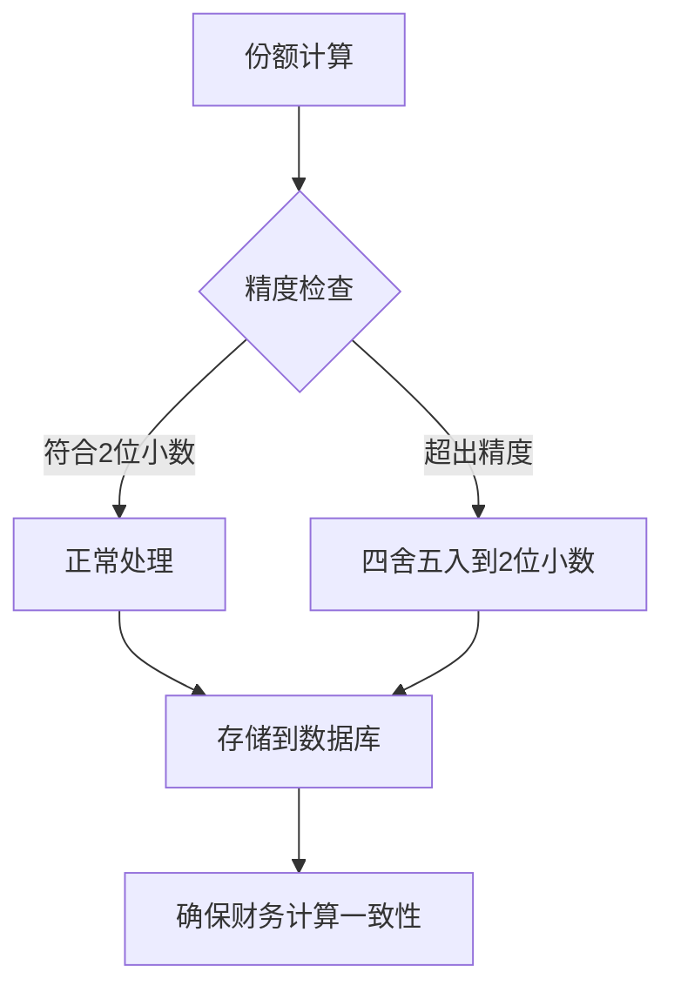
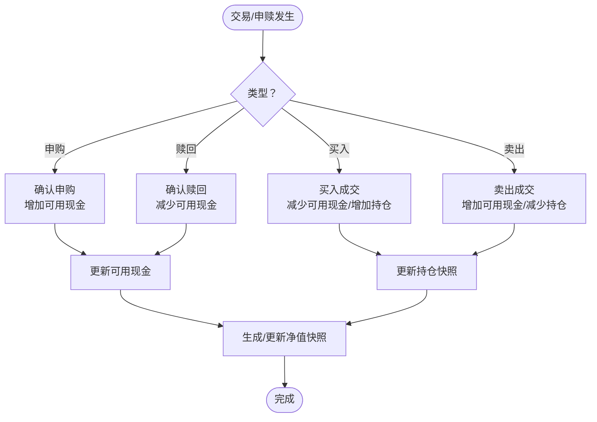
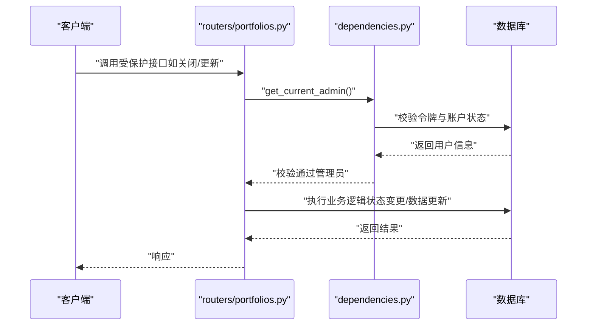
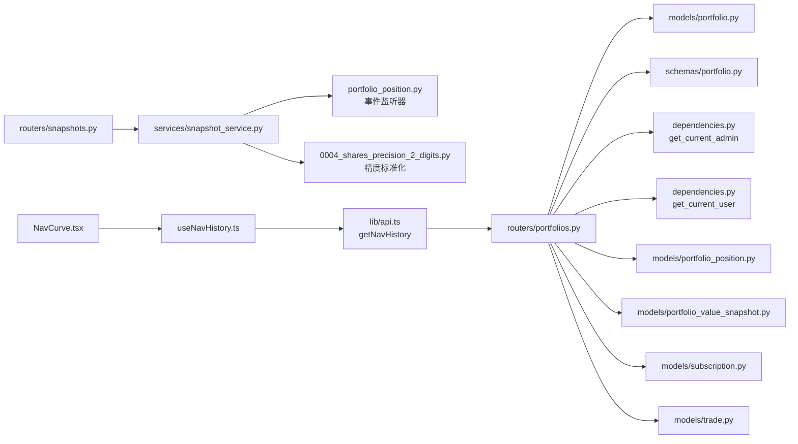

# 投资组合管理

<cite>
**本文引用的文件**
- [backend/app/models/portfolio.py](file://backend/app/models/portfolio.py)
- [backend/app/models/portfolio_position.py](file://backend/app/models/portfolio_position.py)
- [backend/app/models/portfolio_value_snapshot.py](file://backend/app/models/portfolio_value_snapshot.py)
- [backend/app/models/investor_holding.py](file://backend/app/models/investor_holding.py)
- [backend/app/models/subscription.py](file://backend/app/models/subscription.py)
- [backend/app/models/trade.py](file://backend/app/models/trade.py)
- [backend/app/routers/portfolios.py](file://backend/app/routers/portfolios.py)
- [backend/app/routers/snapshots.py](file://backend/app/routers/snapshots.py)
- [backend/app/services/snapshot_service.py](file://backend/app/services/snapshot_service.py)
- [backend/app/schemas/portfolio.py](file://backend/app/schemas/portfolio.py)
- [backend/app/dependencies.py](file://backend/app/dependencies.py)
- [backend/app/main.py](file://backend/app/main.py)
- [backend/alembic/versions/0002_investor_holding_derived_fields.py](file://backend/alembic/versions/0002_investor_holding_derived_fields.py)
- [backend/alembic/versions/0004_shares_precision_2_digits.py](file://backend/alembic/versions/0004_shares_precision_2_digits.py)
- [Docs/02-数据库设计.md](file://Docs/02-数据库设计.md)
- [frontend/src/lib/api.ts](file://frontend/src/lib/api.ts)
- [frontend/src/types/portfolio.ts](file://frontend/src/types/portfolio.ts)
- [frontend/src/hooks/useNavHistory.ts](file://frontend/src/hooks/useNavHistory.ts)
- [frontend/src/components/charts/NavCurve.tsx](file://frontend/src/components/charts/NavCurve.tsx)
- [frontend/src/components/charts/NavCurveSimple.tsx](file://frontend/src/components/charts/NavCurveSimple.tsx)
</cite>

## 更新摘要
**变更内容**
- 投资组合详情页面现在使用历史净值数据，通过 getNavHistory 函数和 useNavHistory hook 替代单点快照
- 为桌面端和移动端界面提供完整的净值历史图表功能
- 净值历史数据获取和展示机制的优化，支持时间序列分析

## 目录
1. [简介](#简介)
2. [项目结构](#项目结构)
3. [核心组件](#核心组件)
4. [架构总览](#架构总览)
5. [详细组件分析](#详细组件分析)
6. [依赖分析](#依赖分析)
7. [性能考虑](#性能考虑)
8. [故障排查指南](#故障排查指南)
9. [结论](#结论)
10. [附录](#附录)

## 简介
本文件系统化阐述投资组合管理功能，覆盖创建、编辑、状态管理与生命周期控制；详述基本信息（代码、名称、描述）、状态流转（草稿、启用、关闭）、时间戳管理；文档化投资组合与持仓、净值快照、申购赎回、交易的关系；给出 CRUD 与状态变更 API 的接口说明、请求参数与响应格式；总结最佳实践与常见使用场景，并解释组合级权限控制与数据验证规则。

**更新** 投资组合详情页面现已采用历史净值数据驱动，通过 getNavHistory 函数和 useNavHistory hook 实现完整的时间序列净值图表展示，替代了之前的单点快照模式。这一改进为桌面端和移动端用户提供了更丰富的投资分析和可视化能力。

## 项目结构
后端基于 FastAPI，采用分层组织：models（ORM 模型）、schemas（Pydantic 输入输出）、routers（路由与控制器）、services（业务服务，本功能主要在路由层实现）、dependencies（权限与安全）。前端通过 axios 封装统一 API 调用，类型定义与后端保持一致。



**图表来源**
- [backend/app/main.py:32-48](file://backend/app/main.py#L32-L48)
- [backend/app/routers/portfolios.py:1-276](file://backend/app/routers/portfolios.py#L1-L276)
- [backend/app/models/portfolio.py:1-16](file://backend/app/models/portfolio.py#L1-L16)
- [backend/app/schemas/portfolio.py:1-30](file://backend/app/schemas/portfolio.py#L1-L30)
- [backend/app/dependencies.py:114-146](file://backend/app/dependencies.py#L114-L146)
- [frontend/src/lib/api.ts:149-190](file://frontend/src/lib/api.ts#L149-L190)
- [frontend/src/types/portfolio.ts:1-36](file://frontend/src/types/portfolio.ts#L1-L36)
- [frontend/src/hooks/useNavHistory.ts:1-100](file://frontend/src/hooks/useNavHistory.ts#L1-L100)
- [frontend/src/components/charts/NavCurve.tsx:1-50](file://frontend/src/components/charts/NavCurve.tsx#L1-L50)

章节来源
- [backend/app/main.py:1-53](file://backend/app/main.py#L1-L53)
- [backend/app/routers/portfolios.py:1-276](file://backend/app/routers/portfolios.py#L1-L276)
- [frontend/src/lib/api.ts:149-190](file://frontend/src/lib/api.ts#L149-L190)

## 核心组件
- 投资组合模型：定义代码、名称、描述、状态、开始/关闭时间与时间戳。
- 持仓快照模型：记录每日组合持仓、成本价、单位净值、市值等，现受事件监听器保护，使用统一的snapshot_date字段，所有份额字段采用2位小数精度。
- 净值快照模型：记录每日组合总值、总份额、单位净值与涨跌幅。
- 投资者持仓模型：记录投资人持仓信息，新增派生字段支持，使用snapshot_date字段，份额精度统一为2位小数。
- 申购赎回与交易模型：支撑资金流与调仓行为，影响净值与可用现金。
- 路由与控制器：提供组合 CRUD、状态变更、净值历史、收益与现金流查询。
- Pydantic 模型：定义创建、更新、响应的数据结构。
- 权限依赖：用户认证与管理员权限校验。
- **新增** useNavHistory Hook：专门处理净值历史数据的获取和管理。
- **新增** NavCurve 图表组件：用于展示净值历史趋势图。

**更新** 份额精度标准化是本次更新的核心改进，所有涉及份额的字段（shares、frozen_shares、cost_per_share等）现在都采用2位小数精度，确保财务计算的准确性和一致性。持仓快照模型包含 SQLAlchemy 事件监听器，防止直接修改；投资者持仓模型新增派生字段支持；所有日期字段统一使用snapshot_date以提高数据一致性。**新增** 净值历史数据获取机制，通过 useNavHistory hook 和 getNavHistory 函数提供完整的时间序列数据支持。

章节来源
- [backend/app/models/portfolio.py:5-16](file://backend/app/models/portfolio.py#L5-L16)
- [backend/app/models/portfolio_position.py:5-52](file://backend/app/models/portfolio_position.py#L5-L52)
- [backend/app/models/portfolio_value_snapshot.py:5-20](file://backend/app/models/portfolio_value_snapshot.py#L5-L20)
- [backend/app/models/investor_holding.py:5-24](file://backend/app/models/investor_holding.py#L5-L24)
- [backend/app/models/subscription.py:5-21](file://backend/app/models/subscription.py#L5-L21)
- [backend/app/models/trade.py:5-32](file://backend/app/models/trade.py#L5-L32)
- [backend/app/routers/portfolios.py:18-276](file://backend/app/routers/portfolios.py#L18-L276)
- [backend/app/schemas/portfolio.py:6-30](file://backend/app/schemas/portfolio.py:6-30)
- [backend/app/dependencies.py:114-146](file://backend/app/dependencies.py#L114-L146)
- [frontend/src/hooks/useNavHistory.ts:1-100](file://frontend/src/hooks/useNavHistory.ts#L1-L100)
- [frontend/src/components/charts/NavCurve.tsx:1-50](file://frontend/src/components/charts/NavCurve.tsx#L1-L50)

## 架构总览
后端通过 FastAPI 路由暴露组合管理接口，权限依赖负责鉴权与管理员校验。前端通过统一 API 封装发起请求，类型定义保证前后端一致性。**新增** 净值历史数据获取流程，通过专门的 Hook 和图表组件实现时间序列数据的可视化展示。



**图表来源**
- [frontend/src/hooks/useNavHistory.ts:1-100](file://frontend/src/hooks/useNavHistory.ts#L1-L100)
- [frontend/src/lib/api.ts:149-190](file://frontend/src/lib/api.ts#L149-L190)
- [backend/app/routers/portfolios.py:18-276](file://backend/app/routers/portfolios.py#L18-L276)

## 详细组件分析

### 投资组合模型与状态管理
- 字段与约束：代码为主键；状态默认草稿；开始/关闭时间用于生命周期标记；时间戳自动维护。
- 状态定义：草稿、启用、关闭；启用通常在首次确认申购后发生；关闭前需检查待处理交易。
- 时间戳：创建与更新时间自动维护，便于审计与排序。



**图表来源**
- [backend/app/models/portfolio.py:5-16](file://backend/app/models/portfolio.py#L5-L16)
- [Docs/02-数据库设计.md:32-58](file://Docs/02-数据库设计.md#L32-L58)

章节来源
- [backend/app/models/portfolio.py:5-16](file://backend/app/models/portfolio.py#L5-L16)
- [Docs/02-数据库设计.md:32-58](file://Docs/02-数据库设计.md#L32-L58)

### 持仓与净值快照
- 持仓快照：记录每日每产品的份额、冻结、成本价、单位净值、市值等，支持按产品与市场维度聚合。**更新** 现受 SQLAlchemy 事件监听器保护，禁止直接更新或删除，使用统一的snapshot_date字段，所有份额字段采用2位小数精度。
- 净值快照：记录每日组合总值、总份额、单位净值与涨跌幅，唯一约束保证日频准确性。
- 两者共同构成组合价值计算基础：总值=场内份额×收盘价+场外份额×净值+非净值型金额；单位净值=总值/总份额。

```mermaid
erDiagram
PORTFOLIO {
string code PK
string name
string description
string status
timestamp started_at
timestamp closed_at
timestamp created_at
timestamp updated_at
}
PORTFOLIO_POSITION {
int id PK
string portfolio_code FK
string platform_code
string product_code
string market
decimal shares(2,2)
decimal frozen_shares(2,2)
decimal cost_price
decimal unit_price
decimal market_value
decimal amount
decimal frozen_amount
date snapshot_date
timestamp created_at
}
PORTFOLIO_VALUE_SNAPSHOT {
int id PK
string portfolio_code FK
date snapshot_date
decimal total_value
decimal total_shares
decimal unit_price
decimal unit_price_change_pct
timestamp created_at
}
INVESTOR_HOLDING {
int id PK
string portfolio_code FK
string investor_code FK
decimal shares(2,2)
decimal frozen_shares(2,2)
decimal cost_per_share
decimal market_value
decimal total_cost
decimal profit
date snapshot_date
timestamp created_at
}
PORTFOLIO ||--o{ PORTFOLIO_POSITION : "拥有"
PORTFOLIO ||--o{ PORTFOLIO_VALUE_SNAPSHOT : "拥有"
PORTFOLIO ||--o{ INVESTOR_HOLDING : "拥有"
```

**更新** 新增投资者持仓表结构，包含派生字段支持，所有日期字段统一使用snapshot_date，份额字段采用2位小数精度。

**图表来源**
- [backend/app/models/portfolio.py:5-16](file://backend/app/models/portfolio.py#L5-L16)
- [backend/app/models/portfolio_position.py:5-52](file://backend/app/models/portfolio_position.py#L5-L52)
- [backend/app/models/portfolio_value_snapshot.py:5-20](file://backend/app/models/portfolio_value_snapshot.py#L5-L20)
- [backend/app/models/investor_holding.py:5-24](file://backend/app/models/investor_holding.py#L5-L24)

章节来源
- [backend/app/models/portfolio_position.py:5-52](file://backend/app/models/portfolio_position.py#L5-L52)
- [backend/app/models/portfolio_value_snapshot.py:5-20](file://backend/app/models/portfolio_value_snapshot.py#L5-L20)
- [backend/app/models/investor_holding.py:5-24](file://backend/app/models/investor_holding.py#L5-L24)
- [Docs/02-数据库设计.md:247-484](file://Docs/02-数据库设计.md#L247-L484)

### 份额精度标准化机制
**新增** 份额精度标准化是本次更新的核心改进，系统现在统一采用2位小数精度处理所有份额相关计算：

- **精度标准**：所有份额字段（shares、frozen_shares、cost_per_share等）统一采用Decimal(2,2)精度
- **计算一致性**：确保持仓数量、冻结份额、单位成本等关键财务字段的计算精度一致
- **数据迁移**：通过 Alembic 迁移脚本0004_shares_precision_2_digits.py实现数据库字段精度调整
- **业务影响**：所有涉及份额的计算和展示都遵循2位小数精度标准



**图表来源**
- [backend/alembic/versions/0004_shares_precision_2_digits.py:1-50](file://backend/alembic/versions/0004_shares_precision_2_digits.py#L1-L50)
- [backend/app/models/portfolio_position.py:10-20](file://backend/app/models/portfolio_position.py#L10-L20)
- [backend/app/models/investor_holding.py:10-18](file://backend/app/models/investor_holding.py#L10-L18)

章节来源
- [backend/alembic/versions/0004_shares_precision_2_digits.py:1-50](file://backend/alembic/versions/0004_shares_precision_2_digits.py#L1-L50)
- [backend/app/models/portfolio_position.py:10-20](file://backend/app/models/portfolio_position.py#L10-L20)
- [backend/app/models/investor_holding.py:10-18](file://backend/app/models/investor_holding.py#L10-L18)

### 持仓快照数据完整性保护机制
**新增** SQLAlchemy 事件监听器确保持仓快照数据的不可变性：

- **更新保护**：`before_update` 事件监听器阻止任何实例级别的更新操作，抛出 `RuntimeError` 异常
- **删除保护**：`before_delete` 事件监听器阻止任何实例级别的删除操作，抛出 `RuntimeError` 异常  
- **批量删除绕过**：内部 `_delete_existing_snapshots` 函数使用 `db.execute(delete())` 绕过监听器，明确表达内部快照删除意图
- **强制重算**：所有数据修正必须通过 `recalculate_snapshots` API 进行，确保数据一致性

```mermaid
flowchart TD
A[尝试更新持仓快照] --> B{SQLAlchemy 事件监听器}
B --> |before_update| C[抛出 RuntimeError]
B --> |before_delete| D[抛出 RuntimeError]
C --> E[强制使用 recalculate_snapshots API]
D --> F[强制使用 DELETE /snapshots/{portfolio}/{date}]
E --> G[重新计算并生成新快照]
F --> H[级联回退依赖数据]
H --> G
```

**图表来源**
- [backend/app/models/portfolio_position.py:37-52](file://backend/app/models/portfolio_position.py#L37-52)
- [backend/app/services/snapshot_service.py:395-440](file://backend/app/services/snapshot_service.py#L395-L440)

章节来源
- [backend/app/models/portfolio_position.py:37-52](file://backend/app/models/portfolio_position.py#L37-52)
- [backend/app/services/snapshot_service.py:395-440](file://backend/app/services/snapshot_service.py#L395-L440)

### 投资者持仓派生字段增强
**新增** 投资者持仓表增加三个派生字段，提升数据分析能力：

- **market_value**：持仓市值 = 份额 × 组合净值
- **total_cost**：总成本 = 份额 × 单位成本
- **profit**：盈亏 = 市值 - 总成本

这些字段在快照生成时自动回填，历史快照保持 NULL，无需数据迁移脚本。

章节来源
- [backend/app/models/investor_holding.py:14-17](file://backend/app/models/investor_holding.py#L14-17)
- [backend/alembic/versions/0002_investor_holding_derived_fields.py:21-31](file://backend/alembic/versions/0002_investor_holding_derived_fields.py#L21-31)

### 申购赎回与交易对组合的影响
- 申购赎回：确认后计入资金流，影响组合可用现金与净值快照。
- 交易：买入/卖出改变持仓结构，影响当日持仓快照与净值快照。
- 现金中转：调仓必须通过现金中转，不能直接基金对基金转换。



**图表来源**
- [backend/app/models/subscription.py:5-21](file://backend/app/models/subscription.py#L5-21)
- [backend/app/models/trade.py:5-32](file://backend/app/models/trade.py#L5-32)
- [Docs/02-数据库设计.md:323-387](file://Docs/02-数据库设计.md#L323-L387)

章节来源
- [backend/app/models/subscription.py:5-21](file://backend/app/models/subscription.py#L5-21)
- [backend/app/models/trade.py:5-32](file://backend/app/models/trade.py#L5-32)
- [Docs/02-数据库设计.md:323-387](file://Docs/02-数据库设计.md#L323-L387)

### API 接口说明（组合 CRUD 与状态管理）

- 获取组合列表
  - 方法与路径：GET /api/portfolios
  - 查询参数：status（可选）、page（可选，默认1）、page_size（可选，默认20）
  - 返回：items（组合列表）、total、page、page_size
  - 权限：普通用户可访问
  - 响应模型：列表项包含 code、name、description、status、started_at、closed_at、created_at、updated_at

- 创建组合
  - 方法与路径：POST /api/portfolios
  - 请求体：code、name、description
  - 返回：PortfolioResponse（含默认状态 draft）
  - 权限：管理员
  - 校验：code 唯一性

- 获取单个组合
  - 方法与路径：GET /api/portfolios/{code}
  - 路径参数：code
  - 返回：PortfolioResponse
  - 权限：普通用户
  - 异常：未找到返回 404

- 更新组合
  - 方法与路径：PUT /api/portfolios/{code}
  - 路径参数：code
  - 请求体：name（可选）、description（可选）
  - 返回：PortfolioResponse
  - 权限：管理员
  - 异常：未找到返回 404

- 关闭组合
  - 方法与路径：POST /api/portfolios/{code}/close
  - 路径参数：code
  - 返回：成功消息
  - 权限：管理员
  - 校验：状态不可为已关闭；存在待处理交易则拒绝（需先处理完）

- 重新激活组合
  - 方法与路径：POST /api/portfolios/{code}/reactivate
  - 路径参数：code
  - 返回：成功消息
  - 权限：管理员
  - 校验：仅已关闭组合可重新激活

- 组合净值历史
  - 方法与路径：GET /api/portfolios/{code}/nav-history
  - 路径参数：code
  - 查询参数：start_date（可选）、end_date（可选）
  - 返回：portfolio_code、data[date, unit_price, total_value, total_shares]
  - 权限：普通用户

- 组合收益指标
  - 方法与路径：GET /api/portfolios/{code}/returns
  - 路径参数：code
  - 返回：portfolio_code、cumulative_return、annualized_return、initial_nav、current_nav、holding_days
  - 权限：普通用户

- 组合资金流
  - 方法与路径：GET /api/portfolios/{code}/cash-flow
  - 路径参数：code
  - 返回：portfolio_code、total_inflow、total_outflow、net_inflow
  - 权限：普通用户

**更新** 新增快照管理相关 API，所有日期参数统一使用snapshot_date：

- 手动生成快照
  - 方法与路径：POST /api/snapshots/generate
  - 请求体：portfolio_code、target_date
  - 返回：SnapshotGenerationResult
  - 权限：管理员

- 重算快照区间
  - 方法与路径：POST /api/snapshots/recalculate
  - 请求体：portfolio_code（可选）、start_date、end_date
  - 返回：RecalculationResult
  - 权限：管理员

- 删除指定日期快照
  - 方法与路径：DELETE /api/snapshots/{portfolio_code}/{snapshot_date}
  - 路径参数：portfolio_code、snapshot_date
  - 返回：删除结果与级联回退信息
  - 权限：管理员

章节来源
- [backend/app/routers/portfolios.py:18-276](file://backend/app/routers/portfolios.py#L18-L276)
- [backend/app/routers/snapshots.py:28-200](file://backend/app/routers/snapshots.py#L28-L200)
- [backend/app/schemas/portfolio.py:6-30](file://backend/app/schemas/portfolio.py#L6-L30)
- [frontend/src/lib/api.ts:149-190](file://frontend/src/lib/api.ts#L149-L190)
- [frontend/src/types/portfolio.ts:1-36](file://frontend/src/types/portfolio.ts#L1-L36)

### 权限控制与数据验证
- 用户认证：依赖令牌，校验黑名单与账户锁定状态。
- 管理员权限：仅管理员可创建/更新/关闭/重新激活组合。
- 组合状态变更前置校验：关闭前检查待处理交易；重新激活仅允许已关闭状态。
- 数据验证：创建时校验 code 唯一；状态字段遵循草稿/启用/关闭三态。



**图表来源**
- [backend/app/dependencies.py:114-146](file://backend/app/dependencies.py#L114-L146)
- [backend/app/routers/portfolios.py:39-96](file://backend/app/routers/portfolios.py#L39-L96)

章节来源
- [backend/app/dependencies.py:49-146](file://backend/app/dependencies.py#L49-L146)
- [backend/app/routers/portfolios.py:39-156](file://backend/app/routers/portfolios.py#L39-L156)

### 组合价值计算与资产配置统计
- 组合总值 = Σ(场内份额×收盘价) + Σ(场外份额×净值) + Σ(非净值型资产金额)
- 单位净值 = 总值 / 总份额
- 可用现金实时计算：基于最新快照现金，加上已确认申购、已确认卖出（快照未生成）等，减去已确认赎回、待确认买入、已确认买入（快照未生成）等。
- 资产配置统计：可通过持仓快照按资产类别/产品维度聚合市值与权重。

**更新** 投资者持仓派生字段支持更精确的盈亏分析，所有日期字段统一使用snapshot_date，份额精度统一为2位小数：
- 单只持仓盈亏 = market_value - total_cost
- 组合总盈亏 = Σ(各持仓 profit)
- 盈亏率 = 总盈亏 / 总成本 × 100%

章节来源
- [Docs/02-数据库设计.md:500-540](file://Docs/02-数据库设计.md#L500-L540)
- [backend/app/models/portfolio_position.py:5-52](file://backend/app/models/portfolio_position.py#L5-L52)
- [backend/app/models/portfolio_value_snapshot.py:5-20](file://backend/app/models/portfolio_value_snapshot.py#L5-L20)
- [backend/app/models/investor_holding.py:14-17](file://backend/app/models/investor_holding.py#L14-L17)

### 净值历史数据获取与展示
**新增** 投资组合详情页面现已采用历史净值数据驱动，提供更丰富的投资分析能力：

- **useNavHistory Hook**：专门处理净值历史数据的获取、缓存和状态管理
- **getNavHistory 函数**：封装后端 API 调用，处理数据格式化和错误处理
- **NavCurve 图表组件**：用于展示净值历史趋势图，支持桌面端和移动端适配
- **时间序列分析**：支持按日期范围查询净值历史，提供完整的历史数据可视化

```mermaid
flowchart TD
A[投资组合详情页] --> B[useNavHistory Hook]
B --> C[getNavHistory 函数]
C --> D[后端 /api/portfolios/{code}/nav-history]
D --> E[净值历史数据]
E --> F[NavCurve 图表组件]
F --> G[时间序列可视化]
```

**图表来源**
- [frontend/src/hooks/useNavHistory.ts:1-100](file://frontend/src/hooks/useNavHistory.ts#L1-L100)
- [frontend/src/components/charts/NavCurve.tsx:1-50](file://frontend/src/components/charts/NavCurve.tsx#L1-L50)
- [backend/app/routers/portfolios.py:18-276](file://backend/app/routers/portfolios.py#L18-L276)

章节来源
- [frontend/src/hooks/useNavHistory.ts:1-100](file://frontend/src/hooks/useNavHistory.ts#L1-L100)
- [frontend/src/components/charts/NavCurve.tsx:1-50](file://frontend/src/components/charts/NavCurve.tsx#L1-L50)
- [frontend/src/components/charts/NavCurveSimple.tsx:1-50](file://frontend/src/components/charts/NavCurveSimple.tsx#L1-L50)

### 最佳实践与常见场景
- 组合生命周期管理
  - 新建：创建草稿组合，完善基本信息。
  - 启用：首次确认申购后将 started_at 设置为启用时间。
  - 关闭：确保所有待处理交易完成，再执行关闭并设置 closed_at。
- 数据完整性
  - 严禁删除有持仓/快照/交易/申赎记录的组合；通过业务流程"停用"替代物理删除。
  - 严格遵循现金中转规则，避免直接基金对基金转换。
  - **新增** 持仓快照数据不可变：任何修正必须通过重算 API，禁止直接更新或删除。
  - **新增** 日期字段标准化：所有快照相关操作统一使用snapshot_date字段，确保数据一致性。
  - **新增** 份额精度标准化：所有份额相关计算采用2位小数精度，确保财务计算准确性。
- 性能与并发
  - 使用 WAL 模式提升读写并发；定时任务与手动操作建议串行化以避免冲突。
- 前端集成
  - 使用统一 API 封装调用组合列表、详情、净值历史、收益与现金流接口；按权限显示操作按钮。
  - **新增** 使用 useNavHistory Hook 获取净值历史数据，配合图表组件进行可视化展示。

**更新** 数据修正最佳实践：
- 发现数据错误时，优先使用 `POST /api/snapshots/recalculate` 进行区间重算
- 单日数据修正使用 `POST /api/snapshots/generate` 重新生成
- 删除历史快照使用 `DELETE /api/snapshots/{portfolio}/{snapshot_date}`，注意级联回退影响
- 所有日期参数统一使用snapshot_date字段，避免混淆
- 份额计算遵循2位小数精度标准，确保财务数据准确性
- **新增** 净值历史数据展示：使用 useNavHistory Hook 获取完整时间序列数据，通过 NavCurve 组件进行可视化

章节来源
- [Docs/02-数据库设计.md:599-621](file://Docs/02-数据库设计.md#L599-L621)
- [Docs/02-数据库设计.md:624-655](file://Docs/02-数据库设计.md#L624-L655)
- [backend/app/models/portfolio_position.py:37-52](file://backend/app/models/portfolio_position.py#L37-52)
- [backend/app/routers/snapshots.py:28-200](file://backend/app/routers/snapshots.py#L28-L200)
- [frontend/src/lib/api.ts:149-190](file://frontend/src/lib/api.ts#L149-L190)
- [frontend/src/hooks/useNavHistory.ts:1-100](file://frontend/src/hooks/useNavHistory.ts#L1-L100)

## 依赖分析
- 路由依赖：组合路由依赖数据库会话、权限依赖、模型与 Schema。
- 权限依赖：提供 get_current_user 与 get_current_admin，前者校验令牌与账户状态，后者进一步校验管理员角色。
- 模型耦合：组合与持仓快照、净值快照、申购赎回、交易存在外键约束，保证生命周期与数据完整性。
- **新增** 事件监听器依赖：持仓快照模型依赖 SQLAlchemy event 模块实现数据保护。
- **新增** 精度标准化依赖：所有份额计算依赖 Decimal(2,2) 精度标准。
- **新增** 前端 Hook 依赖：useNavHistory Hook 依赖 lib/api.ts 中的 getNavHistory 函数。



**更新** 新增快照路由与事件监听器的依赖关系，所有日期字段统一使用snapshot_date，份额精度标准化通过 Alembic 迁移实现。**新增** 前端净值历史数据获取的依赖关系，useNavHistory Hook 作为中间层协调 API 调用和图表组件。

**图表来源**
- [backend/app/routers/portfolios.py:1-15](file://backend/app/routers/portfolios.py#L1-L15)
- [backend/app/routers/snapshots.py:1-25](file://backend/app/routers/snapshots.py#L1-L25)
- [backend/app/dependencies.py:114-146](file://backend/app/dependencies.py#L114-L146)
- [backend/app/models/portfolio.py:1-16](file://backend/app/models/portfolio.py#L1-L16)
- [backend/app/models/portfolio_position.py:1-52](file://backend/app/models/portfolio_position.py#L1-L52)
- [backend/app/models/portfolio_value_snapshot.py:1-20](file://backend/app/models/portfolio_value_snapshot.py#L1-L20)
- [backend/app/models/subscription.py:1-21](file://backend/app/models/subscription.py#L1-L21)
- [backend/app/models/trade.py:1-32](file://backend/app/models/trade.py#L1-L32)
- [frontend/src/hooks/useNavHistory.ts:1-100](file://frontend/src/hooks/useNavHistory.ts#L1-L100)
- [frontend/src/lib/api.ts:149-190](file://frontend/src/lib/api.ts#L149-L190)
- [frontend/src/components/charts/NavCurve.tsx:1-50](file://frontend/src/components/charts/NavCurve.tsx#L1-L50)

章节来源
- [backend/app/routers/portfolios.py:1-15](file://backend/app/routers/portfolios.py#L1-L15)
- [backend/app/routers/snapshots.py:1-25](file://backend/app/routers/snapshots.py#L1-L25)
- [backend/app/dependencies.py:114-146](file://backend/app/dependencies.py#L114-L146)

## 性能考虑
- 数据库并发：采用 WAL 模式与合理的 busy_timeout，支持读多写少场景。
- 索引策略：对组合、产品、交易、快照等关键字段建立索引，提升查询效率。
- 任务调度：净值同步、交易日历同步等定时任务需串行化，避免并发写入冲突。
- **新增** 事件监听器开销：SQLAlchemy 事件监听器在每次更新/删除操作时触发，但仅抛出异常，性能影响极小。
- **新增** 精度标准化开销：Decimal(2,2) 精度计算相比浮点数略有性能开销，但确保了财务计算的准确性。
- **新增** 净值历史查询优化：useNavHistory Hook 提供数据缓存机制，减少重复 API 调用。

章节来源
- [Docs/02-数据库设计.md:624-655](file://Docs/02-数据库设计.md#L624-L655)
- [Docs/02-数据库设计.md:563-596](file://Docs/02-数据库设计.md#L563-L596)
- [backend/app/models/portfolio_position.py:37-52](file://backend/app/models/portfolio_position.py#L37-52)
- [backend/alembic/versions/0004_shares_precision_2_digits.py:1-50](file://backend/alembic/versions/0004_shares_precision_2_digits.py#L1-L50)
- [frontend/src/hooks/useNavHistory.ts:1-100](file://frontend/src/hooks/useNavHistory.ts#L1-L100)

## 故障排查指南
- 401 未授权：检查令牌是否有效、是否在黑名单、是否被锁定。
- 403 禁止访问：确认当前用户角色为管理员。
- 404 未找到：确认组合 code 是否正确。
- 422 状态异常：关闭/重新激活前检查组合状态与待处理交易。
- **新增** 500 运行时错误：如果看到 "portfolio_position 快照不可更新/删除" 错误，说明尝试直接修改了持仓快照，应改用重算 API。
- 业务异常：查看后端日志与审计日志，定位具体错误码与消息。

**更新** 新增快照数据完整性相关错误处理：
- `RuntimeError: portfolio_position 快照不可更新`：使用 `POST /api/snapshots/recalculate` 进行修正
- `RuntimeError: portfolio_position 快照不可直接删除`：使用 `DELETE /api/snapshots/{portfolio}/{snapshot_date}` 删除
- 日期字段错误：确保所有快照相关操作使用正确的snapshot_date字段
- 精度相关错误：检查份额计算是否符合2位小数精度标准，必要时使用 Decimal 类型进行精确计算
- **新增** 净值历史数据错误：检查 useNavHistory Hook 的数据获取逻辑，确认 getNavHistory 函数的 API 调用是否正常

章节来源
- [backend/app/dependencies.py:49-146](file://backend/app/dependencies.py#L49-L146)
- [backend/app/routers/portfolios.py:92-156](file://backend/app/routers/portfolios.py#L92-L156)
- [backend/app/models/portfolio_position.py:40-51](file://backend/app/models/portfolio_position.py#L40-L51)
- [backend/alembic/versions/0004_shares_precision_2_digits.py:1-50](file://backend/alembic/versions/0004_shares_precision_2_digits.py#L1-L50)
- [frontend/src/hooks/useNavHistory.ts:1-100](file://frontend/src/hooks/useNavHistory.ts#L1-L100)

## 结论
投资组合管理以清晰的三态状态机为核心，结合持仓与净值快照实现价值计算与收益分析。通过严格的权限控制与前置校验保障业务合规，配合 WAL 并发与索引优化满足生产可用性。前端统一 API 封装简化集成，类型定义确保一致性。

**更新** 份额精度标准化是本次更新的核心改进，系统现在统一采用2位小数精度处理所有份额相关计算，确保财务计算的准确性和一致性。投资组合管理系统中导航历史契约标准化，date字段统一改为snapshot_date，提高了数据一致性。新增的 SQLAlchemy 事件监听器机制为持仓快照提供了强大的数据完整性保护，确保所有数据修正都通过标准化的重算流程进行，从根本上避免了数据不一致的风险。投资者持仓派生字段的增强提升了投资分析的深度和精度。**新增** 净值历史数据获取机制的引入，通过 useNavHistory Hook 和 NavCurve 图表组件，为桌面端和移动端用户提供了完整的时间序列净值可视化能力，显著提升了投资分析体验。

## 附录
- 前端类型定义与 API 映射：用于确认请求/响应字段与后端一致。
- 数据库设计要点：状态定义、生命周期字段、外键约束与索引策略。
- **新增** 数据完整性保护机制：事件监听器配置与绕过策略。
- **新增** 日期字段标准化：所有快照相关操作统一使用snapshot_date字段。
- **新增** 份额精度标准化：Decimal(2,2) 精度标准在所有份额计算中的应用。
- **新增** 净值历史数据获取：useNavHistory Hook 的使用方法和 getNavHistory 函数的调用方式。

章节来源
- [frontend/src/types/portfolio.ts:1-36](file://frontend/src/types/portfolio.ts#L1-L36)
- [frontend/src/lib/api.ts:149-190](file://frontend/src/lib/api.ts#L149-L190)
- [Docs/02-数据库设计.md:32-58](file://Docs/02-数据库设计.md#L32-L58)
- [backend/app/models/portfolio_position.py:37-52](file://backend/app/models/portfolio_position.py#L37-52)
- [backend/alembic/versions/0002_investor_holding_derived_fields.py:1-40](file://backend/alembic/versions/0002_investor_holding_derived_fields.py#L1-L40)
- [backend/alembic/versions/0004_shares_precision_2_digits.py:1-50](file://backend/alembic/versions/0004_shares_precision_2_digits.py#L1-L50)
- [frontend/src/hooks/useNavHistory.ts:1-100](file://frontend/src/hooks/useNavHistory.ts#L1-L100)
- [frontend/src/components/charts/NavCurve.tsx:1-50](file://frontend/src/components/charts/NavCurve.tsx#L1-L50)