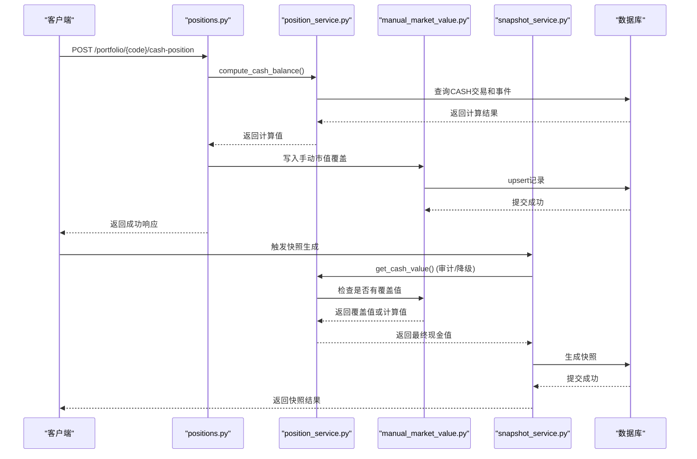
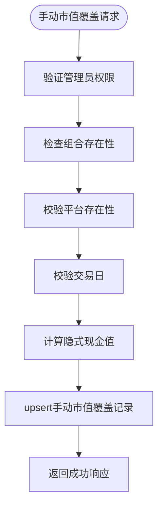
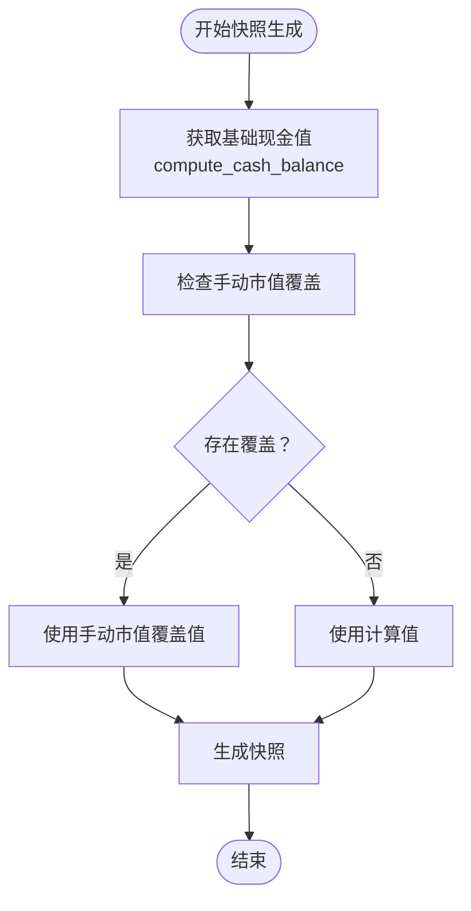
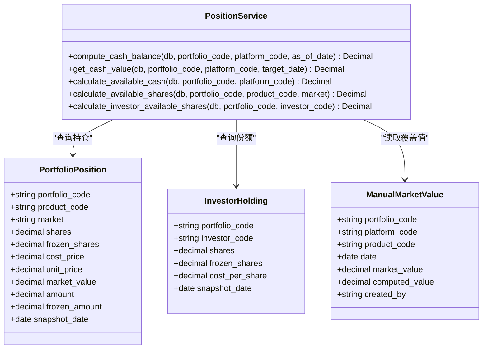
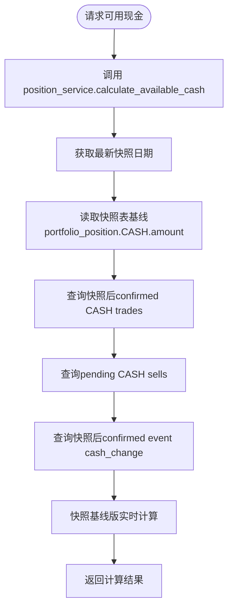
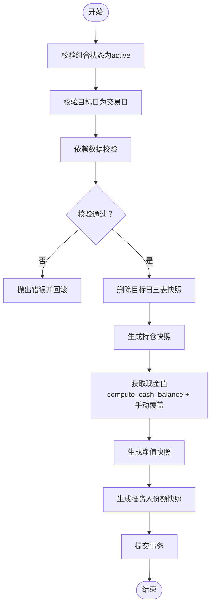
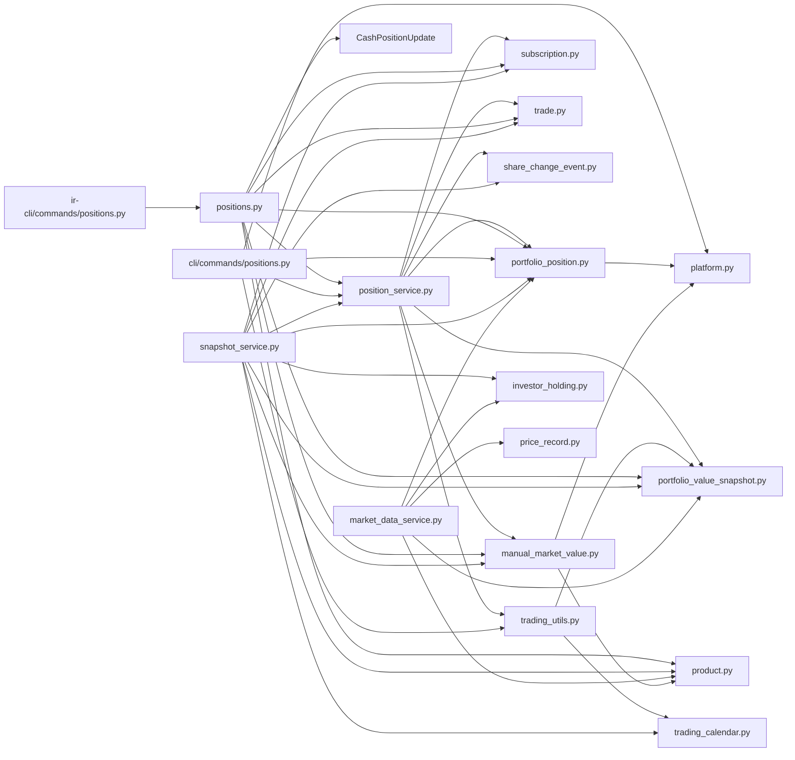

# 持仓管理

<cite>
**本文引用的文件**
- [backend/app/services/position_service.py](file://backend/app/services/position_service.py)
- [backend/app/routers/positions.py](file://backend/app/routers/positions.py)
- [backend/app/schemas/position.py](file://backend/app/schemas/position.py)
- [backend/app/models/portfolio_position.py](file://backend/app/models/portfolio_position.py)
- [backend/app/models/investor_holding.py](file://backend/app/models/investor_holding.py)
- [backend/app/models/portfolio_value_snapshot.py](file://backend/app/models/portfolio_value_snapshot.py)
- [backend/app/models/product.py](file://backend/app/models/product.py)
- [backend/app/models/trade.py](file://backend/app/models/trade.py)
- [backend/app/models/subscription.py](file://backend/app/models/subscription.py)
- [backend/app/models/portfolio.py](file://backend/app/models/portfolio.py)
- [backend/app/models/platform.py](file://backend/app/models/platform.py)
- [backend/app/models/price_record.py](file://backend/app/models/price_record.py)
- [backend/app/models/share_change_event.py](file://backend/app/models/share_change_event.py)
- [backend/app/models/trading_calendar.py](file://backend/app/models/trading_calendar.py)
- [backend/app/models/manual_market_value.py](file://backend/app/models/manual_market_value.py)
- [backend/app/services/market_data_service.py](file://backend/app/services/market_data_service.py)
- [backend/app/services/snapshot_service.py](file://backend/app/services/snapshot_service.py)
- [backend/app/services/trading_utils.py](file://backend/app/services/trading_utils.py)
- [backend/app/dependencies.py](file://backend/app/dependencies.py)
- [backend/cli/commands/positions.py](file://backend/cli/commands/positions.py)
- [ir-cli/ir_cli/commands/positions.py](file://ir-cli/ir_cli/commands/positions.py)
- [backend/tests/integration/test_positions.py](file://backend/tests/integration/test_positions.py)
- [backend/tests/unit/test_position_service.py](file://backend/tests/unit/test_position_service.py)
</cite>

## 更新摘要
**变更内容**
- **核心重构**：`calculate_available_cash` 函数基线逻辑重大重构，从使用 `get_cash_value()` 全量重算改为直接读取 `portfolio_position` 快照表作为基线，与快照生成口径保持一致
- **功能降级**：`get_cash_value` 函数用途缩减为仅用于审计和降级路径，不再被实时计算调用
- **性能优化**：新增增量快照基线的性能优化说明和fallback机制，显著提升实时现金计算效率
- **一致性保证**：确保实时可用现金计算与快照数据完全一致，解决历史手动覆盖继承丢失问题

## 目录
1. [简介](#简介)
2. [项目结构](#项目结构)
3. [核心组件](#核心组件)
4. [架构总览](#架构总览)
5. [详细组件分析](#详细组件分析)
6. [依赖分析](#依赖分析)
7. [性能考虑](#性能考虑)
8. [故障排查指南](#故障排查指南)
9. [结论](#结论)
10. [附录](#附录)

## 简介
本文件围绕"持仓管理"功能进行全面技术文档化，覆盖以下关键主题：
- 持仓的创建、调整、平仓与冻结管理机制
- 持仓与产品的关联关系、数量与金额管理、成本与当前价值计算
- 持仓状态控制（正常、冻结、平仓中）与交易限制规则
- 持仓查询、调整与历史记录的API接口说明
- **核心重构**：显式现金余额计算机制的重大升级，采用快照基线替代全量重算
- **手动市值覆盖集成**：在快照生成流程中集成手动市值覆盖功能，确保最终数据的准确性
- **重大改进**：统一的现金值获取逻辑，确保实时计算与快照数据的一致性
- 业务规则、计算公式与数据验证逻辑
- 实时价格更新对持仓价值的影响与批量操作处理机制
- 风险控制与异常处理策略

## 项目结构
围绕持仓管理的关键文件组织如下：
- **服务层**：**核心重构后** position_service.py 提供显式现金余额计算和实时可用资金/份额计算，trading_utils.py 提供共享工具函数
- 路由层：提供对外API，包括查询、创建、更新、删除、可用资金/份额计算、手动市值覆盖等
- CLI 命令层：CLI 工具支持新的显式计算功能和手动市值覆盖
- 模型层：定义组合持仓、投资人份额、净值快照、产品、交易、申赎、平台、交易日历、价格记录、份额变动事件、手动市值覆盖等数据结构
- 其他服务层：提供价格同步、组合净值同步、每日快照生成与重算、集成手动市值覆盖的快照生成等能力
- 校验与权限：基于依赖注入实现用户认证与管理员权限控制

```mermaid
graph TB
subgraph "服务层"
PS["position_service.py<br/>显式现金余额计算/实时可用资金/份额计算<br/>核心重构：快照基线算法"]
TU["trading_utils.py<br/>共享工具函数"]
S1["market_data_service.py<br/>价格同步/净值同步"]
S2["snapshot_service.py<br/>快照生成/重算/冻结计算/手动市值覆盖集成"]
end
subgraph "路由层"
R1["positions.py<br/>持仓API/手动市值覆盖"]
R2["subscriptions.py<br/>申赎API"]
R3["trades.py<br/>交易API"]
end
subgraph "CLI命令层"
C1["cli/commands/positions.py<br/>ir position 命令"]
C2["ir-cli/commands/positions.py<br/>ir-cli 持仓命令"]
C3["cli/commands/subscriptions.py<br/>ir sub 命令"]
C4["cli/commands/trades.py<br/>ir trade 命令"]
end
subgraph "模型层"
M1["portfolio_position.py<br/>组合持仓"]
M2["investor_holding.py<br/>投资人份额"]
M3["portfolio_value_snapshot.py<br/>组合净值快照"]
M4["product.py<br/>产品"]
M5["trade.py<br/>交易"]
M6["subscription.py<br/>申赎"]
M7["platform.py<br/>平台"]
M8["price_record.py<br/>价格记录"]
M9["share_change_event.py<br/>份额变动事件"]
M10["trading_calendar.py<br/>交易日历"]
M11["manual_market_value.py<br/>手动市值覆盖"]
end
PS --> TU
PS --> M1
PS --> M5
PS --> M6
PS --> M3
PS --> M9
R1 --> PS
R1 --> M11
R2 --> PS
R3 --> PS
C1 --> PS
C2 --> PS
C3 --> PS
C4 --> PS
R1 --> S1
R1 --> S2
S1 --> M8
S1 --> M4
S1 --> M1
S2 --> M1
S2 --> M2
S2 --> M3
S2 --> M5
S2 --> M6
S2 --> M9
S2 --> M10
S2 --> M11
```



**图表来源**
- [backend/app/services/position_service.py:1-332](file://backend/app/services/position_service.py#L1-L332)
- [backend/app/services/trading_utils.py:1-68](file://backend/app/services/trading_utils.py#L1-L68)
- [backend/cli/commands/positions.py:1-142](file://backend/cli/commands/positions.py#L1-L142)
- [ir-cli/ir_cli/commands/positions.py:1-70](file://ir-cli/ir_cli/commands/positions.py#L1-L70)
- [backend/app/routers/positions.py:1-322](file://backend/app/routers/positions.py#L1-L322)

**章节来源**
- [backend/app/services/position_service.py:1-332](file://backend/app/services/position_service.py#L1-L332)
- [backend/app/services/trading_utils.py:1-68](file://backend/app/services/trading_utils.py#L1-L68)
- [backend/cli/commands/positions.py:1-142](file://backend/cli/commands/positions.py#L1-L142)
- [ir-cli/ir_cli/commands/positions.py:1-70](file://ir-cli/ir_cli/commands/positions.py#L1-L70)

## 核心组件
- **核心重构** 显式现金余额计算服务（PositionService）
  - `compute_cash_balance`：显式计算指定日期的现金余额，基于confirmed CASH trades和events，作为降级基线使用
  - **功能降级** `get_cash_value`：获取指定日期的现金值（含 manual_market_value 绝对替换），现仅用于审计和降级路径
  - **重大重构** `calculate_available_cash`：组合可用现金实时计算，采用快照基线算法，与快照生成口径完全一致
  - `calculate_available_shares`：基金可用份额实时计算  
  - `calculate_investor_available_shares`：投资人可用份额实时计算
- **手动市值覆盖服务**
  - 支持通过 `manual_market_value` 表进行绝对替换
  - 与显式现金余额计算结合，确保数据准确性
- **共享交易工具函数**（TradingUtils）
  - `is_trading_day`：判断指定日期是否为交易日
  - `get_latest_snapshot_date`：获取组合最新快照日期
  - `get_next_trading_day`：获取下一个交易日
- 组合持仓（PortfolioPosition）
  - 字段要点：产品代码、市场、份额/金额、成本价、单位价、市值、冻结份额/金额、快照日期
  - 约束：产品与市场的联合外键；份额与金额互斥约束；唯一索引（组合+产品+市场+快照日期）
- 投资人份额（InvestorHolding）
  - 字段要点：投资人代码、组合代码、份额、冻结份额、成本价、快照日期
  - 约束：唯一索引（组合+投资人+快照日期）
- 组合净值快照（PortfolioValueSnapshot）
  - 字段要点：总值、总份额、单位净值、单位净值涨跌幅、快照日期
  - 约束：唯一索引（组合+快照日期）
- **手动市值覆盖**（ManualMarketValue）
  - 字段要点：组合代码、平台代码、产品代码、日期、市值、计算值、创建人
  - 约束：唯一索引（组合+平台+产品+日期），用于绝对替换现金持仓值
- 产品（Product）、交易（Trade）、申赎（Subscription）、平台（Platform）、交易日历（TradingCalendar）、价格记录（PriceRecord）、份额变动事件（ShareChangeEvent）

**章节来源**
- [backend/app/services/position_service.py:23-332](file://backend/app/services/position_service.py#L23-L332)
- [backend/app/models/manual_market_value.py:1-27](file://backend/app/models/manual_market_value.py#L1-L27)
- [backend/app/services/trading_utils.py:16-68](file://backend/app/services/trading_utils.py#L16-L68)
- [backend/app/models/portfolio_position.py:1-34](file://backend/app/models/portfolio_position.py#L1-L34)
- [backend/app/models/investor_holding.py:1-20](file://backend/app/models/investor_holding.py#L1-L20)
- [backend/app/models/portfolio_value_snapshot.py:1-20](file://backend/app/models/portfolio_value_snapshot.py#L1-L20)

## 架构总览
持仓管理采用"路由-服务-模型"的分层架构，**核心重构后引入快照基线算法和统一的手动市值覆盖机制**：
- **服务层**：封装核心业务逻辑，包括显式现金余额计算、实时可用资金/份额计算、共享工具函数
- 路由层负责API入口、参数解析与权限校验，调用服务层进行业务处理，集成手动市值覆盖处理
- CLI 命令层直接复用服务层函数，避免代码重复，支持新的现金位置管理功能
- 模型层定义数据结构与约束，确保数据一致性与完整性，包含手动市值覆盖模型
- **重大改进**：快照生成流程集成手动市值覆盖，确保最终数据的准确性



**图表来源**
- [backend/app/services/position_service.py:23-107](file://backend/app/services/position_service.py#L23-L107)
- [backend/app/routers/positions.py:226-322](file://backend/app/routers/positions.py#L226-L322)
- [backend/app/services/snapshot_service.py:27-45](file://backend/app/services/snapshot_service.py#L27-L45)
- [backend/app/models/manual_market_value.py:1-27](file://backend/app/models/manual_market_value.py#L1-L27)

## 详细组件分析

### 组件A：显式现金余额计算服务（核心重构）
**核心重构的服务层**，提供统一的显式现金余额计算逻辑：

#### 显式现金余额计算
```python
def compute_cash_balance(
    db: Session,
    portfolio_code: str,
    platform_code: Optional[str] = None,
    as_of_date: Optional[date] = None,
) -> Decimal:
    """
    显式计算 as_of_date 时的现金余额。
    
    源1：trade 表 confirmed CASH trades（confirm_date <= as_of_date）
    源2：event 表 confirmed events（ex_date <= as_of_date, cash_change != 0）
    
    不含 manual_market_value 覆盖。用于：
    - 无快照时 calculate_available_cash 的降级基线
    - cash-position 端点审计字段（computed_value）
    快照生成走 _generate_portfolio_position 增量累加路径，不调用此函数。
    有快照时 calculate_available_cash 直接读 portfolio_position 快照表，亦不调用此函数。
    """
```

#### **功能降级** 现金值获取函数（含手动覆盖）
```python
def get_cash_value(
    db: Session,
    portfolio_code: str,
    platform_code: Optional[str],
    target_date: Optional[date],
) -> Decimal:
    """
    获取指定日期的现金值（含 manual_market_value 绝对替换）。
    
    基础 = compute_cash_balance(target_date)
    若存在 manual_market_value 覆盖（date == target_date），则绝对替换。
    
    target_date 为 None 时：compute_cash_balance 降级为 today，
    且跳过 manual 覆盖查询（无快照日可匹配）。
    
    注意：calculate_available_cash 已改为直接读快照表基线（#52），
    本函数保留用于 cash-position 端点审计展示等辅助场景。
    """
```

#### **重大重构** 可用现金实时计算（快照基线算法）
```python
def calculate_available_cash(
    db: Session, portfolio_code: str, platform_code: Optional[str] = None
) -> Decimal:
    """
    组合可用现金实时计算（显式流水版）。
    
    基线 = 最新快照日 portfolio_position 快照表中 CASH amount
    （与 _generate_portfolio_position 增量范式口径一致，manual_market_value
    覆盖已 baked in 快照，自然继承；无快照时降级为 compute_cash_balance 全量流水）
    + 快照后 confirmed CASH trades（buy +, sell −）
    − 所有 pending CASH sells（已承诺未执行）
    + 快照后 confirmed event cash_change
    """
```

#### 可用份额实时计算
```python
def calculate_available_shares(
    db: Session, portfolio_code: str, product_code: str, market: Optional[str] = None
) -> Decimal:
    """
    基金可用份额实时计算：
    基金可用份额 = 最新快照份额
                - SUM(pending卖出份额)
                - SUM(confirmed卖出份额 WHERE 快照未生成)
    """
```

#### 投资人可用份额实时计算
```python
def calculate_investor_available_shares(
    db: Session, portfolio_code: str, investor_code: str
) -> Decimal:
    """
    投资人可用份额实时计算：
    投资人可用份额 = 最新快照份额
                  - SUM(pending赎回份额)
                  - SUM(confirmed赎回份额 WHERE 快照未生成)
    """
```

**章节来源**
- [backend/app/services/position_service.py:23-332](file://backend/app/services/position_service.py#L23-L332)

### 组件B：手动市值覆盖功能
**手动市值覆盖机制**，支持绝对替换现金持仓值：

#### 手动市值覆盖模型
- 字段要点：组合代码、平台代码、产品代码、日期、市值、计算值、创建人
- 约束：唯一索引（组合+平台+产品+日期），确保每个组合-平台-产品-日期组合的唯一性
- 用途：存储手动输入的现金市值，用于绝对替换系统计算的现金值

#### 手动市值覆盖API
- 权限控制：仅管理员可操作
- 平台验证：必须指定有效的平台代码
- 交易日校验：必须在交易日进行
- 审计追踪：同时记录手动值和计算值，便于审计和对比



**图表来源**
- [backend/app/routers/positions.py:226-322](file://backend/app/routers/positions.py#L226-L322)
- [backend/app/models/manual_market_value.py:1-27](file://backend/app/models/manual_market_value.py#L1-L27)

**章节来源**
- [backend/app/models/manual_market_value.py:1-27](file://backend/app/models/manual_market_value.py#L1-L27)
- [backend/app/routers/positions.py:226-322](file://backend/app/routers/positions.py#L226-L322)
- [backend/app/schemas/position.py:45-50](file://backend/app/schemas/position.py#L45-L50)

### 组件C：快照生成集成手动市值覆盖
**快照生成逻辑**，集成手动市值覆盖功能：

#### 现金值获取逻辑
```python
def get_cash_value(
    db: Session, portfolio_code: str, platform_code: Optional[str], target_date: date
) -> Decimal:
    """
    获取快照生成用的现金值。
    基础 = compute_cash_balance(target_date)
    若存在 manual_market_value 覆盖，则绝对替换。
    """
```

#### 快照生成流程
- 基础值：使用 `compute_cash_balance` 计算显式现金余额
- 覆盖检查：检查是否存在对应的手动市值覆盖记录
- 绝对替换：如果存在覆盖记录，使用手动值替换计算值
- 快照生成：使用最终现金值生成组合净值快照



**图表来源**
- [backend/app/services/snapshot_service.py:27-45](file://backend/app/services/snapshot_service.py#L27-L45)

**章节来源**
- [backend/app/services/snapshot_service.py:27-45](file://backend/app/services/snapshot_service.py#L27-L45)

### 组件D：共享交易工具函数
**工具函数模块**，提供跨模块共享的基础功能：

#### 核心工具函数
- `is_trading_day(db, target_date)`：判断指定日期是否为交易日
- `get_latest_snapshot_date(db, portfolio_code)`：获取组合最新快照日期
- `get_next_trading_day(db, from_date, days)`：获取下一个交易日
- `get_prev_trading_day(db, from_date, days)`：获取前N个交易日

**章节来源**
- [backend/app/services/trading_utils.py:16-68](file://backend/app/services/trading_utils.py#L16-L68)

### 组件E：CLI 命令集成
**CLI命令支持**，直接使用服务层函数：

#### ir position available-cash
查看组合可用现金（实时计算），调用 `calculate_available_cash` 服务函数

#### ir position available-shares  
查看产品可用份额（实时计算），调用 `calculate_available_shares` 服务函数

#### ir position update-cash
更新现金持仓，包含平台验证、交易日校验和数据库操作，使用新的手动市值覆盖机制

#### ir-cli 版本
- `ir-cli position available-cash PORTFOLIO_CODE`：通过API获取可用现金
- `ir-cli position available-shares PORTFOLIO_CODE PRODUCT_CODE [--market]`：通过API获取可用份额
- `ir-cli position update-cash PORTFOLIO_CODE --platform-code --amount [--update-date]`：通过API更新现金持仓

**章节来源**
- [backend/cli/commands/positions.py:57-142](file://backend/cli/commands/positions.py#L57-142)
- [ir-cli/ir_cli/commands/positions.py:28-70](file://ir-cli/ir_cli/commands/positions.py#L28-L70)

### 组件F：组合持仓（PortfolioPosition）与投资人份额（InvestorHolding）
- 数据模型关系
  - 组合持仓与产品通过联合主外键关联，确保产品与市场的合法性
  - 投资人份额与组合、投资人关联，用于投资人层面的份额与成本追踪
- 数量与金额管理
  - 份额与金额互斥：同一记录要么持有份额（净值型），要么持有金额（非净值型如现金）
  - 非净值型资产（如CASH）通过amount字段记录金额，shares为NULL
- 成本与当前价值
  - 成本价（cost_price）按加权平均法维护
  - 当前价值（market_value）= 份额 × 单位净值（由价格记录提供）
- 冻结管理
  - 冻结份额（frozen_shares）来源于"待确认卖出"交易
  - 冻结金额（frozen_amount）在当前实现中未启用，保持为0



**图表来源**
- [backend/app/services/position_service.py:23-332](file://backend/app/services/position_service.py#L23-L332)
- [backend/app/models/portfolio_position.py:1-34](file://backend/app/models/portfolio_position.py#L1-L34)
- [backend/app/models/investor_holding.py:1-20](file://backend/app/models/investor_holding.py#L1-L20)
- [backend/app/models/manual_market_value.py:1-27](file://backend/app/models/manual_market_value.py#L1-L27)

**章节来源**
- [backend/app/models/portfolio_position.py:1-34](file://backend/app/models/portfolio_position.py#L1-L34)
- [backend/app/models/investor_holding.py:1-20](file://backend/app/models/investor_holding.py#L1-L20)

### 组件G：API接口与业务流程
- 查询组合持仓
  - 支持按组合代码、快照日期过滤；默认返回每个组合每个产品的最新快照
- 创建/更新/删除组合持仓
  - 仅管理员可操作；更新时支持部分字段更新
- **重大重构**：计算可用现金
  - 现在通过 position_service.calculate_available_cash 提供快照基线版实时计算
  - **核心改进**：使用新的快照基线算法，确保与快照数据库条目的一致性
  - 基于最新快照日显式现金、快照后confirmed CASH trades、pending CASH sells、快照后confirmed event cash_change综合计算
- **增强**：计算可用份额
  - 现在通过 position_service.calculate_available_shares 提供实时计算
  - 基于最新快照份额，扣除待确认卖出与未生成快照的已确认卖出
- **手动市值覆盖**
  - 仅管理员可操作；必须为交易日、必须指定平台代码；写入 manual_market_value 表
  - 支持upsert操作，自动处理平台验证和日期校验
  - 同时记录手动值和计算值，便于审计对比



**图表来源**
- [backend/app/services/position_service.py:110-201](file://backend/app/services/position_service.py#L110-L201)
- [backend/app/routers/positions.py:182-224](file://backend/app/routers/positions.py#L182-L224)

**章节来源**
- [backend/app/routers/positions.py:182-322](file://backend/app/routers/positions.py#L182-L322)
- [backend/app/services/position_service.py:23-332](file://backend/app/services/position_service.py#L23-L332)

### 组件H：实时价格更新与净值同步
- 价格同步
  - 支持从第三方数据源同步日行情或净值，自动去重并更新历史记录
  - 对于不同市场（场内/场外），使用不同的字段映射与校验
- 组合净值同步
  - 基于持仓与最新价格重新计算组合总值、总份额与单位净值
  - 写入或更新净值快照


**图表来源**
- [backend/app/services/market_data_service.py:88-226](file://backend/app/services/market_data_service.py#L88-L226)

**章节来源**
- [backend/app/services/market_data_service.py:1-323](file://backend/app/services/market_data_service.py#L1-L323)

### 组件I：每日快照生成与重算
- 快照生成顺序
  - 先生成组合持仓快照，再生成组合净值快照，最后生成投资人份额快照
- 依赖校验
  - 交易日校验、待确认交易/申赎校验、价格数据完整性校验、份额变动事件状态校验
- 冻结份额计算
  - 持仓冻结份额：待确认卖出交易累计
  - 投资人冻结份额：待确认赎回交易累计
  - 组合冻结份额：待确认赎回交易累计
- **现金值获取逻辑**
  - 基础值：使用 `compute_cash_balance` 计算显式现金余额
  - 覆盖检查：检查是否存在对应的手动市值覆盖记录
  - 绝对替换：如果存在覆盖记录，使用手动值替换计算值



**图表来源**
- [backend/app/services/snapshot_service.py:48-139](file://backend/app/services/snapshot_service.py#L48-L139)
- [backend/app/services/snapshot_service.py:27-45](file://backend/app/services/snapshot_service.py#L27-L45)

**章节来源**
- [backend/app/services/snapshot_service.py:1-789](file://backend/app/services/snapshot_service.py#L1-L789)

### 组件J：交易限制与状态控制
- 状态控制
  - 组合状态：草稿、激活、关闭；关闭后禁止新的申赎与调仓
  - 交易状态：pending、confirmed；快照生成前必须无待确认交易
- 冻结规则
  - 待确认卖出导致持仓冻结份额增加
  - 待确认赎回导致投资人与组合冻结份额增加
- **手动市值覆盖限制**
  - 仅管理员可操作
  - 必须为交易日
  - 必须指定平台代码
  - 自动处理manual_market_value表的upsert操作

**章节来源**
- [backend/app/models/portfolio.py:1-16](file://backend/app/models/portfolio.py#L1-L16)
- [backend/app/models/trade.py:1-32](file://backend/app/models/trade.py#L1-L32)
- [backend/app/models/subscription.py:1-21](file://backend/app/models/subscription.py#L1-L21)
- [backend/app/routers/positions.py:226-322](file://backend/app/routers/positions.py#L226-L322)
- [backend/app/services/snapshot_service.py:717-774](file://backend/app/services/snapshot_service.py#L717-L774)

## 依赖分析
- **核心重构** 服务层依赖
  - position_service.py 依赖 PortfolioPosition、Subscription、Trade、PortfolioValueSnapshot、ShareChangeEvent 等模型
  - position_service.py 依赖 trading_utils.get_latest_snapshot_date 工具函数
  - position_service.py 依赖 ManualMarketValue 模型
  - trading_utils.py 依赖 PortfolioValueSnapshot、TradingCalendar 等模型
- 路由依赖
  - positions.py 依赖 PortfolioPosition、PortfolioValueSnapshot、Subscription、Trade、Product 等模型
  - CashPositionUpdate 请求模型，支持手动市值覆盖
  - ManualMarketValue 模型依赖
  - 使用依赖注入实现用户认证与管理员权限校验
- CLI 依赖
  - cli/commands/positions.py 直接 import position_service 函数
  - ir-cli/commands/positions.py 通过API调用后端服务
  - 使用 cli_context 管理数据库会话
- 数据模型依赖
  - PortfolioPosition 与 Product 通过联合外键关联
  - Trade/Subscription 与 Product 通过联合外键关联
  - ShareChangeEvent 与 Product 通过联合外键关联
  - PortfolioPosition 与 Platform 通过外键关联
  - ManualMarketValue 与 Portfolio、Platform 通过外键关联



**图表来源**
- [backend/app/services/position_service.py:1-21](file://backend/app/services/position_service.py#L1-L21)
- [backend/app/services/trading_utils.py:1-14](file://backend/app/services/trading_utils.py#L1-L14)
- [backend/cli/commands/positions.py:1-13](file://backend/cli/commands/positions.py#L1-L13)
- [ir-cli/ir_cli/commands/positions.py:1-5](file://ir-cli/ir_cli/commands/positions.py#L1-L5)

**章节来源**
- [backend/app/services/position_service.py:1-21](file://backend/app/services/position_service.py#L1-L21)
- [backend/app/services/trading_utils.py:1-14](file://backend/app/services/trading_utils.py#L1-L14)
- [backend/cli/commands/positions.py:1-13](file://backend/cli/commands/positions.py#L1-L13)
- [ir-cli/ir_cli/commands/positions.py:1-5](file://ir-cli/ir_cli/commands/positions.py#L1-L5)

## 性能考虑
- **核心重构** 服务层优化
  - 显式现金余额计算使用单次数据库查询获取confirmed CASH trades和events
  - **功能降级** `get_cash_value` 函数在target_date为None时跳过手动覆盖查询，提高性能
  - 实时计算函数使用单次数据库查询获取最新快照日期
  - **重大改进**：`calculate_available_cash` 直接从快照表读取基线，O(1)复杂度，避免全量流水重算
  - 聚合查询减少数据库往返次数
  - 条件判断避免不必要的计算
- 查询优化
  - 按组合+产品+快照日期建立唯一索引，避免重复快照
  - 分页查询与子查询配合，减少全表扫描
- 写入优化
  - 价格同步采用批量写入与去重，降低重复写入开销
  - 快照生成按顺序执行，减少并发冲突
  - 手动市值覆盖采用upsert操作，减少查询次数
- 计算优化
  - **核心重构**：`calculate_available_cash` 使用快照基线算法，避免全量流水重算
  - 可用现金/份额计算聚合查询，减少数据库往返
  - 冻结份额计算使用SUM聚合，复杂度O(n)
  - 手动市值覆盖支持批量操作，提高效率

## 故障排查指南
- **核心重构** 服务层问题排查
  - 检查 position_service 函数是否正确导入依赖
  - 验证 `compute_cash_balance` 函数是否正常工作
  - **功能降级**：验证 `get_cash_value` 函数是否正确处理手动覆盖
  - 确认 trading_utils 工具函数是否正常运行
  - 确认数据库连接和会话管理是否正常
- 快照生成失败
  - 检查交易日历与组合状态
  - 检查是否存在待确认交易/申赎
  - 检查价格数据完整性（普通基金当日净值、QDII T-1净值）
  - 检查手动市值覆盖记录是否存在冲突
- 价格同步失败
  - 检查数据源状态与错误信息
  - 检查市场类型与字段映射
- 权限问题
  - 确认调用者具备管理员权限
  - 确认Token有效且未被拉黑
- CLI 命令问题排查
  - 检查 CLI 是否正确引用 position_service 函数
  - 验证命令行参数格式是否正确
  - 确认数据库连接配置正确
  - 检查手动市值覆盖API调用是否正常
- **手动市值覆盖问题排查**
  - 检查组合是否存在
  - 检查平台代码是否有效
  - 检查更新日期是否为交易日
  - 检查数据库约束是否满足
  - 检查手动值与计算值的差异是否在预期范围内
- **核心重构** 可用现金计算问题排查
  - 检查 `calculate_available_cash` 是否使用新的快照基线算法
  - 验证快照表中的CASH持仓数据是否正确
  - 确认快照后交易和事件的计算逻辑正确
  - 检查fallback机制是否正常工作（无快照时使用全量流水）

**章节来源**
- [backend/app/services/position_service.py:23-332](file://backend/app/services/position_service.py#L23-L332)
- [backend/app/services/trading_utils.py:16-68](file://backend/app/services/trading_utils.py#L16-L68)
- [backend/cli/commands/positions.py:57-142](file://backend/cli/commands/positions.py#L57-142)
- [ir-cli/ir_cli/commands/positions.py:28-70](file://ir-cli/ir_cli/commands/positions.py#L28-L70)
- [backend/app/services/snapshot_service.py:187-218](file://backend/app/services/snapshot_service.py#L187-L218)
- [backend/app/services/market_data_service.py:128-139](file://backend/app/services/market_data_service.py#L128-L139)
- [backend/app/dependencies.py:114-129](file://backend/app/dependencies.py#L114-L129)
- [backend/app/routers/positions.py:226-322](file://backend/app/routers/positions.py#L226-L322)

## 结论
持仓管理通过清晰的数据模型、严格的业务规则与完善的服务层能力，实现了对组合持仓的全生命周期管理。**核心重构后的 position_service.py 服务层**引入了快照基线算法，提供了更加高效和准确的现金管理功能。

依托每日快照与价格同步机制，系统能够准确反映当前价值与可用资源，并通过冻结规则与交易限制保障风控合规。**核心重构的服务层设计**使得 API 和 CLI 都能复用相同的快照基线计算逻辑，提高了代码的可维护性和一致性。

**手动市值覆盖功能**进一步完善了系统的资产管理能力，特别是针对现金类资产的精细化管理。通过平台验证、交易日校验和数据库约束处理，确保了数据的准确性和一致性。**快照生成逻辑**集成了手动市值覆盖，确保最终数据的准确性。

**核心重构解决了关键的性能和一致性问题**：`calculate_available_cash` 现在使用快照基线算法，避免了全量流水重算的性能开销，同时确保与快照数据完全一致，解决了历史手动覆盖继承丢失的问题。

## 附录

### API接口清单（摘要）
- 查询组合持仓
  - 方法：GET
  - 路径：/positions
  - 参数：portfolio_code、snapshot_date、page、page_size
- 获取单条组合持仓
  - 方法：GET
  - 路径：/positions/{id}
- 创建组合持仓
  - 方法：POST
  - 路径：/positions
  - 权限：管理员
- 更新组合持仓
  - 方法：PUT
  - 路径：/positions/{id}
  - 权限：管理员
- 删除组合持仓
  - 方法：DELETE
  - 路径：/positions/{id}
  - 权限：管理员
- **重大重构**：计算可用现金
  - 方法：GET
  - 路径：/positions/portfolio/{portfolio_code}/available-cash
  - **核心改进**：现在使用 position_service.calculate_available_cash 提供快照基线版实时计算，确保与快照数据一致性
- **增强**：计算可用份额
  - 方法：GET
  - 路径：/positions/portfolio/{portfolio_code}/product/{product_code}/available-shares
  - 参数：market（可选）
  - **增强**：现在使用 position_service.calculate_available_shares 提供实时计算
- **手动市值覆盖**
  - 方法：POST
  - 路径：/positions/portfolio/{portfolio_code}/cash-position
  - 权限：管理员
  - 参数：amount、platform_code、update_date（可选）
  - **手动市值覆盖**：写入 manual_market_value 表，支持绝对替换现金持仓值

### CLI命令清单（更新）
- ir position list --portfolio-code [--snapshot-date] [--page] [--page-size]
  - 查看持仓（默认最新快照）
- **重大重构**：ir position available-cash PORTFOLIO_CODE
  - 查看组合可用现金（快照基线版实时计算，使用新的快照基线算法）
- **增强**：ir position available-shares PORTFOLIO_CODE PRODUCT_CODE [--market]
  - 查看产品可用份额（实时计算）
- **手动市值覆盖**：ir position update-cash PORTFOLIO_CODE --platform-code --amount [--update-date]
  - 更新现金持仓（使用新的手动市值覆盖机制）

### ir-cli 命令清单（新增）
- ir-cli position list --portfolio-code [--snapshot-date] [--page] [--page-size]
  - 通过API查看持仓列表
- **新增**：ir-cli position available-cash PORTFOLIO_CODE
  - 通过API获取组合可用现金
- **新增**：ir-cli position available-shares PORTFOLIO_CODE PRODUCT_CODE [--market]
  - 通过API获取产品可用份额
- **新增**：ir-cli position update-cash PORTFOLIO_CODE --platform-code --amount [--update-date]
  - 通过API更新现金持仓

### 手动市值覆盖请求示例
```json
{
  "amount": 100000.0,
  "platform_code": "ZGYH",
  "update_date": "2024-12-17"
}
```

### 手动市值覆盖响应示例
```json
{
  "success": true,
  "message": "现金市值覆盖已写入 manual_market_value，建议重新生成快照以更新持仓",
  "portfolio_code": "AC_S",
  "platform_code": "ZGYH",
  "amount": 100000.0,
  "computed_value": 95000.0,
  "update_date": "2024-12-17",
  "requires_snapshot_regen": true
}
```

### 错误响应示例
```json
{
  "error": "PLATFORM_NOT_FOUND",
  "message": "平台 ZGYH 不存在"
}
```

### 单元测试覆盖场景
- **功能降级**：get_cash_value 函数测试
  - 无手动覆盖时返回计算值
  - 存在手动覆盖时绝对替换计算值
  - 覆盖日期不匹配时忽略覆盖
  - target_date为None时跳过覆盖查询
- **核心重构**：calculate_available_cash 函数测试
  - 基线直接读取快照表CASH amount（重大重构验证）
  - 快照基线包含手动覆盖值（baked in）
  - 快照基线加上照后confirmed交易
  - 快照基线减去pending卖出预留
  - 无快照时降级为全量流水计算
  - 覆盖日期不匹配时不影响可用现金

**章节来源**
- [backend/app/routers/positions.py:182-322](file://backend/app/routers/positions.py#L182-L322)
- [backend/app/schemas/position.py:1-50](file://backend/app/schemas/position.py#L1-L50)
- [backend/cli/commands/positions.py:57-142](file://backend/cli/commands/positions.py#L57-142)
- [ir-cli/ir_cli/commands/positions.py:28-70](file://ir-cli/ir_cli/commands/positions.py#L28-L70)
- [backend/tests/integration/test_positions.py:33-99](file://backend/tests/integration/test_positions.py#L33-99)
- [backend/tests/unit/test_position_service.py:1-336](file://backend/tests/unit/test_position_service.py#L1-336)