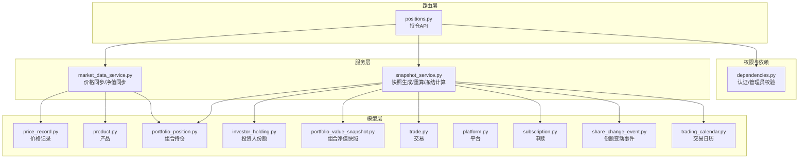
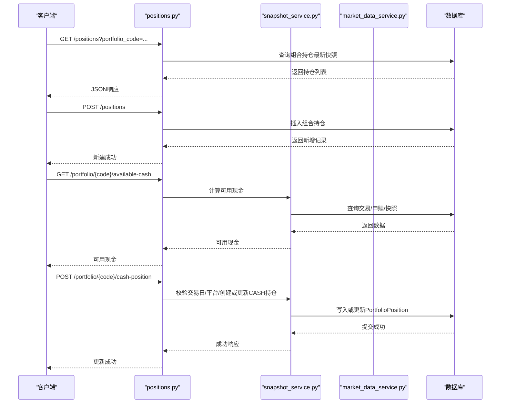
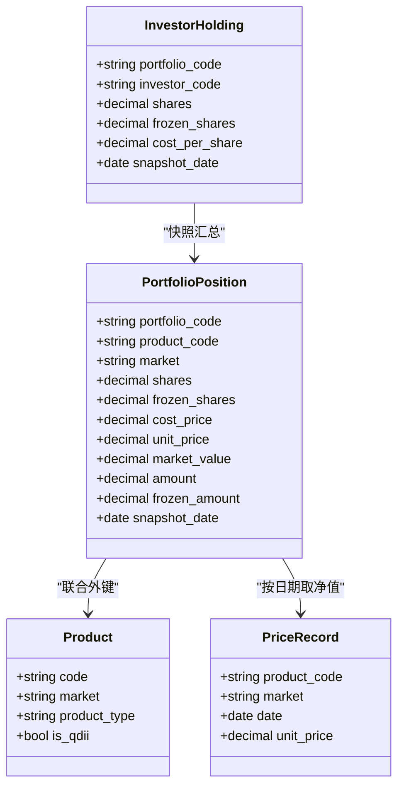
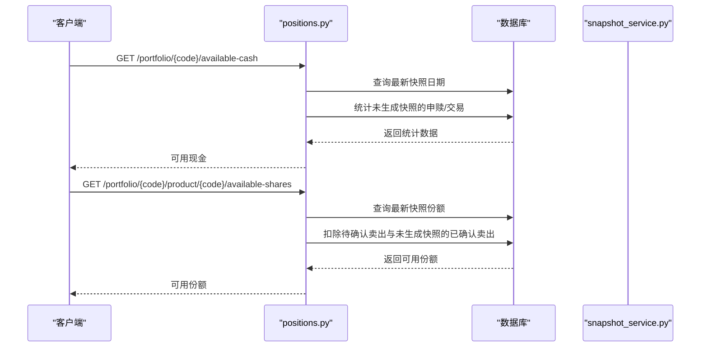
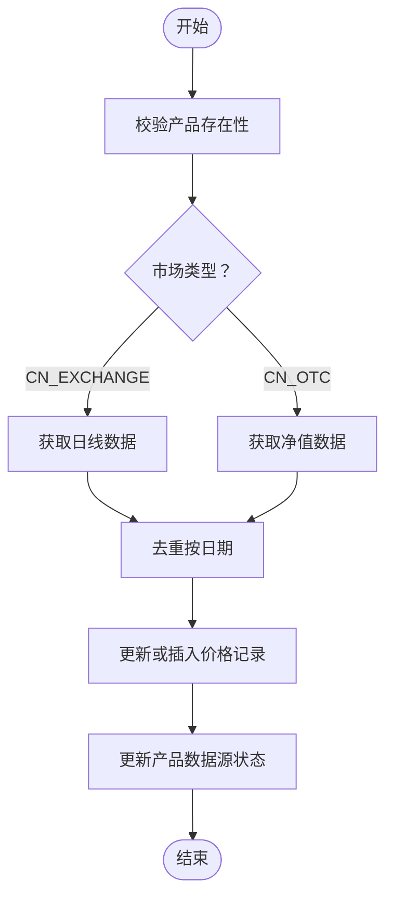
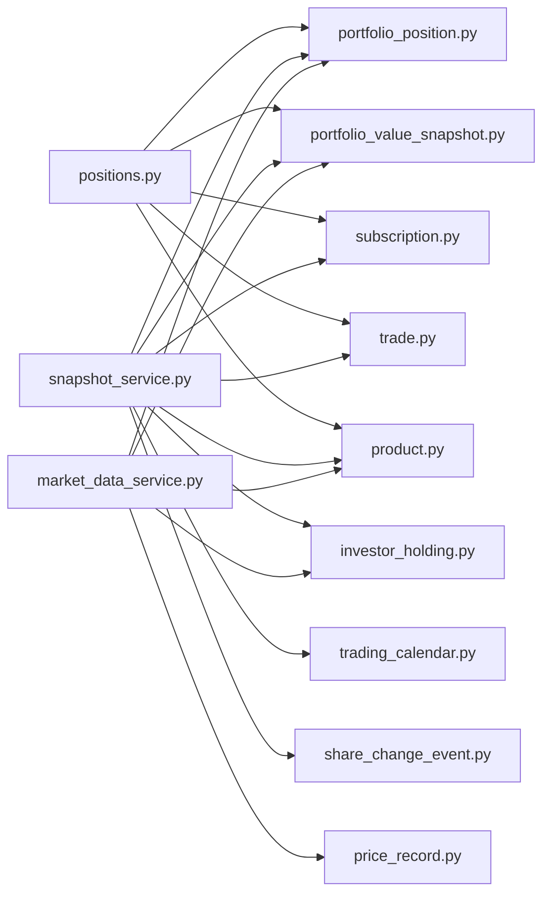

# 持仓管理

<cite>
**本文引用的文件**
- [backend/app/routers/positions.py](file://backend/app/routers/positions.py)
- [backend/app/schemas/position.py](file://backend/app/schemas/position.py)
- [backend/app/models/portfolio_position.py](file://backend/app/models/portfolio_position.py)
- [backend/app/models/investor_holding.py](file://backend/app/models/investor_holding.py)
- [backend/app/models/portfolio_value_snapshot.py](file://backend/app/models/portfolio_value_snapshot.py)
- [backend/app/models/product.py](file://backend/app/models/product.py)
- [backend/app/models/trade.py](file://backend/app/models/trade.py)
- [backend/app/models/subscription.py](file://backend/app/models/subscription.py)
- [backend/app/models/portfolio.py](file://backend/app/models/portfolio.py)
- [backend/app/models/platform.py](file://backend/app/models/platform.py)
- [backend/app/models/price_record.py](file://backend/app/models/price_record.py)
- [backend/app/models/share_change_event.py](file://backend/app/models/share_change_event.py)
- [backend/app/models/trading_calendar.py](file://backend/app/models/trading_calendar.py)
- [backend/app/services/market_data_service.py](file://backend/app/services/market_data_service.py)
- [backend/app/services/snapshot_service.py](file://backend/app/services/snapshot_service.py)
- [backend/app/dependencies.py](file://backend/app/dependencies.py)
</cite>

## 目录
1. [简介](#简介)
2. [项目结构](#项目结构)
3. [核心组件](#核心组件)
4. [架构总览](#架构总览)
5. [详细组件分析](#详细组件分析)
6. [依赖分析](#依赖分析)
7. [性能考虑](#性能考虑)
8. [故障排查指南](#故障排查指南)
9. [结论](#结论)
10. [附录](#附录)

## 简介
本文件围绕“持仓管理”功能进行全面技术文档化，覆盖以下关键主题：
- 持仓的创建、调整、平仓与冻结管理机制
- 持仓与产品的关联关系、数量与金额管理、成本与当前价值计算
- 持仓状态控制（正常、冻结、平仓中）与交易限制规则
- 持仓查询、调整与历史记录的API接口说明
- 业务规则、计算公式与数据验证逻辑
- 实时价格更新对持仓价值的影响与批量操作处理机制
- 风险控制与异常处理策略

## 项目结构
围绕持仓管理的关键文件组织如下：
- 路由层：提供对外API，包括查询、创建、更新、删除、可用资金/份额计算、非净值资产（现金）更新等
- 模型层：定义组合持仓、投资人份额、净值快照、产品、交易、申赎、平台、交易日历、价格记录、份额变动事件等数据结构
- 服务层：提供价格同步、组合净值同步、每日快照生成与重算、冻结份额计算等能力
- 校验与权限：基于依赖注入实现用户认证与管理员权限控制

图表来源
- [backend/app/routers/positions.py:1-410](file://backend/app/routers/positions.py#L1-L410)
- [backend/app/services/market_data_service.py:1-323](file://backend/app/services/market_data_service.py#L1-L323)
- [backend/app/services/snapshot_service.py:1-789](file://backend/app/services/snapshot_service.py#L1-L789)
- [backend/app/models/portfolio_position.py:1-34](file://backend/app/models/portfolio_position.py#L1-L34)
- [backend/app/models/investor_holding.py:1-20](file://backend/app/models/investor_holding.py#L1-L20)
- [backend/app/models/portfolio_value_snapshot.py:1-20](file://backend/app/models/portfolio_value_snapshot.py#L1-L20)
- [backend/app/models/product.py:1-22](file://backend/app/models/product.py#L1-L22)
- [backend/app/models/trade.py:1-32](file://backend/app/models/trade.py#L1-L32)
- [backend/app/models/subscription.py:1-21](file://backend/app/models/subscription.py#L1-L21)
- [backend/app/models/platform.py:1-12](file://backend/app/models/platform.py#L1-L12)
- [backend/app/models/price_record.py:1-28](file://backend/app/models/price_record.py#L1-L28)
- [backend/app/models/share_change_event.py:1-37](file://backend/app/models/share_change_event.py#L1-L37)
- [backend/app/models/trading_calendar.py:1-13](file://backend/app/models/trading_calendar.py#L1-L13)
- [backend/app/dependencies.py:1-146](file://backend/app/dependencies.py#L1-L146)

章节来源
- [backend/app/routers/positions.py:1-410](file://backend/app/routers/positions.py#L1-L410)
- [backend/app/services/market_data_service.py:1-323](file://backend/app/services/market_data_service.py#L1-L323)
- [backend/app/services/snapshot_service.py:1-789](file://backend/app/services/snapshot_service.py#L1-L789)

## 核心组件
- 组合持仓（PortfolioPosition）
  - 字段要点：产品代码、市场、份额/金额、成本价、单位价、市值、冻结份额/金额、快照日期
  - 约束：产品与市场的联合外键；份额与金额互斥约束；唯一索引（组合+产品+市场+快照日期）
- 投资人份额（InvestorHolding）
  - 字段要点：投资人代码、组合代码、份额、冻结份额、成本价、快照日期
  - 约束：唯一索引（组合+投资人+快照日期）
- 组合净值快照（PortfolioValueSnapshot）
  - 字段要点：总值、总份额、单位净值、单位净值涨跌幅、快照日期
  - 约束：唯一索引（组合+快照日期）
- 产品（Product）
  - 字段要点：产品类型、资产类别、确认天数、是否QDII、数据源状态等
- 交易（Trade）、申赎（Subscription）
  - 字段要点：交易类型（买/卖）、金额、份额、成交价、确认日期、状态（pending/confirmed）
- 平台（Platform）、交易日历（TradingCalendar）、价格记录（PriceRecord）、份额变动事件（ShareChangeEvent）

章节来源
- [backend/app/models/portfolio_position.py:1-34](file://backend/app/models/portfolio_position.py#L1-L34)
- [backend/app/models/investor_holding.py:1-20](file://backend/app/models/investor_holding.py#L1-L20)
- [backend/app/models/portfolio_value_snapshot.py:1-20](file://backend/app/models/portfolio_value_snapshot.py#L1-L20)
- [backend/app/models/product.py:1-22](file://backend/app/models/product.py#L1-L22)
- [backend/app/models/trade.py:1-32](file://backend/app/models/trade.py#L1-L32)
- [backend/app/models/subscription.py:1-21](file://backend/app/models/subscription.py#L1-L21)
- [backend/app/models/platform.py:1-12](file://backend/app/models/platform.py#L1-L12)
- [backend/app/models/price_record.py:1-28](file://backend/app/models/price_record.py#L1-L28)
- [backend/app/models/share_change_event.py:1-37](file://backend/app/models/share_change_event.py#L1-L37)
- [backend/app/models/trading_calendar.py:1-13](file://backend/app/models/trading_calendar.py#L1-L13)

## 架构总览
持仓管理采用“路由-服务-模型”的分层架构：
- 路由层负责API入口、参数解析与权限校验
- 服务层封装业务逻辑：价格同步、净值同步、每日快照生成与重算、冻结份额计算
- 模型层定义数据结构与约束，确保数据一致性与完整性

图表来源
- [backend/app/routers/positions.py:180-410](file://backend/app/routers/positions.py#L180-L410)
- [backend/app/services/snapshot_service.py:24-94](file://backend/app/services/snapshot_service.py#L24-L94)
- [backend/app/services/market_data_service.py:228-320](file://backend/app/services/market_data_service.py#L228-L320)

## 详细组件分析

### 组件A：组合持仓（PortfolioPosition）与投资人份额（InvestorHolding）
- 数据模型关系
  - 组合持仓与产品通过联合主外键关联，确保产品与市场的合法性
  - 投资人份额与组合、投资人关联，用于投资人层面的份额与成本追踪
- 数量与金额管理
  - 份额与金额互斥：同一记录要么持有份额（净值型），要么持有金额（非净值型如现金）
  - 非净值型资产（如CASH）通过amount字段记录金额，shares为NULL
- 成本与当前价值
  - 成本价（cost_price）按加权平均法维护
  - 当前价值（market_value）= 份额 × 单位净值（由价格记录提供）
- 冻结管理
  - 冻结份额（frozen_shares）来源于“待确认卖出”交易
  - 冻结金额（frozen_amount）在当前实现中未启用，保持为0

图表来源
- [backend/app/models/portfolio_position.py:1-34](file://backend/app/models/portfolio_position.py#L1-L34)
- [backend/app/models/investor_holding.py:1-20](file://backend/app/models/investor_holding.py#L1-L20)
- [backend/app/models/product.py:1-22](file://backend/app/models/product.py#L1-L22)
- [backend/app/models/price_record.py:1-28](file://backend/app/models/price_record.py#L1-L28)

章节来源
- [backend/app/models/portfolio_position.py:1-34](file://backend/app/models/portfolio_position.py#L1-L34)
- [backend/app/models/investor_holding.py:1-20](file://backend/app/models/investor_holding.py#L1-L20)
- [backend/app/models/product.py:1-22](file://backend/app/models/product.py#L1-L22)
- [backend/app/models/price_record.py:1-28](file://backend/app/models/price_record.py#L1-L28)

### 组件B：API接口与业务流程
- 查询组合持仓
  - 支持按组合代码、快照日期过滤；默认返回每个组合每个产品的最新快照
- 创建/更新/删除组合持仓
  - 仅管理员可操作；更新时支持部分字段更新
- 计算可用现金
  - 基于最新净值快照现金、未生成快照的申赎与交易、待确认买入等综合计算
- 计算可用份额
  - 基于最新快照份额，扣除待确认卖出与未生成快照的已确认卖出
- 非净值资产（现金）更新
  - 仅管理员可操作；必须为交易日、必须指定平台代码；更新CASH产品金额

图表来源
- [backend/app/routers/positions.py:28-178](file://backend/app/routers/positions.py#L28-L178)

章节来源
- [backend/app/routers/positions.py:180-410](file://backend/app/routers/positions.py#L180-L410)

### 组件C：实时价格更新与净值同步
- 价格同步
  - 支持从第三方数据源同步日行情或净值，自动去重并更新历史记录
  - 对于不同市场（场内/场外），使用不同的字段映射与校验
- 组合净值同步
  - 基于持仓与最新价格重新计算组合总值、总份额与单位净值
  - 写入或更新净值快照

图表来源
- [backend/app/services/market_data_service.py:88-226](file://backend/app/services/market_data_service.py#L88-L226)

章节来源
- [backend/app/services/market_data_service.py:1-323](file://backend/app/services/market_data_service.py#L1-L323)

### 组件D：每日快照生成与重算
- 快照生成顺序
  - 先生成组合持仓快照，再生成组合净值快照，最后生成投资人份额快照
- 依赖校验
  - 交易日校验、待确认交易/申赎校验、价格数据完整性校验、份额变动事件状态校验
- 冻结份额计算
  - 持仓冻结份额：待确认卖出交易累计
  - 投资人冻结份额：待确认赎回交易累计
  - 组合冻结份额：待确认赎回交易累计

图表来源
- [backend/app/services/snapshot_service.py:24-94](file://backend/app/services/snapshot_service.py#L24-L94)

章节来源
- [backend/app/services/snapshot_service.py:1-789](file://backend/app/services/snapshot_service.py#L1-L789)

### 组件E：交易限制与状态控制
- 状态控制
  - 组合状态：草稿、激活、关闭；关闭后禁止新的申赎与调仓
  - 交易状态：pending、confirmed；快照生成前必须无待确认交易
- 冻结规则
  - 待确认卖出导致持仓冻结份额增加
  - 待确认赎回导致投资人与组合冻结份额增加
- 非净值资产（现金）更新限制
  - 仅管理员可操作
  - 必须为交易日
  - 必须指定平台代码

章节来源
- [backend/app/models/portfolio.py:1-16](file://backend/app/models/portfolio.py#L1-L16)
- [backend/app/models/trade.py:1-32](file://backend/app/models/trade.py#L1-L32)
- [backend/app/models/subscription.py:1-21](file://backend/app/models/subscription.py#L1-L21)
- [backend/app/routers/positions.py:319-410](file://backend/app/routers/positions.py#L319-L410)
- [backend/app/services/snapshot_service.py:717-774](file://backend/app/services/snapshot_service.py#L717-L774)

## 依赖分析
- 路由依赖
  - positions.py 依赖 PortfolioPosition、PortfolioValueSnapshot、Subscription、Trade、Product 等模型
  - 使用依赖注入实现用户认证与管理员权限校验
- 服务依赖
  - snapshot_service.py 依赖 Trade、Subscription、PriceRecord、Product、TradingCalendar、Investor 等
  - market_data_service.py 依赖 PriceRecord、Product、Portfolio、PortfolioPosition、PortfolioValueSnapshot、InvestorHolding
- 数据模型依赖
  - PortfolioPosition 与 Product 通过联合外键关联
  - Trade/Subscription 与 Product 通过联合外键关联
  - ShareChangeEvent 与 Product 通过联合外键关联

图表来源
- [backend/app/routers/positions.py:1-16](file://backend/app/routers/positions.py#L1-L16)
- [backend/app/services/snapshot_service.py:15-20](file://backend/app/services/snapshot_service.py#L15-L20)
- [backend/app/services/market_data_service.py:1-13](file://backend/app/services/market_data_service.py#L1-L13)

章节来源
- [backend/app/routers/positions.py:1-16](file://backend/app/routers/positions.py#L1-L16)
- [backend/app/services/snapshot_service.py:15-20](file://backend/app/services/snapshot_service.py#L15-L20)
- [backend/app/services/market_data_service.py:1-13](file://backend/app/services/market_data_service.py#L1-L13)

## 性能考虑
- 查询优化
  - 按组合+产品+快照日期建立唯一索引，避免重复快照
  - 分页查询与子查询配合，减少全表扫描
- 写入优化
  - 价格同步采用批量写入与去重，降低重复写入开销
  - 快照生成按顺序执行，减少并发冲突
- 计算优化
  - 可用现金/份额计算聚合查询，避免多次往返数据库
  - 冻结份额计算使用SUM聚合，复杂度O(n)

## 故障排查指南
- 快照生成失败
  - 检查交易日历与组合状态
  - 检查是否存在待确认交易/申赎
  - 检查价格数据完整性（普通基金当日净值、QDII T-1净值）
- 价格同步失败
  - 检查数据源状态与错误信息
  - 检查市场类型与字段映射
- 权限问题
  - 确认调用者具备管理员权限
  - 确认Token有效且未被拉黑

章节来源
- [backend/app/services/snapshot_service.py:187-218](file://backend/app/services/snapshot_service.py#L187-L218)
- [backend/app/services/market_data_service.py:128-139](file://backend/app/services/market_data_service.py#L128-L139)
- [backend/app/dependencies.py:114-129](file://backend/app/dependencies.py#L114-L129)

## 结论
持仓管理通过清晰的数据模型、严格的业务规则与完善的服务层能力，实现了对组合持仓的全生命周期管理。依托每日快照与价格同步机制，系统能够准确反映当前价值与可用资源，并通过冻结规则与交易限制保障风控合规。

## 附录

### API接口清单（摘要）
- 查询组合持仓
  - 方法：GET
  - 路径：/positions
  - 参数：portfolio_code、snapshot_date、page、page_size
- 获取单条组合持仓
  - 方法：GET
  - 路径：/positions/{id}
- 创建组合持仓
  - 方法：POST
  - 路径：/positions
  - 权限：管理员
- 更新组合持仓
  - 方法：PUT
  - 路径：/positions/{id}
  - 权限：管理员
- 删除组合持仓
  - 方法：DELETE
  - 路径：/positions/{id}
  - 权限：管理员
- 计算可用现金
  - 方法：GET
  - 路径：/positions/portfolio/{portfolio_code}/available-cash
- 计算可用份额
  - 方法：GET
  - 路径：/positions/portfolio/{portfolio_code}/product/{product_code}/available-shares
  - 参数：market（可选）
- 非净值资产（现金）更新
  - 方法：POST
  - 路径：/positions/portfolio/{portfolio_code}/cash-position
  - 权限：管理员
  - 参数：amount、platform_code、update_date（可选）

章节来源
- [backend/app/routers/positions.py:180-410](file://backend/app/routers/positions.py#L180-L410)
- [backend/app/schemas/position.py:1-50](file://backend/app/schemas/position.py#L1-L50)