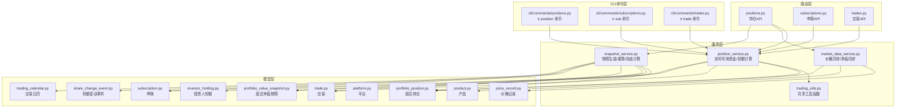
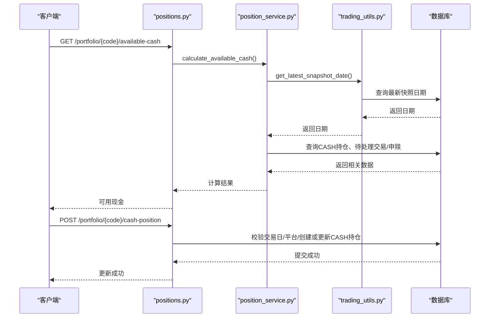
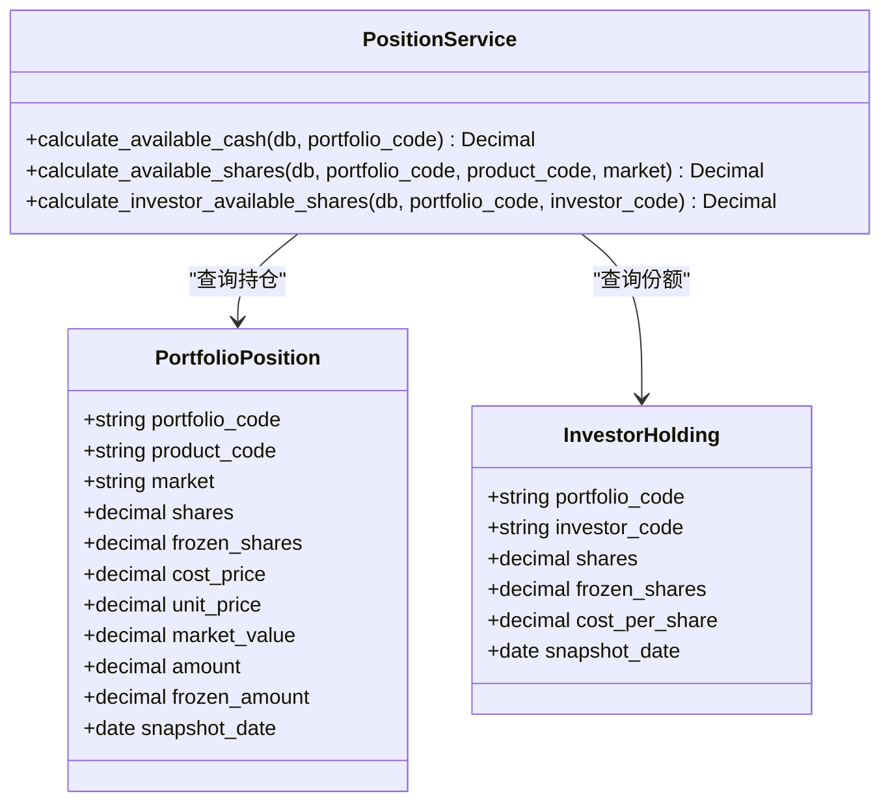
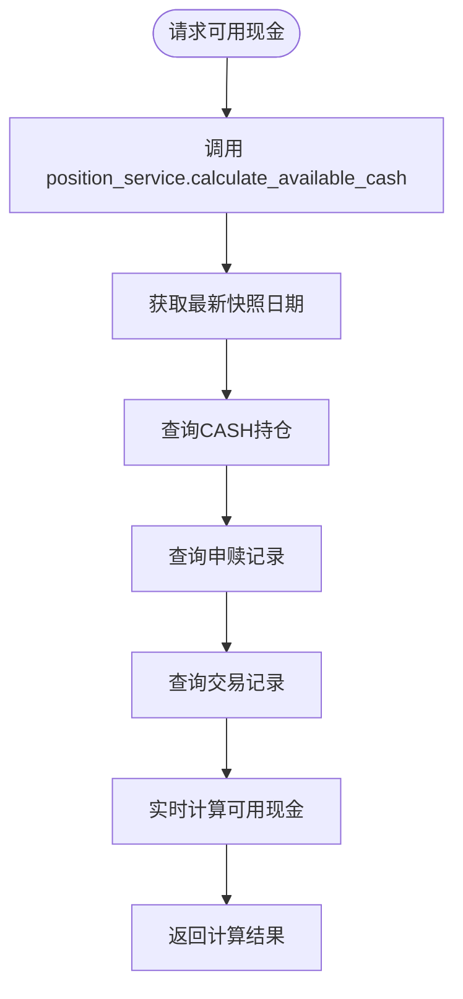
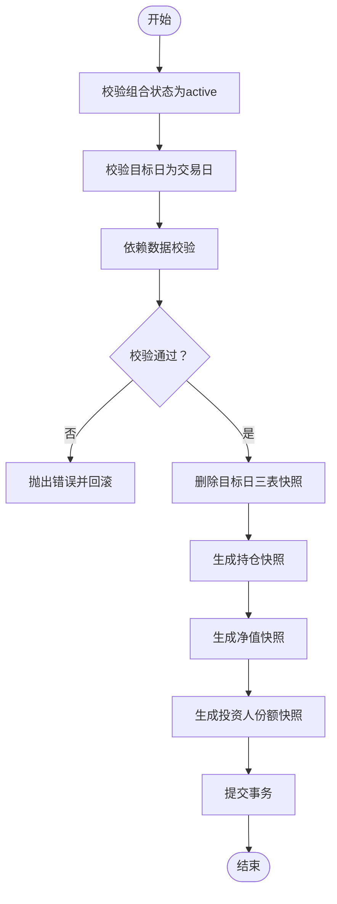
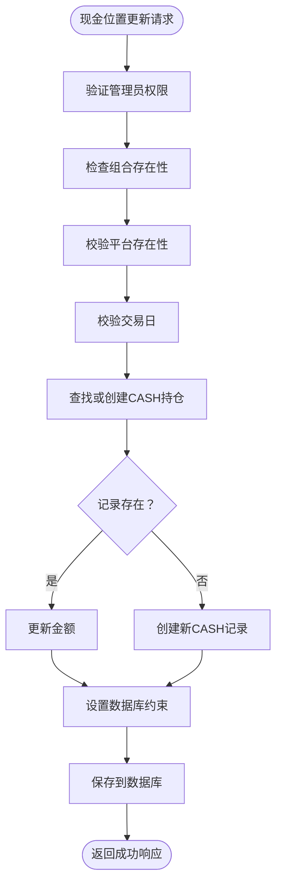
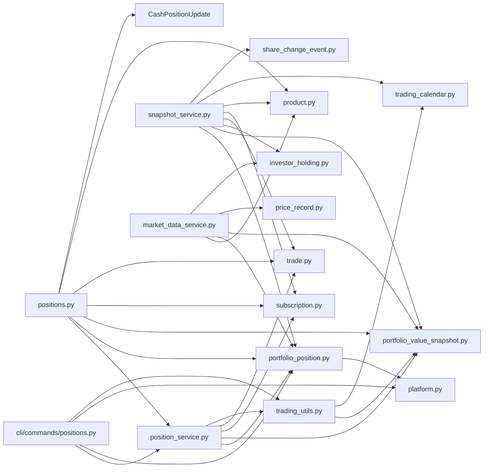

# 持仓管理

<cite>
**本文引用的文件**
- [backend/app/services/position_service.py](file://backend/app/services/position_service.py)
- [backend/app/routers/positions.py](file://backend/app/routers/positions.py)
- [backend/app/schemas/position.py](file://backend/app/schemas/position.py)
- [backend/app/models/portfolio_position.py](file://backend/app/models/portfolio_position.py)
- [backend/app/models/investor_holding.py](file://backend/app/models/investor_holding.py)
- [backend/app/models/portfolio_value_snapshot.py](file://backend/app/models/portfolio_value_snapshot.py)
- [backend/app/models/product.py](file://backend/app/models/product.py)
- [backend/app/models/trade.py](file://backend/app/models/trade.py)
- [backend/app/models/subscription.py](file://backend/app/models/subscription.py)
- [backend/app/models/portfolio.py](file://backend/app/models/portfolio.py)
- [backend/app/models/platform.py](file://backend/app/models/platform.py)
- [backend/app/models/price_record.py](file://backend/app/models/price_record.py)
- [backend/app/models/share_change_event.py](file://backend/app/models/share_change_event.py)
- [backend/app/models/trading_calendar.py](file://backend/app/models/trading_calendar.py)
- [backend/app/services/market_data_service.py](file://backend/app/services/market_data_service.py)
- [backend/app/services/snapshot_service.py](file://backend/app/services/snapshot_service.py)
- [backend/app/services/trading_utils.py](file://backend/app/services/trading_utils.py)
- [backend/app/dependencies.py](file://backend/app/dependencies.py)
- [backend/cli/commands/positions.py](file://backend/cli/commands/positions.py)
- [backend/tests/integration/test_positions.py](file://backend/tests/integration/test_positions.py)
</cite>

## 更新摘要
**变更内容**
- **新增** position_service.py 服务层，提供实时可用现金和份额计算功能
- **重构** 将重复的可用现金/份额计算逻辑从路由层提取到独立服务层
- **增强** CLI 工具支持使用新的服务层函数进行实时计算
- **优化** 统一了 API 和 CLI 的可用资金/份额计算逻辑
- **改进** 通过 trading_utils 共享最新快照日期获取功能

## 目录
1. [简介](#简介)
2. [项目结构](#项目结构)
3. [核心组件](#核心组件)
4. [架构总览](#架构总览)
5. [详细组件分析](#详细组件分析)
6. [依赖分析](#依赖分析)
7. [性能考虑](#性能考虑)
8. [故障排查指南](#故障排查指南)
9. [结论](#结论)
10. [附录](#附录)

## 简介
本文件围绕"持仓管理"功能进行全面技术文档化，覆盖以下关键主题：
- 持仓的创建、调整、平仓与冻结管理机制
- 持仓与产品的关联关系、数量与金额管理、成本与当前价值计算
- 持仓状态控制（正常、冻结、平仓中）与交易限制规则
- 持仓查询、调整与历史记录的API接口说明
- **新增**：非净值资产（现金）位置管理功能
- **新增**：实时可用现金和份额计算服务层
- 业务规则、计算公式与数据验证逻辑
- 实时价格更新对持仓价值的影响与批量操作处理机制
- 风险控制与异常处理策略

## 项目结构
围绕持仓管理的关键文件组织如下：
- **服务层**：**新增** position_service.py 提供实时可用现金/份额计算，trading_utils.py 提供共享工具函数
- 路由层：提供对外API，包括查询、创建、更新、删除、可用资金/份额计算、**新增**非净值资产（现金）更新等
- CLI 命令层：**新增** CLI 工具支持实时计算功能
- 模型层：定义组合持仓、投资人份额、净值快照、产品、交易、申赎、平台、交易日历、价格记录、份额变动事件等数据结构
- 其他服务层：提供价格同步、组合净值同步、每日快照生成与重算、冻结份额计算等能力
- 校验与权限：基于依赖注入实现用户认证与管理员权限控制



**图表来源**
- [backend/app/services/position_service.py:1-211](file://backend/app/services/position_service.py#L1-L211)
- [backend/app/services/trading_utils.py:1-68](file://backend/app/services/trading_utils.py#L1-L68)
- [backend/cli/commands/positions.py:1-142](file://backend/cli/commands/positions.py#L1-L142)
- [backend/app/routers/positions.py:1-200](file://backend/app/routers/positions.py#L1-L200)

**章节来源**
- [backend/app/services/position_service.py:1-211](file://backend/app/services/position_service.py#L1-L211)
- [backend/app/services/trading_utils.py:1-68](file://backend/app/services/trading_utils.py#L1-L68)
- [backend/cli/commands/positions.py:1-142](file://backend/cli/commands/positions.py#L1-L142)

## 核心组件
- **新增** 实时可用资金计算服务（PositionService）
  - calculate_available_cash：组合可用现金实时计算
  - calculate_available_shares：基金可用份额实时计算  
  - calculate_investor_available_shares：投资人可用份额实时计算
- **新增** 交易工具函数（TradingUtils）
  - is_trading_day：判断指定日期是否为交易日
  - get_latest_snapshot_date：获取组合最新快照日期
  - get_next_trading_day：获取下一个交易日
- 组合持仓（PortfolioPosition）
  - 字段要点：产品代码、市场、份额/金额、成本价、单位价、市值、冻结份额/金额、快照日期
  - 约束：产品与市场的联合外键；份额与金额互斥约束；唯一索引（组合+产品+市场+快照日期）
- 投资人份额（InvestorHolding）
  - 字段要点：投资人代码、组合代码、份额、冻结份额、成本价、快照日期
  - 约束：唯一索引（组合+投资人+快照日期）
- 组合净值快照（PortfolioValueSnapshot）
  - 字段要点：总值、总份额、单位净值、单位净值涨跌幅、快照日期
  - 约束：唯一索引（组合+快照日期）
- 产品（Product）、交易（Trade）、申赎（Subscription）、平台（Platform）、交易日历（TradingCalendar）、价格记录（PriceRecord）、份额变动事件（ShareChangeEvent）

**章节来源**
- [backend/app/services/position_service.py:18-211](file://backend/app/services/position_service.py#L18-L211)
- [backend/app/services/trading_utils.py:16-68](file://backend/app/services/trading_utils.py#L16-L68)
- [backend/app/models/portfolio_position.py:1-34](file://backend/app/models/portfolio_position.py#L1-L34)
- [backend/app/models/investor_holding.py:1-20](file://backend/app/models/investor_holding.py#L1-L20)
- [backend/app/models/portfolio_value_snapshot.py:1-20](file://backend/app/models/portfolio_value_snapshot.py#L1-L20)

## 架构总览
持仓管理采用"路由-服务-模型"的分层架构，**新增服务层专门处理实时计算逻辑**：
- **服务层**：封装核心业务逻辑，包括实时可用资金/份额计算、共享工具函数
- 路由层负责API入口、参数解析与权限校验，调用服务层进行业务处理
- CLI 命令层直接复用服务层函数，避免代码重复
- 模型层定义数据结构与约束，确保数据一致性与完整性



**图表来源**
- [backend/app/services/position_service.py:18-105](file://backend/app/services/position_service.py#L18-L105)
- [backend/app/services/trading_utils.py:61-68](file://backend/app/services/trading_utils.py#L61-L68)
- [backend/app/routers/positions.py:319-409](file://backend/app/routers/positions.py#L319-L409)

## 详细组件分析

### 组件A：实时可用资金计算服务（新增）
**新增的核心服务层**，提供统一的实时资金和份额计算逻辑：

#### 可用现金实时计算
```python
def calculate_available_cash(db: Session, portfolio_code: str) -> Decimal:
    """
    组合可用现金实时计算：
    最新快照现金
    + SUM(confirmed申购金额 WHERE 快照未生成)
    - SUM(confirmed赎回金额 WHERE 快照未生成)
    - SUM(pending买入金额)
    - SUM(confirmed买入金额 WHERE 快照未生成)
    + SUM(confirmed卖出金额 WHERE 快照未生成)
    """
```

#### 可用份额实时计算
```python
def calculate_available_shares(
    db: Session, portfolio_code: str, product_code: str, market: Optional[str] = None
) -> Decimal:
    """
    基金可用份额实时计算：
    基金可用份额 = 最新快照份额
                - SUM(pending卖出份额)
                - SUM(confirmed卖出份额 WHERE 快照未生成)
    """
```

#### 投资人可用份额实时计算
```python
def calculate_investor_available_shares(
    db: Session, portfolio_code: str, investor_code: str
) -> Decimal:
    """
    投资人可用份额实时计算：
    投资人可用份额 = 最新快照份额
                  - SUM(pending赎回份额)
                  - SUM(confirmed赎回份额 WHERE 快照未生成)
    """
```

**章节来源**
- [backend/app/services/position_service.py:18-211](file://backend/app/services/position_service.py#L18-L211)

### 组件B：共享交易工具函数（新增）
**新增的工具函数模块**，提供跨模块共享的基础功能：

#### 核心工具函数
- `is_trading_day(db, target_date)`：判断指定日期是否为交易日
- `get_latest_snapshot_date(db, portfolio_code)`：获取组合最新快照日期
- `get_next_trading_day(db, from_date, days)`：获取下一个交易日
- `get_prev_trading_day(db, from_date, days)`：获取前N个交易日

**章节来源**
- [backend/app/services/trading_utils.py:16-68](file://backend/app/services/trading_utils.py#L16-L68)

### 组件C：CLI 命令集成（新增）
**新增的CLI命令支持**，直接使用服务层函数：

#### ir position available-cash
查看组合可用现金（实时计算），调用 `calculate_available_cash` 服务函数

#### ir position available-shares  
查看产品可用份额（实时计算），调用 `calculate_available_shares` 服务函数

#### ir position update-cash
更新现金持仓，包含平台验证、交易日校验和数据库操作

**章节来源**
- [backend/cli/commands/positions.py:57-142](file://backend/cli/commands/positions.py#L57-L142)

### 组件D：组合持仓（PortfolioPosition）与投资人份额（InvestorHolding）
- 数据模型关系
  - 组合持仓与产品通过联合主外键关联，确保产品与市场的合法性
  - 投资人份额与组合、投资人关联，用于投资人层面的份额与成本追踪
- 数量与金额管理
  - 份额与金额互斥：同一记录要么持有份额（净值型），要么持有金额（非净值型如现金）
  - 非净值型资产（如CASH）通过amount字段记录金额，shares为NULL
- 成本与当前价值
  - 成本价（cost_price）按加权平均法维护
  - 当前价值（market_value）= 份额 × 单位净值（由价格记录提供）
- 冻结管理
  - 冻结份额（frozen_shares）来源于"待确认卖出"交易
  - 冻结金额（frozen_amount）在当前实现中未启用，保持为0



**图表来源**
- [backend/app/services/position_service.py:18-211](file://backend/app/services/position_service.py#L18-L211)
- [backend/app/models/portfolio_position.py:1-34](file://backend/app/models/portfolio_position.py#L1-L34)
- [backend/app/models/investor_holding.py:1-20](file://backend/app/models/investor_holding.py#L1-L20)

**章节来源**
- [backend/app/models/portfolio_position.py:1-34](file://backend/app/models/portfolio_position.py#L1-L34)
- [backend/app/models/investor_holding.py:1-20](file://backend/app/models/investor_holding.py#L1-L20)

### 组件E：API接口与业务流程
- 查询组合持仓
  - 支持按组合代码、快照日期过滤；默认返回每个组合每个产品的最新快照
- 创建/更新/删除组合持仓
  - 仅管理员可操作；更新时支持部分字段更新
- **增强**：计算可用现金
  - 现在通过 position_service.calculate_available_cash 提供实时计算
  - 基于最新净值快照现金、未生成快照的申赎与交易、待确认买入等综合计算
- **增强**：计算可用份额
  - 现在通过 position_service.calculate_available_shares 提供实时计算
  - 基于最新快照份额，扣除待确认卖出与未生成快照的已确认卖出
- **新增**：非净值资产（现金）更新
  - 仅管理员可操作；必须为交易日、必须指定平台代码；更新CASH产品金额
  - 支持创建或更新现有记录，自动处理平台验证和日期校验



**图表来源**
- [backend/app/services/position_service.py:18-105](file://backend/app/services/position_service.py#L18-L105)
- [backend/app/routers/positions.py:28-124](file://backend/app/routers/positions.py#L28-L124)

**章节来源**
- [backend/app/routers/positions.py:180-410](file://backend/app/routers/positions.py#L180-L410)
- [backend/app/services/position_service.py:18-211](file://backend/app/services/position_service.py#L18-L211)

### 组件F：实时价格更新与净值同步
- 价格同步
  - 支持从第三方数据源同步日行情或净值，自动去重并更新历史记录
  - 对于不同市场（场内/场外），使用不同的字段映射与校验
- 组合净值同步
  - 基于持仓与最新价格重新计算组合总值、总份额与单位净值
  - 写入或更新净值快照


**图表来源**
- [backend/app/services/market_data_service.py:88-226](file://backend/app/services/market_data_service.py#L88-L226)

**章节来源**
- [backend/app/services/market_data_service.py:1-323](file://backend/app/services/market_data_service.py#L1-L323)

### 组件G：每日快照生成与重算
- 快照生成顺序
  - 先生成组合持仓快照，再生成组合净值快照，最后生成投资人份额快照
- 依赖校验
  - 交易日校验、待确认交易/申赎校验、价格数据完整性校验、份额变动事件状态校验
- 冻结份额计算
  - 持仓冻结份额：待确认卖出交易累计
  - 投资人冻结份额：待确认赎回交易累计
  - 组合冻结份额：待确认赎回交易累计



**图表来源**
- [backend/app/services/snapshot_service.py:24-94](file://backend/app/services/snapshot_service.py#L24-L94)

**章节来源**
- [backend/app/services/snapshot_service.py:1-789](file://backend/app/services/snapshot_service.py#L1-L789)

### 组件H：交易限制与状态控制
- 状态控制
  - 组合状态：草稿、激活、关闭；关闭后禁止新的申赎与调仓
  - 交易状态：pending、confirmed；快照生成前必须无待确认交易
- 冻结规则
  - 待确认卖出导致持仓冻结份额增加
  - 待确认赎回导致投资人与组合冻结份额增加
- **新增**：非净值资产（现金）更新限制
  - 仅管理员可操作
  - 必须为交易日
  - 必须指定平台代码
  - 自动处理CASH产品金额更新

**章节来源**
- [backend/app/models/portfolio.py:1-16](file://backend/app/models/portfolio.py#L1-L16)
- [backend/app/models/trade.py:1-32](file://backend/app/models/trade.py#L1-L32)
- [backend/app/models/subscription.py:1-21](file://backend/app/models/subscription.py#L1-L21)
- [backend/app/routers/positions.py:319-410](file://backend/app/routers/positions.py#L319-L410)
- [backend/app/services/snapshot_service.py:717-774](file://backend/app/services/snapshot_service.py#L717-L774)

### 组件I：非净值资产位置管理功能
**新增功能**：专门针对非净值型资产（主要是现金）的位置管理

- 功能概述
  - 专门处理CASH产品的金额更新
  - 支持创建新记录或更新现有记录
  - 强制平台验证和交易日校验
  - 自动处理数据库约束（check_nav_or_non_nav）

- 核心特性
  - **权限控制**：仅管理员可操作
  - **平台验证**：必须指定有效的平台代码
  - **交易日校验**：必须在交易日进行
  - **数据库约束**：自动满足份额与金额互斥约束
  - **日期处理**：支持指定更新日期，默认为当天

- 数据库约束处理
  - 自动设置 `shares=None` 以满足 check_nav_or_non_nav 约束
  - 产品代码固定为 "CASH"
  - 市场字段为空字符串 ""
  - 唯一索引包含平台代码和快照日期



**图表来源**
- [backend/app/routers/positions.py:319-409](file://backend/app/routers/positions.py#L319-L409)
- [backend/app/models/portfolio_position.py:28-31](file://backend/app/models/portfolio_position.py#L28-L31)

**章节来源**
- [backend/app/routers/positions.py:319-410](file://backend/app/routers/positions.py#L319-L410)
- [backend/app/schemas/position.py:45-50](file://backend/app/schemas/position.py#L45-L50)
- [backend/app/models/portfolio_position.py:28-31](file://backend/app/models/portfolio_position.py#L28-L31)

## 依赖分析
- **新增** 服务层依赖
  - position_service.py 依赖 PortfolioPosition、Subscription、Trade、PortfolioValueSnapshot 等模型
  - position_service.py 依赖 trading_utils.get_latest_snapshot_date 工具函数
  - trading_utils.py 依赖 PortfolioValueSnapshot、TradingCalendar 等模型
- 路由依赖
  - positions.py 依赖 PortfolioPosition、PortfolioValueSnapshot、Subscription、Trade、Product 等模型
  - **新增**：CashPositionUpdate 请求模型
  - 使用依赖注入实现用户认证与管理员权限校验
- CLI 依赖
  - cli/commands/positions.py 直接 import position_service 函数
  - 使用 cli_context 管理数据库会话
- 数据模型依赖
  - PortfolioPosition 与 Product 通过联合外键关联
  - Trade/Subscription 与 Product 通过联合外键关联
  - ShareChangeEvent 与 Product 通过联合外键关联
  - **新增**：PortfolioPosition 与 Platform 通过外键关联



**图表来源**
- [backend/app/services/position_service.py:1-16](file://backend/app/services/position_service.py#L1-L16)
- [backend/app/services/trading_utils.py:1-14](file://backend/app/services/trading_utils.py#L1-L14)
- [backend/cli/commands/positions.py:1-13](file://backend/cli/commands/positions.py#L1-L13)

**章节来源**
- [backend/app/services/position_service.py:1-16](file://backend/app/services/position_service.py#L1-L16)
- [backend/app/services/trading_utils.py:1-14](file://backend/app/services/trading_utils.py#L1-L14)
- [backend/cli/commands/positions.py:1-13](file://backend/cli/commands/positions.py#L1-L13)

## 性能考虑
- **新增** 服务层优化
  - 实时计算函数使用单次数据库查询获取最新快照日期
  - 聚合查询减少数据库往返次数
  - 条件判断避免不必要的计算
- 查询优化
  - 按组合+产品+快照日期建立唯一索引，避免重复快照
  - 分页查询与子查询配合，减少全表扫描
- 写入优化
  - 价格同步采用批量写入与去重，降低重复写入开销
  - 快照生成按顺序执行，减少并发冲突
  - **新增**：非净值资产更新采用原子操作，减少查询次数
- 计算优化
  - **新增**：可用现金/份额计算聚合查询，避免多次往返数据库
  - 冻结份额计算使用SUM聚合，复杂度O(n)
  - **新增**：现金位置更新支持批量操作，提高效率

## 故障排查指南
- **新增** 服务层问题排查
  - 检查 position_service 函数是否正确导入依赖
  - 验证 trading_utils 工具函数是否正常工作
  - 确认数据库连接和会话管理是否正常
- 快照生成失败
  - 检查交易日历与组合状态
  - 检查是否存在待确认交易/申赎
  - 检查价格数据完整性（普通基金当日净值、QDII T-1净值）
- 价格同步失败
  - 检查数据源状态与错误信息
  - 检查市场类型与字段映射
- 权限问题
  - 确认调用者具备管理员权限
  - 确认Token有效且未被拉黑
- **新增** CLI 命令问题排查
  - 检查 CLI 是否正确引用 position_service 函数
  - 验证命令行参数格式是否正确
  - 确认数据库连接配置正确
- **新增** 非净值资产更新失败
  - 检查组合是否存在
  - 检查平台代码是否有效
  - 检查更新日期是否为交易日
  - 检查数据库约束是否满足

**章节来源**
- [backend/app/services/position_service.py:18-211](file://backend/app/services/position_service.py#L18-L211)
- [backend/app/services/trading_utils.py:16-68](file://backend/app/services/trading_utils.py#L16-L68)
- [backend/cli/commands/positions.py:57-142](file://backend/cli/commands/positions.py#L57-L142)
- [backend/app/services/snapshot_service.py:187-218](file://backend/app/services/snapshot_service.py#L187-L218)
- [backend/app/services/market_data_service.py:128-139](file://backend/app/services/market_data_service.py#L128-L139)
- [backend/app/dependencies.py:114-129](file://backend/app/dependencies.py#L114-L129)
- [backend/app/routers/positions.py:340-372](file://backend/app/routers/positions.py#L340-L372)

## 结论
持仓管理通过清晰的数据模型、严格的业务规则与完善的服务层能力，实现了对组合持仓的全生命周期管理。**新增的 position_service.py 服务层**进一步增强了系统的实时计算能力，提供了统一的可用资金和份额计算逻辑。

依托每日快照与价格同步机制，系统能够准确反映当前价值与可用资源，并通过冻结规则与交易限制保障风控合规。**新增的服务层设计**使得 API 和 CLI 都能复用相同的计算逻辑，提高了代码的可维护性和一致性。

**新增的非净值资产位置管理功能**进一步完善了系统的资产管理能力，特别是针对现金类资产的精细化管理。通过平台验证、交易日校验和数据库约束处理，确保了数据的准确性和一致性。

## 附录

### API接口清单（摘要）
- 查询组合持仓
  - 方法：GET
  - 路径：/positions
  - 参数：portfolio_code、snapshot_date、page、page_size
- 获取单条组合持仓
  - 方法：GET
  - 路径：/positions/{id}
- 创建组合持仓
  - 方法：POST
  - 路径：/positions
  - 权限：管理员
- 更新组合持仓
  - 方法：PUT
  - 路径：/positions/{id}
  - 权限：管理员
- 删除组合持仓
  - 方法：DELETE
  - 路径：/positions/{id}
  - 权限：管理员
- **增强**：计算可用现金
  - 方法：GET
  - 路径：/positions/portfolio/{portfolio_code}/available-cash
  - **新增**：现在使用 position_service.calculate_available_cash 提供实时计算
- **增强**：计算可用份额
  - 方法：GET
  - 路径：/positions/portfolio/{portfolio_code}/product/{product_code}/available-shares
  - 参数：market（可选）
  - **新增**：现在使用 position_service.calculate_available_shares 提供实时计算
- **新增**：非净值资产（现金）更新
  - 方法：POST
  - 路径：/positions/portfolio/{portfolio_code}/cash-position
  - 权限：管理员
  - 参数：amount、platform_code、update_date（可选）

### CLI命令清单（新增）
- ir position list --portfolio-code [--snapshot-date] [--page] [--page-size]
  - 查看持仓（默认最新快照）
- **新增**：ir position available-cash PORTFOLIO_CODE
  - 查看组合可用现金（实时计算）
- **新增**：ir position available-shares PORTFOLIO_CODE PRODUCT_CODE [--market]
  - 查看产品可用份额（实时计算）
- **新增**：ir position update-cash PORTFOLIO_CODE --platform-code --amount [--update-date]
  - 更新现金持仓

### 非净值资产更新请求示例
```json
{
  "amount": 100000.0,
  "platform_code": "ZGYH",
  "update_date": "2024-12-17"
}
```

### 错误响应示例
```json
{
  "error": "PLATFORM_NOT_FOUND",
  "message": "平台 ZGYH 不存在"
}
```

**章节来源**
- [backend/app/routers/positions.py:180-410](file://backend/app/routers/positions.py#L180-L410)
- [backend/app/schemas/position.py:1-50](file://backend/app/schemas/position.py#L1-L50)
- [backend/cli/commands/positions.py:57-142](file://backend/cli/commands/positions.py#L57-L142)
- [backend/tests/integration/test_positions.py:33-99](file://backend/tests/integration/test_positions.py#L33-L99)