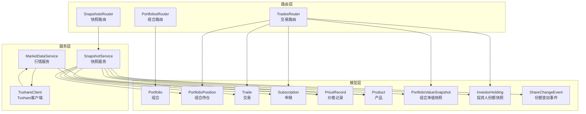
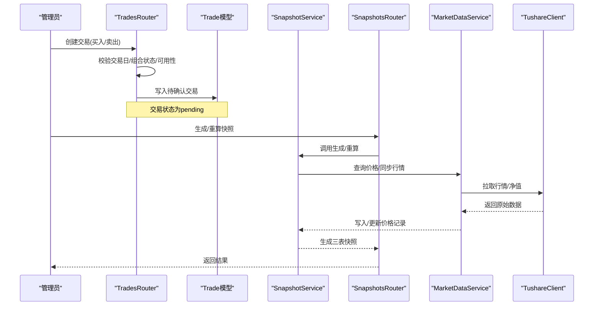
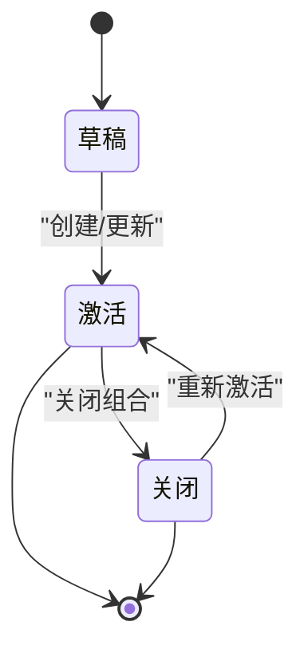
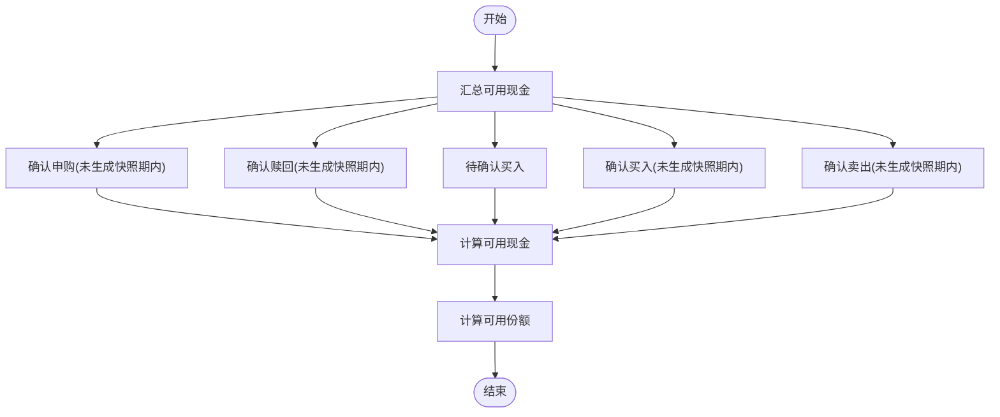
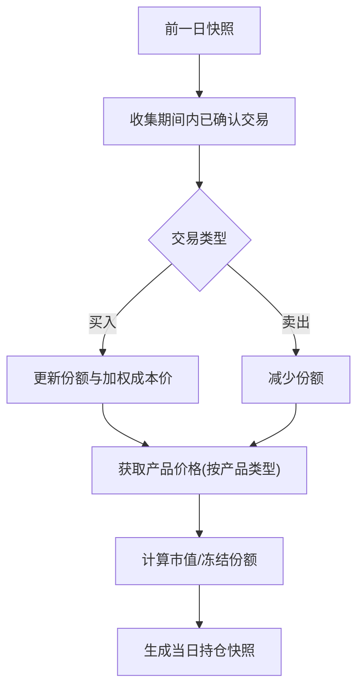
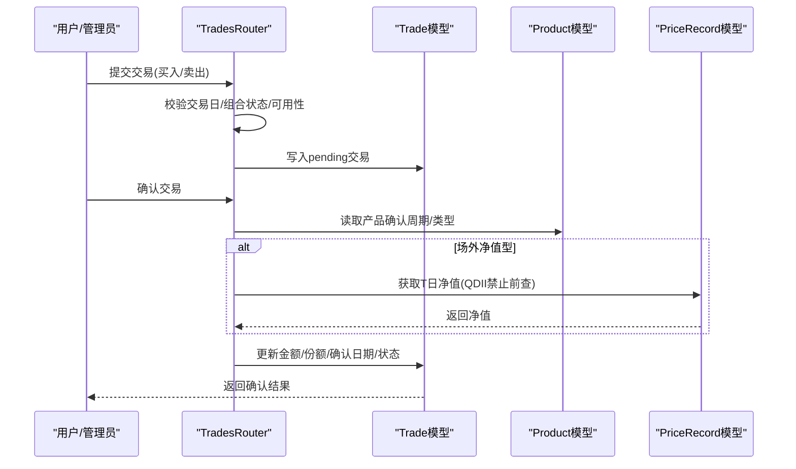
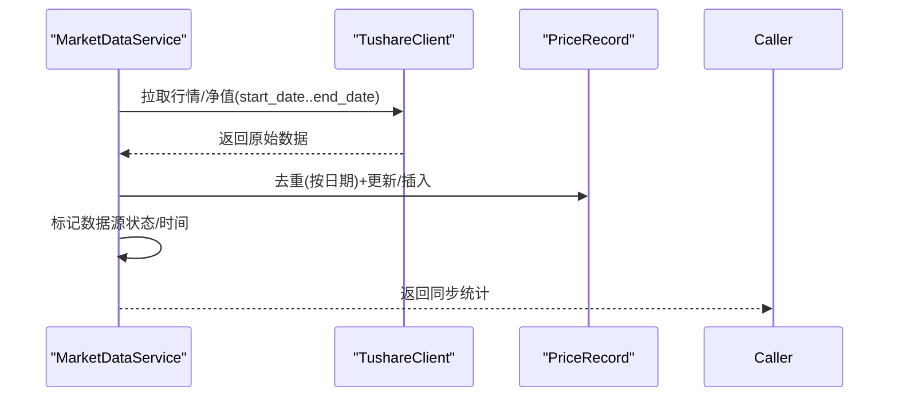
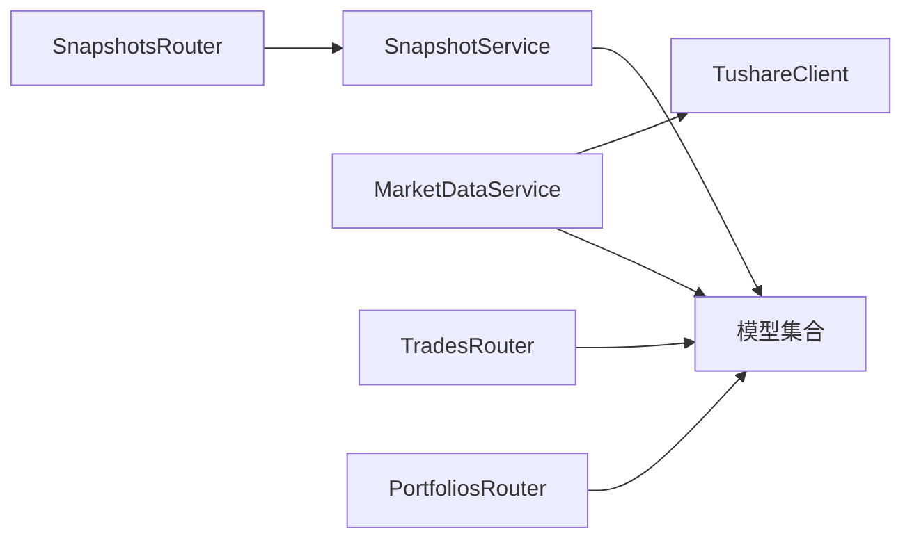

# 核心业务功能

<cite>
**本文引用的文件**
- [backend/app/models/portfolio.py](file://backend/app/models/portfolio.py)
- [backend/app/models/portfolio_position.py](file://backend/app/models/portfolio_position.py)
- [backend/app/models/trade.py](file://backend/app/models/trade.py)
- [backend/app/models/share_change_event.py](file://backend/app/models/share_change_event.py)
- [backend/app/models/portfolio_value_snapshot.py](file://backend/app/models/portfolio_value_snapshot.py)
- [backend/app/models/product.py](file://backend/app/models/product.py)
- [backend/app/models/price_record.py](file://backend/app/models/price_record.py)
- [backend/app/models/investor_holding.py](file://backend/app/models/investor_holding.py)
- [backend/app/models/subscription.py](file://backend/app/models/subscription.py)
- [backend/app/services/snapshot_service.py](file://backend/app/services/snapshot_service.py)
- [backend/app/services/market_data_service.py](file://backend/app/services/market_data_service.py)
- [backend/app/services/tushare_client.py](file://backend/app/services/tushare_client.py)
- [backend/app/routers/portfolios.py](file://backend/app/routers/portfolios.py)
- [backend/app/routers/snapshots.py](file://backend/app/routers/snapshots.py)
- [backend/app/routers/trades.py](file://backend/app/routers/trades.py)
</cite>

## 目录
1. [引言](#引言)
2. [项目结构](#项目结构)
3. [核心组件](#核心组件)
4. [架构总览](#架构总览)
5. [详细组件分析](#详细组件分析)
6. [依赖分析](#依赖分析)
7. [性能考虑](#性能考虑)
8. [故障排查指南](#故障排查指南)
9. [结论](#结论)
10. [附录](#附录)

## 引言
本文件面向业务分析师与开发者，系统化阐述 InvestRing 的核心业务功能与实现细节，覆盖以下主题：
- 投资组合生命周期管理（创建、启用、关闭、重新激活）
- 净值计算与份额分账（组合净值、投资人份额）
- 持仓管理机制（基于快照的持仓滚动与冻结控制）
- 交易处理流程（下单、确认、取消、可用性校验）
- 快照生成算法（三表顺序生成与依赖校验）
- 数据同步策略（Tushare API 集成、实时数据获取与历史回补）
- 业务规则、计算公式与数据验证逻辑
- 并发控制、事务处理与数据一致性保障
- 典型业务场景与代码实现路径指引

## 项目结构
后端采用 FastAPI + SQLAlchemy 架构，按“模型-服务-路由”分层组织。核心业务围绕“组合-产品-交易-净值-份额”展开，并通过服务层封装数据同步与快照生成。

图表来源
- [backend/app/models/portfolio.py:5-16](file://backend/app/models/portfolio.py#L5-L16)
- [backend/app/models/portfolio_position.py:5-34](file://backend/app/models/portfolio_position.py#L5-L34)
- [backend/app/models/trade.py:5-32](file://backend/app/models/trade.py#L5-L32)
- [backend/app/models/subscription.py:5-21](file://backend/app/models/subscription.py#L5-L21)
- [backend/app/models/price_record.py:5-28](file://backend/app/models/price_record.py#L5-L28)
- [backend/app/models/product.py:5-22](file://backend/app/models/product.py#L5-L22)
- [backend/app/models/portfolio_value_snapshot.py:5-20](file://backend/app/models/portfolio_value_snapshot.py#L5-L20)
- [backend/app/models/investor_holding.py:5-20](file://backend/app/models/investor_holding.py#L5-L20)
- [backend/app/models/share_change_event.py:5-37](file://backend/app/models/share_change_event.py#L5-L37)
- [backend/app/services/snapshot_service.py:1-789](file://backend/app/services/snapshot_service.py#L1-L789)
- [backend/app/services/market_data_service.py:1-323](file://backend/app/services/market_data_service.py#L1-L323)
- [backend/app/services/tushare_client.py:1-222](file://backend/app/services/tushare_client.py#L1-L222)
- [backend/app/routers/portfolios.py:1-276](file://backend/app/routers/portfolios.py#L1-L276)
- [backend/app/routers/snapshots.py:1-188](file://backend/app/routers/snapshots.py#L1-L188)
- [backend/app/routers/trades.py:1-567](file://backend/app/routers/trades.py#L1-L567)

章节来源
- [backend/app/routers/portfolios.py:1-276](file://backend/app/routers/portfolios.py#L1-L276)
- [backend/app/routers/snapshots.py:1-188](file://backend/app/routers/snapshots.py#L1-L188)
- [backend/app/routers/trades.py:1-567](file://backend/app/routers/trades.py#L1-L567)

## 核心组件
- 组合（Portfolio）：组合基本信息、状态、起止时间
- 产品（Product）：产品基础信息、确认周期、数据源、同步状态
- 交易（Trade）：买入/卖出、成交金额、份额、费率、确认日期、状态
- 申赎（Subscription）：申购/赎回、份额、金额、确认日期、状态
- 持仓（PortfolioPosition）：按产品维度的份额、冻结份额、成本价、单位价、市值
- 净值快照（PortfolioValueSnapshot）：总值、总份额、单位净值、冻结份额
- 投资人份额（InvestorHolding）：投资人份额、冻结份额、成本均价
- 份额变动事件（ShareChangeEvent）：除权除息、配股、分红等事件，**支持事件分级（基金级/平台级）**
- 手动市值覆盖（ManualMarketValue）：非净值资产重估，按日期绝对替换
- 价格记录（PriceRecord）：日行情/净值、涨跌幅、累计净值
- 快照服务（SnapshotService）：三表生成、重算、依赖校验、冻结计算
- 行情服务（MarketDataService）：价格查询、同步、组合净值重算
- Tushare 客户端（TushareClient）：交易日历、场内/场外行情/净值拉取

章节来源
- [backend/app/models/portfolio.py:5-16](file://backend/app/models/portfolio.py#L5-L16)
- [backend/app/models/product.py:5-22](file://backend/app/models/product.py#L5-L22)
- [backend/app/models/trade.py:5-32](file://backend/app/models/trade.py#L5-L32)
- [backend/app/models/subscription.py:5-21](file://backend/app/models/subscription.py#L5-L21)
- [backend/app/models/portfolio_position.py:5-34](file://backend/app/models/portfolio_position.py#L5-L34)
- [backend/app/models/portfolio_value_snapshot.py:5-20](file://backend/app/models/portfolio_value_snapshot.py#L5-L20)
- [backend/app/models/investor_holding.py:5-20](file://backend/app/models/investor_holding.py#L5-L20)
- [backend/app/models/share_change_event.py:5-37](file://backend/app/models/share_change_event.py#L5-L37)
- [backend/app/models/price_record.py:5-28](file://backend/app/models/price_record.py#L5-L28)
- [backend/app/services/snapshot_service.py:1-789](file://backend/app/services/snapshot_service.py#L1-L789)
- [backend/app/services/market_data_service.py:1-323](file://backend/app/services/market_data_service.py#L1-L323)
- [backend/app/services/tushare_client.py:1-222](file://backend/app/services/tushare_client.py#L1-L222)

## 架构总览
下图展示“交易-行情-快照”的核心交互链路，体现数据流向与职责边界。

图表来源
- [backend/app/routers/trades.py:292-403](file://backend/app/routers/trades.py#L292-L403)
- [backend/app/routers/snapshots.py:28-87](file://backend/app/routers/snapshots.py#L28-L87)
- [backend/app/services/snapshot_service.py:24-94](file://backend/app/services/snapshot_service.py#L24-L94)
- [backend/app/services/market_data_service.py:88-226](file://backend/app/services/market_data_service.py#L88-L226)
- [backend/app/services/tushare_client.py:123-222](file://backend/app/services/tushare_client.py#L123-L222)

## 详细组件分析

### 投资组合生命周期管理
- 创建：校验唯一性，初始状态为草稿
- 更新：允许修改描述等元信息
- 关闭：仅当无待确认交易时允许；关闭后不可直接交易
- 重新激活：仅已关闭组合可激活
- 净值历史与收益计算：提供历史净值查询与累计/年化收益计算接口

图表来源
- [backend/app/routers/portfolios.py:92-157](file://backend/app/routers/portfolios.py#L92-L157)

章节来源
- [backend/app/routers/portfolios.py:18-157](file://backend/app/routers/portfolios.py#L18-L157)

### 净值计算与份额分账
- 组合净值快照（PortfolioValueSnapshot）
  - 总值 = 持仓市值之和 + 各平台现金余额之和（由 `get_cash_value` → `compute_cash_balance` 统一计算）
  - 总份额来自投资人份额快照汇总或首次以总值/1计算
  - 单位净值 = 总值 / 总份额（保留 4 位小数）
  - 冻结份额：来自待确认赎回
- 投资人份额快照（InvestorHolding）
  - 基于前一日份额与期间内申赎确认进行加权平均成本与份额调整
  - 冻结份额：来自待确认赎回
- 现金显式流水（核心设计）
  - 所有现金变动通过显式 CASH trade 或 event cash_change 记录，不再隐式反推
  - `compute_cash_balance(T) = SUM(confirmed CASH trades WHERE confirm_date <= T) + SUM(confirmed events WHERE ex_date <= T, cash_change != 0)`
  - `calculate_available_cash = compute_cash_balance(latest_snapshot_date) + SUM(confirmed CASH trades WHERE confirm_date > latest_snapshot_date) - SUM(pending CASH sells) + SUM(confirmed event cash_change WHERE ex_date > latest_snapshot_date)`
  - 实时预览调 `compute_cash_balance(today)`，快照生成调 `get_cash_value(date)`（含 `manual_market_value` 绝对替换）
- 现金与份额可用性实时计算
  - 可用现金 = `compute_cash_balance(latest_snapshot_date)` + 快照后已确认 CASH trades - pending CASH sells + 快照后事件 cash_change
  - 可用份额 = 最新快照份额 - 待确认卖出 - 未生成快照期内确认卖出
  - 基金可用份额 = 最新快照份额 - SUM(pending卖出份额) - SUM(confirmed卖出份额 WHERE 快照未生成)
  - 投资人可用份额 = 最新快照份额 - SUM(pending赎回份额) - SUM(confirmed赎回份额 WHERE 快照未生成)

图表来源
- [backend/app/routers/trades.py:128-218](file://backend/app/routers/trades.py#L128-L218)
- [backend/app/routers/trades.py:220-269](file://backend/app/routers/trades.py#L220-L269)

章节来源
- [backend/app/models/portfolio_value_snapshot.py:5-20](file://backend/app/models/portfolio_value_snapshot.py#L5-L20)
- [backend/app/models/investor_holding.py:5-20](file://backend/app/models/investor_holding.py#L5-L20)
- [backend/app/routers/trades.py:128-269](file://backend/app/routers/trades.py#L128-L269)

### 持仓管理机制
- 持仓快照（PortfolioPosition）
  - 基于前一日快照滚动，应用期间内已确认交易（买入/卖出）
  - 成本价采用加权平均法
  - QDII 产品使用 T-1 日净值，普通产品使用 T 日或最近净值
  - 冻结份额：来自待确认卖出
- 产品维度约束
  - 份额与金额互斥约束，确保净值型产品以份额计量或以金额计量
  - 唯一索引：组合+产品+市场+快照日期

图表来源
- [backend/app/services/snapshot_service.py:265-418](file://backend/app/services/snapshot_service.py#L265-L418)
- [backend/app/models/portfolio_position.py:23-33](file://backend/app/models/portfolio_position.py#L23-L33)

章节来源
- [backend/app/models/portfolio_position.py:5-34](file://backend/app/models/portfolio_position.py#L5-L34)
- [backend/app/services/snapshot_service.py:265-418](file://backend/app/services/snapshot_service.py#L265-L418)

### 交易处理流程
- 下单
  - 交易日校验、组合状态校验、产品存在性校验
  - 买入：校验金额>0、可用现金充足；自动计算份额与费用
  - 卖出：校验份额>0、可用份额充足；自动计算金额与费用
  - 状态初始化为 pending
  - **confirm_date 创建时设定**：按 `product.confirm_days` 自动计算（场内0日/场外1日/QDII 2日）
  - **配对 CASH trade**：基金买入/卖出创建时自动生成配对 CASH trade（`transfer_group = "rebal_{uuid}"`），CASH trade 的 `status`/`trade_date`/`confirm_date` 与基金腿完全同步
- 确认
  - 依据产品类型与市场决定是否需要净值：场外净值型产品必须获取 T 日净值（QDII 禁止向前查找）
  - 支持手动指定价格；若未指定则使用系统获取的净值
  - 更新交易金额、份额、确认日期，状态置为 confirmed
  - **transfer_group 原子翻转**：confirm 基金腿时，配对 CASH 腿自动同步为 confirmed
- 取消
  - 仅场外 pending 可取消；场内当天通常不可取消
  - **transfer_group 原子翻转**：cancel 基金腿时，配对 CASH 腿自动同步为 cancelled
- 删除与更新：管理员权限

图表来源
- [backend/app/routers/trades.py:292-504](file://backend/app/routers/trades.py#L292-L504)
- [backend/app/models/trade.py:5-32](file://backend/app/models/trade.py#L5-L32)
- [backend/app/models/product.py:5-22](file://backend/app/models/product.py#L5-L22)
- [backend/app/models/price_record.py:5-28](file://backend/app/models/price_record.py#L5-L28)

章节来源
- [backend/app/routers/trades.py:18-567](file://backend/app/routers/trades.py#L18-L567)

### 快照生成算法
- 三表顺序生成：PortfolioPosition → PortfolioValueSnapshot → InvestorHolding
- 依赖校验：交易日、待确认交易（`apply_date < target_date`）、价格数据完整性、份额变动事件状态（pending 事件 `ex_date <= target_date` 拦截快照）
- 删除旧快照：按日期清理三表记录；**级联回退** `confirm_date==D` 的申购至 pending 并删除关联 CASH trade（`transfer_group="sub_{id}"`），同时回退 `ex_date==D` 或 `entitlement_date==D` 的 confirmed 事件至 pending
- 冻结字段计算：pending 交易导致的冻结份额/金额
- 重算区间：遍历交易日，逐日生成，支持强制跳过校验；**自动扩展**至最新快照日；**自动重确认** `apply_date==D` 的 pending 申购、`confirm_date==D` 的 pending Trade、`ex_date==D` 的 pending Event
- **事件在快照中的应用**：`_generate_portfolio_position` 只读取 `platform_code IS NOT NULL` 的 confirmed 事件（跳过基金级父记录），按 `entitlement_date` 升序应用，使用确认时预计算的 `shares_change`，不重算
- **CASH 持仓由 `get_cash_value` → `compute_cash_balance` 统一计算**，不再在 `_generate_portfolio_position` 中增量累加

图表来源
- [backend/app/services/snapshot_service.py:96-184](file://backend/app/services/snapshot_service.py#L96-L184)
- [backend/app/services/snapshot_service.py:187-217](file://backend/app/services/snapshot_service.py#L187-L217)
- [backend/app/services/snapshot_service.py:247-263](file://backend/app/services/snapshot_service.py#L247-L263)

章节来源
- [backend/app/services/snapshot_service.py:24-184](file://backend/app/services/snapshot_service.py#L24-L184)

### 数据同步策略（Tushare 集成）
- 交易日历：批量拉取指定年份/年份列表，去重合并
- 行情/净值：场内使用 fund_daily，场外使用 fund_nav；按日期去重，保留最新记录
- 写入策略：若存在则更新字段，否则新增；统一标记来源为 tushare；异常时标记数据源状态为 failed
- 组合净值同步：根据持仓与最新价格重新计算并更新当日净值快照

图表来源
- [backend/app/services/market_data_service.py:88-226](file://backend/app/services/market_data_service.py#L88-L226)
- [backend/app/services/tushare_client.py:48-222](file://backend/app/services/tushare_client.py#L48-L222)

章节来源
- [backend/app/services/market_data_service.py:1-323](file://backend/app/services/market_data_service.py#L1-L323)
- [backend/app/services/tushare_client.py:1-222](file://backend/app/services/tushare_client.py#L1-L222)

### 业务规则、计算公式与数据验证
- 份额与金额互斥：同一持仓仅能以份额或金额计量之一
- 唯一索引：持仓/净值/份额快照按（组合, 产品, 市场, 平台, 日期）唯一；trade 表 `(transfer_group, product_code, trade_type)` 防止重复确认
- 冻结控制：pending 交易导致的冻结份额/金额，实时计算不读快照
- QDII 净值规则：调仓确认必须使用 T 日净值（禁止向前查找）；快照生成/市值计算使用 T-1 日净值
- 可用性校验：下单前实时计算可用现金/份额，避免超买/超卖；卖出 pending 不增加可用现金
- 依赖校验：生成快照前必须满足交易日、无待确认交易（`apply_date < target_date`）、价格数据完整、份额变动事件已确认（pending 事件 `ex_date <= target_date` 拦截快照）
- **持仓表禁止手动操作**：`create_position`/`update_position`/`delete_position` 返回 `POSITION_TABLE_PROTECTED`，快照只能由系统生成
- **交易录入日期约束**：Trade `trade_date`、Subscription `apply_date`、ShareChangeEvent `ex_date` 均须晚于最新快照日（`DATE_BEFORE_SNAPSHOT`）
- **Trade confirm_date 创建时设定**：交易录入时按 `product.confirm_days` 自动计算，不留空后补
- **transfer_group 原子翻转**：confirm/unconfirm/cancel 基金腿时，配对 CASH 腿自动同步状态和 confirm_date
- **事件双日期约束**：`ex_date > entitlement_date` 严格大于（`INVALID_DATE_ORDER`）；两者均须为交易日（`INVALID_EX_DATE`）
- **事件分级**：基金级事件 `platform_code` 为空，确认时自动拆分；平台级事件必须指定 `platform_code`（`PLATFORM_REQUIRED`/`PLATFORM_NOT_ALLOWED`）
- **现金显式流水**：所有现金影响通过 CASH trade 或 event cash_change 显式记录，`compute_cash_balance` 统一计算
- **manual_market_value 覆盖**：`update_cash_position` 写入 `manual_market_value` 表（绝对替换），不再直接改 `portfolio_position`

章节来源
- [backend/app/models/portfolio_position.py:23-33](file://backend/app/models/portfolio_position.py#L23-L33)
- [backend/app/models/portfolio_value_snapshot.py:17-19](file://backend/app/models/portfolio_value_snapshot.py#L17-L19)
- [backend/app/models/investor_holding.py:17-19](file://backend/app/models/investor_holding.py#L17-L19)
- [backend/app/routers/trades.py:53-106](file://backend/app/routers/trades.py#L53-L106)
- [backend/app/services/snapshot_service.py:578-715](file://backend/app/services/snapshot_service.py#L578-L715)

## 依赖分析
- 组件耦合
  - SnapshotService 依赖 Trade、Subscription、ShareChangeEvent、PriceRecord、Product、TradingCalendar、Investor 等模型
  - MarketDataService 依赖 TushareClient 与 PriceRecord/Product
  - Router 层通过依赖注入访问数据库会话与当前用户，保证权限与事务边界
- 外部依赖
  - Tushare API：交易日历、场内/场外行情/净值
- 潜在循环依赖
  - 当前结构清晰，无明显循环导入

图表来源
- [backend/app/services/snapshot_service.py:15-19](file://backend/app/services/snapshot_service.py#L15-L19)
- [backend/app/services/market_data_service.py:12-12](file://backend/app/services/market_data_service.py#L12-L12)
- [backend/app/routers/trades.py:1-16](file://backend/app/routers/trades.py#L1-L16)
- [backend/app/routers/portfolios.py:1-16](file://backend/app/routers/portfolios.py#L1-L16)
- [backend/app/routers/snapshots.py:1-25](file://backend/app/routers/snapshots.py#L1-L25)

章节来源
- [backend/app/services/snapshot_service.py:1-789](file://backend/app/services/snapshot_service.py#L1-L789)
- [backend/app/services/market_data_service.py:1-323](file://backend/app/services/market_data_service.py#L1-L323)
- [backend/app/services/tushare_client.py:1-222](file://backend/app/services/tushare_client.py#L1-L222)
- [backend/app/routers/trades.py:1-567](file://backend/app/routers/trades.py#L1-L567)
- [backend/app/routers/portfolios.py:1-276](file://backend/app/routers/portfolios.py#L1-L276)
- [backend/app/routers/snapshots.py:1-188](file://backend/app/routers/snapshots.py#L1-L188)

## 性能考虑
- 批量查询与去重：行情同步阶段对日期去重，避免重复写入
- 内存缓存：一次性加载某产品某市场的既有记录至内存字典，降低多次查询开销
- 事务粒度：快照生成与行情写入均采用单事务，失败回滚，保证一致性
- 查询优化：按日期范围与唯一键过滤，减少扫描范围
- 建议
  - 对高频查询建立合适索引（如按日期、产品、组合的复合索引）
  - 对历史回补任务采用分批/限速策略，避免瞬时压力过大

## 故障排查指南
- 快照生成失败
  - 检查依赖校验：是否存在待确认交易、价格数据是否完整、是否为交易日
  - 查看错误日志与回滚记录，定位具体失败步骤
- 行情同步异常
  - 确认 Tushare Token 配置正确
  - 检查网络与 API 限流情况，关注异常重试与状态标记
- 交易确认失败
  - 场外净值型产品需 T 日净值；QDII 严禁前查
  - 若手动指定价格，需确保数值合理
- 可用性校验失败
  - 检查最新快照日期与期间内确认/待确认交易的时间边界
  - 核对现金与份额的计算口径是否一致

章节来源
- [backend/app/services/snapshot_service.py:90-94](file://backend/app/services/snapshot_service.py#L90-L94)
- [backend/app/services/market_data_service.py:135-139](file://backend/app/services/market_data_service.py#L135-L139)
- [backend/app/services/tushare_client.py:38-46](file://backend/app/services/tushare_client.py#L38-L46)
- [backend/app/routers/trades.py:84-94](file://backend/app/routers/trades.py#L84-L94)

## 结论
InvestRing 的核心业务围绕“组合-产品-交易-净值-份额”闭环构建，通过严格的依赖校验、冻结控制与三表快照顺序生成，确保净值与份额的准确与一致。Tushare 集成提供了可靠的历史与实时数据来源，配合路由层的权限控制与服务层的事务封装，形成高内聚、低耦合的后端架构。建议在生产环境中持续完善索引、监控与告警体系，保障大规模数据与高并发下的稳定性。

## 附录
- 业务场景示例（路径指引）
  - 新建组合并启用：[组合路由:39-90](file://backend/app/routers/portfolios.py#L39-L90)
  - 关闭组合前检查：[组合路由:92-132](file://backend/app/routers/portfolios.py#L92-L132)
  - 生成单日快照：[快照路由:28-56](file://backend/app/routers/snapshots.py#L28-L56)
  - 重算区间快照：[快照路由:58-87](file://backend/app/routers/snapshots.py#L58-L87)
  - 同步产品行情：[行情服务:88-226](file://backend/app/services/market_data_service.py#L88-L226)
  - 交易下单与确认：[交易路由:292-504](file://backend/app/routers/trades.py#L292-L504)
  - 查询组合净值历史：[组合路由:159-192](file://backend/app/routers/portfolios.py#L159-L192)
  - 计算组合收益：[组合路由:194-242](file://backend/app/routers/portfolios.py#L194-L242)
  - 组合现金流统计：[组合路由:244-276](file://backend/app/routers/portfolios.py#L244-L276)