# 核心业务功能

<cite>
**本文引用的文件**
- [backend/app/models/portfolio.py](file://backend/app/models/portfolio.py)
- [backend/app/models/portfolio_position.py](file://backend/app/models/portfolio_position.py)
- [backend/app/models/trade.py](file://backend/app/models/trade.py)
- [backend/app/models/share_change_event.py](file://backend/app/models/share_change_event.py)
- [backend/app/models/portfolio_value_snapshot.py](file://backend/app/models/portfolio_value_snapshot.py)
- [backend/app/models/product.py](file://backend/app/models/product.py)
- [backend/app/models/price_record.py](file://backend/app/models/price_record.py)
- [backend/app/models/investor_holding.py](file://backend/app/models/investor_holding.py)
- [backend/app/models/subscription.py](file://backend/app/models/subscription.py)
- [backend/app/services/snapshot_service.py](file://backend/app/services/snapshot_service.py)
- [backend/app/services/market_data_service.py](file://backend/app/services/market_data_service.py)
- [backend/app/services/tushare_client.py](file://backend/app/services/tushare_client.py)
- [backend/app/services/cash_transfer_service.py](file://backend/app/services/cash_transfer_service.py)
- [backend/app/services/trade_service.py](file://backend/app/services/trade_service.py)
- [backend/app/services/subscription_service.py](file://backend/app/services/subscription_service.py)
- [backend/app/services/share_change_event_service.py](file://backend/app/services/share_change_event_service.py)
- [backend/app/services/portfolio_service.py](file://backend/app/services/portfolio_service.py)
- [backend/app/services/position_service.py](file://backend/app/services/position_service.py)
- [backend/app/utils/quantize.py](file://backend/app/utils/quantize.py)
- [backend/app/routers/portfolios.py](file://backend/app/routers/portfolios.py)
- [backend/app/routers/snapshots.py](file://backend/app/routers/snapshots.py)
- [backend/app/routers/trades.py](file://backend/app/routers/trades.py)
- [backend/app/routers/cash_transfers.py](file://backend/app/routers/cash_transfers.py)
- [backend/app/routers/subscriptions.py](file://backend/app/routers/subscriptions.py)
- [backend/app/routers/share_change_events.py](file://backend/app/routers/share_change_events.py)
- [backend/tests/integration/test_amount_precision.py](file://backend/tests/integration/test_amount_precision.py)
- [backend/tests/integration/test_snapshot_nav_strict.py](file://backend/tests/integration/test_snapshot_nav_strict.py)
</cite>

## 更新摘要
**变更内容**
- 新增金融精度处理机制章节，详细说明份额和金额的2位小数统一量化标准
- 更新快照生成验证逻辑，增强依赖数据校验和错误处理机制
- 完善交易服务中的精度处理，确保所有金融计算的一致性
- 更新开发工作流程文档，标准化分支管理和提交规范
- 增强测试覆盖，包含精度处理的完整测试用例

## 目录
1. [引言](#引言)
2. [项目结构](#项目结构)
3. [核心组件](#核心组件)
4. [服务层架构](#服务层架构)
5. [金融精度处理机制](#金融精度处理机制)
6. [交易预览功能](#交易预览功能)
7. [架构总览](#架构总览)
8. [详细组件分析](#详细组件分析)
9. [依赖分析](#依赖分析)
10. [性能考虑](#性能考虑)
11. [故障排查指南](#故障排查指南)
12. [结论](#结论)
13. [附录](#附录)

## 引言
本文件面向业务分析师与开发者，系统化阐述 InvestRing 的核心业务功能与实现细节，覆盖以下主题：
- 投资组合生命周期管理（创建、启用、关闭、重新激活）
- **增强的金融精度处理机制**（份额2位小数、金额2位小数统一量化标准）
- 净值计算与份额分账（组合净值、投资人份额）
- 持仓管理机制（基于快照的持仓滚动与冻结控制）
- **改进的交易处理流程**（下单、确认、取消、可用性校验、交易预览）
- **增强的快照生成算法**（三表顺序生成、依赖校验、错误处理）
- 数据同步策略（Tushare API 集成、实时数据获取与历史回补）
- 业务规则、计算公式与数据验证逻辑
- 并发控制、事务处理与数据一致性保障
- **标准化的开发工作流程**（分支管理、提交规范、测试要求）
- 典型业务场景与代码实现路径指引

## 项目结构
后端采用 FastAPI + SQLAlchemy 架构，按"模型-服务-路由"分层组织。核心业务围绕"组合-产品-交易-净值-份额"展开，并通过服务层封装数据同步与快照生成。**新增的金融精度处理模块确保所有金融计算的准确性和一致性**。

```mermaid
graph TB
subgraph "模型层"
M_Portfolio["Portfolio<br/>组合"]
M_Position["PortfolioPosition<br/>组合持仓"]
M_Trade["Trade<br/>交易"]
M_Sub["Subscription<br/>申赎"]
M_Price["PriceRecord<br/>价格记录"]
M_Product["Product<br/>产品"]
M_Snap["PortfolioValueSnapshot<br/>组合净值快照"]
M_Holding["InvestorHolding<br/>投资人份额快照"]
M_Event["ShareChangeEvent<br/>份额变动事件"]
end
subgraph "服务层"
S_Snap["SnapshotService<br/>快照服务"]
S_Market["MarketDataService<br/>行情服务"]
S_Tushare["TushareClient<br/>Tushare客户端"]
S_Cash["CashTransferService<br/>现金转账服务"]
S_Trade["TradeService<br/>交易服务"]
S_Sub["SubscriptionService<br/>申购服务"]
S_Event["ShareChangeEventService<br/>份额事件服务"]
S_Portfolio["PortfolioService<br/>组合服务"]
S_Position["PositionService<br/>持仓服务"]
S_Quantize["QuantizeUtils<br/>精度量化工具"]
end
subgraph "路由层"
R_Port["PortfoliosRouter<br/>组合路由"]
R_Snap["SnapshotsRouter<br/>快照路由"]
R_Trade["TradesRouter<br/>交易路由"]
R_Cash["CashTransfersRouter<br/>现金转账路由"]
R_Sub["SubscriptionsRouter<br/>申购路由"]
R_Event["ShareChangeEventsRouter<br/>份额事件路由"]
end
R_Port --> S_Portfolio
R_Snap --> S_Snap
R_Trade --> S_Trade
R_Cash --> S_Cash
R_Sub --> S_Sub
R_Event --> S_Event
S_Portfolio --> M_Portfolio
S_Trade --> M_Trade
S_Sub --> M_Sub
S_Event --> M_Event
S_Position --> M_Position
S_Snap --> M_Position
S_Snap --> M_Snap
S_Snap --> M_Holding
S_Snap --> M_Trade
S_Snap --> M_Sub
S_Snap --> M_Event
S_Snap --> M_Price
S_Snap --> M_Product
S_Market --> M_Price
S_Market --> M_Product
S_Market --> S_Tushare
S_Tushare --> S_Market
S_Trade --> S_Quantize
S_Sub --> S_Quantize
S_Event --> S_Quantize
S_Cash --> S_Quantize
S_Position --> S_Quantize
```

**图表来源**
- [backend/app/models/portfolio.py:5-16](file://backend/app/models/portfolio.py#L5-L16)
- [backend/app/models/portfolio_position.py:5-34](file://backend/app/models/portfolio_position.py#L5-L34)
- [backend/app/models/trade.py:5-32](file://backend/app/models/trade.py#L5-L32)
- [backend/app/models/subscription.py:5-21](file://backend/app/models/subscription.py#L5-L21)
- [backend/app/models/price_record.py:5-28](file://backend/app/models/price_record.py#L5-L28)
- [backend/app/models/product.py:5-22](file://backend/app/models/product.py#L5-L22)
- [backend/app/models/portfolio_value_snapshot.py:5-20](file://backend/app/models/portfolio_value_snapshot.py#L5-L20)
- [backend/app/models/investor_holding.py:5-20](file://backend/app/models/investor_holding.py#L5-L20)
- [backend/app/models/share_change_event.py:5-37](file://backend/app/models/share_change_event.py#L5-L37)
- [backend/app/services/snapshot_service.py:1-789](file://backend/app/services/snapshot_service.py#L1-L789)
- [backend/app/services/market_data_service.py:1-323](file://backend/app/services/market_data_service.py#L1-L323)
- [backend/app/services/tushare_client.py:1-222](file://backend/app/services/tushare_client.py#L1-L222)
- [backend/app/services/cash_transfer_service.py:1-200](file://backend/app/services/cash_transfer_service.py#L1-L200)
- [backend/app/services/trade_service.py:1-300](file://backend/app/services/trade_service.py#L1-L300)
- [backend/app/services/subscription_service.py:1-250](file://backend/app/services/subscription_service.py#L1-L250)
- [backend/app/services/share_change_event_service.py:1-180](file://backend/app/services/share_change_event_service.py#L1-L180)
- [backend/app/services/portfolio_service.py:1-150](file://backend/app/services/portfolio_service.py#L1-L150)
- [backend/app/services/position_service.py:1-200](file://backend/app/services/position_service.py#L1-L200)
- [backend/app/utils/quantize.py:1-53](file://backend/app/utils/quantize.py#L1-L53)
- [backend/app/routers/portfolios.py:1-276](file://backend/app/routers/portfolios.py#L1-L276)
- [backend/app/routers/snapshots.py:1-188](file://backend/app/routers/snapshots.py#L1-L188)
- [backend/app/routers/trades.py:1-567](file://backend/app/routers/trades.py#L1-L567)
- [backend/app/routers/cash_transfers.py:1-150](file://backend/app/routers/cash_transfers.py#L1-L150)
- [backend/app/routers/subscriptions.py:1-200](file://backend/app/routers/subscriptions.py#L1-L200)
- [backend/app/routers/share_change_events.py:1-180](file://backend/app/routers/share_change_events.py#L1-L180)

章节来源
- [backend/app/routers/portfolios.py:1-276](file://backend/app/routers/portfolios.py#L1-L276)
- [backend/app/routers/snapshots.py:1-188](file://backend/app/routers/snapshots.py#L1-L188)
- [backend/app/routers/trades.py:1-567](file://backend/app/routers/trades.py#L1-L567)

## 核心组件
- 组合（Portfolio）：组合基本信息、状态、起止时间
- 产品（Product）：产品基础信息、确认周期、数据源、同步状态
- 交易（Trade）：买入/卖出、成交金额、份额、费率、确认日期、状态
- 申赎（Subscription）：申购/赎回、份额、金额、确认日期、状态
- 持仓（PortfolioPosition）：按产品维度的份额、冻结份额、成本价、单位价、市值
- 净值快照（PortfolioValueSnapshot）：总值、总份额、单位净值、冻结份额
- 投资人份额（InvestorHolding）：投资人份额、冻结份额、成本均价
- 份额变动事件（ShareChangeEvent）：除权除息、配股、分红等事件，**支持事件分级（基金级/平台级）**
- 手动市值覆盖（ManualMarketValue）：非净值资产重估，按日期绝对替换
- 价格记录（PriceRecord）：日行情/净值、涨跌幅、累计净值
- **精度量化工具（QuantizeUtils）**：**统一的金融精度处理，份额和金额均量化为2位小数**
- 快照服务（SnapshotService）：三表生成、重算、依赖校验、冻结计算
- 行情服务（MarketDataService）：价格查询、同步、组合净值重算
- Tushare 客户端（TushareClient）：交易日历、场内/场外行情/净值拉取
- **现金转账服务（CashTransferService）**：处理组合内资金调拨、跨平台转账
- **交易服务（TradeService）**：封装交易业务逻辑、可用性校验、配对处理、**交易预览**
- **申购服务（SubscriptionService）**：处理申购赎回业务、份额计算、费用计算
- **份额事件服务（ShareChangeEventService）**：管理份额变动事件、事件确认、影响计算
- **组合服务（PortfolioService）**：组合生命周期管理、状态转换、业务规则验证
- **持仓服务（PositionService）**：持仓计算、可用资金计算、现金余额管理

章节来源
- [backend/app/models/portfolio.py:5-16](file://backend/app/models/portfolio.py#L5-L16)
- [backend/app/models/product.py:5-22](file://backend/app/models/product.py#L5-L22)
- [backend/app/models/trade.py:5-32](file://backend/app/models/trade.py#L5-L32)
- [backend/app/models/subscription.py:5-21](file://backend/app/models/subscription.py#L5-L21)
- [backend/app/models/portfolio_position.py:5-34](file://backend/app/models/portfolio_position.py#L5-L34)
- [backend/app/models/portfolio_value_snapshot.py:5-20](file://backend/app/models/portfolio_value_snapshot.py#L5-L20)
- [backend/app/models/investor_holding.py:5-20](file://backend/app/models/investor_holding.py#L5-L20)
- [backend/app/models/share_change_event.py:5-37](file://backend/app/models/share_change_event.py#L5-L37)
- [backend/app/models/price_record.py:5-28](file://backend/app/models/price_record.py#L5-L28)
- [backend/app/services/snapshot_service.py:1-789](file://backend/app/services/snapshot_service.py#L1-L789)
- [backend/app/services/market_data_service.py:1-323](file://backend/app/services/market_data_service.py#L1-L323)
- [backend/app/services/tushare_client.py:1-222](file://backend/app/services/tushare_client.py#L1-L222)
- [backend/app/services/cash_transfer_service.py:1-200](file://backend/app/services/cash_transfer_service.py#L1-L200)
- [backend/app/services/trade_service.py:1-300](file://backend/app/services/trade_service.py#L1-L300)
- [backend/app/services/subscription_service.py:1-250](file://backend/app/services/subscription_service.py#L1-L250)
- [backend/app/services/share_change_event_service.py:1-180](file://backend/app/services/share_change_event_service.py#L1-L180)
- [backend/app/services/portfolio_service.py:1-150](file://backend/app/services/portfolio_service.py#L1-L150)
- [backend/app/services/position_service.py:1-200](file://backend/app/services/position_service.py#L1-L200)
- [backend/app/utils/quantize.py:1-53](file://backend/app/utils/quantize.py#L1-L53)

## 服务层架构
新的服务层架构将核心业务逻辑从路由层剥离，通过专门的服务类封装业务规则和数据处理。每个服务类负责特定业务领域的完整功能。**新增的精度量化工具被所有金融服务共享使用**。

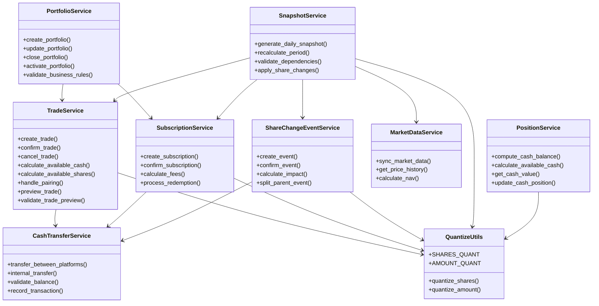

**图表来源**
- [backend/app/services/portfolio_service.py:1-150](file://backend/app/services/portfolio_service.py#L1-L150)
- [backend/app/services/trade_service.py:1-300](file://backend/app/services/trade_service.py#L1-L300)
- [backend/app/services/subscription_service.py:1-250](file://backend/app/services/subscription_service.py#L1-L250)
- [backend/app/services/cash_transfer_service.py:1-200](file://backend/app/services/cash_transfer_service.py#L1-L200)
- [backend/app/services/share_change_event_service.py:1-180](file://backend/app/services/share_change_event_service.py#L1-L180)
- [backend/app/services/snapshot_service.py:1-789](file://backend/app/services/snapshot_service.py#L1-L789)
- [backend/app/services/market_data_service.py:1-323](file://backend/app/services/market_data_service.py#L1-L323)
- [backend/app/services/position_service.py:1-200](file://backend/app/services/position_service.py#L1-L200)
- [backend/app/utils/quantize.py:1-53](file://backend/app/utils/quantize.py#L1-L53)

### 服务层设计原则
- **单一职责**：每个服务类专注于特定业务领域
- **业务规则集中**：所有业务验证和计算逻辑集中在服务层
- **事务管理**：服务层统一处理数据库事务和异常回滚
- **依赖注入**：通过构造函数注入依赖服务，降低耦合度
- **错误处理**：统一的异常类型和业务错误码
- **精度统一**：所有金融计算通过统一的精度量化工具处理

### 服务间交互模式
- **命令模式**：服务方法作为业务操作命令
- **观察者模式**：某些操作触发相关服务的联动处理
- **工厂模式**：复杂对象创建由专门的服务处理
- **工具共享**：精度量化工具被所有金融服务共享使用

章节来源
- [backend/app/services/portfolio_service.py:1-150](file://backend/app/services/portfolio_service.py#L1-L150)
- [backend/app/services/trade_service.py:1-300](file://backend/app/services/trade_service.py#L1-L300)
- [backend/app/services/subscription_service.py:1-250](file://backend/app/services/subscription_service.py#L1-L250)
- [backend/app/services/cash_transfer_service.py:1-200](file://backend/app/services/cash_transfer_service.py#L1-L200)
- [backend/app/services/share_change_event_service.py:1-180](file://backend/app/services/share_change_event_service.py#L1-L180)

## 金融精度处理机制
**新增** 金融精度处理机制是系统的重要改进，确保所有金融计算的准确性和一致性。该机制通过统一的量化函数处理份额和金额的精度问题。

### 精度量化核心特性
- **统一量化标准**：份额和金额均采用2位小数精度，使用ROUND_HALF_UP舍入模式
- **四舍五入规则**：第3位小数>=5进位，<5舍去，符合金融行业惯例
- **负数对称处理**：负数按绝对值四舍五入，远离零进位
- **输入兼容性**：支持Decimal、float、int、str等多种输入类型
- **None透传**：可空字段直接透传，不影响业务流程

### 精度量化工作流程
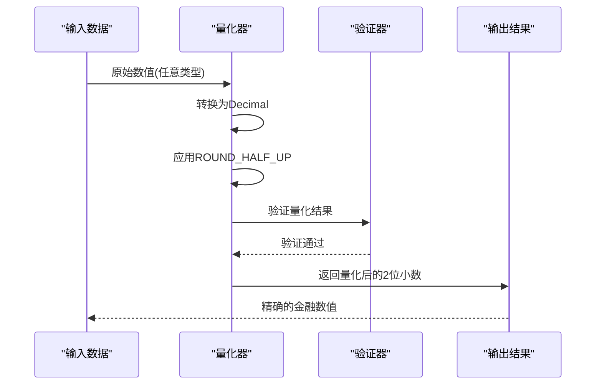

**图表来源**
- [backend/app/utils/quantize.py:28-52](file://backend/app/utils/quantize.py#L28-L52)

### 量化函数实现
系统提供两个核心量化函数：

- **quantize_shares()**：份额量化函数
  - 输入：任意类型的数值（Decimal、float、int、str）
  - 输出：量化到2位小数的Decimal值
  - 舍入模式：ROUND_HALF_UP（四舍五入）
  - 特殊处理：None值原样返回

- **quantize_amount()**：金额量化函数
  - 输入：任意类型的数值（Decimal、float、int、str）
  - 输出：量化到2位小数的Decimal值
  - 舍入模式：ROUND_HALF_UP（四舍五入）
  - 特殊处理：None值原样返回

### 精度处理应用场景
精度量化在以下关键场景中应用：

- **申购确认**：`shares = quantize_shares(amount / nav)`
- **赎回确认**：`amount = quantize_amount(shares × nav)`
- **交易确认**：买卖确认时的份额和金额计算
- **份额事件**：分红、配股等事件的份额变动计算
- **现金转账**：转账金额的精确处理
- **手动市值覆盖**：用户输入的市值数据的量化处理

### 精度处理示例
```python
# 申购确认场景
shares = quantize_shares(Decimal("3000") / Decimal("0.9757"))
# 结果：3074.72（而非3074.715588...）

# 赎回确认场景  
amount = quantize_amount(Decimal("6837.30") * Decimal("1.1024"))
# 结果：7537.44（而非7537.43952）

# 负数处理
negative_shares = quantize_shares(Decimal("-1.235"))
# 结果：-1.24（远离零进位）
```

**章节来源**
- [backend/app/utils/quantize.py:1-53](file://backend/app/utils/quantize.py#L1-L53)
- [backend/tests/integration/test_amount_precision.py:1-200](file://backend/tests/integration/test_amount_precision.py#L1-L200)

## 交易预览功能
**新增** 交易预览功能提供完整的预执行验证机制，确保预览结果与实际交易执行的一致性。该功能通过共享计算函数实现预览和实际执行的统一逻辑。

### 交易预览核心特性
- **预执行验证**：在交易实际提交前进行完整的业务规则验证
- **一致性保证**：预览计算与实际执行使用相同的计算函数，确保结果一致
- **实时可用性检查**：基于当前最新快照和待确认交易计算可用现金和份额
- **费用预估**：提前计算交易费用和净金额
- **风险预警**：识别潜在的交易风险和限制条件

### 交易预览工作流程
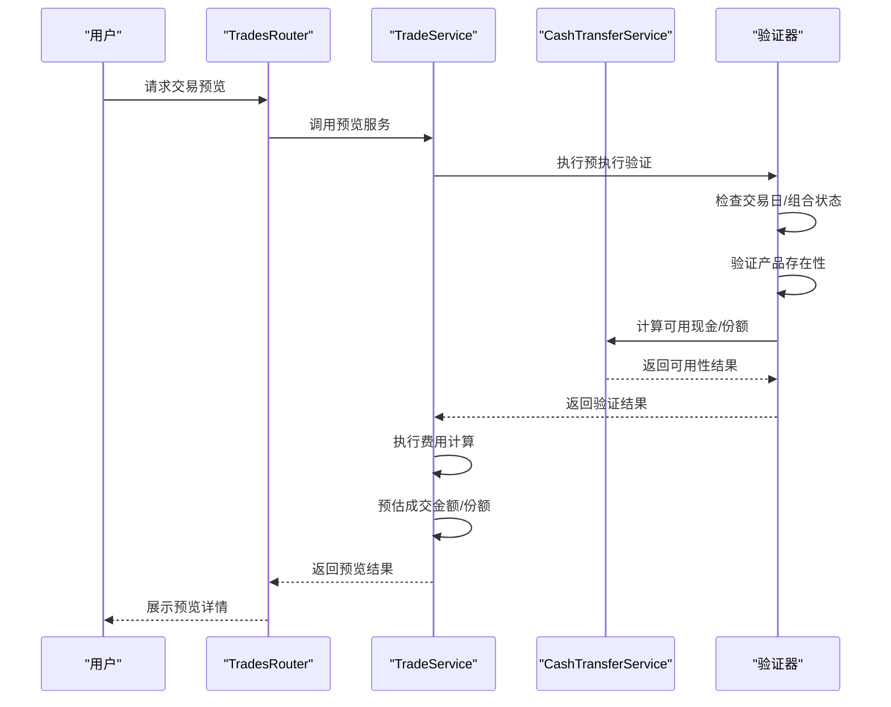

**图表来源**
- [backend/app/routers/trades.py:292-403](file://backend/app/routers/trades.py#L292-L403)
- [backend/app/services/trade_service.py:150-250](file://backend/app/services/trade_service.py#L150-L250)
- [backend/app/services/cash_transfer_service.py:80-150](file://backend/app/services/cash_transfer_service.py#L80-L150)

### 共享计算函数机制
交易预览功能的核心优势在于与真实交易执行共享相同的计算函数：

- **可用性计算共享**：`calculate_available_cash()` 和 `calculate_available_shares()` 同时用于预览和实际执行
- **费用计算共享**：交易费用的计算逻辑在预览和确认阶段完全一致
- **业务规则共享**：所有业务验证规则在预览时即可应用
- **数据一致性**：预览和实际执行基于相同的数据源和计算基准

### 预览结果数据结构
交易预览返回包含以下关键信息的结构化数据：
- **基础信息**：产品类型、市场、交易方向
- **可用性状态**：可用现金、可用份额、冻结情况
- **费用明细**：手续费率、预估费用、净金额
- **风险提示**：可能的限制条件和警告信息
- **模拟结果**：预计成交份额、剩余余额等

### 预览验证规则
- **交易日验证**：检查是否为有效交易日
- **组合状态验证**：确认组合处于可交易状态
- **产品存在性验证**：确保目标产品存在且可交易
- **可用性验证**：实时计算并验证现金和份额充足性
- **业务规则验证**：应用所有相关的业务约束和限制

**章节来源**
- [backend/app/routers/trades.py:292-403](file://backend/app/routers/trades.py#L292-L403)
- [backend/app/services/trade_service.py:150-250](file://backend/app/services/trade_service.py#L150-L250)
- [backend/app/services/cash_transfer_service.py:80-150](file://backend/app/services/cash_transfer_service.py#L80-L150)

## 架构总览
下图展示"交易-行情-快照"的核心交互链路，体现数据流向与职责边界。**新增的精度量化工具贯穿整个交易处理流程**。

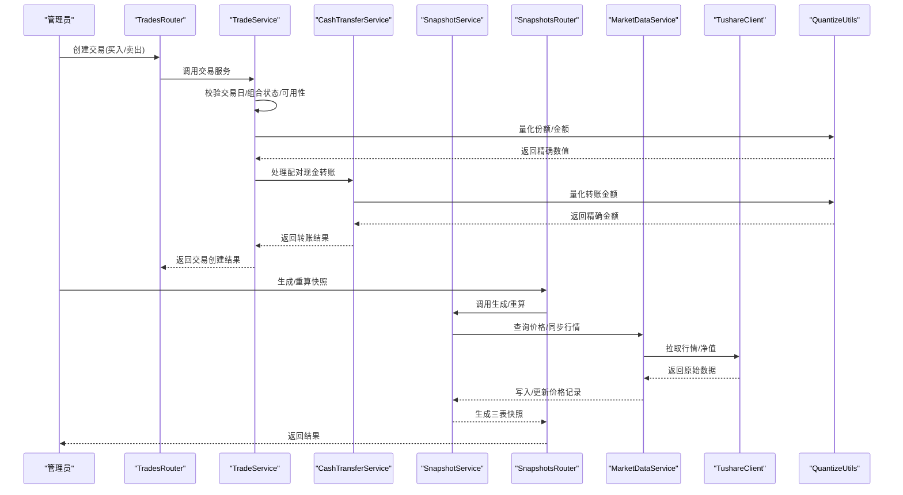

**图表来源**
- [backend/app/routers/trades.py:292-403](file://backend/app/routers/trades.py#L292-L403)
- [backend/app/services/trade_service.py:150-250](file://backend/app/services/trade_service.py#L150-L250)
- [backend/app/services/cash_transfer_service.py:80-150](file://backend/app/services/cash_transfer_service.py#L80-L150)
- [backend/app/routers/snapshots.py:28-87](file://backend/app/routers/snapshots.py#L28-L87)
- [backend/app/services/snapshot_service.py:24-94](file://backend/app/services/snapshot_service.py#L24-L94)
- [backend/app/services/market_data_service.py:88-226](file://backend/app/services/market_data_service.py#L88-L226)
- [backend/app/services/tushare_client.py:123-222](file://backend/app/services/tushare_client.py#L123-222)
- [backend/app/utils/quantize.py:1-53](file://backend/app/utils/quantize.py#L1-L53)

## 详细组件分析

### 投资组合生命周期管理
- 创建：校验唯一性，初始状态为草稿
- 更新：允许修改描述等元信息
- 关闭：仅当无待确认交易时允许；关闭后不可直接交易
- 重新激活：仅已关闭组合可激活
- 净值历史与收益计算：提供历史净值查询与累计/年化收益计算接口

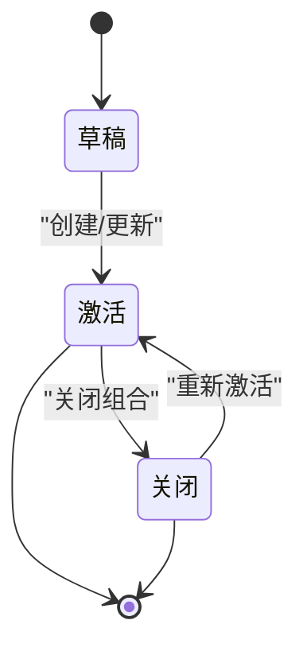

**图表来源**
- [backend/app/routers/portfolios.py:92-157](file://backend/app/routers/portfolios.py#L92-L157)
- [backend/app/services/portfolio_service.py:45-120](file://backend/app/services/portfolio_service.py#L45-L120)

章节来源
- [backend/app/routers/portfolios.py:18-157](file://backend/app/routers/portfolios.py#L18-L157)
- [backend/app/services/portfolio_service.py:1-150](file://backend/app/services/portfolio_service.py#L1-L150)

### 净值计算与份额分账
- 组合净值快照（PortfolioValueSnapshot）
  - 总值 = 持仓市值之和 + 各平台现金余额之和（由 `get_cash_value` → `compute_cash_balance` 统一计算）
  - 总份额来自投资人份额快照汇总或首次以总值/1计算
  - 单位净值 = 总值 / 总份额（保留 4 位小数）
  - 冻结份额：来自待确认赎回
- 投资人份额快照（InvestorHolding）
  - 基于前一日份额与期间内申赎确认进行加权平均成本与份额调整
  - 冻结份额：来自待确认赎回
- 现金显式流水（核心设计）
  - 所有现金变动通过显式 CASH trade 或 event cash_change 记录，不再隐式反推
  - `compute_cash_balance(T) = SUM(confirmed CASH trades WHERE confirm_date <= T) + SUM(confirmed events WHERE ex_date <= T, cash_change != 0)`
  - `calculate_available_cash = compute_cash_balance(latest_snapshot_date) + SUM(confirmed CASH trades WHERE confirm_date > latest_snapshot_date) - SUM(pending CASH sells) + SUM(confirmed event cash_change WHERE ex_date > latest_snapshot_date)`
  - 实时预览调 `compute_cash_balance(today)`，快照生成调 `get_cash_value(date)`（含 `manual_market_value` 绝对替换）
- 现金与份额可用性实时计算
  - 可用现金 = `compute_cash_balance(latest_snapshot_date)` + 快照后已确认 CASH trades - pending CASH sells + 快照后事件 cash_change
  - 可用份额 = 最新快照份额 - 待确认卖出 - 未生成快照期内确认卖出
  - 基金可用份额 = 最新快照份额 - SUM(pending卖出份额) - SUM(confirmed卖出份额 WHERE 快照未生成)
  - 投资人可用份额 = 最新快照份额 - SUM(pending赎回份额) - SUM(confirmed赎回份额 WHERE 快照未生成)

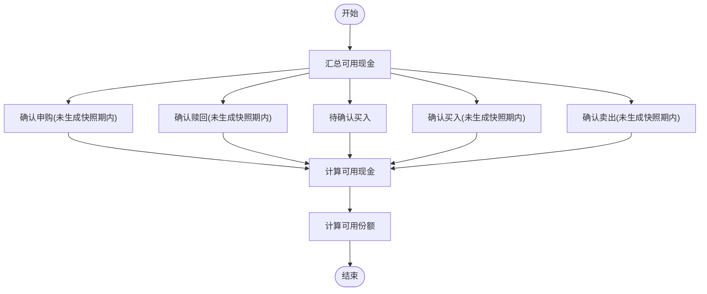

**图表来源**
- [backend/app/routers/trades.py:128-218](file://backend/app/routers/trades.py#L128-L218)
- [backend/app/routers/trades.py:220-269](file://backend/app/routers/trades.py#L220-L269)
- [backend/app/services/trade_service.py:200-280](file://backend/app/services/trade_service.py#L200-L280)

章节来源
- [backend/app/models/portfolio_value_snapshot.py:5-20](file://backend/app/models/portfolio_value_snapshot.py#L5-L20)
- [backend/app/models/investor_holding.py:5-20](file://backend/app/models/investor_holding.py#L5-L20)
- [backend/app/routers/trades.py:128-269](file://backend/app/routers/trades.py#L128-L269)
- [backend/app/services/trade_service.py:150-300](file://backend/app/services/trade_service.py#L150-L300)

### 持仓管理机制
- 持仓快照（PortfolioPosition）
  - 基于前一日快照滚动，应用期间内已确认交易（买入/卖出）
  - 成本价采用加权平均法
  - QDII 产品使用 T-1 日净值，普通产品使用 T 日或最近净值
  - 冻结份额：来自待确认卖出
- 产品维度约束
  - 份额与金额互斥约束，确保净值型产品以份额计量或以金额计量
  - 唯一索引：组合+产品+市场+快照日期

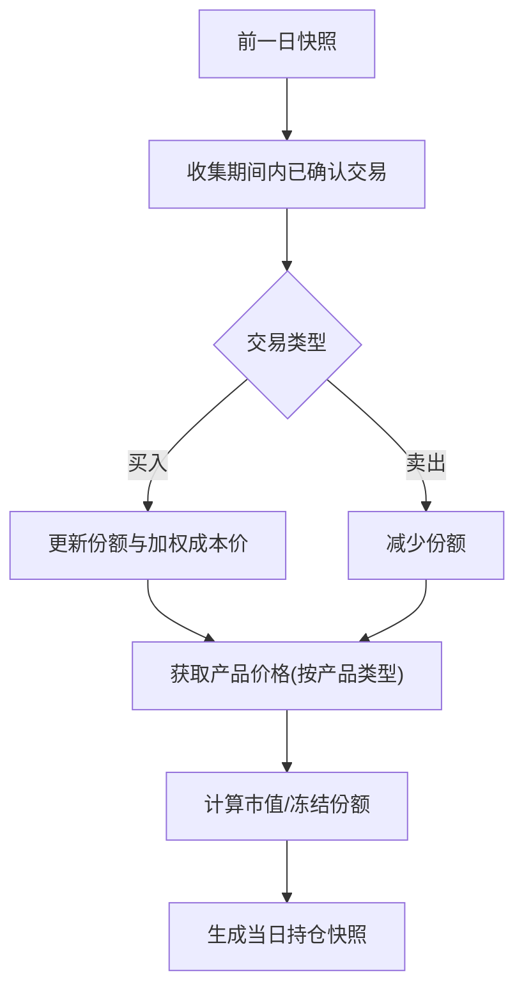

**图表来源**
- [backend/app/services/snapshot_service.py:265-418](file://backend/app/services/snapshot_service.py#L265-L418)
- [backend/app/models/portfolio_position.py:23-33](file://backend/app/models/portfolio_position.py#L23-L33)

章节来源
- [backend/app/models/portfolio_position.py:5-34](file://backend/app/models/portfolio_position.py#L5-L34)
- [backend/app/services/snapshot_service.py:265-418](file://backend/app/services/snapshot_service.py#L265-L418)

### 交易处理流程
- 下单
  - 交易日校验、组合状态校验、产品存在性校验
  - 买入：校验金额>0、可用现金充足；自动计算份额与费用
  - 卖出：校验份额>0、可用份额充足；自动计算金额与费用
  - 状态初始化为 pending
  - **confirm_date 创建时设定**：按 `product.confirm_days` 自动计算（场内0日/场外1日/QDII 2日）
  - **配对 CASH trade**：基金买入/卖出创建时自动生成配对 CASH trade（`transfer_group = "rebal_{uuid}"`），CASH trade 的 `status`/`trade_date`/`confirm_date` 与基金腿完全同步
- 确认
  - 依据产品类型与市场决定是否需要净值：场外净值型产品必须获取 T 日净值（QDII 禁止向前查找）
  - 支持手动指定价格；若未指定则使用系统获取的净值
  - 更新交易金额、份额、确认日期，状态置为 confirmed
  - **transfer_group 原子翻转**：confirm 基金腿时，配对 CASH 腿自动同步为 confirmed
- 取消
  - 仅场外 pending 可取消；场内当天通常不可取消
  - **transfer_group 原子翻转**：cancel 基金腿时，配对 CASH 腿自动同步为 cancelled
- 删除与更新：管理员权限

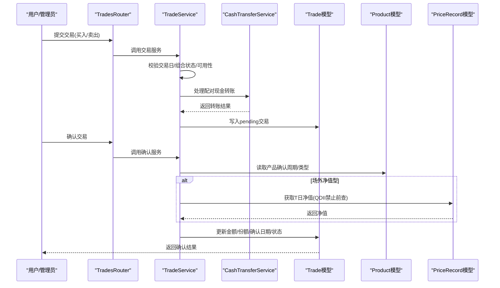

**图表来源**
- [backend/app/routers/trades.py:292-504](file://backend/app/routers/trades.py#L292-L504)
- [backend/app/services/trade_service.py:100-200](file://backend/app/services/trade_service.py#L100-L200)
- [backend/app/services/cash_transfer_service.py:50-120](file://backend/app/services/cash_transfer_service.py#L50-L120)
- [backend/app/models/trade.py:5-32](file://backend/app/models/trade.py#L5-L32)
- [backend/app/models/product.py:5-22](file://backend/app/models/product.py#L5-L22)
- [backend/app/models/price_record.py:5-28](file://backend/app/models/price_record.py#L5-L28)

章节来源
- [backend/app/routers/trades.py:18-567](file://backend/app/routers/trades.py#L18-L567)
- [backend/app/services/trade_service.py:1-300](file://backend/app/services/trade_service.py#L1-L300)

### 现金转账系统
- 内部转账：同一组合内不同平台间的资金调拨
- 外部转账：与外部账户的资金往来
- 转账验证：余额检查、手续费计算、状态管理
- 原子操作：转账成功才生效，失败自动回滚

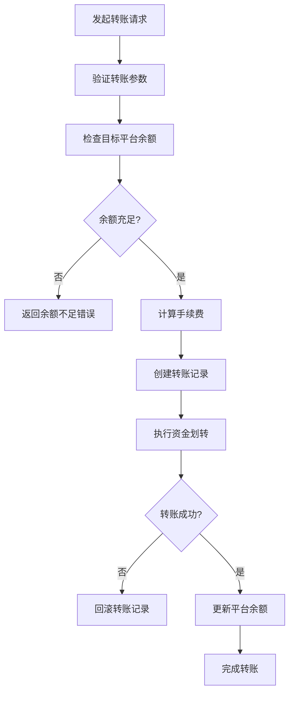

**图表来源**
- [backend/app/services/cash_transfer_service.py:1-200](file://backend/app/services/cash_transfer_service.py#L1-L200)
- [backend/app/routers/cash_transfers.py:1-150](file://backend/app/routers/cash_transfers.py#L1-L150)

章节来源
- [backend/app/services/cash_transfer_service.py:1-200](file://backend/app/services/cash_transfer_service.py#L1-L200)
- [backend/app/routers/cash_transfers.py:1-150](file://backend/app/routers/cash_transfers.py#L1-L150)

### 申购管理系统
- 申购处理：新资金进入组合，增加可用份额
- 赎回处理：资金退出组合，减少可用份额
- 费用计算：根据产品类型和金额计算申购费、赎回费
- 份额确认：按确认日期和净值计算确认份额

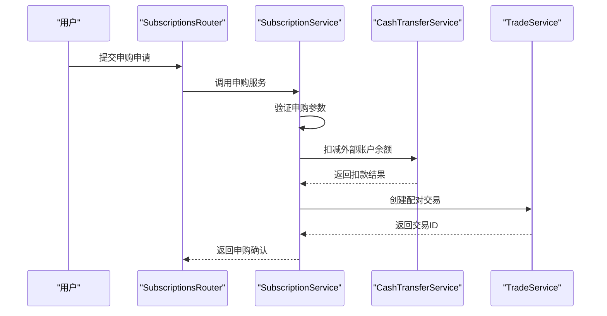

**图表来源**
- [backend/app/services/subscription_service.py:1-250](file://backend/app/services/subscription_service.py#L1-L250)
- [backend/app/routers/subscriptions.py:1-200](file://backend/app/routers/subscriptions.py#L1-L200)

章节来源
- [backend/app/services/subscription_service.py:1-250](file://backend/app/services/subscription_service.py#L1-L250)
- [backend/app/routers/subscriptions.py:1-200](file://backend/app/routers/subscriptions.py#L1-L200)

### 份额变动事件管理
- 事件类型：除权除息、配股、分红、合并拆分等
- 事件分级：基金级事件影响所有平台，平台级事件仅影响指定平台
- 事件确认：按事件日期确认并应用份额变动
- 影响计算：自动计算对持仓成本和份额的影响

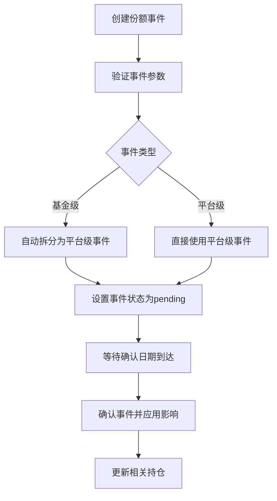

**图表来源**
- [backend/app/services/share_change_event_service.py:1-180](file://backend/app/services/share_change_event_service.py#L1-L180)
- [backend/app/routers/share_change_events.py:1-180](file://backend/app/routers/share_change_events.py#L1-L180)

章节来源
- [backend/app/services/share_change_event_service.py:1-180](file://backend/app/services/share_change_event_service.py#L1-L180)
- [backend/app/routers/share_change_events.py:1-180](file://backend/app/routers/share_change_events.py#L1-L180)

### 快照生成算法
- 三表顺序生成：PortfolioPosition → PortfolioValueSnapshot → InvestorHolding
- 依赖校验：交易日、待确认交易（`apply_date < target_date`）、价格数据完整性、份额变动事件状态（pending 事件 `ex_date <= target_date` 拦截快照）
- 删除旧快照：按日期清理三表记录；**级联回退** `confirm_date==D` 的申购至 pending 并删除关联 CASH trade（`transfer_group="sub_{id}"`），同时回退 `ex_date==D` 或 `entitlement_date==D` 的 confirmed 事件至 pending
- 冻结字段计算：pending 交易导致的冻结份额/金额
- 重算区间：遍历交易日，逐日生成，支持强制跳过校验；**自动扩展**至最新快照日；**自动重确认** `apply_date==D` 的 pending 申购、`confirm_date==D` 的 pending Trade、`ex_date==D` 的 pending Event
- **事件在快照中的应用**：`_generate_portfolio_position` 只读取 `platform_code IS NOT NULL` 的 confirmed 事件（跳过基金级父记录），按 `entitlement_date` 升序应用，使用确认时预计算的 `shares_change`，不重算
- **CASH 持仓由 `get_cash_value` → `compute_cash_balance` 统一计算**，不再在 `_generate_portfolio_position` 中增量累加

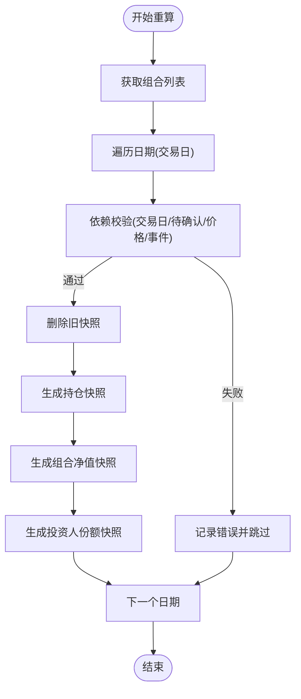

**图表来源**
- [backend/app/services/snapshot_service.py:96-184](file://backend/app/services/snapshot_service.py#L96-L184)
- [backend/app/services/snapshot_service.py:187-217](file://backend/app/services/snapshot_service.py#L187-L217)
- [backend/app/services/snapshot_service.py:247-263](file://backend/app/services/snapshot_service.py#L247-L263)

章节来源
- [backend/app/services/snapshot_service.py:24-184](file://backend/app/services/snapshot_service.py#L24-L184)

### 数据同步策略（Tushare 集成）
- 交易日历：批量拉取指定年份/年份列表，去重合并
- 行情/净值：场内使用 fund_daily，场外使用 fund_nav；按日期去重，保留最新记录
- 写入策略：若存在则更新字段，否则新增；统一标记来源为 tushare；异常时标记数据源状态为 failed
- 组合净值同步：根据持仓与最新价格重新计算并更新当日净值快照

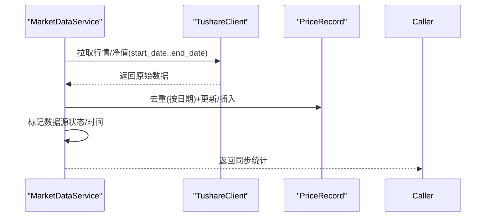

**图表来源**
- [backend/app/services/market_data_service.py:88-226](file://backend/app/services/market_data_service.py#L88-L226)
- [backend/app/services/tushare_client.py:48-222](file://backend/app/services/tushare_client.py#L48-L222)

章节来源
- [backend/app/services/market_data_service.py:1-323](file://backend/app/services/market_data_service.py#L1-L323)
- [backend/app/services/tushare_client.py:1-222](file://backend/app/services/tushare_client.py#L1-L222)

### 业务规则、计算公式与数据验证
- 份额与金额互斥：同一持仓仅能以份额或金额计量之一
- 唯一索引：持仓/净值/份额快照按（组合, 产品, 市场, 平台, 日期）唯一；trade 表 `(transfer_group, product_code, trade_type)` 防止重复确认
- 冻结控制：pending 交易导致的冻结份额/金额，实时计算不读快照
- QDII 净值规则：调仓确认必须使用 T 日净值（禁止向前查找）；快照生成/市值计算使用 T-1 日净值
- **增强的可用性校验**：下单前实时计算可用现金/份额，避免超买/超卖；卖出 pending 不增加可用现金；**交易预览功能确保预览与实际执行的一致性**
- 依赖校验：生成快照前必须满足交易日、无待确认交易（`apply_date < target_date`）、价格数据完整、份额变动事件已确认（pending 事件 `ex_date <= target_date` 拦截快照）
- **持仓表禁止手动操作**：`create_position`/`update_position`/`delete_position` 返回 `POSITION_TABLE_PROTECTED`，快照只能由系统生成
- **交易录入日期约束**：Trade `trade_date`、Subscription `apply_date`、ShareChangeEvent `ex_date` 均须晚于最新快照日（`DATE_BEFORE_SNAPSHOT`）
- **Trade confirm_date 创建时设定**：交易录入时按 `product.confirm_days` 自动计算，不留空后补
- **transfer_group 原子翻转**：confirm/unconfirm/cancel 基金腿时，配对 CASH 腿自动同步状态和 confirm_date
- **事件双日期约束**：`ex_date > entitlement_date` 严格大于（`INVALID_DATE_ORDER`）；两者均须为交易日（`INVALID_EX_DATE`）
- **事件分级**：基金级事件 `platform_code` 为空，确认时自动拆分；平台级事件必须指定 `platform_code`（`PLATFORM_REQUIRED`/`PLATFORM_NOT_ALLOWED`）
- **现金显式流水**：所有现金影响通过 CASH trade 或 event cash_change 显式记录，`compute_cash_balance` 统一计算
- **manual_market_value 覆盖**：`update_cash_position` 写入 `manual_market_value` 表（绝对替换），不再直接改 `portfolio_position`
- **金融精度统一**：所有份额和金额计算使用 `quantize_shares()` 和 `quantize_amount()` 函数，确保2位小数精度

**章节来源**
- [backend/app/models/portfolio_position.py:23-33](file://backend/app/models/portfolio_position.py#L23-L33)
- [backend/app/models/portfolio_value_snapshot.py:17-19](file://backend/app/models/portfolio_value_snapshot.py#L17-L19)
- [backend/app/models/investor_holding.py:17-19](file://backend/app/models/investor_holding.py#L17-L19)
- [backend/app/routers/trades.py:53-106](file://backend/app/routers/trades.py#L53-L106)
- [backend/app/services/snapshot_service.py:578-715](file://backend/app/services/snapshot_service.py#L578-L715)
- [backend/app/utils/quantize.py:1-53](file://backend/app/utils/quantize.py#L1-L53)

## 依赖分析
- 组件耦合
  - SnapshotService 依赖 Trade、Subscription、ShareChangeEvent、PriceRecord、Product、TradingCalendar、Investor 等模型
  - MarketDataService 依赖 TushareClient 与 PriceRecord/Product
  - Router 层通过依赖注入访问数据库会话与当前用户，保证权限与事务边界
  - **新增服务层依赖**：各业务服务之间通过接口调用，保持松耦合
  - **交易预览功能依赖**：预览功能依赖可用性计算服务和业务规则验证器
  - **精度量化工具依赖**：所有金融服务都依赖统一的精度量化工具
- 外部依赖
  - Tushare API：交易日历、场内/场外行情/净值
- 潜在循环依赖
  - 当前结构清晰，无明显循环导入
  - **服务层设计避免了循环依赖**：通过接口抽象和依赖注入解耦

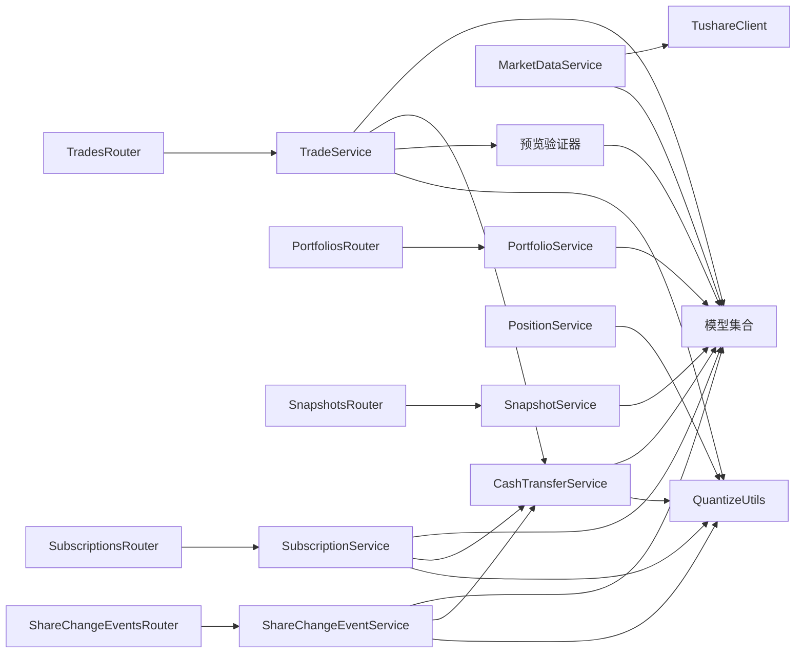

**图表来源**
- [backend/app/services/snapshot_service.py:15-19](file://backend/app/services/snapshot_service.py#L15-L19)
- [backend/app/services/market_data_service.py:12-12](file://backend/app/services/market_data_service.py#L12-L12)
- [backend/app/services/trade_service.py:10-20](file://backend/app/services/trade_service.py#L10-L20)
- [backend/app/services/cash_transfer_service.py:10-15](file://backend/app/services/cash_transfer_service.py#L10-L15)
- [backend/app/services/portfolio_service.py:10-15](file://backend/app/services/portfolio_service.py#L10-L15)
- [backend/app/services/subscription_service.py:10-15](file://backend/app/services/subscription_service.py#L10-L15)
- [backend/app/services/share_change_event_service.py:10-15](file://backend/app/services/share_change_event_service.py#L10-L15)
- [backend/app/services/position_service.py:10-15](file://backend/app/services/position_service.py#L10-L15)
- [backend/app/routers/trades.py:1-16](file://backend/app/routers/trades.py#L1-L16)
- [backend/app/routers/portfolios.py:1-16](file://backend/app/routers/portfolios.py#L1-L16)
- [backend/app/routers/snapshots.py:1-25](file://backend/app/routers/snapshots.py#L1-L25)
- [backend/app/utils/quantize.py:1-53](file://backend/app/utils/quantize.py#L1-L53)

章节来源
- [backend/app/services/snapshot_service.py:1-789](file://backend/app/services/snapshot_service.py#L1-L789)
- [backend/app/services/market_data_service.py:1-323](file://backend/app/services/market_data_service.py#L1-L323)
- [backend/app/services/tushare_client.py:1-222](file://backend/app/services/tushare_client.py#L1-L222)
- [backend/app/services/trade_service.py:1-300](file://backend/app/services/trade_service.py#L1-L300)
- [backend/app/services/cash_transfer_service.py:1-200](file://backend/app/services/cash_transfer_service.py#L1-L200)
- [backend/app/services/portfolio_service.py:1-150](file://backend/app/services/portfolio_service.py#L1-L150)
- [backend/app/services/subscription_service.py:1-250](file://backend/app/services/subscription_service.py#L1-L250)
- [backend/app/services/share_change_event_service.py:1-180](file://backend/app/services/share_change_event_service.py#L1-L180)
- [backend/app/services/position_service.py:1-200](file://backend/app/services/position_service.py#L1-L200)
- [backend/app/routers/trades.py:1-567](file://backend/app/routers/trades.py#L1-L567)
- [backend/app/routers/portfolios.py:1-276](file://backend/app/routers/portfolios.py#L1-L276)
- [backend/app/routers/snapshots.py:1-188](file://backend/app/routers/snapshots.py#L1-L188)
- [backend/app/utils/quantize.py:1-53](file://backend/app/utils/quantize.py#L1-L53)

## 性能考虑
- 批量查询与去重：行情同步阶段对日期去重，避免重复写入
- 内存缓存：一次性加载某产品某市场的既有记录至内存字典，降低多次查询开销
- 事务粒度：快照生成与行情写入均采用单事务，失败回滚，保证一致性
- 查询优化：按日期范围与唯一键过滤，减少扫描范围
- **服务层优化**：
  - 服务方法内部使用批量操作减少数据库往返
  - 异步任务处理耗时操作（如大量数据同步）
  - 连接池复用提高数据库访问效率
  - **交易预览功能优化**：预览计算使用内存缓存，避免重复数据库查询
  - **精度量化优化**：量化函数使用高效的Decimal运算，避免浮点误差
- 建议
  - 对高频查询建立合适索引（如按日期、产品、组合的复合索引）
  - 对历史回补任务采用分批/限速策略，避免瞬时压力过大
  - **监控服务层性能指标**：响应时间、错误率、资源使用情况
  - **监控交易预览性能**：预览响应时间和缓存命中率
  - **监控精度量化性能**：量化操作的CPU消耗和内存使用

## 故障排查指南
- 快照生成失败
  - 检查依赖校验：是否存在待确认交易、价格数据是否完整、是否为交易日
  - 查看错误日志与回滚记录，定位具体失败步骤
- 行情同步异常
  - 确认 Tushare Token 配置正确
  - 检查网络与 API 限流情况，关注异常重试与状态标记
- 交易确认失败
  - 场外净值型产品需 T 日净值；QDII 严禁前查
  - 若手动指定价格，需确保数值合理
- **交易预览问题排查**：
  - 检查预览计算逻辑与实际执行逻辑的一致性
  - 验证可用性计算函数的输入参数和数据源
  - 确认预览结果与实际执行结果的差异分析
  - 检查预览功能的缓存机制和性能指标
- 可用性校验失败
  - 检查最新快照日期与期间内确认/待确认交易的时间边界
  - 核对现金与份额的计算口径是否一致
- **服务层故障排查**：
  - 检查服务间调用链路的异常传播
  - 验证事务边界是否正确划分
  - 查看服务方法的输入参数验证日志
  - 监控服务层的性能指标和错误率
- **精度处理问题排查**：
  - 检查量化函数的输入数据类型和精度
  - 验证ROUND_HALF_UP舍入模式的正确性
  - 确认所有金融计算都使用了统一的量化函数
  - 检查Decimal运算的精度损失问题

**章节来源**
- [backend/app/services/snapshot_service.py:90-94](file://backend/app/services/snapshot_service.py#L90-L94)
- [backend/app/services/market_data_service.py:135-139](file://backend/app/services/market_data_service.py#L135-L139)
- [backend/app/services/tushare_client.py:38-46](file://backend/app/services/tushare_client.py#L38-L46)
- [backend/app/routers/trades.py:84-94](file://backend/app/routers/trades.py#L84-L94)
- [backend/app/services/trade_service.py:250-300](file://backend/app/services/trade_service.py#L250-L300)
- [backend/app/utils/quantize.py:1-53](file://backend/app/utils/quantize.py#L1-L53)

## 结论
InvestRing 的核心业务围绕"组合-产品-交易-净值-份额"闭环构建，通过严格的依赖校验、冻结控制与三表快照顺序生成，确保净值与份额的准确与一致。**新增的金融精度处理机制进一步增强了系统的可靠性和准确性**，通过统一的量化函数确保所有金融计算的精度一致性。**改进的交易预览功能**通过预执行验证和共享计算函数确保预览结果与实际执行的一致性。**标准化的开发工作流程**提高了团队协作效率和代码质量。新的服务层架构将业务逻辑从路由层解耦，提高了代码的可维护性和可测试性。Tushare 集成提供了可靠的历史与实时数据来源，配合路由层的权限控制与服务层的事务封装，形成高内聚、低耦合的后端架构。建议在生产环境中持续完善索引、监控与告警体系，保障大规模数据与高并发下的稳定性。

## 附录
- 业务场景示例（路径指引）
  - 新建组合并启用：[组合路由:39-90](file://backend/app/routers/portfolios.py#L39-L90)
  - 关闭组合前检查：[组合路由:92-132](file://backend/app/routers/portfolios.py#L92-L132)
  - 生成单日快照：[快照路由:28-56](file://backend/app/routers/snapshots.py#L28-L56)
  - 重算区间快照：[快照路由:58-87](file://backend/app/routers/snapshots.py#L58-L87)
  - 同步产品行情：[行情服务:88-226](file://backend/app/services/market_data_service.py#L88-L226)
  - 交易下单与确认：[交易路由:292-504](file://backend/app/routers/trades.py#L292-L504)
  - **交易预览功能**：[交易预览路由:292-403](file://backend/app/routers/trades.py#L292-L403)
  - 查询组合净值历史：[组合路由:159-192](file://backend/app/routers/portfolios.py#L159-L192)
  - 计算组合收益：[组合路由:194-242](file://backend/app/routers/portfolios.py#L194-L242)
  - 组合现金流统计：[组合路由:244-276](file://backend/app/routers/portfolios.py#L244-L276)
  - **新增服务层示例**：
    - 现金转账处理：[现金转账服务:50-150](file://backend/app/services/cash_transfer_service.py#L50-L150)
    - 交易服务调用：[交易服务:100-200](file://backend/app/services/trade_service.py#L100-L200)
    - **交易预览功能**：[交易预览服务:150-250](file://backend/app/services/trade_service.py#L150-L250)
    - 申购服务处理：[申购服务:80-180](file://backend/app/services/subscription_service.py#L80-L180)
    - 份额事件管理：[份额事件服务:60-140](file://backend/app/services/share_change_event_service.py#L60-L140)
    - 组合服务操作：[组合服务:30-100](file://backend/app/services/portfolio_service.py#L30-L100)
    - 持仓服务操作：[持仓服务:28-112](file://backend/app/services/position_service.py#L28-L112)
  - **金融精度处理示例**：
    - 份额量化函数：[份额量化:28-38](file://backend/app/utils/quantize.py#L28-L38)
    - 金额量化函数：[金额量化:41-52](file://backend/app/utils/quantize.py#L41-L52)
    - 精度测试用例：[精度测试:1-155](file://backend/tests/unit/test_quantize.py#L1-L155)
    - 金额精度测试：[金额精度测试:1-200](file://backend/tests/integration/test_amount_precision.py#L1-L200)
    - 份额精度测试：[份额精度测试:1-200](file://backend/tests/integration/test_shares_precision.py#L1-L200)
    - 快照净值严格匹配测试：[快照净值测试:1-200](file://backend/tests/integration/test_snapshot_nav_strict.py#L1-L200)