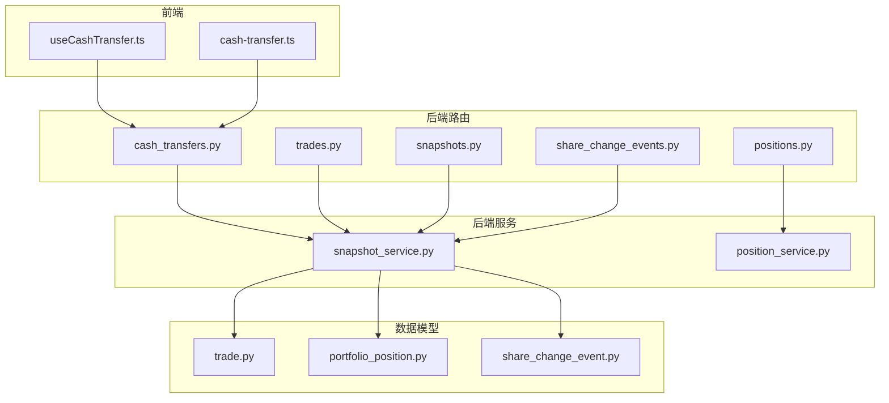
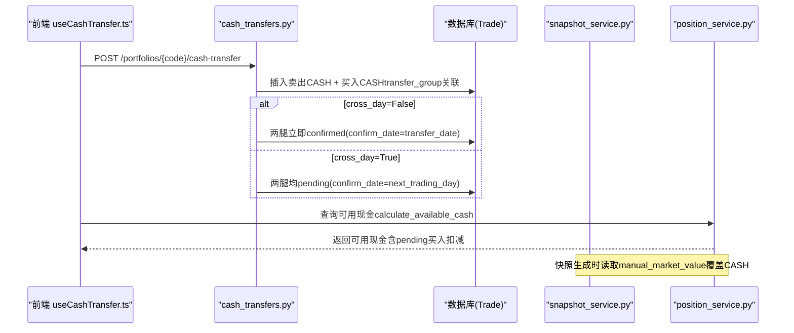
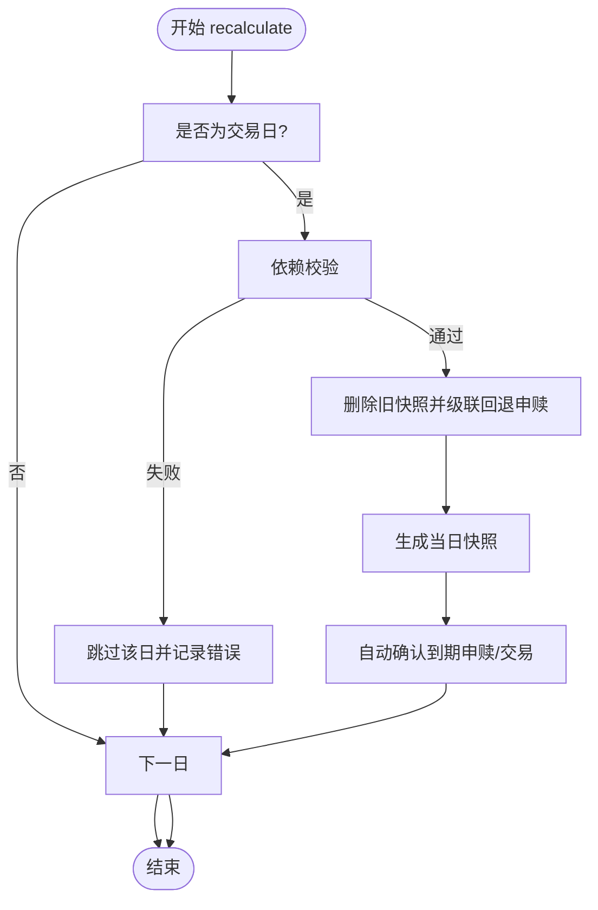
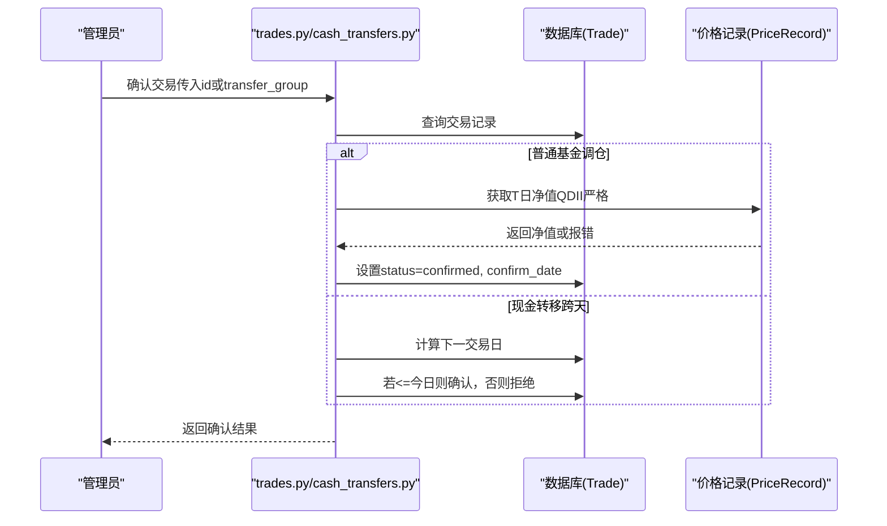
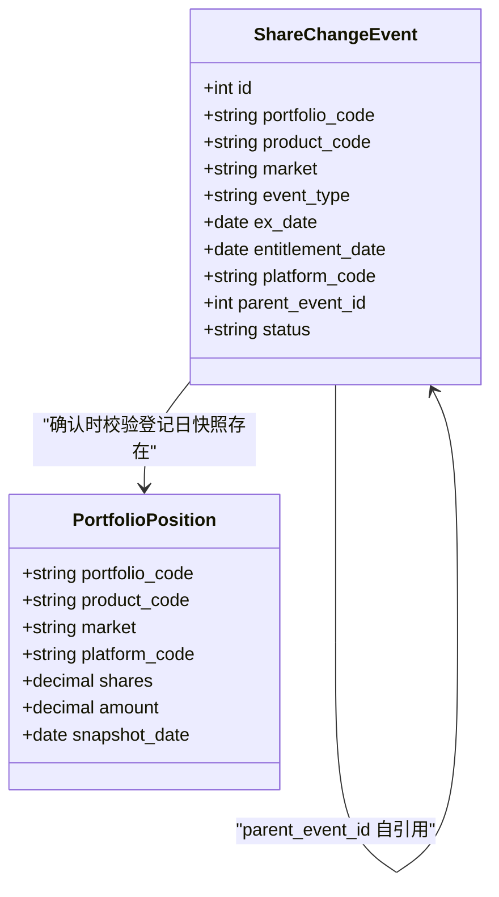
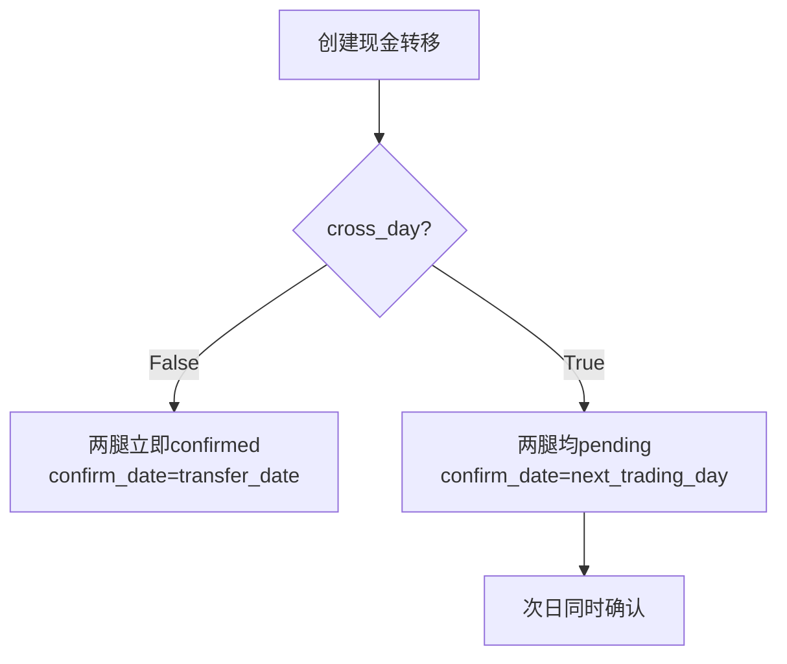
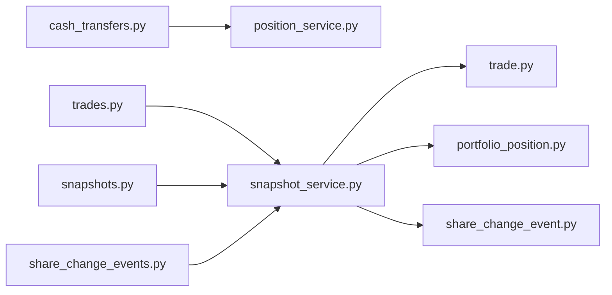

# 现金与交易录入重构迭代方案

<cite>
**本文引用的文件**   
- [Docs/08-现金与交易录入重构迭代方案.md](file://Docs/08-现金与交易录入重构迭代方案.md)
- [snapshot_service.py](file://backend/app/services/snapshot_service.py)
- [trades.py](file://backend/app/routers/trades.py)
- [cash_transfers.py](file://backend/app/routers/cash_transfers.py)
- [share_change_events.py](file://backend/app/routers/share_change_events.py)
- [position_service.py](file://backend/app/services/position_service.py)
- [positions.py](file://backend/app/routers/positions.py)
- [trade.py](file://backend/app/models/trade.py)
- [portfolio_position.py](file://backend/app/models/portfolio_position.py)
- [share_change_event.py](file://backend/app/models/share_change_event.py)
- [snapshots.py](file://backend/app/routers/snapshots.py)
- [useCashTransfer.ts](file://frontend/src/hooks/useCashTransfer.ts)
- [cash-transfer.ts](file://frontend/src/types/cash-transfer.ts)
</cite>

## 目录
1. [引言](#引言)
2. [项目结构](#项目结构)
3. [核心组件](#核心组件)
4. [架构总览](#架构总览)
5. [详细组件分析](#详细组件分析)
6. [依赖关系分析](#依赖关系分析)
7. [性能考量](#性能考量)
8. [故障排查指南](#故障排查指南)
9. [结论](#结论)
10. [附录](#附录)

## 引言
本方案围绕 InvestRing 后端的“现金模型、快照体系、交易录入流程、份额变动事件”进行集中重构，目标是：
- 确立快照表为唯一真相源，禁止手动改写
- 规范三类交易（Trade、Subscription、ShareChangeEvent）的录入与确认规则
- 引入手动市值层（manual_market_value），隔离非净值资产重估对流水语义的污染
- 修复 QDII T+2 闸门误杀等关键缺陷，完善删快照→重生成闭环
- 明确现金转移跨天模式与 transfer_group 原子性要求

## 项目结构
本次重构涉及后端服务层、路由层、数据模型以及前端交互。整体分层清晰：
- 路由层：负责请求校验、权限控制、调用服务
- 服务层：封装业务逻辑（快照生成、自动确认、可用资金计算等）
- 模型层：定义数据库表结构与约束
- 前端：提供创建/确认现金转移等操作的用户界面与状态管理

图表来源
- [cash_transfers.py:1-318](file://backend/app/routers/cash_transfers.py#L1-L318)
- [trades.py:1-649](file://backend/app/routers/trades.py#L1-L649)
- [snapshots.py:58-111](file://backend/app/routers/snapshots.py#L58-L111)
- [share_change_events.py:1-183](file://backend/app/routers/share_change_events.py#L1-L183)
- [snapshot_service.py:1-200](file://backend/app/services/snapshot_service.py#L1-L200)
- [position_service.py:1-249](file://backend/app/services/position_service.py#L1-L249)
- [trade.py:1-33](file://backend/app/models/trade.py#L1-L33)
- [portfolio_position.py:1-35](file://backend/app/models/portfolio_position.py#L1-L35)
- [share_change_event.py:1-37](file://backend/app/models/share_change_event.py#L1-L37)
- [useCashTransfer.ts:1-71](file://frontend/src/hooks/useCashTransfer.ts#L1-L71)
- [cash-transfer.ts:1-36](file://frontend/src/types/cash-transfer.ts#L1-L36)

章节来源
- [Docs/08-现金与交易录入重构迭代方案.md:31-49](file://Docs/08-现金与交易录入重构迭代方案.md#L31-L49)

## 核心组件
- 快照服务（snapshot_service.py）
  - 生成/重算三张快照表（持仓、市值、投资人持有）
  - 自动确认申赎与 Trade（apply_date==D/confirm_date==D/ex_date==D 的 pending 记录）
  - 硬闸门检查 pending 交易（区分 trade_date 与 confirm_date，已修复 QDII 误杀）
  - pending 事件拦截快照生成（ex_date <= target_date 的 pending 事件导致检查返回 failed）
  - 事件在快照中应用：_generate_portfolio_position 读取 confirmed 事件按 entitlement_date 升序应用
- 交易路由（trades.py）
  - 创建 Trade（一律 pending，confirm_date 创建时按 confirm_days 自动计算）
  - 确认 Trade（按 confirm_days 推算 confirm_date；QDII 严格取 T 日净值）
  - 配对 CASH trade：基金买入/卖出自动生成配对 CASH trade（transfer_group = "rebal_{uuid}"）
  - transfer_group 原子翻转：confirm/unconfirm/cancel 基金腿时，配对 CASH 腿自动同步
  - 取消/删除 Trade（pending 可操作）
- 现金转移路由（cash_transfers.py）
  - 一次转移生成两条 CASH Trade（卖出+买入），通过 transfer_group 关联
  - 当天完成：两腿立即 confirmed（confirm_date = transfer_date）
  - 跨天到账：两腿均 pending（confirm_date = next_trading_day），次日同时 confirm（对称状态）
- 份额变动事件路由（share_change_events.py）
  - 确认事件时校验登记日持仓快照存在
  - 确认时自动回写：从 entitlement_date 快照读取 entitlement_shares，预计算 shares_change/cash_change
  - 基金级事件自动拆分：确认时为每个有持仓的平台生成子记录（parent_event_id 关联）
  - 事件在快照中应用：_generate_portfolio_position 读取 confirmed 事件按 entitlement_date 升序应用
- 可用资金计算（position_service.py）
  - 已替换为 compute_cash_balance 显式流水模式
  - compute_cash_balance(T) = SUM(confirmed CASH trades WHERE confirm_date <= T) + SUM(confirmed events WHERE ex_date <= T, cash_change != 0)
  - 实时预览调 compute_cash_balance(today)，快照生成调 get_cash_value(date)（含 manual_market_value 绝对替换）
- 现金手工更新（positions.py）
  - 已改道 manual_market_value 表（绝对替换），不再直接改 portfolio_position
  - 写入后提示用户重新生成快照
  - 持仓表禁止手动操作：create_position/update_position/delete_position 返回 POSITION_TABLE_PROTECTED（违反“唯一真相源”原则，需改道 manual_market_value）

章节来源
- [snapshot_service.py:119-200](file://backend/app/services/snapshot_service.py#L119-L200)
- [trades.py:331-547](file://backend/app/routers/trades.py#L331-L547)
- [cash_transfers.py:51-249](file://backend/app/routers/cash_transfers.py#L51-L249)
- [share_change_events.py:92-128](file://backend/app/routers/share_change_events.py#L92-L128)
- [position_service.py:18-143](file://backend/app/services/position_service.py#L18-L143)
- [positions.py:349-439](file://backend/app/routers/positions.py#L349-L439)

## 架构总览
下图展示从前端到后端的关键调用链与数据流，重点体现现金转移与快照生成的交互。

图表来源
- [cash_transfers.py:51-190](file://backend/app/routers/cash_transfers.py#L51-L190)
- [position_service.py:18-143](file://backend/app/services/position_service.py#L18-L143)
- [snapshot_service.py:119-200](file://backend/app/services/snapshot_service.py#L119-L200)

## 详细组件分析

### 组件A：快照服务（recalculate_snapshots 与 auto_confirm_after_snapshot）
- recalculate_snapshots
  - 遍历交易日区间，执行依赖校验、删除旧快照、重新生成快照、自动确认
  - 若 end_date 之后仍有快照，自动扩展重算区间至最新快照日
- auto_confirm_after_snapshot
  - 已扩展至 Subscription（apply_date==D）、Trade（confirm_date==D）、Event（ex_date==D）
  - 单笔失败不影响整批，按 apply_date/confirm_date/ex_date 升序处理

图表来源
- [snapshot_service.py:119-200](file://backend/app/services/snapshot_service.py#L119-L200)
- [snapshot_service.py:838-916](file://backend/app/services/snapshot_service.py#L838-L916)

章节来源
- [snapshot_service.py:119-200](file://backend/app/services/snapshot_service.py#L119-L200)
- [snapshot_service.py:838-916](file://backend/app/services/snapshot_service.py#L838-L916)

### 组件B：交易确认流程（confirm_trade 与 confirm_cash_transfer）
- confirm_trade（trades.py）
  - 仅 pending 可确认；未传 confirm_date 时按产品 confirm_days 推算
  - 净值型产品（OEF/LOF + CN_OTC）必须获取 T 日净值；QDII 缺失则拒绝
- confirm_cash_transfer（cash_transfers.py）
  - 针对跨天买入 leg，下一交易日才允许确认；未到日期返回 TRANSFER_NOT_READY

图表来源
- [trades.py:460-547](file://backend/app/routers/trades.py#L460-L547)
- [cash_transfers.py:193-249](file://backend/app/routers/cash_transfers.py#L193-L249)

章节来源
- [trades.py:460-547](file://backend/app/routers/trades.py#L460-L547)
- [cash_transfers.py:193-249](file://backend/app/routers/cash_transfers.py#L193-L249)

### 组件C：份额变动事件（ShareChangeEvent）
- 已落地
  - 确认事件时自动回写 shares_change/cash_change 到快照
  - pending 事件拦截快照生成（ex_date <= target_date 的 pending 事件导致检查返回 failed）
  - 双日期级联回退（ex_date 与 entitlement_date 任一被删快照即回退至 pending）
  - 事件分级：基金级事件确认时自动拆分为各平台子记录（parent_event_id 关联）
  - ex_date > entitlement_date 严格约束
  - 平台级事件必填 platform_code（PLATFORM_REQUIRED/PLATFORM_NOT_ALLOWED）

图表来源
- [share_change_event.py:1-37](file://backend/app/models/share_change_event.py#L1-L37)
- [portfolio_position.py:1-35](file://backend/app/models/portfolio_position.py#L1-L35)
- [share_change_events.py:92-128](file://backend/app/routers/share_change_events.py#L92-L128)

章节来源
- [share_change_events.py:92-128](file://backend/app/routers/share_change_events.py#L92-L128)
- [share_change_event.py:1-37](file://backend/app/models/share_change_event.py#L1-L37)
- [portfolio_position.py:1-35](file://backend/app/models/portfolio_position.py#L1-L35)

### 组件D：现金转移（cross_day 与 transfer_group）
- 数据结构
  - 复用 Trade 表，一次转移生成两条 CASH 交易记录，通过 transfer_group 关联
- 当天 vs 跨天（对称状态）
  - cross_day=False：两腿立即 confirmed（confirm_date = transfer_date）
  - cross_day=True：两腿均 pending（confirm_date = next_trading_day），次日同时 confirm
  - 对称状态保证 D 日 NAV 不因在途转移虚跌（compute_cash_balance 不计入 pending）
- 前端交互
  - useCashTransfer.ts 提供创建与确认跨天转移的 Hook

图表来源
- [cash_transfers.py:51-190](file://backend/app/routers/cash_transfers.py#L51-L190)
- [cash_transfers.py:193-249](file://backend/app/routers/cash_transfers.py#L193-L249)
- [useCashTransfer.ts:20-70](file://frontend/src/hooks/useCashTransfer.ts#L20-L70)

章节来源
- [cash_transfers.py:51-249](file://backend/app/routers/cash_transfers.py#L51-L249)
- [useCashTransfer.ts:1-71](file://frontend/src/hooks/useCashTransfer.ts#L1-L71)

## 依赖关系分析
- 路由与服务耦合
  - cash_transfers.py 依赖 position_service.calculate_available_cash 做可用现金校验
  - trades.py 内部也实现了 _calculate_available_cash（与 position_service 统一）
- 快照服务依赖
  - snapshot_service.py 依赖 trading_calendar、price_record、product 等基础数据
  - auto_confirm_after_snapshot 已扩展至 Subscription、Trade 和 Event
- 事件与快照
  - share_change_events.py 确认事件依赖 portfolio_position 快照存在性
  - 事件应用与级联回退已在 snapshot_service.py 中落地
  - pending 事件拦截快照生成（ex_date <= target_date 的 pending 事件导致检查返回 failed）

图表来源
- [cash_transfers.py:1-318](file://backend/app/routers/cash_transfers.py#L1-L318)
- [trades.py:1-649](file://backend/app/routers/trades.py#L1-L649)
- [snapshots.py:58-111](file://backend/app/routers/snapshots.py#L58-L111)
- [share_change_events.py:1-183](file://backend/app/routers/share_change_events.py#L1-L183)
- [snapshot_service.py:1-200](file://backend/app/services/snapshot_service.py#L1-L200)
- [trade.py:1-33](file://backend/app/models/trade.py#L1-L33)
- [portfolio_position.py:1-35](file://backend/app/models/portfolio_position.py#L1-L35)
- [share_change_event.py:1-37](file://backend/app/models/share_change_event.py#L1-L37)

章节来源
- [cash_transfers.py:1-318](file://backend/app/routers/cash_transfers.py#L1-L318)
- [trades.py:1-649](file://backend/app/routers/trades.py#L1-L649)
- [snapshot_service.py:1-200](file://backend/app/services/snapshot_service.py#L1-L200)

## 性能考量
- 快照重算区间扩展：当 end_date 之后仍存在快照时，自动扩展至最新快照日，避免遗漏依赖链
- 自动确认批量处理：按 apply_date 升序处理，单笔失败不影响整批，便于定位与重试
- 可用资金计算：当前多次全表扫描，建议在热点路径引入缓存或优化查询条件（如平台过滤）

[本节为通用指导，不直接分析具体文件]

## 故障排查指南
- QDII T+2 被闸门误杀（已修复）
  - 现象：QDII 调仓 D 日录入，D+1 快照被拒
  - 根因：使用 trade_date < target_date 判断 pending，未考虑 confirm_date
  - 修复：Trade 分支改用 confirm_date <= target_date，并对 confirm_date is None 回退原逻辑
- 删快照→重生成卡死（已修复）
  - 场景 B/C/D：跨天现金买入腿、QDII 在途、pending 事件导致 regen 无法自愈
  - 修复：闸门修复 + Trade 侧自愈 + 事件应用/级联
- 事件仅 warning 不拦截（已修复）
  - 现象：pending 事件不阻止快照生成
  - 修复：将 _check_share_change_events 由 warning 改为 failed，并在生成阶段应用事件

章节来源
- [Docs/08-现金与交易录入重构迭代方案.md:433-487](file://Docs/08-现金与交易录入重构迭代方案.md#L433-L487)
- [Docs/08-现金与交易录入重构迭代方案.md:489-505](file://Docs/08-现金与交易录入重构迭代方案.md#L489-L505)
- [snapshot_service.py:936-965](file://backend/app/services/snapshot_service.py#L936-L965)
- [snapshot_service.py:1042-1060](file://backend/app/services/snapshot_service.py#L1042-L1060)

## 结论
本次重构以“快照为唯一真相源”为核心原则，规范三类交易的录入与确认流程，引入手动市值层隔离非净值资产重估，修复 QDII 闸门误杀与 regen 闭环缺陷，并明确现金转移跨天模式与 transfer_group 原子性要求。开发完成后应按验收清单逐项验证，确保系统稳健性与可维护性。

[本节为总结，不直接分析具体文件]

## 附录
- 代码定位参考（函数名锚点）
  - snapshot_service.py：recalculate_snapshots、auto_confirm_after_snapshot、_check_pending_transactions、_check_share_change_events
  - trades.py：create_trade、confirm_trade、unconfirm_trade
  - cash_transfers.py：create_cash_transfer、confirm_cash_transfer
  - share_change_events.py：confirm_share_change_event
  - position_service.py：calculate_available_cash
  - positions.py：update_cash_position

章节来源
- [Docs/08-现金与交易录入重构迭代方案.md:646-671](file://Docs/08-现金与交易录入重构迭代方案.md#L646-L671)