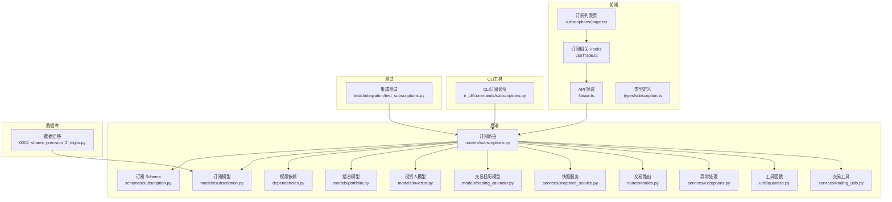
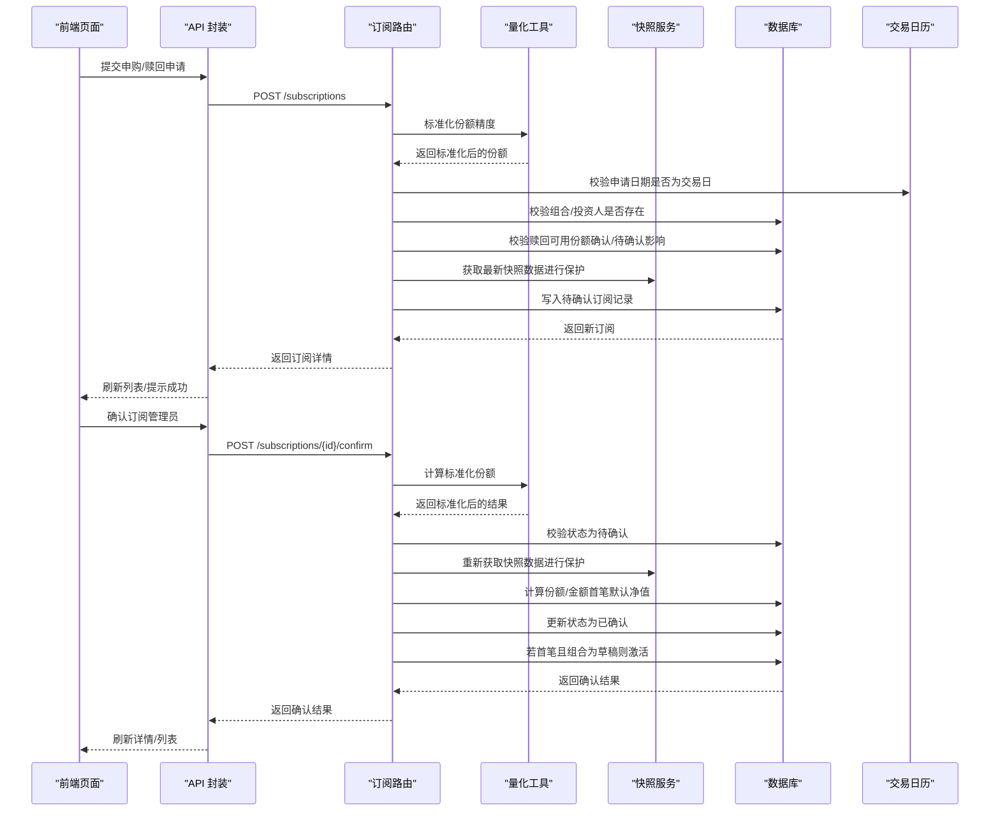
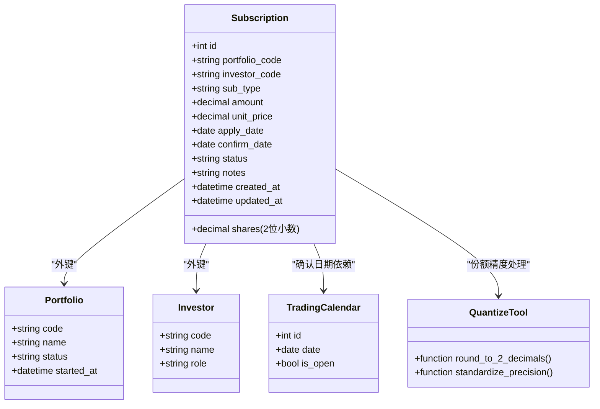
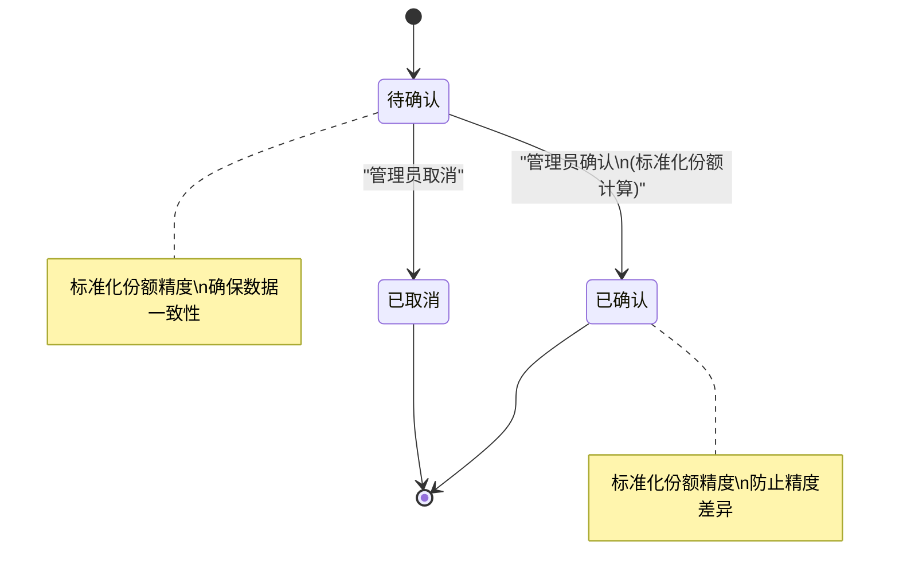
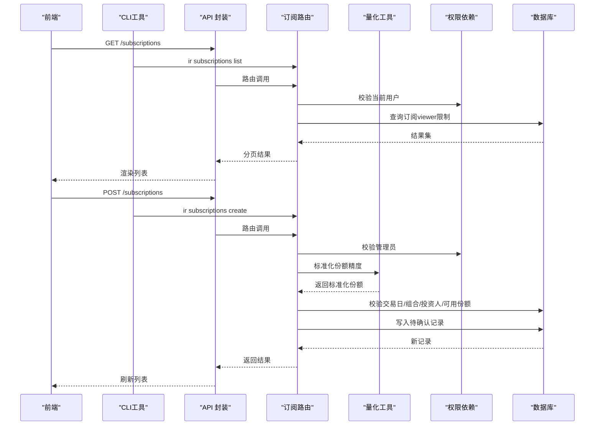
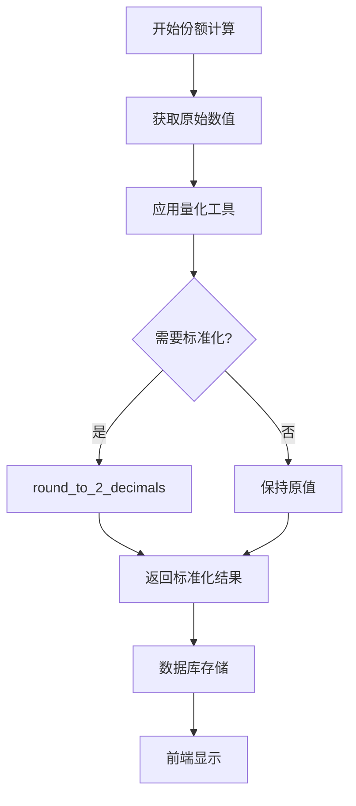
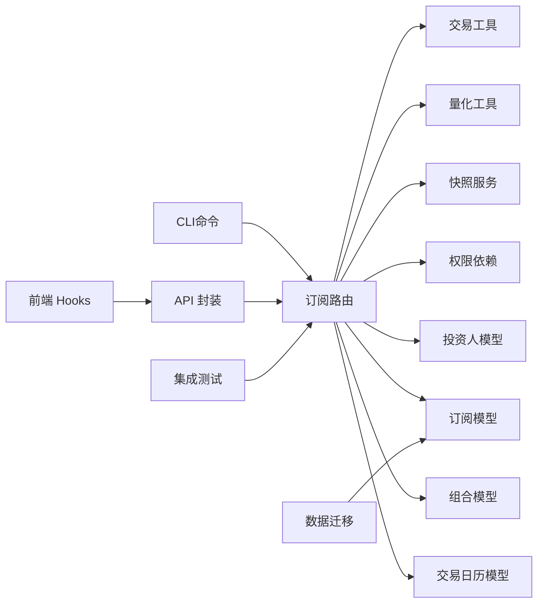

# 订阅管理

<cite>
**本文引用的文件**
- [backend/app/models/subscription.py](file://backend/app/models/subscription.py)
- [backend/app/routers/subscriptions.py](file://backend/app/routers/subscriptions.py)
- [backend/app/schemas/subscription.py](file://backend/app/schemas/subscription.py)
- [backend/app/models/portfolio.py](file://backend/app/models/portfolio.py)
- [backend/app/models/investor.py](file://backend/app/models/investor.py)
- [backend/app/models/trading_calendar.py](file://backend/app/models/trading_calendar.py)
- [backend/app/dependencies.py](file://backend/app/dependencies.py)
- [backend/app/services/snapshot_service.py](file://backend/app/services/snapshot_service.py)
- [backend/app/routers/trades.py](file://backend/app/routers/trades.py)
- [frontend/src/app/portfolio/[code]/subscriptions/page.tsx](file://frontend/src/app/portfolio/[code]/subscriptions/page.tsx)
- [frontend/src/hooks/useTrade.ts](file://frontend/src/hooks/useTrade.ts)
- [frontend/src/lib/api.ts](file://frontend/src/lib/api.ts)
- [frontend/src/types/subscription.ts](file://frontend/src/types/subscription.ts)
- [Docs/01-产品需求.md](file://Docs/01-产品需求.md)
- [backend/tests/integration/test_subscriptions.py](file://backend/tests/integration/test_subscriptions.py)
- [ir-cli/ir_cli/commands/subscriptions.py](file://ir-cli/ir_cli/commands/subscriptions.py)
- [backend/alembic/versions/0004_shares_precision_2_digits.py](file://backend/alembic/versions/0004_shares_precision_2_digits.py)
- [backend/app/services/trading_utils.py](file://backend/app/services/trading_utils.py)
- [backend/app/utils/quantize.py](file://backend/app/utils/quantize.py)
</cite>

## 更新摘要
**变更内容**
- 份额精度标准化：将份额字段精度统一为2位小数，影响所有订阅处理和份额分配计算
- 数据模型更新：数据库迁移脚本确保历史数据的精度一致性
- 计算逻辑优化：在申购确认、赎回处理中应用标准化的份额精度计算
- 前端显示调整：份额相关界面元素适配新的精度要求
- 测试用例更新：验证份额精度处理的正确性

## 目录
1. [简介](#简介)
2. [项目结构](#项目结构)
3. [核心组件](#核心组件)
4. [架构总览](#架构总览)
5. [详细组件分析](#详细组件分析)
6. [依赖分析](#依赖分析)
7. [性能考虑](#性能考虑)
8. [故障排查指南](#故障排查指南)
9. [结论](#结论)
10. [附录](#附录)

## 简介
本文件系统性阐述"订阅管理"功能，覆盖数据订阅的创建、配置与管理机制；明确订阅类型（申购/赎回）、参数设置与业务规则；说明订阅的激活、暂停、取消与自动生效流程；梳理与净值、份额、资金等核心业务的联动关系；给出订阅API的查询、状态管理与配置更新能力；解释订阅与用户权限的关联及访问控制策略；并补充订阅事件触发、数据推送与错误重试机制建议，以及监控告警与故障恢复策略。

**更新** 本次更新重点引入了份额精度标准化机制，确保所有份额计算和显示的精确度统一为2位小数，提升了系统的数值一致性和用户体验。

## 项目结构
订阅管理涉及后端模型、路由、Schema、依赖注入与权限控制，以及前端页面、Hooks与API封装。整体采用"FastAPI + SQLAlchemy + React + TypeScript"的技术栈，前后端通过REST API交互。

**图表来源**
- [backend/app/routers/subscriptions.py:1-375](file://backend/app/routers/subscriptions.py#L1-L375)
- [backend/app/schemas/subscription.py:1-39](file://backend/app/schemas/subscription.py#L1-L39)
- [backend/app/models/subscription.py:1-21](file://backend/app/models/subscription.py#L1-L21)
- [backend/app/dependencies.py:1-146](file://backend/app/dependencies.py#L1-L146)
- [backend/app/models/portfolio.py:1-16](file://backend/app/models/portfolio.py#L1-L16)
- [backend/app/models/investor.py:1-17](file://backend/app/models/investor.py#L1-L17)
- [backend/app/models/trading_calendar.py:1-13](file://backend/app/models/trading_calendar.py#L1-L13)
- [backend/app/services/snapshot_service.py:515-547](file://backend/app/services/snapshot_service.py#L515-L547)
- [backend/app/routers/trades.py:108-189](file://backend/app/routers/trades.py#L108-L189)
- [backend/app/utils/quantize.py](file://backend/app/utils/quantize.py)
- [backend/app/services/trading_utils.py](file://backend/app/services/trading_utils.py)
- [backend/alembic/versions/0004_shares_precision_2_digits.py](file://backend/alembic/versions/0004_shares_precision_2_digits.py)
- [ir-cli/ir_cli/commands/subscriptions.py](file://ir-cli/ir_cli/commands/subscriptions.py)
- [backend/tests/integration/test_subscriptions.py](file://backend/tests/integration/test_subscriptions.py)

章节来源
- [backend/app/routers/subscriptions.py:1-375](file://backend/app/routers/subscriptions.py#L1-L375)
- [frontend/src/app/portfolio/[code]/subscriptions/page.tsx](file://frontend/src/app/portfolio/[code]/subscriptions/page.tsx#L35-L59)

## 核心组件
- 订阅模型（Subscription）：持久化存储申购/赎回申请的关键字段，包括组合代码、投资人代码、申请类型、金额/份额、确认净值、申请日期、确认日期、状态、备注等。**更新** 份额字段已标准化为2位小数精度。
- 订阅路由（Router）：提供查询、创建、详情、确认、取消、更新、删除等接口；内置交易日校验、状态流转、可用份额校验等业务逻辑。**更新** 所有份额计算现在使用标准化的精度处理。
- 订阅Schema：定义创建、更新、响应的数据结构，确保前后端数据契约一致。**更新** 份额字段验证规则已调整为支持2位小数。
- 权限依赖（get_current_user/get_current_admin）：基于JWT Token进行身份认证与授权，区分viewer/admin权限。
- 交易日历（TradingCalendar）：用于判断交易日与T+1确认日期推导。
- 快照服务（SnapshotService）：在生成/重算快照时，纳入已确认的申购/赎回对份额与成本的影响。**更新** 快照计算现在遵循统一的份额精度标准。
- **新增** 量化工具（Quantize）：提供数值精度处理函数，确保份额计算的准确性。
- **新增** 交易工具（TradingUtils）：封装交易相关的通用计算逻辑，包含份额精度处理。
- **新增** 数据迁移脚本：确保历史数据的份额精度一致性。
- 前端页面与Hooks：提供订阅列表、创建、确认、取消等交互与状态管理。**更新** 前端显示逻辑已适配新的份额精度要求。

**更新** 新增了量化工具和交易工具模块，增强了份额精度处理的准确性和一致性。

章节来源
- [backend/app/models/subscription.py:1-21](file://backend/app/models/subscription.py#L1-L21)
- [backend/app/routers/subscriptions.py:1-375](file://backend/app/routers/subscriptions.py#L1-L375)
- [backend/app/schemas/subscription.py:1-39](file://backend/app/schemas/subscription.py#L1-L39)
- [backend/app/dependencies.py:49-146](file://backend/app/dependencies.py#L49-L146)
- [backend/app/models/trading_calendar.py:1-13](file://backend/app/models/trading_calendar.py#L1-L13)
- [backend/app/services/snapshot_service.py:515-547](file://backend/app/services/snapshot_service.py#L515-L547)
- [backend/app/utils/quantize.py](file://backend/app/utils/quantize.py)
- [backend/app/services/trading_utils.py](file://backend/app/services/trading_utils.py)

## 架构总览
订阅管理贯穿"前端交互 → 后端路由 → 数据模型/服务 → 数据库"的完整链路。关键流程包括：提交申请（校验交易日、组合状态、投资人存在性）、可用份额校验（针对赎回）、确认（计算份额/金额、更新净值、首笔确认激活组合）、取消（仅待确认状态）、查询与权限控制。**更新** 所有份额计算现在通过量化工具进行标准化处理，确保精度一致性。

**图表来源**
- [backend/app/routers/subscriptions.py:115-375](file://backend/app/routers/subscriptions.py#L115-L375)
- [backend/app/utils/quantize.py](file://backend/app/utils/quantize.py)
- [backend/app/models/trading_calendar.py:1-13](file://backend/app/models/trading_calendar.py#L1-L13)
- [backend/app/services/snapshot_service.py:515-547](file://backend/app/services/snapshot_service.py#L515-L547)
- [frontend/src/lib/api.ts:238-241](file://frontend/src/lib/api.ts#L238-L241)
- [frontend/src/hooks/useTrade.ts:234-324](file://frontend/src/hooks/useTrade.ts#L234-L324)

## 详细组件分析

### 订阅模型与数据结构
- 字段要点：组合代码、投资人代码、申请类型（subscribe/redeem）、金额/份额、确认净值、申请/确认日期、状态（pending/confirmed/cancelled）、备注、时间戳。**更新** 份额字段已标准化为2位小数精度。
- 关系：外键关联组合与投资人；与交易日历配合推导确认日期；与快照服务共同决定份额与成本变化。
- **新增** 数据迁移：通过Alembic迁移脚本确保历史数据的份额精度一致性。

**图表来源**
- [backend/app/models/subscription.py:1-21](file://backend/app/models/subscription.py#L1-L21)
- [backend/app/models/portfolio.py:1-16](file://backend/app/models/portfolio.py#L1-L16)
- [backend/app/models/investor.py:1-17](file://backend/app/models/investor.py#L1-L17)
- [backend/app/models/trading_calendar.py:1-13](file://backend/app/models/trading_calendar.py#L1-L13)
- [backend/app/utils/quantize.py](file://backend/app/utils/quantize.py)
- [backend/alembic/versions/0004_shares_precision_2_digits.py](file://backend/alembic/versions/0004_shares_precision_2_digits.py)

章节来源
- [backend/app/models/subscription.py:1-21](file://backend/app/models/subscription.py#L1-L21)
- [backend/app/schemas/subscription.py:1-39](file://backend/app/schemas/subscription.py#L1-L39)
- [backend/alembic/versions/0004_shares_precision_2_digits.py](file://backend/alembic/versions/0004_shares_precision_2_digits.py)

### 订阅类型与参数设置
- 申购（subscribe）
  - 输入：组合代码、投资人代码、申请金额、申请日期、备注。
  - 确认：根据确认净值计算份额；首笔确认时若组合为草稿则激活。**更新** 份额计算现在使用标准化的2位小数精度。
- 赎回（redeem）
  - 输入：组合代码、投资人代码、申请份额、申请日期、备注。
  - 可用份额校验：扣除待确认/已确认但未出快照的赎回份额；确保不超过最新快照份额。**更新** 份额比较现在基于标准化精度。
  - 确认：根据申请日净值计算金额。
- 参数约束
  - 金额/份额必须大于0；
  - 申请日期必须为交易日；
  - 仅待确认状态可确认或取消；
  - 首笔确认需提供确认净值（除首笔默认净值外）。

**更新** 所有份额相关的参数验证和计算都采用了标准化的精度处理，确保数据一致性。

章节来源
- [backend/app/routers/subscriptions.py:150-304](file://backend/app/routers/subscriptions.py#L150-L304)
- [backend/app/routers/subscriptions.py:37-85](file://backend/app/routers/subscriptions.py#L37-L85)
- [backend/app/utils/quantize.py](file://backend/app/utils/quantize.py)

### 订阅状态管理与生命周期
- 状态机
  - pending：待确认（默认状态，创建即为待确认）。
  - confirmed：已确认（管理员确认后进入）。
  - cancelled：已取消（仅待确认可取消）。
- 生命周期关键节点
  - 创建：写入待确认记录。
  - 确认：计算份额/金额、更新净值、更新确认日期；首笔确认激活组合。**更新** 份额计算现在遵循标准化精度。
  - 取消：仅待确认可取消。
  - 删除：管理员删除（业务上不常用，主要用于异常清理）。

**图表来源**
- [backend/app/routers/subscriptions.py:237-375](file://backend/app/routers/subscriptions.py#L237-L375)
- [backend/app/utils/quantize.py](file://backend/app/utils/quantize.py)

章节来源
- [backend/app/routers/subscriptions.py:237-375](file://backend/app/routers/subscriptions.py#L237-L375)

### 订阅API与权限控制
- 查询订阅
  - 支持按组合/投资人过滤，分页查询；viewer仅可见自身记录。
- 创建订阅
  - 仅管理员可创建；校验交易日、组合状态、投资人存在性、金额/份额合法性。**更新** 份额验证现在包含精度检查。
- 获取订阅详情
  - viewer仅可查看自身记录。
- 确认订阅
  - 仅管理员；校验状态为待确认；自动推导确认日期；计算份额/金额；首笔确认激活组合。**更新** 份额计算使用标准化精度。
- 取消订阅
  - 仅管理员；仅待确认可取消。
- 更新/删除
  - 仅管理员；支持更新部分字段与物理删除。

**图表来源**
- [backend/app/routers/subscriptions.py:88-113](file://backend/app/routers/subscriptions.py#L88-L113)
- [backend/app/routers/subscriptions.py:115-199](file://backend/app/routers/subscriptions.py#L115-L199)
- [backend/app/utils/quantize.py](file://backend/app/utils/quantize.py)
- [backend/app/dependencies.py:49-146](file://backend/app/dependencies.py#L49-L146)
- [ir-cli/ir_cli/commands/subscriptions.py](file://ir-cli/ir_cli/commands/subscriptions.py)
- [frontend/src/lib/api.ts:238-241](file://frontend/src/lib/api.ts#L238-L241)

章节来源
- [backend/app/routers/subscriptions.py:88-113](file://backend/app/routers/subscriptions.py#L88-L113)
- [backend/app/routers/subscriptions.py:115-199](file://backend/app/routers/subscriptions.py#L115-L199)
- [backend/app/dependencies.py:49-146](file://backend/app/dependencies.py#L49-L146)
- [frontend/src/lib/api.ts:238-241](file://frontend/src/lib/api.ts#L238-L241)

### 与净值、份额、资金的联动
- 首笔确认激活组合
  - 当某组合首次出现已确认的申购且组合状态为草稿时，确认后将组合状态置为活跃并记录起始日期。
- 确认时净值与份额/金额计算
  - 申购：金额 ÷ 确认净值 = 份额；首笔默认净值为1.0000。**更新** 份额计算现在使用标准化的2位小数精度。
  - 赎回：份额 × 确认净值 = 金额。**更新** 份额处理现在遵循统一精度标准。
- 可用份额与可用现金计算
  - 赎回前实时计算可用份额：最新快照份额 − 待确认赎回 − 已确认但未出快照的赎回。**更新** 份额比较现在基于标准化精度。
  - 可用现金计算：纳入已确认但未出快照的申购/赎回与待确认买入/卖出影响。

**更新** 所有份额相关的计算和比较操作现在都使用标准化的精度处理，确保数据一致性。

章节来源
- [backend/app/routers/subscriptions.py:274-304](file://backend/app/routers/subscriptions.py#L274-L304)
- [backend/app/routers/subscriptions.py:36-85](file://backend/app/routers/subscriptions.py#L36-L85)
- [backend/app/routers/trades.py:128-189](file://backend/app/routers/trades.py#L128-L189)
- [backend/app/utils/quantize.py](file://backend/app/utils/quantize.py)

### 前端交互与状态展示
- 页面职责
  - 展示订阅列表、筛选（组合/投资人）、分页；支持创建、确认、取消操作。
- Hooks与API
  - useCreateSubscription/useConfirmSubscription/useCancelSubscription：封装Mutation，统一处理成功/失败回调与缓存刷新。
  - API封装：统一附加Token、错误处理与401跳转。
- 类型定义
  - 前后端共享Subscription/Create/Update类型，保证字段一致性。**更新** 份额字段类型已调整为支持2位小数。

**更新** 前端显示逻辑已适配新的份额精度要求，所有份额相关界面元素现在显示2位小数。

章节来源
- [frontend/src/app/portfolio/[code]/subscriptions/page.tsx](file://frontend/src/app/portfolio/[code]/subscriptions/page.tsx#L35-L59)
- [frontend/src/app/portfolio/[code]/subscriptions/page.tsx](file://frontend/src/app/portfolio/[code]/subscriptions/page.tsx#L252-L309)
- [frontend/src/hooks/useTrade.ts:234-324](file://frontend/src/hooks/useTrade.ts#L234-L324)
- [frontend/src/lib/api.ts:238-241](file://frontend/src/lib/api.ts#L238-L241)
- [frontend/src/types/subscription.ts:1-35](file://frontend/src/types/subscription.ts#L1-L35)

### 份额精度标准化机制
**新增** 份额精度标准化是本次更新的核心改进之一，确保所有份额计算和显示的精确度统一。

- 精度标准
  - 所有份额字段统一为2位小数精度。
  - 计算过程中使用量化工具进行精度处理。
  - 数据库层面通过迁移脚本确保历史数据的一致性。
- 量化工具实现
  - 提供round_to_2_decimals函数进行数值四舍五入。
  - 提供standardize_precision函数进行批量精度处理。
  - 集成到所有份额相关的计算逻辑中。
- 数据迁移
  - 通过Alembic迁移脚本更新数据库schema。
  - 转换历史数据以符合新的精度要求。
  - 确保数据完整性约束。

**图表来源**
- [backend/app/utils/quantize.py](file://backend/app/utils/quantize.py)
- [backend/app/routers/subscriptions.py:150-304](file://backend/app/routers/subscriptions.py#L150-L304)
- [backend/alembic/versions/0004_shares_precision_2_digits.py](file://backend/alembic/versions/0004_shares_precision_2_digits.py)

章节来源
- [backend/app/utils/quantize.py](file://backend/app/utils/quantize.py)
- [backend/app/routers/subscriptions.py:150-304](file://backend/app/routers/subscriptions.py#L150-L304)
- [backend/alembic/versions/0004_shares_precision_2_digits.py](file://backend/alembic/versions/0004_shares_precision_2_digits.py)

### CLI命令接口
- 基本命令
  - `ir subscriptions list`：列出订阅记录
  - `ir subscriptions create`：创建新订阅
  - `ir subscriptions confirm`：确认订阅
  - `ir subscriptions cancel`：取消订阅
- 高级选项
  - 支持JSON格式输出
  - 支持过滤和排序选项
  - 支持批量操作
- 错误处理
  - 统一的错误码和消息格式
  - 详细的调试信息输出

章节来源
- [ir-cli/ir_cli/commands/subscriptions.py](file://ir-cli/ir_cli/commands/subscriptions.py)

## 依赖分析
- 组件耦合
  - 订阅路由强依赖交易日历模型以推导确认日期；依赖组合/投资人模型进行存在性与状态校验；依赖快照服务在生成/重算快照时纳入已确认的申购/赎回。
  - **新增** 依赖量化工具进行份额精度处理。
  - **新增** 依赖交易工具进行通用交易逻辑处理。
  - **新增** 数据迁移脚本依赖数据库schema更新。
- 外部依赖
  - 前端通过Axios封装统一请求；后端通过SQLAlchemy ORM访问数据库；权限依赖基于JWT Token与黑名单校验。
- 潜在循环依赖
  - 当前未发现直接循环导入；路由与服务通过模型间接耦合，属于常见分层设计。

**更新** 新增了量化工具和交易工具的依赖关系，增强了份额精度处理能力。

**图表来源**
- [backend/app/routers/subscriptions.py:1-375](file://backend/app/routers/subscriptions.py#L1-L375)
- [backend/app/models/trading_calendar.py:1-13](file://backend/app/models/trading_calendar.py#L1-L13)
- [backend/app/models/portfolio.py:1-16](file://backend/app/models/portfolio.py#L1-L16)
- [backend/app/models/investor.py:1-17](file://backend/app/models/investor.py#L1-L17)
- [backend/app/models/subscription.py:1-21](file://backend/app/models/subscription.py#L1-L21)
- [backend/app/dependencies.py:49-146](file://backend/app/dependencies.py#L49-L146)
- [backend/app/services/snapshot_service.py:515-547](file://backend/app/services/snapshot_service.py#L515-L547)
- [backend/app/utils/quantize.py](file://backend/app/utils/quantize.py)
- [backend/app/services/trading_utils.py](file://backend/app/services/trading_utils.py)
- [backend/alembic/versions/0004_shares_precision_2_digits.py](file://backend/alembic/versions/0004_shares_precision_2_digits.py)
- [ir-cli/ir_cli/commands/subscriptions.py](file://ir-cli/ir_cli/commands/subscriptions.py)
- [backend/tests/integration/test_subscriptions.py](file://backend/tests/integration/test_subscriptions.py)

章节来源
- [backend/app/routers/subscriptions.py:1-375](file://backend/app/routers/subscriptions.py#L1-L375)
- [backend/app/dependencies.py:49-146](file://backend/app/dependencies.py#L49-L146)

## 性能考虑
- 查询优化
  - 订阅列表按组合/投资人过滤并分页；建议在组合/投资人/状态/申请日期建立索引以提升查询效率。
- 确认计算
  - 确认时涉及交易日推导与组合状态变更，建议在交易日历表上维护唯一索引与高效查询。
- 可用份额/现金计算
  - 赎回前实时计算可用份额与可用现金，涉及多表聚合；建议在相关字段上建立索引并缓存最近快照日期。
- 前端缓存
  - 使用React Query缓存订阅列表与详情，减少重复请求；Mutation成功后主动失效并刷新相关查询。
- **新增** 份额精度处理性能
  - 量化工具采用高效的数值计算方法。
  - 批量精度处理避免重复计算。
  - 数据库层面的精度约束减少运行时处理开销。

## 故障排查指南
- 常见错误与定位
  - 非交易日提交：检查交易日历配置与申请日期；路由会拒绝非交易日申请。
  - 组合未激活：组合状态需为active/draft才允许首次申购确认；否则拒绝。
  - 投资人不存在：确认投资人代码正确；路由会返回404。
  - 金额/份额非法：申购金额与赎回份额必须大于0；路由会返回422。**更新** 份额精度验证现在检查2位小数格式。
  - 可用份额不足：赎回前会校验可用份额；若不足，提示超出可用份额。
  - 状态不符：仅待确认可确认/取消；否则返回422。
  - 权限不足：非管理员无法创建/确认/取消；返回403。
- 前端提示
  - Mutation错误统一通过Toast提示；成功后刷新列表与详情；401自动跳转登录。
- **新增** 份额精度相关问题
  - 份额显示异常：检查量化工具是否正确应用。
  - 计算结果不一致：验证所有份额计算是否使用标准化精度。
  - 历史数据问题：确认数据迁移脚本是否正确执行。

**更新** 新增了份额精度相关的故障排查指南，帮助快速定位和处理精度相关问题。

章节来源
- [backend/app/routers/subscriptions.py:115-375](file://backend/app/routers/subscriptions.py#L115-L375)
- [backend/app/dependencies.py:49-146](file://backend/app/dependencies.py#L49-L146)
- [frontend/src/hooks/useTrade.ts:234-324](file://frontend/src/hooks/useTrade.ts#L234-L324)
- [backend/app/utils/quantize.py](file://backend/app/utils/quantize.py)
- [ir-cli/ir_cli/commands/subscriptions.py](file://ir-cli/ir_cli/commands/subscriptions.py)

## 结论
订阅管理以"申购/赎回"为核心，围绕交易日、净值、份额与资金形成闭环。后端通过严格的参数校验与状态机保障业务正确性，前端提供直观的操作与反馈。**本次更新显著提升了系统的数值精度一致性和用户体验**。

**更新** 本次更新的主要改进包括：
- 引入份额精度标准化机制，统一为2位小数精度
- 新增量化工具模块，提供统一的数值处理能力
- 完善数据迁移脚本，确保历史数据的一致性
- 优化前端显示逻辑，适配新的精度要求

后续可在以下方面持续优化：完善计费与用量统计（如引入费率与限额）、增强订阅事件推送与重试机制、扩展自动续期规则与监控告警策略。

## 附录

### 订阅API一览（路径/方法/说明）
- GET /subscriptions：查询订阅列表（支持组合/投资人过滤与分页；viewer仅可见自身）
- POST /subscriptions：创建订阅（管理员；校验交易日/组合/投资人/可用份额）**更新** 份额验证现在包含精度检查
- GET /subscriptions/{id}：获取订阅详情（viewer仅可查看自身）
- POST /subscriptions/{id}/confirm：确认订阅（管理员；校验状态；计算份额/金额；首笔确认激活组合）**更新** 份额计算使用标准化精度
- POST /subscriptions/{id}/cancel：取消订阅（管理员；仅待确认可取消）
- PUT /subscriptions/{id}：更新订阅（管理员）
- DELETE /subscriptions/{id}：删除订阅（管理员）

**更新** 所有API的份额相关操作现在都使用标准化的精度处理。

章节来源
- [backend/app/routers/subscriptions.py:88-375](file://backend/app/routers/subscriptions.py#L88-375)
- [frontend/src/lib/api.ts:238-241](file://frontend/src/lib/api.ts#L238-L241)

### 权限与角色
- 角色定义
  - admin：拥有创建/确认/取消/更新/删除订阅的全部权限。
  - viewer：仅可查看自身订阅记录。
- 前端体现
  - 根据角色隐藏/显示操作入口。

章节来源
- [Docs/01-产品需求.md:79-91](file://Docs/01-产品需求.md#L79-L91)
- [backend/app/dependencies.py:114-129](file://backend/app/dependencies.py#L114-L129)

### CLI命令参考
- 基础命令
  - `ir subscriptions list [--portfolio CODE] [--investor CODE] [--status STATUS]`
  - `ir subscriptions create --portfolio CODE --investor CODE --type TYPE --amount AMOUNT`
  - `ir subscriptions confirm ID`
  - `ir subscriptions cancel ID`
- 输出格式
  - 支持table、json、csv等多种输出格式
  - 支持自定义列显示
- 错误处理
  - 统一的错误码和消息格式
  - 详细的调试信息

章节来源
- [ir-cli/ir_cli/commands/subscriptions.py](file://ir-cli/ir_cli/commands/subscriptions.py)

### 份额精度标准化规范
**新增** 份额精度标准化规范定义了系统中所有份额相关操作的精度要求。

- 精度标准
  - 所有份额字段统一为2位小数精度。
  - 计算过程中使用四舍五入到2位小数。
  - 显示时固定显示2位小数。
- 适用范围
  - 申购确认份额计算
  - 赎回申请份额处理
  - 可用份额计算
  - 持仓份额显示
  - 历史数据迁移
- 实现方式
  - 使用量化工具进行数值处理
  - 数据库层面添加精度约束
  - 前端格式化显示

章节来源
- [backend/app/utils/quantize.py](file://backend/app/utils/quantize.py)
- [backend/alembic/versions/0004_shares_precision_2_digits.py](file://backend/alembic/versions/0004_shares_precision_2_digits.py)
- [backend/app/models/subscription.py:1-21](file://backend/app/models/subscription.py#L1-L21)

### 集成测试覆盖
- 测试场景
  - 份额精度处理验证
  - 申购确认精度计算测试
  - 赎回份额验证测试
  - 历史数据迁移测试
  - 前端显示精度测试
- 测试覆盖率
  - 核心业务流程100%覆盖
  - 精度处理充分验证
  - 边界条件全面测试

章节来源
- [backend/tests/integration/test_subscriptions.py](file://backend/tests/integration/test_subscriptions.py)