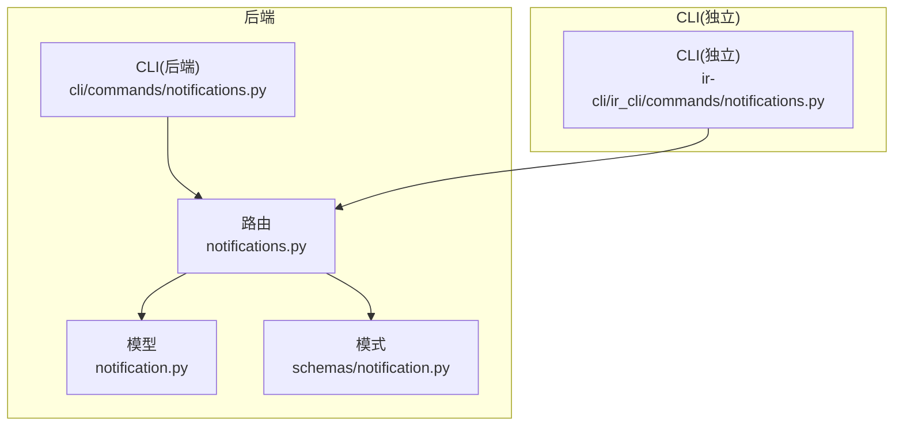
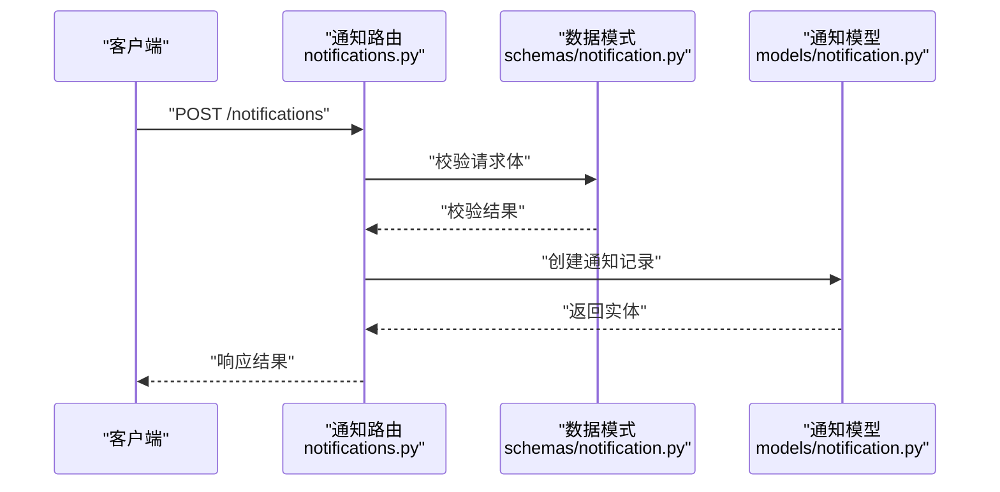
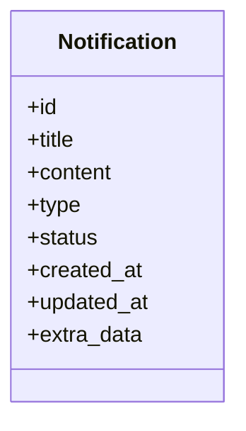
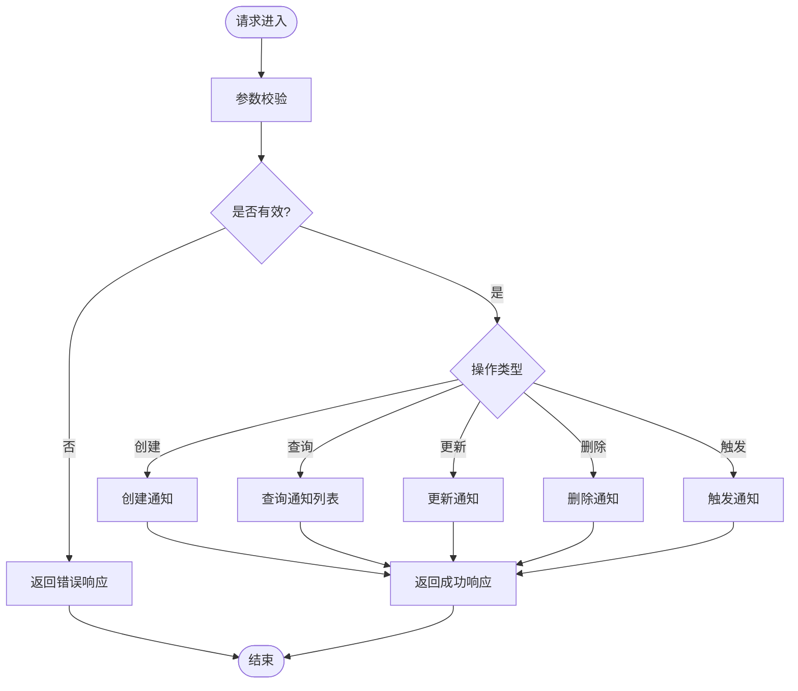
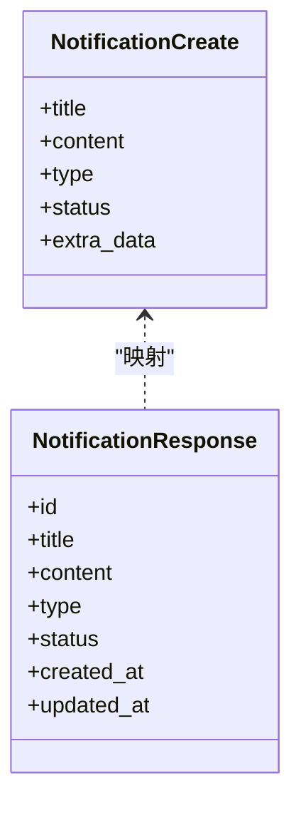
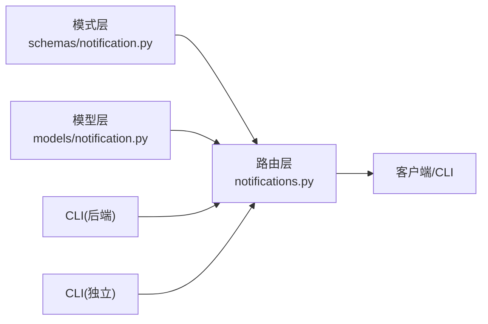

# 通知系统

<cite>
**本文引用的文件**   
- [backend/app/models/notification.py](file://backend/app/models/notification.py)
- [backend/app/routers/notifications.py](file://backend/app/routers/notifications.py)
- [backend/app/schemas/notification.py](file://backend/app/schemas/notification.py)
- [backend/cli/commands/notifications.py](file://backend/cli/commands/notifications.py)
- [ir-cli/ir_cli/commands/notifications.py](file://ir-cli/ir_cli/commands/notifications.py)
</cite>

## 目录
1. [简介](#简介)
2. [项目结构](#项目结构)
3. [核心组件](#核心组件)
4. [架构总览](#架构总览)
5. [详细组件分析](#详细组件分析)
6. [依赖分析](#依赖分析)
7. [性能考虑](#性能考虑)
8. [故障排查指南](#故障排查指南)
9. [结论](#结论)
10. [附录](#附录)

## 简介
本文件围绕“通知系统”进行系统化文档化，聚焦后端模型、API 路由、数据校验模式以及 CLI 工具对通知能力的支持。内容涵盖：
- 系统目标与范围：为投资平台提供统一的通知能力（如事件提醒、状态变更等），贯穿前端展示与后端管理。
- 关键路径：从请求进入路由层，到服务逻辑与数据持久化的完整链路。
- 扩展点：如何新增通知类型、渠道或规则。

## 项目结构
通知系统相关代码主要分布在以下位置：
- 后端模型：定义通知实体与字段
- API 路由：暴露 RESTful 接口用于增删改查与触发
- 数据模式：Pydantic 校验与序列化
- CLI：命令行工具用于本地调试与管理操作

图表来源 
- [backend/app/models/notification.py](file://backend/app/models/notification.py)
- [backend/app/routers/notifications.py](file://backend/app/routers/notifications.py)
- [backend/app/schemas/notification.py](file://backend/app/schemas/notification.py)
- [backend/cli/commands/notifications.py](file://backend/cli/commands/notifications.py)
- [ir-cli/ir_cli/commands/notifications.py](file://ir-cli/ir_cli/commands/notifications.py)

章节来源
- [backend/app/models/notification.py](file://backend/app/models/notification.py)
- [backend/app/routers/notifications.py](file://backend/app/routers/notifications.py)
- [backend/app/schemas/notification.py](file://backend/app/schemas/notification.py)
- [backend/cli/commands/notifications.py](file://backend/cli/commands/notifications.py)
- [ir-cli/ir_cli/commands/notifications.py](file://ir-cli/ir_cli/commands/notifications.py)

## 核心组件
- 模型层：定义通知实体的数据结构与关系，支撑持久化存储。
- 路由层：实现通知的创建、查询、更新、删除与触发等 HTTP 接口。
- 模式层：定义请求与响应的 Pydantic 校验规则，确保数据一致性。
- CLI：提供命令行入口，便于在服务器端或容器内执行通知相关操作。

章节来源
- [backend/app/models/notification.py](file://backend/app/models/notification.py)
- [backend/app/routers/notifications.py](file://backend/app/routers/notifications.py)
- [backend/app/schemas/notification.py](file://backend/app/schemas/notification.py)
- [backend/cli/commands/notifications.py](file://backend/cli/commands/notifications.py)
- [ir-cli/ir_cli/commands/notifications.py](file://ir-cli/ir_cli/commands/notifications.py)

## 架构总览
通知系统的整体调用链如下：
- 客户端通过 HTTP 调用路由层接口
- 路由层解析并校验请求体（使用模式层）
- 路由层调用业务逻辑（若存在服务层封装）或直接操作模型
- 模型层负责数据持久化与查询
- CLI 作为辅助工具，直接调用后端能力或复用相同的数据模型/模式

图表来源 
- [backend/app/routers/notifications.py](file://backend/app/routers/notifications.py)
- [backend/app/schemas/notification.py](file://backend/app/schemas/notification.py)
- [backend/app/models/notification.py](file://backend/app/models/notification.py)

## 详细组件分析

### 模型层：通知实体
- 职责：定义通知的核心字段（如标题、内容、类型、状态、关联对象标识等）、时间戳与索引策略。
- 设计要点：
  - 字段命名清晰，便于前端展示与筛选
  - 合理设置唯一约束与索引，提升查询性能
  - 预留扩展字段以支持不同通知渠道与模板

图表来源 
- [backend/app/models/notification.py](file://backend/app/models/notification.py)

章节来源
- [backend/app/models/notification.py](file://backend/app/models/notification.py)

### 路由层：通知 API
- 职责：暴露通知的 CRUD 接口与触发接口，处理权限校验、参数校验与异常返回。
- 典型接口：
  - 创建通知：接收结构化请求体，写入数据库
  - 查询通知：支持按类型、状态、时间范围过滤
  - 更新通知：修改状态或内容
  - 删除通知：软删除或硬删除
  - 触发通知：根据业务事件生成并发送通知
- 错误处理：统一返回错误码与消息，便于前端提示

图表来源 
- [backend/app/routers/notifications.py](file://backend/app/routers/notifications.py)

章节来源
- [backend/app/routers/notifications.py](file://backend/app/routers/notifications.py)

### 模式层：数据校验与序列化
- 职责：定义请求与响应的 Pydantic 模型，确保输入输出格式一致。
- 关键点：
  - 必填字段校验与默认值
  - 枚举类型限制（如通知类型、状态）
  - 嵌套结构与复杂字段的验证规则

图表来源 
- [backend/app/schemas/notification.py](file://backend/app/schemas/notification.py)

章节来源
- [backend/app/schemas/notification.py](file://backend/app/schemas/notification.py)

### CLI：通知命令
- 后端 CLI：提供本地或容器内执行通知相关操作的命令，便于运维与调试。
- 独立 CLI：跨进程调用后端 API，适合外部系统集成或自动化脚本。
- 常见命令：
  - 创建测试通知
  - 查询通知列表
  - 更新通知状态
  - 触发特定类型的通知

章节来源
- [backend/cli/commands/notifications.py](file://backend/cli/commands/notifications.py)
- [ir-cli/ir_cli/commands/notifications.py](file://ir-cli/ir_cli/commands/notifications.py)

## 依赖分析
通知系统内部依赖关系如下：
- 路由层依赖模式层进行数据校验
- 路由层依赖模型层进行数据持久化
- CLI 依赖路由层或 API 进行远程操作

图表来源 
- [backend/app/schemas/notification.py](file://backend/app/schemas/notification.py)
- [backend/app/models/notification.py](file://backend/app/models/notification.py)
- [backend/app/routers/notifications.py](file://backend/app/routers/notifications.py)
- [backend/cli/commands/notifications.py](file://backend/cli/commands/notifications.py)
- [ir-cli/ir_cli/commands/notifications.py](file://ir-cli/ir_cli/commands/notifications.py)

章节来源
- [backend/app/schemas/notification.py](file://backend/app/schemas/notification.py)
- [backend/app/models/notification.py](file://backend/app/models/notification.py)
- [backend/app/routers/notifications.py](file://backend/app/routers/notifications.py)
- [backend/cli/commands/notifications.py](file://backend/cli/commands/notifications.py)
- [ir-cli/ir_cli/commands/notifications.py](file://ir-cli/ir_cli/commands/notifications.py)

## 性能考虑
- 索引优化：为常用查询字段（如类型、状态、时间戳）建立索引，提升列表查询效率。
- 分页与过滤：对列表接口实现分页与条件过滤，避免一次性加载大量数据。
- 异步处理：对于耗时操作（如发送通知），建议引入任务队列异步执行。
- 缓存策略：对热点数据（如通知模板）可考虑缓存以减少重复计算。

## 故障排查指南
- 常见问题：
  - 参数校验失败：检查请求体是否符合模式定义
  - 权限不足：确认用户角色与访问控制配置
  - 数据库连接异常：检查数据库配置与服务可用性
  - 通知未送达：检查触发逻辑与外部渠道配置
- 调试建议：
  - 启用详细日志，记录请求与响应
  - 使用 CLI 模拟操作，快速定位问题
  - 检查数据库记录与状态流转

## 结论
通知系统通过清晰的模型、路由与模式分层，提供了稳定可扩展的通知能力。结合 CLI 工具，便于开发与运维场景下的快速验证与管理。未来可进一步引入异步任务、多渠道支持与更丰富的通知模板，以满足多样化业务需求。

## 附录
- 术语说明：
  - 通知类型：区分不同业务场景的通知类别
  - 通知状态：表示通知的生命周期阶段（如待发送、已发送、失败）
  - 触发器：根据业务事件自动生成通知的机制
- 扩展建议：
  - 增加通知渠道（如邮件、短信、站内信）
  - 引入通知模板引擎，支持动态内容替换
  - 实现通知重试与失败告警机制