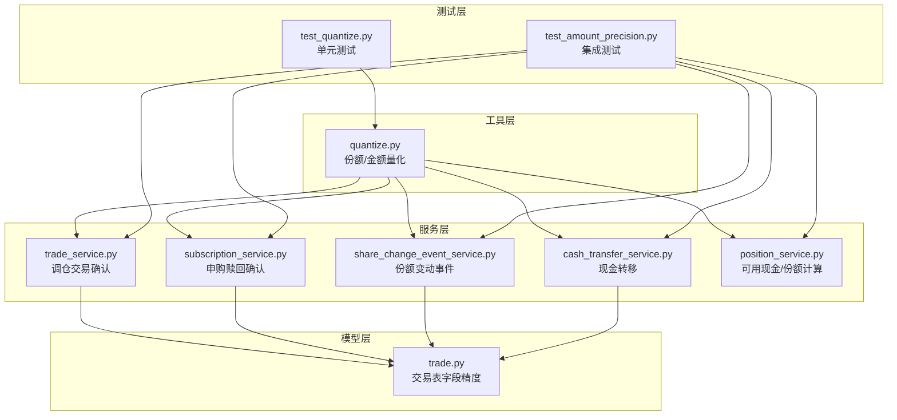
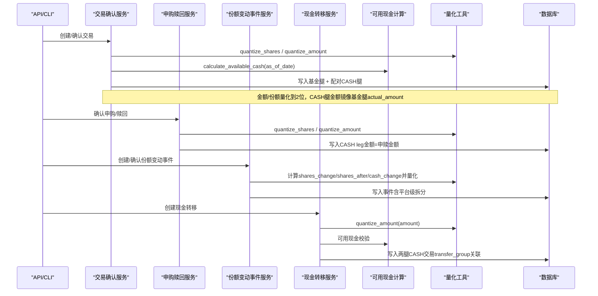
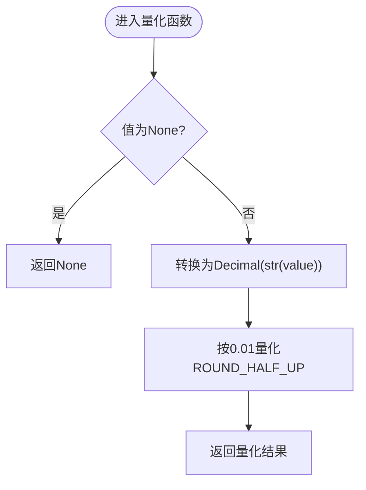
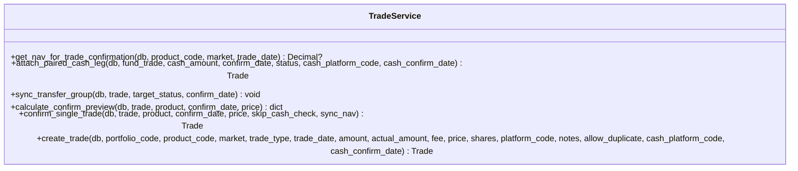
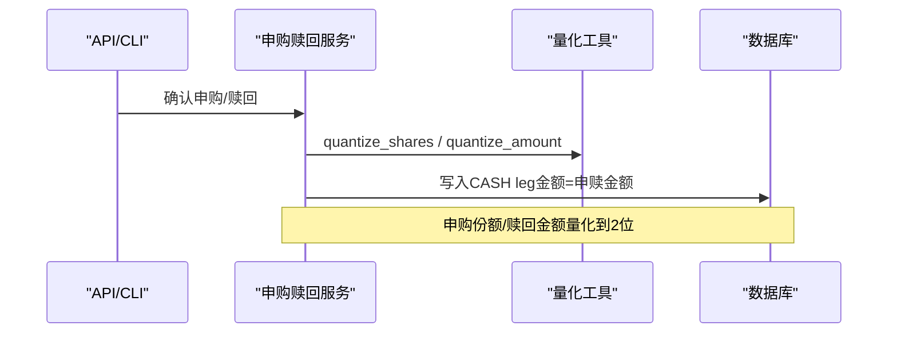
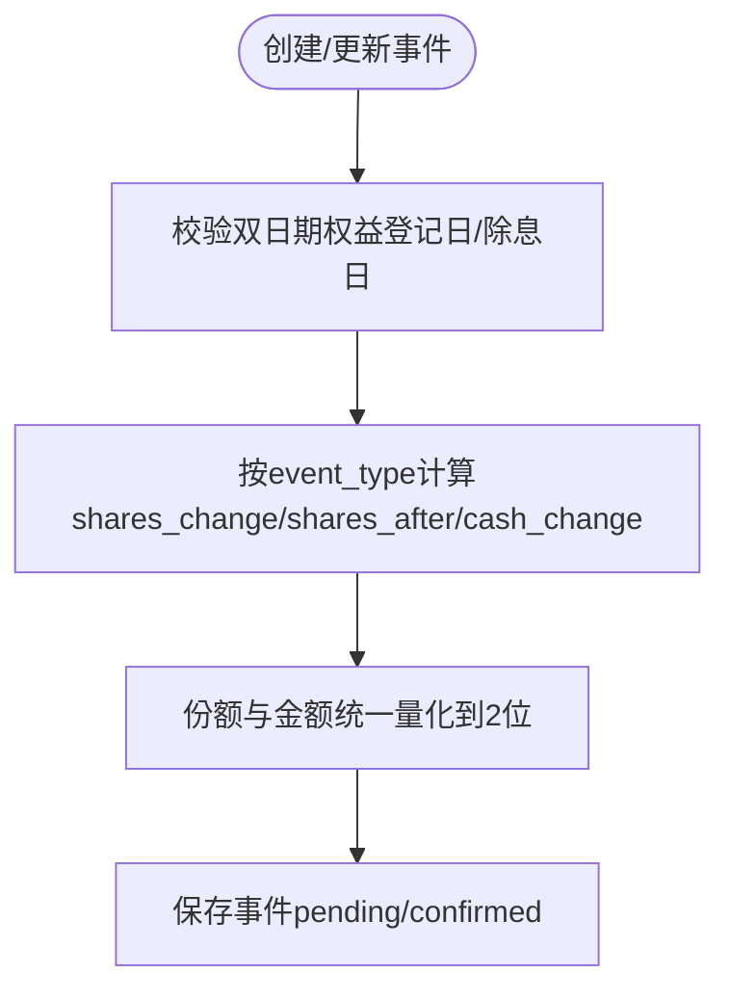
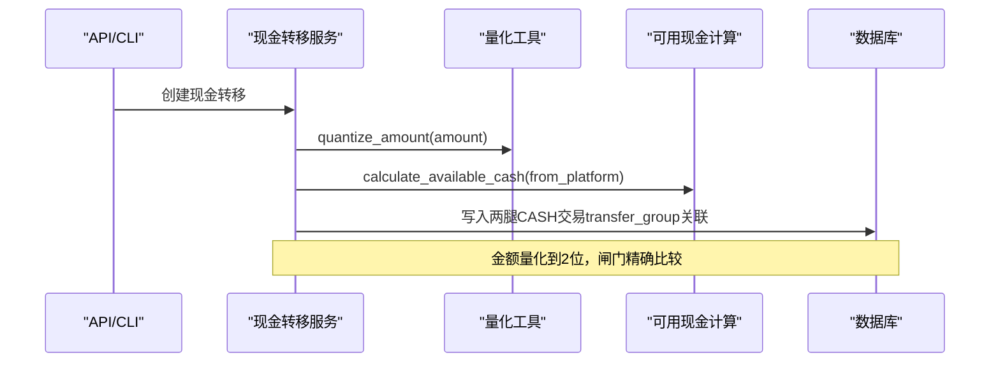
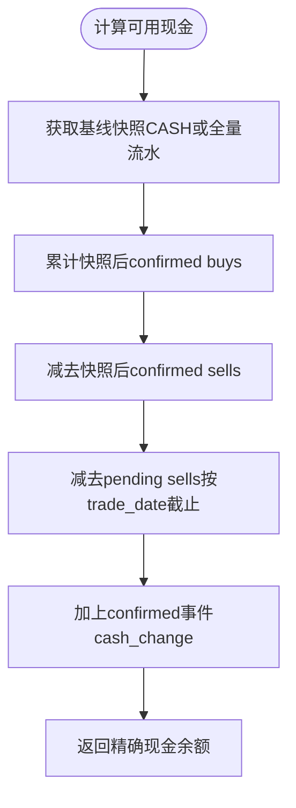
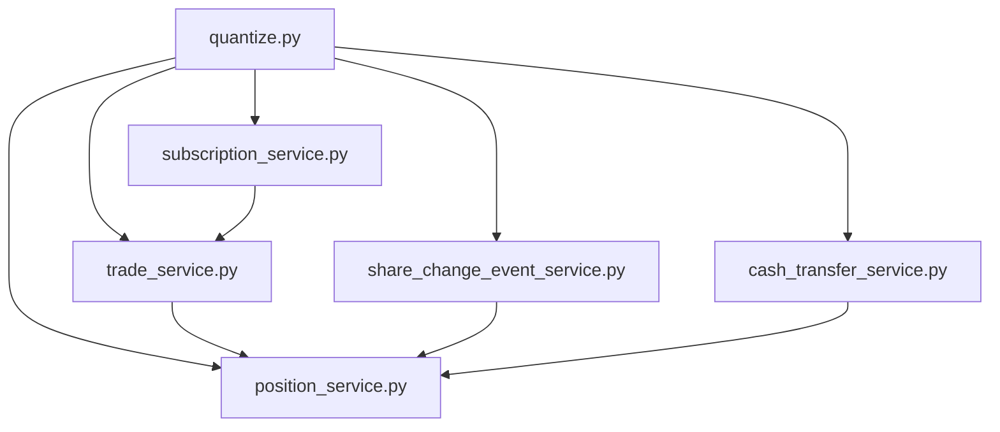

# 金额精度量化系统

<cite>
**本文引用的文件**   
- [backend/app/utils/quantize.py](file://backend/app/utils/quantize.py)
- [backend/tests/unit/test_quantize.py](file://backend/tests/unit/test_quantize.py)
- [backend/tests/integration/test_amount_precision.py](file://backend/tests/integration/test_amount_precision.py)
- [backend/app/services/trade_service.py](file://backend/app/services/trade_service.py)
- [backend/app/services/subscription_service.py](file://backend/app/services/subscription_service.py)
- [backend/app/services/share_change_event_service.py](file://backend/app/services/share_change_event_service.py)
- [backend/app/services/cash_transfer_service.py](file://backend/app/services/cash_transfer_service.py)
- [backend/app/services/position_service.py](file://backend/app/services/position_service.py)
- [backend/app/models/trade.py](file://backend/app/models/trade.py)
</cite>

## 目录
1. [引言](#引言)
2. [项目结构](#项目结构)
3. [核心组件](#核心组件)
4. [架构总览](#架构总览)
5. [详细组件分析](#详细组件分析)
6. [依赖关系分析](#依赖关系分析)
7. [性能考量](#性能考量)
8. [故障排查指南](#故障排查指南)
9. [结论](#结论)
10. [附录](#附录)

## 引言
本文件系统化梳理 InvestRing 后端的“金额精度量化系统”，聚焦于份额与金额的精度策略、舍入规则、在关键业务路径中的统一应用，以及与现金闸门、快照、事件确认等子系统的协同。该系统以 Decimal 为核心数值类型，采用 ROUND_HALF_UP（四舍五入）策略，确保与场外基金行业惯例一致，并在写入路径集中进行量化，读取/累加/校验路径保持精确比较，避免容差带来的不确定性。

## 项目结构
围绕金额精度量化的代码主要分布在以下模块：
- 工具层：统一的量化函数与常量定义
- 服务层：交易确认、申购赎回、份额变动事件、现金转移、持仓可用现金计算等
- 模型层：交易表字段精度约束
- 测试层：单元与集成测试覆盖边界与回归场景

图表来源
- [backend/app/utils/quantize.py:1-53](file://backend/app/utils/quantize.py#L1-L53)
- [backend/app/services/trade_service.py:1-687](file://backend/app/services/trade_service.py#L1-L687)
- [backend/app/services/subscription_service.py:1-321](file://backend/app/services/subscription_service.py#L1-L321)
- [backend/app/services/share_change_event_service.py:1-399](file://backend/app/services/share_change_event_service.py#L1-L399)
- [backend/app/services/cash_transfer_service.py:1-213](file://backend/app/services/cash_transfer_service.py#L1-L213)
- [backend/app/services/position_service.py:1-530](file://backend/app/services/position_service.py#L1-L530)
- [backend/app/models/trade.py:1-43](file://backend/app/models/trade.py#L1-L43)
- [backend/tests/unit/test_quantize.py:1-156](file://backend/tests/unit/test_quantize.py#L1-L156)
- [backend/tests/integration/test_amount_precision.py:1-354](file://backend/tests/integration/test_amount_precision.py#L1-L354)

章节来源
- [backend/app/utils/quantize.py:1-53](file://backend/app/utils/quantize.py#L1-L53)
- [backend/app/models/trade.py:1-43](file://backend/app/models/trade.py#L1-L43)

## 核心组件
- 量化工具
  - 份额量化：固定 2 位小数，ROUND_HALF_UP，负数按绝对值远离零进位
  - 金额量化：固定 2 位小数，ROUND_HALF_UP，负数对称处理
  - None 透传，支持 Decimal/float/int/str 输入
- 交易确认服务
  - 买入：actual_amount/fee 创建时已量化到 2 位；确认时按净值重算份额并量化
  - 卖出：shares × nav 结果量化到 2 位，误差计入基金财产
  - 配对 CASH 腿金额与基金腿 actual_amount 镜像同步
- 申购赎回服务
  - 申购：amount/nav 计算份额并量化到 2 位
  - 赎回：shares × nav 计算金额并量化到 2 位
  - 生成配对 CASH 交易记录，金额与申赎口径一致
- 份额变动事件服务
  - 各类事件 shares_change/shares_after/cash_change 统一量化到 2 位
  - forced_adjustment 用户填写的 cash_change 也量化到 2 位
- 现金转移服务
  - 用户输入金额先量化到 2 位，再做精确可用现金校验
  - 跨天到账非对称状态：转出方当日确认，转入方下一交易日确认
- 持仓可用现金计算
  - 基线读快照表 CASH 行 cash_amount（含 manual 覆盖 baked in）
  - 快照后 confirmed buys/sells 与 pending sells 精确加减
  - 事件 cash_change 增量累加
- 交易模型字段精度
  - amount/actual_amount/price/fee 使用 Numeric(15,4)/(10,4)，落库保留 4 位小数
  - 业务侧通过量化函数控制有效精度为 2 位

章节来源
- [backend/app/utils/quantize.py:1-53](file://backend/app/utils/quantize.py#L1-L53)
- [backend/app/services/trade_service.py:186-309](file://backend/app/services/trade_service.py#L186-L309)
- [backend/app/services/subscription_service.py:118-130](file://backend/app/services/subscription_service.py#L118-L130)
- [backend/app/services/share_change_event_service.py:31-70](file://backend/app/services/share_change_event_service.py#L31-L70)
- [backend/app/services/cash_transfer_service.py:70-84](file://backend/app/services/cash_transfer_service.py#L70-L84)
- [backend/app/services/position_service.py:115-231](file://backend/app/services/position_service.py#L115-L231)
- [backend/app/models/trade.py:21-25](file://backend/app/models/trade.py#L21-L25)

## 架构总览
下图展示金额量化在系统中的调用链路与数据流向，体现“写入路径量化、读取路径精确”的原则。

图表来源
- [backend/app/services/trade_service.py:186-309](file://backend/app/services/trade_service.py#L186-L309)
- [backend/app/services/subscription_service.py:118-130](file://backend/app/services/subscription_service.py#L118-L130)
- [backend/app/services/share_change_event_service.py:31-70](file://backend/app/services/share_change_event_service.py#L31-L70)
- [backend/app/services/cash_transfer_service.py:70-84](file://backend/app/services/cash_transfer_service.py#L70-L84)
- [backend/app/services/position_service.py:115-231](file://backend/app/services/position_service.py#L115-L231)
- [backend/app/utils/quantize.py:1-53](file://backend/app/utils/quantize.py#L1-L53)

## 详细组件分析

### 量化工具（quantize.py）
- 设计要点
  - 份额与金额均量化到 2 位小数，舍入模式 ROUND_HALF_UP
  - 负数语义与正数对称：按绝对值四舍五入、远离零进位
  - None 透传，便于可空字段直接传递
  - 输入兼容 Decimal/float/int/str，内部经 str() 转换避免浮点误差
- 复杂度
  - O(1) 时间，O(1) 空间
- 错误处理
  - 无异常抛出，None 原样返回
- 优化建议
  - 若高频调用，可缓存 Decimal("0.01") 常量（已在模块级定义）

图表来源
- [backend/app/utils/quantize.py:28-52](file://backend/app/utils/quantize.py#L28-L52)

章节来源
- [backend/app/utils/quantize.py:1-53](file://backend/app/utils/quantize.py#L1-L53)
- [backend/tests/unit/test_quantize.py:1-156](file://backend/tests/unit/test_quantize.py#L1-L156)

### 交易确认服务（trade_service.py）
- 关键流程
  - 场外净值型基金确认：取 T 日净值，缺失抛 MISSING_NAV；可选 price 仅做一致性校验
  - 买入：actual_amount/fee 创建时已量化到 2 位；确认时按净值重算份额并量化
  - 卖出：shares × nav 结果量化到 2 位，误差计入基金财产
  - 配对 CASH 腿金额与基金腿 actual_amount 镜像同步，支持跨平台扣款/到账
  - 可用现金校验：按生效确认日口径，考虑自身在途 CASH sell 腿防双重计数
- 数据流与精度
  - 所有金额/份额在写入前统一量化到 2 位，保证闸门精确比较
- 异常与保护
  - 快照保护、重复交易检测、价格不一致校验

图表来源
- [backend/app/services/trade_service.py:29-112](file://backend/app/services/trade_service.py#L29-L112)
- [backend/app/services/trade_service.py:186-309](file://backend/app/services/trade_service.py#L186-L309)
- [backend/app/services/trade_service.py:312-441](file://backend/app/services/trade_service.py#L312-L441)
- [backend/app/services/trade_service.py:443-633](file://backend/app/services/trade_service.py#L443-L633)

章节来源
- [backend/app/services/trade_service.py:186-309](file://backend/app/services/trade_service.py#L186-L309)
- [backend/app/services/trade_service.py:312-441](file://backend/app/services/trade_service.py#L312-L441)
- [backend/app/services/trade_service.py:443-633](file://backend/app/services/trade_service.py#L443-L633)

### 申购赎回服务（subscription_service.py）
- 关键流程
  - 首次申购 NAV=1.0000，否则取申请日组合快照 NAV
  - 申购：amount/nav 计算份额并量化到 2 位
  - 赎回：shares × nav 计算金额并量化到 2 位
  - 生成配对 CASH 交易记录，金额与申赎口径一致
- 精度与一致性
  - 金额/份额量化到 2 位，与平台对账一致

图表来源
- [backend/app/services/subscription_service.py:118-130](file://backend/app/services/subscription_service.py#L118-L130)
- [backend/app/services/subscription_service.py:241-321](file://backend/app/services/subscription_service.py#L241-L321)

章节来源
- [backend/app/services/subscription_service.py:118-130](file://backend/app/services/subscription_service.py#L118-L130)
- [backend/app/services/subscription_service.py:241-321](file://backend/app/services/subscription_service.py#L241-L321)

### 份额变动事件服务（share_change_event_service.py）
- 关键流程
  - 各类事件 shares_change/shares_after/cash_change 统一量化到 2 位
  - forced_adjustment 用户填写的 cash_change 也量化到 2 位
  - 基金级事件自动拆分为各平台子记录，父记录汇总值再计算
- 精度与一致性
  - 所有份额与金额字段在写入前量化，保证后续计算与校验精确

图表来源
- [backend/app/services/share_change_event_service.py:31-70](file://backend/app/services/share_change_event_service.py#L31-L70)
- [backend/app/services/share_change_event_service.py:190-274](file://backend/app/services/share_change_event_service.py#L190-L274)

章节来源
- [backend/app/services/share_change_event_service.py:31-70](file://backend/app/services/share_change_event_service.py#L31-L70)
- [backend/app/services/share_change_event_service.py:190-274](file://backend/app/services/share_change_event_service.py#L190-L274)

### 现金转移服务（cash_transfer_service.py）
- 关键流程
  - 用户输入金额先量化到 2 位，再做精确可用现金校验
  - 当天完成：两腿立即 confirmed；跨天到账：转出方当日确认，转入方下一交易日确认
  - 两腿通过 transfer_group 关联，状态非对称
- 精度与一致性
  - 金额量化到 2 位，闸门无容差，精确拒绝不足情况

图表来源
- [backend/app/services/cash_transfer_service.py:70-84](file://backend/app/services/cash_transfer_service.py#L70-L84)
- [backend/app/services/cash_transfer_service.py:30-132](file://backend/app/services/cash_transfer_service.py#L30-L132)

章节来源
- [backend/app/services/cash_transfer_service.py:70-84](file://backend/app/services/cash_transfer_service.py#L70-L84)
- [backend/app/services/cash_transfer_service.py:30-132](file://backend/app/services/cash_transfer_service.py#L30-L132)

### 持仓可用现金计算（position_service.py）
- 关键流程
  - 基线：最新快照日 CASH 行 cash_amount（含 manual 覆盖 baked in）
  - 快照后 confirmed buys/sells 与 pending sells 精确加减
  - 事件 cash_change 增量累加
  - as_of_date 截止计算：confirmed buys 计 confirm_date ∈ (latest_date, as_of_date]，confirmed sells 计 trade_date <= as_of_date，pending sells 计 trade_date <= as_of_date
- 精度与一致性
  - 所有金额来自已量化字段，加减仍为 2 位小数，精确比较

图表来源
- [backend/app/services/position_service.py:115-231](file://backend/app/services/position_service.py#L115-L231)

章节来源
- [backend/app/services/position_service.py:115-231](file://backend/app/services/position_service.py#L115-L231)

### 交易模型字段精度（trade.py）
- 字段精度
  - amount/actual_amount/price/fee 使用 Numeric(15,4)/(10,4)，落库保留 4 位小数
  - 业务侧通过量化函数控制有效精度为 2 位，保证前端/平台对账一致
- 约束
  - transfer_group NOT NULL，每笔 trade 隶属一个业务组，防止裸 trade

章节来源
- [backend/app/models/trade.py:21-25](file://backend/app/models/trade.py#L21-L25)
- [backend/app/models/trade.py:33-42](file://backend/app/models/trade.py#L33-L42)

## 依赖关系分析
- 量化依赖
  - 所有服务层模块在写入路径统一调用 quantize.py 的量化函数
- 服务间耦合
  - 交易确认服务依赖可用现金计算服务进行闸门校验
  - 申购赎回服务生成配对 CASH 交易，与交易确认服务的 CASH 腿逻辑一致
  - 份额变动事件服务与持仓可用现金计算在服务层解耦，通过事件 cash_change 影响现金余额
- 外部依赖
  - 净值获取依赖价格记录表，缺失时抛 MISSING_NAV
  - 交易日判断依赖交易日历

图表来源
- [backend/app/utils/quantize.py:1-53](file://backend/app/utils/quantize.py#L1-L53)
- [backend/app/services/trade_service.py:1-687](file://backend/app/services/trade_service.py#L1-L687)
- [backend/app/services/subscription_service.py:1-321](file://backend/app/services/subscription_service.py#L1-L321)
- [backend/app/services/share_change_event_service.py:1-399](file://backend/app/services/share_change_event_service.py#L1-L399)
- [backend/app/services/cash_transfer_service.py:1-213](file://backend/app/services/cash_transfer_service.py#L1-L213)
- [backend/app/services/position_service.py:1-530](file://backend/app/services/position_service.py#L1-L530)

章节来源
- [backend/app/utils/quantize.py:1-53](file://backend/app/utils/quantize.py#L1-L53)
- [backend/app/services/trade_service.py:1-687](file://backend/app/services/trade_service.py#L1-L687)
- [backend/app/services/subscription_service.py:1-321](file://backend/app/services/subscription_service.py#L1-L321)
- [backend/app/services/share_change_event_service.py:1-399](file://backend/app/services/share_change_event_service.py#L1-L399)
- [backend/app/services/cash_transfer_service.py:1-213](file://backend/app/services/cash_transfer_service.py#L1-L213)
- [backend/app/services/position_service.py:1-530](file://backend/app/services/position_service.py#L1-L530)

## 性能考量
- 量化函数为 O(1) 操作，开销极小
- 可用现金计算基于快照基线，增量累加 confirmed/pending 流水，避免全量重算
- 数据库查询按快照日期与平台过滤，减少扫描范围
- 建议在高频路径中复用 Decimal 常量与查询结果缓存（如最新快照日）

[本节为通用指导，不直接分析具体文件]

## 故障排查指南
- 常见错误码
  - INSUFFICIENT_CASH：可用现金不足，检查量化后的金额与闸门比较
  - MISSING_NAV：净值缺失，检查价格记录是否同步
  - PRICE_NAV_MISMATCH：手动价格与净值不一致，核对输入
  - SNAPSHOT_DEPENDENCY：快照保护触发，需删除相关快照后再操作
- 排查步骤
  - 确认输入金额/份额是否已量化到 2 位
  - 检查可用现金计算是否正确包含 pending sells 与事件 cash_change
  - 验证配对 CASH 腿金额是否与基金腿 actual_amount 一致
  - 查看快照日期与交易日期顺序是否符合约束

章节来源
- [backend/app/services/trade_service.py:312-441](file://backend/app/services/trade_service.py#L312-L441)
- [backend/app/services/cash_transfer_service.py:70-84](file://backend/app/services/cash_transfer_service.py#L70-L84)
- [backend/app/services/position_service.py:115-231](file://backend/app/services/position_service.py#L115-L231)

## 结论
InvestRing 的金额精度量化系统以 Decimal 与 ROUND_HALF_UP 为核心，统一在写入路径进行份额与金额的 2 位小数量化，确保与场外基金行业惯例一致，并在读取/校验路径保持精确比较，避免容差带来的不确定性。该体系在交易确认、申购赎回、份额变动事件、现金转移与可用现金计算等关键环节得到一致应用，并通过完善的单元与集成测试保障行为正确性与回归稳定性。

[本节为总结性内容，不直接分析具体文件]

## 附录
- 测试覆盖
  - 单元测试：量化函数的边界值、负数语义、输入类型兼容
  - 集成测试：issue #94 复刻场景、赎回确认金额、事件现金字段、manual 覆盖、现金转移、快照 CASH 精度、REST 边界

章节来源
- [backend/tests/unit/test_quantize.py:1-156](file://backend/tests/unit/test_quantize.py#L1-L156)
- [backend/tests/integration/test_amount_precision.py:1-354](file://backend/tests/integration/test_amount_precision.py#L1-L354)