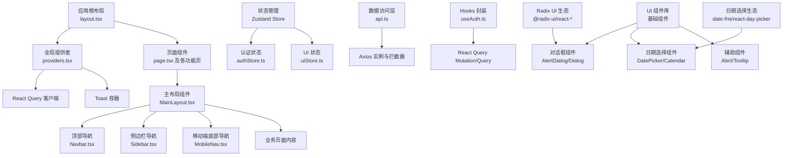
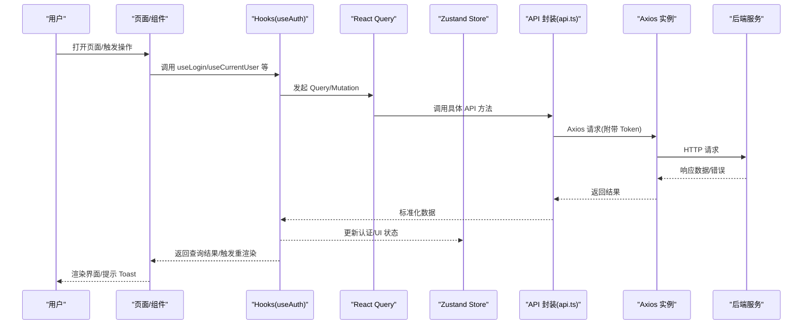
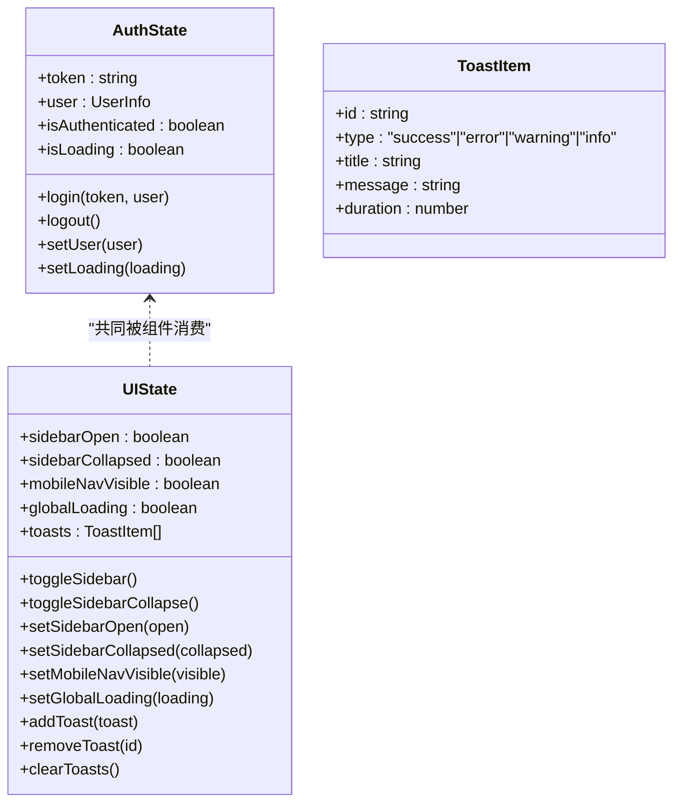
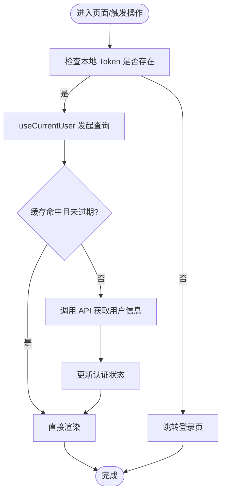
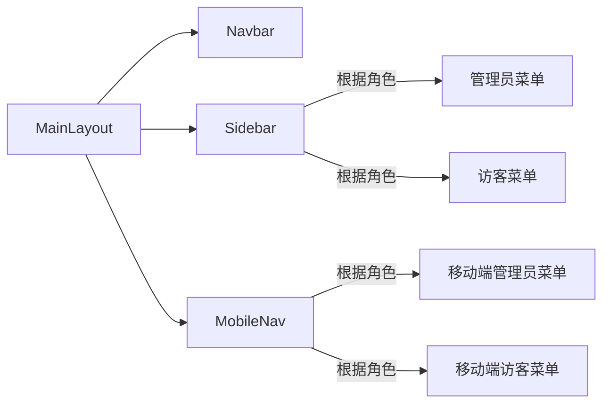
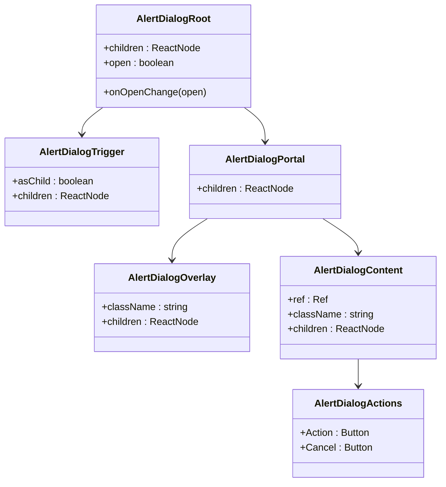
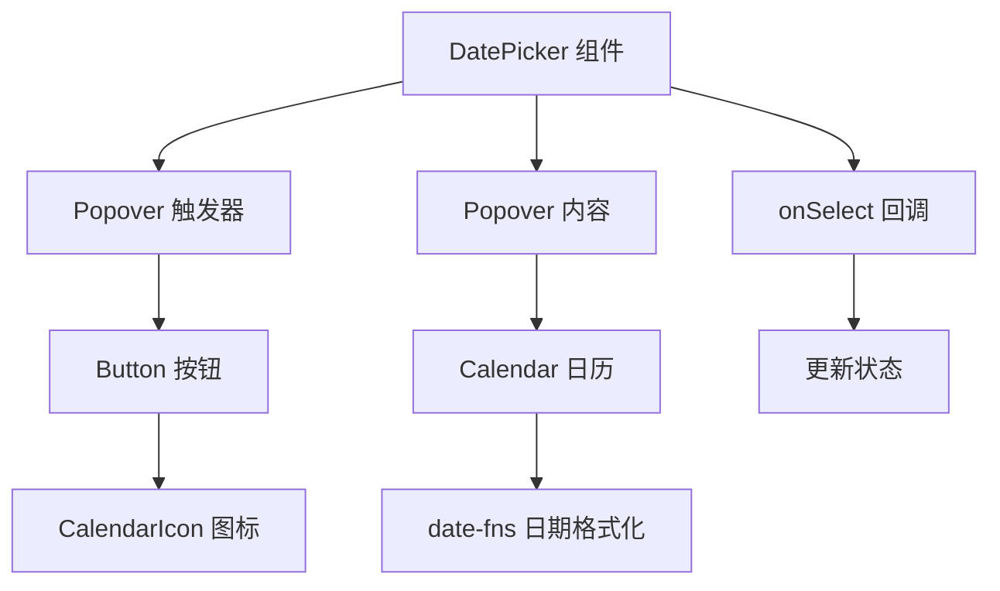
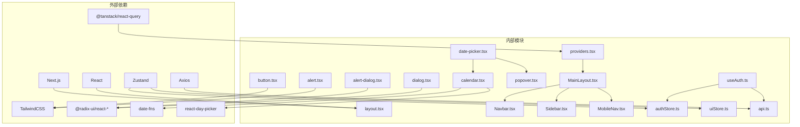

# 前端架构

<cite>
**本文引用的文件**
- [frontend/src/app/layout.tsx](file://frontend/src/app/layout.tsx)
- [frontend/src/app/providers.tsx](file://frontend/src/app/providers.tsx)
- [frontend/src/app/page.tsx](file://frontend/src/app/page.tsx)
- [frontend/src/components/layout/MainLayout.tsx](file://frontend/src/components/layout/MainLayout.tsx)
- [frontend/src/components/layout/Navbar.tsx](file://frontend/src/components/layout/Navbar.tsx)
- [frontend/src/components/layout/Sidebar.tsx](file://frontend/src/components/layout/Sidebar.tsx)
- [frontend/src/components/layout/MobileNav.tsx](file://frontend/src/components/layout/MobileNav.tsx)
- [frontend/src/stores/authStore.ts](file://frontend/src/stores/authStore.ts)
- [frontend/src/stores/uiStore.ts](file://frontend/src/stores/uiStore.ts)
- [frontend/src/lib/api.ts](file://frontend/src/lib/api.ts)
- [frontend/src/hooks/useAuth.ts](file://frontend/src/hooks/useAuth.ts)
- [frontend/src/components/ui/button.tsx](file://frontend/src/components/ui/button.tsx)
- [frontend/src/components/ui/alert-dialog.tsx](file://frontend/src/components/ui/alert-dialog.tsx)
- [frontend/src/components/ui/date-picker.tsx](file://frontend/src/components/ui/date-picker.tsx)
- [frontend/src/components/ui/calendar.tsx](file://frontend/src/components/ui/calendar.tsx)
- [frontend/src/components/ui/popover.tsx](file://frontend/src/components/ui/popover.tsx)
- [frontend/src/components/ui/dialog.tsx](file://frontend/src/components/ui/dialog.tsx)
- [frontend/src/components/ui/alert.tsx](file://frontend/src/components/ui/alert.tsx)
- [frontend/package.json](file://frontend/package.json)
- [frontend/next.config.js](file://frontend/next.config.js)
- [frontend/tailwind.config.ts](file://frontend/tailwind.config.ts)
</cite>

## 更新摘要
**所做更改**
- 新增 UI 组件系统架构章节，详细介绍 AlertDialog 和 DatePicker 的集成方式
- 更新组件详解部分，增加新的 UI 组件实现分析
- 扩展依赖关系分析，包含新增的 Radix UI 和日期选择组件
- 更新架构图和组件依赖关系图，反映新的 UI 组件系统

## 目录
1. [简介](#简介)
2. [项目结构](#项目结构)
3. [核心组件](#核心组件)
4. [架构总览](#架构总览)
5. [组件详解](#组件详解)
6. [UI 组件系统架构](#ui-组件系统架构)
7. [依赖关系分析](#依赖关系分析)
8. [性能考量](#性能考量)
9. [故障排查指南](#故障排查指南)
10. [结论](#结论)
11. [附录](#附录)

## 简介
本文件系统性梳理 InvestRing 前端的 Next.js 架构设计，覆盖 App Router 模式下的页面组织、主布局与导航体系、移动端适配、状态管理（Zustand）、数据获取（React Query）以及响应式布局实现。文档同时给出架构图、组件依赖关系图与性能优化建议，帮助开发者快速理解与扩展系统。

**更新** 新增 UI 组件系统架构章节，详细介绍了基于 Radix UI 的 AlertDialog 和基于 react-day-picker 的 DatePicker 组件集成方式。

## 项目结构
前端采用 Next.js App Router 的目录约定进行页面与布局组织，核心入口位于应用根布局与全局提供者，页面按功能域分层，组件按职责拆分至桌面端/移动端/共享 UI 层，并通过 Zustand 和 React Query 实现状态与数据流管理。

**图表来源**
- [frontend/src/app/layout.tsx:1-32](file://frontend/src/app/layout.tsx#L1-L32)
- [frontend/src/app/providers.tsx:1-28](file://frontend/src/app/providers.tsx#L1-L28)
- [frontend/src/app/page.tsx:1-15](file://frontend/src/app/page.tsx#L1-L15)
- [frontend/src/components/layout/MainLayout.tsx:1-41](file://frontend/src/components/layout/MainLayout.tsx#L1-L41)
- [frontend/src/components/layout/Navbar.tsx:1-62](file://frontend/src/components/layout/Navbar.tsx#L1-L62)
- [frontend/src/components/layout/Sidebar.tsx:1-67](file://frontend/src/components/layout/Sidebar.tsx#L1-L67)
- [frontend/src/components/layout/MobileNav.tsx:1-61](file://frontend/src/components/layout/MobileNav.tsx#L1-L61)
- [frontend/src/stores/authStore.ts:1-71](file://frontend/src/stores/authStore.ts#L1-L71)
- [frontend/src/stores/uiStore.ts:1-85](file://frontend/src/stores/uiStore.ts#L1-L85)
- [frontend/src/lib/api.ts:1-627](file://frontend/src/lib/api.ts#L1-L627)
- [frontend/src/hooks/useAuth.ts:1-134](file://frontend/src/hooks/useAuth.ts#L1-L134)
- [frontend/src/components/ui/button.tsx:1-56](file://frontend/src/components/ui/button.tsx#L1-L56)
- [frontend/src/components/ui/alert-dialog.tsx:1-142](file://frontend/src/components/ui/alert-dialog.tsx#L1-L142)
- [frontend/src/components/ui/date-picker.tsx:1-73](file://frontend/src/components/ui/date-picker.tsx#L1-L73)
- [frontend/src/components/ui/calendar.tsx:1-52](file://frontend/src/components/ui/calendar.tsx#L1-L52)
- [frontend/src/components/ui/popover.tsx:1-32](file://frontend/src/components/ui/popover.tsx#L1-L32)
- [frontend/src/components/ui/dialog.tsx:1-119](file://frontend/src/components/ui/dialog.tsx#L1-L119)
- [frontend/src/components/ui/alert.tsx:1-59](file://frontend/src/components/ui/alert.tsx#L1-L59)
- [frontend/tailwind.config.ts:1-57](file://frontend/tailwind.config.ts#L1-L57)

**章节来源**
- [frontend/src/app/layout.tsx:1-32](file://frontend/src/app/layout.tsx#L1-L32)
- [frontend/src/app/providers.tsx:1-28](file://frontend/src/app/providers.tsx#L1-L28)
- [frontend/src/app/page.tsx:1-15](file://frontend/src/app/page.tsx#L1-L15)
- [frontend/next.config.js:1-16](file://frontend/next.config.js#L1-L16)
- [frontend/tailwind.config.ts:1-57](file://frontend/tailwind.config.ts#L1-L57)

## 核心组件
- 应用根布局与提供者
  - 根布局负责注入字体、元信息与全局样式，并包裹全局提供者。
  - 全局提供者初始化 React Query 客户端与全局 Toast 容器，统一数据缓存策略与通知展示。
- 主布局与导航
  - 主布局负责认证守卫、桌面端/移动端导航渲染与页面主体区域划分。
  - 导航组件根据用户角色动态呈现不同菜单项，支持桌面侧边栏与移动端底部导航。
- 状态管理（Zustand）
  - 认证状态：登录、登出、用户信息、加载状态持久化。
  - UI 状态：侧边栏开关/折叠、移动端导航显隐、全局加载、Toast 列表持久化。
- 数据访问与查询
  - Axios 实例封装统一请求/响应拦截器、错误处理与 401 自动跳转。
  - Hooks 封装登录、登出、当前用户、改密等业务操作，结合 React Query 进行缓存与重试控制。
- UI 组件库
  - 基于 Radix UI 与 Tailwind 的可变式按钮等基础组件，提供一致的视觉与交互语义。
  - 新增 AlertDialog 对话框组件，支持确认/取消操作的模态交互。
  - 新增 DatePicker 日期选择组件，基于 Popover 和 Calendar 实现，支持中文本地化。

**更新** 新增 UI 组件系统，包含基于 Radix UI 的对话框组件族和基于 react-day-picker 的日期选择组件。

**章节来源**
- [frontend/src/app/layout.tsx:1-32](file://frontend/src/app/layout.tsx#L1-L32)
- [frontend/src/app/providers.tsx:1-28](file://frontend/src/app/providers.tsx#L1-L28)
- [frontend/src/components/layout/MainLayout.tsx:1-41](file://frontend/src/components/layout/MainLayout.tsx#L1-L41)
- [frontend/src/components/layout/Navbar.tsx:1-62](file://frontend/src/components/layout/Navbar.tsx#L1-L62)
- [frontend/src/components/layout/Sidebar.tsx:1-67](file://frontend/src/components/layout/Sidebar.tsx#L1-L67)
- [frontend/src/components/layout/MobileNav.tsx:1-61](file://frontend/src/components/layout/MobileNav.tsx#L1-L61)
- [frontend/src/stores/authStore.ts:1-71](file://frontend/src/stores/authStore.ts#L1-L71)
- [frontend/src/stores/uiStore.ts:1-85](file://frontend/src/stores/uiStore.ts#L1-L85)
- [frontend/src/lib/api.ts:1-627](file://frontend/src/lib/api.ts#L1-L627)
- [frontend/src/hooks/useAuth.ts:1-134](file://frontend/src/hooks/useAuth.ts#L1-L134)
- [frontend/src/components/ui/button.tsx:1-56](file://frontend/src/components/ui/button.tsx#L1-L56)
- [frontend/src/components/ui/alert-dialog.tsx:1-142](file://frontend/src/components/ui/alert-dialog.tsx#L1-L142)
- [frontend/src/components/ui/date-picker.tsx:1-73](file://frontend/src/components/ui/date-picker.tsx#L1-L73)

## 架构总览
下图展示了从浏览器到后端 API 的整体调用链路，以及前端内部的状态与数据流：

**图表来源**
- [frontend/src/hooks/useAuth.ts:1-134](file://frontend/src/hooks/useAuth.ts#L1-L134)
- [frontend/src/lib/api.ts:1-627](file://frontend/src/lib/api.ts#L1-L627)
- [frontend/src/stores/authStore.ts:1-71](file://frontend/src/stores/authStore.ts#L1-L71)
- [frontend/src/stores/uiStore.ts:1-85](file://frontend/src/stores/uiStore.ts#L1-L85)
- [frontend/src/app/providers.tsx:1-28](file://frontend/src/app/providers.tsx#L1-L28)

## 组件详解

### 状态管理：Zustand 使用策略
- 认证状态（authStore）
  - 管理 token、用户信息、认证态与加载态；登录时写入本地存储与 Cookie，登出时清理；支持持久化，仅保存必要字段。
  - 提供登录、登出、设置用户、设置加载状态等动作。
- UI 状态（uiStore）
  - 管理桌面侧边栏展开/折叠、移动端导航显隐、全局加载态与 Toast 列表；支持持久化侧边栏状态。
  - 提供添加/移除/清空 Toast 的方法，自动生成唯一 ID。
- 设计要点
  - 使用持久化中间件分离"状态"与"持久化键"，避免冗余持久化。
  - 将副作用（如 Cookie/Storage）限制在 store 内部，保持纯函数式更新。

**图表来源**
- [frontend/src/stores/authStore.ts:1-71](file://frontend/src/stores/authStore.ts#L1-L71)
- [frontend/src/stores/uiStore.ts:1-85](file://frontend/src/stores/uiStore.ts#L1-L85)

**章节来源**
- [frontend/src/stores/authStore.ts:1-71](file://frontend/src/stores/authStore.ts#L1-L71)
- [frontend/src/stores/uiStore.ts:1-85](file://frontend/src/stores/uiStore.ts#L1-L85)

### 数据获取：React Query 模式
- 提供者配置
  - 初始化 QueryClient，默认缓存策略：staleTime、refetchOnWindowFocus、retry 次数。
- Hooks 封装
  - useLogin/useLogout/useCurrentUser/useChangePassword/useAuthGuard/useRoleCheck
  - Mutation 用于提交变更，Query 用于拉取只读数据；QueryKey 保证缓存隔离与失效。
- 错误处理
  - Axios 响应拦截器统一处理 401 并跳转登录；上层捕获异常并转化为可读消息。

**图表来源**
- [frontend/src/hooks/useAuth.ts:56-71](file://frontend/src/hooks/useAuth.ts#L56-L71)
- [frontend/src/lib/api.ts:67-79](file://frontend/src/lib/api.ts#L67-L79)

**章节来源**
- [frontend/src/app/providers.tsx:1-28](file://frontend/src/app/providers.tsx#L1-L28)
- [frontend/src/hooks/useAuth.ts:1-134](file://frontend/src/hooks/useAuth.ts#L1-L134)
- [frontend/src/lib/api.ts:1-627](file://frontend/src/lib/api.ts#L1-L627)

### 主布局与导航系统
- MainLayout
  - 负责认证守卫：未登录则跳转登录；已登录渲染桌面端 Navbar/Sidebar 与移动端 MobileNav。
- Navbar
  - 展示品牌与用户信息，提供下拉菜单与登出操作。
- Sidebar
  - 根据角色动态渲染菜单项；高亮当前路径；仅桌面端显示。
- MobileNav
  - 固定在底部，移动端可见；根据角色渲染精简菜单。

**图表来源**
- [frontend/src/components/layout/MainLayout.tsx:1-41](file://frontend/src/components/layout/MainLayout.tsx#L1-L41)
- [frontend/src/components/layout/Navbar.tsx:1-62](file://frontend/src/components/layout/Navbar.tsx#L1-L62)
- [frontend/src/components/layout/Sidebar.tsx:1-67](file://frontend/src/components/layout/Sidebar.tsx#L1-L67)
- [frontend/src/components/layout/MobileNav.tsx:1-61](file://frontend/src/components/layout/MobileNav.tsx#L1-L61)

**章节来源**
- [frontend/src/components/layout/MainLayout.tsx:1-41](file://frontend/src/components/layout/MainLayout.tsx#L1-L41)
- [frontend/src/components/layout/Navbar.tsx:1-62](file://frontend/src/components/layout/Navbar.tsx#L1-L62)
- [frontend/src/components/layout/Sidebar.tsx:1-67](file://frontend/src/components/layout/Sidebar.tsx#L1-L67)
- [frontend/src/components/layout/MobileNav.tsx:1-61](file://frontend/src/components/layout/MobileNav.tsx#L1-L61)

### 响应式布局与移动端适配
- 断点策略
  - 桌面端：Sidebar 固定宽度，内容区自适应；Navbar 顶部固定。
  - 移动端：Sidebar 隐藏，使用 MobileNav 固定底部导航。
- 交互细节
  - Sidebar 支持展开/折叠；MobileNav 高亮当前路径；全局 Toast 在任意页面统一展示。
- 样式基础
  - Tailwind 配置扩展主题色与圆角变量，确保组件风格一致。

**章节来源**
- [frontend/src/components/layout/Sidebar.tsx:1-67](file://frontend/src/components/layout/Sidebar.tsx#L1-L67)
- [frontend/src/components/layout/MobileNav.tsx:1-61](file://frontend/src/components/layout/MobileNav.tsx#L1-L61)
- [frontend/tailwind.config.ts:1-57](file://frontend/tailwind.config.ts#L1-L57)

### 前端路由与页面组织
- App Router
  - 页面按目录组织，如 /dashboard、/investors、/portfolio/[code] 等；动态路由参数通过 [param] 表达。
  - 根布局负责注入 Provider 与全局样式；根页面重定向至登录。
- 重写规则
  - next.config.js 将 /api/* 代理到后端服务地址，便于开发阶段跨域访问。

**章节来源**
- [frontend/src/app/layout.tsx:1-32](file://frontend/src/app/layout.tsx#L1-L32)
- [frontend/src/app/page.tsx:1-15](file://frontend/src/app/page.tsx#L1-L15)
- [frontend/next.config.js:1-16](file://frontend/next.config.js#L1-L16)

### 可复用 UI 组件的架构原则
- 组件职责单一：按钮、输入框、对话框等均为基础 UI 组件。
- 变体与尺寸：通过变体（variant/size）与类名合并工具实现一致的外观与行为。
- 与设计系统的耦合：基于 Tailwind 与 Radix UI，降低对特定库的绑定风险。

**章节来源**
- [frontend/src/components/ui/button.tsx:1-56](file://frontend/src/components/ui/button.tsx#L1-L56)
- [frontend/tailwind.config.ts:1-57](file://frontend/tailwind.config.ts#L1-L57)

## UI 组件系统架构

### AlertDialog 对话框组件
基于 Radix UI 的 AlertDialog 实现，提供模态确认对话框功能，支持确认和取消操作。

#### 组件结构
- Root：对话框根容器
- Trigger：触发器，点击打开对话框
- Portal：Portal 容器，确保对话框在 DOM 树顶层渲染
- Overlay：遮罩层，背景半透明覆盖
- Content：对话框内容区域，居中显示
- Header/Footer：对话框头部和尾部布局
- Title/Description：标题和描述文本
- Action/Cancel：确认和取消按钮

#### 核心特性
- 响应式动画：基于 Radix UI 的状态切换动画
- 键盘无障碍：支持 Tab 切换、Esc 关闭
- 点击外部关闭：点击遮罩层可关闭对话框
- 按钮变体：Action 使用主要按钮样式，Cancel 使用轮廓样式

**图表来源**
- [frontend/src/components/ui/alert-dialog.tsx:9-141](file://frontend/src/components/ui/alert-dialog.tsx#L9-L141)

#### 使用场景
- 删除确认：删除投资组合、产品等危险操作
- 数据清除：清空历史数据、重置配置
- 系统提示：重要信息确认、条款同意

**章节来源**
- [frontend/src/components/ui/alert-dialog.tsx:1-142](file://frontend/src/components/ui/alert-dialog.tsx#L1-L142)

### DatePicker 日期选择组件
基于 Popover 和 Calendar 实现的日期选择器，支持中文本地化和交易日过滤。

#### 组件架构
- DatePicker：主组件，封装 Popover 和 Calendar
- Calendar：日期选择日历，基于 react-day-picker
- Popover：弹出层容器，提供上下文菜单功能
- Button：触发按钮，显示选中的日期格式化文本

#### 核心功能
- 单日期选择：支持单个日期选择模式
- 中文本地化：使用 zhCN 本地化配置
- 交易日过滤：通过后端验证只允许选择交易日
- 输入格式化：自动格式化为 yyyy-MM-dd 格式
- 禁用状态：支持禁用选择器

**图表来源**
- [frontend/src/components/ui/date-picker.tsx:25-72](file://frontend/src/components/ui/date-picker.tsx#L25-L72)
- [frontend/src/components/ui/calendar.tsx:11-48](file://frontend/src/components/ui/calendar.tsx#L11-L48)
- [frontend/src/components/ui/popover.tsx:8-29](file://frontend/src/components/ui/popover.tsx#L8-L29)

#### 集成方式
- 依赖关系：DatePicker 依赖 Button、Popover、Calendar 组件
- 事件处理：通过 onSelect 回调传递选中的日期
- 样式集成：继承 Button 的 outline 样式和 Calendar 的主题
- 本地化：使用 date-fns 的 zhCN 本地化配置

**章节来源**
- [frontend/src/components/ui/date-picker.tsx:1-73](file://frontend/src/components/ui/date-picker.tsx#L1-L73)
- [frontend/src/components/ui/calendar.tsx:1-52](file://frontend/src/components/ui/calendar.tsx#L1-L52)
- [frontend/src/components/ui/popover.tsx:1-32](file://frontend/src/components/ui/popover.tsx#L1-L32)

### 辅助 UI 组件
- Dialog：通用对话框组件，支持关闭按钮和自定义内容
- Alert：警告提示组件，支持成功/错误等变体
- Tooltip：工具提示组件，提供额外信息展示

**章节来源**
- [frontend/src/components/ui/dialog.tsx:1-119](file://frontend/src/components/ui/dialog.tsx#L1-L119)
- [frontend/src/components/ui/alert.tsx:1-59](file://frontend/src/components/ui/alert.tsx#L1-L59)

## 依赖关系分析
- 外部依赖
  - Next.js、React、Axios、@tanstack/react-query、zustand、lucide-react、tailwindcss 等。
  - 新增 Radix UI 生态组件：@radix-ui/react-alert-dialog、@radix-ui/react-dialog、@radix-ui/react-popover 等。
  - 新增日期选择生态：date-fns、react-day-picker。
- 内部依赖
  - 页面依赖布局与提供者；布局依赖导航组件；Hooks 依赖 Store 与 API；API 依赖 Axios 与类型定义。
  - UI 组件依赖基础组件库和第三方 UI 库。
- 依赖方向
  - 低耦合：页面与布局解耦，通过 Provider 注入能力；Store 与 UI 解耦，通过 Hooks 消费。
  - 明确边界：数据层（api.ts）与 UI 层（components）分离，便于测试与替换。

**图表来源**
- [frontend/package.json:1-47](file://frontend/package.json#L1-L47)
- [frontend/src/app/layout.tsx:1-32](file://frontend/src/app/layout.tsx#L1-L32)
- [frontend/src/app/providers.tsx:1-28](file://frontend/src/app/providers.tsx#L1-L28)
- [frontend/src/components/layout/MainLayout.tsx:1-41](file://frontend/src/components/layout/MainLayout.tsx#L1-L41)
- [frontend/src/components/layout/Navbar.tsx:1-62](file://frontend/src/components/layout/Navbar.tsx#L1-L62)
- [frontend/src/components/layout/Sidebar.tsx:1-67](file://frontend/src/components/layout/Sidebar.tsx#L1-L67)
- [frontend/src/components/layout/MobileNav.tsx:1-61](file://frontend/src/components/layout/MobileNav.tsx#L1-L61)
- [frontend/src/stores/authStore.ts:1-71](file://frontend/src/stores/authStore.ts#L1-L71)
- [frontend/src/stores/uiStore.ts:1-85](file://frontend/src/stores/uiStore.ts#L1-L85)
- [frontend/src/lib/api.ts:1-627](file://frontend/src/lib/api.ts#L1-L627)
- [frontend/src/hooks/useAuth.ts:1-134](file://frontend/src/hooks/useAuth.ts#L1-L134)
- [frontend/src/components/ui/button.tsx:1-56](file://frontend/src/components/ui/button.tsx#L1-L56)
- [frontend/src/components/ui/alert-dialog.tsx:1-142](file://frontend/src/components/ui/alert-dialog.tsx#L1-L142)
- [frontend/src/components/ui/date-picker.tsx:1-73](file://frontend/src/components/ui/date-picker.tsx#L1-L73)
- [frontend/src/components/ui/calendar.tsx:1-52](file://frontend/src/components/ui/calendar.tsx#L1-L52)
- [frontend/src/components/ui/popover.tsx:1-32](file://frontend/src/components/ui/popover.tsx#L1-L32)
- [frontend/src/components/ui/dialog.tsx:1-119](file://frontend/src/components/ui/dialog.tsx#L1-L119)
- [frontend/src/components/ui/alert.tsx:1-59](file://frontend/src/components/ui/alert.tsx#L1-L59)

**章节来源**
- [frontend/package.json:1-47](file://frontend/package.json#L1-L47)

## 性能考量
- 缓存与失效
  - React Query 默认 staleTime 与 retry 控制网络重试与缓存新鲜度；可根据页面特性调整。
  - Axios 请求拦截器统一附带 Token，减少重复逻辑。
- 存储与持久化
  - Zustand 持久化仅保存必要字段，避免内存膨胀；Cookie 与 LocalStorage 同步，兼顾会话与状态恢复。
- 代码分割与构建
  - Next.js 默认按路由进行代码分割；页面级懒加载与组件级懒加载可进一步优化首屏。
  - 新增的 UI 组件按需加载，避免不必要的包体积。
- 样式与渲染
  - Tailwind 基于内容扫描，生产构建可移除未使用样式；组件尽量使用原子类，减少自定义样式体积。
  - Radix UI 组件使用 CSS 变量，支持主题定制但不影响运行时性能。
- 网络代理
  - 开发阶段通过 next.config.js 重写 /api/* 到后端，减少跨域问题与调试成本。

**更新** 新增 UI 组件的性能考量，包括按需加载和 CSS 变量优化。

**章节来源**
- [frontend/src/app/providers.tsx:1-28](file://frontend/src/app/providers.tsx#L1-L28)
- [frontend/src/lib/api.ts:1-627](file://frontend/src/lib/api.ts#L1-L627)
- [frontend/src/stores/authStore.ts:1-71](file://frontend/src/stores/authStore.ts#L1-L71)
- [frontend/src/stores/uiStore.ts:1-85](file://frontend/src/stores/uiStore.ts#L1-L85)
- [frontend/next.config.js:1-16](file://frontend/next.config.js#L1-L16)
- [frontend/tailwind.config.ts:1-57](file://frontend/tailwind.config.ts#L1-L57)

## 故障排查指南
- 登录后 401 跳转
  - 现象：登录成功但立即跳转登录页。
  - 排查：确认 Axios 请求拦截器是否正确附加 Token；确认后端返回的 Token 是否有效；检查 Cookie/LocalStorage 是否写入成功。
- 查询无数据或过期
  - 现象：页面空白或显示旧数据。
  - 排查：检查 QueryKey 是否正确；确认 staleTime 与 enabled 条件；必要时手动 invalidates 或 refetch。
- Toast 不显示
  - 现象：操作成功/失败无提示。
  - 排查：确认 Providers 中是否挂载 ToastContainer；检查 addToast 调用与去重逻辑。
- 移动端导航不生效
  - 现象：移动端无法点击跳转。
  - 排查：确认 MobileNav 的路由路径与当前路径匹配；检查固定定位与层级 z-index。
- AlertDialog 无法打开
  - 现象：点击触发器无反应。
  - 排查：确认 AlertDialog.Root 包裹了 Trigger 和 Content；检查 open 状态和 onOpenChange 回调；验证 Portal 是否正确渲染。
- DatePicker 日期选择异常
  - 现象：日期选择器无法正常工作或显示错误。
  - 排查：确认 date 和 onSelect 属性正确传入；检查 onPointerDownOutside 事件处理；验证 date-fns 本地化配置。

**更新** 新增 UI 组件相关故障排查指南。

**章节来源**
- [frontend/src/lib/api.ts:67-79](file://frontend/src/lib/api.ts#L67-L79)
- [frontend/src/app/providers.tsx:1-28](file://frontend/src/app/providers.tsx#L1-L28)
- [frontend/src/components/layout/MobileNav.tsx:1-61](file://frontend/src/components/layout/MobileNav.tsx#L1-L61)
- [frontend/src/components/ui/alert-dialog.tsx:1-142](file://frontend/src/components/ui/alert-dialog.tsx#L1-L142)
- [frontend/src/components/ui/date-picker.tsx:1-73](file://frontend/src/components/ui/date-picker.tsx#L1-L73)

## 结论
InvestRing 前端以 Next.js App Router 为基础，结合 Zustand 与 React Query 实现清晰的状态与数据流管理，辅以 Tailwind 与 Radix UI 构建一致的 UI 体系。通过主布局与多套导航组件实现桌面/移动端一体化体验，配合持久化与缓存策略提升性能与可用性。

**更新** 新增的 UI 组件系统进一步完善了用户体验，基于 Radix UI 的对话框组件提供了标准的模态交互，基于 react-day-picker 的日期选择器满足了金融产品的日期选择需求。这些组件遵循统一的设计系统，保持了整体界面的一致性和可维护性。

后续可在以下方面持续演进：细化路由权限控制、增强错误边界与监控、引入组件测试与文档化、扩展 UI 组件库以支持更多业务场景。

## 附录
- 关键配置参考
  - next.config.js：开发代理与严格模式配置。
  - tailwind.config.ts：内容扫描路径与主题扩展。
- 依赖版本
  - Next.js、React、Axios、React Query、Zustand、TailwindCSS 等版本见 package.json。
  - 新增依赖：@radix-ui/react-alert-dialog、@radix-ui/react-dialog、@radix-ui/react-popover、date-fns、react-day-picker。

**更新** 新增 UI 组件相关依赖配置说明。

**章节来源**
- [frontend/next.config.js:1-16](file://frontend/next.config.js#L1-L16)
- [frontend/tailwind.config.ts:1-57](file://frontend/tailwind.config.ts#L1-L57)
- [frontend/package.json:1-47](file://frontend/package.json#L1-L47)