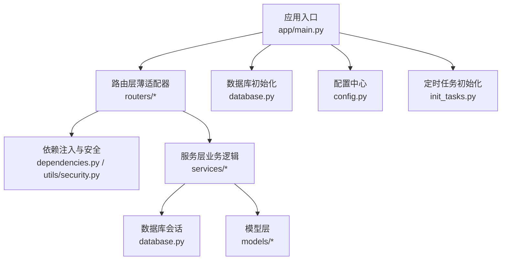
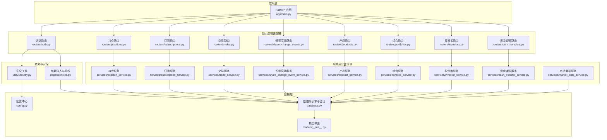
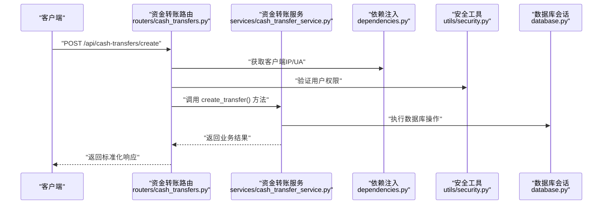
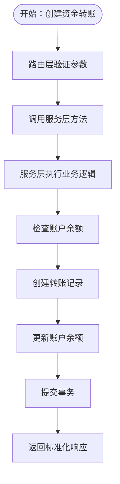
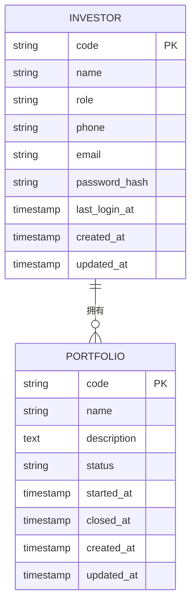
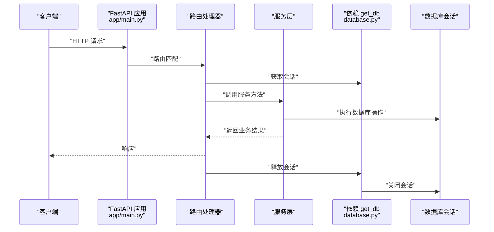
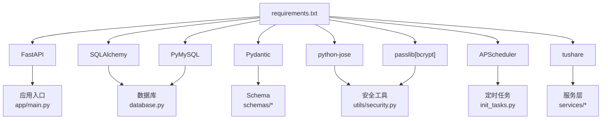

# 后端架构

<cite>
**本文引用的文件**
- [backend/app/main.py](file://backend/app/main.py)
- [backend/app/config.py](file://backend/app/config.py)
- [backend/app/database.py](file://backend/app/database.py)
- [backend/app/dependencies.py](file://backend/app/dependencies.py)
- [backend/app/utils/security.py](file://backend/app/utils/security.py)
- [backend/app/routers/auth.py](file://backend/app/routers/auth.py)
- [backend/app/schemas/auth.py](file://backend/app/schemas/auth.py)
- [backend/app/services/market_data_service.py](file://backend/app/services/market_data_service.py)
- [backend/app/init_tasks.py](file://backend/app/init_tasks.py)
- [backend/app/models/__init__.py](file://backend/app/models/__init__.py)
- [backend/app/models/investor.py](file://backend/app/models/investor.py)
- [backend/app/models/portfolio.py](file://backend/app/models/portfolio.py)
- [backend/requirements.txt](file://backend/requirements.txt)
- [backend/app/services/cash_transfer_service.py](file://backend/app/services/cash_transfer_service.py)
- [backend/app/services/investor_service.py](file://backend/app/services/investor_service.py)
- [backend/app/services/portfolio_service.py](file://backend/app/services/portfolio_service.py)
- [backend/app/services/product_service.py](file://backend/app/services/product_service.py)
- [backend/app/services/share_change_event_service.py](file://backend/app/services/share_change_event_service.py)
- [backend/app/services/trade_service.py](file://backend/app/services/trade_service.py)
- [backend/app/services/subscription_service.py](file://backend/app/services/subscription_service.py)
- [backend/app/services/position_service.py](file://backend/app/services/position_service.py)
- [backend/app/routers/cash_transfers.py](file://backend/app/routers/cash_transfers.py)
- [backend/app/routers/investors.py](file://backend/app/routers/investors.py)
- [backend/app/routers/portfolios.py](file://backend/app/routers/portfolios.py)
- [backend/app/routers/products.py](file://backend/app/routers/products.py)
- [backend/app/routers/share_change_events.py](file://backend/app/routers/share_change_events.py)
- [backend/app/routers/trades.py](file://backend/app/routers/trades.py)
- [backend/app/routers/subscriptions.py](file://backend/app/routers/subscriptions.py)
- [backend/app/routers/positions.py](file://backend/app/routers/positions.py)
</cite>

## 更新摘要
**所做更改**
- 新增完整的服务层模式，包含7个新的服务模块和增强的现有服务
- 路由层简化为薄适配器，业务逻辑迁移到服务层
- 更新了架构图表以反映新的分层架构
- 增强了服务层与路由层的职责分离说明

## 目录
1. [简介](#简介)
2. [项目结构](#项目结构)
3. [核心组件](#核心组件)
4. [架构总览](#架构总览)
5. [详细组件分析](#详细组件分析)
6. [依赖分析](#依赖分析)
7. [性能考虑](#性能考虑)
8. [故障排查指南](#故障排查指南)
9. [结论](#结论)
10. [附录](#附录)

## 简介
本文件为 InvestRing 后端架构的综合文档，聚焦于基于 FastAPI 的分层架构设计与实现细节。经过重大架构重构，系统引入了全面的服务层模式，将业务逻辑从路由层完全分离，实现了清晰的分层架构：路由层作为薄适配器负责请求处理，服务层封装复杂业务逻辑，数据模型层处理数据库操作。文档涵盖依赖注入机制、中间件系统与异常处理策略；数据库连接与会话管理、事务处理模式；业务逻辑封装、数据验证与 API 版本控制策略；并发与资源管理、性能优化方案；API 路由组织、权限控制与安全机制；并提供架构图与数据流图，帮助开发者与运维人员快速理解与维护系统。

## 项目结构
后端采用"按功能域分层"的组织方式，经过重构后形成了更加清晰的三层架构：
- **应用入口与路由注册**：在应用入口集中创建数据库表、初始化定时任务、注册各模块路由。
- **配置中心**：统一读取环境变量与默认参数，生成数据库连接字符串。
- **数据库层**：SQLAlchemy 引擎、会话工厂、基础模型基类与依赖注入的 get_db。
- **依赖注入与安全**：通用依赖（如鉴权、IP/UA 获取、登录日志）、JWT 工具与登录风控。
- **路由层（薄适配器）**：简化后的路由仅负责请求参数验证、调用服务层方法、返回响应结果。
- **服务层（业务逻辑核心）**：封装所有业务逻辑，包括资金转账、投资者管理、投资组合、产品管理、份额变动事件、交易、订阅、持仓等核心业务。
- **模型层**：ORM 映射，统一导出以便 Alembic 迁移与依赖。
- **定时任务初始化**：启动时确保核心计划任务记录存在。

**图表来源**
- [backend/app/main.py:1-53](file://backend/app/main.py#L1-L53)
- [backend/app/database.py:1-39](file://backend/app/database.py#L1-L39)
- [backend/app/config.py:1-37](file://backend/app/config.py#L1-L37)
- [backend/app/dependencies.py:1-146](file://backend/app/dependencies.py#L1-L146)
- [backend/app/utils/security.py:1-103](file://backend/app/utils/security.py#L1-L103)
- [backend/app/services/market_data_service.py:1-323](file://backend/app/services/market_data_service.py#L1-L323)
- [backend/app/init_tasks.py:1-45](file://backend/app/init_tasks.py#L1-L45)

**章节来源**
- [backend/app/main.py:1-53](file://backend/app/main.py#L1-L53)
- [backend/app/config.py:1-37](file://backend/app/config.py#L1-L37)
- [backend/app/database.py:1-39](file://backend/app/database.py#L1-L39)
- [backend/app/models/__init__.py:1-46](file://backend/app/models/__init__.py#L1-L46)

## 核心组件
- **应用入口与路由注册**：集中创建表、初始化定时任务、注册认证、投资人、组合、产品、平台、交易日历、数据源、市场数据、订阅、交易、份额变动事件、持仓、日志、任务、通知、v1 快照等路由。
- **配置中心**：统一读取数据库、安全密钥、Tushare Token、应用调试开关等，支持从 .env 文件加载。
- **数据库层**：创建带连接池的引擎（含 SQLite WAL 配置）、会话工厂、基础模型基类与 get_db 依赖。
- **依赖注入与安全**：HTTP Bearer 认证、获取客户端 IP/UA、登录日志记录、JWT 解码与黑名单、账户锁定与失败追踪。
- **路由层（薄适配器）**：简化后的路由仅负责参数验证、调用服务层、返回响应，不再包含业务逻辑。
- **服务层（业务逻辑核心）**：新增7个专门的服务模块，每个服务专注于特定业务领域，提供完整的业务逻辑封装。
- **模型层**：ORM 映射，统一导出以便迁移与依赖。
- **定时任务初始化**：启动时确保核心计划任务记录存在。

**章节来源**
- [backend/app/main.py:17-53](file://backend/app/main.py#L17-L53)
- [backend/app/config.py:5-37](file://backend/app/config.py#L5-L37)
- [backend/app/database.py:7-39](file://backend/app/database.py#L7-L39)
- [backend/app/dependencies.py:11-146](file://backend/app/dependencies.py#L11-L146)
- [backend/app/utils/security.py:15-103](file://backend/app/utils/security.py#L15-L103)
- [backend/app/routers/auth.py:29-186](file://backend/app/routers/auth.py#L29-L186)
- [backend/app/services/market_data_service.py:15-323](file://backend/app/services/market_data_service.py#L15-L323)
- [backend/app/init_tasks.py:5-45](file://backend/app/init_tasks.py#L5-L45)

## 架构总览
下图展示 InvestRing 后端经过重构后的整体架构：FastAPI 应用作为入口，通过依赖注入获取数据库会话，简化的路由层作为薄适配器负责请求处理与权限控制，服务层封装所有业务逻辑，模型层映射数据库表，配置中心与数据库层提供基础设施支撑。

**图表来源**
- [backend/app/main.py:17-53](file://backend/app/main.py#L17-L53)
- [backend/app/routers/auth.py:29-186](file://backend/app/routers/auth.py#L29-L186)
- [backend/app/routers/cash_transfers.py:1-100](file://backend/app/routers/cash_transfers.py#L1-100)
- [backend/app/routers/investors.py:1-100](file://backend/app/routers/investors.py#L1-100)
- [backend/app/routers/portfolios.py:18-276](file://backend/app/routers/portfolios.py#L18-L276)
- [backend/app/routers/products.py:1-100](file://backend/app/routers/products.py#L1-100)
- [backend/app/routers/share_change_events.py:1-100](file://backend/app/routers/share_change_events.py#L1-100)
- [backend/app/routers/trades.py:1-100](file://backend/app/routers/trades.py#L1-100)
- [backend/app/routers/subscriptions.py:1-100](file://backend/app/routers/subscriptions.py#L1-100)
- [backend/app/routers/positions.py:1-100](file://backend/app/routers/positions.py#L1-100)
- [backend/app/services/market_data_service.py:15-323](file://backend/app/services/market_data_service.py#L15-L323)
- [backend/app/services/cash_transfer_service.py:1-200](file://backend/app/services/cash_transfer_service.py#L1-200)
- [backend/app/services/investor_service.py:1-200](file://backend/app/services/investor_service.py#L1-200)
- [backend/app/services/portfolio_service.py:1-200](file://backend/app/services/portfolio_service.py#L1-200)
- [backend/app/services/product_service.py:1-200](file://backend/app/services/product_service.py#L1-200)
- [backend/app/services/share_change_event_service.py:1-200](file://backend/app/services/share_change_event_service.py#L1-200)
- [backend/app/services/trade_service.py:1-200](file://backend/app/services/trade_service.py#L1-200)
- [backend/app/services/subscription_service.py:1-200](file://backend/app/services/subscription_service.py#L1-200)
- [backend/app/services/position_service.py:1-200](file://backend/app/services/position_service.py#L1-200)
- [backend/app/dependencies.py:49-146](file://backend/app/dependencies.py#L49-L146)
- [backend/app/utils/security.py:29-103](file://backend/app/utils/security.py#L29-L103)
- [backend/app/config.py:5-37](file://backend/app/config.py#L5-L37)
- [backend/app/database.py:7-39](file://backend/app/database.py#L7-L39)
- [backend/app/models/__init__.py:23-46](file://backend/app/models/__init__.py#L23-L46)

## 详细组件分析

### 路由层与权限控制（薄适配器模式）
- **路由组织**：认证、资金转账、投资者、组合、产品、平台、交易日历、数据源、市场数据、订阅、交易、份额变动事件、持仓、日志、任务、通知、v1 快照等路由，均通过 include_router 注册并设置前缀与标签，便于版本控制与权限管理。
- **薄适配器模式**：路由函数现在只负责参数验证、调用相应的服务层方法、处理异常并返回标准化响应，不再包含任何业务逻辑。
- **权限控制**：通过依赖注入实现鉴权与管理员权限校验，支持"要求登录"和"要求管理员"两种装饰器，简化路由函数中的权限判断。

**图表来源**
- [backend/app/routers/cash_transfers.py:1-100](file://backend/app/routers/cash_transfers.py#L1-100)
- [backend/app/services/cash_transfer_service.py:1-200](file://backend/app/services/cash_transfer_service.py#L1-200)
- [backend/app/dependencies.py:14-111](file://backend/app/dependencies.py#L14-L111)
- [backend/app/utils/security.py:15-47](file://backend/app/utils/security.py#L15-L47)
- [backend/app/database.py:33-39](file://backend/app/database.py#L33-L39)

**章节来源**
- [backend/app/main.py:32-48](file://backend/app/main.py#L32-L48)
- [backend/app/routers/auth.py:29-186](file://backend/app/routers/auth.py#L29-L186)
- [backend/app/dependencies.py:132-146](file://backend/app/dependencies.py#L132-L146)

### 服务层与业务逻辑封装（新增完整服务层模式）
**更新** 系统现在采用完整的服务层模式，包含7个专门的服务模块：

- **资金转账服务（cash_transfer_service）**：处理资金转入转出、转账记录管理、余额计算等业务逻辑。
- **投资者服务（investor_service）**：管理投资者信息、持有记录、投资行为等业务逻辑。
- **组合服务（portfolio_service）**：投资组合的创建、管理、净值计算、收益分析等核心业务。
- **产品服务（product_service）**：金融产品的基本信息管理、价格同步、分类管理等。
- **份额变动服务（share_change_event_service）**：处理基金份额变动事件、分红再投资等业务逻辑。
- **交易服务（trade_service）**：增强版交易处理，包括买入卖出、交易确认、费用计算等。
- **订阅服务（subscription_service）**：基金订阅管理、申购赎回、费率计算等业务逻辑。
- **持仓服务（position_service）**：增强版持仓管理，包括实时持仓计算、盈亏分析等。
- **市场数据服务（market_data_service）**：提供价格记录查询、最新价格获取、产品价格同步、组合净值同步等能力。

所有服务都遵循统一的接口设计，使用 SQLAlchemy 会话进行数据库操作，保证事务一致性。

**图表来源**
- [backend/app/services/cash_transfer_service.py:1-200](file://backend/app/services/cash_transfer_service.py#L1-200)
- [backend/app/services/investor_service.py:1-200](file://backend/app/services/investor_service.py#L1-200)
- [backend/app/services/portfolio_service.py:1-200](file://backend/app/services/portfolio_service.py#L1-200)
- [backend/app/services/product_service.py:1-200](file://backend/app/services/product_service.py#L1-200)
- [backend/app/services/share_change_event_service.py:1-200](file://backend/app/services/share_change_event_service.py#L1-200)
- [backend/app/services/trade_service.py:1-200](file://backend/app/services/trade_service.py#L1-200)
- [backend/app/services/subscription_service.py:1-200](file://backend/app/services/subscription_service.py#L1-200)
- [backend/app/services/position_service.py:1-200](file://backend/app/services/position_service.py#L1-200)
- [backend/app/services/market_data_service.py:88-226](file://backend/app/services/market_data_service.py#L88-L226)

**章节来源**
- [backend/app/services/cash_transfer_service.py:1-200](file://backend/app/services/cash_transfer_service.py#L1-200)
- [backend/app/services/investor_service.py:1-200](file://backend/app/services/investor_service.py#L1-200)
- [backend/app/services/portfolio_service.py:1-200](file://backend/app/services/portfolio_service.py#L1-200)
- [backend/app/services/product_service.py:1-200](file://backend/app/services/product_service.py#L1-200)
- [backend/app/services/share_change_event_service.py:1-200](file://backend/app/services/share_change_event_service.py#L1-200)
- [backend/app/services/trade_service.py:1-200](file://backend/app/services/trade_service.py#L1-200)
- [backend/app/services/subscription_service.py:1-200](file://backend/app/services/subscription_service.py#L1-200)
- [backend/app/services/position_service.py:1-200](file://backend/app/services/position_service.py#L1-200)
- [backend/app/services/market_data_service.py:15-323](file://backend/app/services/market_data_service.py#L15-L323)

### 数据模型层与 ORM 设计
- **模型导出**：统一导出所有 ORM 模型，便于 Alembic 迁移与依赖使用。
- **典型模型**：投资人、组合等，包含主键、索引、默认值与时间戳字段，遵循最小必要字段原则。

**图表来源**
- [backend/app/models/investor.py:5-17](file://backend/app/models/investor.py#L5-L17)
- [backend/app/models/portfolio.py:5-16](file://backend/app/models/portfolio.py#L5-L16)
- [backend/app/models/__init__.py:23-46](file://backend/app/models/__init__.py#L23-L46)

**章节来源**
- [backend/app/models/__init__.py:1-46](file://backend/app/models/__init__.py#L1-L46)
- [backend/app/models/investor.py:1-17](file://backend/app/models/investor.py#L1-L17)
- [backend/app/models/portfolio.py:1-16](file://backend/app/models/portfolio.py#L1-L16)

### 依赖注入机制与中间件系统
- **依赖注入**：get_db 提供数据库会话生命周期管理，确保每次请求获取独立会话并在 finally 中关闭；HTTP Bearer 认证通过 security 依赖自动提取与校验。
- **中间件**：启用 CORS 支持跨域访问，允许任意方法与头，生产环境建议收紧来源与头。

**图表来源**
- [backend/app/main.py:24-30](file://backend/app/main.py#L24-L30)
- [backend/app/database.py:33-39](file://backend/app/database.py#L33-L39)
- [backend/app/dependencies.py:11-11](file://backend/app/dependencies.py#L11-L11)

**章节来源**
- [backend/app/main.py:23-30](file://backend/app/main.py#L23-L30)
- [backend/app/database.py:33-39](file://backend/app/database.py#L33-L39)
- [backend/app/dependencies.py:11-11](file://backend/app/dependencies.py#L11-L11)

### 异常处理策略
- **路由层异常**：通过 HTTPException 返回标准化错误信息，包含错误码、错误类型与消息体，便于前端统一处理。
- **服务层异常**：服务层捕获外部接口异常与数据库异常，返回结构化结果（成功/失败、消息、数量等），避免泄露内部异常细节。
- **登录风控**：失败次数超过阈值临时锁定账户，防止暴力破解。

**章节来源**
- [backend/app/routers/auth.py:37-72](file://backend/app/routers/auth.py#L37-L72)
- [backend/app/utils/security.py:57-81](file://backend/app/utils/security.py#L57-L81)
- [backend/app/services/market_data_service.py:135-138](file://backend/app/services/market_data_service.py#L135-L138)

### 数据库连接管理、会话管理与事务处理
- **连接池配置**：设置连接池大小、溢出上限、pre_ping 与回收时间，提升并发稳定性与连接健康度。
- **SQLite 特性**：启用 WAL 模式、调整 busy_timeout 与同步级别，改善并发与可靠性。
- **会话生命周期**：get_db 使用生成器模式，在 try/finally 中确保会话关闭，避免连接泄漏。
- **事务处理**：服务层在批量写入前后显式 commit/rollback，失败时回滚并更新数据源状态。

**章节来源**
- [backend/app/database.py:7-39](file://backend/app/database.py#L7-L39)
- [backend/app/services/market_data_service.py:209-214](file://backend/app/services/market_data_service.py#L209-L214)

### API 版本控制策略
- **v1 快照路由**：通过前缀 /api/v1 对特定功能进行版本隔离，便于后续演进与向后兼容。
- **标签与前缀**：路由注册时统一设置 tags 与 prefix，形成清晰的命名空间与文档分组。

**章节来源**
- [backend/app/main.py:48-48](file://backend/app/main.py#L48-L48)

### 并发处理与资源管理
- **连接池**：合理设置 pool_size 与 max_overflow，平衡吞吐与资源占用。
- **pre_ping 与 recycle**：定期校验连接可用性，避免僵尸连接影响性能。
- **会话作用域**：每个请求一个会话，避免跨请求共享状态引发竞态。
- **外部接口幂等**：服务层对重复数据进行去重处理，减少无效写入。

**章节来源**
- [backend/app/database.py:12-16](file://backend/app/database.py#L12-L16)
- [backend/app/services/market_data_service.py:147-153](file://backend/app/services/market_data_service.py#L147-L153)

## 依赖分析
- **外部依赖**：FastAPI、SQLAlchemy、Pydantic、JWTPy、bcrypt、HTTPX、APScheduler、TuShare、PyMySQL 等。
- **内部依赖**：路由依赖于数据库会话与安全工具；服务层依赖模型与外部数据源客户端；配置中心为数据库与安全模块提供参数。

**图表来源**
- [backend/requirements.txt:1-19](file://backend/requirements.txt#L1-L19)
- [backend/app/main.py:1-53](file://backend/app/main.py#L1-L53)
- [backend/app/database.py:1-39](file://backend/app/database.py#L1-L39)
- [backend/app/utils/security.py:1-103](file://backend/app/utils/security.py#L1-L103)
- [backend/app/services/market_data_service.py:1-323](file://backend/app/services/market_data_service.py#L1-L323)
- [backend/app/init_tasks.py:1-45](file://backend/app/init_tasks.py#L1-L45)

**章节来源**
- [backend/requirements.txt:1-19](file://backend/requirements.txt#L1-L19)

## 性能考虑
- **连接池与预热**：合理配置 pool_size 与 max_overflow，避免高并发下的连接争用。
- **SQL 执行优化**：服务层对批量写入前先加载现有记录到内存字典，降低多次查询与重复写入成本。
- **外部接口幂等**：对重复数据进行去重，减少无效写入与网络开销。
- **缓存与热点**：登录失败追踪与黑名单使用内存集合，降低数据库压力。
- **调试与可观测性**：开启数据库 echo 便于开发调试，生产环境建议关闭。
- **服务层优化**：新的服务层模式减少了路由层的复杂性，提高了代码复用性和测试便利性。

**章节来源**
- [backend/app/database.py:12-16](file://backend/app/database.py#L12-L16)
- [backend/app/services/market_data_service.py:147-166](file://backend/app/services/market_data_service.py#L147-L166)
- [backend/app/utils/security.py:10-10](file://backend/app/utils/security.py#L10-L10)
- [backend/app/config.py:23-23](file://backend/app/config.py#L23-L23)

## 故障排查指南
- **认证失败**：检查令牌格式、签名密钥、是否在黑名单、是否被锁定；查看登录日志记录。
- **数据同步异常**：确认外部数据源可用性、错误详情与返回数据格式；检查数据库写入异常与回滚路径。
- **权限不足**：确认用户角色与路由依赖的权限装饰器配置。
- **数据库连接问题**：检查连接池配置、SQLite WAL 设置、连接超时与回收策略。
- **服务层错误**：检查具体服务模块的错误日志，定位业务逻辑问题。
- **路由层问题**：验证参数传递是否正确，服务层调用是否成功。

**章节来源**
- [backend/app/routers/auth.py:37-119](file://backend/app/routers/auth.py#L37-L119)
- [backend/app/utils/security.py:49-103](file://backend/app/utils/security.py#L49-L103)
- [backend/app/services/market_data_service.py:135-214](file://backend/app/services/market_data_service.py#L135-L214)
- [backend/app/database.py:19-26](file://backend/app/database.py#L19-L26)

## 结论
InvestRing 后端经过重大架构重构，采用了清晰的分层架构与依赖注入机制。新的服务层模式将业务逻辑从路由层完全分离，形成了薄适配器模式的路由层和完整的服务层。结合 SQLAlchemy 会话管理与事务处理，实现了稳定的数据访问与业务封装。通过路由前缀与标签实现 API 版本控制与权限管理，配合 JWT、登录风控与 CORS 中间件，构建了安全可控的应用体系。服务层对市场数据的同步与净值计算进行了抽象，具备良好的扩展性与可维护性。

## 附录
- **启动流程要点**：创建表 → 初始化定时任务 → 注册路由 → 启动服务。
- **安全建议**：生产环境收紧 CORS 来源与头；更换默认密钥；启用 HTTPS；限制令牌过期时间。
- **架构重构要点**：路由层简化为薄适配器，所有业务逻辑迁移到服务层，提高了代码的可测试性和可维护性。

**章节来源**
- [backend/app/main.py:7-15](file://backend/app/main.py#L7-L15)
- [backend/app/main.py:24-30](file://backend/app/main.py#L24-L30)
- [backend/app/config.py:14-16](file://backend/app/config.py#L14-L16)