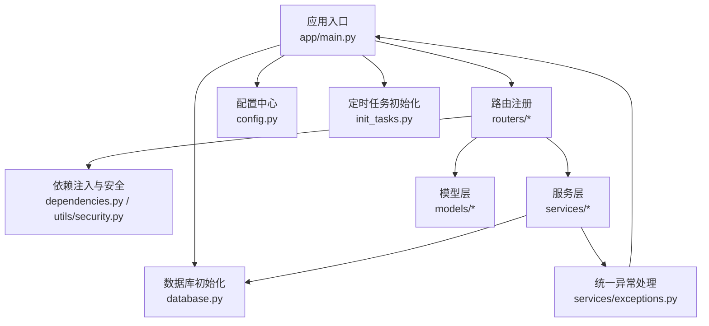
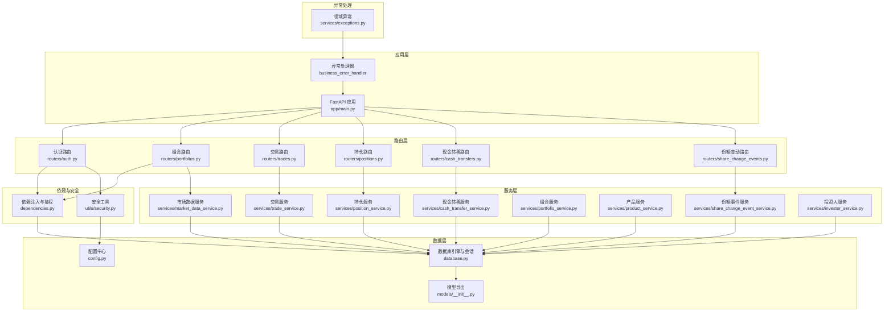
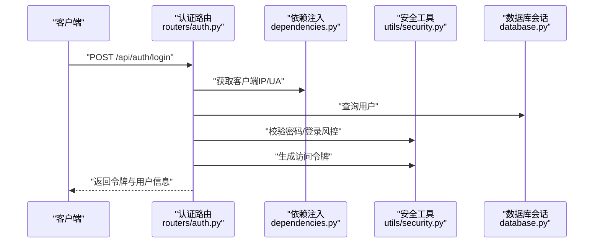
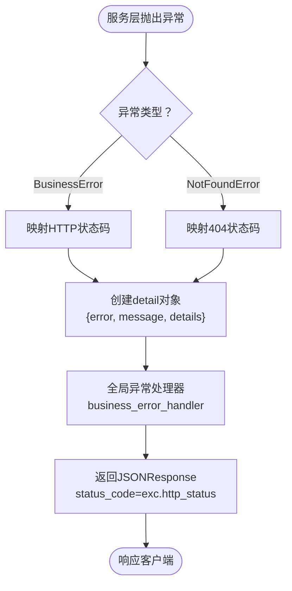
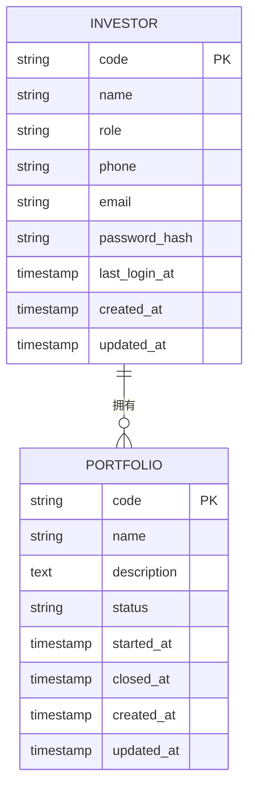
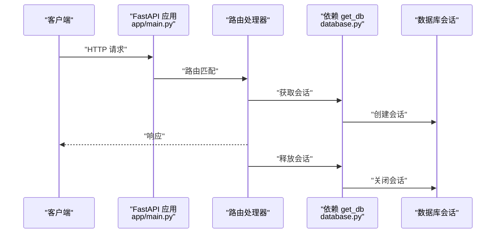
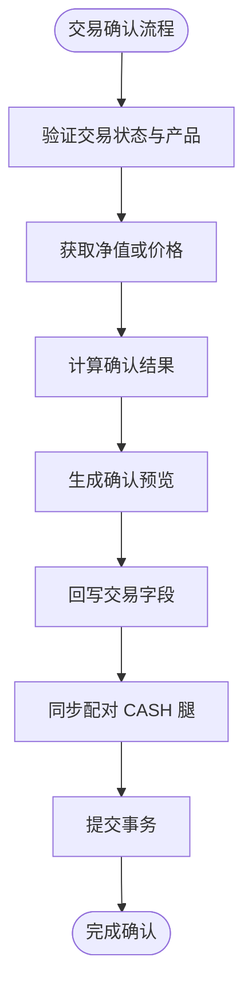
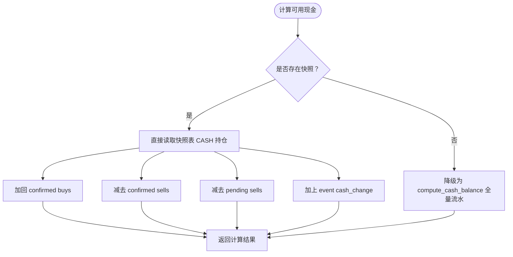
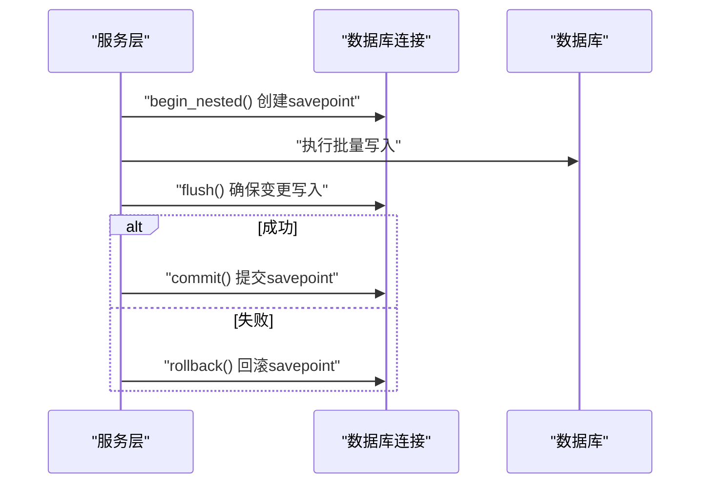
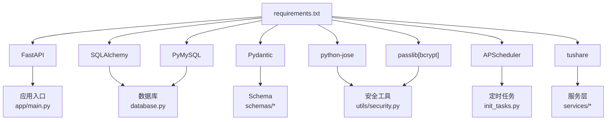

# 后端架构

<cite>
**本文引用的文件**
- [backend/app/main.py](file://backend/app/main.py)
- [backend/app/config.py](file://backend/app/config.py)
- [backend/app/database.py](file://backend/app/database.py)
- [backend/app/dependencies.py](file://backend/app/dependencies.py)
- [backend/app/utils/security.py](file://backend/app/utils/security.py)
- [backend/app/routers/auth.py](file://backend/app/routers/auth.py)
- [backend/app/schemas/auth.py](file://backend/app/schemas/auth.py)
- [backend/app/routers/portfolios.py](file://backend/app/routers/portfolios.py)
- [backend/app/schemas/portfolio.py](file://backend/app/schemas/portfolio.py)
- [backend/app/services/market_data_service.py](file://backend/app/services/market_data_service.py)
- [backend/app/init_tasks.py](file://backend/app/init_tasks.py)
- [backend/app/models/__init__.py](file://backend/app/models/__init__.py)
- [backend/app/models/investor.py](file://backend/app/models/investor.py)
- [backend/app/models/portfolio.py](file://backend/app/models/portfolio.py)
- [backend/app/services/exceptions.py](file://backend/app/services/exceptions.py)
- [backend/app/services/position_service.py](file://backend/app/services/position_service.py)
- [backend/app/services/trade_service.py](file://backend/app/services/trade_service.py)
- [backend/app/services/cash_transfer_service.py](file://backend/app/services/cash_transfer_service.py)
- [backend/app/services/portfolio_service.py](file://backend/app/services/portfolio_service.py)
- [backend/app/services/product_service.py](file://backend/app/services/product_service.py)
- [backend/app/services/share_change_event_service.py](file://backend/app/services/share_change_event_service.py)
- [backend/app/services/investor_service.py](file://backend/app/services/investor_service.py)
- [backend/app/routers/trades.py](file://backend/app/routers/trades.py)
- [backend/app/routers/positions.py](file://backend/app/routers/positions.py)
- [backend/requirements.txt](file://backend/requirements.txt)
</cite>

## 更新摘要
**所做更改**
- 新增服务层架构重大重构章节，详细说明六大核心服务模块的职责划分
- 完善统一异常处理机制，包含 BusinessError 和 NotFoundError 的完整实现
- 增强事务管理策略，说明 savepoint 和嵌套事务的使用模式
- 更新实时现金计算基线对齐快照口径的实现细节
- 完善依赖注入与中间件系统，体现新的异常处理集成
- 新增服务层架构图和数据流图

## 目录
1. [简介](#简介)
2. [项目结构](#项目结构)
3. [核心组件](#核心组件)
4. [架构总览](#架构总览)
5. [详细组件分析](#详细组件分析)
6. [服务层架构重构](#服务层架构重构)
7. [依赖分析](#依赖分析)
8. [性能考虑](#性能考虑)
9. [故障排查指南](#故障排查指南)
10. [结论](#结论)
11. [附录](#附录)

## 简介
本文件为 InvestRing 后端架构的综合文档，聚焦于基于 FastAPI 的分层架构设计与实现细节，涵盖路由层、服务层、数据模型层的职责划分；依赖注入机制、中间件系统与异常处理策略；数据库连接与会话管理、事务处理模式；业务逻辑封装、数据验证与 API 版本控制策略；并发与资源管理、性能优化方案；API 路由组织、权限控制与安全机制；并提供架构图与数据流图，帮助开发者与运维人员快速理解与维护系统。

**最新更新**：本次更新重点反映了服务层架构的重大重构，包括统一的异常处理机制（BusinessError、NotFoundError）、清晰的关注点分离以及业务逻辑的模块化封装。新增了六大核心服务模块：交易服务、组合管理服务、产品管理服务、份额变动事件服务、现金转移服务和投资人服务。

## 项目结构
后端采用"按功能域分层"的组织方式：
- 应用入口与路由注册：在应用入口集中创建数据库表、初始化定时任务、注册各模块路由。
- 配置中心：统一读取环境变量与默认参数，生成数据库连接字符串。
- 数据库层：SQLAlchemy 引擎、会话工厂、基础模型基类与依赖注入的 get_db。
- 依赖注入与安全：通用依赖（如鉴权、IP/UA 获取、登录日志）、JWT 工具与登录风控。
- 路由层：按领域拆分多个 APIRouter，统一前缀与标签，便于版本控制与权限管理。
- 服务层：封装业务逻辑（如市场数据同步、净值计算等），复用 SQLAlchemy 会话，使用统一异常处理。
- 模型层：ORM 映射，统一导出以便 Alembic 迁移与依赖。
- 定时任务初始化：启动时确保核心计划任务记录存在。

**图表来源**
- [backend/app/main.py:1-91](file://backend/app/main.py#L1-L91)
- [backend/app/database.py:1-39](file://backend/app/database.py#L1-L39)
- [backend/app/config.py:1-37](file://backend/app/config.py#L1-L37)
- [backend/app/dependencies.py:1-146](file://backend/app/dependencies.py#L1-L146)
- [backend/app/utils/security.py:1-103](file://backend/app/utils/security.py#L1-L103)
- [backend/app/services/market_data_service.py:1-323](file://backend/app/services/market_data_service.py#L1-L323)
- [backend/app/init_tasks.py:1-45](file://backend/app/init_tasks.py#L1-L45)
- [backend/app/services/exceptions.py:1-42](file://backend/app/services/exceptions.py#L1-L42)

**章节来源**
- [backend/app/main.py:1-91](file://backend/app/main.py#L1-L91)
- [backend/app/config.py:1-37](file://backend/app/config.py#L1-L37)
- [backend/app/database.py:1-39](file://backend/app/database.py#L1-L39)
- [backend/app/models/__init__.py:1-46](file://backend/app/models/__init__.py#L1-L46)

## 核心组件
- 应用入口与路由注册：集中创建表、初始化定时任务、注册认证、投资人、组合、产品、平台、交易日历、数据源、市场数据、订阅、交易、份额变动事件、持仓、日志、任务、通知、v1 快照等路由。
- 配置中心：统一读取数据库、安全密钥、Tushare Token、应用调试开关等，支持从 .env 文件加载。
- 数据库层：创建带连接池的引擎（含 SQLite WAL 配置）、会话工厂、基础模型基类与 get_db 依赖。
- 依赖注入与安全：HTTP Bearer 认证、获取客户端 IP/UA、登录日志记录、JWT 解码与黑名单、账户锁定与失败追踪。
- 路由层：按领域拆分 APIRouter，统一前缀与标签，结合依赖实现鉴权与权限控制。
- 服务层：封装市场数据查询、价格同步、净值计算等业务逻辑，统一使用 SQLAlchemy 会话，采用统一异常处理机制。
- 模型层：ORM 映射，统一导出以便迁移与依赖。
- 定时任务初始化：启动时确保核心计划任务记录存在。

**章节来源**
- [backend/app/main.py:17-91](file://backend/app/main.py#L17-L91)
- [backend/app/config.py:5-37](file://backend/app/config.py#L5-L37)
- [backend/app/database.py:7-39](file://backend/app/database.py#L7-L39)
- [backend/app/dependencies.py:11-146](file://backend/app/dependencies.py#L11-L146)
- [backend/app/utils/security.py:15-103](file://backend/app/utils/security.py#L15-L103)
- [backend/app/routers/auth.py:29-186](file://backend/app/routers/auth.py#L29-L186)
- [backend/app/services/market_data_service.py:15-323](file://backend/app/services/market_data_service.py#L15-L323)
- [backend/app/init_tasks.py:5-45](file://backend/app/init_tasks.py#L5-L45)

## 架构总览
下图展示 InvestRing 后端的整体架构：FastAPI 应用作为入口，通过依赖注入获取数据库会话，路由层负责请求处理与权限控制，服务层封装业务逻辑并使用统一异常处理，模型层映射数据库表，配置中心与数据库层提供基础设施支撑。

**图表来源**
- [backend/app/main.py:55-61](file://backend/app/main.py#L55-L61)
- [backend/app/routers/auth.py:29-186](file://backend/app/routers/auth.py#L29-L186)
- [backend/app/routers/portfolios.py:1-131](file://backend/app/routers/portfolios.py#L1-L131)
- [backend/app/routers/trades.py:1-281](file://backend/app/routers/trades.py#L1-L281)
- [backend/app/routers/positions.py:1-204](file://backend/app/routers/positions.py#L1-L204)
- [backend/app/services/market_data_service.py:15-323](file://backend/app/services/market_data_service.py#L15-L323)
- [backend/app/services/position_service.py:1-399](file://backend/app/services/position_service.py#L1-L399)
- [backend/app/services/trade_service.py:1-497](file://backend/app/services/trade_service.py#L1-L497)
- [backend/app/services/cash_transfer_service.py:1-210](file://backend/app/services/cash_transfer_service.py#L1-L210)
- [backend/app/services/portfolio_service.py:1-173](file://backend/app/services/portfolio_service.py#L1-L173)
- [backend/app/services/product_service.py:1-114](file://backend/app/services/product_service.py#L1-L114)
- [backend/app/services/share_change_event_service.py:1-397](file://backend/app/services/share_change_event_service.py#L1-L397)
- [backend/app/services/investor_service.py:1-67](file://backend/app/services/investor_service.py#L1-L67)
- [backend/app/services/exceptions.py:13-42](file://backend/app/services/exceptions.py#L13-L42)
- [backend/app/dependencies.py:49-146](file://backend/app/dependencies.py#L49-L146)
- [backend/app/utils/security.py:29-103](file://backend/app/utils/security.py#L29-L103)
- [backend/app/config.py:5-37](file://backend/app/config.py#L5-L37)
- [backend/app/database.py:7-39](file://backend/app/database.py#L7-L39)
- [backend/app/models/__init__.py:23-46](file://backend/app/models/__init__.py#L23-L46)

## 详细组件分析

### 路由层与权限控制
- 路由组织：认证、投资人、组合、产品、平台、交易日历、数据源、市场数据、订阅、交易、份额变动事件、持仓、日志、任务、通知、v1 快照等路由，均通过 include_router 注册并设置前缀与标签，便于版本控制与权限管理。
- 权限控制：通过依赖注入实现鉴权与管理员权限校验，支持"要求登录"和"要求管理员"两种装饰器，简化路由函数中的权限判断。

**图表来源**
- [backend/app/routers/auth.py:29-96](file://backend/app/routers/auth.py#L29-L96)
- [backend/app/dependencies.py:14-111](file://backend/app/dependencies.py#L14-L111)
- [backend/app/utils/security.py:15-47](file://backend/app/utils/security.py#L15-L47)
- [backend/app/database.py:33-39](file://backend/app/database.py#L33-L39)

**章节来源**
- [backend/app/main.py:64-81](file://backend/app/main.py#L64-L81)
- [backend/app/routers/auth.py:29-186](file://backend/app/routers/auth.py#L29-L186)
- [backend/app/dependencies.py:132-146](file://backend/app/dependencies.py#L132-L146)

### 统一异常处理机制
系统引入了统一的领域异常处理机制，实现了服务层与路由层的清晰分离。

- **BusinessError**：业务规则违反异常，包含稳定的错误码、人类可读描述、HTTP状态码映射和可选的结构化详情。
- **NotFoundError**：资源不存在异常，继承自 BusinessError，自动映射到 404 状态码。
- **全局异常处理器**：在 main.py 中注册 BusinessError 处理器，将领域异常转换为标准化的 JSONResponse。

**图表来源**
- [backend/app/services/exceptions.py:13-42](file://backend/app/services/exceptions.py#L13-L42)
- [backend/app/main.py:55-61](file://backend/app/main.py#L55-L61)

**章节来源**
- [backend/app/services/exceptions.py:1-42](file://backend/app/services/exceptions.py#L1-L42)
- [backend/app/main.py:55-61](file://backend/app/main.py#L55-L61)

### 数据模型层与 ORM 设计
- 模型导出：统一导出所有 ORM 模型，便于 Alembic 迁移与依赖使用。
- 典型模型：投资人、组合等，包含主键、索引、默认值与时间戳字段，遵循最小必要字段原则。

**图表来源**
- [backend/app/models/investor.py:5-17](file://backend/app/models/investor.py#L5-L17)
- [backend/app/models/portfolio.py:5-16](file://backend/app/models/portfolio.py#L5-L16)
- [backend/app/models/__init__.py:23-46](file://backend/app/models/__init__.py#L23-L46)

**章节来源**
- [backend/app/models/__init__.py:1-46](file://backend/app/models/__init__.py#L1-L46)
- [backend/app/models/investor.py:1-17](file://backend/app/models/investor.py#L1-L17)
- [backend/app/models/portfolio.py:1-16](file://backend/app/models/portfolio.py#L1-L16)

### 依赖注入机制与中间件系统
- 依赖注入：get_db 提供数据库会话生命周期管理，确保每次请求获取独立会话并在 finally 中关闭；HTTP Bearer 认证通过 security 依赖自动提取与校验。
- 中间件：启用 CORS 支持跨域访问，允许任意方法与头，生产环境建议收紧来源与头。

**图表来源**
- [backend/app/main.py:24-30](file://backend/app/main.py#L24-L30)
- [backend/app/database.py:33-39](file://backend/app/database.py#L33-L39)
- [backend/app/dependencies.py:11-11](file://backend/app/dependencies.py#L11-L11)

**章节来源**
- [backend/app/main.py:23-30](file://backend/app/main.py#L23-L30)
- [backend/app/database.py:33-39](file://backend/app/database.py#L33-L39)
- [backend/app/dependencies.py:11-11](file://backend/app/dependencies.py#L11-L11)

### 异常处理策略
异常处理策略现在包含统一的领域异常机制。

- **领域异常**：服务层抛出 BusinessError 和 NotFoundError，包含稳定的错误码和结构化信息。
- **全局处理器**：main.py 中的 business_error_handler 将领域异常转换为标准化的 JSONResponse。
- **路由层异常**：通过 HTTPException 返回标准化错误信息，包含错误码、错误类型与消息体，便于前端统一处理。
- **业务层异常**：服务层捕获外部接口异常与数据库异常，返回结构化结果（成功/失败、消息、数量等），避免泄露内部异常细节。
- **登录风控**：失败次数超过阈值临时锁定账户，防止暴力破解。

**章节来源**
- [backend/app/services/exceptions.py:13-42](file://backend/app/services/exceptions.py#L13-L42)
- [backend/app/main.py:55-61](file://backend/app/main.py#L55-L61)
- [backend/app/routers/auth.py:37-72](file://backend/app/routers/auth.py#L37-L72)
- [backend/app/utils/security.py:57-81](file://backend/app/utils/security.py#L57-L81)
- [backend/app/services/market_data_service.py:135-138](file://backend/app/services/market_data_service.py#L135-L138)

### 数据库连接管理、会话管理与事务处理
- 连接池配置：设置连接池大小、溢出上限、pre_ping 与回收时间，提升并发稳定性与连接健康度。
- SQLite 特性：启用 WAL 模式、调整 busy_timeout 与同步级别，改善并发与可靠性。
- 会话生命周期：get_db 使用生成器模式，在 try/finally 中确保会话关闭，避免连接泄漏。
- 事务处理：服务层在批量写入前后显式 commit/rollback，失败时回滚并更新数据源状态。

**章节来源**
- [backend/app/database.py:7-39](file://backend/app/database.py#L7-L39)
- [backend/app/services/market_data_service.py:209-214](file://backend/app/services/market_data_service.py#L209-L214)

### API 版本控制策略
- v1 快照路由：通过前缀 /api/v1 对特定功能进行版本隔离，便于后续演进与向后兼容。
- 标签与前缀：路由注册时统一设置 tags 与 prefix，形成清晰的命名空间与文档分组。

**章节来源**
- [backend/app/main.py:79-79](file://backend/app/main.py#L79-L79)

### 并发处理与资源管理
- 连接池：合理设置 pool_size 与 max_overflow，平衡吞吐与资源占用。
- pre_ping 与 recycle：定期校验连接可用性，避免僵尸连接影响性能。
- 会话作用域：每个请求一个会话，避免跨请求共享状态引发竞态。
- 外部接口幂等：服务层对重复数据进行去重处理，减少无效写入。

**章节来源**
- [backend/app/database.py:12-16](file://backend/app/database.py#L12-L16)
- [backend/app/services/market_data_service.py:147-153](file://backend/app/services/market_data_service.py#L147-L153)

## 服务层架构重构

### 服务层设计原则
服务层经过重大重构，实现了清晰的关注点分离和统一的异常处理。所有服务模块遵循以下原则：
- **单一职责**：每个服务专注于特定业务领域的操作
- **无副作用**：服务层不直接 commit，由调用方控制事务边界
- **统一异常**：只抛出 BusinessError 和 NotFoundError，不感知 HTTP
- **可测试性**：纯函数式设计，便于单元测试和集成测试

### 核心服务模块

#### 交易服务 (trade_service.py)
处理调仓交易确认的核心业务逻辑，包括净值获取、份额/金额重算、配对 CASH 腿同步等复杂逻辑。

**图表来源**
- [backend/app/services/trade_service.py:269-325](file://backend/app/services/trade_service.py#L269-L325)

#### 组合管理服务 (portfolio_service.py)
处理组合的创建、更新、关闭/重新激活状态机，以及净值历史/收益率/资金流查询。

#### 产品管理服务 (product_service.py)
提供 confirm_days 计算（单一实现）与产品 CRUD，从路由层提取供 REST 与 CLI 共用。

#### 份额变动事件服务 (share_change_event_service.py)
将份额变动事件的校验、计算、确认拆分、取消/取消确认逻辑从路由层提取，供 REST API、CLI、快照重算自动确认多处复用。

#### 现金转移服务 (cash_transfer_service.py)
实现平台间现金转移，通过 transfer_group 关联两条 CASH 交易，支持对称状态模型。

#### 投资人服务 (investor_service.py)
投资人 CRUD 与删除保护（INVESTOR_HAS_SHARES），从路由层提取供 REST 与 CLI 共用。

### 实时现金计算基线对齐快照口径
calculate_available_cash 已实现基线对齐：从全量流水重算改为直接读快照表 portfolio_position，与 _generate_portfolio_position 增量范式口径一致。

**图表来源**
- [backend/app/services/position_service.py:144-164](file://backend/app/services/position_service.py#L144-L164)

**章节来源**
- [backend/app/services/trade_service.py:1-595](file://backend/app/services/trade_service.py#L1-L595)
- [backend/app/services/portfolio_service.py:1-296](file://backend/app/services/portfolio_service.py#L1-L296)
- [backend/app/services/product_service.py:1-114](file://backend/app/services/product_service.py#L1-L114)
- [backend/app/services/share_change_event_service.py:1-397](file://backend/app/services/share_change_event_service.py#L1-L397)
- [backend/app/services/cash_transfer_service.py:1-210](file://backend/app/services/cash_transfer_service.py#L1-L210)
- [backend/app/services/investor_service.py:1-67](file://backend/app/services/investor_service.py#L1-L67)
- [backend/app/services/position_service.py:120-164](file://backend/app/services/position_service.py#L120-L164)

### 事务管理策略
服务层采用精细化的事务管理策略：

- **Savepoint 模式**：使用 `db.connection().begin_nested()` 创建连接级 SAVEPOINT，避免触发 after_transaction_end 事件与测试隔离监听器冲突
- **原子操作**：关键业务逻辑包裹在 try/except 中，失败时回滚 savepoint 而不影响外层事务
- **批量写入**：先 flush 确保 ORM 变更在 savepoint 内写入 DB，再 commit savepoint

**图表来源**
- [backend/app/services/trade_service.py:120-150](file://backend/app/services/trade_service.py#L120-L150)
- [backend/app/services/share_change_event_service.py:120-150](file://backend/app/services/share_change_event_service.py#L120-L150)

**章节来源**
- [backend/app/services/trade_service.py:120-150](file://backend/app/services/trade_service.py#L120-L150)
- [backend/app/services/share_change_event_service.py:120-150](file://backend/app/services/share_change_event_service.py#L120-L150)

## 依赖分析
- 外部依赖：FastAPI、SQLAlchemy、Pydantic、JWTPy、bcrypt、HTTPX、APScheduler、TuShare、PyMySQL 等。
- 内部依赖：路由依赖于数据库会话与安全工具；服务层依赖模型与外部数据源客户端；配置中心为数据库与安全模块提供参数。

**图表来源**
- [backend/requirements.txt:1-19](file://backend/requirements.txt#L1-L19)
- [backend/app/main.py:1-91](file://backend/app/main.py#L1-L91)
- [backend/app/database.py:1-39](file://backend/app/database.py#L1-L39)
- [backend/app/utils/security.py:1-103](file://backend/app/utils/security.py#L1-L103)
- [backend/app/services/market_data_service.py:1-323](file://backend/app/services/market_data_service.py#L1-L323)
- [backend/app/init_tasks.py:1-45](file://backend/app/init_tasks.py#L1-L45)

**章节来源**
- [backend/requirements.txt:1-19](file://backend/requirements.txt#L1-L19)

## 性能考虑
- 连接池与预热：合理配置 pool_size 与 max_overflow，避免高并发下的连接争用。
- SQL 执行优化：服务层对批量写入前先加载现有记录到内存字典，降低多次查询与重复写入成本。
- 外部接口幂等：对重复数据进行去重，减少无效写入与网络开销。
- 缓存与热点：登录失败追踪与黑名单使用内存集合，降低数据库压力。
- 调试与可观测性：开启数据库 echo 便于开发调试，生产环境建议关闭。

**章节来源**
- [backend/app/database.py:12-16](file://backend/app/database.py#L12-L16)
- [backend/app/services/market_data_service.py:147-166](file://backend/app/services/market_data_service.py#L147-L166)
- [backend/app/utils/security.py:10-10](file://backend/app/utils/security.py#L10-L10)
- [backend/app/config.py:23-23](file://backend/app/config.py#L23-L23)

## 故障排查指南
- **认证失败**：检查令牌格式、签名密钥、是否在黑名单、是否被锁定；查看登录日志记录。
- **数据同步异常**：确认外部数据源可用性、错误详情与返回数据格式；检查数据库写入异常与回滚路径。
- **权限不足**：确认用户角色与路由依赖的权限装饰器配置。
- **数据库连接问题**：检查连接池配置、SQLite WAL 设置、连接超时与回收策略。
- **业务异常**：检查服务层抛出的 BusinessError 代码和消息，确认业务规则是否符合预期。
- **资源不存在**：检查 NotFoundError 的使用场景，确认相关资源是否存在。
- **事务异常**：检查 savepoint 使用是否正确，确认事务边界和回滚逻辑。

**章节来源**
- [backend/app/routers/auth.py:37-119](file://backend/app/routers/auth.py#L37-L119)
- [backend/app/utils/security.py:49-103](file://backend/app/utils/security.py#L49-L103)
- [backend/app/services/market_data_service.py:135-214](file://backend/app/services/market_data_service.py#L135-L214)
- [backend/app/database.py:19-26](file://backend/app/database.py#L19-L26)
- [backend/app/services/exceptions.py:13-42](file://backend/app/services/exceptions.py#L13-L42)

## 结论
InvestRing 后端采用清晰的分层架构与依赖注入机制，结合 SQLAlchemy 会话管理与事务处理，实现了稳定的数据访问与业务封装。通过路由前缀与标签实现 API 版本控制与权限管理，配合 JWT、登录风控与 CORS 中间件，构建了安全可控的应用体系。服务层对市场数据的同步与净值计算进行了抽象，具备良好的扩展性与可维护性。

**最新更新**：通过引入统一的异常处理机制和清晰的服务层架构，系统实现了更好的关注点分离、更一致的错误处理和更强的可维护性。六大核心服务模块的划分使得业务逻辑更加清晰，事务管理的精细化提升了系统的稳定性和可靠性。

## 附录
- 启动流程要点：创建表 → 初始化定时任务 → 注册路由 → 启动服务。
- 安全建议：生产环境收紧 CORS 来源与头；更换默认密钥；启用 HTTPS；限制令牌过期时间。

**章节来源**
- [backend/app/main.py:7-15](file://backend/app/main.py#L7-L15)
- [backend/app/main.py:24-30](file://backend/app/main.py#L24-L30)
- [backend/app/config.py:14-16](file://backend/app/config.py#L14-L16)