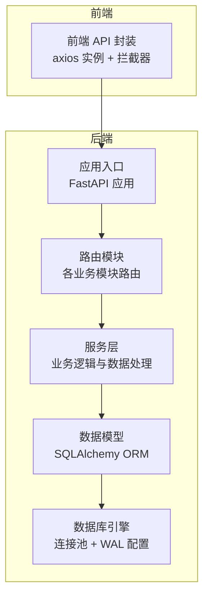
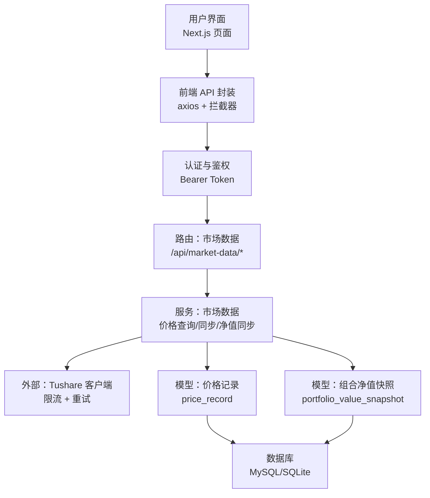
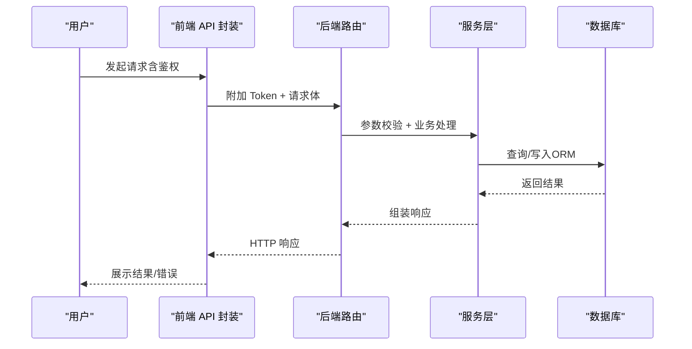
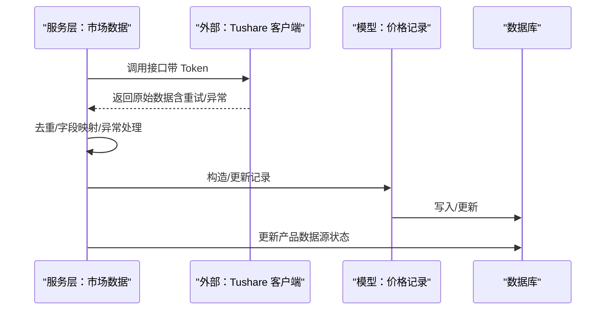
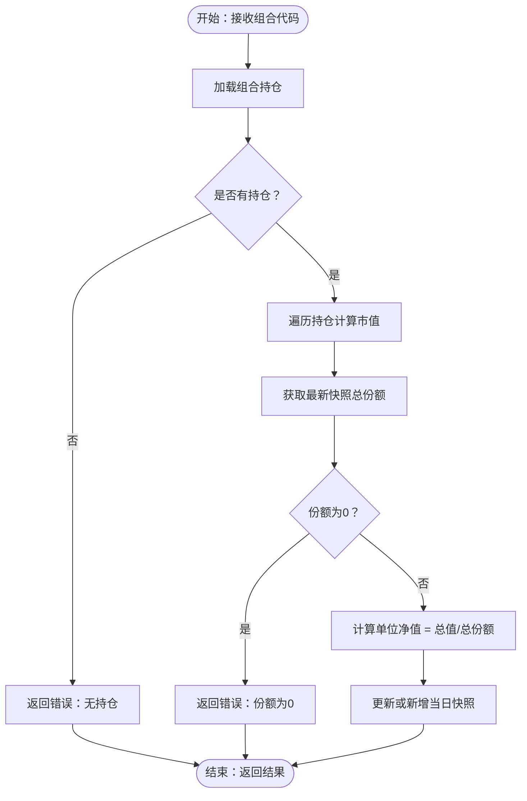
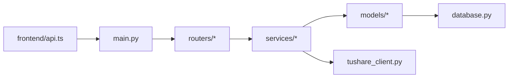

# 数据流设计

<cite>
**本文引用的文件**
- [backend/app/main.py](file://backend/app/main.py)
- [backend/app/config.py](file://backend/app/config.py)
- [backend/app/database.py](file://backend/app/database.py)
- [frontend/src/lib/api.ts](file://frontend/src/lib/api.ts)
- [Docs/04-后端开发.md](file://Docs/04-后端开发.md)
- [backend/app/services/market_data_service.py](file://backend/app/services/market_data_service.py)
- [backend/app/services/tushare_client.py](file://backend/app/services/tushare_client.py)
- [backend/app/routers/market_data.py](file://backend/app/routers/market_data.py)
- [backend/app/models/price_record.py](file://backend/app/models/price_record.py)
- [backend/app/models/portfolio_value_snapshot.py](file://backend/app/models/portfolio_value_snapshot.py)
- [backend/app/models/product.py](file://backend/app/models/product.py)
- [backend/app/routers/products.py](file://backend/app/routers/products.py)
- [backend/app/schemas/market_data.py](file://backend/app/schemas/market_data.py)
- [backend/app/init_tasks.py](file://backend/app/init_tasks.py)
</cite>

## 目录
1. [引言](#引言)
2. [项目结构](#项目结构)
3. [核心组件](#核心组件)
4. [架构总览](#架构总览)
5. [详细组件分析](#详细组件分析)
6. [依赖分析](#依赖分析)
7. [性能考虑](#性能考虑)
8. [故障排查指南](#故障排查指南)
9. [结论](#结论)
10. [附录](#附录)

## 引言
本文件面向 InvestRing 的数据流设计，系统性阐述从用户界面到数据库的完整数据流转过程，覆盖用户操作数据流、外部 API 数据流与内部数据处理流。文档重点说明数据验证、转换与存储机制，实时数据同步流程、批量数据处理与增量更新策略，数据缓存策略、数据一致性保证与错误恢复机制，并给出数据安全传输、数据压缩与网络优化方案。同时提供数据流图与时序图，帮助理解复杂的业务数据处理逻辑。

## 项目结构
后端采用 FastAPI 架构，按功能模块划分路由层、服务层与数据模型层；前端使用 Next.js 与自定义 API 封装，统一拦截请求与响应，集中处理鉴权与错误。

图表来源
- [backend/app/main.py:1-53](file://backend/app/main.py#L1-L53)
- [backend/app/database.py:1-39](file://backend/app/database.py#L1-L39)

章节来源
- [backend/app/main.py:1-53](file://backend/app/main.py#L1-L53)
- [backend/app/config.py:1-37](file://backend/app/config.py#L1-L37)
- [backend/app/database.py:1-39](file://backend/app/database.py#L1-L39)
- [frontend/src/lib/api.ts:1-627](file://frontend/src/lib/api.ts#L1-L627)

## 核心组件
- 应用入口与路由注册：负责初始化数据库表、定时任务，挂载各模块路由。
- 配置中心：集中管理数据库连接串、密钥、Tushare Token、调试开关等。
- 数据库层：连接池、SQLite WAL 模式、会话生命周期管理。
- 前端 API 封装：统一 baseURL、请求头、鉴权令牌附加、响应错误处理与 401 自动跳转。
- 市场数据服务：价格数据查询、同步与组合净值同步；外部 API 客户端封装。
- 数据模型：价格记录、组合净值快照、产品等核心实体。

章节来源
- [backend/app/main.py:1-53](file://backend/app/main.py#L1-L53)
- [backend/app/config.py:1-37](file://backend/app/config.py#L1-L37)
- [backend/app/database.py:1-39](file://backend/app/database.py#L1-L39)
- [frontend/src/lib/api.ts:1-627](file://frontend/src/lib/api.ts#L1-L627)
- [backend/app/services/market_data_service.py:1-323](file://backend/app/services/market_data_service.py#L1-L323)
- [backend/app/models/price_record.py:1-28](file://backend/app/models/price_record.py#L1-L28)
- [backend/app/models/portfolio_value_snapshot.py:1-20](file://backend/app/models/portfolio_value_snapshot.py#L1-L20)
- [backend/app/models/product.py:1-22](file://backend/app/models/product.py#L1-L22)

## 架构总览
系统采用“前端请求 → 后端路由 → 服务层处理 → 数据模型持久化”的标准分层架构。外部数据主要来自 Tushare，通过服务层封装调用与限流，落地到价格记录表；组合净值由服务层聚合持仓与价格计算后写入快照表。

图表来源
- [frontend/src/lib/api.ts:1-627](file://frontend/src/lib/api.ts#L1-L627)
- [backend/app/routers/market_data.py:1-112](file://backend/app/routers/market_data.py#L1-L112)
- [backend/app/services/market_data_service.py:1-323](file://backend/app/services/market_data_service.py#L1-L323)
- [backend/app/services/tushare_client.py:1-222](file://backend/app/services/tushare_client.py#L1-L222)
- [backend/app/models/price_record.py:1-28](file://backend/app/models/price_record.py#L1-L28)
- [backend/app/models/portfolio_value_snapshot.py:1-20](file://backend/app/models/portfolio_value_snapshot.py#L1-L20)

## 详细组件分析

### 用户操作数据流（从前端到数据库）
用户在前端发起操作（如查询价格、同步净值、创建交易等），经 API 封装统一注入 Token，后端路由解析参数与请求体，服务层执行业务逻辑，最终通过 SQLAlchemy 写入数据库。

图表来源
- [frontend/src/lib/api.ts:1-627](file://frontend/src/lib/api.ts#L1-L627)
- [backend/app/routers/market_data.py:1-112](file://backend/app/routers/market_data.py#L1-L112)
- [backend/app/services/market_data_service.py:1-323](file://backend/app/services/market_data_service.py#L1-L323)
- [backend/app/database.py:1-39](file://backend/app/database.py#L1-L39)

章节来源
- [frontend/src/lib/api.ts:1-627](file://frontend/src/lib/api.ts#L1-L627)
- [backend/app/routers/market_data.py:1-112](file://backend/app/routers/market_data.py#L1-L112)
- [backend/app/services/market_data_service.py:1-323](file://backend/app/services/market_data_service.py#L1-L323)

### 外部 API 数据流（Tushare 同步）
系统通过服务层封装 Tushare 客户端，实现交易日历与基金行情/净值的获取，并进行重试与限流控制，随后去重、映射字段并写入价格记录表，同时更新产品数据源状态。

图表来源
- [backend/app/services/market_data_service.py:88-225](file://backend/app/services/market_data_service.py#L88-L225)
- [backend/app/services/tushare_client.py:123-221](file://backend/app/services/tushare_client.py#L123-L221)
- [backend/app/models/price_record.py:1-28](file://backend/app/models/price_record.py#L1-L28)

章节来源
- [backend/app/services/market_data_service.py:88-225](file://backend/app/services/market_data_service.py#L88-L225)
- [backend/app/services/tushare_client.py:123-221](file://backend/app/services/tushare_client.py#L123-L221)
- [backend/app/models/price_record.py:1-28](file://backend/app/models/price_record.py#L1-L28)

### 内部数据处理流（组合净值同步）
服务层根据组合持仓与最新价格计算组合净值，更新或新增当日净值快照，确保单位净值、总份额与总值一致。

图表来源
- [backend/app/services/market_data_service.py:228-320](file://backend/app/services/market_data_service.py#L228-L320)
- [backend/app/models/portfolio_value_snapshot.py:1-20](file://backend/app/models/portfolio_value_snapshot.py#L1-L20)

章节来源
- [backend/app/services/market_data_service.py:228-320](file://backend/app/services/market_data_service.py#L228-L320)
- [backend/app/models/portfolio_value_snapshot.py:1-20](file://backend/app/models/portfolio_value_snapshot.py#L1-L20)

### 数据验证、转换与存储机制
- 输入验证：路由层对日期范围、分页参数、限额等进行约束；服务层对产品/组合存在性、市场类型合法性进行校验。
- 数据转换：外部数据映射为内部字段（如 trade_date → date、close/unit_nav → unit_price），并做去重处理。
- 存储策略：使用 SQLAlchemy ORM，通过唯一约束避免重复；事务提交与回滚保证一致性；SQLite 使用 WAL 模式提升并发与可靠性。

章节来源
- [backend/app/routers/market_data.py:17-112](file://backend/app/routers/market_data.py#L17-L112)
- [backend/app/services/market_data_service.py:15-54](file://backend/app/services/market_data_service.py#L15-L54)
- [backend/app/models/price_record.py:1-28](file://backend/app/models/price_record.py#L1-L28)
- [backend/app/database.py:18-39](file://backend/app/database.py#L18-L39)

### 实时数据同步、批量处理与增量更新
- 实时同步：组合净值同步接口按持仓与最新价格实时计算并落库，满足前端展示与后续计算需求。
- 批量处理：批量调仓接口支持一次性提交多笔交易，服务层原子性处理并返回汇总结果。
- 增量更新：价格同步接口支持指定日期区间增量拉取与写入，避免全量重复导入。

章节来源
- [backend/app/services/market_data_service.py:228-320](file://backend/app/services/market_data_service.py#L228-L320)
- [backend/app/routers/market_data.py:95-112](file://backend/app/routers/market_data.py#L95-L112)
- [Docs/04-后端开发.md:494-540](file://Docs/04-后端开发.md#L494-L540)

### 数据缓存策略、一致性与错误恢复
- 缓存策略：服务层对某市场某产品的历史记录在内存构建映射，减少重复查询，提高写入效率。
- 一致性：通过事务提交与回滚、唯一约束、快照主键约束保障数据一致性；产品数据源状态字段用于外部数据可用性标记。
- 错误恢复：外部 API 调用具备重试机制；服务层捕获异常并回滚，更新产品状态为失败；前端统一 401 跳转与错误提示。

章节来源
- [backend/app/services/market_data_service.py:157-214](file://backend/app/services/market_data_service.py#L157-L214)
- [backend/app/services/tushare_client.py:69-86](file://backend/app/services/tushare_client.py#L69-L86)
- [frontend/src/lib/api.ts:67-79](file://frontend/src/lib/api.ts#L67-L79)

### 数据安全传输、压缩与网络优化
- 安全传输：前端 axios 实例统一注入 Authorization 头；后端路由对除登录外接口均要求认证；配置中心集中管理密钥。
- 压缩与优化：当前未见显式压缩配置；可在网关或服务端启用 gzip/br 压缩；前端请求超时与拦截器统一处理错误，降低无效重试。

章节来源
- [frontend/src/lib/api.ts:42-48](file://frontend/src/lib/api.ts#L42-L48)
- [frontend/src/lib/api.ts:50-79](file://frontend/src/lib/api.ts#L50-L79)
- [backend/app/config.py:14-16](file://backend/app/config.py#L14-L16)

## 依赖分析
后端模块间依赖清晰：路由层依赖服务层，服务层依赖数据模型与外部客户端；数据库层通过连接池对外提供会话；前端通过统一 API 封装与后端交互。

图表来源
- [backend/app/main.py:1-53](file://backend/app/main.py#L1-L53)
- [backend/app/routers/market_data.py:1-112](file://backend/app/routers/market_data.py#L1-L112)
- [backend/app/services/market_data_service.py:1-323](file://backend/app/services/market_data_service.py#L1-L323)
- [backend/app/services/tushare_client.py:1-222](file://backend/app/services/tushare_client.py#L1-L222)
- [backend/app/database.py:1-39](file://backend/app/database.py#L1-L39)
- [frontend/src/lib/api.ts:1-627](file://frontend/src/lib/api.ts#L1-L627)

章节来源
- [backend/app/main.py:1-53](file://backend/app/main.py#L1-L53)
- [backend/app/routers/market_data.py:1-112](file://backend/app/routers/market_data.py#L1-L112)
- [backend/app/services/market_data_service.py:1-323](file://backend/app/services/market_data_service.py#L1-L323)
- [backend/app/services/tushare_client.py:1-222](file://backend/app/services/tushare_client.py#L1-L222)
- [backend/app/database.py:1-39](file://backend/app/database.py#L1-L39)
- [frontend/src/lib/api.ts:1-627](file://frontend/src/lib/api.ts#L1-L627)

## 性能考虑
- 连接池与并发：数据库连接池参数与 pool_pre_ping、pool_recycle 有助于维持长连接健康与回收，适合高并发场景。
- 写入优化：服务层对历史记录构建内存映射，减少重复查询；写入采用批量更新/新增，降低锁竞争。
- 外部调用：Tushare 客户端实现指数退避重试与最大调用频次控制，避免被限流。
- 前端体验：统一超时与错误拦截，减少无效请求；分页与限额参数控制单次返回量，避免大响应阻塞。

章节来源
- [backend/app/database.py:7-16](file://backend/app/database.py#L7-L16)
- [backend/app/services/market_data_service.py:157-214](file://backend/app/services/market_data_service.py#L157-L214)
- [backend/app/services/tushare_client.py:69-86](file://backend/app/services/tushare_client.py#L69-L86)
- [frontend/src/lib/api.ts:42-48](file://frontend/src/lib/api.ts#L42-L48)

## 故障排查指南
- 外部 API 失败：检查 Tushare Token 配置与网络连通；查看服务层异常捕获与产品数据源状态更新。
- 写入异常：确认事务回滚逻辑与唯一约束冲突；检查日期格式与字段映射。
- 前端 401：确认本地 Token 是否存在与过期；检查拦截器是否正确附加 Authorization 头。
- 定时任务：确认初始化任务是否成功写入核心任务记录；核对 cron 表达式与调度器状态。

章节来源
- [backend/app/services/tushare_client.py:38-46](file://backend/app/services/tushare_client.py#L38-L46)
- [backend/app/services/market_data_service.py:210-214](file://backend/app/services/market_data_service.py#L210-L214)
- [frontend/src/lib/api.ts:67-79](file://frontend/src/lib/api.ts#L67-L79)
- [backend/app/init_tasks.py:5-45](file://backend/app/init_tasks.py#L5-L45)

## 结论
InvestRing 的数据流设计遵循清晰的分层与职责分离：前端统一接入与错误处理，后端路由与服务层完成业务编排与数据一致性保障，外部数据通过受控客户端接入并落库。通过连接池、内存映射、事务与唯一约束等手段，系统在性能与一致性之间取得平衡；结合统一鉴权、错误拦截与定时任务初始化，形成完整的数据闭环与可观测性基础。

## 附录
- 接口与业务要点参考：后端开发文档中对各模块接口、业务规则与限流策略有详细说明，可作为接口使用与问题定位的重要依据。

章节来源
- [Docs/04-后端开发.md:1-1000](file://Docs/04-后端开发.md#L1-L1000)