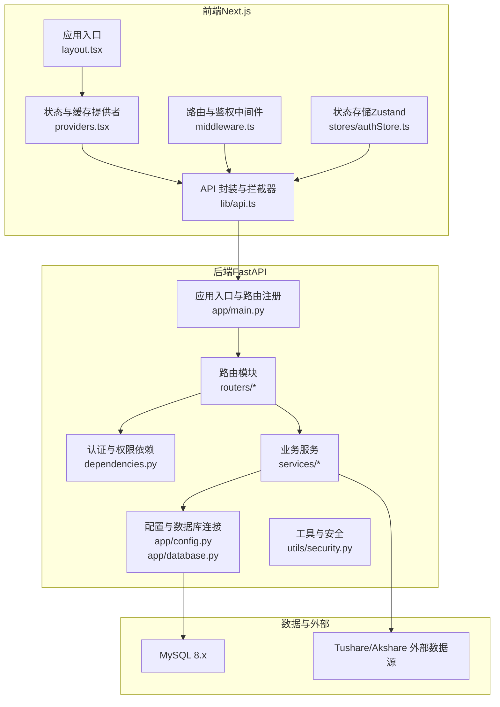
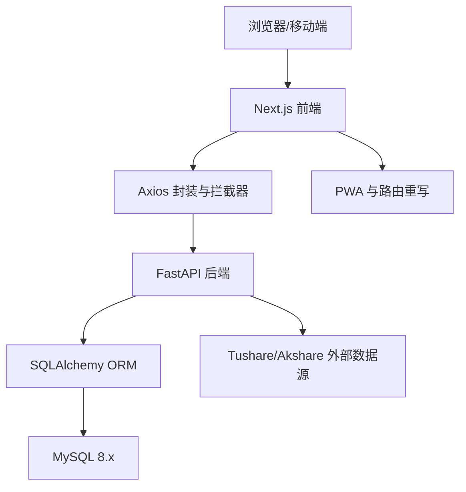
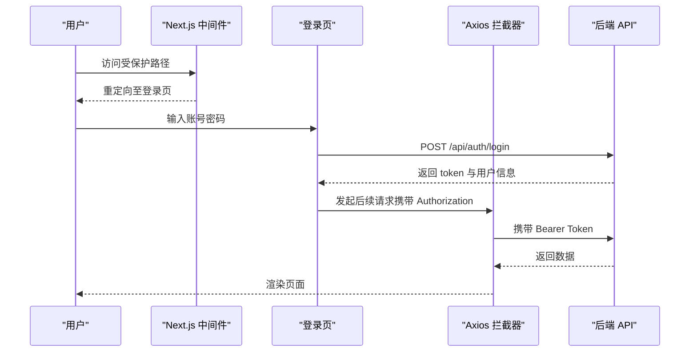
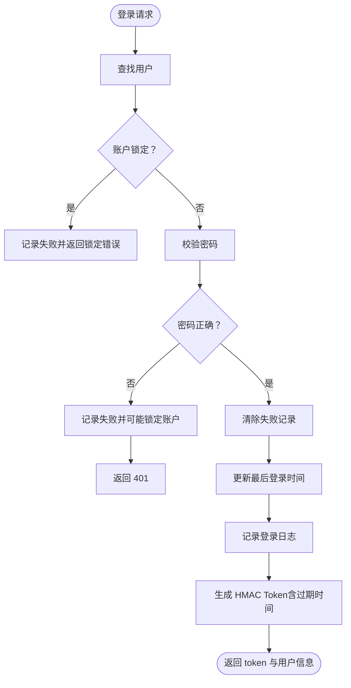
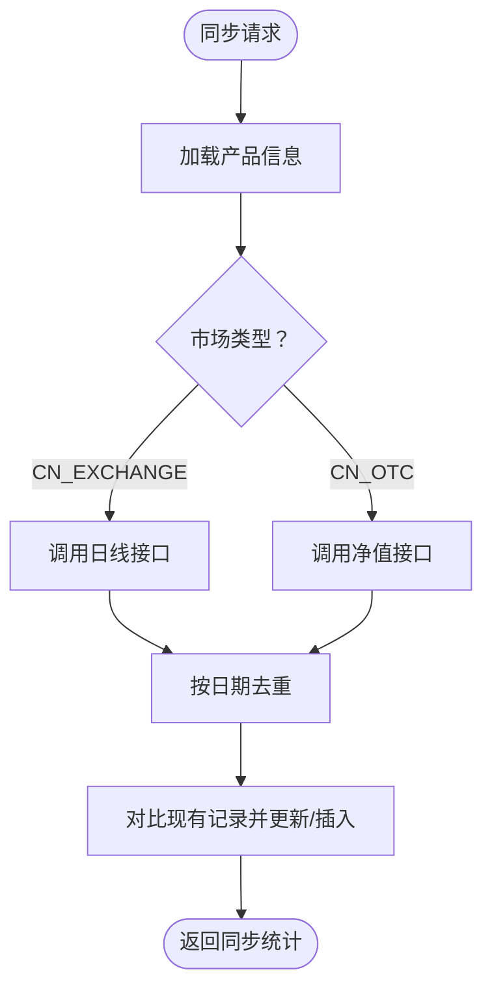
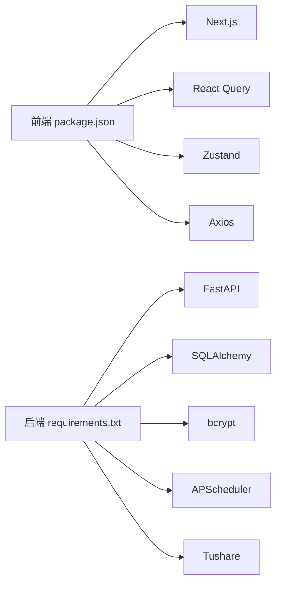

# 整体架构设计

<cite>
**本文引用的文件**
- [Docs/00-开发总览.md](file://Docs/00-开发总览.md)
- [backend/app/main.py](file://backend/app/main.py)
- [backend/app/config.py](file://backend/app/config.py)
- [backend/app/database.py](file://backend/app/database.py)
- [backend/app/routers/auth.py](file://backend/app/routers/auth.py)
- [backend/app/dependencies.py](file://backend/app/dependencies.py)
- [backend/app/utils/security.py](file://backend/app/utils/security.py)
- [backend/app/services/market_data_service.py](file://backend/app/services/market_data_service.py)
- [backend/requirements.txt](file://backend/requirements.txt)
- [frontend/src/app/layout.tsx](file://frontend/src/app/layout.tsx)
- [frontend/src/app/providers.tsx](file://frontend/src/app/providers.tsx)
- [frontend/src/middleware.ts](file://frontend/src/middleware.ts)
- [frontend/src/lib/api.ts](file://frontend/src/lib/api.ts)
- [frontend/next.config.js](file://frontend/next.config.js)
- [frontend/package.json](file://frontend/package.json)
- [frontend/src/stores/authStore.ts](file://frontend/src/stores/authStore.ts)
- [Docs/02-数据库设计.md](file://Docs/02-数据库设计.md)
</cite>

## 目录
1. [简介](#简介)
2. [项目结构](#项目结构)
3. [核心组件](#核心组件)
4. [架构总览](#架构总览)
5. [详细组件分析](#详细组件分析)
6. [依赖分析](#依赖分析)
7. [性能考虑](#性能考虑)
8. [故障排查指南](#故障排查指南)
9. [结论](#结论)
10. [附录](#附录)

## 简介
InvestRing 是一个面向家庭的投资组合管理系统，采用前后端分离架构：前端基于 Next.js 14（App Router），后端基于 FastAPI，数据库为 MySQL 8.x。系统通过 REST API 进行通信，支持移动端与 PC 端双路径访问，并提供 PWA 能力。后端采用 HMAC Token 认证与权限控制，结合登录日志与审计日志实现安全与合规；前端使用 Zustand + React Query 实现状态管理与数据缓存。

## 项目结构
项目分为三层：
- 前端层（Next.js App Router）：负责页面渲染、状态管理、PWA 与路由重写。
- 后端层（FastAPI）：提供 REST API、认证授权、业务服务与定时任务。
- 数据层（MySQL 8.x）：持久化业务数据与日志，配合 SQLAlchemy ORM。

图表来源
- [frontend/src/app/layout.tsx:1-32](file://frontend/src/app/layout.tsx#L1-L32)
- [frontend/src/app/providers.tsx:1-28](file://frontend/src/app/providers.tsx#L1-L28)
- [frontend/src/middleware.ts:1-40](file://frontend/src/middleware.ts#L1-L40)
- [frontend/src/lib/api.ts:1-627](file://frontend/src/lib/api.ts#L1-L627)
- [frontend/src/stores/authStore.ts:1-71](file://frontend/src/stores/authStore.ts#L1-L71)
- [backend/app/main.py:1-53](file://backend/app/main.py#L1-L53)
- [backend/app/config.py:1-37](file://backend/app/config.py#L1-L37)
- [backend/app/database.py:1-39](file://backend/app/database.py#L1-L39)
- [backend/app/routers/auth.py:1-186](file://backend/app/routers/auth.py#L1-L186)
- [backend/app/dependencies.py:1-146](file://backend/app/dependencies.py#L1-L146)
- [backend/app/utils/security.py:1-103](file://backend/app/utils/security.py#L1-L103)
- [backend/app/services/market_data_service.py:1-200](file://backend/app/services/market_data_service.py#L1-L200)

章节来源
- [Docs/00-开发总览.md:16-51](file://Docs/00-开发总览.md#L16-L51)
- [frontend/next.config.js:1-16](file://frontend/next.config.js#L1-L16)
- [backend/app/main.py:1-53](file://backend/app/main.py#L1-L53)

## 核心组件
- 前端应用与布局：Next.js 应用入口与全局样式、PWA 清单配置。
- 状态与缓存：React Query 提供数据请求缓存与失效策略；Zustand 管理认证状态与持久化。
- 中间件与路由：自动识别移动端/PC端路径，统一跳转与登录保护。
- API 封装：Axios 实例封装、请求/响应拦截器、统一错误处理。
- 后端应用：FastAPI 应用初始化、CORS、路由注册与根路径响应。
- 配置与数据库：环境变量驱动的数据库连接、连接池参数、SQLAlchemy 初始化。
- 认证与权限：HMAC Token 生成与校验、黑名单、登录失败追踪、账户锁定、依赖注入获取当前用户与管理员。
- 业务服务：市场数据同步（Tushare/Akshare）、价格查询与去重、批量回测与快照校验。
- 数据模型与日志：21 张表覆盖核心业务、日志与幂等缓存，支撑净值与份额计算。

章节来源
- [frontend/src/app/layout.tsx:1-32](file://frontend/src/app/layout.tsx#L1-L32)
- [frontend/src/app/providers.tsx:1-28](file://frontend/src/app/providers.tsx#L1-L28)
- [frontend/src/middleware.ts:1-40](file://frontend/src/middleware.ts#L1-L40)
- [frontend/src/lib/api.ts:1-627](file://frontend/src/lib/api.ts#L1-L627)
- [frontend/src/stores/authStore.ts:1-71](file://frontend/src/stores/authStore.ts#L1-L71)
- [backend/app/main.py:1-53](file://backend/app/main.py#L1-L53)
- [backend/app/config.py:1-37](file://backend/app/config.py#L1-L37)
- [backend/app/database.py:1-39](file://backend/app/database.py#L1-L39)
- [backend/app/routers/auth.py:1-186](file://backend/app/routers/auth.py#L1-L186)
- [backend/app/dependencies.py:1-146](file://backend/app/dependencies.py#L1-L146)
- [backend/app/utils/security.py:1-103](file://backend/app/utils/security.py#L1-L103)
- [backend/app/services/market_data_service.py:1-200](file://backend/app/services/market_data_service.py#L1-L200)
- [Docs/02-数据库设计.md:1-200](file://Docs/02-数据库设计.md#L1-L200)

## 架构总览
系统采用“前后端分离 + 微服务理念”的架构模式：
- 前端：Next.js App Router 提供页面级路由与数据拉取，React Query 缓存与刷新策略，Zustand 管理登录态与 UI 状态。
- 后端：FastAPI 提供 REST API，按领域模块划分路由，依赖注入实现认证与权限控制，服务层封装业务逻辑。
- 数据层：MySQL 8.x 存储业务与日志数据，SQLAlchemy 管理连接池与事务。
- 外部集成：Tushare/Akshare 提供市场数据，支持不同市场的价格与净值同步。

图表来源
- [frontend/src/lib/api.ts:1-627](file://frontend/src/lib/api.ts#L1-L627)
- [frontend/next.config.js:1-16](file://frontend/next.config.js#L1-L16)
- [backend/app/main.py:1-53](file://backend/app/main.py#L1-L53)
- [backend/app/database.py:1-39](file://backend/app/database.py#L1-L39)
- [backend/app/services/market_data_service.py:1-200](file://backend/app/services/market_data_service.py#L1-L200)

## 详细组件分析

### 前端集成与状态管理
- 应用布局与全局样式：根布局负责 PWA 清单与全局样式注入。
- 状态与缓存提供者：React Query 默认缓存策略（staleTime、重试次数），Toast 组件统一提示。
- 中间件：自动识别移动端/PC端路径，未登录访问受保护路径时重定向至登录页。
- API 封装：统一 base URL、请求头注入 Token、401 自动清空本地 Token 并跳转登录。
- 状态存储：Zustand 管理 token、用户信息与登录状态，支持持久化。

图表来源
- [frontend/src/middleware.ts:1-40](file://frontend/src/middleware.ts#L1-L40)
- [frontend/src/lib/api.ts:1-627](file://frontend/src/lib/api.ts#L1-L627)
- [backend/app/routers/auth.py:1-186](file://backend/app/routers/auth.py#L1-L186)

章节来源
- [frontend/src/app/layout.tsx:1-32](file://frontend/src/app/layout.tsx#L1-L32)
- [frontend/src/app/providers.tsx:1-28](file://frontend/src/app/providers.tsx#L1-L28)
- [frontend/src/middleware.ts:1-40](file://frontend/src/middleware.ts#L1-L40)
- [frontend/src/lib/api.ts:1-627](file://frontend/src/lib/api.ts#L1-L627)
- [frontend/src/stores/authStore.ts:1-71](file://frontend/src/stores/authStore.ts#L1-L71)

### 后端认证与权限控制
- 认证流程：登录校验密码、账户锁定检查、生成 Token、记录登录日志；登出将 Token 加入黑名单。
- 权限控制：依赖注入获取当前用户与管理员用户，支持装饰器校验。
- 安全工具：HMAC Token 生成与解码、密码哈希与校验、登录失败追踪与账户锁定。

图表来源
- [backend/app/routers/auth.py:1-186](file://backend/app/routers/auth.py#L1-L186)
- [backend/app/utils/security.py:1-103](file://backend/app/utils/security.py#L1-L103)
- [backend/app/dependencies.py:1-146](file://backend/app/dependencies.py#L1-L146)

章节来源
- [backend/app/routers/auth.py:1-186](file://backend/app/routers/auth.py#L1-L186)
- [backend/app/dependencies.py:1-146](file://backend/app/dependencies.py#L1-L146)
- [backend/app/utils/security.py:1-103](file://backend/app/utils/security.py#L1-L103)

### 市场数据服务与外部集成
- 价格查询：支持按日期范围与限制条数查询价格记录，支持“指定日期或之前”的最新价格。
- 数据同步：根据产品与市场类型调用 Tushare 接口，对重复日期去重，更新或新增价格记录。
- 错误处理：捕获外部 API 异常并返回结构化结果，避免中断业务流程。

图表来源
- [backend/app/services/market_data_service.py:1-200](file://backend/app/services/market_data_service.py#L1-L200)

章节来源
- [backend/app/services/market_data_service.py:1-200](file://backend/app/services/market_data_service.py#L1-L200)

### 数据库与模型边界
- 数据库配置：连接池大小、预检查、回收时间等参数，支持 SQLite WAL 模式兼容。
- 模型与表：涵盖投资人、组合、份额、交易、产品、平台、交易日历、日志与幂等缓存等。
- 计算与约束：净值与份额计算规则、冻结份额与可用份额实时计算、成本价加权平均等。

章节来源
- [backend/app/database.py:1-39](file://backend/app/database.py#L1-L39)
- [Docs/02-数据库设计.md:1-200](file://Docs/02-数据库设计.md#L1-L200)

## 依赖分析
- 前端依赖：Next.js、React Query、Zustand、TailwindCSS、Radix UI、Axios 等。
- 后端依赖：FastAPI、SQLAlchemy、Pydantic、Pydantic Settings、bcrypt、APScheduler、Tushare、PyMySQL 等。
- 集成点：前端通过 next.config.js 的 rewrites 将 /api 转发至后端；后端通过 HMAC Token 与数据库交互。

图表来源
- [frontend/package.json:1-45](file://frontend/package.json#L1-L45)
- [backend/requirements.txt:1-19](file://backend/requirements.txt#L1-L19)

章节来源
- [frontend/package.json:1-45](file://frontend/package.json#L1-L45)
- [backend/requirements.txt:1-19](file://backend/requirements.txt#L1-L19)
- [frontend/next.config.js:1-16](file://frontend/next.config.js#L1-L16)

## 性能考虑
- 前端缓存：React Query 默认 staleTime 与重试策略，减少重复请求；Axios 统一超时与拦截器降低错误传播成本。
- 后端连接池：SQLAlchemy 连接池参数与 pre_ping、recycle，提升并发与稳定性。
- 外部数据：Tushare 接口去重与批量更新，避免重复写入；按日期范围限制同步量。
- 路由与重写：Next.js rewrites 将 /api 直达后端，减少反向代理层级开销。
- 移动端优先：中间件自动分流移动端/PC端路径，避免重复渲染与资源浪费。

## 故障排查指南
- 登录失败与锁定：检查登录失败追踪与账户锁定逻辑，确认是否触发 15 分钟锁定窗口。
- Token 失效：确认 HMAC Token 是否过期或加入黑名单；前端 401 自动清理本地 Token。
- 数据同步异常：查看市场数据服务对外部接口的异常捕获与返回信息，定位具体市场类型与日期范围。
- 数据库连接问题：核对数据库 URL、连接池参数与预检查设置；SQLite 模式下 WAL 参数生效。
- 前端路由跳转：确认中间件匹配规则与登录页路径，确保移动端/PC端路径正确重定向。

章节来源
- [backend/app/utils/security.py:1-103](file://backend/app/utils/security.py#L1-L103)
- [backend/app/routers/auth.py:1-186](file://backend/app/routers/auth.py#L1-L186)
- [backend/app/services/market_data_service.py:1-200](file://backend/app/services/market_data_service.py#L1-L200)
- [backend/app/database.py:1-39](file://backend/app/database.py#L1-L39)
- [frontend/src/middleware.ts:1-40](file://frontend/src/middleware.ts#L1-L40)

## 结论
InvestRing 通过前后端分离与微服务理念实现了清晰的职责划分：前端专注用户体验与数据展示，后端专注业务逻辑与数据一致性，数据库承载核心业务与审计日志。系统具备完善的认证与权限控制、可扩展的外部数据集成、以及针对性能与可用性的工程化实践。建议在生产环境中进一步完善监控告警、API 限流与缓存策略，并持续优化外部数据同步的幂等性与一致性。

## 附录
- 技术栈与版本：前端 Next.js 14、shadcn/ui + TailwindCSS；后端 FastAPI、SQLAlchemy、Pydantic、APScheduler；数据库 MySQL 8.x。
- API 数量与模块：75 个 API 接口，覆盖认证、投资人、组合、产品、交易、份额变动事件、市场数据、日志与任务等模块。
- 数据库表：21 张核心表，包含业务主表、日志表与幂等缓存表，支撑净值与份额的复杂计算。

章节来源
- [Docs/00-开发总览.md:16-51](file://Docs/00-开发总览.md#L16-L51)
- [Docs/00-开发总览.md:75-137](file://Docs/00-开发总览.md#L75-L137)
- [Docs/02-数据库设计.md:1-200](file://Docs/02-数据库设计.md#L1-L200)